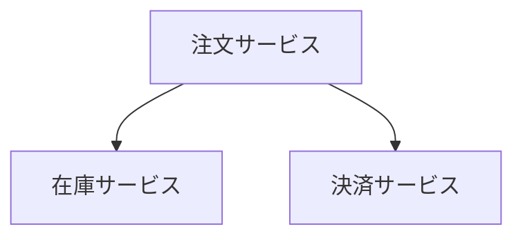

# Mermaid ベストプラクティス

## 有効な図タイプ

graph, flowchart, sequenceDiagram, classDiagram, stateDiagram, erDiagram,
journey, gantt, pie, mindmap, timeline, C4Context

## 日本語テキスト

日本語テキストを含むノードは必ずクォートで囲む:

## ノードID命名

- 英語の短縮形を使用: `OrderSvc`, `InventoryDB`
- 日本語はラベルに使用、IDには使用しない
- 一意で説明的なID

## よくある構文エラー

| エラー | 原因 | 修正 |
|--------|------|------|
| 括弧の不一致 | `[` と `]` の数が合わない | 開閉を確認 |
| 矢印構文 | `->` ではなく `-->` | 正しい矢印を使用 |
| 特殊文字 | ラベル内の `(`, `)` | クォートで囲む |
| 空ブロック | `\`\`\`mermaid` の直後に `\`\`\`` | 内容を追加 |

## 複雑度ガイドライン

- 1つの図に含めるノード: 最大20個
- 複雑な図は分割して参照関係を示す
- サブグラフを活用して論理グループ化
