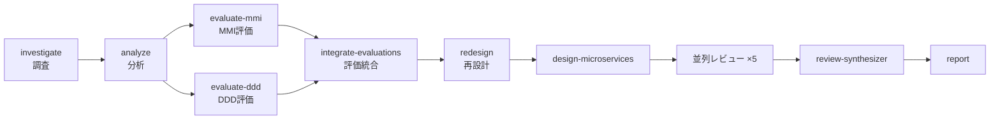

# nexus-architect の解析メカニズム — 既存の設計・コードをどう解析しているか

nexus-architect（architect プラグイン）が、既存システムのコードや設計ドキュメントを
**どのような仕組みで解析し、評価レポートに落とし込んでいるか** を解説するドキュメントです。

対象読者: nexus-architect を使う（または仕組みを知りたい）エンジニア・アーキテクト。

---

## 1. 全体像 — 「スキル」がパイプラインを構成する

nexus-architect はアプリケーションではなく、**約90個のスキル指示書（SKILL.md）の集合体**です。
各スキルは「望ましい成果物 → 判断基準 → 前提入力 → 実行手順 → 出力ファイル」を定めた
自己完結の指示書で、Claude Code がそれを読み込んで実行エージェントとして振る舞います。

解析は単発ではなく、**依存関係グラフ（`skills/common/skill-dependencies.yaml`）に従った
パイプライン**として実行されます:



各フェーズは**前フェーズの出力ファイルを入力として読む**設計になっており、
中間成果物はすべて `reports/` 配下の Markdown として即時書き出されます
（Immediate Output ルール — 中断・再開・並列化を可能にするため）。
進捗は `work/pipeline-progress.json` に記録され、途中から再開できます。

## 2. 解析の入口は2つ — コードと設計ドキュメント

| 入口 | スキル | 解析対象 |
|------|--------|----------|
| レガシーパス | `/architect:investigate` | 既存コードベース（target_path） |
| グリーンフィールド/設計書パス | `/architect:define-requirements --input=<file\|dir>` | RFP・議事録・既存設計書・業務フロー図（Markdown/テキスト/PDF） |

2つは排他ではなく、legacy パスでは investigate の出力が define-requirements に
自動で入力として合流します。

### 設計ドキュメント解析の原則（define-requirements）

- **Intake → ギャップ分析**: まず全入力ドキュメントを読み切り、要件テンプレートの各項目を
  「資料で回答済み / 未回答」に分類したギャップリストを作る。
- **Gap-driven elicitation**: ヒアリングは未回答項目だけ。資料が既に答えている内容を再質問しない。
- **Never fabricate**: すべての要件は入力ドキュメント・既存成果物・ユーザー回答のいずれかに
  根拠を持つ。不明値は捏造しない。
- **Ask before TBD**: 資料で埋まらない項目は AskUserQuestion で質問する（候補 2〜4 個 +
  自動付与の「Other」による自由入力）。`TBD` として Open Questions に記録されるのは、
  保留・その場では回答不能・`--auto` で未質問のいずれかに該当するものだけ
  （@rules/open-questions.md）。

## 3. コード解析の道具立て — AST 優先のツール階層

コードを読む際は、精度とコンテキスト効率の順にツールを使い分けます:

1. **Serena MCP**（最優先） — `get_symbols_overview` / `find_symbol` /
   `find_referencing_symbols` による **AST（構文木）ベースのシンボル解析**。
   テキスト検索ではなく言語サーバー相当の構造理解で、クラス・メソッド・参照関係を辿る。
2. **Glob / Grep** — ファイルパターン探索、ドメイン用語や設定キーの横断検索。
3. **Read** — 設定ファイル・依存定義（build.gradle 等）・テストコードの精読。
4. **Task（サブエージェント）** — 大規模コードベースでの並列探索。
   メインのコンテキストウィンドウを守るため、探索・要約をサブエージェントに委譲する
   （パターン集: `skills/common/sub-agent-patterns.md` — 構造調査、前フェーズ出力の取り込み、
   エンティティ抽出、制約充足検証など8パターン）。

## 4. Phase 1: investigate — コードベースの一次調査

対象コードベースから4本の調査レポートを生成します:

| レポート | 内容 |
|----------|------|
| technology-stack.md | 言語・フレームワーク・ライブラリ・外部サービスの棚卸し |
| codebase-structure.md | ディレクトリ構成、モジュール構造、エントリポイント |
| issues-and-debt.md | 技術的負債（`SEC-xx` / `DEBT-xx`、CRITICAL/High/Medium/Low 分類） |
| ddd-readiness.md | DDD 移行準備度（12基準スコアリング） |

数値の一貫性を守る手順が明示されているのが特徴です:
**本文の個別項目を先に書き、集計表は後から数える**（先にサマリ表を書くと本文と食い違う、
というアンチパターンを明示的に禁止）。スコアも「個別基準を採点 → 定義式で合算」の順で、
総合点を独立に見積もることを禁じています。

## 5. Phase 2: analyze — ドメイン知識の構造化

investigate の出力を前提に、コードから**ドメイン知識**を抽出します:

- **ユビキタス言語辞書**（20語以上） — ドメイン用語と定義、コード上の対応名、使用文脈
- **アクター・ロール・権限マトリクス**
- **ドメイン-コード対応表** — ドメイン概念がコードのどこに実装されているか、
  同一概念の別名（naming drift）、コードに反映されていない概念のギャップ検出
- ビジネスルールの実装箇所の追跡

ここで Serena の `find_referencing_symbols` が効きます — 用語のコード上の対応を
文字列一致ではなくシンボル参照で確認します。

## 6. Phase 3: 評価 — 並列サブエージェントによる多軸スコアリング

評価フェーズの最大の特徴は、**評価軸ごとに独立したサブエージェントを並列に走らせ、
JSON で回収して定義式で合成する**構造です。軸ごとに独立させることで、
評価間の引きずられ（halo effect）を避け、根拠（rationale）を軸単位で残します。

### MMI 評価（evaluate-mmi）— 4軸 × 全モジュール

4つのサブエージェントを1メッセージで同時起動し、それぞれが全モジュールを
1軸だけ採点します（1–5点、根拠付き JSON を返却）:

```
MMI = (0.30×凝集度 + 0.30×結合度 + 0.20×独立性 + 0.20×再利用性) / 5 × 100
```

| MMI | 判定 |
|-----|------|
| 80–100 | Mature — マイクロサービス移行可能 |
| 60–80 | Moderate — 部分リファクタリング後に移行可能 |
| 40–60 | Needs Improvement — 大規模リファクタリング必要 |
| 0–40 | Immature — 根本的な再設計が必要 |

### DDD 評価（evaluate-ddd）— 3層 × 12基準

3つのサブエージェント（戦略的設計3基準 / 戦術的設計6基準 / アーキテクチャ3基準)を並列起動:

```
DDD Score = (0.30×戦略平均 + 0.45×戦術平均 + 0.25×アーキテクチャ平均) / 5 × 100
```

- 戦略的設計 (30%): ユビキタス言語、境界づけられたコンテキスト、サブドメイン分類
- 戦術的設計 (45%): 値オブジェクト、エンティティ、集約、リポジトリ、ドメインサービス、ドメインイベント
- アーキテクチャ (25%): レイヤリング、依存方向（DIP）、Ports & Adapters

### integrate-evaluations

MMI と DDD の結果を統合し、矛盾を解消して統一改善計画
（`unified-improvement-plan.md`）を生成。以降の再設計フェーズの入力になります。

## 7. 内部ロジック — どう読み、どう採点しているか

### 7.1 コード: シンボルと参照関係のたどり方

Serena MCP は対象言語の言語サーバー（LSP）を介して、コードをテキストではなく
**シンボル表**として扱う。読解は3段階で進む:

1. `get_symbols_overview` — ファイル/ディレクトリのシンボル一覧（クラス・メソッド・関数）を
   取得し、**全文を読まずに構造だけを把握する**
2. `find_symbol` — 名前パス（`OrderService/reserve` など）でシンボルの定義位置を特定する
3. `find_referencing_symbols` — そのシンボルを**参照している箇所を静的解決で列挙する**

grep と違い参照はスコープ解決されるため、同名の別シンボルを混同しない。これで可能になること:

- **呼び出し関係・依存方向の実測** — DDD 基準11「依存方向」は、ドメイン層のシンボルが
  インフラ層のシンボルを参照していないかを参照リストで確認できる
- **別名実装（naming drift）の検出** — ユビキタス言語の用語をコード名にマップし、
  参照グラフが分断された同概念の二重実装（例: `AllocationService#reserve` と
  `StockKeeper#secure`）を突き止める
- **結合度の証拠** — モジュール間参照の fan-in / fan-out が MMI 結合度軸の根拠になる

これを実現している指示文（`skills/analyze/SKILL.md`）:

> - **Serena MCP** — Symbol relationship analysis via `find_symbol`, `find_referencing_symbols` (preferred)
> - Cross-reference ubiquitous language with actual naming in the code
> - Detect cases where the same concept uses different names

### 7.2 評価: 2段階 + ルーブリック採点

評価サブエージェントは**コードを直接見ない**。調査・分析フェーズが文書化した証拠
（`reports/01_analysis/**`）を Read で読み、ルーブリックに沿って採点する **2段階構成**。
コード読解（Serena）→ 証拠の文書化（investigate / analyze）→ 文書に基づく採点（evaluate-*）
という証拠の連鎖になっており、採点の根拠は常にファイルとして残る。

- 各サブエージェントのプロンプトには、1–5点それぞれの**行動基準（アンカー）**が文章で
  埋め込まれている。evaluate-mmi の凝集度軸の例:

> - 5 (Exemplary): Single clear responsibility, all components tightly related, no leakage
> - 3 (Acceptable): Some mixed responsibilities, identifiable but imperfect boundaries
> - 1 (Critical): No clear responsibility, god-class or utility-dumping-ground pattern

- 出力は「Return ONLY this JSON」で構造化を強制され、`score` に加えて `rationale`
  （根拠1–2文、DDD では `findings` も）が必須。**根拠のない点数は返せない**。
- スコアの合成は LLM に任せず、オーケストレーターが `rules/evaluation-frameworks.md` の
  定義式で算術的に行う（LLM が判断するのは個別基準の1–5点まで）。
- 軸・層ごとに独立サブエージェントへ分けるのは、他の軸の印象に採点が引きずられる
  **ハロー効果を避ける**ため。「In a **single message**, issue all four Task() calls
  simultaneously」という指示が並列独立性を担保する。

### 7.3 設計書: テンプレート突合とギャップ駆動の解釈

define-requirements は設計書・RFP・議事録の文章を次のロジックで評価する:

1. **テンプレート突合** — 読み切った全文書を要件テンプレートの項目（業務コンテキスト /
   FR / NFR / データ / 整合性 / 制約）に対応付け、項目ごとに「回答した文があるか」で
   answered / unanswered に分類してギャップリストを作る。解釈の単位は文書ではなく
   **テンプレート項目**であり、資料のどの文が根拠かが常に紐づく
2. **業務プロセス単位の整合性分類** — 「システム全体で ACID か」とは問わず、業務プロセス
   ごとに Strong Consistency (ACID) / Eventual Consistency (Saga) / Local Tx を判定する
3. **数値の非交渉** — レイテンシ・スループット・RPO/RTO などの数値目標は文章からの推測を
   許さず、明記がなければ確認し、得られなければ質問文つきの TBD として記録する
4. **決定木による適用判断** — Scalar 製品の適用可否は、トランザクション要件マトリクスに
   対して決定木を歩き、必要なら XA 比較表を埋めて判定する（自由裁量ではなく手順）

#### 7.3.1 処理列の詳細 — Intake から書き戻しまで

実行手順（`skills/define-requirements/SKILL.md` Execution Steps）を分解すると:

**Step 1: Intake** — `--input` の Markdown / テキスト / PDF を全て読む。`target_path` が
あれば Glob/Grep で技術スタック・DB 使用・外部連携も調べる。既存成果物
（investigate の `reports/before/`、product パイプラインの `reports/00_core/` 等）を
自動検出して入力に合流させる。product 連携時は `feature-list.md` の `FEAT-` を `FR-` へ
変換してリンクを記録し、**product の `NFR-` ID は付番し直さずそのまま再利用**する —
ビジョン（`VIS-`）から NFR まで単一のトレース鎖を保つため。

**Step 2: 5段階ヒアリング** — ギャップリストの未回答項目だけを、AskUserQuestion で
**各段階最大3問**ずつ確認する。回答のたびにギャップリストを更新し、全項目が
「回答済み」か「TBD 確定」になったら終了する（`--auto` では省略され、未回答は全て TBD）:

| 段階 | 確認する項目 |
|------|--------------|
| 1. ビジネスコンテキスト | 事業目標、対象業務、ステークホルダー、スコープ (in/out) |
| 2. 機能要件 | 主要業務プロセス、ユースケース、アクター |
| 3. 非機能要件 | 性能（数値のレイテンシ/スループット目標）、可用性、RPO/RTO、セキュリティ |
| 4. データと連携 | データ種別・量、現行/予定 DB、外部連携、業務プロセス別の整合性要件 |
| 5. 制約 | 技術制約（言語/クラウド/既存資産）、体制、予算、スケジュール |

**Step 3: 分類** — 抽出した要件文を7列の分類表スキーマに落とす。自由記述は残らない:

| Requirement ID | Category | 要件名 | 説明 | Priority | 関連サービス | 整合性要件 |
|----|----|----|----|----|----|----|
| FR-001 | 機能要件 | 注文確定 | … | High | Order, Inventory, Payment | Strong |
| NFR-001 | 非機能要件（性能） | p95 ≤ 300ms | … | High | 全体 | — |

NFR はサブカテゴリ（Performance / Availability / Consistency …）を持ち、
**全ての FR/NFR が ID・優先度・整合性要件を持つことが完了条件**（Completion Criteria 2）。

**Step 3 続き: トランザクション要件マトリクス** — 業務プロセスごとに
「プロセス / 関連サービス / 整合性レベル / **理由** / 頻度」の5列で分類する。判定基準:

| レベル | 条件 | 典型例 |
|--------|------|--------|
| Strong Consistency (ACID) | 即時の整合が必須 | 金融取引、在庫引当 |
| Eventual Consistency (Saga) | 遅延許容・最終的に整合すればよい | 通知、ポイント付与 |
| Local Tx | 単一サービス内で完結 | サービス内 CRUD |

**Step 4: 決定木を歩く** — マトリクスの各プロセスに対して固定の決定木で適用製品を判定:

- サービス横断の整合性要件が無い → **Local Tx**（Scalar 製品不要）
- 結果整合で可 → 全ステップに補償（compensation）が定義できるか?
  → できるなら **ScalarDB Saga** / **できないなら saga にせず ACID 側で再判定**
- 即時整合が必要 → 異種 DB か? NoSQL を含むか? → 含むなら **ScalarDB**（NoSQL は XA 非対応）
- 同種 RDBMS のみ → XA 比較表（Step 1.5）を埋め、XA で足りるなら **XA**、足りなければ **ScalarDB**

重要な規約が2つ: 「**ScalarDB 推奨は機構の決定ではない**」（共有クラスタ /
Global Transaction API / 2PC の選択は設計フェーズに委ねる）、
「**判定はプロセス単位**」（1システムに ScalarDB と Saga が併存してよい）。

**Step 5: 書き戻し** — 4つの出力ファイルに加えて `work/traceability.json` に
要件ノードを追記する（`FR-` ノードは `upstream: ["FEAT-…"]` を持ち、新規要件は
`upstream` 空）。フロントマターの `input_files` に読んだ文書のパスを残す。

指示文（`skills/define-requirements/SKILL.md`）:

> - **Never fabricate requirements.** Every requirement must be grounded in an input document, an existing artifact, or a user answer. Never guess.
> - **Ask before writing `TBD`.** An unknown the materials do not answer is put to the user with `AskUserQuestion` — 2–4 candidate answers derived from the materials, each described by what it changes downstream, with the harness-appended "Other" carrying any answer the options cannot express.
> - **Gap-driven elicitation**: read all provided materials first, then ask only about items the materials did not answer.
> - **Judge consistency requirements per business process**, not per system.

### 7.4 文章の自然言語処理の実体 — LLM 読解 × スキーマ拘束

nexus-architect は形態素解析器・TF-IDF・ルールベース NER のような**古典的 NLP
パイプラインを持たない**。設計書やコメントの意味読解は LLM（Claude）自身が行い、
スキルの指示がその読解を**決定論的な枠で拘束する**、という分業になっている:

| 層 | 担うもの | 具体 |
|----|----------|------|
| 意味読解（柔軟） | LLM | 文の意味・文脈の理解、同義の解決、要約、含意の読み取り |
| 出力の拘束（決定論的） | スキル指示 | テンプレート項目への分類、`FR-xx` / `NFR-xx` の付番、JSON スキーマ、TBD 規約、出典の記録 |

- **同義の解決は意味ベース** — 「引当」と「在庫確保」を同一概念と判定するのは
  文字列一致ではなく LLM の文脈理解。ただしコード側の裏取りはシンボル参照（§7.1）で
  行うため、意味の推測が実装の事実と混ざらない
- **抽出は常にスキーマへ** — 読み取った文は自由記述で残さず、テンプレート項目・ID・
  単位つきの構造化データに落とす。どの文からどの要件が生まれたか（出典）が残る
- **読めないものは読まない** — 文章に無い数値・条件は推測で補完せず TBD にする。
  LLM の弱点（もっともらしい補完＝幻覚）を規約で構造的に抑止している

### 7.5 ユビキタス言語の導出手順

analyze スキルが用語辞書を導く流れ。**1つの文書から抜き出すのではなく、
4つのソースを突き合わせる**のが要点:

1. **候補収集** — ①業務文書・RFP の頻出名詞 ②コード識別子
   （`AllocationService` のような camelCase / snake_case を分解して読む）
   ③コメント・テストケース名 ④DB スキーマのテーブル・カラム名
2. **正規化と同義統合** — 表記ゆれ・略語・同義語を意味でクラスタリング
   （「引当」「在庫引当」「allocation」を1概念に束ねる）
3. **コード突合** — `find_symbol` / `find_referencing_symbols` で用語⇔シンボルの
   対応を確認（§7.1）。ここだけは意味理解でなく静的解決
4. **定義付与** — 使用文脈から定義文を書き、「用語 / 定義 / コード対応 / 使用文脈」の
   4列で辞書化。**20語以上が完了条件**（未満だと Completion を満たさない）
5. **ズレ分類** — 各用語を「一致 / 別名実装（naming drift）/ 未実装（ギャップ）」に分類し、
   ドメイン-コード対応表に記録

これを実現している指示文（`skills/analyze/SKILL.md`）:

> - **Read** — Extract domain knowledge from documentation, comments, and test cases
> - Cross-reference ubiquitous language with actual naming in the code
> - Ubiquitous language contains at least 20 domain terms（Completion 条件）

### 7.6 指示文と仕組みの対応表

| SKILL.md の指示文（抜粋） | 実現している仕組み |
|---|---|
| "Detect cases where the same concept uses different names"（analyze） | シンボル参照による別名実装の検出 |
| "Read all analysis documents using the Read tool" + FILE_LIST（evaluate-*） | 評価対象を文書化された証拠に限定（2段階評価） |
| "Return ONLY this JSON" + score / rationale スキーマ（evaluate-*） | 採点の構造化回収と根拠の強制 |
| "do not estimate the final score independently"（investigate） | 総合点を定義式のみに限定 |
| "In a single message, issue all four Task() calls"（evaluate-mmi） | 並列独立採点によるハロー効果の回避 |
| "Never fabricate requirements … record it as TBD"（define-requirements） | 設計書にない要件の捏造禁止 |

## 8. さらに深く — オーケストレーション・フック・レビューの内部

### 8.1 オーケストレーション: 進捗レジストリという状態機械

パイプラインの実行状態は `work/pipeline-progress.json`（progress registry）が持つ。
各フェーズは `pending → in_progress → completed / failed / skipped` の状態機械で管理され、
オーケストレーターは次の規約で読み書きする（`skills/common/progress-registry.md`）:

1. 開始時に全フェーズを `pending` で初期化
2. スキル実行の直前に `in_progress` へ更新
3. 完了時に `outputs`（生成ファイル一覧）と `summary` を記録して `completed`
4. 失敗時は `errors` に詳細を記録して `failed` とし、**依存する下流フェーズを自動 skip**

再開は3種類: **自然再開**（`completed` のフェーズを自動スキップ — 冪等）、
`--resume-from`（未完了フェーズから続行）、`--rerun-from`（指定以降を `pending` に
リセットして再実行）。条件分岐も registry の `options` が単一情報源で、
`scalardb_enabled` の真偽が review-scalardb ⟷ review-data-integrity の切替を決める。

### 8.2 フックの自己修正ループ

`hooks/hooks.json` は Write / Edit / MultiEdit の **PostToolUse** に
`validate-frontmatter.sh` と `validate-mermaid.sh` を張る。検証内容は
「先頭が `---` で始まる / 閉じ `---` がある / YAML としてパースできる /
必須キー `title` `schema_version` `skill` を持つ」「Mermaid ブロックがパースできる」。

失敗時、フックは **stderr にエラーを書いて exit 2** する。Claude Code は exit 2 の
フック出力をモデルへ差し戻すため、エージェントはエラー文を読んで自分で修正し再書き込みする。
再書き込みも同じフックで再検証されるので、**通るまでループする自動矯正**になる
（同じスクリプトは CLI から引数付きで呼ぶと exit 1 の手動検証ツールとして動く）。

もう1系統、`record_token_usage.py` が Write / Edit / Task / Agent / Stop / SubagentStop で
発火し、`work/token-usage.json` にトークン消費を追記する。これが
`/architect:estimate-token-cost` の事前見積りを実測で較正する台帳になる。

### 8.3 設計レビュー: 5視点 × 3次元の二重並列

設計フェーズの成果物は、独立した5視点が並列にレビューする。視点と重み・実行条件は
`skills/review-registry.json` に宣言されている:

| 視点 | 重み | ID | 条件 | モデル |
|------|------|----|------|--------|
| consistency（整合性） | 0.15 | CON- | 常時 | sonnet |
| scalardb | 0.25 | SDB- | scalardb_enabled | sonnet |
| data-integrity | 0.25 | DIN- | scalardb_disabled | sonnet |
| operations（運用） | 0.20 | OPS- | 常時 | sonnet |
| risk（リスク） | 0.25 | RSK- | 常時 | **opus** |
| business | 0.15 | BIZ- | 常時 | sonnet |

さらに**各視点の内部でも次元ごとにサブエージェントが並列に走る**。例えば
review-consistency は「構造的整合 0.35 / トレーサビリティ 0.35 / 用語一貫性 0.30」の
3次元を1メッセージで同時起動し、各次元がスコア(1–5)と指摘（`CON-1xx` 形式の ID、
severity、location、recommendation 付き JSON）を返す。視点スコアは
`0.35×A + 0.35×B + 0.30×C` の加重式で算術合成される。評価と同じ
「独立採点 → JSON 回収 → 式で合成」の型が、レビューでは二重の並列で適用されている。

### 8.4 統合と品質ゲート — 合否はモデルの裁量ではない

review-synthesizer は全視点の JSON を突合して統合する:

1. **重複排除** — 「同一箇所 × 同一根本原因」は1件に統合（全視点の ID を記録し、
   severity は最も高いものを採用）。「同一根本原因 × 別箇所」は `related_to` でリンク
2. **優先度分類** — P0 Blocker(critical) / P1 Must Fix(2視点以上の major、または
   risk・scalardb 視点の major) / P2 Should Fix / P3 Consider
3. **品質ゲート判定** — 閾値は `review-registry.json` に定義:
   - **PASS**: 総合 3.5 以上・critical 0・major 3 以下・全視点 3.0 以上
   - **CONDITIONAL PASS**: 総合 2.5 以上・critical 2 以下（緩和策つき）・major 8 以下
   - **FAIL**: 上記未満

閾値が設定ファイルに externalize されているため、**合否判定はモデルの裁量ではなく
数値基準**であり、プロジェクト間で一貫する。

## 9. 品質保証の仕組み — 解析結果を信頼できるものにする

| 仕組み | 内容 |
|--------|------|
| **フック検証** | `hooks/hooks.json` の PostToolUse フックが `reports/` への全書き込みを検証 — YAML フロントマター必須、Mermaid 構文はパース検証。失敗は exit 2 でエージェントに差し戻され自己修正される |
| **トレーサビリティ** | 全出力ファイルのフロントマターに `skill` / `phase` / `input_files` を記録 — どの解析がどの入力から生まれたか追跡可能 |
| **式による採点** | スコアは `rules/evaluation-frameworks.md` の定義式でのみ算出。「印象で総合点をつける」ことを構造的に禁止 |
| **モデル階層** | 判断の重さでモデルを使い分け — opus（analyze、redesign、リスクレビュー）、sonnet（investigate、各評価）、haiku（テンプレート生成） |
| **バージョン固定知識** | ScalarDB 関連の判断は OKF ナレッジバンドル（バージョンピン留めされた公式ドキュメント）に根拠づけ、モデル記憶からの回答を禁止 |
| **多視点レビュー** | 設計成果物は6つの独立レビュー（整合性 / ScalarDB or データ整合性 / API セキュリティ / 運用 / リスク / ビジネス）を並列実行し、review-synthesizer が統合・品質ゲート判定 |

## 10. 具体例 — 架空のレガシー EC「注文管理モノリス」を通しで見る

仕組みを具体的に示すための**架空の例**です（Java/Struts + Oracle、12年運用の EC モノリスを
`/architect:pipeline` にかけたと想定）。

### investigate — `issues-and-debt.md` の出力例

| ID | 重大度 | 内容 |
|----|--------|------|
| SEC-03 | CRITICAL | DB 接続情報がソースコードにハードコード |
| DEBT-12 | High | `OrderService` が 3,200 行・7 責務の god class |
| DEBT-18 | Medium | JSP にビジネスロジック（値引き計算）が混入 |

個別項目を先に書き、サマリ表は後から数える。`SEC-xx` / `DEBT-xx` の ID は
後続フェーズ（評価・再設計）から参照され、改善の優先順位づけに直結する。

### analyze — ユビキタス言語と別名検出の例

| 用語 | コードでの実装 | シンボル参照での検出結果 |
|------|----------------|--------------------------|
| 引当 | `AllocationService#reserve` | `StockKeeper#secure` が同概念の別実装（naming drift） |
| 与信 | `CreditCheckClient` | 問題なし |
| 出荷指示 | （なし） | ドメイン概念がコードに未実装（ギャップ） |

文字列一致ではなく `find_referencing_symbols` で呼び出し関係を辿るため、
「同じ業務概念が別名で二重実装されている」ズレを検出できる。

### evaluate-mmi — 採点と式の適用例

| モジュール | 凝集 | 結合 | 独立 | 再利用 | MMI | 判定 |
|-----------|------|------|------|--------|-----|------|
| 注文管理 | 2 | 2 | 1 | 2 | 36% | Immature — 再設計 |
| 在庫 | 3 | 3 | 2 | 3 | 56% | Needs Improvement |
| 会員 | 4 | 4 | 3 | 3 | 72% | Moderate — 部分改修後に移行可 |

計算例（注文管理）: `(0.30×2 + 0.30×2 + 0.20×1 + 0.20×2) / 5 × 100 = 36`。
4軸のスコアはそれぞれ別のサブエージェントが根拠つきで返したもので、
合成はこの定義式のみで行う。

### define-requirements — ギャップリストの例

| 要件項目 | 入力資料の記載 | 扱い |
|----------|----------------|------|
| 可用性 | RFP「24/365、計画停止は月1回」 | NFR に反映（再質問しない） |
| ピーク性能 | 議事録「セール時は通常の10倍」 | NFR に反映 |
| p95 レイテンシ | 記載なし | レンジ（`< 100ms` / `< 500ms` / `< 1s`）を選択肢に質問。正確な値は「Other」から自由入力。未回答なら **TBD** → Open Questions に記録 |
| 決済の整合性 | 記載なし → ヒアリングで「強整合」と回答 | ACID 必須として記録（回答が根拠） |

資料が答えた項目は再質問せず、未回答項目だけを質問する。選択肢に収まらない回答は「Other」の
自由入力で受け取り、原文のまま記録する（近い選択肢に丸めない）。質問しても埋まらなかった値だけを
推測せず TBD として明示し、`OQ-` ID・状態・担当者を添える。

### トレーサビリティ — 出力ファイルのフロントマター例

```yaml
---
title: "MMI Evaluation: Overview"
schema_version: 1
phase: "Phase 2: Evaluation"
skill: evaluate-mmi
generated_at: "2026-08-05T02:30:00Z"
input_files:
  - reports/01_analysis/domain-code-mapping.md
  - reports/before/legacy-ec/codebase-structure.md
---
```

`skill` / `phase` / `input_files` により「この評価はどの解析結果から生まれたか」を
ファイル単位で遡れる。

## 11. まとめ

nexus-architect の解析は、次の4点の組み合わせで成立しています:

1. **パイプライン化された段階的解析** — 調査 → 分析 → 評価 → 統合。各段階が前段の
   成果物ファイルを入力とし、中断・再開・並列化が可能。
2. **AST 優先のコード読解** — Serena MCP のシンボル解析を第一手段とし、
   テキスト検索・精読・サブエージェント探索を段階的に併用。
3. **並列サブエージェント × 定義式スコアリング** — 評価軸ごとに独立採点させ、
   JSON で回収し、固定式で合成。根拠と数値の一貫性を構造的に担保。
4. **証拠主義** — 捏造禁止（TBD 明示）、フックによる出力検証、フロントマターによる
   トレーサビリティ、バージョン固定ドキュメントへの根拠づけ。

## 関連ファイル

| ファイル | 役割 |
|----------|------|
| `skills/common/skill-dependencies.yaml` | パイプライン依存関係の単一情報源 |
| `skills/investigate/SKILL.md` | コードベース一次調査 |
| `skills/analyze/SKILL.md` | ドメイン知識の構造化 |
| `skills/evaluate-mmi/SKILL.md` / `skills/evaluate-ddd/SKILL.md` | 並列サブエージェント評価 |
| `skills/define-requirements/SKILL.md` | 設計ドキュメントの取り込みとギャップ分析 |
| `rules/evaluation-frameworks.md` | MMI / DDD の採点式 |
| `skills/common/sub-agent-patterns.md` | サブエージェント8パターン |
| `hooks/hooks.json` | 出力検証フック |
