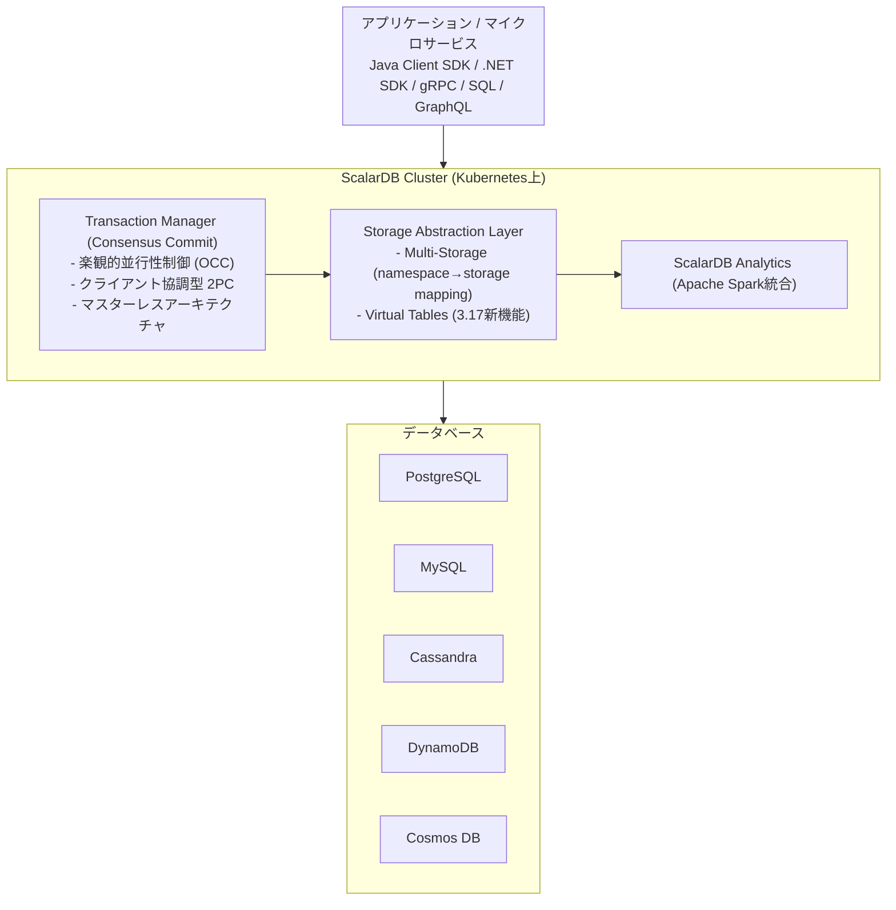
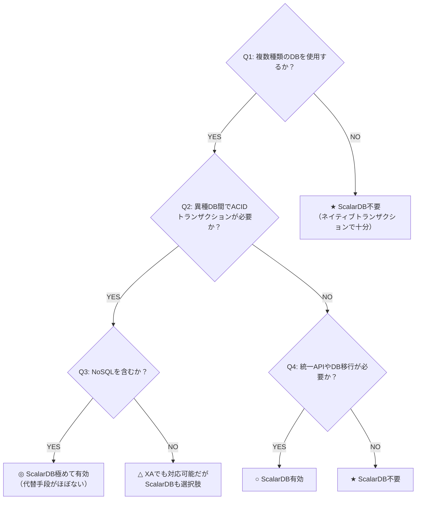
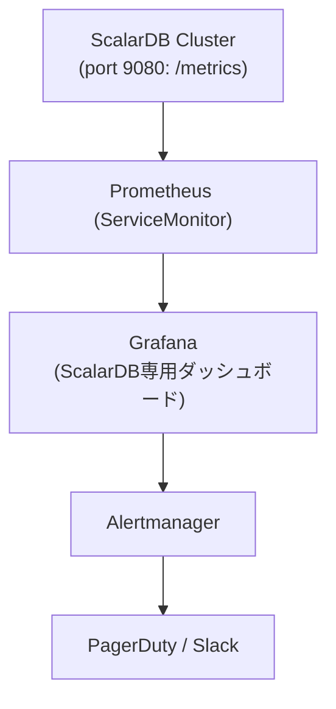
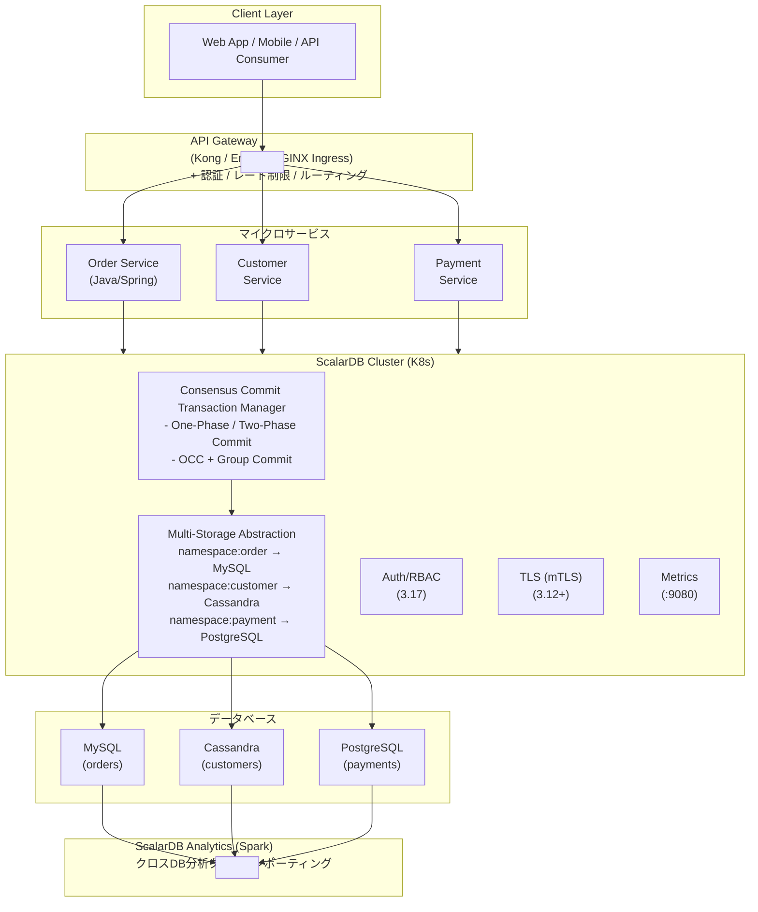

# ScalarDB Cluster × マイクロサービスアーキテクチャ 統合調査レポート

## エグゼクティブサマリー

本レポートは、ScalarDB Cluster（バージョン3.17）をマイクロサービスアーキテクチャに適用するための包括的な調査結果を統合したものである。12のテーマにわたる詳細調査を通じて、ScalarDB Clusterの技術的特性、導入判断基準、設計・運用のベストプラクティスを体系的に整理した。

**ScalarDB Clusterの核心的価値**: データベースの異種性を抽象化し、NoSQLを含む異種DB間でACIDトランザクションを実現する「Universal HTAP Engine」である。Consensus Commitプロトコル（OCC + クライアント協調型2PC）により、XAプロトコルに依存せず、Cassandra・DynamoDB・Cosmos DBなどのNoSQLを含む任意のDB組み合わせでACIDトランザクションを提供する。

---

## 調査テーマ一覧

| # | テーマ | ファイル | 概要 |
|---|--------|----------|------|
| 01 | マイクロサービスアーキテクチャ | [01_microservice_architecture.md](01_microservice_architecture.md) | 基本原則、CI/CD、テスト、デプロイ、監視、API設計 |
| 02 | ScalarDB有効ユースケース | [02_scalardb_usecases.md](02_scalardb_usecases.md) | 5大ユースケース、デシジョンツリー、3.17新機能 |
| 03 | 論理データモデル | [03_logical_data_model.md](03_logical_data_model.md) | 7パターン、ユースケース別適用、ScalarDBとの関連 |
| 04 | 物理データモデル | [04_physical_data_model.md](04_physical_data_model.md) | PK/CK/SI設計、DB選定基準、性能要件 |
| 05 | データベース調査 | [05_database_investigation.md](05_database_investigation.md) | 対応DB一覧、クラウド別状況、ティアランキング |
| 06 | インフラ前提条件 | [06_infrastructure_prerequisites.md](06_infrastructure_prerequisites.md) | K8s要件、AWS/Azure/GCP/オンプレミス構成 |
| 07 | トランザクションモデル | [07_transaction_model.md](07_transaction_model.md) | 7つのトランザクションパターン、ScalarDBとの統合 |
| 08 | 透過的データアクセス | [08_transparent_data_access.md](08_transparent_data_access.md) | Analytics、SQL、BFF、CQRS、データメッシュ |
| 09 | バッチ処理 | [09_batch_processing.md](09_batch_processing.md) | 有効/無効ケース、Spring Batch統合、リトライ戦略 |
| 10 | セキュリティ | [10_security.md](10_security.md) | 認証/認可、TLS、K8sセキュリティ、コンプライアンス |
| 11 | 運用監視・オブザーバビリティ | [11_observability.md](11_observability.md) | メトリクス、ログ、トレーシング、アラート設計 |
| 12 | 障害復旧・高可用性 | [12_disaster_recovery.md](12_disaster_recovery.md) | HA構成、バックアップ、障害パターン、DR設計 |
| 13 | ScalarDB 3.17 Deep Dive | [13_scalardb_317_deep_dive.md](13_scalardb_317_deep_dive.md) | Piggyback Begin、Write Buffering、Batch Operations、メタデータ分離 |

---

## 1. ScalarDB Cluster 技術概要

### 1.1 アーキテクチャ

### 1.2 Consensus Commitプロトコル

ScalarDBの中核であるConsensus Commitは、各レコードをWAL（Write-Ahead Log）の単位として扱い、レコードレベルで2PCを実行する。下位データベースに要求するのは「単一レコードに対するLinearizable Read/Write」と「永続性」のみであり、DynamoDBやCassandraでもACIDトランザクションが実現する。

**分離レベル**: ScalarDBがサポートする分離レベルは**SNAPSHOT**（デフォルト）、**SERIALIZABLE**、**READ_COMMITTED**の3種類である。LINEARIZABLEはサポートされない。SERIALIZABLEモードでは、extra-readによるアンチディペンデンシーチェックが追加される。

| フェーズ | 処理内容 |
|---------|---------|
| **Read** | データをローカルワークスペースにコピー（ロックなし） |
| **Validation** | OCC: 読み取りデータの競合を検証 |
| **Prepare** | 変更レコードをPREPARED状態でDB書き込み |
| **Commit-State** | Coordinatorテーブルにトランザクション状態をCOMMITTEDとして記録 |
| **Commit-Records** | 各レコードの状態をCOMMITTEDに更新 |

**パフォーマンス最適化オプション（3.17）:**

| オプション | カテゴリ | 効果 |
|-----------|---------|------|
| **Piggyback Begin** (`scalar.db.cluster.client.piggyback_begin.enabled=true`) | クライアント | Begin RPCを最初のCRUD操作に便乗させ1回削減（デフォルト無効、明示的に有効化が必要） |
| **Write Buffering** (`scalar.db.cluster.client.write_buffering.enabled=true`) | クライアント | 書き込みをバッファリングしバッチ送信（最大2倍のスループット） |
| **Batch Operations** (`transaction.batch()`) | API | 複数操作を1リクエストにまとめRPC削減 |
| 非同期コミット (`async_commit.enabled=true`) | サーバー | コミットのレイテンシ削減 |
| 非同期ロールバック (`async_rollback.enabled=true`) | サーバー | アボート時のレイテンシ削減 |
| グループコミット (`coordinator.group_commit.enabled=true`) | サーバー | スループット最大87%向上（MariaDB） |
| 並列実行 (`parallel_executor_count=128`) | サーバー | 並列スレッド数の調整 |

### 1.3 ScalarDB 3.17 の主要新機能

| 機能 | 説明 |
|------|------|
| **Piggyback Begin** | トランザクション開始を最初のCRUD操作に便乗させ、RPCラウンドトリップを1回削減（クライアントサイド最適化）。**デフォルト無効**のため、利用時は明示的に有効化が必要 |
| **Write Buffering** | 非条件付き書き込みをバッファリングし、Read/Commit時にバッチ送信してRPC回数を削減（クライアントサイド最適化） |
| **Batch Operations** | Transaction APIで複数操作（Get/Scan/Put/Insert/Upsert/Update/Delete）を1リクエストにまとめて実行 |
| **Transaction Metadata Decoupling** (Private Preview) | トランザクションメタデータをアプリケーションテーブルから分離し、既存テーブルのスキーマ変更なし移行を実現 |
| **Virtual Tables** | プライマリキーによる2テーブルの論理結合（メタデータ分離の基盤技術） |
| **RBAC** | 名前空間・テーブルレベルのロールベースアクセス制御 |
| **集約関数** | SUM, MIN, MAX, AVG, HAVING句サポート（ScalarDB SQL） |
| **Multiple Embedding Stores/Models** | 名前付きの複数エンベディングストア・モデルインスタンスを定義・選択可能 |
| **Secondary Index Fix** | セカンダリインデックスの読み取りを「結果整合性」に再定義し、パフォーマンスを改善 |
| **オブジェクトストレージ** | S3/Azure Blob/GCS対応（Private Preview） |
| **AlloyDB/TiDB** | 互換データベースとして追加 |

> 詳細は [13_scalardb_317_deep_dive.md](13_scalardb_317_deep_dive.md) を参照

---

## 2. ScalarDB Cluster 導入判断

### 2.1 導入が特に有効なケース

| 優先度 | ユースケース | ScalarDBなしでの難易度 |
|--------|------------|----------------------|
| **1** | NoSQLを含む異種DB間ACIDトランザクション | ほぼ不可能 |
| **2** | DB移行中のトランザクション保証 | 極めて困難 |
| **3** | マイクロサービス間のクロスDBトランザクション | 非常に困難 |
| **4** | マルチクラウド間のデータ一貫性 | 困難 |
| **5** | 規制要件によるデータ分散管理 | 困難 |

### 2.2 導入が不要なケース

- 単一種類のRDBMSのみ使用（ネイティブトランザクションで十分）
- 結果整合性で許容されるシステム（分析パイプライン、ログ収集等）
- XAトランザクションで対応可能な**同種**RDBMS同士の構成（ただし、異種RDBMS間ではXA実装差異・運用リスクあり。詳細は `15_xa_heterogeneous_investigation.md` 参照）
- 読み取り専用のクロスDB参照（ただしScalarDB Analyticsは有効）
- Sagaパターン＋結果整合性で十分な場合

### 2.2.1 ScalarDB導入時の前提条件

| 制約 | 説明 | 緩和策 |
|------|------|--------|
| 全データアクセスのScalarDB経由 | ScalarDB管理下テーブルへの全アクセスはScalarDB経由が必要 | 3.17 Metadata Decouplingで読み取りは直接可能に |
| DB固有機能の制限 | ScalarDB抽象化APIのため、DB固有高度機能は直接利用不可 | ScalarDB Analytics経由でネイティブSQL可能 |
| ScalarDB管理対象の最小化推奨 | サービス間Txに参加するテーブルのみを管理対象とすべき | - |

### 2.3 デシジョンツリー（簡略版）

---

## 3. データモデル設計ガイドライン

### 3.1 論理データモデルパターン

| パターン | ScalarDBなし | ScalarDBあり |
|---------|-------------|-------------|
| **Database per Service** | サービス間トランザクション困難 | Multi-Storageで異種DB間ACID |
| **Saga** | 結果整合性、補償Tx必須 | 2PCで代替可能、不要になるケースも |
| **CQRS** | Write/Read同期が課題 | Command: 異種DB間ACID、Query: Analytics |
| **Event Sourcing** | 単一DB内イベント管理 | 異種DBにまたがるイベントストア可能 |
| **Outbox** | 同一DB内のみ原子性保証 | 異種DB間のOutbox原子性保証 |

**ScalarDB導入時の論理モデルへの最大の影響**: Sagaパターンの複雑な補償ロジックを排除し、CQRSの専用Readモデル構築を簡素化できる。

### 3.2 物理データモデル設計原則

ScalarDBはBigtableに触発された拡張キーバリューモデルを採用する。

| 設計要素 | 原則 |
|---------|------|
| **Partition Key** | アクセスパターン駆動。高カーディナリティ列を選択 |
| **Clustering Key** | パーティション内のソート順を制御。範囲スキャンの最適化 |
| **Secondary Index** | 最終手段。インデックステーブルパターンを優先 |
| **スキャン** | 単一パーティション内が最高効率。クロスパーティションは非推奨 |

**重要**: `Put` APIはScalarDB 3.13で非推奨。`Insert`/`Update`/`Upsert`を使い分けること。

---

## 4. 対応データベースとDB選定

### 4.1 データベースティアランキング

**Tier 1（最高親和性）:**
- Apache Cassandra、Amazon DynamoDB、Azure Cosmos DB for NoSQL
- PostgreSQL、MySQL、Amazon Aurora

**Tier 2（公式サポート・JDBC経由）:**
- Oracle Database、SQL Server、MariaDB、IBM Db2
- AlloyDB、TiDB、YugabyteDB

**Tier 3（新機能・Private Preview）:**
- Amazon S3、Azure Blob Storage、Google Cloud Storage
- pgvector、OpenSearch（ベクトル検索）

### 4.2 DB選定クイックガイド

| 要件 | 推奨DB |
|------|--------|
| 汎用OLTP + 複雑クエリ | PostgreSQL / Aurora PostgreSQL |
| 大量書き込み + 線形スケール | Cassandra |
| サーバーレス + 自動スケール (AWS) | DynamoDB |
| グローバル分散 (Azure) | Cosmos DB |
| レガシー統合 | Oracle / SQL Server |

---

## 5. インフラ構成と前提条件

### 5.1 共通要件

| 項目 | 要件 |
|------|------|
| **Kubernetes** | 1.31 - 1.34 |
| **Red Hat OpenShift** | 4.18 - 4.20 |
| **Helm** | 3.5+ |
| **Java** | 8, 11, 17, 21 LTS（Embeddingクライアントは17以上必須） |
| **ライセンス** | 商用ライセンスまたはトライアルキー必須 |

### 5.2 クラウド別推奨構成

| 項目 | AWS | Azure | GCP | オンプレミス |
|------|-----|-------|-----|------------|
| **K8sサービス** | EKS | AKS | GKE | kubeadm / OpenShift |
| **推奨DB** | Aurora + DynamoDB | Cosmos DB + Azure DB | Cloud SQL + AlloyDB | PostgreSQL + Cassandra |
| **ノード仕様** | m5.xlarge x3 | Standard_D4s_v5 x3 | (TBD) | 4vCPU/8GB x3 |
| **ネットワーク** | VPC + Private Subnet | VNet + Azure CNI | VPC + Private Subnet | Private Network |

### 5.3 ScalarDB Cluster Pod要件

| コンポーネント | CPU | メモリ | レプリカ数 |
|---------------|-----|--------|-----------|
| ScalarDB Cluster Pod | 2vCPU | 4GB | 3以上（本番） |
| ワーカーノード | 4vCPU以上 | 8GB以上 | 3以上（マルチAZ） |

### 5.4 主要ポート

| ポート | 用途 |
|--------|------|
| 60053 | gRPC/SQL API |
| 8080 | GraphQL |
| 9080 | Prometheus メトリクス |

---

## 6. トランザクションパターン

### 6.1 パターン比較サマリ

| パターン | 一貫性モデル | ScalarDBでの変化 |
|---------|------------|-----------------|
| **ローカルTx** | Strong | 統一APIで異種DB間ACIDを実現 |
| **2PC (ScalarDB)** | Strong | XA不要（NoSQL含む任意のDB組み合わせに対応）、OCC採用で高パフォーマンス、Lazy Recoveryで自動障害回復 |
| **Saga** | Eventual | 2PCで代替可能、各ステップ内を強化 |
| **TCC** | Eventual→Strong | 各フェーズのACIDを保証、2PCで代替可能 |
| **CQRS** | Eventual (Read側) | Command: 異種DB間ACID、Query: Analytics |
| **Event Sourcing** | Eventual | 異種DBにまたがるイベントストア実装可能 |
| **Outbox** | Strong (同一DB内) | 異種DB間でもOutbox原子性を保証 |

### 6.2 デプロイメントパターン

| パターン | 特徴 | 推奨場面 |
|---------|------|---------|
| **Shared-Cluster（推奨）** | 全サービスが1つのClusterを共有。One-Phase Commit | リソース効率重視、管理の簡素化 |
| **Separated-Cluster** | サービスごとに専用Cluster。Two-Phase Commit | チーム間独立性最大化 |

### 6.3 XA（X/Open XA）の異種DB間利用に関する調査結果

XA標準による異種DB間分散トランザクションには、以下の根本的課題がある（詳細は `15_xa_heterogeneous_investigation.md` 参照）。

| 課題 | 詳細 | ScalarDBでの解決 |
|---|---|---|
| **NoSQL非対応** | Cassandra, DynamoDB, MongoDB等はXA非サポート | Storage Abstraction Layerで任意DBに対応 |
| **RDBMS間の実装差異** | MySQL/PostgreSQL/Oracleで2PC実装が異なり、混在時にリスク大 | DB差異をScalarDBが吸収 |
| **ブロッキング** | Prepare後にロック保持。TM障害時は全DBがロック凍結 | OCCによるロックフリー読み取り |
| **TM単一障害点** | トランザクションマネージャがSPOFになる | Coordinatorテーブルで状態管理、専用プロセス不要 |
| **手動障害回復** | 孤立トランザクションの手動解決が必要 | Lazy Recoveryで自動回復 |
| **運用複雑性** | DB別の監視コマンド・回復手順が必要 | ScalarDB Clusterで運用を集約 |

---

## 7. 透過的データアクセスとバッチ処理

### 7.1 データアクセスパターン

| パターン | 用途 | ScalarDB機能 |
|---------|------|-------------|
| **Multi-Storage Transaction** | 異種DB間のACID書き込み | Consensus Commit |
| **ScalarDB SQL/JDBC** | 統一SQLインターフェース | ScalarDB SQL |
| **ScalarDB Analytics (Spark)** | クロスDB分析クエリ | Universal Data Catalog |
| **ScalarDB Analytics (PostgreSQL)** | FDW経由の読み取り | PostgreSQL FDW |
| **Virtual Tables** | 2テーブルの論理結合 | 3.17新機能 |

### 7.2 バッチ処理ガイドライン

| ScalarDB活用度 | シナリオ | 推奨アプローチ |
|---------------|---------|--------------|
| **高** | クロスDB整合性が必要なバッチ更新 | Spring Batch + ScalarDB TX（チャンク） |
| **高** | マイクロサービス間トランザクション | Two-Phase Commit Interface |
| **中** | クロスサービス分析・レポーティング | ScalarDB Analytics (Spark) |
| **低** | 超大量ETL | Spark/Flink直接 + 最終書き込みのみScalarDB |
| **低** | リアルタイムストリーム処理 | Kafka + Flink（CDCで連携） |

**核心的設計原則**: 重いETL/ML処理はネイティブツールで実行し、トランザクション整合性が必要な箇所のみScalarDBを適用する「**境界での整合性パターン**」が最も実践的。

---

## 8. セキュリティモデル

### 8.1 ScalarDB Cluster固有のセキュリティ

| 機能 | 説明 | 状態 |
|------|------|------|
| **認証** | トークンベース認証（ユーザー名/パスワード） | GA |
| **RBAC** | 名前空間・テーブルレベルの権限管理。INSERTとUPDATEは必ずセットで付与・剥奪する必要がある（個別設定不可） | GA (3.17) |
| **TLS** | RSA/ECDSA証明書、cert-manager対応 | GA (3.12+) |
| **OIDC認証** | 外部IdPとの統合 | ロードマップ (2026 Q1) |

### 8.2 Kubernetesセキュリティ

| レイヤー | 推奨施策 |
|---------|---------|
| **ネットワーク** | プライベートネットワーク必須、NetworkPolicy適用 |
| **Pod** | Pod Security Standards (Restricted)、非rootユーザー |
| **シークレット** | External Secrets Operator + Vault/AWS Secrets Manager |
| **通信** | Istio mTLS（サービスメッシュ）、ScalarDB TLS |

### 8.3 コンプライアンス対応

| 規制 | ScalarDBでの対応ポイント |
|------|------------------------|
| **GDPR** | RBAC + 暗号化 + データレジデンシー（namespace→region mapping） |
| **PCI DSS** | TLS + RBAC + 監査ログ + NetworkPolicy |
| **HIPAA** | 暗号化 + アクセス制御 + 監査証跡 |

---

## 9. 運用監視・オブザーバビリティ

### 9.1 監視スタック

### 9.2 主要メトリクス

| カテゴリ | メトリクス例 |
|---------|------------|
| **トランザクション** | begin/commit/rollback のスループット・レイテンシ (p50/p95/p99) |
| **CRUD操作** | get/scan/put/delete のスループット・レイテンシ |
| **2PC** | prepare/validate/commit のスループット・レイテンシ |
| **エラー率** | success/failure カウンター |
| **グループコミット** | スロット容量、タイムアウト |

### 9.3 アラート設計（SLI/SLO）

| SLI | SLO例 | アラート閾値 |
|-----|-------|------------|
| トランザクション成功率 | 99.9% | < 99.5% で Warning、< 99.0% で Critical |
| コミットレイテンシ p99 | < 500ms | > 1000ms で Warning、> 3000ms で Critical |
| Pod可用性 | 3/3 Pod稼働 | 2/3以下で Critical |

### 9.4 現時点の制約

- **分散トレーシング**: ScalarDB ClusterにはネイティブのOpenTelemetry統合がない。アプリケーション側でトレースコンテキストを管理する必要がある
- **CDC**: ネイティブCDC機能なし。Debezium等を基盤DB側で構成する必要がある
- **監査ログ**: ScalarDB Cluster自体のネイティブ監査ログ機能はCY2026 Q2提供予定。本番運用にはバックエンドDB監査ログの有効化が必須

---

## 10. 障害復旧・高可用性

### 10.1 HAアーキテクチャ

| レイヤー | HA機能 |
|---------|--------|
| **ScalarDB Cluster** | コンシステントハッシュ、自動ルーティング、グレースフルシャットダウン |
| **Kubernetes** | Deployment自動復旧、Readiness/Liveness Probe、PodDisruptionBudget |
| **データベース** | 各DBのレプリケーション + ScalarDB Lazy Recovery |

### 10.2 バックアップ戦略

| DB種類 | 方式 | ScalarDB Cluster一時停止 |
|--------|------|------------------------|
| **RDBMS (単一DB)** | `mysqldump --single-transaction` / `pg_dump` / PITR | **不要** |
| **NoSQL / 複数DB** | PITR + ScalarDB pause | **必要** |

**リストア時の注意:**
- DynamoDB: テーブルはエイリアス付きで復元 → 名前変更が必要
- Cosmos DB: PITRがストアドプロシージャを復元しない → Schema Loader `--repair-all` が必要

### 10.3 障害パターンと復旧

| 障害パターン | RTO目安 | 対応 |
|-------------|---------|------|
| Pod障害 | 数秒〜数十秒 | Kubernetes自動再起動 |
| ノード障害 | 数分 | Pod再スケジュール + コンシステントハッシュ再計算 |
| AZ障害 | 数分〜数十分 | マルチAZ配置、Anti-Affinity設定 |
| PREPARED状態の孤立レコード | 自動 | **Lazy Recovery**で自動修復 |
| Coordinator障害 | 自動 | トランザクション状態から自動判定 |
| リージョン障害 | 数十分〜数時間 | Remote Replication (LogWriter/LogApplier) |

### 10.4 RPO/RTO設計

| SLA | RPO | RTO | 推奨構成 |
|-----|-----|-----|---------|
| 99.9% | < 1時間 | < 1時間 | 単一リージョン・マルチAZ |
| 99.95% | < 15分 | < 30分 | マルチAZ + 自動フェイルオーバー |
| 99.99% | < 1分 | < 5分 | マルチリージョン + Remote Replication |

---

## 11. 全体アーキテクチャ概要図

---

## 12. 導入ロードマップ（推奨）

### Phase 1: 評価・PoC（1-2ヶ月）

| ステップ | 内容 |
|---------|------|
| 1-1 | デシジョンツリーによる適用判断 |
| 1-2 | スタンドアロンモードでの技術検証 |
| 1-3 | 想定ワークロードでのベンチマーク（TPC-C等） |
| 1-4 | データモデル設計（PK/CK設計、アクセスパターン検証） |

### Phase 2: 開発環境構築（1-2ヶ月）

| ステップ | 内容 |
|---------|------|
| 2-1 | Kubernetes + Helm Chartでの開発環境構築 |
| 2-2 | Multi-Storage構成の設定・テスト |
| 2-3 | ScalarDB SQL/JDBC統合のアプリケーション開発 |
| 2-4 | Spring Data JDBC for ScalarDB統合 |

### Phase 3: 本番準備（1-2ヶ月）

| ステップ | 内容 |
|---------|------|
| 3-1 | TLS有効化・認証/RBAC設定 |
| 3-2 | Prometheus + Grafana監視スタック構築 |
| 3-3 | バックアップ・リストア手順の策定・テスト |
| 3-4 | PodDisruptionBudget・Anti-Affinity設定 |
| 3-5 | カオスエンジニアリングによる障害テスト |

### Phase 4: 本番運用開始

| ステップ | 内容 |
|---------|------|
| 4-1 | カナリアリリースによる段階的導入 |
| 4-2 | SLI/SLOの設定とアラート運用開始 |
| 4-3 | 運用手順書の整備（障害対応、スケーリング） |
| 4-4 | 定期的なDR訓練の実施 |

---

## 13. 主要リスクと対策

| リスク | 影響度 | 対策 |
|--------|-------|------|
| **OCC競合によるリトライ増加** | 中 | ホットスポット回避のPK設計、チャンクサイズの最適化 |
| **Consensus Commitのレイテンシオーバーヘッド** | 中 | 基盤DBレイテンシの2-3倍を見込む。非同期コミット/グループコミットで緩和 |
| **全データアクセスのScalarDB経由制約** | 高 | 直接DBアクセスとの混在は整合性を損なう。ポリシーと教育で徹底 |
| **メタデータによるストレージオーバーヘッド** | 低 | 各レコードにtx_id, tx_state, tx_version等が付加。容量計画に組み込む |
| **ベンダーロックイン（Scalar社）** | 中 | ScalarDBの抽象化により下位DBは入れ替え可能。ScalarDB自体の代替は困難 |
| **GKEサポートの成熟度** | 低 | 2025 Q4からサポート開始。AWS/Azureを先行採用が安全 |
| **分散トレーシングの制約** | 低 | ネイティブOTel未対応。アプリ側でトレースコンテキスト管理が必要 |
| **2PC過度適用による分散モノリス化** | 高 | デフォルトはSaga/イベント駆動とし、2PCは例外的選択に限定 |
| **監査ログの不在** | 高 | バックエンドDB監査ログを必須化、アプリ側Structured Audit Logging実装 |
| **Coordinatorテーブルのスケーリング上限** | 中 | Group Commit有効化、Coordinatorテーブルサイズ監視、TTL戦略策定 |

---

## 14. 結論と推奨事項

### ScalarDB Clusterが最も真価を発揮する条件

1. **NoSQLを含む複数種類のデータベースが存在する**
2. **それらのDB間でACIDトランザクションが必要**
3. **マイクロサービスアーキテクチャで各サービスが異なるDBを使用**
4. **将来的なDB移行やマルチクラウド展開の可能性がある**

### 設計上の重要原則

- **Shared-Clusterパターンを第一選択とする**（Separated-Clusterはチーム独立性が必須の場合のみ）
- **物理モデルはクエリ駆動型設計**（単一パーティション検索を最優先）
- **バッチ処理は「境界での整合性パターン」**（重い処理はネイティブツール、整合性が必要な箇所のみScalarDB）
- **プライベートネットワーク必須**（ScalarDB Clusterはインターネットに直接公開しない）
- **監視はPrometheus + Grafana + ScalarDB専用ダッシュボード**が標準構成
- **2PC適用は例外的選択とする**（デフォルトはSaga/イベント駆動。2PCは法規制・金銭損失が直結する場合のみ）
- **テスト環境ではTestcontainers + ScalarDB Standaloneを活用**
- **監査ログの暫定対策を本番運用前に必ず実施**（バックエンドDB監査ログ + K8s Audit Log）

---

## 主要参考文献

- [ScalarDB Overview](https://scalardb.scalar-labs.com/docs/latest/overview/)
- [ScalarDB Consensus Commit Protocol](https://scalardb.scalar-labs.com/docs/latest/consensus-commit/)
- [ScalarDB Cluster Deployment Patterns for Microservices](https://scalardb.scalar-labs.com/docs/latest/scalardb-cluster/deployment-patterns-for-microservices/)
- [ScalarDB: Universal Transaction Manager for Polystores (VLDB'23)](https://dl.acm.org/doi/10.14778/3611540.3611563)
- [ScalarDB Requirements](https://scalardb.scalar-labs.com/docs/latest/requirements/)
- [ScalarDB Roadmap](https://scalardb.scalar-labs.com/docs/latest/roadmap/)
- [Production Checklist for ScalarDB Cluster](https://scalardb.scalar-labs.com/docs/latest/scalar-kubernetes/ProductionChecklistForScalarDBCluster/)
- [How to Back Up and Restore Databases Used Through ScalarDB](https://scalardb.scalar-labs.com/docs/latest/backup-restore/)
- [Monitoring Scalar Products on Kubernetes](https://scalardb.scalar-labs.com/docs/latest/scalar-kubernetes/K8sMonitorGuide/)
- [ScalarDB GitHub Repository](https://github.com/scalar-labs/scalardb)
