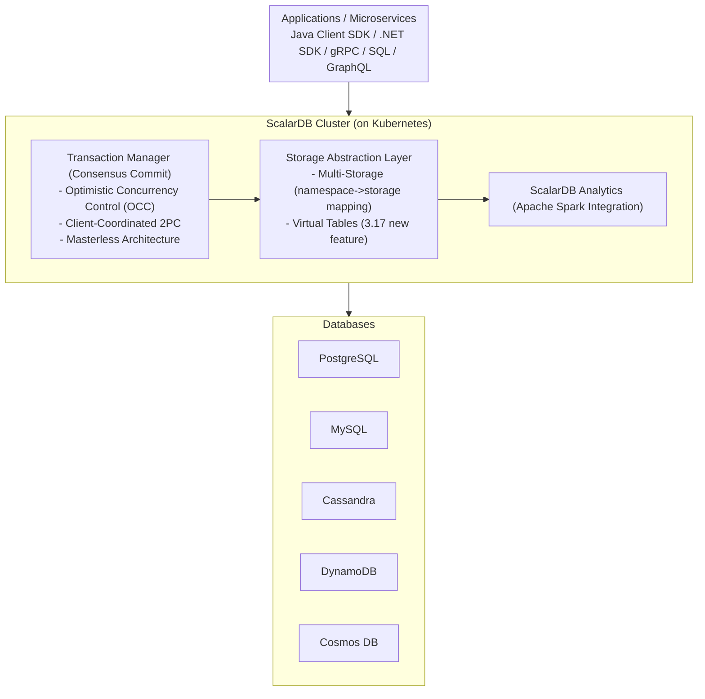
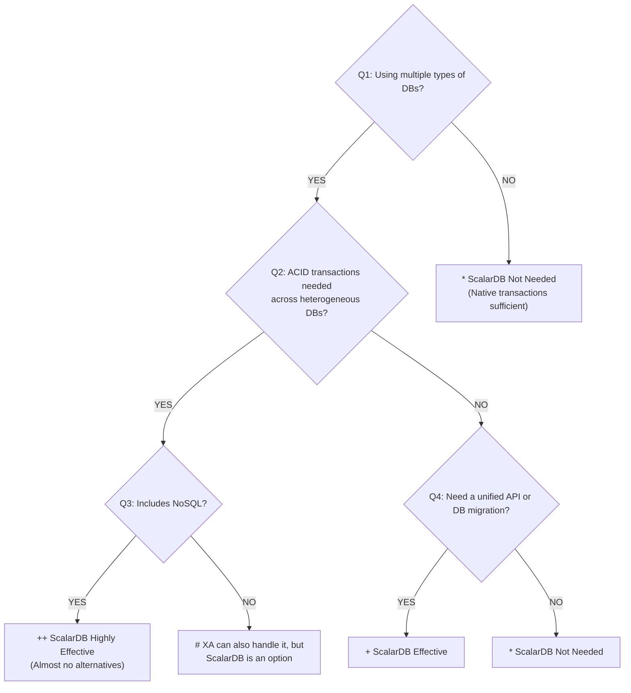
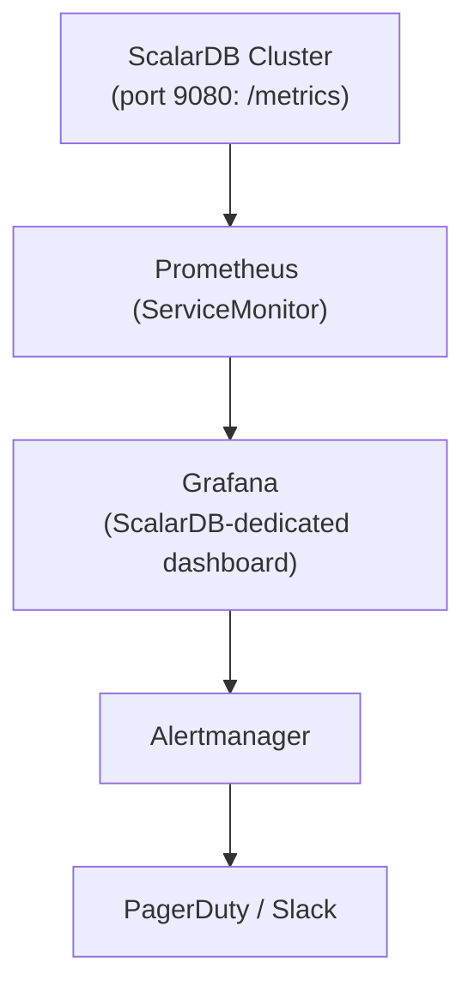
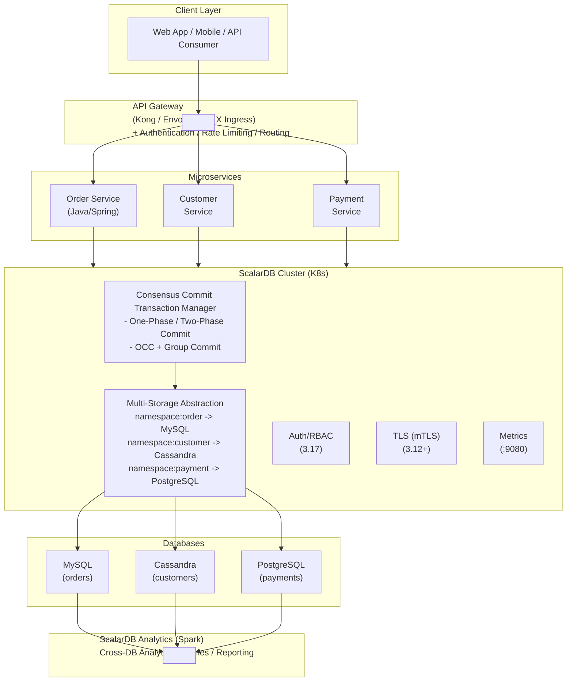

# ScalarDB Cluster x Microservice Architecture Integrated Research Report

## Executive Summary

This report integrates comprehensive research findings for applying ScalarDB Cluster (version 3.17) to microservice architecture. Through detailed investigations across 12 themes, it systematically organizes ScalarDB Cluster's technical characteristics, adoption decision criteria, and best practices for design and operations.

**Core Value of ScalarDB Cluster**: A "Universal HTAP Engine" that abstracts database heterogeneity and achieves ACID transactions across heterogeneous databases including NoSQL. Through the Consensus Commit protocol (OCC + client-coordinated 2PC), it provides ACID transactions for any combination of databases including Cassandra, DynamoDB, and Cosmos DB, without depending on the XA protocol.

---

## Research Theme List

| # | Theme | File | Summary |
|---|-------|------|---------|
| 01 | Microservice Architecture | [01_microservice_architecture.md](01_microservice_architecture.md) | Fundamental principles, CI/CD, testing, deployment, monitoring, API design |
| 02 | ScalarDB Effective Use Cases | [02_scalardb_usecases.md](02_scalardb_usecases.md) | 5 major use cases, decision tree, 3.17 new features |
| 03 | Logical Data Model | [03_logical_data_model.md](03_logical_data_model.md) | 7 patterns, use case-specific application, ScalarDB relationship |
| 04 | Physical Data Model | [04_physical_data_model.md](04_physical_data_model.md) | PK/CK/SI design, DB selection criteria, performance requirements |
| 05 | Database Investigation | [05_database_investigation.md](05_database_investigation.md) | Supported DB list, cloud-specific status, tier ranking |
| 06 | Infrastructure Prerequisites | [06_infrastructure_prerequisites.md](06_infrastructure_prerequisites.md) | K8s requirements, AWS/Azure/GCP/on-premises configuration |
| 07 | Transaction Model | [07_transaction_model.md](07_transaction_model.md) | 7 transaction patterns, ScalarDB integration |
| 08 | Transparent Data Access | [08_transparent_data_access.md](08_transparent_data_access.md) | Analytics, SQL, BFF, CQRS, Data Mesh |
| 09 | Batch Processing | [09_batch_processing.md](09_batch_processing.md) | Effective/ineffective cases, Spring Batch integration, retry strategies |
| 10 | Security | [10_security.md](10_security.md) | Authentication/authorization, TLS, K8s security, compliance |
| 11 | Operations Monitoring & Observability | [11_observability.md](11_observability.md) | Metrics, logs, tracing, alert design |
| 12 | Disaster Recovery & High Availability | [12_disaster_recovery.md](12_disaster_recovery.md) | HA configuration, backup, failure patterns, DR design |
| 13 | ScalarDB 3.17 Deep Dive | [13_scalardb_317_deep_dive.md](13_scalardb_317_deep_dive.md) | Piggyback Begin, Write Buffering, Batch Operations, metadata decoupling |

---

## 1. ScalarDB Cluster Technical Overview

### 1.1 Architecture

### 1.2 Consensus Commit Protocol

Consensus Commit, the core of ScalarDB, treats each record as a WAL (Write-Ahead Log) unit and executes 2PC at the record level. It requires only "Linearizable Read/Write for a single record" and "Durability" from the underlying database, enabling ACID transactions even on DynamoDB and Cassandra.

**Isolation Levels**: The isolation levels supported by ScalarDB are **SNAPSHOT** (default), **SERIALIZABLE**, and **READ_COMMITTED** (3 types). LINEARIZABLE is not supported. In SERIALIZABLE mode, anti-dependency checks via extra-reads are added.

| Phase | Processing |
|-------|-----------|
| **Read** | Copy data to local workspace (lock-free) |
| **Validation** | OCC: Verify conflicts in read data |
| **Prepare** | Write changed records to DB in PREPARED state |
| **Commit-State** | Record transaction state as COMMITTED in Coordinator table |
| **Commit-Records** | Update each record's state to COMMITTED |

**Performance Optimization Options (3.17):**

| Option | Category | Effect |
|--------|----------|--------|
| **Piggyback Begin** (`scalar.db.cluster.client.piggyback_begin.enabled=true`) | Client | Piggybacks Begin RPC onto the first CRUD operation, eliminating 1 round trip (disabled by default, requires explicit enablement) |
| **Write Buffering** (`scalar.db.cluster.client.write_buffering.enabled=true`) | Client | Buffers writes and sends in batch (up to 2x throughput) |
| **Batch Operations** (`transaction.batch()`) | API | Combines multiple operations into 1 request to reduce RPCs |
| Async Commit (`async_commit.enabled=true`) | Server | Reduces commit latency |
| Async Rollback (`async_rollback.enabled=true`) | Server | Reduces abort latency |
| Group Commit (`coordinator.group_commit.enabled=true`) | Server | Up to 87% throughput improvement (MariaDB) |
| Parallel Execution (`parallel_executor_count=128`) | Server | Adjusts parallel thread count |

### 1.3 Key New Features in ScalarDB 3.17

| Feature | Description |
|---------|-------------|
| **Piggyback Begin** | Piggybacks transaction start onto the first CRUD operation, reducing one RPC round trip (client-side optimization). **Disabled by default**, requires explicit enablement |
| **Write Buffering** | Buffers unconditional writes and batch-sends them during Read/Commit to reduce RPC count (client-side optimization) |
| **Batch Operations** | Combines multiple operations (Get/Scan/Put/Insert/Upsert/Update/Delete) into one request via Transaction API |
| **Transaction Metadata Decoupling** (Private Preview) | Separates transaction metadata from application tables, enabling migration of existing tables without schema changes |
| **Virtual Tables** | Logical joining of two tables via primary key (foundational technology for metadata decoupling) |
| **RBAC** | Namespace and table-level role-based access control |
| **Aggregate Functions** | SUM, MIN, MAX, AVG, HAVING clause support (ScalarDB SQL) |
| **Multiple Embedding Stores/Models** | Define and select multiple named embedding store and model instances |
| **Secondary Index Fix** | Redefines secondary index reads as "eventually consistent" to improve performance |
| **Object Storage** | S3/Azure Blob/GCS support (Private Preview) |
| **AlloyDB/TiDB** | Added as compatible databases |

> For details, see [13_scalardb_317_deep_dive.md](13_scalardb_317_deep_dive.md)

---

## 2. ScalarDB Cluster Adoption Decision

### 2.1 Cases Where Adoption Is Particularly Effective

| Priority | Use Case | Difficulty Without ScalarDB |
|----------|----------|---------------------------|
| **1** | ACID transactions across heterogeneous DBs including NoSQL | Nearly impossible |
| **2** | Transaction guarantees during DB migration | Extremely difficult |
| **3** | Cross-DB transactions between microservices | Very difficult |
| **4** | Data consistency across multi-cloud | Difficult |
| **5** | Data distribution management due to regulatory requirements | Difficult |

### 2.2 Cases Where Adoption Is Unnecessary

- Using only a single type of RDBMS (native transactions are sufficient)
- Systems where eventual consistency is acceptable (analytics pipelines, log collection, etc.)
- Configurations of **same-type** RDBMSs where XA transactions can handle it (however, implementation differences and operational risks exist across heterogeneous RDBMSs. See `15_xa_heterogeneous_investigation.md` for details)
- Read-only cross-DB references (though ScalarDB Analytics is useful)
- When Saga pattern + eventual consistency is sufficient

### 2.2.1 Prerequisites for ScalarDB Adoption

| Constraint | Description | Mitigation |
|------------|-------------|------------|
| All data access via ScalarDB | All access to ScalarDB-managed tables must go through ScalarDB | 3.17 Metadata Decoupling enables direct reads |
| DB-specific feature restrictions | ScalarDB's abstraction API means advanced DB-specific features cannot be used directly | Native SQL possible via ScalarDB Analytics |
| Minimize ScalarDB-managed scope recommended | Only tables participating in inter-service Tx should be managed | - |

### 2.3 Decision Tree (Simplified)

---

## 3. Data Model Design Guidelines

### 3.1 Logical Data Model Patterns

| Pattern | Without ScalarDB | With ScalarDB |
|---------|-----------------|---------------|
| **Database per Service** | Inter-service transactions are difficult | Multi-Storage enables cross-DB ACID |
| **Saga** | Eventual consistency, compensating Tx required | Can be replaced with 2PC, may become unnecessary |
| **CQRS** | Write/Read synchronization is challenging | Command: Cross-DB ACID, Query: Analytics |
| **Event Sourcing** | Event management within single DB | Event store spanning heterogeneous DBs possible |
| **Outbox** | Atomicity guaranteed only within same DB | Outbox atomicity guaranteed across heterogeneous DBs |

**Greatest Impact on Logical Model from ScalarDB Adoption**: Eliminates complex compensation logic from the Saga pattern and simplifies dedicated Read model construction for CQRS.

### 3.2 Physical Data Model Design Principles

ScalarDB adopts an extended key-value model inspired by Bigtable.

| Design Element | Principle |
|---------------|-----------|
| **Partition Key** | Access-pattern driven. Select high-cardinality columns |
| **Clustering Key** | Controls sort order within partition. Optimize range scans |
| **Secondary Index** | Last resort. Prefer index table pattern |
| **Scan** | Single partition is most efficient. Cross-partition is not recommended |

**Important**: The `Put` API was deprecated in ScalarDB 3.13. Use `Insert`/`Update`/`Upsert` appropriately.

---

## 4. Supported Databases and DB Selection

### 4.1 Database Tier Ranking

**Tier 1 (Highest Affinity):**
- Apache Cassandra, Amazon DynamoDB, Azure Cosmos DB for NoSQL
- PostgreSQL, MySQL, Amazon Aurora

**Tier 2 (Officially Supported, via JDBC):**
- Oracle Database, SQL Server, MariaDB, IBM Db2
- AlloyDB, TiDB, YugabyteDB

**Tier 3 (New Features, Private Preview):**
- Amazon S3, Azure Blob Storage, Google Cloud Storage
- pgvector, OpenSearch (vector search)

### 4.2 DB Selection Quick Guide

| Requirement | Recommended DB |
|-------------|----------------|
| General-purpose OLTP + complex queries | PostgreSQL / Aurora PostgreSQL |
| High-volume writes + linear scaling | Cassandra |
| Serverless + auto-scaling (AWS) | DynamoDB |
| Global distribution (Azure) | Cosmos DB |
| Legacy integration | Oracle / SQL Server |

---

## 5. Infrastructure Configuration and Prerequisites

### 5.1 Common Requirements

| Item | Requirement |
|------|-------------|
| **Kubernetes** | 1.31 - 1.34 |
| **Red Hat OpenShift** | 4.18 - 4.20 |
| **Helm** | 3.5+ |
| **Java** | 8, 11, 17, 21 LTS (Embedding clients require 17+) |
| **License** | Commercial license or trial key required |

### 5.2 Recommended Configuration by Cloud

| Item | AWS | Azure | GCP | On-Premises |
|------|-----|-------|-----|-------------|
| **K8s Service** | EKS | AKS | GKE | kubeadm / OpenShift |
| **Recommended DB** | Aurora + DynamoDB | Cosmos DB + Azure DB | Cloud SQL + AlloyDB | PostgreSQL + Cassandra |
| **Node Spec** | m5.xlarge x3 | Standard_D4s_v5 x3 | (TBD) | 4vCPU/8GB x3 |
| **Network** | VPC + Private Subnet | VNet + Azure CNI | VPC + Private Subnet | Private Network |

### 5.3 ScalarDB Cluster Pod Requirements

| Component | CPU | Memory | Replica Count |
|-----------|-----|--------|---------------|
| ScalarDB Cluster Pod | 2vCPU | 4GB | 3+ (production) |
| Worker Node | 4vCPU+ | 8GB+ | 3+ (multi-AZ) |

### 5.4 Key Ports

| Port | Purpose |
|------|---------|
| 60053 | gRPC/SQL API |
| 8080 | GraphQL |
| 9080 | Prometheus Metrics |

---

## 6. Transaction Patterns

### 6.1 Pattern Comparison Summary

| Pattern | Consistency Model | Change with ScalarDB |
|---------|------------------|---------------------|
| **Local Tx** | Strong | Unified API achieves cross-DB ACID |
| **2PC (ScalarDB)** | Strong | XA not required (supports any DB combination including NoSQL), high performance with OCC, automatic failure recovery with Lazy Recovery |
| **Saga** | Eventual | Can be replaced with 2PC, each step is strengthened |
| **TCC** | Eventual -> Strong | ACID guaranteed for each phase, can be replaced with 2PC |
| **CQRS** | Eventual (Read side) | Command: Cross-DB ACID, Query: Analytics |
| **Event Sourcing** | Eventual | Event store spanning heterogeneous DBs possible |
| **Outbox** | Strong (within same DB) | Outbox atomicity guaranteed even across heterogeneous DBs |

### 6.2 Deployment Patterns

| Pattern | Characteristics | Recommended Scenario |
|---------|----------------|---------------------|
| **Shared-Cluster (Recommended)** | All services share one Cluster. One-Phase Commit | Resource efficiency priority, simplified management |
| **Separated-Cluster** | Dedicated Cluster per service. Two-Phase Commit | Maximize inter-team independence |

### 6.3 XA (X/Open XA) Research Findings on Heterogeneous DB Usage

XA standard-based distributed transactions across heterogeneous DBs have the following fundamental challenges (see `15_xa_heterogeneous_investigation.md` for details).

| Challenge | Details | Solution with ScalarDB |
|-----------|---------|----------------------|
| **NoSQL Not Supported** | Cassandra, DynamoDB, MongoDB, etc. do not support XA | Storage Abstraction Layer supports any DB |
| **Implementation Differences Between RDBMSs** | 2PC implementations differ across MySQL/PostgreSQL/Oracle, high risk when mixed | ScalarDB absorbs DB differences |
| **Blocking** | Locks held after Prepare. All DBs lock-frozen on TM failure | Lock-free reads with OCC |
| **TM Single Point of Failure** | Transaction Manager becomes SPOF | State management via Coordinator table, no dedicated process needed |
| **Manual Failure Recovery** | Manual resolution of orphaned transactions required | Automatic recovery via Lazy Recovery |
| **Operational Complexity** | DB-specific monitoring commands and recovery procedures needed | Operations consolidated via ScalarDB Cluster |

---

## 7. Transparent Data Access and Batch Processing

### 7.1 Data Access Patterns

| Pattern | Purpose | ScalarDB Feature |
|---------|---------|-----------------|
| **Multi-Storage Transaction** | ACID writes across heterogeneous DBs | Consensus Commit |
| **ScalarDB SQL/JDBC** | Unified SQL interface | ScalarDB SQL |
| **ScalarDB Analytics (Spark)** | Cross-DB analytical queries | Universal Data Catalog |
| **ScalarDB Analytics (PostgreSQL)** | Reads via FDW | PostgreSQL FDW |
| **Virtual Tables** | Logical joining of 2 tables | 3.17 new feature |

### 7.2 Batch Processing Guidelines

| ScalarDB Utilization | Scenario | Recommended Approach |
|---------------------|----------|---------------------|
| **High** | Batch updates requiring cross-DB consistency | Spring Batch + ScalarDB TX (chunked) |
| **High** | Inter-microservice transactions | Two-Phase Commit Interface |
| **Medium** | Cross-service analytics/reporting | ScalarDB Analytics (Spark) |
| **Low** | Ultra-large-volume ETL | Spark/Flink direct + ScalarDB only for final writes |
| **Low** | Real-time stream processing | Kafka + Flink (integration via CDC) |

**Core Design Principle**: Execute heavy ETL/ML processing with native tools, and apply ScalarDB only where transaction consistency is needed -- the "**Consistency at the Boundary Pattern**" is the most practical approach.

---

## 8. Security Model

### 8.1 ScalarDB Cluster-Specific Security

| Feature | Description | Status |
|---------|-------------|--------|
| **Authentication** | Token-based authentication (username/password) | GA |
| **RBAC** | Namespace and table-level permission management. INSERT and UPDATE must be granted/revoked as a pair (cannot be set individually) | GA (3.17) |
| **TLS** | RSA/ECDSA certificates, cert-manager support | GA (3.12+) |
| **OIDC Authentication** | Integration with external IdPs | Roadmap (2026 Q1) |

### 8.2 Kubernetes Security

| Layer | Recommended Measures |
|-------|---------------------|
| **Network** | Private network required, NetworkPolicy applied |
| **Pod** | Pod Security Standards (Restricted), non-root user |
| **Secrets** | External Secrets Operator + Vault/AWS Secrets Manager |
| **Communication** | Istio mTLS (service mesh), ScalarDB TLS |

### 8.3 Compliance Support

| Regulation | ScalarDB Compliance Points |
|------------|---------------------------|
| **GDPR** | RBAC + encryption + data residency (namespace->region mapping) |
| **PCI DSS** | TLS + RBAC + audit logs + NetworkPolicy |
| **HIPAA** | Encryption + access control + audit trail |

---

## 9. Operations Monitoring & Observability

### 9.1 Monitoring Stack

### 9.2 Key Metrics

| Category | Metric Examples |
|----------|----------------|
| **Transactions** | begin/commit/rollback throughput and latency (p50/p95/p99) |
| **CRUD Operations** | get/scan/put/delete throughput and latency |
| **2PC** | prepare/validate/commit throughput and latency |
| **Error Rate** | success/failure counters |
| **Group Commit** | Slot capacity, timeouts |

### 9.3 Alert Design (SLI/SLO)

| SLI | SLO Example | Alert Threshold |
|-----|-------------|-----------------|
| Transaction success rate | 99.9% | Warning at < 99.5%, Critical at < 99.0% |
| Commit latency p99 | < 500ms | Warning at > 1000ms, Critical at > 3000ms |
| Pod availability | 3/3 Pods running | Critical at 2/3 or fewer |

### 9.4 Current Limitations

- **Distributed Tracing**: ScalarDB Cluster does not have native OpenTelemetry integration. Trace context must be managed on the application side
- **CDC**: No native CDC capability. Debezium, etc. must be configured on the underlying DB side
- **Audit Logs**: ScalarDB Cluster's native audit log capability is scheduled for CY2026 Q2. Enabling backend DB audit logs is mandatory for production operation

---

## 10. Disaster Recovery & High Availability

### 10.1 HA Architecture

| Layer | HA Capability |
|-------|--------------|
| **ScalarDB Cluster** | Consistent hashing, automatic routing, graceful shutdown |
| **Kubernetes** | Deployment auto-recovery, Readiness/Liveness Probe, PodDisruptionBudget |
| **Database** | Each DB's replication + ScalarDB Lazy Recovery |

### 10.2 Backup Strategy

| DB Type | Method | ScalarDB Cluster Pause |
|---------|--------|----------------------|
| **RDBMS (single DB)** | `mysqldump --single-transaction` / `pg_dump` / PITR | **Not required** |
| **NoSQL / multiple DBs** | PITR + ScalarDB pause | **Required** |

**Notes During Restore:**
- DynamoDB: Tables are restored with aliases -> renaming required
- Cosmos DB: PITR does not restore stored procedures -> Schema Loader `--repair-all` required

### 10.3 Failure Patterns and Recovery

| Failure Pattern | Estimated RTO | Response |
|----------------|---------------|----------|
| Pod failure | Seconds to tens of seconds | Kubernetes auto-restart |
| Node failure | Minutes | Pod rescheduling + consistent hash recalculation |
| AZ failure | Minutes to tens of minutes | Multi-AZ placement, Anti-Affinity settings |
| Orphaned PREPARED state records | Automatic | Automatic repair via **Lazy Recovery** |
| Coordinator failure | Automatic | Automatic determination from transaction state |
| Region failure | Tens of minutes to hours | Remote Replication (LogWriter/LogApplier) |

### 10.4 RPO/RTO Design

| SLA | RPO | RTO | Recommended Configuration |
|-----|-----|-----|--------------------------|
| 99.9% | < 1 hour | < 1 hour | Single region, multi-AZ |
| 99.95% | < 15 minutes | < 30 minutes | Multi-AZ + automatic failover |
| 99.99% | < 1 minute | < 5 minutes | Multi-region + Remote Replication |

---

## 11. Overall Architecture Diagram

---

## 12. Adoption Roadmap (Recommended)

### Phase 1: Evaluation & PoC (1-2 Months)

| Step | Content |
|------|---------|
| 1-1 | Applicability assessment using decision tree |
| 1-2 | Technical verification in standalone mode |
| 1-3 | Benchmarking with expected workloads (TPC-C, etc.) |
| 1-4 | Data model design (PK/CK design, access pattern verification) |

### Phase 2: Development Environment Setup (1-2 Months)

| Step | Content |
|------|---------|
| 2-1 | Development environment setup with Kubernetes + Helm Chart |
| 2-2 | Multi-Storage configuration setup and testing |
| 2-3 | Application development with ScalarDB SQL/JDBC integration |
| 2-4 | Spring Data JDBC for ScalarDB integration |

### Phase 3: Production Preparation (1-2 Months)

| Step | Content |
|------|---------|
| 3-1 | TLS enablement, authentication/RBAC configuration |
| 3-2 | Prometheus + Grafana monitoring stack setup |
| 3-3 | Backup/restore procedure development and testing |
| 3-4 | PodDisruptionBudget and Anti-Affinity configuration |
| 3-5 | Failure testing via chaos engineering |

### Phase 4: Production Launch

| Step | Content |
|------|---------|
| 4-1 | Gradual rollout via canary release |
| 4-2 | SLI/SLO configuration and alert operation launch |
| 4-3 | Operations runbook preparation (incident response, scaling) |
| 4-4 | Regular DR drill execution |

---

## 13. Key Risks and Mitigations

| Risk | Impact | Mitigation |
|------|--------|------------|
| **Increased retries due to OCC conflicts** | Medium | PK design to avoid hotspots, chunk size optimization |
| **Latency overhead of Consensus Commit** | Medium | Plan for 2-3x underlying DB latency. Mitigate with async commit/group commit |
| **Constraint of all data access via ScalarDB** | High | Mixing with direct DB access compromises consistency. Enforce through policies and training |
| **Storage overhead from metadata** | Low | tx_id, tx_state, tx_version, etc. added per record. Incorporate into capacity planning |
| **Vendor lock-in (Scalar Inc.)** | Medium | ScalarDB's abstraction allows underlying DB replacement. Replacing ScalarDB itself is difficult |
| **GKE support maturity** | Low | Support started from 2025 Q4. Safer to adopt AWS/Azure first |
| **Distributed tracing limitations** | Low | No native OTel support. Trace context management required on application side |
| **Distributed monolith from excessive 2PC usage** | High | Default to Saga/event-driven, limit 2PC to exceptional cases |
| **Absence of audit logs** | High | Mandate backend DB audit logs, implement application-side Structured Audit Logging |
| **Coordinator table scaling limits** | Medium | Enable Group Commit, monitor Coordinator table size, develop TTL strategy |

---

## 14. Conclusions and Recommendations

### Conditions Where ScalarDB Cluster Demonstrates Greatest Value

1. **Multiple types of databases exist, including NoSQL**
2. **ACID transactions are needed across those DBs**
3. **Microservice architecture where each service uses a different DB**
4. **Future DB migration or multi-cloud deployment is anticipated**

### Important Design Principles

- **Shared-Cluster pattern as the first choice** (Separated-Cluster only when team independence is essential)
- **Physical model follows query-driven design** (single partition lookup as top priority)
- **Batch processing follows the "Consistency at the Boundary Pattern"** (heavy processing with native tools, ScalarDB only where consistency is needed)
- **Private network is mandatory** (do not expose ScalarDB Cluster directly to the internet)
- **Monitoring standard is Prometheus + Grafana + ScalarDB-dedicated dashboard**
- **2PC adoption should be an exceptional choice** (default to Saga/event-driven; 2PC only for cases involving regulatory requirements or direct financial loss)
- **Use Testcontainers + ScalarDB Standalone in test environments**
- **Implement interim audit log measures before production launch** (backend DB audit logs + K8s Audit Log)

---

## Key References

- [ScalarDB Overview](https://scalardb.scalar-labs.com/docs/latest/overview/)
- [ScalarDB Consensus Commit Protocol](https://scalardb.scalar-labs.com/docs/latest/consensus-commit/)
- [ScalarDB Cluster Deployment Patterns for Microservices](https://scalardb.scalar-labs.com/docs/latest/scalardb-cluster/deployment-patterns-for-microservices/)
- [ScalarDB: Universal Transaction Manager for Polystores (VLDB'23)](https://dl.acm.org/doi/10.14778/3611540.3611563)
- [ScalarDB Requirements](https://scalardb.scalar-labs.com/docs/latest/requirements/)
- [ScalarDB Roadmap](https://scalardb.scalar-labs.com/docs/latest/roadmap/)
- [Production Checklist for ScalarDB Cluster](https://scalardb.scalar-labs.com/docs/latest/scalar-kubernetes/ProductionChecklistForScalarDBCluster/)
- [How to Back Up and Restore Databases Used Through ScalarDB](https://scalardb.scalar-labs.com/docs/latest/backup-restore/)
- [Monitoring Scalar Products on Kubernetes](https://scalardb.scalar-labs.com/docs/latest/scalar-kubernetes/K8sMonitorGuide/)
- [ScalarDB GitHub Repository](https://github.com/scalar-labs/scalardb)
