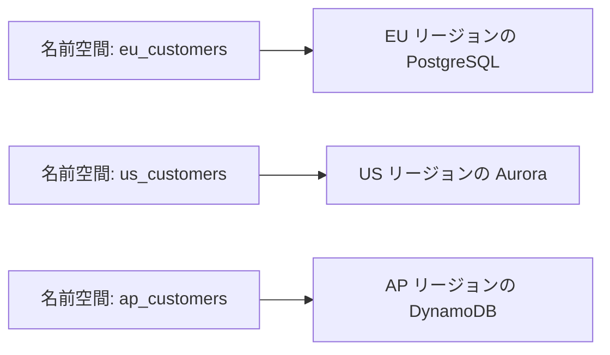
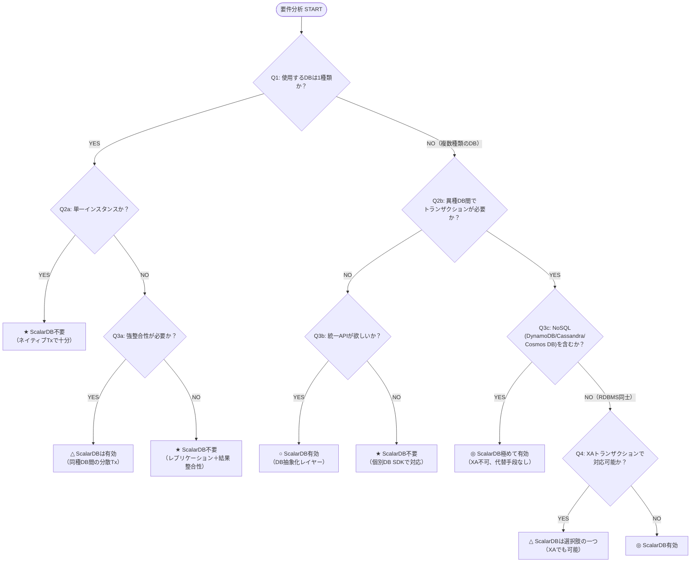
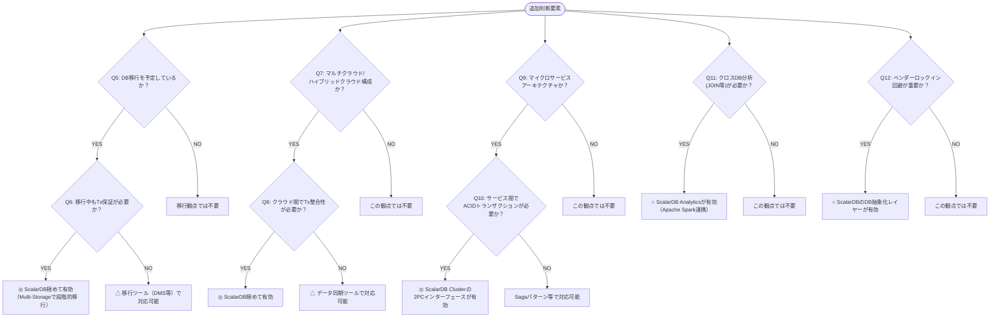

# ScalarDB Cluster 有効ユースケース調査

## 1. 異種データベース間のACIDトランザクション

### ScalarDBなしでの実装の困難さ

異種データベース間（例：MySQL上の注文データとDynamoDB上の在庫データ）でACIDトランザクションを実現するのは、ScalarDBなしでは極めて困難です。その理由は以下の通りです。

**XAトランザクションの限界：**
従来のX/Open XA規格は、複数のリソースマネージャ間で分散トランザクションを実現する標準的な手法ですが、以下の3つのレベルで制約があります。

1. **NoSQLは対象外**: Cassandra、DynamoDB、MongoDB、Azure Cosmos DBなどのNoSQLデータベースはXAを一切サポートしていません。RDBMSとNoSQLが混在する環境ではXAは使用不可です。

2. **RDBMS間でも実装差異が大きい**: MySQL（InnoDB限定、レプリケーションフィルタ不可、Statement-Basedレプリケーションで安全でない）、PostgreSQL（Preparedトランザクションの孤立リスク、VACUUM阻害、公式が「TMを書いていなければ使うべきではない」と警告）など、各DBに固有の制約・バグが存在します。異種RDBMS間（例: MySQL + PostgreSQL）では、2PC実装の差異、障害回復手順の不統一、タイムアウト挙動の不一致が運用上の大きなリスクとなります。

3. **運用リスクが高い**: XAの2PCはブロッキングプロトコルであり、トランザクションマネージャ（TM）が障害を起こすと全参加DBのトランザクションがPrepared状態で凍結し、ロックが長時間保持されます。TMが単一障害点（SPOF）となり、高可用性が要求されるシステムでは深刻なリスクです。

> **詳細**: XA異種DB間利用の詳細調査は `15_xa_heterogeneous_investigation.md` を参照

**Sagaパターンの限界：**
マイクロサービスアーキテクチャで一般的に使われるSagaパターンは、各サービスのローカルトランザクションを連鎖させて結果整合性（Eventual Consistency）を実現する手法ですが、以下の問題があります。
- 中間状態が外部に露出する（Isolation違反）
- 補償トランザクション（ロールバック相当）の設計・実装が極めて複雑
- **強整合性（Serializable）を保証できない**
- ビジネスロジックに密結合した補償ロジックが必要

**自前実装の困難さ：**
Two-Phase Commit（2PC）プロトコルを自前で実装する場合、コーディネータの障害復旧、参加者のタイムアウト処理、ネットワーク分断への対応、分散ロックの管理など、極めて高度な分散システムの知識と膨大な実装・テスト工数が必要です。

### ScalarDBありでの実装の容易さ

ScalarDBの[Consensus Commitプロトコル](https://scalardb.scalar-labs.com/docs/latest/consensus-commit/)は、**各レコードをWAL（Write-Ahead Log）の単位として扱い、レコードレベルで2PCを実行する**という独自のアプローチを採用しています。これにより、**下位データベースのトランザクション機能に依存せず**、ACID特性を実現します。

下位データベースに要求される最小限の機能は：
- 単一レコードに対するLinearizable Read/Write
- 書き込まれたレコードの永続性（Durability）

のみです。つまり、DynamoDBやCassandraのような、トランザクション機能が限定的なNoSQLでも問題なく動作します。

**設定例（Multi-Storage構成）：**
```properties
# トランザクションマネージャの設定
scalar.db.transaction_manager=consensus-commit
scalar.db.storage=multi-storage

# ストレージ定義
scalar.db.multi_storage.storages=mysql,cassandra

# 名前空間マッピング
scalar.db.multi_storage.namespace_mapping=customer:mysql,order:cassandra
scalar.db.multi_storage.default_storage=cassandra
```

この設定だけで、`customer`名前空間のテーブル操作はMySQLへ、`order`名前空間のテーブル操作はCassandraへ自動的にルーティングされ、両者にまたがるトランザクションがACID保証されます。

ScalarDBの公式サンプル（[Microservice Transaction Sample](https://scalardb.scalar-labs.com/docs/3.13/scalardb-samples/microservice-transaction-sample/)）では、Customer Service（MySQL）とOrder Service（Cassandra）が2PCインターフェースを使って連携する具体例が示されています。

---

## 2. データベースマイグレーション中のトランザクション保証

### 課題の深刻さ

オンプレミスのRDBMS（例：Oracle Database）からクラウドNoSQL（例：DynamoDB）への段階的移行において、最も困難な問題は**移行期間中のデータ整合性維持**です。

従来のアプローチでは：
- **ビッグバン移行：** ダウンタイムが発生し、ロールバックが困難
- **レプリケーション方式：** 読み取り専用レプリカによる一方向同期は可能だが、両方のDBへの書き込みトランザクションの整合性は保証できない
- **ダブルライト方式：** 2つのDBに同時書き込みするが、片方の書き込みが失敗した場合のリカバリが極めて複雑

### ScalarDBによる解決

ScalarDBのMulti-Storage Transactions機能を使うことで、**移行期間中も旧DB（Oracle）と新DB（DynamoDB）の両方にまたがるACIDトランザクションを維持**できます。

**段階的移行の流れ：**
1. **Phase 1：** ScalarDBを導入し、全テーブルを旧DB（Oracle）にマッピング
2. **Phase 2：** テーブル単位で新DB（DynamoDB）にデータを移行し、名前空間マッピングを切り替え
3. **Phase 3：** すべてのテーブルが新DBに移行完了
4. **Phase 4：** 必要に応じてScalarDBを外す、または継続利用

各フェーズの間、**アプリケーションコードを変更する必要がない**のが最大の利点です。ScalarDBの抽象化レイヤーにより、データベースの種類が変わってもアプリケーションからは同一のAPIで操作可能です。

---

## 3. マルチクラウド/ハイブリッドクラウドでのデータ一貫性

### 課題

マルチクラウド環境でのデータ管理には以下の困難があります：
- 各クラウドプロバイダのデータベースサービスは独自のAPIを持ち、**データポータビリティが低い**
- クラウド間でのデータ同期は非同期レプリケーションが前提で、**同一データへの並行更新時にコンフリクト解決が必要**
- 標準的な分散トランザクションプロトコルがクラウドサービス間で機能しない

### ScalarDBによる解決

ScalarDBは以下のデータベースを統一的に扱えます：
- **RDBMSs：** MySQL, PostgreSQL, Oracle, SQL Server, MariaDB, Aurora, YugabyteDB, SQLite（開発・テスト用）
- **NoSQL：** Amazon DynamoDB, Apache Cassandra, Azure Cosmos DB

この統一インターフェースにより、例えばAWS（DynamoDB）+ Azure（Cosmos DB）+ オンプレミス（PostgreSQL）にまたがるデータに対して、**単一のトランザクションでACID保証を得られる**可能性があります。

**ベンダーロックイン回避の仕組み：**
ScalarDBのデータベース抽象化レイヤーにより、アプリケーションは特定のデータベースAPIに依存しません。将来的にDynamoDBからCassandraに切り替える場合でも、設定ファイルの変更のみで対応可能です。

---

## 4. レガシーシステムとモダンシステムの共存

### 典型的なシナリオ

多くのエンタープライズでは、以下のような状況が存在します：
- 基幹系はOracle Databaseで20年以上運用
- 新規サービスはDynamoDBやCassandraで構築
- 両方のシステム間でデータの一貫性が必要

### ScalarDBによる段階的モダナイゼーション

ScalarDBの[デプロイメントパターン](https://scalardb.scalar-labs.com/docs/latest/scalardb-cluster/deployment-patterns-for-microservices/)には2つのアプローチがあります。

**Shared-Cluster パターン：**
- 全マイクロサービスが1つのScalarDB Clusterインスタンスを共有
- One-Phase Commitインターフェースで簡潔に実装可能
- リソース効率が高く、管理が容易
- **推奨パターン**

**Separated-Cluster パターン：**
- マイクロサービスごとに専用のScalarDB Clusterインスタンスを配置
- Two-Phase Commitインターフェースが必要
- サービス間の分離性が高い
- より複雑だが、チーム間の独立性を重視する場合に有効

**コード例（Two-Phase Commit Interface）：**
```java
// Coordinator（Order Service）側
TwoPhaseCommitTransaction tx = transactionManager.begin();
// 注文データを書き込み
tx.put(orderPut);

// Participant（Customer Service）側でトランザクションに参加
TwoPhaseCommitTransaction participantTx = transactionManager.join(tx.getId());
// 残高を更新
participantTx.put(customerPut);

// 両サービスで prepare → validate → commit
tx.prepare();
participantTx.prepare();
tx.validate();
participantTx.validate();
tx.commit();
participantTx.commit();
```

> **注意**: `Put` APIはScalarDB 3.13で非推奨化されました。本番コードでは `Insert`/`Update`/`Upsert` を使用してください。

---

## 5. 規制要件によるデータ分散管理

### 課題

GDPRなどのデータレジデンシー要件では：
- EU市民のデータはEU域内のデータセンターに保管する必要がある
- 地理的に分散したデータ間でもビジネストランザクションの一貫性は必要
- バックアップの地理冗長性とデータレジデンシーが矛盾する場合がある
- 規制ごとに異なるデータストレージインフラが必要（EU、中国、インド、ロシアなど）

### ScalarDBの適用可能性

各リージョンに異なるデータベースインスタンスを配置し、ScalarDBのMulti-Storage機能で名前空間マッピングを行うことで、以下が実現可能です：



ただし、**地理的に離れたデータベース間でのACIDトランザクションはネットワークレイテンシの影響を大きく受ける**ため、トランザクション範囲の設計（どのデータをどの範囲でトランザクション保証するか）が重要です。ScalarDBのConsensus Commitプロトコルは楽観的並行制御（OCC）を採用しているため、低競合環境では良好なパフォーマンスを発揮しますが、高レイテンシ環境での競合時にはリトライが増加する可能性があります。

---

## ScalarDBが不要なケースの判断基準

以下のいずれかに該当する場合、ScalarDBの導入は不要（過剰投資）となる可能性があります：

- **単一種類のデータベースのみ使用：** 1つのRDBMS内で完結するシステムはネイティブトランザクションで十分
- **結果整合性で許容される：** ビジネス要件として強整合性が不要な場合（例：分析用データパイプライン、ログ収集など）
- **XAトランザクションで対応可能：** RDBMS同士のみの構成でXAがサポートされている場合（ただし、異種RDBMS間では実装差異・運用リスクが存在するため、同種RDBMS間に限定される場合にのみ推奨。詳細は `15_xa_heterogeneous_investigation.md` 参照）
- **読み取り専用のクロスDB参照：** 異種DB間のJOINのみで書き込みトランザクションが不要な場合（ただしScalarDB Analyticsは有効）
- **マイクロサービス間でトランザクション不要：** Sagaパターン＋結果整合性で十分な場合

---

### ScalarDB導入時の前提条件

ScalarDBを導入する際、以下の制約を理解した上で判断する必要があります。

| 制約 | 説明 | 緩和策 |
|------|------|--------|
| **全データアクセスのScalarDB経由** | ScalarDB管理下のテーブルへの全てのアクセスはScalarDB経由で行う必要がある。直接DBアクセスとの混在はトランザクション整合性を損なう | 3.17のTransaction Metadata Decouplingにより、メタデータ分離テーブルの読み取りは他システムから直接可能 |
| **ScalarDB管理対象の最小化** | 全テーブルをScalarDB管理下に置く必要はない。サービス間トランザクションに参加するテーブルのみを管理対象とし、サービス内で完結するテーブルはネイティブDB APIでアクセス可能 | - |
| **DB固有機能の制限** | ScalarDBの抽象化APIを使用するため、DB固有の高度な機能（PostgreSQLのJSONBクエリ、CassandraのMaterialized View等）は直接利用できない | ScalarDB Analytics経由でネイティブSQLクエリが可能 |
| **商用ライセンス** | ScalarDB Clusterの利用には商用ライセンスまたはトライアルキーが必要 | - |

---

## ユースケース判定のためのデシジョンツリー（Decision Tree）





**凡例：**
- ◎ ScalarDB極めて有効（代替手段がほぼない、または極めて困難）
- ○ ScalarDB有効（他の手段もあるが、ScalarDBが優れた選択肢）
- △ ScalarDBは選択肢の一つ（他のアプローチでも対応可能）
- ★ ScalarDB不要

**重要な注意**: ScalarDB 3.17以降、セカンダリインデックス経由のGet/Scanは結果整合性（Eventually Consistent）として再定義されています。ACID保証はプライマリキー（Partition Key + Clustering Key）によるアクセスに対して完全に適用されます。セカンダリインデックスを多用する設計の場合、この特性を考慮してください。

---

## ユースケース分類マトリクス

| 観点 | ScalarDB不要 | ScalarDB有効 | ScalarDB極めて有効 |
|---|---|---|---|
| **DB種類** | 1種類のみ | 同種複数インスタンス | 異種混在（RDBMS+NoSQL） |
| **トランザクション範囲** | 単一DB内 | 単一種DB間（XA可能） | クロスDB（XA不可能） |
| **一貫性要件** | 結果整合性で可 | 一部で強整合性 | 全体で強整合性（Serializable） |
| **移行フェーズ** | 新規構築（単一DB） | 現行運用（安定） | 移行中（旧DB→新DB共存） |
| **インフラ** | 単一クラウド・単一DB | 単一クラウド・複数DB | マルチクラウド/ハイブリッド |

> **XA利用の現実的評価**: 「単一種DB間（XA可能）」の列は、同種RDBMS間（例: MySQL同士）での理想的なケースを想定しています。異種RDBMS間（例: MySQL + PostgreSQL）では、各DBのXA実装差異（2PC命令体系の違い、タイムアウト挙動、障害回復手順）により、実運用は困難です。また、XA対応のトランザクションマネージャ（Atomikos等）が必要であり、TM自体が単一障害点になるリスクがあります。

---

## ユースケースの優先度・難易度マトリクス

| 優先度 | ユースケース | 難易度（ScalarDBなし） | 理由 |
|---|---|---|---|
| **1** | NoSQLを含む異種DB間ACIDトランザクション | ほぼ不可能 | XA非対応のNoSQLが含まれると、自前で分散トランザクションプロトコルを実装する必要がある |
| **2** | DB移行中のトランザクション保証 | 極めて困難 | 新旧DBへのダブルライトの整合性を保つ汎用的な仕組みが存在しない |
| **3** | マイクロサービス間のクロスDBトランザクション | 非常に困難 | Sagaパターンは結果整合性のみ。強整合性が必要な場合は代替手段がない |
| **4** | マルチクラウド間のデータ一貫性 | 困難 | クラウドベンダー固有APIの違いを吸収する汎用ミドルウェアが少ない |
| **5** | 規制要件によるデータ分散管理 | 困難 | 地理分散DBの一貫性は汎用的な解決策が乏しい（ただしレイテンシの課題あり） |

### 業種別ユースケース例

| 業種 | ユースケース | ScalarDBの役割 | 構成例 |
|------|------------|---------------|--------|
| **金融** | 口座間送金（異なる銀行システム間） | 異種DB間のリアルタイム決済トランザクション保証 | PostgreSQL（勘定系）+ DynamoDB（取引履歴） |
| **金融** | 決済ゲートウェイ | 複数決済プロバイダにまたがる一貫性保証 | MySQL（注文）+ Cassandra（決済ログ） |
| **EC/小売** | 在庫管理+受注+決済 | 在庫引当・注文確定・決済処理のACIDトランザクション | PostgreSQL（在庫）+ MySQL（注文）+ DynamoDB（決済） |
| **医療** | 電子カルテ+処方箋+保険請求 | 患者データ・処方データ・請求データの一貫性保証 | PostgreSQL（カルテ）+ Cosmos DB（処方箋） |
| **ゲーム** | マルチリージョンアイテム取引 | リージョン間のアイテム移転・課金の一貫性 | DynamoDB（アイテム）+ Aurora（課金） |
| **物流** | 配送追跡+在庫管理 | 倉庫間在庫移動と配送ステータスの一貫性 | Cassandra（追跡）+ PostgreSQL（在庫） |

---

## ScalarDB Cluster固有の付加価値

ScalarDB Clusterは、上記のコア機能に加えて以下のエンタープライズ機能を提供します：

1. **Kubernetes上のクラスタリング：** 複数ノードでの可用性とスケーラビリティ
2. **リクエストルーティング：** トランザクション状態を持つ適切なノードへ自動ルーティング（indirect/direct-kubernetesの2モード）
3. **多言語対応：** gRPC APIを通じてJava以外の言語（Go、.NETなど）からも利用可能
4. **SQL/GraphQLインターフェース：** 宣言的クエリでアプリケーション開発を簡素化
5. **トランザクション整合性のあるバックアップ：** Scalar Adminインターフェースによるクラスタ一時停止とバックアップ
6. **ベクトル検索（Private Preview）：** LLMのRAGを実現するための統一ベクトルストア抽象化

---

## まとめ

**分離レベルについて**: ScalarDBのConsensus Commitは**SNAPSHOT**（デフォルト）、**SERIALIZABLE**、**READ_COMMITTED**の3種類の分離レベルをサポートします。LINEARIZABLEはサポートされません。SERIALIZABLEモードでは、extra-readによるアンチディペンデンシーチェックが追加され、より強い整合性保証が得られます。

ScalarDB（特にScalarDB Cluster）が**最も真価を発揮する**のは、以下の条件が重なる場合です：

1. **NoSQLを含む複数種類のデータベースが存在する**
2. **それらのDB間でACIDトランザクションが必要**
3. **マイクロサービスアーキテクチャで各サービスが異なるDBを使用**
4. **将来的なDB移行やマルチクラウド展開の可能性がある**

逆に、単一のRDBMSで完結するシステムや、結果整合性で十分なシステムでは、ScalarDBの導入は過剰投資となる可能性があります。

---

## ScalarDB 3.17 で強化された機能

ScalarDB 3.17では以下の新機能が追加され、ユースケースの幅が拡大しています。

### Virtual Tables（仮想テーブル）
ストレージ抽象化レイヤーに**Virtual Tables**が導入され、プライマリキーによる2テーブルの論理結合をサポートします。これにより、物理的には別テーブルに分散したデータを論理的に統合して扱えるようになり、既存テーブルのスキーマ変更なしでScalarDB管理下に取り込むためのストレージ抽象を実現します。具体的には、アプリケーションデータテーブルとトランザクションメタデータテーブルをプライマリキーで論理結合し、既存のテーブル構造を維持したままScalarDBのトランザクション管理対象に組み込めます。

### ロールベースアクセス制御（RBAC）
ScalarDB Clusterに**RBAC（Role-Based Access Control）**が追加されました。名前空間・テーブルレベルでの権限管理が可能になり、マルチテナント環境やセキュリティ要件の厳しいシステムでのユースケースが強化されます。

### 集約関数の強化（ScalarDB SQL）
`SUM`, `MIN`, `MAX`, `AVG` および `HAVING` 句がサポートされ、アプリケーション側で集計処理を実装する必要性が減少しました。簡易的な分析クエリであればScalarDB SQL単体で実行可能です。

### オブジェクトストレージ対応（Private Preview）
Amazon S3、Azure Blob Storage、Google Cloud Storageがストレージバックエンドとして追加されました（Private Preview）。大容量データやコールドデータの管理にScalarDBのトランザクション保証を適用できる可能性が開けます。（Private Preview段階のため、具体的なユースケースやスコープについては公式ドキュメントを参照してください）

---

## 参考資料

- [ScalarDB Overview](https://scalardb.scalar-labs.com/docs/3.13/overview/)
- [Multi-Storage Transactions](https://scalardb.scalar-labs.com/docs/latest/multi-storage-transactions/)
- [Consensus Commit Protocol](https://scalardb.scalar-labs.com/docs/latest/consensus-commit/)
- [Two-Phase Commit Transactions](https://scalardb.scalar-labs.com/docs/latest/two-phase-commit-transactions/)
- [ScalarDB Cluster Deployment Patterns for Microservices](https://scalardb.scalar-labs.com/docs/latest/scalardb-cluster/deployment-patterns-for-microservices/)
- [Microservice Transaction Sample](https://scalardb.scalar-labs.com/docs/3.13/scalardb-samples/microservice-transaction-sample/)
- [ScalarDB Analytics Design](https://scalardb.scalar-labs.com/docs/latest/scalardb-analytics/design/)
- [ScalarDB: Universal Transaction Manager for Polystores (VLDB'23)](https://dl.acm.org/doi/10.14778/3611540.3611563)
- [ScalarDB Cluster gRPC API Guide](https://scalardb.scalar-labs.com/docs/latest/scalardb-cluster/scalardb-cluster-grpc-api-guide/)
- [ScalarDB GitHub Repository](https://github.com/scalar-labs/scalardb)
- [Distributed Transactions Spanning Multiple Databases (Medium)](https://medium.com/scalar-engineering/distributed-transactions-spanning-multiple-databases-with-scalar-db-part-1-34c06d34a8c0)
- [ScalarDB Vector Search](https://scalardb.scalar-labs.com/docs/latest/scalardb-cluster/getting-started-with-vector-search/)
- [Google Cloud Multi-cloud Database Management](https://cloud.google.com/architecture/multi-cloud-database-management)
