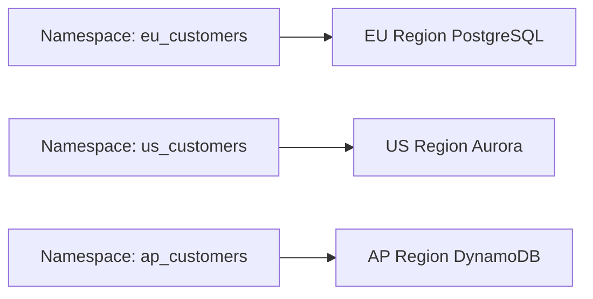
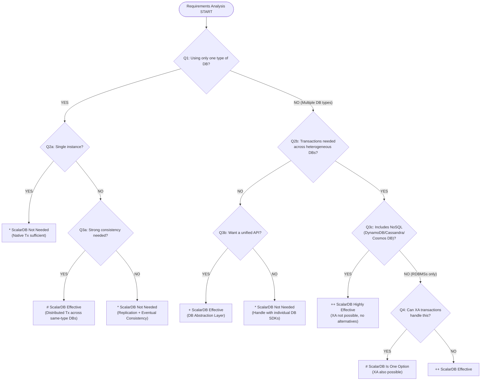
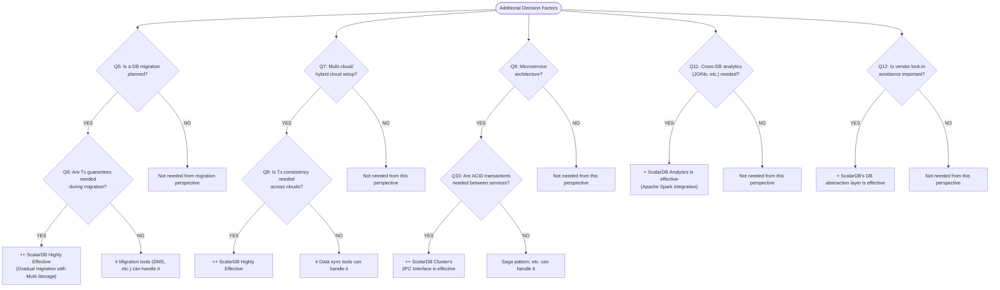

# ScalarDB Cluster Effective Use Case Research

## 1. ACID Transactions Across Heterogeneous Databases

### Difficulty of Implementation Without ScalarDB

Achieving ACID transactions across heterogeneous databases (e.g., order data on MySQL and inventory data on DynamoDB) is extremely difficult without ScalarDB. The reasons are as follows.

**Limitations of XA Transactions:**
The traditional X/Open XA standard is a standard approach for achieving distributed transactions across multiple resource managers, but it has constraints at three levels.

1. **NoSQL is out of scope**: NoSQL databases such as Cassandra, DynamoDB, MongoDB, and Azure Cosmos DB do not support XA at all. XA cannot be used in environments where RDBMS and NoSQL coexist.

2. **Significant implementation differences even among RDBMSs**: Each DB has its own specific constraints and bugs, such as MySQL (InnoDB only, replication filters not allowed, unsafe with Statement-Based replication), PostgreSQL (risk of orphaned Prepared transactions, VACUUM interference, official documentation warns "you probably shouldn't be using this feature unless you're implementing a transaction manager"). In heterogeneous RDBMS environments (e.g., MySQL + PostgreSQL), differences in 2PC implementations, inconsistent failure recovery procedures, and mismatched timeout behaviors pose significant operational risks.

3. **High operational risk**: XA's 2PC is a blocking protocol. If the Transaction Manager (TM) fails, transactions in all participating DBs freeze in the Prepared state, with locks held for extended periods. The TM becomes a Single Point of Failure (SPOF), posing a serious risk in systems requiring high availability.

> **Details**: For a detailed investigation of XA usage across heterogeneous DBs, see `15_xa_heterogeneous_investigation.md`

**Limitations of the Saga Pattern:**
The Saga pattern, commonly used in microservice architectures, chains local transactions across services to achieve eventual consistency, but has the following issues:
- Intermediate states are exposed externally (Isolation violation)
- Design and implementation of compensating transactions (rollback equivalent) is extremely complex
- **Cannot guarantee strong consistency (Serializable)**
- Requires compensation logic tightly coupled to business logic

**Difficulty of Custom Implementation:**
Implementing the Two-Phase Commit (2PC) protocol from scratch requires extremely advanced distributed systems knowledge and enormous implementation/testing effort, including coordinator failure recovery, participant timeout handling, network partition response, and distributed lock management.

### Ease of Implementation With ScalarDB

ScalarDB's [Consensus Commit protocol](https://scalardb.scalar-labs.com/docs/latest/consensus-commit/) adopts a unique approach that **treats each record as a WAL (Write-Ahead Log) unit and executes 2PC at the record level**. This achieves ACID properties **without depending on the underlying database's transaction features**.

The minimum capabilities required from underlying databases are:
- Linearizable Read/Write for a single record
- Durability of written records

That is all. This means it works without issues even with NoSQL databases like DynamoDB or Cassandra that have limited transaction capabilities.

**Configuration Example (Multi-Storage Setup):**
```properties
# Transaction manager configuration
scalar.db.transaction_manager=consensus-commit
scalar.db.storage=multi-storage

# Storage definitions
scalar.db.multi_storage.storages=mysql,cassandra

# Namespace mapping
scalar.db.multi_storage.namespace_mapping=customer:mysql,order:cassandra
scalar.db.multi_storage.default_storage=cassandra
```

With just this configuration, table operations in the `customer` namespace are automatically routed to MySQL, table operations in the `order` namespace are routed to Cassandra, and transactions spanning both are guaranteed ACID compliance.

ScalarDB's official sample ([Microservice Transaction Sample](https://scalardb.scalar-labs.com/docs/3.13/scalardb-samples/microservice-transaction-sample/)) demonstrates a concrete example where Customer Service (MySQL) and Order Service (Cassandra) collaborate using the 2PC interface.

---

## 2. Transaction Guarantees During Database Migration

### Severity of the Challenge

During gradual migration from on-premises RDBMS (e.g., Oracle Database) to cloud NoSQL (e.g., DynamoDB), the most difficult problem is **maintaining data consistency during the migration period**.

Traditional approaches:
- **Big Bang Migration:** Causes downtime and makes rollback difficult
- **Replication Approach:** One-way synchronization via read-only replicas is possible, but cannot guarantee consistency for write transactions to both DBs
- **Double Write Approach:** Writes simultaneously to two DBs, but recovery when one write fails is extremely complex

### Solution with ScalarDB

Using ScalarDB's Multi-Storage Transactions feature, **ACID transactions spanning both the old DB (Oracle) and new DB (DynamoDB) can be maintained during the migration period**.

**Gradual Migration Flow:**
1. **Phase 1:** Introduce ScalarDB and map all tables to the old DB (Oracle)
2. **Phase 2:** Migrate data table by table to the new DB (DynamoDB) and switch namespace mappings
3. **Phase 3:** All tables have been migrated to the new DB
4. **Phase 4:** Remove ScalarDB if desired, or continue using it

The greatest advantage is that **no application code changes are required** between phases. ScalarDB's abstraction layer allows the same API to be used regardless of the underlying database type.

---

## 3. Data Consistency in Multi-Cloud/Hybrid Cloud Environments

### Challenges

Data management in multi-cloud environments faces the following difficulties:
- Each cloud provider's database service has its own API, resulting in **low data portability**
- Data synchronization between clouds assumes asynchronous replication, **requiring conflict resolution for concurrent updates to the same data**
- Standard distributed transaction protocols do not function between cloud services

### Solution with ScalarDB

ScalarDB can uniformly handle the following databases:
- **RDBMSs:** MySQL, PostgreSQL, Oracle, SQL Server, MariaDB, Aurora, YugabyteDB, SQLite (for development/testing)
- **NoSQL:** Amazon DynamoDB, Apache Cassandra, Azure Cosmos DB

This unified interface enables the possibility of obtaining **ACID guarantees for data spanning AWS (DynamoDB) + Azure (Cosmos DB) + on-premises (PostgreSQL) within a single transaction**.

**Vendor Lock-In Avoidance Mechanism:**
ScalarDB's database abstraction layer means applications do not depend on specific database APIs. When switching from DynamoDB to Cassandra in the future, only configuration file changes are needed.

---

## 4. Coexistence of Legacy and Modern Systems

### Typical Scenario

Many enterprises face the following situations:
- Core systems have been running on Oracle Database for over 20 years
- New services are built on DynamoDB or Cassandra
- Data consistency between both systems is required

### Gradual Modernization with ScalarDB

ScalarDB's [deployment patterns](https://scalardb.scalar-labs.com/docs/latest/scalardb-cluster/deployment-patterns-for-microservices/) offer two approaches.

**Shared-Cluster Pattern:**
- All microservices share a single ScalarDB Cluster instance
- Simple implementation via One-Phase Commit interface
- High resource efficiency and easy management
- **Recommended pattern**

**Separated-Cluster Pattern:**
- Each microservice has its own dedicated ScalarDB Cluster instance
- Two-Phase Commit interface required
- High isolation between services
- More complex, but effective when prioritizing team independence

**Code Example (Two-Phase Commit Interface):**
```java
// Coordinator (Order Service) side
TwoPhaseCommitTransaction tx = transactionManager.begin();
// Write order data
tx.put(orderPut);

// Participant (Customer Service) side joins the transaction
TwoPhaseCommitTransaction participantTx = transactionManager.join(tx.getId());
// Update balance
participantTx.put(customerPut);

// Both services: prepare -> validate -> commit
tx.prepare();
participantTx.prepare();
tx.validate();
participantTx.validate();
tx.commit();
participantTx.commit();
```

> **Note**: The `Put` API was deprecated in ScalarDB 3.13. Use `Insert`/`Update`/`Upsert` in production code.

---

## 5. Data Distribution Management Due to Regulatory Requirements

### Challenges

Data residency requirements such as GDPR require:
- EU citizen data must be stored in data centers within the EU
- Business transaction consistency is still needed across geographically distributed data
- Geographic redundancy of backups may conflict with data residency requirements
- Different data storage infrastructure is needed per regulation (EU, China, India, Russia, etc.)

### Applicability of ScalarDB

By placing different database instances in each region and using ScalarDB's Multi-Storage feature for namespace mapping, the following can be achieved:



However, **ACID transactions across geographically distant databases are significantly affected by network latency**, so the design of transaction scope (which data requires transaction guarantees and to what extent) is critical. ScalarDB's Consensus Commit protocol uses Optimistic Concurrency Control (OCC), which performs well in low-contention environments, but retries may increase in high-latency environments with contention.

---

## Criteria for Determining When ScalarDB Is Not Needed

If any of the following apply, introducing ScalarDB may be unnecessary (over-investment):

- **Using only a single type of database:** Systems that are self-contained within a single RDBMS are sufficient with native transactions
- **Eventual consistency is acceptable:** When strong consistency is not a business requirement (e.g., analytical data pipelines, log collection)
- **XA transactions can handle it:** Configurations with only RDBMSs where XA is supported (however, implementation differences and operational risks exist across heterogeneous RDBMSs, so this is only recommended for same-type RDBMS pairs. See `15_xa_heterogeneous_investigation.md` for details)
- **Read-only cross-DB references:** When only cross-DB JOINs are needed without write transactions (though ScalarDB Analytics is useful here)
- **No transactions needed between microservices:** When Saga pattern + eventual consistency is sufficient

---

### Prerequisites for ScalarDB Adoption

The following constraints must be understood before deciding to adopt ScalarDB.

| Constraint | Description | Mitigation |
|------------|-------------|------------|
| **All data access via ScalarDB** | All access to tables managed by ScalarDB must go through ScalarDB. Mixing with direct DB access compromises transaction consistency | Transaction Metadata Decoupling in 3.17 allows direct reads from metadata-separated tables by other systems |
| **Minimize ScalarDB-managed scope** | Not all tables need to be under ScalarDB management. Only tables participating in inter-service transactions should be managed, while tables self-contained within a service can be accessed via native DB APIs | - |
| **DB-specific feature restrictions** | Since ScalarDB's abstraction API is used, advanced DB-specific features (PostgreSQL JSONB queries, Cassandra Materialized Views, etc.) cannot be used directly | Native SQL queries are possible via ScalarDB Analytics |
| **Commercial license** | A commercial license or trial key is required to use ScalarDB Cluster | - |

---

## Decision Tree for Use Case Assessment





**Legend:**
- ++ ScalarDB Highly Effective (almost no alternatives, or extremely difficult otherwise)
- + ScalarDB Effective (other approaches exist, but ScalarDB is an excellent choice)
- # ScalarDB Is One Option (other approaches can also handle it)
- * ScalarDB Not Needed

**Important Note**: Since ScalarDB 3.17, Get/Scan via secondary indexes has been redefined as eventually consistent. ACID guarantees are fully applied to access via primary keys (Partition Key + Clustering Key). Consider this characteristic if your design heavily uses secondary indexes.

---

## Use Case Classification Matrix

| Perspective | ScalarDB Not Needed | ScalarDB Effective | ScalarDB Highly Effective |
|---|---|---|---|
| **DB Types** | Single type only | Multiple instances of same type | Heterogeneous mix (RDBMS + NoSQL) |
| **Transaction Scope** | Within single DB | Across same-type DBs (XA possible) | Cross-DB (XA not possible) |
| **Consistency Requirements** | Eventual consistency acceptable | Partial strong consistency | Full strong consistency (Serializable) |
| **Migration Phase** | New build (single DB) | Current operation (stable) | During migration (old DB + new DB coexisting) |
| **Infrastructure** | Single cloud, single DB | Single cloud, multiple DBs | Multi-cloud/hybrid |

> **Realistic Assessment of XA Usage**: The "Across same-type DBs (XA possible)" column assumes an ideal case of same-type RDBMSs (e.g., MySQL to MySQL). Across heterogeneous RDBMSs (e.g., MySQL + PostgreSQL), actual operation is difficult due to differences in each DB's XA implementation (2PC command systems, timeout behavior, failure recovery procedures). Additionally, an XA-compatible Transaction Manager (such as Atomikos) is required, and the TM itself risks becoming a single point of failure.

---

## Use Case Priority/Difficulty Matrix

| Priority | Use Case | Difficulty (Without ScalarDB) | Reason |
|---|---|---|---|
| **1** | ACID transactions across heterogeneous DBs including NoSQL | Nearly impossible | When XA-incompatible NoSQL is included, implementing a distributed transaction protocol from scratch is required |
| **2** | Transaction guarantees during DB migration | Extremely difficult | No general-purpose mechanism exists to maintain consistency for double writes to old and new DBs |
| **3** | Cross-DB transactions between microservices | Very difficult | Saga pattern provides eventual consistency only. No alternative when strong consistency is needed |
| **4** | Data consistency across multi-cloud | Difficult | Few general-purpose middleware options exist to absorb differences in cloud vendor-specific APIs |
| **5** | Data distribution management due to regulatory requirements | Difficult | General solutions for geographically distributed DB consistency are scarce (though latency challenges exist) |

### Industry-Specific Use Case Examples

| Industry | Use Case | ScalarDB's Role | Configuration Example |
|----------|----------|-----------------|----------------------|
| **Finance** | Inter-account transfers (across different banking systems) | Real-time settlement transaction guarantees across heterogeneous DBs | PostgreSQL (accounting) + DynamoDB (transaction history) |
| **Finance** | Payment gateway | Consistency guarantees spanning multiple payment providers | MySQL (orders) + Cassandra (payment logs) |
| **E-Commerce/Retail** | Inventory management + ordering + payment | ACID transactions for inventory allocation, order confirmation, and payment processing | PostgreSQL (inventory) + MySQL (orders) + DynamoDB (payments) |
| **Healthcare** | Electronic medical records + prescriptions + insurance claims | Consistency guarantees for patient data, prescription data, and billing data | PostgreSQL (medical records) + Cosmos DB (prescriptions) |
| **Gaming** | Multi-region item trading | Consistency for inter-region item transfers and billing | DynamoDB (items) + Aurora (billing) |
| **Logistics** | Delivery tracking + inventory management | Consistency for inter-warehouse inventory transfers and delivery status | Cassandra (tracking) + PostgreSQL (inventory) |

---

## ScalarDB Cluster-Specific Added Value

In addition to the core features above, ScalarDB Cluster provides the following enterprise features:

1. **Clustering on Kubernetes:** Availability and scalability across multiple nodes
2. **Request Routing:** Automatic routing to the appropriate node holding transaction state (2 modes: indirect/direct-kubernetes)
3. **Multi-Language Support:** Available from languages other than Java (Go, .NET, etc.) via gRPC API
4. **SQL/GraphQL Interface:** Simplifies application development with declarative queries
5. **Transaction-Consistent Backup:** Cluster pause and backup via Scalar Admin interface
6. **Vector Search (Private Preview):** Unified vector store abstraction for LLM RAG

---

## Summary

**Regarding Isolation Levels**: ScalarDB's Consensus Commit supports three isolation levels: **SNAPSHOT** (default), **SERIALIZABLE**, and **READ_COMMITTED**. LINEARIZABLE is not supported. In SERIALIZABLE mode, anti-dependency checks via extra-reads are added, providing stronger consistency guarantees.

ScalarDB (especially ScalarDB Cluster) **demonstrates its greatest value** when the following conditions overlap:

1. **Multiple types of databases exist, including NoSQL**
2. **ACID transactions are needed across those DBs**
3. **Microservice architecture where each service uses a different DB**
4. **Future DB migration or multi-cloud deployment is anticipated**

Conversely, for systems that are self-contained within a single RDBMS or where eventual consistency is sufficient, introducing ScalarDB may be over-investment.

---

## Features Enhanced in ScalarDB 3.17

ScalarDB 3.17 adds the following new features, expanding the range of use cases.

### Virtual Tables

**Virtual Tables** have been introduced in the storage abstraction layer, supporting logical joining of two tables via primary key. This enables logically integrating data that is physically distributed across separate tables, achieving storage abstraction to bring existing tables under ScalarDB management without schema changes. Specifically, application data tables and transaction metadata tables are logically joined by primary key, allowing existing table structures to be incorporated into ScalarDB's transaction management without modification.

### Role-Based Access Control (RBAC)

**RBAC (Role-Based Access Control)** has been added to ScalarDB Cluster. Permission management at the namespace and table level is now possible, strengthening use cases in multi-tenant environments and systems with strict security requirements.

### Enhanced Aggregate Functions (ScalarDB SQL)

`SUM`, `MIN`, `MAX`, `AVG`, and `HAVING` clauses are now supported, reducing the need to implement aggregation processing on the application side. Simple analytical queries can now be executed with ScalarDB SQL alone.

### Object Storage Support (Private Preview)

Amazon S3, Azure Blob Storage, and Google Cloud Storage have been added as storage backends (Private Preview). This opens the possibility of applying ScalarDB's transaction guarantees to large-volume data and cold data management. (As this is in Private Preview, please refer to official documentation for specific use cases and scope.)

---

## References

- [ScalarDB Overview](https://scalardb.scalar-labs.com/docs/3.13/overview/)
- [Multi-Storage Transactions](https://scalardb.scalar-labs.com/docs/latest/multi-storage-transactions/)
- [Consensus Commit Protocol](https://scalardb.scalar-labs.com/docs/latest/consensus-commit/)
- [Two-Phase Commit Transactions](https://scalardb.scalar-labs.com/docs/latest/two-phase-commit-transactions/)
- [ScalarDB Cluster Deployment Patterns for Microservices](https://scalardb.scalar-labs.com/docs/latest/scalardb-cluster/deployment-patterns-for-microservices/)
- [Microservice Transaction Sample](https://scalardb.scalar-labs.com/docs/3.13/scalardb-samples/microservice-transaction-sample/)
- [ScalarDB Analytics Design](https://scalardb.scalar-labs.com/docs/latest/scalardb-analytics/design/)
- [ScalarDB: Universal Transaction Manager for Polystores (VLDB'23)](https://dl.acm.org/doi/10.14778/3611540.3611563)
- [ScalarDB Cluster gRPC API Guide](https://scalardb.scalar-labs.com/docs/latest/scalardb-cluster/scalardb-cluster-grpc-api-guide/)
- [ScalarDB GitHub Repository](https://github.com/scalar-labs/scalardb)
- [Distributed Transactions Spanning Multiple Databases (Medium)](https://medium.com/scalar-engineering/distributed-transactions-spanning-multiple-databases-with-scalar-db-part-1-34c06d34a8c0)
- [ScalarDB Vector Search](https://scalardb.scalar-labs.com/docs/latest/scalardb-cluster/getting-started-with-vector-search/)
- [Google Cloud Multi-cloud Database Management](https://cloud.google.com/architecture/multi-cloud-database-management)
