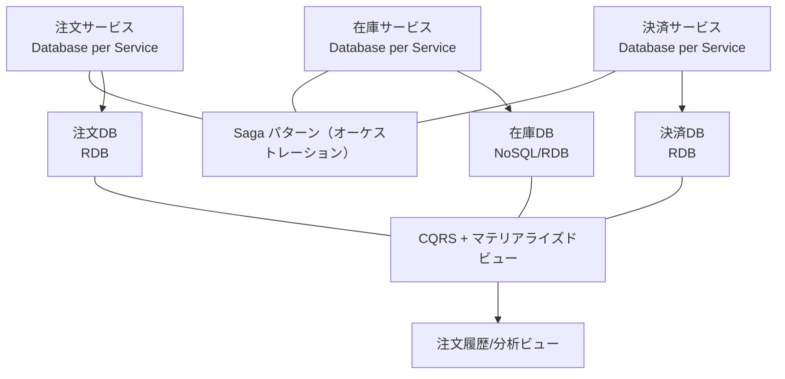
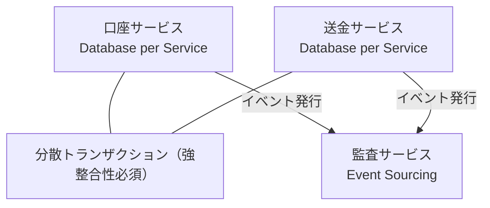
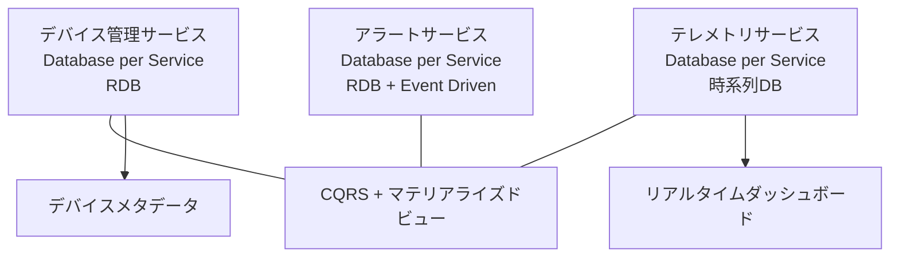
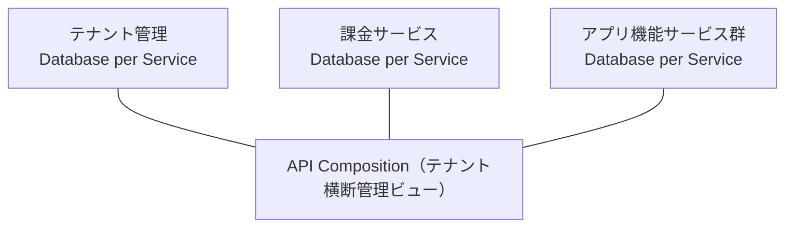
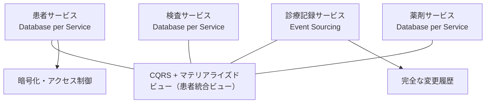
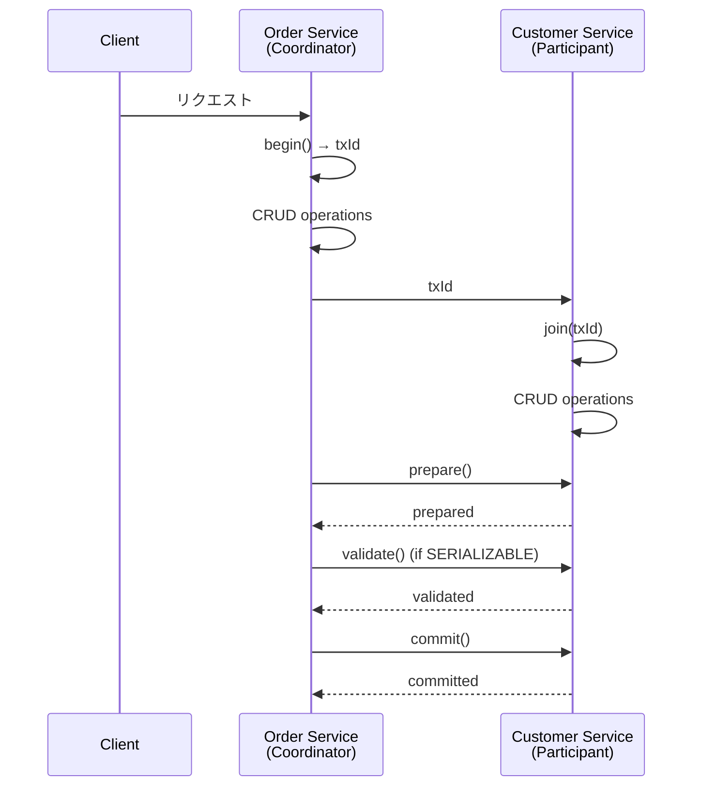
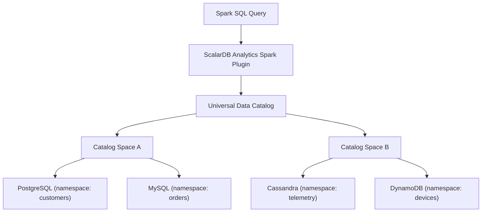
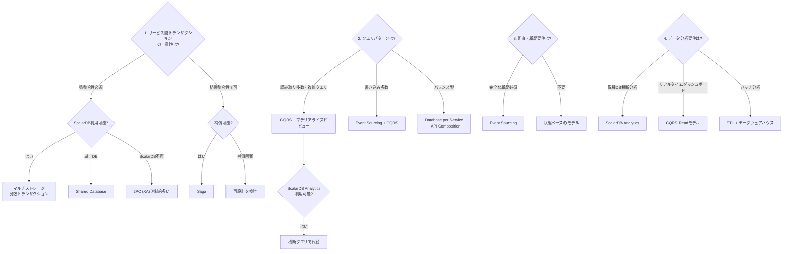

# 論理データモデルパターン調査

マイクロサービスアーキテクチャにおけるデータモデル（論理モデル）パターンの包括的調査。

---

## 1. データモデルパターンの洗い出し

### 1.1 Database per Service パターン

**概要**: 各マイクロサービスが自身の専用データベースを持ち、他のサービスからは直接アクセスできないようにするパターン。データの所有権が明確になり、サービスの独立性が保たれる。

**論理モデル上の特徴**:
- 各サービスがそれぞれ独自のスキーマを定義
- サービス間のデータ参照はAPI経由のみ
- テーブル間の外部キー制約はサービス境界を超えない

**利点**:
- サービスごとに最適なデータベース技術を選択可能（ポリグロットパーシステンス）
- スキーマ変更が他サービスに影響しない
- 独立したスケーリングが可能
- 障害の分離が容易

**欠点**:
- サービス間の結合クエリが困難
- 分散トランザクションの管理が複雑
- データの重複が発生しやすい
- 参照整合性の維持が困難

**適用条件**: サービス間のデータ独立性が高く、サービス境界が明確に定義できる場合。ドメイン駆動設計（DDD）の境界づけられたコンテキストと対応させるのが理想的。

---

### 1.2 Shared Database パターン

**概要**: 複数のマイクロサービスが同一のデータベースを共有するパターン。各サービスは共有データベース内の異なるテーブルセットにアクセスする。

**論理モデル上の特徴**:
- 統一されたスキーマ（または複数サービスから参照される共通テーブルが存在）
- 外部キー制約をサービス間で利用可能
- 共有テーブルへの同時アクセスが発生

**利点**:
- ACID トランザクションが容易に利用可能
- JOINによるデータ結合が簡単
- データの一貫性維持が容易
- 既存モノリスからの移行が容易

**欠点**:
- サービス間の密結合を招く
- スキーマ変更の影響範囲が大きい
- 独立したスケーリングが困難
- データベースが単一障害点(SPOF)になりうる
- 開発・デプロイの独立性が損なわれる

**適用条件**: モノリスからの段階的移行フェーズ、サービス間のデータ結合が非常に強い場合、小規模チームでの運用。

---

### 1.3 API Composition パターン

**概要**: 複数のサービスにまたがるデータの統合クエリを、API Composer（集約レイヤー）が各サービスのAPIを呼び出して結果を統合するパターン。

**論理モデル上の特徴**:
- 各サービスの論理モデルは独立
- Composerレイヤーが仮想的な統合ビューを構成
- 各サービスからの応答を結合・フィルタリング

**利点**:
- サービスの独立性を維持しつつ統合クエリが可能
- 実装が比較的シンプル
- 各サービスのデータモデル変更に対して柔軟

**欠点**:
- 大量データの結合はパフォーマンスが劣化
- サービス間の一貫性はリアルタイムでは保証されない
- N+1問題が発生しやすい
- Composerが複雑化しやすい
- ネットワーク呼び出しによるレイテンシ増加

**適用条件**: 統合クエリの頻度が低い場合、データ量が比較的少量の場合、リアルタイム一貫性が不要な場合。

---

### 1.4 CQRS（Command Query Responsibility Segregation）パターン

**概要**: コマンド（書き込み）とクエリ（読み取り）を分離し、それぞれに最適化された独立したデータモデルとサービスを持つパターン。

**論理モデル上の特徴**:
- **Writeモデル（コマンド側）**: ドメインロジックに最適化された正規化モデル。ビジネスルールの検証と状態変更に焦点
- **Readモデル（クエリ側）**: クエリパフォーマンスに最適化された非正規化モデル。複数の集約からのデータを事前結合
- 書き込みイベントを通じてReadモデルが非同期更新される

**利点**:
- 読み取りと書き込みを独立にスケーリング可能
- 各モデルを最適化できる（正規化 vs 非正規化）
- 複雑なクエリ要件に対応しやすい
- 読み取りパフォーマンスの大幅改善

**欠点**:
- アーキテクチャの複雑性が増大
- ReadモデルとWriteモデル間の結果整合性（Eventual Consistency）
- データ同期の遅延が発生
- 開発・運用コストの増加

**適用条件**: 読み取りと書き込みの比率が大きく異なる場合（読み取り多数）、複雑なクエリ要件がある場合、読み取りパフォーマンスが最重要な場合。

---

### 1.5 Event Sourcing パターン

**概要**: エンティティの現在の状態ではなく、状態変更の履歴（イベント）をすべて記録するパターン。現在の状態はイベントのリプレイにより再構築される。

**論理モデル上の特徴**:
- **イベントストア**: イベントのAppend-onlyログ。各イベントはイミュータブル
- **イベント構造**: `{AggregateId, EventType, EventData, Timestamp, Version}`
- **スナップショット**: パフォーマンス改善のため、定期的にスナップショットを保存
- 現在の状態を取得するにはCQRSとの併用が実質的に必須

**利点**:
- 完全な監査証跡
- 任意の時点の状態を再構築可能（時間旅行）
- イベントの再処理による新しいビューの生成
- ドメインイベントが自然にビジネスプロセスを表現

**欠点**:
- クエリが困難（CQRSが事実上必須）
- イベントストアの肥大化
- イベントスキーマの進化が困難
- 学習コストが高い
- デバッグが複雑

**適用条件**: 監査要件が厳格な場合（金融、ヘルスケア）、ビジネスプロセスの履歴追跡が必要な場合、複雑なドメインロジックをイベント駆動で表現したい場合。

---

### 1.6 Saga パターンでのデータ管理

**概要**: 複数のサービスにまたがるビジネストランザクションを、ローカルトランザクションの連鎖として管理するパターン。失敗時は補償トランザクションで巻き戻す。

**2つのアプローチ**:

| 特性 | コレオグラフィ | オーケストレーション |
|------|---------------|---------------------|
| 制御方式 | イベント駆動・分散 | 中央オーケストレータ |
| 結合度 | 低い | オーケストレータに依存 |
| 論理モデル | 各サービスがローカル状態を管理 | オーケストレータが全体状態を管理 |
| 可視性 | 全体の進捗把握が困難 | 全体の進捗が明確 |
| 適用規模 | 小規模Saga | 複雑なSaga |

**論理モデル上の特徴**:
- 各サービスにSaga参加状態のテーブルが必要（`saga_state`, `outbox`テーブル等）
- 補償トランザクション用のデータ保持が必要
- Transactional Outboxパターンとの組み合わせが多い

**利点**:
- 分散トランザクションの回避
- サービスの疎結合を維持
- 長時間実行トランザクションに対応

**欠点**:
- 補償ロジックの設計が複雑
- 中間状態（Pending状態）の管理が必要
- デバッグとテストが困難
- 結果整合性のみを保証

**適用条件**: サービス間のビジネストランザクションが必要だが強整合性が不要な場合、補償可能なビジネスプロセスの場合。

---

### 1.7 マテリアライズドビュー

**概要**: 事前に計算・結合されたデータのスナップショットを保持するパターン。複数サービスのデータを統合した非正規化ビューを読み取り専用で管理する。

**論理モデル上の特徴**:
- ソースデータの変更を検知してビューを更新（イベント駆動またはポーリング）
- クエリに最適化された非正規化スキーマ
- CQRSのReadモデルとして実装されることが多い

**利点**:
- クエリパフォーマンスの大幅改善
- 複雑なJOINの回避
- 読み取り負荷のオフロード

**欠点**:
- データの鮮度に遅延が生じる
- ストレージコストの増加
- 更新ロジックの保守が必要

**適用条件**: 読み取りパフォーマンスが重要な場合、複数サービスのデータを頻繁に結合参照する場合。

---

## 2. ユースケース別の適用パターン

### 2.1 ECサイト（注文、在庫、決済の分散管理）

**推奨パターン構成**:



**論理モデル例**:

- **注文サービス**: `orders(order_id, customer_id, status, total_amount, created_at)`, `order_items(order_id, item_id, quantity, price)`
- **在庫サービス**: `inventory(item_id, warehouse_id, quantity, reserved_quantity)`
- **決済サービス**: `payments(payment_id, order_id, amount, status, method)`

**パターン選択理由**:
- 注文フロー全体はSagaで管理（注文作成 -> 在庫確保 -> 決済 -> 確定、失敗時は補償）
- 在庫の「予約」と「確定」の2段階でSaga中間状態を管理
- 注文履歴・ダッシュボードはCQRSのReadモデルで提供
- 在庫照会は高頻度のため、マテリアライズドビューでキャッシュ

---

### 2.2 金融システム（口座間送金、残高管理）

**推奨パターン構成**:



**論理モデル例**:

- **口座サービス**: `accounts(account_id, customer_id, balance, currency, status)`
- **送金サービス**: `transfers(transfer_id, from_account, to_account, amount, status, timestamp)`
- **監査サービス（イベントストア）**: `account_events(event_id, aggregate_id, event_type, event_data, version, timestamp)`

**パターン選択理由**:
- 口座間送金は強整合性が必須 -> 分散トランザクション（ScalarDBが有効）
- Sagaの結果整合性では残高の一時的な不整合が許容できないケースが多い
- 監査要件のためEvent Sourcingで全履歴を保持
- 規制対応のための完全な監査証跡

---

### 2.3 IoTデータ管理（大量データ、時系列）

**推奨パターン構成**:



**論理モデル例**:

- **デバイス管理**: `devices(device_id, name, type, location, status, metadata)`
- **テレメトリ**: `measurements(device_id, timestamp, metric_name, value)` (時系列パーティション)
- **アラート**: `alert_rules(rule_id, device_type, condition, threshold)`, `alerts(alert_id, device_id, rule_id, triggered_at, status)`

**パターン選択理由**:
- テレメトリデータは書き込み特化 -> 時系列DBが最適
- ダッシュボード表示はCQRS ReadモデルまたはマテリアライズドビューでPreaggregate
- デバイスメタデータは参照頻度が高くRDBが適切
- サービス間の一貫性は結果整合性で十分

---

### 2.4 SaaSマルチテナント

**推奨パターン構成**:

テナント分離戦略:
- A) テナントごとに独立DB（Database per Tenant）
- B) 共有DB、テナントごとにスキーマ分離
- C) 共有DB、共有テーブル（tenant_idカラムで分離）



**論理モデル例**（戦略Cの場合）:

- 全テーブルに`tenant_id`を含める: `resources(tenant_id, resource_id, name, ...)`
- Row Level Securityまたはアプリケーション層でテナント分離
- テナント管理: `tenants(tenant_id, plan, config, limits)`

**パターン選択理由**:
- テナント規模に応じて分離戦略を選択（大規模テナントは独立DB、小規模は共有）
- 課金・テナント管理は独立サービスで集中管理
- テナント横断の管理ダッシュボードはAPI Compositionまたはマテリアライズドビュー
- コンプライアンス要件（データ所在地等）によりテナント単位のDB分離が必要な場合あり

---

### 2.5 ヘルスケア（患者データの統合参照）

**推奨パターン構成**:



**論理モデル例**:

- **患者サービス**: `patients(patient_id, name_encrypted, dob_encrypted, insurance_id)`
- **診療記録（イベントストア）**: `medical_events(event_id, patient_id, event_type, data_encrypted, provider_id, timestamp, version)`
- **統合ビュー（Read Model）**: `patient_summary(patient_id, demographics, recent_visits, active_medications, lab_results)` -- 非正規化された統合ビュー

**パターン選択理由**:
- 診療記録はEvent Sourcingで完全な変更履歴を保持（法規制要件）
- 患者データの統合参照はCQRS Readモデルで提供（複数サービスを横断）
- データの暗号化・アクセス制御がサービスレベルで必要
- 監査ログの保持が法的に義務付けられている

---

## 3. 機能要件によるデータモデルの決定

### 3.1 データの一貫性要件

| 一貫性レベル | 特徴 | 適用パターン | ユースケース例 |
|-------------|------|-------------|---------------|
| **強整合性（Strong Consistency）** | 全サービスが常に同一の最新データを参照 | 分散トランザクション、Shared Database | 銀行送金、在庫の即座確定、座席予約 |
| **結果整合性（Eventual Consistency）** | 一定時間後に全サービスのデータが収束 | Saga、CQRS、Event Sourcing | 注文ステータス更新、通知、レポート |
| **因果整合性（Causal Consistency）** | 因果関係のある操作の順序を保証 | イベント駆動 + 因果順序保証 | チャットメッセージ、ワークフロー |

**決定基準**:
- ビジネス上の損失リスク: 一時的な不整合が金銭的損失を招くか?
- ユーザー体験への影響: 不整合がユーザーに見えるか?
- 法規制要件: 規制が即時一貫性を要求するか?

### 3.2 データの所有権

**原則**: 各データエンティティは唯一のサービスがオーナーであるべき（Single Source of Truth）。

```
データ所有権のマッピング例（ECサイト）:

  注文サービス        -> orders, order_items （オーナー）
  在庫サービス        -> inventory, warehouses （オーナー）
  決済サービス        -> payments, refunds （オーナー）
  顧客サービス        -> customers, addresses （オーナー）

  各サービスは他サービスのデータを:
    - APIで参照（同期）
    - イベントでローカルコピーを持つ（非同期）
    - 参照IDのみ保持（customer_id等）
```

**データ所有権の決定ガイドライン**:
1. そのデータを作成・更新するビジネスプロセスはどれか?
2. そのデータの整合性に責任を持つのはどのチームか?
3. DDDの集約ルート（Aggregate Root）はどこに置くべきか?

### 3.3 データの共有パターン

| パターン | 説明 | 結合度 | データ鮮度 |
|---------|------|--------|-----------|
| **API呼び出し（同期）** | 必要な時にオーナーサービスにリクエスト | 中 | リアルタイム |
| **イベント駆動ローカルコピー** | イベントを購読してローカルDBにコピーを保持 | 低 | 結果整合性 |
| **共有ライブラリ** | 共通データ構造をライブラリとして共有 | 高 | - |
| **参照IDのみ保持** | 他サービスのエンティティIDだけを保存 | 最低 | 参照時に最新 |
| **データメッシュ** | ドメインごとのデータプロダクトとして公開 | 低 | ポリシー依存 |

### 3.4 参照整合性の維持方法

マイクロサービスではDBレベルの外部キー制約がサービス境界を越えられないため、以下の代替策を用いる:

1. **アプリケーションレベルの整合性チェック**: データ操作時にAPIで関連サービスの存在確認
2. **イベント駆動の整合性修復**: 不整合を検知してイベントで修正（Reconciliation）
3. **Soft Delete**: 物理削除ではなく論理削除を使い、参照先消失を防止
4. **定期的な整合性チェックバッチ**: 非同期にサービス間のデータ整合性を検証
5. **Saga での補償**: 参照先が無効な場合に補償トランザクションで整合性を回復

---

## 4. 非機能要件によるデータモデルの決定

### 4.1 レイテンシ要件

| レイテンシ要件 | 推奨アプローチ | データモデルへの影響 |
|--------------|--------------|-------------------|
| **超低遅延（< 10ms）** | ローカルキャッシュ、マテリアライズドビュー | 非正規化、事前計算済みデータ |
| **低遅延（< 100ms）** | Database per Service + インデックス最適化 | 適度な非正規化 |
| **中程度（< 1s）** | API Composition | 正規化モデル + API結合 |
| **許容的（> 1s）** | CQRS、Event Sourcing | 正規化モデル + 非同期更新ビュー |

**影響**: レイテンシ要件が厳しいほど、非正規化・データ複製・事前計算が必要となり、論理モデルはデータの重複を許容する方向に変化する。

### 4.2 スループット要件

| スループット | 推奨アプローチ | データモデルへの影響 |
|------------|--------------|-------------------|
| **高書き込み** | パーティショニング、Event Sourcing（Append-only） | パーティションキー設計が重要、書き込み競合の回避 |
| **高読み取り** | CQRS Readモデル、リードレプリカ、キャッシュ | 複数の非正規化ビュー |
| **混合（HTAP）** | HTAP対応DB、CQRS | 書き込みモデルと読み取りモデルの分離 |

### 4.3 データ量

| データ量 | 推奨アプローチ | データモデルへの影響 |
|---------|--------------|-------------------|
| **小〜中規模（GB単位）** | RDB、Database per Service | 正規化モデルで問題なし |
| **大規模（TB単位）** | NoSQL、パーティショニング戦略 | パーティションキーの慎重な設計、アクセスパターン駆動のモデル |
| **超大規模（PB単位）** | データレイク + 分析エンジン | 運用DBと分析DBの分離、イベントストリーム中心 |

### 4.4 可用性要件

| 可用性 | 推奨アプローチ | データモデルへの影響 |
|--------|--------------|-------------------|
| **99.9%** | マルチAZ、標準レプリケーション | 標準的な正規化モデル |
| **99.99%** | マルチリージョン、サーキットブレーカー | ローカルコピーの保持、非同期レプリケーション |
| **99.999%** | アクティブ-アクティブ、結果整合性の許容 | Conflict-freeデータ型（CRDT）の検討 |

**影響**: 高可用性ほどデータの複製が増え、結果整合性を許容する方向にモデルが変化する。

### 4.5 セキュリティ・コンプライアンス要件

| 要件 | データモデルへの影響 |
|-----|-------------------|
| **データ暗号化（保存時）** | 暗号化カラムの定義、鍵管理テーブル |
| **データ暗号化（通信時）** | 論理モデルへの影響は少ない（インフラ層） |
| **GDPR（忘れられる権利）** | ユーザー識別データの分離、匿名化可能な設計 |
| **HIPAA** | PHI（保護対象医療情報）の分離、アクセス監査ログ |
| **PCI DSS** | カード情報の分離・トークン化 |
| **データレジデンシー** | テナント/地域ごとのDB分離、マルチリージョン設計 |

---

## 5. ScalarDBとの関連

### 5.1 ScalarDBのマルチストレージ機能が論理モデルに与える影響

ScalarDBは「Namespace-to-Storage」マッピングにより、異なるデータベース上のテーブルを単一のトランザクションスコープ内で扱える。

**論理モデルへの影響**:

```
通常のDatabase per Serviceでは:
  [注文サービス] -> MySQL (orders)
  [在庫サービス] -> Cassandra (inventory)
  -> サービス間トランザクション不可、Saga等が必須

ScalarDBのマルチストレージでは:
  [統合トランザクション層]
    namespace: order -> MySQL
    namespace: inventory -> Cassandra
  -> 異なるDB上のテーブルでもACIDトランザクションが可能
```

**具体的影響**:
1. **ポリグロットパーシステンスの活用**: 各サービスのデータ特性に応じて最適なDBを選択しつつ、トランザクション一貫性を維持できる。正規化モデルのまま強整合性が確保される
2. **Sagaパターンの回避**: 強整合性が必要なケースで複雑なSaga/補償ロジックが不要になる

> **注意**: ScalarDB 2PCでSagaを代替する場合、全参加サービスが同時に稼働している必要があるため、可用性のトレードオフが発生する。Sagaの結果整合性モデルが許容されるケースでは、引き続きSagaパターンの採用を検討すべきである。
3. **論理モデルの簡素化**: 補償トランザクション用の中間状態テーブル（`saga_state`、`outbox`テーブル等）が不要になる場合がある
4. **データ所有権の柔軟化**: サービス境界を跨いだトランザクションが可能なため、データ所有権の設計に柔軟性が生まれる

**ScalarDBのデータモデル**: ScalarDBはBigtableに触発された拡張キーバリューモデルを採用する。テーブルはNamespaceに属し、Partition KeyとClustering Keyで構成されるPrimary Keyを持つ。各レコードにはトランザクションメタデータ（TxID, Version, State等）が自動的に付与される。

**注意点**:
- ScalarDB経由でのみデータアクセスする制約がある
- メタデータカラムによるストレージオーバーヘッド

#### ScalarDB管理対象の最小化原則

- サービス間トランザクションに参加するテーブルのみをScalarDB管理下に置く
- サービス内で完結するテーブルはネイティブDB APIでアクセスして良い
- 読み取り専用の分析データはScalarDB管理外に複製（ScalarDB Analytics経由）して利用する
- 将来的な移行コスト軽減のため、ScalarDB APIの上にRepository層を設けることを推奨

### 5.2 ScalarDBの分散トランザクションが可能にするデータモデル

ScalarDBの**Consensus Commitプロトコル**と**Two-Phase Commit Interface**は、マイクロサービス間の分散トランザクションを実現する。

**Consensus Commitプロトコルの仕組み**:
1. **Readフェーズ**: 読み書きセットをローカルワークスペースにコピー
2. **Validationフェーズ**: 楽観的並行制御（OCC）による競合検出
3. **Writeフェーズ**: 変更をDBに伝搬
4. **Prepare/Commitフェーズ**: Coordinatorテーブルでトランザクション状態を一元管理

**Two-Phase Commit Interfaceによるマイクロサービストランザクション**:



**可能になるデータモデル**:

1. **Cross-Service ACIDモデル**: 従来Saga等でしか実現できなかったサービス間トランザクションを、ACIDで直接実現。金融システムの口座間送金などで、残高の一時的不整合を完全に排除

2. **Simplified Join Model**: 複数サービスのデータをトランザクション内で一貫して読み取れるため、API Compositionの一貫性問題を解消

3. **ハイブリッドパターン**: 強整合性が必要な箇所はScalarDB分散トランザクション、結果整合性で十分な箇所は従来のイベント駆動を組み合わせ

**サポートされる分離レベル**:
- **SNAPSHOT（デフォルト）**: Snapshot Isolation。パフォーマンスと整合性のバランス
- **SERIALIZABLE**: Extra-Readによるanti-dependency検証。最強の整合性保証。金融系で有効
- **READ_COMMITTED**: Read Committed分離レベル。軽量な分離が求められる場面で使用

### 5.3 ScalarDB Analyticsがデータ参照パターンに与える影響

ScalarDB Analyticsは、**Universal Data Catalog**と**Query Engine**（現在はApache Sparkプラグイン）で構成され、複数の異種データベースを単一の論理データベースとして分析クエリを実行できる。

**アーキテクチャ**:



**データ参照パターンへの影響**:

1. **CQRSの簡素化**: 従来CQRSでReadモデルを別途構築する必要があったが、ScalarDB Analyticsによりソースデータベースに対して直接分析クエリを実行できる。明示的なReadモデルの構築・同期が不要になるケースがある

2. **マテリアライズドビューの代替**: 複数サービスのDBを跨いだJOINが直接可能になるため、事前にマテリアライズドビューを構築する必要性が減少

3. **API Compositionの代替**: 大量データの結合において、API Compositionのパフォーマンス問題を回避。Spark SQLの分散処理能力を活用

4. **HTAP（Hybrid Transactional/Analytical Processing）の実現**: ScalarDBのトランザクション処理 + ScalarDB Analyticsの分析処理を組み合わせることで、運用系と分析系を統合

5. **統一型マッピング**: 15種類の統一データ型（BYTE, INT, BIGINT, FLOAT, DOUBLE, DECIMAL, TEXT, BLOB, BOOLEAN, DATE, TIME, TIMESTAMP等）により、異なるDBのデータ型の不一致を吸収

> **注意: ScalarDB CoreとAnalyticsのデータ型の違い**
> - **ScalarDB Core（トランザクション用、v3.17時点）**: BOOLEAN, INT, BIGINT, FLOAT, DOUBLE, TEXT, BLOB, DATE, TIME, TIMESTAMP, TIMESTAMPTZ の11型をサポート。トランザクション処理で使用するデータ型はこれらに対応する。
> - **ScalarDB Analytics（分析用）**: 上記に加え DECIMAL 等を含む15型をサポート。これらはApache Sparkの型システムを経由して提供される。

**具体的な効果例**:

| 従来のアプローチ | ScalarDB Analytics利用時 |
|-----------------|------------------------|
| ETLでデータウェアハウスに集約 | ソースDBに直接クエリ（ETL不要） |
| CQRSで専用Readモデル構築 | カタログ経由で横断クエリ |
| API Compositionで逐次取得 | Spark SQLでJOIN |
| マテリアライズドビューを手動更新 | リアルタイムにソースを参照 |

**注意点**:
- 分析クエリのため、トランザクション処理のパフォーマンスには影響を与えない設計
- 現時点ではSparkが実行エンジンであり、リアルタイム性はバッチ寄り
- 大量データのOLTPワークロードには向かない（OLAPユースケース向け）

---

## 5.4 ScalarDB 3.17の新機能が論理モデルに与える影響

### Virtual Tables（仮想テーブル）

ScalarDB 3.17で導入されたVirtual Tablesは、プライマリキーによる2テーブルの論理的結合をサポートする。これにより、物理的にはDatabase per Serviceで分離されたテーブルを、論理的には統合されたビューとして扱うことが可能になる。

**論理モデルへの影響**:
- インデックステーブルパターンでの利便性向上（ベーステーブルとインデックステーブルの統合参照）
- サービス間の共有マスタデータへの統一的アクセスの簡素化
- マテリアライズドビューの一部ユースケースを代替可能

### RBAC（ロールベースアクセス制御）

名前空間・テーブルレベルでの権限管理が可能になり、マルチテナントSaaSの論理モデル設計（セクション2.4参照）において、テナント分離をアプリケーション層だけでなくデータアクセス層でも実施可能になった。

### 集約関数の強化

`SUM`, `MIN`, `MAX`, `AVG` および `HAVING` 句のサポートにより、CQRSパターンにおけるRead側の実装がScalarDB SQL単体で対応可能なケースが増加した。

---

## 6. パターン選択のためのディシジョンツリー



ScalarDBは、従来のマイクロサービスデータモデルにおける最大の課題 -- **サービス間の分散トランザクション**と**異種DB横断クエリ** -- に対して、アプリケーション層での複雑なパターン実装を不要にする統合的なソリューションを提供する。特に、Sagaパターンの複雑な補償ロジックを排除し、CQRSの専用Readモデル構築を簡素化できる点が、論理モデル設計に与える最大の影響である。

---

## Sources

- [ScalarDB Multi-Storage Transactions](https://scalardb.scalar-labs.com/docs/latest/multi-storage-transactions/)
- [ScalarDB Consensus Commit Protocol](https://scalardb.scalar-labs.com/docs/latest/consensus-commit/)
- [ScalarDB Two-Phase Commit Transactions](https://scalardb.scalar-labs.com/docs/latest/two-phase-commit-transactions/)
- [ScalarDB Analytics Design](https://scalardb.scalar-labs.com/docs/latest/scalardb-analytics/design/)
- [ScalarDB Data Model](https://scalardb.scalar-labs.com/docs/latest/data-modeling/)
- [ScalarDB Design Document](https://scalardb.scalar-labs.com/docs/3.5/design/)
- [ScalarDB: Universal Transaction Manager for Polystores (VLDB'23)](https://www.vldb.org/pvldb/vol16/p3768-yamada.pdf)
- [ScalarDB Microservice Transaction Sample](https://scalardb.scalar-labs.com/docs/3.13/scalardb-samples/microservice-transaction-sample/)
- [Microservices.io - Database per Service](https://microservices.io/patterns/data/database-per-service)
- [Microservices.io - CQRS](https://microservices.io/patterns/data/cqrs.html)
- [Microservices.io - Event Sourcing](https://microservices.io/patterns/data/event-sourcing.html)
- [Microservices.io - Saga](https://microservices.io/patterns/data/saga.html)
