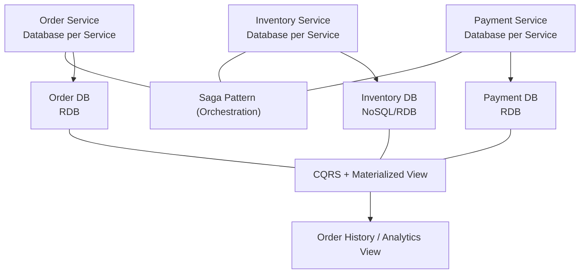
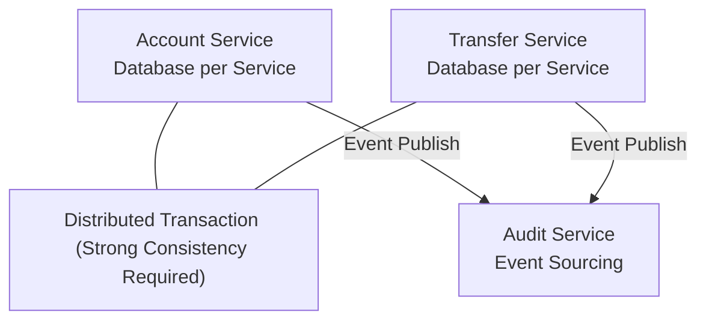
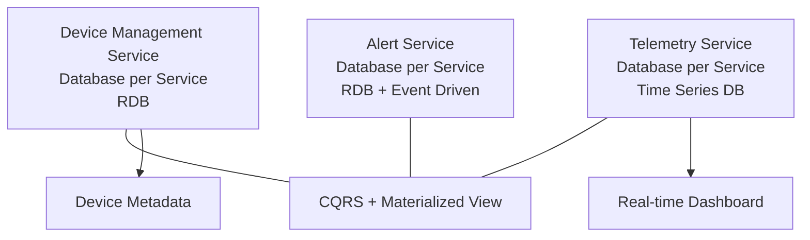
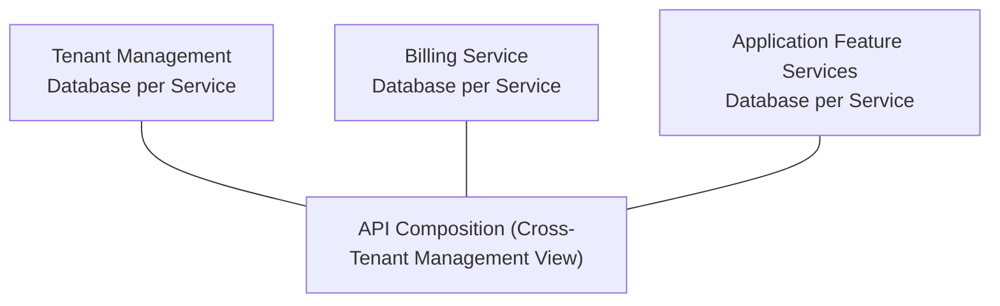
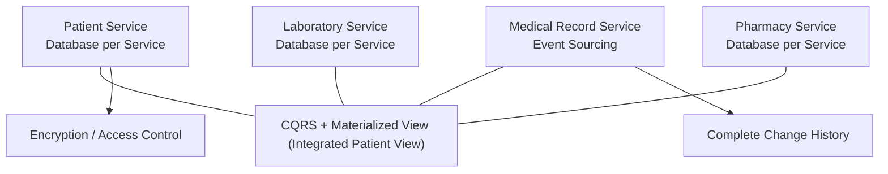
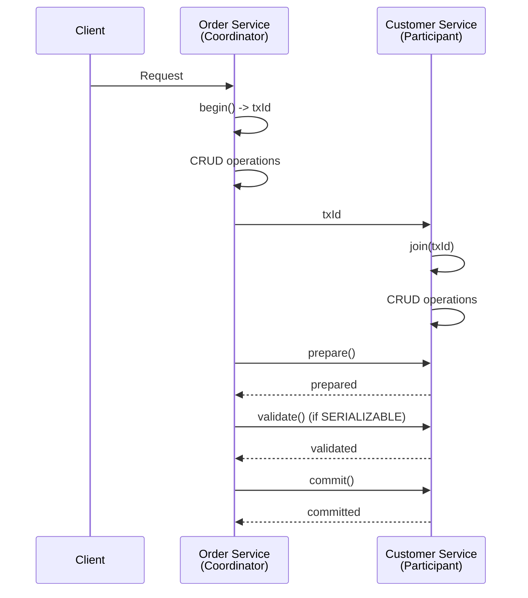
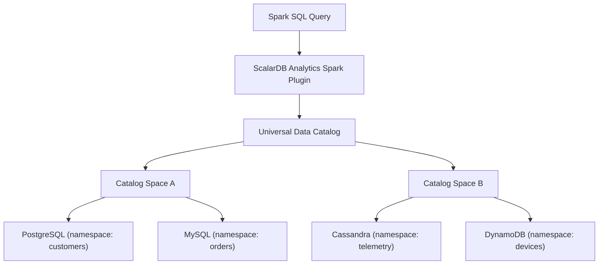
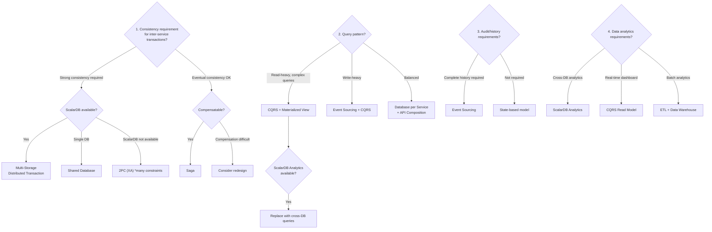

# Logical Data Model Pattern Research

A comprehensive research of data model (logical model) patterns in microservice architecture.

---

## 1. Data Model Pattern Inventory

### 1.1 Database per Service Pattern

**Overview**: A pattern where each microservice owns its dedicated database, inaccessible directly from other services. Data ownership is clear, and service independence is maintained.

**Logical Model Characteristics**:
- Each service defines its own schema
- Data references between services are API-only
- Foreign key constraints do not cross service boundaries

**Advantages**:
- Each service can choose the optimal database technology (polyglot persistence)
- Schema changes do not affect other services
- Independent scaling is possible
- Easy fault isolation

**Disadvantages**:
- Cross-service join queries are difficult
- Distributed transaction management is complex
- Data duplication tends to occur
- Maintaining referential integrity is difficult

**Applicability**: When data independence between services is high and service boundaries can be clearly defined. Ideally aligned with Bounded Contexts from Domain-Driven Design (DDD).

---

### 1.2 Shared Database Pattern

**Overview**: A pattern where multiple microservices share the same database. Each service accesses different sets of tables within the shared database.

**Logical Model Characteristics**:
- Unified schema (or common tables referenced by multiple services exist)
- Foreign key constraints can be used across services
- Concurrent access to shared tables occurs

**Advantages**:
- ACID transactions are readily available
- Data joining via JOIN is straightforward
- Easy to maintain data consistency
- Easy migration from existing monoliths

**Disadvantages**:
- Leads to tight coupling between services
- Schema changes have a large blast radius
- Independent scaling is difficult
- Database can become a Single Point of Failure (SPOF)
- Development and deployment independence is compromised

**Applicability**: During gradual migration phases from monoliths, when data coupling between services is very strong, or for small team operations.

---

### 1.3 API Composition Pattern

**Overview**: A pattern where an API Composer (aggregation layer) calls APIs of multiple services and integrates the results for queries spanning multiple services.

**Logical Model Characteristics**:
- Each service's logical model is independent
- The Composer layer constructs a virtual integrated view
- Combines and filters responses from each service

**Advantages**:
- Enables integrated queries while maintaining service independence
- Relatively simple implementation
- Flexible against data model changes in each service

**Disadvantages**:
- Performance degrades for large data joins
- Inter-service consistency is not guaranteed in real-time
- N+1 problems are likely to occur
- Composer tends to become complex
- Increased latency due to network calls

**Applicability**: When integrated query frequency is low, when data volumes are relatively small, when real-time consistency is not required.

---

### 1.4 CQRS (Command Query Responsibility Segregation) Pattern

**Overview**: A pattern that separates commands (writes) and queries (reads), with independently optimized data models and services for each.

**Logical Model Characteristics**:
- **Write Model (Command Side)**: Normalized model optimized for domain logic. Focuses on business rule validation and state changes
- **Read Model (Query Side)**: Denormalized model optimized for query performance. Pre-joins data from multiple aggregates
- Read model is asynchronously updated through write events

**Advantages**:
- Reads and writes can be scaled independently
- Each model can be optimized (normalized vs. denormalized)
- Easier to handle complex query requirements
- Significant improvement in read performance

**Disadvantages**:
- Increased architectural complexity
- Eventual consistency between Read and Write models
- Data synchronization delays occur
- Increased development and operational costs

**Applicability**: When the ratio of reads to writes differs significantly (many reads), when complex query requirements exist, when read performance is the top priority.

---

### 1.5 Event Sourcing Pattern

**Overview**: A pattern that records all state change history (events) rather than the current state of entities. Current state is reconstructed by replaying events.

**Logical Model Characteristics**:
- **Event Store**: Append-only log of events. Each event is immutable
- **Event Structure**: `{AggregateId, EventType, EventData, Timestamp, Version}`
- **Snapshots**: Periodically saved for performance improvement
- Combining with CQRS is practically essential for retrieving current state

**Advantages**:
- Complete audit trail
- Can reconstruct state at any point in time (time travel)
- Generate new views by reprocessing events
- Domain events naturally express business processes

**Disadvantages**:
- Querying is difficult (CQRS is practically required)
- Event store bloating
- Event schema evolution is difficult
- High learning cost
- Complex debugging

**Applicability**: When audit requirements are strict (finance, healthcare), when business process history tracking is needed, when expressing complex domain logic through event-driven approaches is desired.

---

### 1.6 Saga Pattern for Data Management

**Overview**: A pattern that manages business transactions spanning multiple services as a chain of local transactions. Rolls back using compensating transactions on failure.

**Two Approaches**:

| Characteristic | Choreography | Orchestration |
|----------------|-------------|---------------|
| Control Method | Event-driven, distributed | Central orchestrator |
| Coupling | Low | Depends on orchestrator |
| Logical Model | Each service manages local state | Orchestrator manages overall state |
| Visibility | Difficult to track overall progress | Overall progress is clear |
| Applicable Scale | Small Sagas | Complex Sagas |

**Logical Model Characteristics**:
- Each service requires tables for Saga participation state (`saga_state`, `outbox` tables, etc.)
- Data retention for compensating transactions is required
- Often combined with Transactional Outbox pattern

**Advantages**:
- Avoids distributed transactions
- Maintains loose coupling between services
- Handles long-running transactions

**Disadvantages**:
- Compensation logic design is complex
- Intermediate state (Pending state) management is required
- Debugging and testing are difficult
- Guarantees only eventual consistency

**Applicability**: When business transactions between services are needed but strong consistency is not required, when business processes are compensatable.

---

### 1.7 Materialized View

**Overview**: A pattern that maintains snapshots of pre-computed and joined data. Manages denormalized views integrating data from multiple services in read-only fashion.

**Logical Model Characteristics**:
- Detects source data changes and updates views (event-driven or polling)
- Denormalized schema optimized for queries
- Often implemented as a CQRS Read model

**Advantages**:
- Significant improvement in query performance
- Avoidance of complex JOINs
- Offloading read load

**Disadvantages**:
- Delays in data freshness
- Increased storage costs
- Update logic maintenance required

**Applicability**: When read performance is important, when data from multiple services is frequently joined and referenced.

---

## 2. Use Case-Specific Pattern Application

### 2.1 E-Commerce Site (Distributed Management of Orders, Inventory, Payments)

**Recommended Pattern Configuration**:



**Logical Model Examples**:

- **Order Service**: `orders(order_id, customer_id, status, total_amount, created_at)`, `order_items(order_id, item_id, quantity, price)`
- **Inventory Service**: `inventory(item_id, warehouse_id, quantity, reserved_quantity)`
- **Payment Service**: `payments(payment_id, order_id, amount, status, method)`

**Pattern Selection Rationale**:
- The entire order flow is managed with Saga (create order -> reserve inventory -> process payment -> confirm; compensate on failure)
- Inventory "reservation" and "confirmation" are managed in two stages for Saga intermediate states
- Order history and dashboards are provided via CQRS Read model
- Inventory queries are high frequency, so cached via materialized view

---

### 2.2 Financial System (Inter-Account Transfers, Balance Management)

**Recommended Pattern Configuration**:



**Logical Model Examples**:

- **Account Service**: `accounts(account_id, customer_id, balance, currency, status)`
- **Transfer Service**: `transfers(transfer_id, from_account, to_account, amount, status, timestamp)`
- **Audit Service (Event Store)**: `account_events(event_id, aggregate_id, event_type, event_data, version, timestamp)`

**Pattern Selection Rationale**:
- Inter-account transfers require strong consistency -> distributed transactions (ScalarDB is effective)
- In many cases, Saga's eventual consistency cannot tolerate temporary balance inconsistencies
- Event Sourcing retains complete history for audit requirements
- Complete audit trail for regulatory compliance

---

### 2.3 IoT Data Management (High-Volume Data, Time Series)

**Recommended Pattern Configuration**:



**Logical Model Examples**:

- **Device Management**: `devices(device_id, name, type, location, status, metadata)`
- **Telemetry**: `measurements(device_id, timestamp, metric_name, value)` (time-series partitioned)
- **Alerts**: `alert_rules(rule_id, device_type, condition, threshold)`, `alerts(alert_id, device_id, rule_id, triggered_at, status)`

**Pattern Selection Rationale**:
- Telemetry data is write-intensive -> time-series DB is optimal
- Dashboard display uses CQRS Read model or materialized view for pre-aggregation
- Device metadata has high reference frequency, making RDB appropriate
- Eventual consistency between services is sufficient

---

### 2.4 SaaS Multi-Tenant

**Recommended Pattern Configuration**:

Tenant isolation strategies:
- A) Independent DB per tenant (Database per Tenant)
- B) Shared DB, schema isolation per tenant
- C) Shared DB, shared tables (isolated by tenant_id column)



**Logical Model Examples** (Strategy C):

- Include `tenant_id` in all tables: `resources(tenant_id, resource_id, name, ...)`
- Tenant isolation via Row Level Security or application layer
- Tenant management: `tenants(tenant_id, plan, config, limits)`

**Pattern Selection Rationale**:
- Select isolation strategy based on tenant scale (large tenants get independent DB, small tenants share)
- Billing and tenant management are centrally managed as independent services
- Cross-tenant management dashboard uses API Composition or materialized view
- Compliance requirements (data residency, etc.) may necessitate per-tenant DB isolation

---

### 2.5 Healthcare (Integrated Patient Data Reference)

**Recommended Pattern Configuration**:



**Logical Model Examples**:

- **Patient Service**: `patients(patient_id, name_encrypted, dob_encrypted, insurance_id)`
- **Medical Records (Event Store)**: `medical_events(event_id, patient_id, event_type, data_encrypted, provider_id, timestamp, version)`
- **Integrated View (Read Model)**: `patient_summary(patient_id, demographics, recent_visits, active_medications, lab_results)` -- denormalized integrated view

**Pattern Selection Rationale**:
- Medical records use Event Sourcing to retain complete change history (regulatory requirement)
- Integrated patient data reference is provided via CQRS Read model (spanning multiple services)
- Data encryption and access control are needed at the service level
- Audit log retention is legally mandated

---

## 3. Data Model Determination by Functional Requirements

### 3.1 Data Consistency Requirements

| Consistency Level | Characteristics | Applicable Patterns | Use Case Examples |
|-------------------|----------------|---------------------|-------------------|
| **Strong Consistency** | All services always reference the same latest data | Distributed transactions, Shared Database | Bank transfers, immediate inventory confirmation, seat reservations |
| **Eventual Consistency** | All service data converges after a certain time | Saga, CQRS, Event Sourcing | Order status updates, notifications, reports |
| **Causal Consistency** | Guarantees order of causally related operations | Event-driven + causal ordering guarantee | Chat messages, workflows |

**Decision Criteria**:
- Business loss risk: Does temporary inconsistency lead to financial loss?
- User experience impact: Is the inconsistency visible to users?
- Regulatory requirements: Do regulations demand immediate consistency?

### 3.2 Data Ownership

**Principle**: Each data entity should have a single owning service (Single Source of Truth).

```
Data Ownership Mapping Example (E-Commerce Site):

  Order Service        -> orders, order_items (Owner)
  Inventory Service    -> inventory, warehouses (Owner)
  Payment Service      -> payments, refunds (Owner)
  Customer Service     -> customers, addresses (Owner)

  Each service accesses other services' data by:
    - API reference (synchronous)
    - Local copy via events (asynchronous)
    - Holding only reference IDs (customer_id, etc.)
```

**Data Ownership Decision Guidelines**:
1. Which business process creates/updates the data?
2. Which team is responsible for the data's integrity?
3. Where should the DDD Aggregate Root be placed?

### 3.3 Data Sharing Patterns

| Pattern | Description | Coupling | Data Freshness |
|---------|-------------|----------|----------------|
| **API Call (Synchronous)** | Request to the owner service when needed | Medium | Real-time |
| **Event-Driven Local Copy** | Subscribe to events and hold a copy in local DB | Low | Eventual consistency |
| **Shared Library** | Share common data structures as a library | High | - |
| **Hold Reference ID Only** | Store only the entity ID of other services | Lowest | Latest at reference time |
| **Data Mesh** | Publish as a data product per domain | Low | Policy-dependent |

### 3.4 Maintaining Referential Integrity

In microservices, DB-level foreign key constraints cannot cross service boundaries, so the following alternatives are used:

1. **Application-Level Integrity Checks**: Confirm existence in related services via API during data operations
2. **Event-Driven Integrity Repair**: Detect inconsistencies and correct via events (Reconciliation)
3. **Soft Delete**: Use logical deletion instead of physical deletion to prevent dangling references
4. **Periodic Integrity Check Batches**: Asynchronously verify data consistency between services
5. **Saga Compensation**: Recover integrity through compensating transactions when referenced targets are invalid

---

## 4. Data Model Determination by Non-Functional Requirements

### 4.1 Latency Requirements

| Latency Requirement | Recommended Approach | Impact on Data Model |
|---------------------|---------------------|---------------------|
| **Ultra-Low Latency (< 10ms)** | Local cache, materialized view | Denormalized, pre-computed data |
| **Low Latency (< 100ms)** | Database per Service + index optimization | Moderate denormalization |
| **Moderate (< 1s)** | API Composition | Normalized model + API joining |
| **Lenient (> 1s)** | CQRS, Event Sourcing | Normalized model + async-updated views |

**Impact**: The stricter the latency requirement, the more denormalization, data replication, and pre-computation are needed, pushing the logical model toward tolerating data duplication.

### 4.2 Throughput Requirements

| Throughput | Recommended Approach | Impact on Data Model |
|------------|---------------------|---------------------|
| **High Write** | Partitioning, Event Sourcing (Append-only) | Partition key design is critical, avoid write contention |
| **High Read** | CQRS Read model, read replicas, cache | Multiple denormalized views |
| **Mixed (HTAP)** | HTAP-capable DB, CQRS | Separation of write and read models |

### 4.3 Data Volume

| Data Volume | Recommended Approach | Impact on Data Model |
|-------------|---------------------|---------------------|
| **Small to Medium (GB scale)** | RDB, Database per Service | Normalized model is fine |
| **Large (TB scale)** | NoSQL, partitioning strategy | Careful partition key design, access-pattern-driven model |
| **Very Large (PB scale)** | Data lake + analytics engine | Separation of operational and analytical DBs, event stream centric |

### 4.4 Availability Requirements

| Availability | Recommended Approach | Impact on Data Model |
|-------------|---------------------|---------------------|
| **99.9%** | Multi-AZ, standard replication | Standard normalized model |
| **99.99%** | Multi-region, circuit breaker | Maintain local copies, asynchronous replication |
| **99.999%** | Active-active, tolerance for eventual consistency | Consider Conflict-free data types (CRDTs) |

**Impact**: Higher availability leads to more data replication and a model that tolerates eventual consistency.

### 4.5 Security and Compliance Requirements

| Requirement | Impact on Data Model |
|-------------|---------------------|
| **Data Encryption (at rest)** | Encrypted column definitions, key management tables |
| **Data Encryption (in transit)** | Minimal impact on logical model (infrastructure layer) |
| **GDPR (Right to be Forgotten)** | Separation of user identification data, anonymization-capable design |
| **HIPAA** | Separation of PHI (Protected Health Information), access audit logs |
| **PCI DSS** | Separation/tokenization of card information |
| **Data Residency** | Per-tenant/region DB isolation, multi-region design |

---

## 5. Relationship with ScalarDB

### 5.1 Impact of ScalarDB's Multi-Storage Feature on Logical Models

ScalarDB's "Namespace-to-Storage" mapping allows tables on different databases to be handled within a single transaction scope.

**Impact on Logical Model**:

```
With standard Database per Service:
  [Order Service] -> MySQL (orders)
  [Inventory Service] -> Cassandra (inventory)
  -> Inter-service transactions not possible, Saga etc. required

With ScalarDB Multi-Storage:
  [Unified Transaction Layer]
    namespace: order -> MySQL
    namespace: inventory -> Cassandra
  -> ACID transactions possible even across tables on different DBs
```

**Specific Impacts**:
1. **Leveraging Polyglot Persistence**: Strong consistency is maintained while selecting the optimal DB for each service's data characteristics. The normalized model maintains strong consistency
2. **Avoiding the Saga Pattern**: Complex Saga/compensation logic is unnecessary when strong consistency is required

> **Note**: When replacing Saga with ScalarDB 2PC, all participating services must be simultaneously operational, resulting in an availability trade-off. Where Saga's eventual consistency model is acceptable, the Saga pattern should still be considered.
3. **Simplification of Logical Model**: Intermediate state tables for compensating transactions (`saga_state`, `outbox` tables, etc.) may become unnecessary
4. **Flexible Data Ownership**: Since transactions can span service boundaries, data ownership design gains flexibility

**ScalarDB Data Model**: ScalarDB adopts an extended key-value model inspired by Bigtable. Tables belong to a Namespace and have a Primary Key composed of Partition Key and Clustering Key. Transaction metadata (TxID, Version, State, etc.) is automatically attached to each record.

**Notes**:
- Data can only be accessed via ScalarDB
- Storage overhead from metadata columns

#### Principle of Minimizing ScalarDB-Managed Scope

- Place only tables participating in inter-service transactions under ScalarDB management
- Tables self-contained within a service can be accessed via native DB APIs
- Read-only analytical data should be replicated outside ScalarDB management (via ScalarDB Analytics)
- To reduce future migration costs, adding a Repository layer on top of ScalarDB APIs is recommended

### 5.2 Data Models Enabled by ScalarDB Distributed Transactions

ScalarDB's **Consensus Commit protocol** and **Two-Phase Commit Interface** enable distributed transactions between microservices.

**Consensus Commit Protocol Mechanism**:
1. **Read Phase**: Copy read/write set to local workspace
2. **Validation Phase**: Conflict detection via Optimistic Concurrency Control (OCC)
3. **Write Phase**: Propagate changes to DB
4. **Prepare/Commit Phase**: Centrally manage transaction state in Coordinator table

**Microservice Transactions via Two-Phase Commit Interface**:



**Data Models Made Possible**:

1. **Cross-Service ACID Model**: Directly achieves inter-service transactions with ACID that were previously only possible with Saga, etc. Completely eliminates temporary balance inconsistencies in financial system inter-account transfers

2. **Simplified Join Model**: Since data across multiple services can be consistently read within a transaction, the consistency problems of API Composition are resolved

3. **Hybrid Pattern**: Combines ScalarDB distributed transactions where strong consistency is needed, with traditional event-driven approaches where eventual consistency suffices

**Supported Isolation Levels**:
- **SNAPSHOT (default)**: Snapshot Isolation. Balance between performance and consistency
- **SERIALIZABLE**: Anti-dependency verification via extra-reads. Strongest consistency guarantee. Effective for finance
- **READ_COMMITTED**: Read Committed isolation level. For scenarios requiring lightweight isolation

### 5.3 Impact of ScalarDB Analytics on Data Reference Patterns

ScalarDB Analytics consists of a **Universal Data Catalog** and **Query Engine** (currently an Apache Spark plugin), enabling analytical queries across multiple heterogeneous databases as a single logical database.

**Architecture**:



**Impact on Data Reference Patterns**:

1. **Simplification of CQRS**: Traditionally, a separate Read model needed to be built for CQRS, but ScalarDB Analytics enables direct analytical queries against source databases. Explicit Read model construction and synchronization may become unnecessary in some cases

2. **Materialized View Alternative**: Since JOINs across multiple service DBs are directly possible, the need to pre-build materialized views decreases

3. **API Composition Alternative**: For large data joins, avoids performance issues of API Composition. Leverages Spark SQL's distributed processing capabilities

4. **HTAP (Hybrid Transactional/Analytical Processing) Achievement**: Combining ScalarDB's transaction processing + ScalarDB Analytics' analytical processing integrates operational and analytical systems

5. **Unified Type Mapping**: 15 unified data types (BYTE, INT, BIGINT, FLOAT, DOUBLE, DECIMAL, TEXT, BLOB, BOOLEAN, DATE, TIME, TIMESTAMP, etc.) absorb data type mismatches across different DBs

> **Note: Differences Between ScalarDB Core and Analytics Data Types**
> - **ScalarDB Core (for transactions, as of v3.17)**: Supports 11 types: BOOLEAN, INT, BIGINT, FLOAT, DOUBLE, TEXT, BLOB, DATE, TIME, TIMESTAMP, TIMESTAMPTZ. Data types used in transaction processing correspond to these.
> - **ScalarDB Analytics (for analytics)**: Supports 15 types including DECIMAL in addition to the above. These are provided through the Apache Spark type system.

**Specific Effect Examples**:

| Traditional Approach | With ScalarDB Analytics |
|---------------------|------------------------|
| Aggregate in data warehouse via ETL | Query source DBs directly (no ETL needed) |
| Build dedicated Read model with CQRS | Cross-database queries via catalog |
| Sequential retrieval via API Composition | JOIN with Spark SQL |
| Manually update materialized views | Reference sources in real-time |

**Notes**:
- Designed for analytical queries, so it does not impact transaction processing performance
- Currently Spark is the execution engine, so real-time capability leans toward batch processing
- Not suitable for high-volume OLTP workloads (designed for OLAP use cases)

---

## 5.4 Impact of ScalarDB 3.17 New Features on Logical Models

### Virtual Tables

Virtual Tables introduced in ScalarDB 3.17 support logical joining of two tables via primary key. This enables treating tables that are physically separated via Database per Service as a logically integrated view.

**Impact on Logical Model**:
- Improved convenience in index table patterns (integrated reference of base tables and index tables)
- Simplified unified access to shared master data across services
- Can replace some materialized view use cases

### RBAC (Role-Based Access Control)

Permission management at the namespace and table level is now possible, enabling tenant isolation in multi-tenant SaaS logical model design (see Section 2.4) not only at the application layer but also at the data access layer.

### Enhanced Aggregate Functions

Support for `SUM`, `MIN`, `MAX`, `AVG`, and `HAVING` clauses has increased the cases where the Read side implementation of the CQRS pattern can be handled by ScalarDB SQL alone.

---

## 6. Decision Tree for Pattern Selection



ScalarDB provides an integrated solution to the biggest challenges in traditional microservice data models -- **distributed transactions between services** and **cross-database queries** -- eliminating the need for complex pattern implementations at the application layer. In particular, the ability to eliminate complex compensation logic from the Saga pattern and simplify dedicated Read model construction for CQRS represents the greatest impact on logical model design.

---

## Sources

- [ScalarDB Multi-Storage Transactions](https://scalardb.scalar-labs.com/docs/latest/multi-storage-transactions/)
- [ScalarDB Consensus Commit Protocol](https://scalardb.scalar-labs.com/docs/latest/consensus-commit/)
- [ScalarDB Two-Phase Commit Transactions](https://scalardb.scalar-labs.com/docs/latest/two-phase-commit-transactions/)
- [ScalarDB Analytics Design](https://scalardb.scalar-labs.com/docs/latest/scalardb-analytics/design/)
- [ScalarDB Data Model](https://scalardb.scalar-labs.com/docs/latest/data-modeling/)
- [ScalarDB Design Document](https://scalardb.scalar-labs.com/docs/3.5/design/)
- [ScalarDB: Universal Transaction Manager for Polystores (VLDB'23)](https://www.vldb.org/pvldb/vol16/p3768-yamada.pdf)
- [ScalarDB Microservice Transaction Sample](https://scalardb.scalar-labs.com/docs/3.13/scalardb-samples/microservice-transaction-sample/)
- [Microservices.io - Database per Service](https://microservices.io/patterns/data/database-per-service)
- [Microservices.io - CQRS](https://microservices.io/patterns/data/cqrs.html)
- [Microservices.io - Event Sourcing](https://microservices.io/patterns/data/event-sourcing.html)
- [Microservices.io - Saga](https://microservices.io/patterns/data/saga.html)
