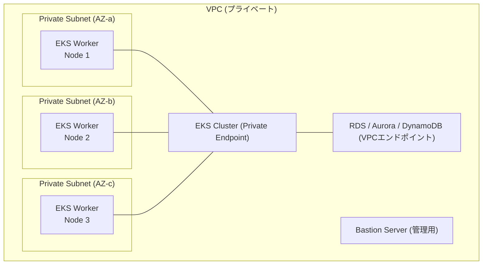

# インフラ前提条件調査

## 1. 共通前提条件

### 1.1 Kubernetes クラスタ要件

| 項目 | 要件 |
|------|------|
| **Kubernetes バージョン** | 1.31 - 1.34 |
| **Red Hat OpenShift** | 4.18 - 4.20 |
| **Amazon EKS** | Kubernetes 1.31 - 1.34 |
| **Azure AKS** | Kubernetes 1.31 - 1.34 |
| **Helm** | 3.5 以上 |

公式ドキュメント（[Requirements](https://scalardb.scalar-labs.com/docs/latest/requirements/)）より、ScalarDB Cluster は **現時点で Kubernetes 上でのみ動作がサポートされている**。スタンドアロンモードは開発・テスト用途に限定される。

### 1.2 Helm チャートによるデプロイ

デプロイは Scalar Helm Charts を使用して行う。

```bash
# Helmリポジトリ追加
helm repo add scalar-labs https://scalar-labs.github.io/helm-charts
helm repo update

# インストール
helm install <RELEASE_NAME> scalar-labs/scalardb-cluster \
  -n <NAMESPACE> \
  -f /<PATH_TO_CUSTOM_VALUES_FILE> \
  --version <CHART_VERSION>
```

主要な Helm チャート設定パラメータは以下の通り。

| パラメータ | 説明 | デフォルト/推奨値 |
|------------|------|-------------------|
| `scalardbCluster.replicaCount` | ポッド数 | 3以上（本番） |
| `scalardbCluster.resources.requests.cpu` | CPU要求量 | `2000m` |
| `scalardbCluster.resources.requests.memory` | メモリ要求量 | `4Gi` |
| `scalardbCluster.resources.limits.cpu` | CPU上限 | `2000m` |
| `scalardbCluster.resources.limits.memory` | メモリ上限 | `4Gi` |
| `scalardbCluster.logLevel` | ログレベル | - |
| `scalardbCluster.grafanaDashboard.enabled` | Grafanaダッシュボード | `true`（本番推奨） |
| `scalardbCluster.serviceMonitor.enabled` | ServiceMonitor | `true`（本番推奨） |
| `scalardbCluster.prometheusRule.enabled` | PrometheusRule | `true`（本番推奨） |
| `scalardbCluster.tls.enabled` | TLS有効化 | `true`（本番推奨） |
| `scalardbCluster.graphql.enabled` | GraphQL有効化 | 任意 |
| `envoy.enabled` | Envoyプロキシ有効化 | `true`（indirectモード時必須） |

参照元: [Configure a custom values file for ScalarDB Cluster](https://scalardb.scalar-labs.com/docs/latest/helm-charts/configure-custom-values-scalardb-cluster/)

### 1.3 Java ランタイム要件

| コンポーネント | サポートバージョン | 対応ディストリビューション |
|---------------|-------------------|---------------------------|
| **ScalarDB Core** | Java 8, 11, 17, 21 (LTS) | Oracle JDK, Eclipse Temurin, Amazon Corretto, Microsoft Build of OpenJDK |
| **ScalarDB Cluster Embedding クライアント** | **Java 17 または 21 のみ** | 同上 |
| **ScalarDB Cluster Java Client SDK** | Java 8, 11, 17, 21 (LTS) | 同上 |
| **.NET SDK** | .NET 8.0, 6.0 | - |

**注意**: ScalarDB Cluster の Embedding クライアント（direct-kubernetes モード）を使用する場合は、Java 17 以上が必須である。

### 1.4 ネットワーク要件

**使用ポート一覧**:

| ポート | プロトコル | 用途 |
|--------|-----------|------|
| **60053** | TCP | gRPC/SQL API リクエスト |
| **8080** | TCP | GraphQL リクエスト |
| **9080** | TCP | Prometheus メトリクスエンドポイント（パス: `/metrics`） |
| **60053** | TCP | Envoy ロードバランシング（indirect モード） |
| **9001** | TCP | Envoy メトリクス |

**ネットワーク構成の原則**:
- ScalarDB Cluster はインターネット経由でサービスを直接提供しない。**プライベートネットワーク上に構築することが必須**
- アプリケーションからはプライベートネットワーク経由でアクセスする
- TLS は ScalarDB Cluster 3.12 以降でサポート。RSA または ECDSA アルゴリズムの証明書を使用可能
- cert-manager による自動証明書管理にも対応

### 1.5 ストレージ要件

ScalarDB がサポートするバックエンドデータベース（ストレージ）の完全なリスト:

**リレーショナルデータベース（JDBC）**:

| データベース | サポートバージョン |
|-------------|-------------------|
| Oracle Database | 23ai, 21c, 19c |
| IBM Db2 | 12.1, 11.5 |
| MySQL | 8.4, 8.0 |
| PostgreSQL | 17, 16, 15, 14, 13 |
| Amazon Aurora MySQL | バージョン 2, 3 |
| Amazon Aurora PostgreSQL | バージョン対応 |
| MariaDB | 11.4, 10.11 |
| TiDB | 8.5, 7.5, 6.5 |
| AlloyDB | 16, 15 |
| SQL Server | 2022, 2019, 2017 |
| SQLite | 3 |
| YugabyteDB | 2 |

**NoSQL データベース**:

| データベース | 備考 |
|-------------|------|
| Amazon DynamoDB | AWS リージョン指定で接続 |
| Apache Cassandra | 5.0, 4.1, 3.11, 3.0 |
| Azure Cosmos DB for NoSQL | Strong 一貫性レベル推奨 |

**オブジェクトストレージ（Private Preview）**:

| ストレージ | 備考 |
|-----------|------|
| Amazon S3 | プライベートプレビュー |
| Azure Blob Storage | プライベートプレビュー |
| Google Cloud Storage | プライベートプレビュー |

### 1.6 ライセンス要件

ScalarDB Cluster の利用には**ライセンスキー（トライアルまたは商用）が必須**。AWS Marketplace または Azure Marketplace 経由でも取得可能。

---

## 2. AWS 環境

### 2.1 EKS（Elastic Kubernetes Service）要件

参照元: [Guidelines for creating an EKS cluster for ScalarDB Cluster](https://scalardb.scalar-labs.com/docs/latest/scalar-kubernetes/CreateEKSClusterForScalarDBCluster/)

| 項目 | 推奨値 |
|------|--------|
| **Kubernetes バージョン** | 1.31 - 1.34（サポート範囲内） |
| **ワーカーノード数** | 最低 3 ノード |
| **ワーカーノード仕様** | 最低 4vCPU / 8GB メモリ |
| **ポッド数** | 最低 3 ポッド（ワーカーノード全体に分散） |
| **AZ 配置** | 異なるアベイラビリティゾーンに分散配置 |
| **サブネット** | /24 プレフィックス推奨（十分な IP 数確保） |

**推奨インスタンスタイプ**: 4vCPU / 8GB メモリ以上。各ノードには ScalarDB Cluster ポッド（2vCPU / 4GB）に加え、Envoy プロキシ、モニタリングコンポーネント、アプリケーションポッドが共存するため、余裕を持ったサイズが必要。具体的には以下が適切:

| インスタンスファミリー | 推奨タイプ | vCPU | メモリ |
|-----------------------|-----------|------|--------|
| 汎用 | m5.xlarge | 4 | 16 GB |
| 汎用 | m6i.xlarge | 4 | 16 GB |
| コンピュート最適化 | c5.xlarge | 4 | 8 GB |

### 2.2 使用可能なデータベース

**Amazon DynamoDB**:
- 手動セットアップ不要（デフォルトで利用可能）
- 認証: `ACCESS_KEY_ID`, `SECRET_ACCESS_KEY`, `REGION` を設定
- PITR（Point-in-Time Recovery）の有効化を強く推奨
- VPC エンドポイント設定でプライベート接続を推奨

**Amazon RDS（MySQL, PostgreSQL, Oracle, SQL Server）**:
- RDS インスタンスの作成が必要
- JDBC URL, ユーザー名, パスワードで接続
- 自動バックアップの有効化を推奨
- パブリックアクセス無効化を推奨

**Amazon Aurora（MySQL/PostgreSQL）**:
- Aurora DB クラスタの作成が必要
- デフォルトで自動バックアップが有効
- JDBC URL, ユーザー名, パスワードで接続

### 2.3 ネットワーク構成



- **VPC**: プライベートネットワーク内に EKS クラスタを構築
- **サブネット**: 複数 AZ にまたがるプライベートサブネット（/24 推奨）
- **セキュリティグループ**: 60053/TCP, 8080/TCP, 9080/TCP を EKS 内部で許可。DB ポート（例: 5432, 3306）も許可
- **VPC エンドポイント**: DynamoDB 使用時はゲートウェイエンドポイントを推奨

### 2.4 IAM 設定

- DynamoDB アクセス用の IAM ポリシー: `PutItem`, `Query`, `UpdateItem`, `DeleteItem`, `Scan`, `DescribeTable`, `CreateTable`, `DeleteTable` 等の権限が必要
- EKS クラスタ管理用の IAM ロール
- AWS Marketplace 経由でコンテナイメージを取得する場合は Marketplace サブスクリプション権限

### 2.5 デプロイ手順の概要

参照元: [Deploy ScalarDB Cluster on Amazon EKS](https://scalardb.scalar-labs.com/docs/latest/scalar-kubernetes/ManualDeploymentGuideScalarDBClusterOnEKS/)

1. AWS Marketplace でサブスクライブ
2. EKS クラスタ作成
3. バックエンドデータベースセットアップ
4. Bastion サーバー作成（同一 VPC 内）
5. Helm Chart カスタム値ファイル設定
6. Helm 経由でデプロイ
7. ステータス検証
8. モニタリング有効化
9. アプリケーションデプロイ

---

## 3. Azure 環境

### 3.1 AKS（Azure Kubernetes Service）要件

参照元: [Guidelines for creating an AKS cluster for ScalarDB](https://scalardb.scalar-labs.com/docs/latest/scalar-kubernetes/CreateAKSClusterForScalarDB/)

| 項目 | 推奨値 |
|------|--------|
| **Kubernetes バージョン** | 1.31 - 1.34（サポート範囲内） |
| **ワーカーノード数** | 最低 3 ノード |
| **VM サイズ** | 最低 4vCPU / 8GB メモリ |
| **ポッド数** | 最低 3 ポッド |
| **ネットワークプラグイン** | Azure CNI 推奨（kubenet ではなく） |
| **ノードプール** | ScalarDB Cluster 用に専用 user mode ノードプール作成を推奨 |

**推奨 VM サイズ**:

| VM サイズ | vCPU | メモリ | 備考 |
|-----------|------|--------|------|
| Standard_D4s_v5 | 4 | 16 GB | 汎用推奨 |
| Standard_D4as_v5 | 4 | 16 GB | AMD ベース |
| Standard_F4s_v2 | 4 | 8 GB | コンピュート最適化 |

### 3.2 使用可能なデータベース

参照元: [Set up a database for ScalarDB deployment on Azure](https://scalardb.scalar-labs.com/docs/latest/scalar-kubernetes/SetupDatabaseForAzure/)

**Azure Cosmos DB for NoSQL**:
- `COSMOS_DB_URI` と `COSMOS_DB_KEY` で認証
- **キャパシティモード**: プロビジョニングスループット（必須）
- **一貫性レベル**: `Strong`（必須）
- **バックアップモード**: 継続的バックアップモード（PITR対応、本番推奨）
- VNet サービスエンドポイント設定推奨

**Azure Database for MySQL（Flexible Server）**:
- JDBC URL, ユーザー名, パスワードで接続
- プライベートアクセス（VNet 統合）推奨
- AKS クラスタと同一 VNet または VNet ピアリング接続

**Azure Database for PostgreSQL（Flexible Server）**:
- JDBC URL, ユーザー名, パスワードで接続
- プライベートアクセス（VNet 統合）推奨

### 3.3 ネットワーク構成

- **VNet**: プライベートネットワーク上に AKS クラスタを作成
- **NSG**: 60053/TCP, 8080/TCP, 9080/TCP を内部で許可
- **Azure CNI**: VNet 統合のために推奨
- **サービスエンドポイント**: Cosmos DB 等への安全な接続

### 3.4 Azure AD 設定

公式ドキュメントには Azure AD に関する具体的な記載は少ないが、AKS の RBAC と連携した認証・認可の設定が一般的に必要。Azure Marketplace 経由のイメージ取得にはサブスクリプション権限が必要。

---

## 4. GCP 環境

### 4.1 GKE（Google Kubernetes Engine）要件

**重要**: ScalarDB Cluster の GKE（GCP）サポートは、[ScalarDB ロードマップ](https://scalardb.scalar-labs.com/docs/latest/roadmap/)によると **2025年 Q4 に予定**されていた。2026年2月時点では、公式にサポートされたデプロイガイドが利用可能になっている可能性がある。

ロードマップからの引用:
> "Users will be able to deploy ScalarDB Cluster in Google Kubernetes Engine (GKE) in GCP." (CY2025 Q4)

ただし、ScalarDB Analytics では GCP 環境（GKE + Cloud SQL）のデプロイガイドが既に存在しており（[Deploy ScalarDB Analytics in Public Cloud Environments](https://scalardb.scalar-labs.com/docs/latest/scalardb-analytics/deployment/)）、以下の構成が参考になる。

### 4.2 使用可能なデータベース（ScalarDB Core レベル）

| データベース | ストレージタイプ | 備考 |
|-------------|-----------------|------|
| Cloud SQL for PostgreSQL | JDBC | GKE + Cloud SQL Auth Proxy 経由 |
| Cloud SQL for MySQL | JDBC | 同上 |
| AlloyDB | JDBC | PostgreSQL 互換、バージョン 16, 15 |
| Cloud Spanner | - | **未サポート** - ScalarDB Coreの公式サポートリストに含まれない |
| Cloud Bigtable | - | **未サポート** - ScalarDB Coreの公式サポートリストに含まれない |
| Google Cloud Storage | オブジェクトストレージ | Private Preview |

**注意**: Cloud Spanner と Cloud Bigtable は、ScalarDB 3.17 の公式サポート対象データベースリストには含まれていない。GCP 環境では Cloud SQL (PostgreSQL/MySQL) または AlloyDB の使用が現実的である。

### 4.3 ネットワーク構成（ScalarDB Analytics の GCP デプロイガイドより）

- VPC 内にプライベートサブネットを作成
- ファイアウォールルール: `TCP 0-65535, UDP 0-65535, ICMP`（サブネット内のみ）
- SSH 接続: TCP 22
- Cloud SQL インスタンス: `--no-assign-ip` フラグでプライベート IP 接続専用
- プライベートサービスアクセス経由で DB 接続

### 4.4 IAM 設定

- Cloud SQL 接続用のサービスアカウント
- GKE ノードプール用の IAM ロール
- Cloud SQL Auth Proxy Operator による認証サイドカー自動注入

---

## 5. オンプレミス環境

### 5.1 Kubernetes 構築要件

ScalarDB Cluster は Kubernetes 上でのみ動作するため、オンプレミスでも Kubernetes クラスタの構築が必須。

| 方法 | 備考 |
|------|------|
| **kubeadm** | 標準的な構築ツール |
| **Rancher (RKE/RKE2)** | エンタープライズ向け |
| **Red Hat OpenShift** | 4.18 - 4.20 が公式サポート |

### 5.2 ベアメタル/VM 要件

| 項目 | 最低要件 |
|------|---------|
| **ワーカーノード数** | 3 ノード以上 |
| **各ノード CPU** | 4 vCPU 以上 |
| **各ノード メモリ** | 8 GB 以上 |
| **OS** | Linux（Kubernetes が動作するディストリビューション） |
| **コンテナランタイム** | containerd, CRI-O 等 |

各ノードでは ScalarDB Cluster ポッド（2vCPU / 4GB）に加え、Envoy、モニタリングエージェント、アプリケーションが動作するため、余裕を持ったリソース割り当てが必要。

### 5.3 ネットワーク要件

| 要件 | 詳細 |
|------|------|
| **プライベートネットワーク** | ScalarDB Cluster はインターネットに直接公開しない |
| **ポート開放** | 60053/TCP, 8080/TCP, 9080/TCP（クラスタ内） |
| **DB 接続** | バックエンド DB へのネットワーク到達性を確保 |
| **ロードバランサー** | MetalLB 等の Kubernetes 対応 LB が必要（indirect モード時） |
| **DNS** | クラスタ内 DNS（CoreDNS）が正常動作すること |

### 5.4 ストレージ要件

オンプレミスの場合、以下のデータベースをバックエンドとして使用可能:
- PostgreSQL 13-17
- MySQL 8.0, 8.4
- Oracle Database 19c, 21c, 23ai
- SQL Server 2017, 2019, 2022
- Apache Cassandra 3.0, 3.11, 4.1, 5.0
- MariaDB 10.11, 11.4

### 5.5 バックアップ・DR 構成

**RDB（単一データベース）の場合**:
- `mysqldump --single-transaction`（MySQL）
- `pg_dump`（PostgreSQL）
- クラウドマネージドサービスの場合は自動バックアップ + PITR

**NoSQL / 複数データベースの場合**:
- ScalarDB / ScalarDB Cluster を**一時停止（pause）**してからバックアップを取得する必要がある
- DynamoDB: PITR 有効化必須
- Cosmos DB: 継続的バックアップポリシー設定必須
- Cassandra: レプリケーションを利用

**DR の基本方針**:
- バックエンドデータベースで自動バックアップ機能を有効化
- ポイントインタイムリカバリ（PITR）機能の有効化を推奨
- 複数 AZ / リージョンへの分散配置

---

## 6. ScalarDB Cluster 固有の要件

### 6.1 ノードサイジング

| 環境 | ポッド数 | ワーカーノード数 |
|------|---------|----------------|
| **開発/テスト** | 1（スタンドアロンモード可） | 1 |
| **本番（最低）** | **3** | **3** |
| **本番（推奨）** | 3 以上、複数 AZ に分散 | 3 以上、複数 AZ に分散 |

### 6.2 メモリ・CPU 要件

| コンポーネント | CPU | メモリ | 備考 |
|---------------|-----|--------|------|
| **ScalarDB Cluster ポッド** | 2vCPU (requests/limits) | 4GB (requests/limits) | ライセンス上の制限 |
| **ワーカーノード** | 4vCPU 以上 | 8GB 以上 | Envoy、監視コンポーネント等も含む |

Helm チャートでの設定例:
```yaml
scalardbCluster:
  replicaCount: 3
  resources:
    requests:
      cpu: 2000m
      memory: 4Gi
    limits:
      cpu: 2000m
      memory: 4Gi
```

### 6.3 スケーリング設定

| スケーリング方式 | 説明 |
|-----------------|------|
| **Horizontal Pod Autoscaler (HPA)** | ポッド数の自動スケーリング |
| **Cluster Autoscaler** | HPA 使用時は Cluster Autoscaler も併用推奨 |
| **サブネットの IP 数** | スケーリング後に十分な IP を確保（/24 推奨） |

ScalarDB Cluster は一貫性ハッシュアルゴリズムによるリクエストルーティングを使用しているため、ポッド追加時にトランザクションの再分配が発生する点に注意。

### 6.4 クライアント接続モード

| モード | 説明 | 推奨 |
|--------|------|------|
| **direct-kubernetes** | アプリと同一 K8s クラスタ内で直接接続 | **本番環境推奨（パフォーマンス面）** |
| **indirect** | Envoy 経由で別環境から接続 | 別環境のアプリから接続する場合 |

`direct-kubernetes` モードでは、以下の Kubernetes リソースの作成が必要:
- Role
- RoleBinding
- ServiceAccount（アプリケーションポッドにマウント）

### 6.5 監視（Prometheus + Grafana）

参照元: [Monitoring Scalar products on a Kubernetes cluster](https://scalardb.scalar-labs.com/docs/latest/scalar-kubernetes/K8sMonitorGuide/)

**デプロイ手順**:
```bash
# Prometheus Operator (kube-prometheus-stack) のデプロイ
helm repo add prometheus-community https://prometheus-community.github.io/helm-charts
helm repo update

kubectl create namespace monitoring
helm install scalar-monitoring prometheus-community/kube-prometheus-stack \
  -n monitoring \
  -f scalar-prometheus-custom-values.yaml
```

**ScalarDB Cluster Helm チャートでの有効化**:
```yaml
scalardbCluster:
  prometheusRule:
    enabled: true
  grafanaDashboard:
    enabled: true
  serviceMonitor:
    enabled: true
```

**メトリクスエンドポイント**: ポート 9080 で Prometheus 形式のメトリクスを公開

**Grafana アクセス**:
```bash
# テスト用
kubectl port-forward -n monitoring svc/scalar-monitoring-grafana 3000:3000
# 本番環境では LoadBalancer または Ingress を使用
```

### 6.6 バックアップ/リストア

参照元: [How to Back Up and Restore Databases Used Through ScalarDB](https://scalardb.scalar-labs.com/docs/latest/backup-restore/)

**バックアップの基本要件**:
- すべての ScalarDB 管理テーブル（Coordinator テーブルを含む）のバックアップは「トランザクション一貫性を持つか、自動的に一貫性のある状態に回復可能」である必要がある

**RDB系バックアップ（一時停止なし）**:
- MySQL: `mysqldump --single-transaction`
- PostgreSQL: `pg_dump`
- SQLite: `.backup`
- Amazon RDS / Aurora: 自動バックアップ機能で保持期間内に復元可能

**NoSQL系バックアップ（一時停止あり）**:
- NoSQL DBのバックアップ時には `scalar-admin-for-kubernetes` の `pause`/`unpause` コマンドを使用して、ScalarDB Clusterを一時停止・再開する。
- DynamoDB: PITR 機能を有効化必須
- Cosmos DB: 継続的バックアップポリシー設定必須
- Cassandra: レプリケーション機能で部分的復旧も可能

**リストア時の注意点**:
- DynamoDB: テーブルはエイリアス付きでのみ復元可能であるため、復元後に名前変更が必須
- Cosmos DB: PITR 機能がストアドプロシージャを復元しないため、Schema Loader の `--repair-all` オプションで再インストールが必要

### 6.7 TLS 設定

参照元: [Getting Started with Helm Charts (ScalarDB Cluster with TLS)](https://scalardb.scalar-labs.com/docs/latest/helm-charts/getting-started-scalardb-cluster-tls/)

**要件**:
- ScalarDB Cluster 3.12 以降が必要
- RSA または ECDSA アルゴリズムの証明書を使用可能

**証明書ファイル構成**:
1. **CA 証明書**: `ca-key.pem` と `ca.pem`（自己署名ルート認証局）
2. **Envoy 証明書**: `envoy-key.pem` と `envoy.pem`（ロードバランサー用）
3. **ScalarDB Cluster 証明書**: `scalardb-cluster-key.pem` と `scalardb-cluster.pem`

**設定パラメータ**:
```properties
scalar.db.cluster.tls.enabled=true
scalar.db.cluster.tls.ca_root_cert_path=/tls/scalardb-cluster/certs/ca.crt
scalar.db.cluster.tls.override_authority=cluster.scalardb.example.com
```

**証明書管理オプション**:
- 手動管理: `cfssl` 等で証明書を生成し、Kubernetes Secret として登録
- 自動管理: cert-manager を使用して証明書の自動更新に対応

### 6.8 パフォーマンス関連設定

ScalarDB Core の設定で以下のチューニングが可能:

| 設定項目 | デフォルト値 | 説明 |
|----------|-------------|------|
| `parallel_executor_count` | 128 | 並列実行スレッド数 |
| `async_commit.enabled` | false | 非同期コミット |
| `async_rollback.enabled` | false | 非同期ロールバック |
| `jdbc.connection_pool.max_total` | 200 | JDBC 最大接続数 |
| グループコミット | - | 複数トランザクションのバッチ処理 |

---

## まとめ: 環境別推奨構成一覧

| 項目 | AWS | Azure | GCP | オンプレミス |
|------|-----|-------|-----|------------|
| **K8s サービス** | EKS | AKS | GKE (2025 Q4~) | kubeadm / OpenShift |
| **推奨DB** | Aurora PostgreSQL / DynamoDB | Cosmos DB / Azure DB for PostgreSQL | Cloud SQL for PostgreSQL / AlloyDB | PostgreSQL / Cassandra |
| **ワーカーノード** | m5.xlarge x3 | Standard_D4s_v5 x3 | (TBD) | 4vCPU/8GB x3 |
| **ネットワーク** | VPC + Private Subnet | VNet + Azure CNI | VPC + Private Subnet | Private Network |
| **モニタリング** | Prometheus + Grafana on EKS | Prometheus + Grafana on AKS | Prometheus + Grafana on GKE | Prometheus + Grafana |
| **バックアップ** | RDS自動バックアップ / DynamoDB PITR | Cosmos DB 継続バックアップ | Cloud SQL 自動バックアップ | DB ネイティブバックアップ |
| **Marketplace** | AWS Marketplace | Azure Marketplace | GCP Marketplace (2026 Q3~) | ライセンスキー直接取得 |

---

## 主要参照ドキュメント

- [ScalarDB Requirements](https://scalardb.scalar-labs.com/docs/latest/requirements/)
- [Production checklist for ScalarDB Cluster](https://scalardb.scalar-labs.com/docs/latest/scalar-kubernetes/ProductionChecklistForScalarDBCluster/)
- [Configure a custom values file for ScalarDB Cluster](https://scalardb.scalar-labs.com/docs/latest/helm-charts/configure-custom-values-scalardb-cluster/)
- [How to deploy ScalarDB Cluster](https://scalardb.scalar-labs.com/docs/latest/helm-charts/how-to-deploy-scalardb-cluster/)
- [Deploy ScalarDB Cluster on Amazon EKS](https://scalardb.scalar-labs.com/docs/latest/scalar-kubernetes/ManualDeploymentGuideScalarDBClusterOnEKS/)
- [Guidelines for creating an EKS cluster for ScalarDB Cluster](https://scalardb.scalar-labs.com/docs/latest/scalar-kubernetes/CreateEKSClusterForScalarDBCluster/)
- [Set up a database for ScalarDB deployment on AWS](https://scalardb.scalar-labs.com/docs/latest/scalar-kubernetes/SetupDatabaseForAWS/)
- [Set up a database for ScalarDB deployment on Azure](https://scalardb.scalar-labs.com/docs/latest/scalar-kubernetes/SetupDatabaseForAzure/)
- [ScalarDB Cluster Standalone Mode](https://scalardb.scalar-labs.com/docs/latest/scalardb-cluster/standalone-mode/)
- [Monitoring Scalar products on a Kubernetes cluster](https://scalardb.scalar-labs.com/docs/latest/scalar-kubernetes/K8sMonitorGuide/)
- [How to Back Up and Restore Databases Used Through ScalarDB](https://scalardb.scalar-labs.com/docs/latest/backup-restore/)
- [ScalarDB Roadmap](https://scalardb.scalar-labs.com/docs/latest/roadmap/)
- [ScalarDB Core Configurations](https://scalardb.scalar-labs.com/docs/latest/configurations/)
- [Getting Started with Helm Charts (ScalarDB Cluster with TLS)](https://scalardb.scalar-labs.com/docs/latest/helm-charts/getting-started-scalardb-cluster-tls/)
- [Getting Started with Helm Charts (ScalarDB Cluster with TLS by Using cert-manager)](https://scalardb.scalar-labs.com/docs/latest/helm-charts/getting-started-scalardb-cluster-tls-cert-manager/)
- [Deploy ScalarDB Analytics in Public Cloud Environments](https://scalardb.scalar-labs.com/docs/latest/scalardb-analytics/deployment/)

---

## 7. DevOps・CI/CD統合ガイド

### 7.1 CI/CDパイプライン設計

ScalarDBを含むマイクロサービスのCI/CDパイプラインは以下のステージで構成する。

| ステージ | 内容 | ツール例 |
|---------|------|---------|
| Build | アプリケーションビルド + コンテナイメージ作成 | Maven/Gradle + Docker |
| Unit Test | ScalarDBモック使用のユニットテスト | JUnit + Mockito |
| Integration Test | Testcontainers + ScalarDB Standalone | Testcontainers |
| Schema Migration | ScalarDB Schema Loaderによるスキーマ適用 | Schema Loader CLI |
| Deploy | Helm Chart経由のK8sデプロイ | Helm + ArgoCD |
| Smoke Test | デプロイ後のヘルスチェック + 基本Tx確認 | カスタムスクリプト |

### 7.2 環境管理（dev/staging/prod）

| 項目 | dev | staging | prod |
|------|-----|---------|------|
| ScalarDB Cluster Pod数 | 1 | 2 | 3以上 |
| バックエンドDB | PostgreSQL (Docker) | RDS Single-AZ | RDS Multi-AZ |
| TLS | 無効 | Self-signed | cert-manager |
| 認証 | 無効 | 有効 | 有効 + RBAC |
| 監視 | ローカルPrometheus | Prometheus + Grafana | 完全監視スタック |
| バックアップ | なし | 日次 | PITR + 定期スナップショット |

### 7.3 GitOpsパターン

ArgoCD / Flux を使用した宣言的デプロイ管理を推奨する。

```
リポジトリ構成:
├── apps/
│   ├── order-service/
│   │   ├── base/
│   │   └── overlays/
│   │       ├── dev/
│   │       ├── staging/
│   │       └── prod/
│   └── customer-service/
│       └── ...
├── infra/
│   ├── scalardb-cluster/
│   │   ├── base/values.yaml
│   │   └── overlays/
│   │       ├── dev/values.yaml
│   │       ├── staging/values.yaml
│   │       └── prod/values.yaml
│   └── monitoring/
│       └── ...
└── schemas/
    ├── order-schema.json
    └── customer-schema.json
```

### 7.4 Schema Loaderのパイプライン統合

ScalarDBスキーマの変更はCI/CDパイプラインを通じてのみ適用する。

1. スキーマ定義ファイル（JSON）をGitリポジトリで管理
2. PRでスキーマ変更をレビュー
3. マージ後にSchema Loader CLIで自動適用
4. staging環境で検証後、prodに昇格

### 7.5 キャパシティプランニング

| 項目 | 算出方法 |
|------|---------|
| **必要Pod数** | 必要TPS / Pod単体TPS(~1,000-3,000) × 1.3(マージン) |
| **DB接続数上限** | Pod数 × parallel_executor_count(デフォルト128) ≤ DB max_connections × 0.8 |
| **ストレージ** | レコード数 × (アプリデータサイズ + メタデータ~100bytes + before-image) |
| **Coordinatorテーブル** | 日次Tx数 × ~100bytes/Tx |
