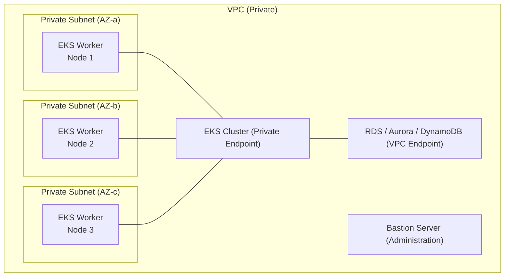

# Infrastructure Prerequisites Investigation

## 1. Common Prerequisites

### 1.1 Kubernetes Cluster Requirements

| Item | Requirement |
|------|------|
| **Kubernetes version** | 1.31 - 1.34 |
| **Red Hat OpenShift** | 4.18 - 4.20 |
| **Amazon EKS** | Kubernetes 1.31 - 1.34 |
| **Azure AKS** | Kubernetes 1.31 - 1.34 |
| **Helm** | 3.5 or higher |

According to the official documentation ([Requirements](https://scalardb.scalar-labs.com/docs/latest/requirements/)), ScalarDB Cluster is **currently only supported for operation on Kubernetes**. Standalone mode is limited to development and testing purposes.

### 1.2 Deployment via Helm Charts

Deployment is performed using Scalar Helm Charts.

```bash
# Add Helm repository
helm repo add scalar-labs https://scalar-labs.github.io/helm-charts
helm repo update

# Install
helm install <RELEASE_NAME> scalar-labs/scalardb-cluster \
  -n <NAMESPACE> \
  -f /<PATH_TO_CUSTOM_VALUES_FILE> \
  --version <CHART_VERSION>
```

The key Helm chart configuration parameters are as follows.

| Parameter | Description | Default/Recommended Value |
|------------|------|-------------------|
| `scalardbCluster.replicaCount` | Number of pods | 3 or more (production) |
| `scalardbCluster.resources.requests.cpu` | CPU request | `2000m` |
| `scalardbCluster.resources.requests.memory` | Memory request | `4Gi` |
| `scalardbCluster.resources.limits.cpu` | CPU limit | `2000m` |
| `scalardbCluster.resources.limits.memory` | Memory limit | `4Gi` |
| `scalardbCluster.logLevel` | Log level | - |
| `scalardbCluster.grafanaDashboard.enabled` | Grafana dashboard | `true` (recommended for production) |
| `scalardbCluster.serviceMonitor.enabled` | ServiceMonitor | `true` (recommended for production) |
| `scalardbCluster.prometheusRule.enabled` | PrometheusRule | `true` (recommended for production) |
| `scalardbCluster.tls.enabled` | Enable TLS | `true` (recommended for production) |
| `scalardbCluster.graphql.enabled` | Enable GraphQL | Optional |
| `envoy.enabled` | Enable Envoy proxy | `true` (required for indirect mode) |

Reference: [Configure a custom values file for ScalarDB Cluster](https://scalardb.scalar-labs.com/docs/latest/helm-charts/configure-custom-values-scalardb-cluster/)

### 1.3 Java Runtime Requirements

| Component | Supported Versions | Supported Distributions |
|---------------|-------------------|---------------------------|
| **ScalarDB Core** | Java 8, 11, 17, 21 (LTS) | Oracle JDK, Eclipse Temurin, Amazon Corretto, Microsoft Build of OpenJDK |
| **ScalarDB Cluster Embedding Client** | **Java 17 or 21 only** | Same as above |
| **ScalarDB Cluster Java Client SDK** | Java 8, 11, 17, 21 (LTS) | Same as above |
| **.NET SDK** | .NET 8.0, 6.0 | - |

**Note**: When using the ScalarDB Cluster Embedding client (direct-kubernetes mode), Java 17 or higher is required.

### 1.4 Network Requirements

**Port list**:

| Port | Protocol | Purpose |
|--------|-----------|------|
| **60053** | TCP | gRPC/SQL API requests |
| **8080** | TCP | GraphQL requests |
| **9080** | TCP | Prometheus metrics endpoint (path: `/metrics`) |
| **60053** | TCP | Envoy load balancing (indirect mode) |
| **9001** | TCP | Envoy metrics |

**Network configuration principles**:
- ScalarDB Cluster does not serve directly over the internet. **Deployment on a private network is mandatory**
- Applications access it via the private network
- TLS is supported since ScalarDB Cluster 3.12. Certificates with RSA or ECDSA algorithms can be used
- Automatic certificate management with cert-manager is also supported

### 1.5 Storage Requirements

Complete list of backend databases (storage) supported by ScalarDB:

**Relational databases (JDBC)**:

| Database | Supported Versions |
|-------------|-------------------|
| Oracle Database | 23ai, 21c, 19c |
| IBM Db2 | 12.1, 11.5 |
| MySQL | 8.4, 8.0 |
| PostgreSQL | 17, 16, 15, 14, 13 |
| Amazon Aurora MySQL | Version 2, 3 |
| Amazon Aurora PostgreSQL | Version-compatible |
| MariaDB | 11.4, 10.11 |
| TiDB | 8.5, 7.5, 6.5 |
| AlloyDB | 16, 15 |
| SQL Server | 2022, 2019, 2017 |
| SQLite | 3 |
| YugabyteDB | 2 |

**NoSQL databases**:

| Database | Notes |
|-------------|------|
| Amazon DynamoDB | Connect by specifying AWS region |
| Apache Cassandra | 5.0, 4.1, 3.11, 3.0 |
| Azure Cosmos DB for NoSQL | Strong consistency level recommended |

**Object storage (Private Preview)**:

| Storage | Notes |
|-----------|------|
| Amazon S3 | Private Preview |
| Azure Blob Storage | Private Preview |
| Google Cloud Storage | Private Preview |

### 1.6 License Requirements

Use of ScalarDB Cluster **requires a license key (trial or commercial)**. It can also be obtained via AWS Marketplace or Azure Marketplace.

---

## 2. AWS Environment

### 2.1 EKS (Elastic Kubernetes Service) Requirements

Reference: [Guidelines for creating an EKS cluster for ScalarDB Cluster](https://scalardb.scalar-labs.com/docs/latest/scalar-kubernetes/CreateEKSClusterForScalarDBCluster/)

| Item | Recommended Value |
|------|--------|
| **Kubernetes version** | 1.31 - 1.34 (within support range) |
| **Worker node count** | Minimum 3 nodes |
| **Worker node spec** | Minimum 4vCPU / 8GB memory |
| **Pod count** | Minimum 3 pods (distributed across worker nodes) |
| **AZ placement** | Distributed across different availability zones |
| **Subnet** | /24 prefix recommended (ensure sufficient IP count) |

**Recommended instance types**: 4vCPU / 8GB memory or higher. Each node runs ScalarDB Cluster pods (2vCPU / 4GB) along with Envoy proxy, monitoring components, and application pods, so generous sizing is necessary. Specifically, the following are appropriate:

| Instance Family | Recommended Type | vCPU | Memory |
|-----------------------|-----------|------|--------|
| General purpose | m5.xlarge | 4 | 16 GB |
| General purpose | m6i.xlarge | 4 | 16 GB |
| Compute optimized | c5.xlarge | 4 | 8 GB |

### 2.2 Available Databases

**Amazon DynamoDB**:
- No manual setup required (available by default)
- Authentication: Configure `ACCESS_KEY_ID`, `SECRET_ACCESS_KEY`, `REGION`
- Strongly recommended to enable PITR (Point-in-Time Recovery)
- Recommended to configure VPC endpoint for private connectivity

**Amazon RDS (MySQL, PostgreSQL, Oracle, SQL Server)**:
- RDS instance creation required
- Connect via JDBC URL, username, password
- Recommended to enable automatic backups
- Recommended to disable public access

**Amazon Aurora (MySQL/PostgreSQL)**:
- Aurora DB cluster creation required
- Automatic backups enabled by default
- Connect via JDBC URL, username, password

### 2.3 Network Configuration



- **VPC**: Build EKS cluster within a private network
- **Subnets**: Private subnets spanning multiple AZs (/24 recommended)
- **Security groups**: Allow 60053/TCP, 8080/TCP, 9080/TCP within EKS. Also allow DB ports (e.g., 5432, 3306)
- **VPC endpoint**: Gateway endpoint recommended when using DynamoDB

### 2.4 IAM Configuration

- IAM policy for DynamoDB access: Permissions for `PutItem`, `Query`, `UpdateItem`, `DeleteItem`, `Scan`, `DescribeTable`, `CreateTable`, `DeleteTable`, etc. are required
- IAM role for EKS cluster management
- Marketplace subscription permissions when obtaining container images via AWS Marketplace

### 2.5 Deployment Procedure Overview

Reference: [Deploy ScalarDB Cluster on Amazon EKS](https://scalardb.scalar-labs.com/docs/latest/scalar-kubernetes/ManualDeploymentGuideScalarDBClusterOnEKS/)

1. Subscribe via AWS Marketplace
2. Create EKS cluster
3. Set up backend database
4. Create Bastion server (within the same VPC)
5. Configure Helm Chart custom values file
6. Deploy via Helm
7. Verify status
8. Enable monitoring
9. Deploy application

---

## 3. Azure Environment

### 3.1 AKS (Azure Kubernetes Service) Requirements

Reference: [Guidelines for creating an AKS cluster for ScalarDB](https://scalardb.scalar-labs.com/docs/latest/scalar-kubernetes/CreateAKSClusterForScalarDB/)

| Item | Recommended Value |
|------|--------|
| **Kubernetes version** | 1.31 - 1.34 (within support range) |
| **Worker node count** | Minimum 3 nodes |
| **VM size** | Minimum 4vCPU / 8GB memory |
| **Pod count** | Minimum 3 pods |
| **Network plugin** | Azure CNI recommended (not kubenet) |
| **Node pool** | Recommended to create a dedicated user mode node pool for ScalarDB Cluster |

**Recommended VM sizes**:

| VM Size | vCPU | Memory | Notes |
|-----------|------|--------|------|
| Standard_D4s_v5 | 4 | 16 GB | General purpose recommended |
| Standard_D4as_v5 | 4 | 16 GB | AMD-based |
| Standard_F4s_v2 | 4 | 8 GB | Compute optimized |

### 3.2 Available Databases

Reference: [Set up a database for ScalarDB deployment on Azure](https://scalardb.scalar-labs.com/docs/latest/scalar-kubernetes/SetupDatabaseForAzure/)

**Azure Cosmos DB for NoSQL**:
- Authenticate with `COSMOS_DB_URI` and `COSMOS_DB_KEY`
- **Capacity mode**: Provisioned throughput (required)
- **Consistency level**: `Strong` (required)
- **Backup mode**: Continuous backup mode (PITR-compatible, recommended for production)
- VNet service endpoint configuration recommended

**Azure Database for MySQL (Flexible Server)**:
- Connect via JDBC URL, username, password
- Private access (VNet integration) recommended
- Same VNet as AKS cluster or VNet peering connection

**Azure Database for PostgreSQL (Flexible Server)**:
- Connect via JDBC URL, username, password
- Private access (VNet integration) recommended

### 3.3 Network Configuration

- **VNet**: Create AKS cluster on a private network
- **NSG**: Allow 60053/TCP, 8080/TCP, 9080/TCP internally
- **Azure CNI**: Recommended for VNet integration
- **Service endpoint**: Secure connection to Cosmos DB, etc.

### 3.4 Azure AD Configuration

The official documentation has limited specific references to Azure AD, but authentication and authorization configuration integrated with AKS RBAC is generally required. Subscription permissions are needed for image retrieval via Azure Marketplace.

---

## 4. GCP Environment

### 4.1 GKE (Google Kubernetes Engine) Requirements

**Important**: GKE (GCP) support for ScalarDB Cluster was **scheduled for Q4 2025** according to the [ScalarDB Roadmap](https://scalardb.scalar-labs.com/docs/latest/roadmap/). As of February 2026, an officially supported deployment guide may have become available.

Quote from roadmap:
> "Users will be able to deploy ScalarDB Cluster in Google Kubernetes Engine (GKE) in GCP." (CY2025 Q4)

However, a GCP environment (GKE + Cloud SQL) deployment guide already exists for ScalarDB Analytics ([Deploy ScalarDB Analytics in Public Cloud Environments](https://scalardb.scalar-labs.com/docs/latest/scalardb-analytics/deployment/)), and the following configuration can be used as a reference.

### 4.2 Available Databases (ScalarDB Core Level)

| Database | Storage Type | Notes |
|-------------|-----------------|------|
| Cloud SQL for PostgreSQL | JDBC | Via GKE + Cloud SQL Auth Proxy |
| Cloud SQL for MySQL | JDBC | Same as above |
| AlloyDB | JDBC | PostgreSQL-compatible, versions 16, 15 |
| Cloud Spanner | - | **Not supported** - Not included in ScalarDB Core's official support list |
| Cloud Bigtable | - | **Not supported** - Not included in ScalarDB Core's official support list |
| Google Cloud Storage | Object storage | Private Preview |

**Note**: Cloud Spanner and Cloud Bigtable are not included in the ScalarDB 3.17 official supported database list. In GCP environments, using Cloud SQL (PostgreSQL/MySQL) or AlloyDB is practical.

### 4.3 Network Configuration (From ScalarDB Analytics GCP Deployment Guide)

- Create private subnets within VPC
- Firewall rules: `TCP 0-65535, UDP 0-65535, ICMP` (within subnet only)
- SSH connection: TCP 22
- Cloud SQL instance: Private IP connection only with `--no-assign-ip` flag
- Connect to DB via private service access

### 4.4 IAM Configuration

- Service account for Cloud SQL connection
- IAM roles for GKE node pool
- Automatic authentication sidecar injection via Cloud SQL Auth Proxy Operator

---

## 5. On-Premises Environment

### 5.1 Kubernetes Build Requirements

Since ScalarDB Cluster only runs on Kubernetes, building a Kubernetes cluster is mandatory even on-premises.

| Method | Notes |
|------|------|
| **kubeadm** | Standard build tool |
| **Rancher (RKE/RKE2)** | Enterprise-oriented |
| **Red Hat OpenShift** | 4.18 - 4.20 officially supported |

### 5.2 Bare Metal/VM Requirements

| Item | Minimum Requirements |
|------|---------|
| **Worker node count** | 3 nodes or more |
| **CPU per node** | 4 vCPU or more |
| **Memory per node** | 8 GB or more |
| **OS** | Linux (distribution that supports Kubernetes) |
| **Container runtime** | containerd, CRI-O, etc. |

Each node runs ScalarDB Cluster pods (2vCPU / 4GB) along with Envoy, monitoring agents, and applications, so generous resource allocation is necessary.

### 5.3 Network Requirements

| Requirement | Details |
|------|------|
| **Private network** | ScalarDB Cluster must not be directly exposed to the internet |
| **Port opening** | 60053/TCP, 8080/TCP, 9080/TCP (within cluster) |
| **DB connectivity** | Ensure network reachability to backend DB |
| **Load balancer** | Kubernetes-compatible LB such as MetalLB is needed (for indirect mode) |
| **DNS** | In-cluster DNS (CoreDNS) must be functioning properly |

### 5.4 Storage Requirements

For on-premises environments, the following databases can be used as backends:
- PostgreSQL 13-17
- MySQL 8.0, 8.4
- Oracle Database 19c, 21c, 23ai
- SQL Server 2017, 2019, 2022
- Apache Cassandra 3.0, 3.11, 4.1, 5.0
- MariaDB 10.11, 11.4

### 5.5 Backup/DR Configuration

**For RDB (single database)**:
- `mysqldump --single-transaction` (MySQL)
- `pg_dump` (PostgreSQL)
- For cloud managed services, automatic backup + PITR

**For NoSQL / multiple databases**:
- ScalarDB / ScalarDB Cluster must be **paused** before taking backups
- DynamoDB: PITR enablement required
- Cosmos DB: Continuous backup policy configuration required
- Cassandra: Use replication

**DR basic principles**:
- Enable automatic backup on backend databases
- Recommended to enable Point-in-Time Recovery (PITR)
- Distribute across multiple AZs / regions

---

## 6. ScalarDB Cluster-Specific Requirements

### 6.1 Node Sizing

| Environment | Pod Count | Worker Node Count |
|------|---------|----------------|
| **Development/Testing** | 1 (standalone mode acceptable) | 1 |
| **Production (minimum)** | **3** | **3** |
| **Production (recommended)** | 3 or more, distributed across multiple AZs | 3 or more, distributed across multiple AZs |

### 6.2 Memory and CPU Requirements

| Component | CPU | Memory | Notes |
|---------------|-----|--------|------|
| **ScalarDB Cluster pod** | 2vCPU (requests/limits) | 4GB (requests/limits) | License-imposed limitation |
| **Worker node** | 4vCPU or more | 8GB or more | Includes Envoy, monitoring components, etc. |

Helm chart configuration example:
```yaml
scalardbCluster:
  replicaCount: 3
  resources:
    requests:
      cpu: 2000m
      memory: 4Gi
    limits:
      cpu: 2000m
      memory: 4Gi
```

### 6.3 Scaling Configuration

| Scaling Method | Description |
|-----------------|------|
| **Horizontal Pod Autoscaler (HPA)** | Automatic scaling of pod count |
| **Cluster Autoscaler** | Recommended to use alongside HPA |
| **Subnet IP count** | Ensure sufficient IPs after scaling (/24 recommended) |

Note that ScalarDB Cluster uses a consistent hashing algorithm for request routing, so transaction redistribution occurs when pods are added.

### 6.4 Client Connection Modes

| Mode | Description | Recommendation |
|--------|------|------|
| **direct-kubernetes** | Direct connection within the same K8s cluster as the app | **Recommended for production (performance)** |
| **indirect** | Connection from a different environment via Envoy | When connecting from an app in a different environment |

In `direct-kubernetes` mode, the following Kubernetes resources must be created:
- Role
- RoleBinding
- ServiceAccount (mounted on application pods)

### 6.5 Monitoring (Prometheus + Grafana)

Reference: [Monitoring Scalar products on a Kubernetes cluster](https://scalardb.scalar-labs.com/docs/latest/scalar-kubernetes/K8sMonitorGuide/)

**Deployment procedure**:
```bash
# Deploy Prometheus Operator (kube-prometheus-stack)
helm repo add prometheus-community https://prometheus-community.github.io/helm-charts
helm repo update

kubectl create namespace monitoring
helm install scalar-monitoring prometheus-community/kube-prometheus-stack \
  -n monitoring \
  -f scalar-prometheus-custom-values.yaml
```

**Enabling in ScalarDB Cluster Helm chart**:
```yaml
scalardbCluster:
  prometheusRule:
    enabled: true
  grafanaDashboard:
    enabled: true
  serviceMonitor:
    enabled: true
```

**Metrics endpoint**: Exposes Prometheus-format metrics on port 9080

**Grafana access**:
```bash
# For testing
kubectl port-forward -n monitoring svc/scalar-monitoring-grafana 3000:3000
# For production, use LoadBalancer or Ingress
```

### 6.6 Backup/Restore

Reference: [How to Back Up and Restore Databases Used Through ScalarDB](https://scalardb.scalar-labs.com/docs/latest/backup-restore/)

**Basic backup requirements**:
- Backups of all ScalarDB-managed tables (including the Coordinator table) must be "transactionally consistent or capable of automatically recovering to a consistent state"

**RDB backup (without pausing)**:
- MySQL: `mysqldump --single-transaction`
- PostgreSQL: `pg_dump`
- SQLite: `.backup`
- Amazon RDS / Aurora: Restorable within retention period using automatic backup

**NoSQL backup (with pausing)**:
- When backing up NoSQL DBs, use the `pause`/`unpause` commands of `scalar-admin-for-kubernetes` to pause and resume ScalarDB Cluster.
- DynamoDB: PITR must be enabled
- Cosmos DB: Continuous backup policy must be configured
- Cassandra: Partial recovery also possible using replication

**Restore considerations**:
- DynamoDB: Tables can only be restored with an alias, so renaming after restoration is required
- Cosmos DB: PITR does not restore stored procedures, so reinstallation using the Schema Loader's `--repair-all` option is necessary

### 6.7 TLS Configuration

Reference: [Getting Started with Helm Charts (ScalarDB Cluster with TLS)](https://scalardb.scalar-labs.com/docs/latest/helm-charts/getting-started-scalardb-cluster-tls/)

**Requirements**:
- ScalarDB Cluster 3.12 or later is required
- Certificates with RSA or ECDSA algorithms can be used

**Certificate file structure**:
1. **CA certificate**: `ca-key.pem` and `ca.pem` (self-signed root CA)
2. **Envoy certificate**: `envoy-key.pem` and `envoy.pem` (for load balancer)
3. **ScalarDB Cluster certificate**: `scalardb-cluster-key.pem` and `scalardb-cluster.pem`

**Configuration parameters**:
```properties
scalar.db.cluster.tls.enabled=true
scalar.db.cluster.tls.ca_root_cert_path=/tls/scalardb-cluster/certs/ca.crt
scalar.db.cluster.tls.override_authority=cluster.scalardb.example.com
```

**Certificate management options**:
- Manual management: Generate certificates with `cfssl` etc. and register as Kubernetes Secrets
- Automatic management: Use cert-manager for automatic certificate renewal

### 6.8 Performance-Related Configuration

The following tuning is available in ScalarDB Core configuration:

| Setting | Default Value | Description |
|----------|-------------|------|
| `parallel_executor_count` | 128 | Number of parallel execution threads |
| `async_commit.enabled` | false | Asynchronous commit |
| `async_rollback.enabled` | false | Asynchronous rollback |
| `jdbc.connection_pool.max_total` | 200 | Maximum JDBC connections |
| Group commit | - | Batch processing of multiple transactions |

---

## Summary: Recommended Configuration by Environment

| Item | AWS | Azure | GCP | On-Premises |
|------|-----|-------|-----|------------|
| **K8s service** | EKS | AKS | GKE (2025 Q4~) | kubeadm / OpenShift |
| **Recommended DB** | Aurora PostgreSQL / DynamoDB | Cosmos DB / Azure DB for PostgreSQL | Cloud SQL for PostgreSQL / AlloyDB | PostgreSQL / Cassandra |
| **Worker nodes** | m5.xlarge x3 | Standard_D4s_v5 x3 | (TBD) | 4vCPU/8GB x3 |
| **Network** | VPC + Private Subnet | VNet + Azure CNI | VPC + Private Subnet | Private Network |
| **Monitoring** | Prometheus + Grafana on EKS | Prometheus + Grafana on AKS | Prometheus + Grafana on GKE | Prometheus + Grafana |
| **Backup** | RDS automatic backup / DynamoDB PITR | Cosmos DB continuous backup | Cloud SQL automatic backup | DB native backup |
| **Marketplace** | AWS Marketplace | Azure Marketplace | GCP Marketplace (2026 Q3~) | Obtain license key directly |

---

## Key Reference Documents

- [ScalarDB Requirements](https://scalardb.scalar-labs.com/docs/latest/requirements/)
- [Production checklist for ScalarDB Cluster](https://scalardb.scalar-labs.com/docs/latest/scalar-kubernetes/ProductionChecklistForScalarDBCluster/)
- [Configure a custom values file for ScalarDB Cluster](https://scalardb.scalar-labs.com/docs/latest/helm-charts/configure-custom-values-scalardb-cluster/)
- [How to deploy ScalarDB Cluster](https://scalardb.scalar-labs.com/docs/latest/helm-charts/how-to-deploy-scalardb-cluster/)
- [Deploy ScalarDB Cluster on Amazon EKS](https://scalardb.scalar-labs.com/docs/latest/scalar-kubernetes/ManualDeploymentGuideScalarDBClusterOnEKS/)
- [Guidelines for creating an EKS cluster for ScalarDB Cluster](https://scalardb.scalar-labs.com/docs/latest/scalar-kubernetes/CreateEKSClusterForScalarDBCluster/)
- [Set up a database for ScalarDB deployment on AWS](https://scalardb.scalar-labs.com/docs/latest/scalar-kubernetes/SetupDatabaseForAWS/)
- [Set up a database for ScalarDB deployment on Azure](https://scalardb.scalar-labs.com/docs/latest/scalar-kubernetes/SetupDatabaseForAzure/)
- [ScalarDB Cluster Standalone Mode](https://scalardb.scalar-labs.com/docs/latest/scalardb-cluster/standalone-mode/)
- [Monitoring Scalar products on a Kubernetes cluster](https://scalardb.scalar-labs.com/docs/latest/scalar-kubernetes/K8sMonitorGuide/)
- [How to Back Up and Restore Databases Used Through ScalarDB](https://scalardb.scalar-labs.com/docs/latest/backup-restore/)
- [ScalarDB Roadmap](https://scalardb.scalar-labs.com/docs/latest/roadmap/)
- [ScalarDB Core Configurations](https://scalardb.scalar-labs.com/docs/latest/configurations/)
- [Getting Started with Helm Charts (ScalarDB Cluster with TLS)](https://scalardb.scalar-labs.com/docs/latest/helm-charts/getting-started-scalardb-cluster-tls/)
- [Getting Started with Helm Charts (ScalarDB Cluster with TLS by Using cert-manager)](https://scalardb.scalar-labs.com/docs/latest/helm-charts/getting-started-scalardb-cluster-tls-cert-manager/)
- [Deploy ScalarDB Analytics in Public Cloud Environments](https://scalardb.scalar-labs.com/docs/latest/scalardb-analytics/deployment/)

---

## 7. DevOps/CI/CD Integration Guide

### 7.1 CI/CD Pipeline Design

CI/CD pipelines for microservices that include ScalarDB should consist of the following stages.

| Stage | Contents | Example Tools |
|---------|------|---------|
| Build | Application build + container image creation | Maven/Gradle + Docker |
| Unit Test | Unit tests using ScalarDB mocks | JUnit + Mockito |
| Integration Test | Testcontainers + ScalarDB Standalone | Testcontainers |
| Schema Migration | Schema application via ScalarDB Schema Loader | Schema Loader CLI |
| Deploy | K8s deployment via Helm Chart | Helm + ArgoCD |
| Smoke Test | Health check + basic Tx verification after deployment | Custom scripts |

### 7.2 Environment Management (dev/staging/prod)

| Item | dev | staging | prod |
|------|-----|---------|------|
| ScalarDB Cluster pod count | 1 | 2 | 3 or more |
| Backend DB | PostgreSQL (Docker) | RDS Single-AZ | RDS Multi-AZ |
| TLS | Disabled | Self-signed | cert-manager |
| Authentication | Disabled | Enabled | Enabled + RBAC |
| Monitoring | Local Prometheus | Prometheus + Grafana | Full monitoring stack |
| Backup | None | Daily | PITR + periodic snapshots |

### 7.3 GitOps Pattern

Declarative deployment management using ArgoCD / Flux is recommended.

```
Repository structure:
├── apps/
│   ├── order-service/
│   │   ├── base/
│   │   └── overlays/
│   │       ├── dev/
│   │       ├── staging/
│   │       └── prod/
│   └── customer-service/
│       └── ...
├── infra/
│   ├── scalardb-cluster/
│   │   ├── base/values.yaml
│   │   └── overlays/
│   │       ├── dev/values.yaml
│   │       ├── staging/values.yaml
│   │       └── prod/values.yaml
│   └── monitoring/
│       └── ...
└── schemas/
    ├── order-schema.json
    └── customer-schema.json
```

### 7.4 Schema Loader Pipeline Integration

ScalarDB schema changes should only be applied through the CI/CD pipeline.

1. Manage schema definition files (JSON) in a Git repository
2. Review schema changes via PR
3. Automatically apply using Schema Loader CLI after merge
4. Promote to prod after validation in the staging environment

### 7.5 Capacity Planning

| Item | Calculation Method |
|------|---------|
| **Required pod count** | Required TPS / Single pod TPS (~1,000-3,000) x 1.3 (margin) |
| **DB connection limit** | Pod count x parallel_executor_count (default 128) <= DB max_connections x 0.8 |
| **Storage** | Record count x (app data size + metadata ~100 bytes + before-image) |
| **Coordinator table** | Daily Tx count x ~100 bytes/Tx |
