# トランザクションモデル調査

## 1. サービス内トランザクション（ScalarDB Consensus Commit）

### 1.1 ローカルトランザクション

マイクロサービス内のトランザクションは、単一のデータベースに対するACIDトランザクションである。各マイクロサービスが自身のデータベースを持つ「Database-per-Service」パターンにおいて、サービス内の操作は従来のローカルトランザクションで完結できる。

```java
// 従来のローカルトランザクション（Spring例）
@Transactional
public void placeOrder(Order order) {
    orderRepository.save(order);
    orderItemRepository.saveAll(order.getItems());
    // 同一DB内なのでACIDが保証される
}
```

**特徴:**
- 単一データベース内でACID特性が完全に保証される
- デッドロック検知、ロールバックなどはDBエンジンが処理する
- パフォーマンスが良く、実装が単純である

### 1.2 データベース固有のトランザクション機能

各データベースは独自のトランザクション機能を提供する。

| データベース | トランザクション特性 |
|---|---|
| PostgreSQL/MySQL | 完全なACID、MVCC、様々な分離レベル |
| Cassandra | 軽量トランザクション（LWT）、パーティション内の原子性 |
| DynamoDB | TransactWriteItems/TransactGetItemsによる限定的なトランザクション |
| MongoDB | 4.0以降でマルチドキュメントトランザクション対応 |

### 1.3 ScalarDB Consensus Commitによる統一的トランザクション

ScalarDBは**ストレージ抽象化層**を提供し、各データベース固有のトランザクション機能に依存せずにACIDトランザクションを実現する。ScalarDBのConsensus Commitプロトコルは、データベースのネイティブなトランザクション機能を使わず、独自にトランザクションを管理する。これにより以下が可能になる。

- Cassandra、DynamoDBなど、本来完全なACIDトランザクションをサポートしないDBでもACIDトランザクションが利用可能になる
- 異なるDB間で統一的なトランザクションAPIを使用できる
- アプリケーションコードがDB固有の制約から解放される

```java
// ScalarDBによる統一的なトランザクションAPI
DistributedTransaction tx = transactionManager.start();
try {
    // Cassandraに対してもMySQLに対しても同じAPIで操作
    tx.put(Put.newBuilder()
        .namespace("order_service")
        .table("orders")
        .partitionKey(Key.ofText("id", orderId))
        .intValue("amount", 1000)
        .build());
    tx.commit();
} catch (Exception e) {
    tx.abort();
}
```

**ScalarDB Consensus Commitの技術的特徴:**
- **楽観的並行性制御（OCC）**: ロックではなくOCCを使用し、Readフェーズではロックなしでデータをローカルワークスペースにコピーし、Validationフェーズで競合を検出する。これによりブロッキングを最小化する
- **クライアント協調型**: 専用のコーディネータプロセスが不要なアーキテクチャ（コーディネーション状態をデータベース上のCoordinatorテーブルで管理）
- **分離レベル**: Snapshot Isolation（SI）およびSerializableをサポート
- **DB非依存**: 下層DBには「linearizable conditional write（線形化可能な条件付き書き込み）」のみを要求する

---

## 2. サービス間トランザクション（ScalarDB 2PC Interface）

### 2.1 分散トランザクションの課題

マイクロサービスアーキテクチャでは、各サービスが独立したデータベースを持つため、サービス間をまたがるトランザクションに根本的な困難が生じる。

**主な課題:**
- **ネットワーク分断**: サービス間通信は信頼できないネットワークを経由する。CAP定理により、分断耐性を維持しつつ一貫性と可用性を同時に完全に満たすことはできない
- **部分障害**: 一部のサービスのみが失敗し、他は成功するという状態が発生する
- **レイテンシ**: 分散ロックやコーディネーションによるパフォーマンス劣化
- **結合度の増加**: サービス間の強い結合はマイクロサービスの独立デプロイの利点を損なう
- **データの整合性**: 結果整合性（Eventual Consistency）と強い整合性（Strong Consistency）のトレードオフ

### 2.2 ScalarDB 2PC Interfaceによるサービス間トランザクション

ScalarDBの2PC実装は、従来のXAベースの2PCとは根本的に異なる。

```java
// ScalarDB 2PC Interface - Coordinatorサービス
TwoPhaseCommitTransactionManager txManager =
    TransactionFactory.create(configPath)
        .getTwoPhaseCommitTransactionManager();

TwoPhaseCommitTransaction tx = txManager.start();
String txId = tx.getId(); // トランザクションIDを取得

// ローカル操作
tx.put(/* Order Service の操作 */);

// 他サービスにtxIdを渡して操作を依頼（gRPC等）
customerServiceClient.processPayment(txId, customerId, amount);

// 全参加者でPrepare
tx.prepare();
// Participantサービス側でもprepare()

// 全参加者でValidate（SERIALIZABLE + EXTRA_READ戦略使用時は必須。それ以外では呼出しても効果なし）
tx.validate();

// Commit
tx.commit();
```

```java
// ScalarDB 2PC Interface - Participantサービス
public void processPayment(String txId, String customerId, int amount) {
    TwoPhaseCommitTransaction tx = txManager.join(txId);

    // Customer DBへの操作
    tx.put(/* Customer Serviceの操作 */);

    // prepare/validate/commitはCoordinatorが制御（validateはSERIALIZABLE + EXTRA_READ戦略使用時のみ必須。それ以外では効果なし）
    tx.prepare();
    tx.validate();
    tx.commit();
}
```

**ScalarDB 2PCの特長:**
1. **データベース非依存**: 各データベースのXAサポートに依存しない
2. **専用コーディネータプロセス不要**: 専用のコーディネータプロセスが不要なアーキテクチャ（コーディネーション状態をデータベース上のCoordinatorテーブルで管理）
3. **楽観的並行性制御**: ブロッキングを最小化する
4. **異種DB間のトランザクション**: CassandraとMySQL間など、異なるDB間でも2PCを実行可能

---

## 3. 2PCの限界とScalarDBによる改善

### 3.1 伝統的な2PC（X/Open XA）の限界

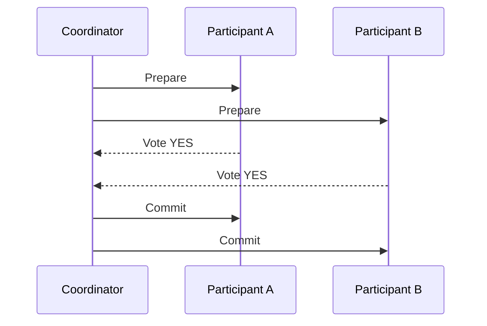

**限界:**
- **ブロッキングプロトコル**: Prepare後にCoordinatorが障害を起こすと、Participantはロックを保持したまま待機し続ける
- **単一障害点**: Coordinatorがダウンするとトランザクション全体が停止する
- **パフォーマンス**: ロック保持時間が長く、スループットが低下する
- **可用性の低下**: 全参加者が利用可能でなければトランザクションが開始できない
- **DB依存**: XAプロトコルをサポートしないデータベース（Cassandra、DynamoDBなど）では使用不可

#### 3.1.1 データベース別XA実装の制約（詳細調査結果）

**XAをサポートするDB / しないDB:**

| カテゴリ | データベース | XAサポート | 備考 |
|---|---|---|---|
| **RDBMS** | MySQL (InnoDB) | ✅ | InnoDB限定。MyISAM等は不可 |
| | PostgreSQL | ✅ | `PREPARE TRANSACTION`経由。`max_prepared_transactions`設定が必要 |
| | Oracle | ✅ | 最も成熟した実装 |
| | SQL Server | ✅ | MSDTC経由 |
| | MariaDB | ✅ | MySQL互換だが独自制約あり |
| **NewSQL** | CockroachDB / YugabyteDB | ❌ | 独自の分散トランザクション |
| **NoSQL** | Cassandra / DynamoDB / MongoDB / Cosmos DB / Redis | ❌ | XA非対応。独自の限定的トランザクション機能のみ |

**MySQL固有の制約（公式ドキュメント記載）:**

| 制約 | 深刻度 | 詳細 |
|---|---|---|
| InnoDB限定 | 高 | XAはInnoDBストレージエンジンでのみサポート |
| レプリケーションフィルタ不可 | 高 | XAトランザクションとレプリケーションフィルタの併用は非サポート。フィルタにより空のXAトランザクションが生成されるとレプリカが停止 |
| Statement-Basedレプリケーションで安全でない | 高 | 並行XAトランザクションのPrepare順序逆転でデッドロック発生の可能性。`binlog_format=ROW`必須 |
| 8.0.30以前のバイナリログ非耐性 | 高 | XA PREPARE/COMMIT/ROLLBACK中の異常停止でバイナリログとストレージエンジンの不整合が発生 |
| バイナリログの分割 | 中 | XA PREPAREとXA COMMITが別々のバイナリログファイルに分かれる可能性 |
| XA START JOIN/RESUME未実装 | 中 | 構文は認識されるが実際には効果なし |

**PostgreSQL固有の問題:**

| 問題 | 深刻度 | 詳細 |
|---|---|---|
| VACUUMの阻害 | 高 | Preparedトランザクションが長時間残るとVACUUMがストレージを回収できなくなり、最悪の場合Transaction ID Wraparound防止のためDBがシャットダウン |
| 孤立トランザクション | 高 | TMの障害でpreparedトランザクションが孤立するとロックが保持され続ける。DB再起動でも解消されず、手動で`ROLLBACK PREPARED`が必要 |
| ロック長期保持 | 高 | Prepared状態のトランザクションはロックを保持し続け、他セッションのブロッキングやデッドロックリスクが増大 |
| max_prepared_transactions設定 | 中 | デフォルト0（無効）。`max_connections`以上に設定しないとヒューリスティック問題発生 |
| Transaction interleaving未実装 | 中 | JDBCドライバで警告が発生。`supportsTmJoin=false`で回避が必要 |

> **注意**: PostgreSQL公式ドキュメントは「PREPARE TRANSACTIONはアプリケーションや対話セッションでの使用を意図していない。トランザクションマネージャを書いているのでなければ、おそらく使うべきではない」と警告している。

**異種RDBMS混在時（例: MySQL + PostgreSQL）の追加問題:**

- **2PC実装の差異**: 各DBのXA実装は微妙に異なり、TM（トランザクションマネージャ）が差異を吸収する必要がある（例: PostgreSQLはXA STARTではなくBEGIN + PREPARE TRANSACTIONを使用）
- **障害回復の複雑化**: DB AはCommit済み、DB BはPrepared状態で停止した場合の回復手順が各DBで異なる
- **タイムアウト挙動の差異**: 各DBのトランザクションタイムアウト・ロックタイムアウトの挙動が異なり、一方のみがタイムアウトするケースが発生
- **ドライバの互換性**: JDBCドライバのXA実装品質がDBベンダーにより異なる
- **監視・デバッグの困難さ**: XA状態確認コマンドが各DBで異なる（MySQL: `XA RECOVER`, PostgreSQL: `pg_prepared_xacts`, Oracle: `DBA_2PC_PENDING`）
- **ヒューリスティック決定のリスク**: TMが決定を下す前にRMが独自にcommit/rollbackする可能性があり、異種DB間では各DBの判断基準が異なるためデータ不整合リスクが高まる

### 3.2 ScalarDBによる改善

ScalarDBのConsensus Commitプロトコルは、伝統的な2PCの限界を以下のように克服する。

| 課題 | 伝統的2PC | ScalarDB 2PC |
|---|---|---|
| DBサポート | XA対応DBのみ | XA不要、任意のDBに対応 |
| ブロッキング | Prepare後にロック保持 | OCCにより読み取りロックなし |
| 単一障害点 | Coordinatorが障害点 | 専用のコーディネータプロセスが不要なアーキテクチャ（コーディネーション状態をデータベース上のCoordinatorテーブルで管理） |
| パフォーマンス | ロック期間が長い | 低〜中競合環境でOCCにより高スループット |
| 高競合時のパフォーマンス | ロック取得で順序制御されるため安定 | OCC競合によりリトライが増加し、スループットが低下する可能性がある |
| 可用性 | 全参加者が利用可能でなければならない | 同様に全参加者が利用可能でなければならない |
| 異種DB | XA対応DB間のみ | Cassandra + MySQL等の異種構成に対応 |
| 障害回復 | 手動介入が必要（孤立TX、ヒューリスティック決定） | Lazy Recoveryで自動回復 |
| 運用負荷 | TM管理、孤立TX対応、DB別監視コマンド習得が必要 | ScalarDB Cluster自体の運用に集約 |

---

## 4. Sagaパターン（Choreography/Orchestration）とScalarDBとの関係

### 4.1 概要

Sagaパターンは、長時間にわたる分散トランザクションを、一連のローカルトランザクション（ステップ）に分解するパターンである。各ステップが成功すれば次のステップに進み、いずれかが失敗すれば、既に完了したステップを「補償トランザクション」で取り消す。

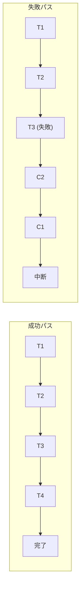

### 4.2 Choreography Saga

各サービスが自律的にイベントを発行・購読し、協調的にSagaを進行させるパターン。中央のオーケストレーターは存在しない。

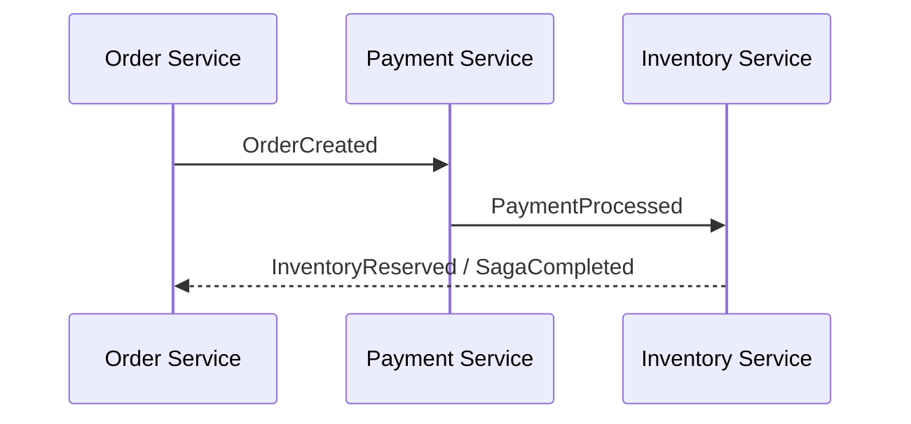

**利点:**
- サービス間の結合度が低い
- 単一障害点がない
- 各サービスの自律性が高い

**欠点:**
- Saga全体の状態を把握しにくい
- サービス数の増加に伴い複雑性が急増する
- デバッグ・テストが困難
- 循環依存のリスク

### 4.3 Orchestration Saga

中央のSagaオーケストレーターがトランザクション全体のフローを制御する。

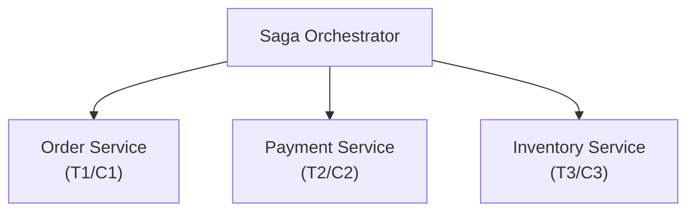

**利点:**
- Sagaのフロー全体を一箇所で把握・管理できる
- 複雑なワークフローの実装が容易
- 補償ロジックの管理が集中化される
- 監視・デバッグが容易

**欠点:**
- オーケストレーター自体が単一障害点になりうる
- オーケストレーターへのロジック集中リスク
- サービスがオーケストレーターに依存する

### 4.4 補償トランザクション設計

補償トランザクション設計における重要な原則:

1. **冪等性（Idempotency）**: 補償トランザクションは何度実行しても同じ結果を返す必要がある。ネットワーク障害時のリトライを安全に行うため
2. **可換性（Commutativity）**: 補償の実行順序が異なっても最終的に同じ状態になることが望ましい
3. **意味的な逆操作**: 物理的な削除ではなく「キャンセル済み」状態への遷移など、ビジネス上意味のある逆操作を設計する

```java
// 補償トランザクションの例
public class OrderSagaCompensations {
    // T1の補償: 注文をキャンセル状態にする（削除ではない）
    public void compensateOrderCreation(String orderId) {
        order.setStatus(OrderStatus.CANCELLED);
        orderRepository.save(order);
    }

    // T2の補償: 決済を返金する
    public void compensatePayment(String paymentId) {
        payment.setStatus(PaymentStatus.REFUNDED);
        paymentRepository.save(payment);
    }

    // T3の補償: 在庫予約を解放する
    public void compensateInventoryReservation(String reservationId) {
        reservation.setStatus(ReservationStatus.RELEASED);
        inventoryRepository.save(reservation);
    }
}
```

### 4.5 ScalarDBが入った場合のSaga実装パターン

**パターン1: 各ローカルトランザクションをScalarDBで強化**

各Sagaステップのローカルトランザクションにおいて、ScalarDBを使用することで、サービス内で複数のデータベースを使用している場合でもACIDが保証される。

```java
// Saga Step: Order Service（複数DB利用時）
public void createOrder(OrderRequest request) {
    DistributedTransaction tx = scalarDbTxManager.start();
    try {
        // MySQL上のordersテーブルに書き込み
        tx.put(orderPut);
        // Cassandra上のorder_eventsテーブルにイベント記録
        tx.put(orderEventPut);
        tx.commit();
        // 成功 -> 次のSagaステップへイベント発行
        eventPublisher.publish(new OrderCreatedEvent(orderId));
    } catch (Exception e) {
        tx.abort();
        throw e;
    }
}
```

**パターン2: ScalarDBの2PCインターフェースでSagaを不要にする**

ScalarDBの2PCインターフェースを使えば、マイクロサービス間で直接的な分散トランザクションが可能になるため、Sagaパターン自体が不要になるケースがある。これは、Sagaの結果整合性モデルよりも強い一貫性（強整合性）を必要とする場合に有効である。

```java
// ScalarDB 2PCでSagaを代替
// Coordinator (Order Service)
TwoPhaseCommitTransaction tx = txManager.start();
String txId = tx.getId();

// Order Service のローカル操作
tx.put(orderPut);

// Payment Service に参加を依頼
paymentService.processPayment(txId, paymentRequest);

// Inventory Service に参加を依頼
inventoryService.reserveStock(txId, reservationRequest);

// 全サービスで一斉にPrepare -> Validate -> Commit
tx.prepare();
tx.validate();
tx.commit();
// -> 補償トランザクションが不要。失敗時は全サービスで自動ロールバック
```

**ScalarDBによるSagaパターンへの影響のまとめ:**

| 観点 | Sagaのみ | ScalarDB + Saga | ScalarDB 2PC（Saga代替） |
|---|---|---|---|
| 一貫性モデル | 結果整合性 | 各ステップ内は強整合性 | 強整合性（ACID） |
| 補償トランザクション | 必須 | 必須だが各ステップの信頼性が向上 | 不要 |
| 複雑性 | 高い（補償設計） | 中程度 | 低い（従来のTxに近い） |
| 可用性 | 高い | 高い | 全参加者が必要 |
| 異種DB対応 | DB毎に個別対応 | ScalarDBが統一的に処理 | ScalarDBが統一的に処理 |

---

## 5. TCCパターンとScalarDBとの統合

### 5.1 基本概念と実装

TCCパターン（Try-Confirm-Cancel）は、Atomikos社のGuy Pardonらが体系化したパターンであり、Pat Hellandの「Life beyond Distributed Transactions: an Apostate's Opinion」（2007年）の思想とも関連する。各操作を3つのフェーズに分割する。

- **Try**: リソースを予約（仮確保）する。ビジネスバリデーションを行い、必要なリソースを中間状態で確保する
- **Confirm**: 予約を確定する。Tryで確保したリソースを正式に消費する
- **Cancel**: 予約を取り消す。Tryで確保したリソースを解放する

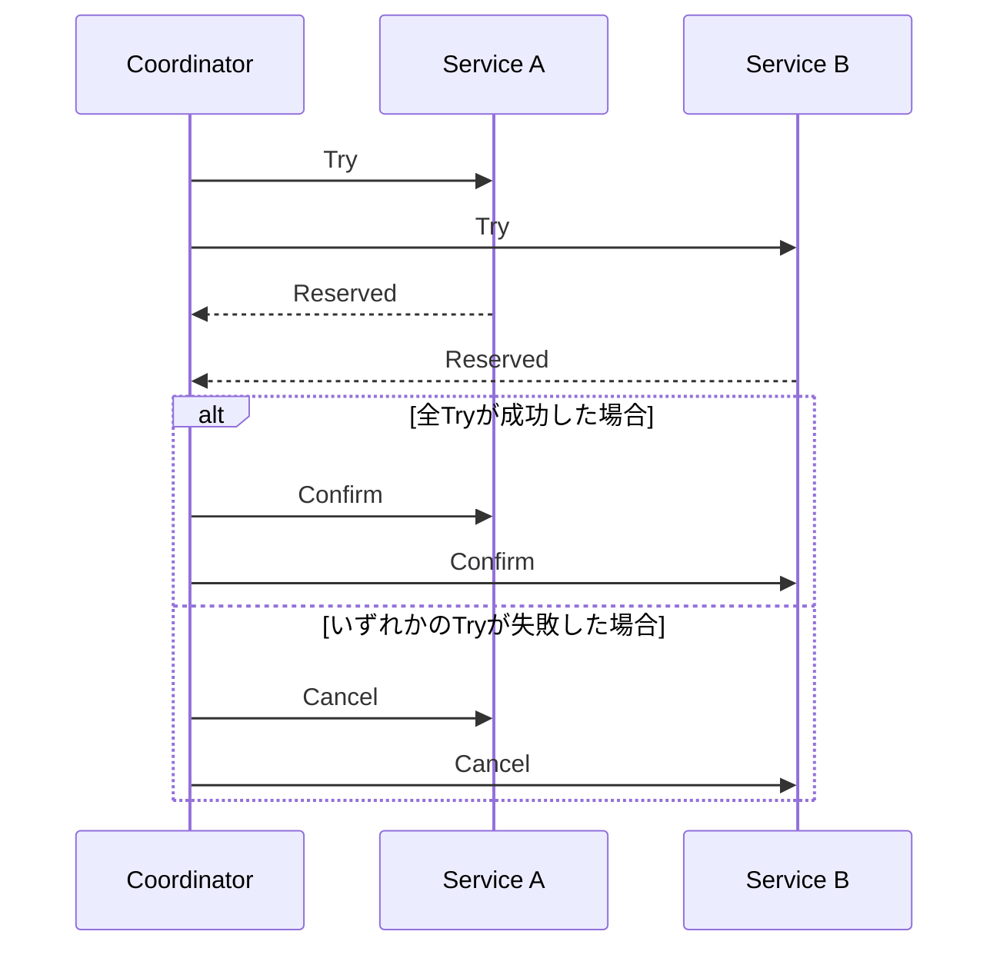

```java
// TCC パターンの実装例
public interface PaymentTccService {
    // Try: 与信枠を仮押さえ
    ReservationResult tryReserveCredit(String customerId, int amount);

    // Confirm: 仮押さえを確定して実際に引き落とし
    void confirmReserveCredit(String reservationId);

    // Cancel: 仮押さえを解放
    void cancelReserveCredit(String reservationId);
}

public class PaymentTccServiceImpl implements PaymentTccService {

    @Transactional
    public ReservationResult tryReserveCredit(String customerId, int amount) {
        Customer customer = customerRepo.findById(customerId);
        if (customer.getAvailableCredit() < amount) {
            throw new InsufficientCreditException();
        }
        // 仮押さえ（中間状態）
        CreditReservation reservation = new CreditReservation(
            customerId, amount, ReservationStatus.RESERVED);
        reservationRepo.save(reservation);
        customer.setReservedCredit(customer.getReservedCredit() + amount);
        customerRepo.save(customer);
        return new ReservationResult(reservation.getId());
    }

    @Transactional
    public void confirmReserveCredit(String reservationId) {
        CreditReservation reservation = reservationRepo.findById(reservationId);
        reservation.setStatus(ReservationStatus.CONFIRMED);
        Customer customer = customerRepo.findById(reservation.getCustomerId());
        customer.setBalance(customer.getBalance() - reservation.getAmount());
        customer.setReservedCredit(customer.getReservedCredit() - reservation.getAmount());
        reservationRepo.save(reservation);
        customerRepo.save(customer);
    }

    @Transactional
    public void cancelReserveCredit(String reservationId) {
        CreditReservation reservation = reservationRepo.findById(reservationId);
        reservation.setStatus(ReservationStatus.CANCELLED);
        Customer customer = customerRepo.findById(reservation.getCustomerId());
        customer.setReservedCredit(customer.getReservedCredit() - reservation.getAmount());
        reservationRepo.save(reservation);
        customerRepo.save(customer);
    }
}
```

**TCCの適用条件:**
- リソースが「予約」という概念でモデリングできること（航空券の座席予約、在庫確保、与信枠確保など）
- Try/Confirm/Cancelの3操作が全て冪等に設計可能であること
- 中間状態（予約済み・未確定）がビジネス的に許容されること

### 5.2 ScalarDBとの統合パターン

**パターン1: 各フェーズのローカルトランザクションをScalarDBで保護**

```java
// Try フェーズ - ScalarDBで異種DB間のローカルトランザクションを保証
public ReservationResult tryReserveInventory(String itemId, int quantity) {
    DistributedTransaction tx = scalarDbTxManager.start();
    try {
        // Cassandra上の在庫テーブルを読み取り
        Optional<Result> inventoryResult = tx.get(inventoryGet);
        int available = inventoryResult.get().getInt("available_quantity");

        if (available < quantity) {
            tx.abort();
            throw new InsufficientStockException();
        }

        // Cassandraの在庫を仮押さえ状態に更新
        tx.put(Put.newBuilder()
            .namespace("inventory").table("stock")
            .partitionKey(Key.ofText("item_id", itemId))
            .intValue("reserved_quantity",
                inventoryResult.get().getInt("reserved_quantity") + quantity)
            .build());

        // MySQLの予約テーブルに記録
        tx.put(Put.newBuilder()
            .namespace("reservation").table("reservations")
            .partitionKey(Key.ofText("reservation_id", reservationId))
            .textValue("status", "RESERVED")
            .intValue("quantity", quantity)
            .build());

        tx.commit();
        return new ReservationResult(reservationId);
    } catch (Exception e) {
        tx.abort();
        throw e;
    }
}
```

**パターン2: ScalarDB 2PCでTCCを代替**

ScalarDBの2PCインターフェースは、本質的にTCCパターンのTry-Confirmフローに類似している。ScalarDBの`prepare()`がTryに、`commit()`がConfirmに、`rollback()`がCancelに相当する。

```java
// ScalarDB 2PCがTCCの役割を果たす
TwoPhaseCommitTransaction tx = txManager.start();
String txId = tx.getId();

// 各サービスで操作を実行（= TCCのTryに相当する準備操作）
tx.put(orderPut);                                    // Order Service
inventoryService.reserveStock(txId, itemId, qty);     // Inventory Service
paymentService.reserveCredit(txId, customerId, amount); // Payment Service

// Prepare = TCCのTry完了確認に相当
tx.prepare();
// 各参加者もprepare()

// Commit = TCCのConfirmに相当
tx.commit();
// 失敗時は自動的にrollback() = TCCのCancelに相当
```

**ScalarDBによるTCCへの影響:**

| 観点 | TCCのみ | ScalarDB + TCC |
|---|---|---|
| 中間状態管理 | アプリが全て設計 | 各フェーズ内のACIDをScalarDBが保証 |
| 冪等性の実装 | 開発者が全て実装 | ScalarDBのトランザクションIDで一意性保証 |
| 異種DB | DB毎に個別実装 | ScalarDBの抽象化で統一的に処理 |
| タイムアウト処理 | アプリ側で実装 | ScalarDBのトランザクション有効期限機能 |
| 代替可能性 | - | 2PCインターフェースでTCC自体が不要になるケースあり |

---

## 6. CQRSパターンとScalarDBの役割

### 6.1 基本概念

CQRSは、データの書き込み（Command）と読み取り（Query）を分離するアーキテクチャパターンである。Martin Fowlerが普及させた概念で、Greg Youngにより体系化された。

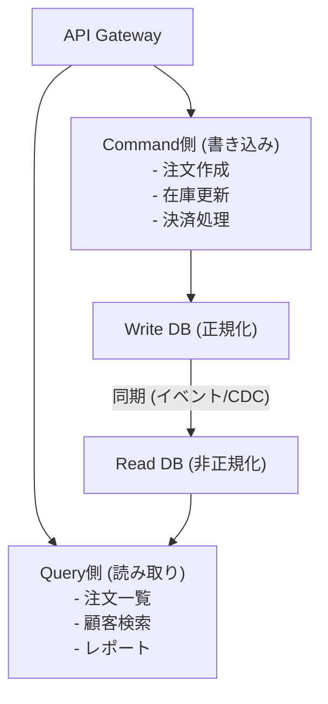

**利点:**
- 読み取りと書き込みを独立にスケーリング可能
- 各側に最適なデータモデルとDBを選択可能
- 書き込み側は正規化された厳密なモデル、読み取り側はクエリに最適化された非正規化モデル
- 関心の分離による保守性向上

**課題:**
- 結果整合性の受け入れが必要
- システムの複雑性が増加
- 同期メカニズムの実装と運用

### 6.2 イベントソーシングとの組み合わせ

CQRSはイベントソーシングと組み合わせることが多い。Command側でイベントを生成・永続化し、そのイベントを使ってQuery側のリードモデルを構築する。

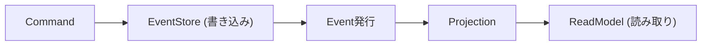

### 6.3 ScalarDBがコマンド側/クエリ側で果たす役割

**コマンド側（Write側）でのScalarDBの役割:**

1. **異種DB間のACIDトランザクション**: ビジネスデータの更新とイベントの記録を、異なるDBに分散していても単一トランザクションで実行可能

```java
// Command側: ScalarDBによる異種DB間トランザクション
DistributedTransaction tx = scalarDbTxManager.start();
try {
    // PostgreSQLの注文テーブルを更新
    tx.put(Put.newBuilder()
        .namespace("orders_db").table("orders")
        .partitionKey(Key.ofText("order_id", orderId))
        .textValue("status", "CONFIRMED")
        .build());

    // Cassandraのイベントストアにイベントを記録
    tx.put(Put.newBuilder()
        .namespace("event_store").table("events")
        .partitionKey(Key.ofText("aggregate_id", orderId))
        .clusteringKey(Key.ofBigInt("event_sequence", nextSeq))
        .textValue("event_type", "ORDER_CONFIRMED")
        .textValue("payload", eventPayloadJson)
        .build());

    tx.commit(); // 両方のDBへの書き込みがACIDで保証される
} catch (Exception e) {
    tx.abort();
}
```

2. **Multi-storageトランザクション**: ScalarDBのMulti-storage Transaction機能により、名前空間ごとに異なるストレージバックエンドを透過的に使用できる

**クエリ側（Read側）でのScalarDBの役割:**

ScalarDBは、**ScalarDB Analytics with PostgreSQL**を通じてクエリ側で強力な機能を提供する。

1. **統一されたリードビュー**: ScalarDB Analyticsは、複数の異種データベースにまたがるデータを、PostgreSQLのFDW（Foreign Data Wrapper）を使って単一の読み取り可能なビューとして提供する
2. **ETL不要のクロスDB分析クエリ**: ETLパイプラインを構築することなく、ScalarDBが管理するデータを直接読み取れる
3. **Read-Committedの一貫性**: ScalarDB Analyticsは読み取り一貫性を保証したビューを提供する

```sql
-- ScalarDB Analytics: 複数DB横断クエリ（PostgreSQL SQL）
-- orders(Cassandra)とcustomers(MySQL)を結合
SELECT
    c.customer_name,
    o.order_id,
    o.total_amount,
    o.status
FROM customer_service.customers c
JOIN order_service.orders o
    ON c.customer_id = o.customer_id
WHERE o.status = 'CONFIRMED'
ORDER BY o.created_at DESC;
```

**CQRSにおけるScalarDBの全体像:**

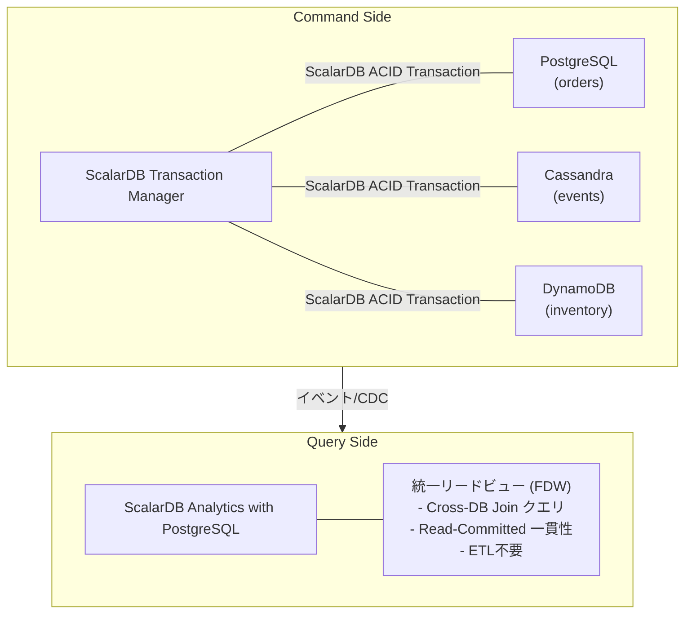

---

## 7. イベントソーシングとScalarDBとの統合

### 7.1 イベントストアの設計

イベントソーシングは、エンティティの状態を「状態変更イベントの列」として永続化するパターンである。現在の状態は、イベントを順に再生（replay）することで復元される。

イベントストアのデータモデル:

| aggregate_id | seq_no | event_type      | payload         |
|--------------|--------|-----------------|-----------------|
| order-001    | 1      | OrderCreated    | {customer:..}   |
| order-001    | 2      | ItemAdded       | {item:..}       |
| order-001    | 3      | PaymentReceived | {amount:..}     |
| order-001    | 4      | OrderShipped    | {tracking:..}   |

現在の状態 = `replay(event_1, event_2, event_3, event_4)`

**イベントストアの設計要件:**
- **追記専用（Append-only）**: イベントは不変であり、削除・更新しない
- **順序保証**: 同一アグリゲート内のイベント順序が保証される
- **楽観的排他制御**: 同一アグリゲートへの並行書き込みを検出する
- **イベントの購読**: 新規イベントをリアルタイムで購読できる

### 7.2 スナップショット

イベント数が増加すると、全イベントの再生にコストがかかる。スナップショットは、ある時点の状態を保存し、そこからの差分イベントのみを再生する最適化手法である。

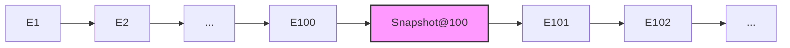

状態復元:
- スナップショットなし: `replay(E1, E2, ..., E102)` --> 102イベント再生
- スナップショットあり: `load(Snapshot@100)` + `replay(E101, E102)` --> 2イベント再生

```java
// スナップショット戦略の例
public class SnapshotStrategy {
    private static final int SNAPSHOT_INTERVAL = 100;

    public Order loadOrder(String orderId) {
        // 最新のスナップショットを取得
        Optional<Snapshot> snapshot = snapshotStore.getLatest(orderId);

        Order order;
        long fromSequence;
        if (snapshot.isPresent()) {
            order = snapshot.get().getState();
            fromSequence = snapshot.get().getSequenceNumber() + 1;
        } else {
            order = new Order();
            fromSequence = 0;
        }

        // スナップショット以降のイベントを再生
        List<Event> events = eventStore.getEvents(orderId, fromSequence);
        for (Event event : events) {
            order.apply(event);
        }

        // 必要に応じて新しいスナップショットを作成
        if (events.size() >= SNAPSHOT_INTERVAL) {
            snapshotStore.save(new Snapshot(orderId, order,
                events.get(events.size() - 1).getSequenceNumber()));
        }

        return order;
    }
}
```

### 7.3 ScalarDBとの統合可能性

ScalarDBのデータモデル（パーティションキー + クラスタリングキー）は、イベントストアの要件に適合する。

```java
// ScalarDBによるイベントストア実装
public class ScalarDbEventStore {
    private final DistributedTransactionManager txManager;

    // イベントの追加（楽観的排他制御付き）
    public void appendEvent(String aggregateId, long expectedVersion,
                           DomainEvent event) {
        DistributedTransaction tx = txManager.start();
        try {
            // 現在のバージョンを確認（楽観的排他制御）
            Optional<Result> current = tx.get(Get.newBuilder()
                .namespace("event_sourcing").table("aggregates")
                .partitionKey(Key.ofText("aggregate_id", aggregateId))
                .build());

            long currentVersion = current.map(r -> r.getBigInt("version")).orElse(0L);
            if (currentVersion != expectedVersion) {
                tx.abort();
                throw new OptimisticLockException(
                    "Expected version " + expectedVersion +
                    " but was " + currentVersion);
            }

            // イベントを追記
            tx.put(Put.newBuilder()
                .namespace("event_sourcing").table("events")
                .partitionKey(Key.ofText("aggregate_id", aggregateId))
                .clusteringKey(Key.ofBigInt("sequence_number", expectedVersion + 1))
                .textValue("event_type", event.getType())
                .textValue("payload", serialize(event))
                .bigIntValue("timestamp", System.currentTimeMillis())
                .build());

            // バージョンを更新
            tx.put(Put.newBuilder()
                .namespace("event_sourcing").table("aggregates")
                .partitionKey(Key.ofText("aggregate_id", aggregateId))
                .bigIntValue("version", expectedVersion + 1)
                .build());

            tx.commit();
        } catch (Exception e) {
            tx.abort();
            throw e;
        }
    }

    // スナップショットの保存（イベントと同一トランザクション内で可能）
    public void saveSnapshot(String aggregateId, long version,
                            Object state) {
        DistributedTransaction tx = txManager.start();
        try {
            tx.put(Put.newBuilder()
                .namespace("event_sourcing").table("snapshots")
                .partitionKey(Key.ofText("aggregate_id", aggregateId))
                .clusteringKey(Key.ofBigInt("version", version))
                .textValue("state", serialize(state))
                .build());
            tx.commit();
        } catch (Exception e) {
            tx.abort();
            throw e;
        }
    }
}
```

**ScalarDBが入ることでの利点:**

1. **異種DBをまたいだイベントストア**: イベントストア（例: Cassandra）とスナップショットストア（例: MySQL）を異なるDBに配置しつつ、ACIDトランザクションで一貫性を保証できる
2. **イベント発行とビジネスデータ更新の原子性**: イベントの追記とリードモデルの更新を、異なるDBに対しても単一トランザクションで実行可能（Outboxパターンとの組み合わせ）
3. **クロスサービスイベントストア**: ScalarDBの2PCインターフェースを使い、複数サービスのイベントストアにまたがるACIDトランザクションを実現可能
4. **分析クエリ**: ScalarDB Analyticsにより、イベントストアに対するクロスDB分析クエリをETLなしで実行可能

---

## 8. Outboxパターン

### 8.1 トランザクショナルアウトボックス

Outboxパターンは、ビジネスデータの更新とイベント/メッセージの発行を確実に一貫して行うためのパターンである。「メッセージブローカーへの発行」と「DBへの書き込み」は本来異なるシステムへの操作であるため、両方を原子的に行うことが困難という問題（二重書き込み問題）を解決する。

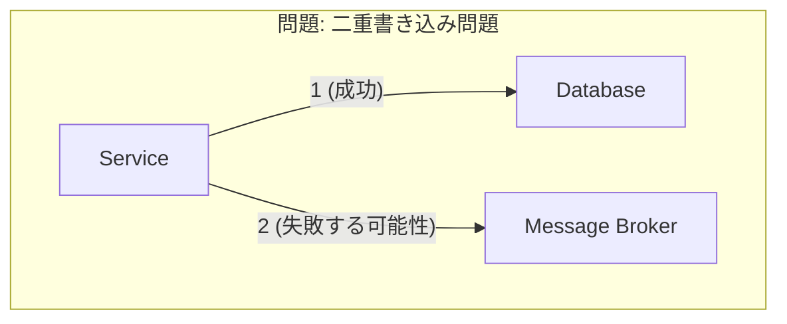

> 1と2を原子的に行えない

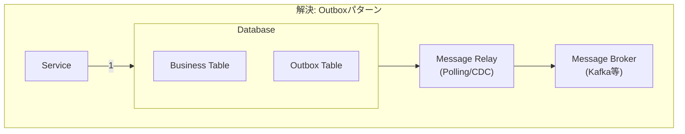

> 同一DBトランザクション内でビジネスデータとイベントを書き、Message RelayがOutboxテーブルを監視してメッセージブローカーへ転送する

```java
// Outboxパターンの基本実装
@Transactional
public void placeOrder(OrderRequest request) {
    // ビジネスデータの保存
    Order order = new Order(request);
    orderRepository.save(order);

    // Outboxテーブルにイベントを保存（同一トランザクション内）
    OutboxEvent event = new OutboxEvent(
        UUID.randomUUID().toString(),
        "OrderCreated",
        "Order",
        order.getId(),
        toJson(new OrderCreatedEvent(order)),
        Instant.now()
    );
    outboxRepository.save(event);
    // -> DBトランザクションのコミットで両方が原子的に永続化
}
```

### 8.2 Change Data Capture（CDC）

CDCは、データベースの変更ログ（WAL/binlog）を監視して、変更をリアルタイムでキャプチャする手法である。Outboxテーブルの変更をCDCでキャプチャし、メッセージブローカーに転送する。

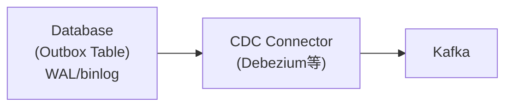

**CDCの利点（ポーリングとの比較）:**
- DB負荷が低い（WALを直接読むため追加クエリ不要）
- リアルタイム性が高い（ほぼゼロレイテンシ）
- Outboxテーブルの肥大化を防げる

**CDCの課題:**
- 運用の複雑性（Debezium等の追加インフラ管理）
- DBのWALフォーマットへの依存
- 障害復旧時のオフセット管理

### 8.3 ScalarDBでのOutbox実装

ScalarDBを使用したOutboxパターンの実装は、特に異種DB環境で大きな利点を発揮する。

**パターン1: ScalarDBトランザクションでOutboxテーブルへの書き込みを保証**

```java
// ScalarDBによるOutboxパターン実装
public class ScalarDbOutboxOrderService {
    private final DistributedTransactionManager txManager;

    public void placeOrder(OrderRequest request) {
        DistributedTransaction tx = txManager.start();
        try {
            String orderId = UUID.randomUUID().toString();

            // ビジネスデータの保存（例: Cassandraの注文テーブル）
            tx.put(Put.newBuilder()
                .namespace("order_service").table("orders")
                .partitionKey(Key.ofText("order_id", orderId))
                .textValue("customer_id", request.getCustomerId())
                .intValue("total_amount", request.getTotalAmount())
                .textValue("status", "CREATED")
                .build());

            // Outboxテーブルへの書き込み（例: 同じCassandraまたは別のMySQL）
            tx.put(Put.newBuilder()
                .namespace("outbox").table("outbox_events")
                .partitionKey(Key.ofText("event_id", UUID.randomUUID().toString()))
                .textValue("aggregate_type", "Order")
                .textValue("aggregate_id", orderId)
                .textValue("event_type", "OrderCreated")
                .textValue("payload", toJson(request))
                .bigIntValue("created_at", System.currentTimeMillis())
                .booleanValue("published", false)
                .build());

            tx.commit();
            // -> ビジネスデータとOutboxイベントが原子的にコミットされる
            //   たとえ異なるDBに格納されていても
        } catch (Exception e) {
            tx.abort();
            throw e;
        }
    }
}
```

**パターン2: ScalarDB 2PCとOutboxの組み合わせ（マイクロサービス間）**

```java
// Coordinatorサービス: 複数サービスの操作 + Outboxを1トランザクションで
public void processOrderFlow(OrderFlowRequest request) {
    TwoPhaseCommitTransaction tx = txManager.start();
    String txId = tx.getId();

    try {
        // Order Service: 注文作成
        tx.put(orderPut);

        // Payment Service: 決済処理（リモート参加）
        paymentService.processPayment(txId, request.getPaymentInfo());

        // Outboxテーブル: 注文完了イベントを記録
        tx.put(Put.newBuilder()
            .namespace("outbox").table("outbox_events")
            .partitionKey(Key.ofText("event_id", eventId))
            .textValue("event_type", "OrderFlowCompleted")
            .textValue("payload", toJson(orderFlowEvent))
            .build());

        tx.prepare();
        tx.validate();
        tx.commit();
        // -> 注文作成 + 決済処理 + Outboxイベント記録が全て原子的
    } catch (Exception e) {
        tx.rollback();
        throw e;
    }
}
```

**ScalarDBがOutboxパターンにもたらす利点:**

| 観点 | 従来のOutbox | ScalarDB + Outbox |
|---|---|---|
| ビジネスデータとOutboxの原子性 | 同一DB内でのみ保証 | 異種DB間でも保証 |
| Outboxテーブルの配置 | ビジネスデータと同一DB | 任意のDBに配置可能 |
| マイクロサービス間 | 各サービスが独立にOutbox | 2PCで複数サービスのOutboxを統合可能 |
| CDCとの組み合わせ | DB固有のCDC設定が必要 | ScalarDBのメタデータを含むWALをCDCで監視（ScalarDB固有の考慮が必要） |
| 二重書き込み問題 | 同一DB内でのみ解決 | 異種DB間でも解決 |

**注意点:**
- ScalarDBはレコードにメタデータ（トランザクションID、バージョン、状態）を付加するため、CDCでOutboxテーブルを監視する場合は、ScalarDBのメタデータを考慮したフィルタリングが必要である
- ScalarDB経由でないDBの直接操作は、トランザクションの整合性を壊す可能性がある

**CDCとScalarDBメタデータに関する重要な注意事項**:

ScalarDBのConsensus Commitメタデータ（`tx_id`, `tx_state`, `tx_version`, `tx_prepared_at`, `tx_committed_at`, `before_*`カラム）は、CDCツール（Debezium等）が捕捉するWALイベントに含まれる。

- **PREPARED状態の誤認リスク**: メタデータを正しくフィルタリングしないと、PREPARED状態（未コミット）のレコード変更を「確定済み」と誤認し、下流システムにダーティデータが伝搬する
- **tx_state値によるフィルタリング必須**: `tx_state = 3`（COMMITTED）のレコードのみを下流に伝搬するフィルタを必ず設定する
- **3.17 Transaction Metadata Decoupling使用時**: メタデータが別テーブルに分離されるため、CDC対象テーブルの構造が変わる。CDCコネクタの設定を再確認すること

---

## 9. 各パターンの比較サマリ

### 9.1 ScalarDBなし/ありの比較

| パターン | ScalarDBなし | ScalarDBあり |
|---|---|---|
| **ローカルTx** | DB固有のTx機能に依存 | 統一APIで異種DB間ACIDを実現 |
| **2PC** | XA対応RDBMSのみ（NoSQL不可、異種RDBMS間は実装差異によるリスク大）、ブロッキング、TM障害時は手動回復が必要 | XA不要、任意のDB組み合わせに対応、OCC採用、Lazy Recoveryで自動回復 |
| **Saga** | 結果整合性、補償Tx必須 | 2PCで代替可能、または各ステップ内を強化 |
| **TCC** | アプリが全状態管理 | 各フェーズのACIDを保証、2PCで代替可能 |
| **CQRS** | Write/Read DB間の同期が課題 | Command側: 異種DB間ACID、Query側: Analytics |
| **イベントソーシング** | 単一DB内でのイベント管理 | 異種DBにまたがるイベントストア実装が可能 |
| **Outbox** | 同一DB内でのみ原子性保証 | 異種DB間のOutbox原子性を保証 |

### 9.2 ScalarDBの核心的な価値

ScalarDBがマイクロサービスのトランザクションパターンにもたらす最も根本的な価値は、**データベースの異種性を抽象化し、異種DB間でACIDトランザクションを提供する**ことにある。

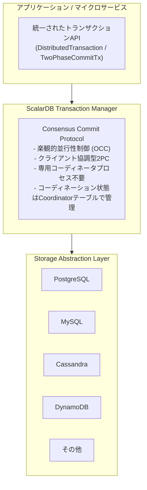

### 9.3 ScalarDB 3.17 パフォーマンス最適化オプション

ScalarDB 3.17では、トランザクションパフォーマンスを向上させる複数のオプションが利用可能である。

| オプション | 設定キー | 効果 |
|---|---|---|
| **非同期コミット** | `async_commit.enabled=true` | コミットの非同期化でレイテンシ削減 |
| **非同期ロールバック** | `async_rollback.enabled=true` | アボート時のレイテンシ削減 |
| **グループコミット** | `coordinator.group_commit.enabled=true` | 複数Txのコミットをバッチ化しスループット向上 |
| **並列実行** | `parallel_executor_count=128` | 並列実行スレッド数の調整 |

グループコミットは、複数のトランザクションのCoordinatorテーブルへの書き込みをバッチ化することで、書き込みスループットを大幅に向上させる。VLDB 2023論文では、MariaDBバックエンドで最大87%、PostgreSQLバックエンドで最大48%の性能向上が報告されている。

> **制約**: Group Commitは2PC Interfaceとの併用不可。2PCトランザクションを使用するサービスではGroup Commitを有効化しないこと（公式ドキュメント明記）。

**ScalarDB 3.17 クライアントサイド最適化オプション:**

ScalarDB 3.17では、クライアント側でのトランザクション最適化機能も追加されている。

| オプション | 設定キー | 効果 |
|---|---|---|
| **Piggyback Begin** (デフォルトOFF) | `scalar.db.cluster.client.piggyback_begin.enabled` | トランザクション開始を最初のCRUD操作に相乗りさせ、ラウンドトリップを削減 |
| **Write Buffering** | `scalar.db.cluster.client.write_buffering.enabled` | 書き込み操作をクライアント側でバッファリングし、prepare時にまとめて送信することでラウンドトリップを削減 |
| **Batch Operations API** | `transaction.batch()` | 複数のGet/Put/Delete操作を1回のRPC呼出しでまとめて実行 |

> **参照**: これらのクライアントサイド最適化の詳細（設計思想、適用条件、パフォーマンス特性）については [`13_scalardb_317_deep_dive.md`](./13_scalardb_317_deep_dive.md) を参照。

### 9.4 ScalarDB導入の判断基準

ScalarDBの導入が特に効果的なケース:
1. **ポリグロットパーシステンス**: 複数種類のDBを使用しており、それらの間でトランザクション整合性が必要な場合
2. **マイクロサービス間の強整合性**: Sagaの結果整合性では不十分で、サービス間でACIDが必要な場合（2PCインターフェース）
3. **NoSQLへのACID付与**: CassandraやDynamoDBに完全なACIDトランザクション機能を追加したい場合
4. **クロスDB分析**: 複数DBのデータを統合的に分析する必要がある場合（ScalarDB Analytics）

ScalarDB導入時の考慮事項:
- 全てのデータアクセスはScalarDB経由で行う必要がある（直接DBアクセスとの混在は整合性を損なう）
- ScalarDBのメタデータがレコードに付加されるため、ストレージオーバーヘッドが発生する
- OCCベースのため、書き込み競合が頻発するワークロードではリトライが増加する可能性がある

### 2PC適用の制限ガイドライン

ScalarDB 2PCの利便性は高いが、過度な適用はマイクロサービスの独立性を損ない「分散モノリス」を招くリスクがある。以下のガイドラインに従うこと。

**原則: デフォルトは結果整合性（Saga/イベント駆動）とし、2PCは例外的な選択とする**

| 項目 | ガイドライン |
|------|------------|
| **適用許可条件（全て満たすこと）** | (1) ビジネス上、一時的な不整合が法規制・金銭的損失に直結する (2) 参加サービスが3つ以下 (3) 参加サービスが同一チーム内で管理されている (4) トランザクション実行時間が100ms以下と想定される |
| **必須対策** | タイムアウト値の明示的設定、Circuit Breakerの適用、2PC失敗時のフォールバック戦略、2PCトランザクション専用の監視ダッシュボード |
| **回避すべきケース** | チーム間をまたぐサービス間の2PC、3つ以上のサービスが参加する2PC、レイテンシ要件が厳しくないバッチ処理での2PC |

**2PC過度適用のリスク（分散モノリス化）**:
- ランタイム結合: 全参加サービスが同時に稼働していなければトランザクション失敗
- デプロイメント結合: ScalarDB ClusterやAPIの変更が全参加サービスに影響
- 障害の伝播: 1サービスの遅延が2PC prepare/commit全体を遅延させる
- チーム間の協調コスト増加: Coordinator/Participant関係がチーム間の依存を生む

---

## 参考情報

- [ScalarDB Consensus Commit Protocol](https://scalardb.scalar-labs.com/docs/latest/consensus-commit/)
- [ScalarDB Two-Phase Commit Transactions](https://scalardb.scalar-labs.com/docs/3.13/two-phase-commit-transactions/)
- [ScalarDB Microservice Transaction Sample](https://scalardb.scalar-labs.com/docs/3.13/scalardb-samples/microservice-transaction-sample/)
- [ScalarDB Multi-Storage Transactions](https://scalardb.scalar-labs.com/docs/latest/multi-storage-transactions/)
- [ScalarDB Analytics Design](https://scalardb.scalar-labs.com/docs/latest/scalardb-analytics/design/)
- [ScalarDB: Universal Transaction Manager for Polystores (VLDB'23)](https://www.vldb.org/pvldb/vol16/p3768-yamada.pdf)
- [ScalarDB GitHub Repository](https://github.com/scalar-labs/scalardb)
- [ScalarDB Design Document](https://scalardb.scalar-labs.com/docs/3.5/design/)
- [Saga Pattern - microservices.io](https://microservices.io/patterns/data/saga.html)
- [Saga Design Pattern - Azure Architecture](https://learn.microsoft.com/en-us/azure/architecture/patterns/saga)
- [Saga Pattern Demystified - ByteByteGo](https://blog.bytebytego.com/p/saga-pattern-demystified-orchestration)
- [CQRS Pattern - Azure Architecture](https://learn.microsoft.com/en-us/azure/architecture/patterns/cqrs)
- [Transactional Outbox Pattern - microservices.io](https://microservices.io/patterns/data/transactional-outbox.html)
- [TCC Transaction Protocol - Oracle](https://docs.oracle.com/en/database/oracle/transaction-manager-for-microservices/24.2/tmmdg/tcc-transaction-model.html)
