# Transaction Model Investigation

## 1. Intra-Service Transactions (ScalarDB Consensus Commit)

### 1.1 Local Transactions

Intra-microservice transactions are ACID transactions against a single database. In the "Database-per-Service" pattern where each microservice owns its own database, intra-service operations can be completed with conventional local transactions.

```java
// Conventional local transaction (Spring example)
@Transactional
public void placeOrder(Order order) {
    orderRepository.save(order);
    orderItemRepository.saveAll(order.getItems());
    // ACID is guaranteed since it's within the same DB
}
```

**Characteristics:**
- ACID properties are fully guaranteed within a single database
- Deadlock detection, rollback, etc. are handled by the DB engine
- Good performance and simple implementation

### 1.2 Database-Specific Transaction Features

Each database provides its own transaction features.

| Database | Transaction Characteristics |
|---|---|
| PostgreSQL/MySQL | Full ACID, MVCC, various isolation levels |
| Cassandra | Lightweight Transactions (LWT), partition-level atomicity |
| DynamoDB | Limited transactions via TransactWriteItems/TransactGetItems |
| MongoDB | Multi-document transactions supported from 4.0 onwards |

### 1.3 Unified Transactions with ScalarDB Consensus Commit

ScalarDB provides a **storage abstraction layer** and achieves ACID transactions without relying on each database's native transaction features. ScalarDB's Consensus Commit protocol manages transactions independently without using the database's native transaction features. This enables the following.

- ACID transactions become available even on DBs that do not natively support full ACID transactions, such as Cassandra and DynamoDB
- A unified transaction API can be used across different DBs
- Application code is freed from DB-specific constraints

```java
// Unified transaction API with ScalarDB
DistributedTransaction tx = transactionManager.start();
try {
    // Same API for both Cassandra and MySQL
    tx.put(Put.newBuilder()
        .namespace("order_service")
        .table("orders")
        .partitionKey(Key.ofText("id", orderId))
        .intValue("amount", 1000)
        .build());
    tx.commit();
} catch (Exception e) {
    tx.abort();
}
```

**Technical characteristics of ScalarDB Consensus Commit:**
- **Optimistic Concurrency Control (OCC)**: Uses OCC instead of locks. During the Read phase, data is copied to a local workspace without locking, and conflicts are detected during the Validation phase. This minimizes blocking
- **Client-coordinated**: Architecture that does not require a dedicated coordinator process (coordination state is managed in a Coordinator table on the database)
- **Isolation levels**: Supports Snapshot Isolation (SI) and Serializable
- **DB-independent**: Only requires "linearizable conditional write" from the underlying DB

---

## 2. Inter-Service Transactions (ScalarDB 2PC Interface)

### 2.1 Distributed Transaction Challenges

In microservices architecture, each service has an independent database, creating fundamental difficulties for transactions spanning across services.

**Main challenges:**
- **Network partitioning**: Inter-service communication traverses unreliable networks. Per the CAP theorem, consistency and availability cannot both be fully satisfied while maintaining partition tolerance
- **Partial failures**: A state where only some services fail while others succeed
- **Latency**: Performance degradation due to distributed locking and coordination
- **Increased coupling**: Strong coupling between services undermines the benefits of independent deployment in microservices
- **Data consistency**: Trade-off between Eventual Consistency and Strong Consistency

### 2.2 Inter-Service Transactions with ScalarDB 2PC Interface

ScalarDB's 2PC implementation is fundamentally different from traditional XA-based 2PC.

```java
// ScalarDB 2PC Interface - Coordinator Service
TwoPhaseCommitTransactionManager txManager =
    TransactionFactory.create(configPath)
        .getTwoPhaseCommitTransactionManager();

TwoPhaseCommitTransaction tx = txManager.start();
String txId = tx.getId(); // Get transaction ID

// Local operations
tx.put(/* Order Service operations */);

// Request other services to participate by passing txId (via gRPC, etc.)
customerServiceClient.processPayment(txId, customerId, amount);

// Prepare on all participants
tx.prepare();
// Participant services also call prepare()

// Validate on all participants (required when using SERIALIZABLE + EXTRA_READ strategy. Has no effect otherwise)
tx.validate();

// Commit
tx.commit();
```

```java
// ScalarDB 2PC Interface - Participant Service
public void processPayment(String txId, String customerId, int amount) {
    TwoPhaseCommitTransaction tx = txManager.join(txId);

    // Operations on Customer DB
    tx.put(/* Customer Service operations */);

    // prepare/validate/commit are controlled by Coordinator (validate is required only when using SERIALIZABLE + EXTRA_READ strategy. Has no effect otherwise)
    tx.prepare();
    tx.validate();
    tx.commit();
}
```

**Key features of ScalarDB 2PC:**
1. **Database-independent**: Does not depend on each database's XA support
2. **No dedicated coordinator process required**: Architecture that does not require a dedicated coordinator process (coordination state is managed in a Coordinator table on the database)
3. **Optimistic concurrency control**: Minimizes blocking
4. **Transactions across heterogeneous DBs**: Can execute 2PC across different DBs such as Cassandra and MySQL

---

## 3. Limitations of 2PC and Improvements by ScalarDB

### 3.1 Limitations of Traditional 2PC (X/Open XA)

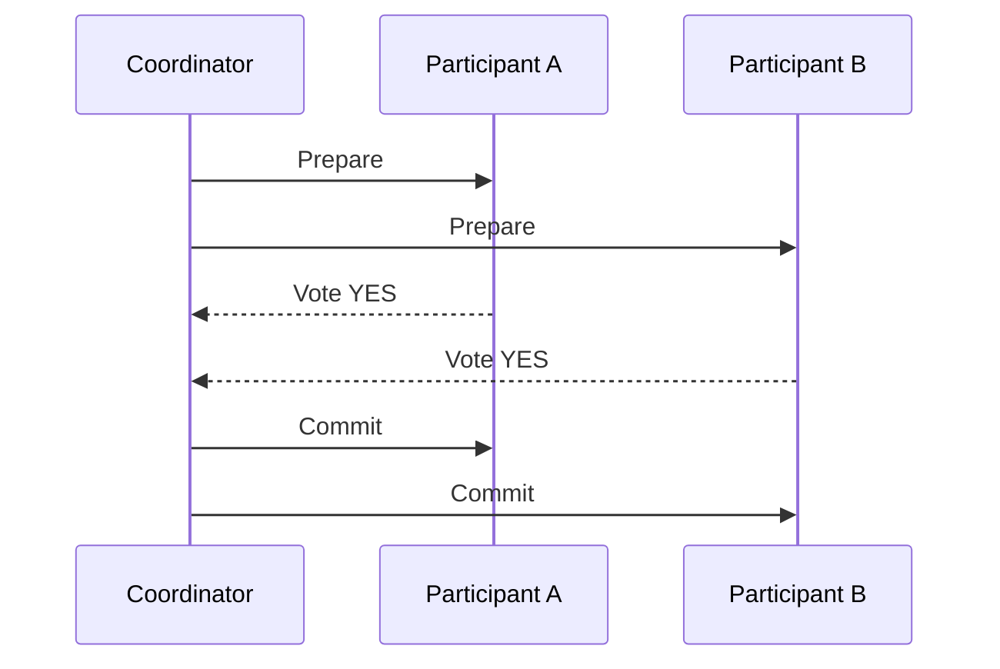

**Limitations:**
- **Blocking protocol**: If the Coordinator fails after Prepare, Participants continue waiting while holding locks
- **Single point of failure**: If the Coordinator goes down, the entire transaction halts
- **Performance**: Lock holding time is long, reducing throughput
- **Reduced availability**: Transactions cannot begin unless all participants are available
- **DB-dependent**: Cannot be used with databases that do not support the XA protocol (Cassandra, DynamoDB, etc.)

#### 3.1.1 Database-Specific XA Implementation Constraints (Detailed Investigation Results)

**DBs that support / do not support XA:**

| Category | Database | XA Support | Notes |
|---|---|---|---|
| **RDBMS** | MySQL (InnoDB) | Yes | InnoDB only. MyISAM etc. not supported |
| | PostgreSQL | Yes | Via `PREPARE TRANSACTION`. `max_prepared_transactions` setting required |
| | Oracle | Yes | Most mature implementation |
| | SQL Server | Yes | Via MSDTC |
| | MariaDB | Yes | MySQL-compatible but with unique constraints |
| **NewSQL** | CockroachDB / YugabyteDB | No | Own distributed transactions |
| **NoSQL** | Cassandra / DynamoDB / MongoDB / Cosmos DB / Redis | No | XA not supported. Only proprietary limited transaction features |

**MySQL-specific constraints (from official documentation):**

| Constraint | Severity | Details |
|---|---|---|
| InnoDB only | High | XA is only supported on the InnoDB storage engine |
| Replication filter incompatible | High | Combining XA transactions with replication filters is not supported. Filters may generate empty XA transactions that halt replicas |
| Unsafe with Statement-Based Replication | High | Prepare order reversal of concurrent XA transactions may cause deadlocks. `binlog_format=ROW` required |
| Binary log non-resilience before 8.0.30 | High | Abnormal termination during XA PREPARE/COMMIT/ROLLBACK can cause inconsistency between binary log and storage engine |
| Binary log splitting | Medium | XA PREPARE and XA COMMIT may end up in different binary log files |
| XA START JOIN/RESUME not implemented | Medium | Syntax is recognized but has no actual effect |

**PostgreSQL-specific issues:**

| Issue | Severity | Details |
|---|---|---|
| VACUUM obstruction | High | Long-remaining prepared transactions prevent VACUUM from reclaiming storage; in worst case, DB shuts down to prevent Transaction ID Wraparound |
| Orphaned transactions | High | Prepared transactions orphaned by TM failure continue holding locks. Not resolved by DB restart; manual `ROLLBACK PREPARED` required |
| Long-held locks | High | Prepared transactions continue holding locks, increasing blocking and deadlock risk for other sessions |
| max_prepared_transactions setting | Medium | Default 0 (disabled). Heuristic issues occur if not set higher than `max_connections` |
| Transaction interleaving not implemented | Medium | Warning generated by JDBC driver. Workaround with `supportsTmJoin=false` required |

> **Note**: The PostgreSQL official documentation warns that "PREPARE TRANSACTION is not intended for use in applications or interactive sessions. Unless you are writing a transaction manager, you probably should not be using it."

**Additional issues with heterogeneous RDBMS (e.g., MySQL + PostgreSQL):**

- **Differences in 2PC implementation**: Each DB's XA implementation differs subtly, requiring the TM (Transaction Manager) to absorb the differences (e.g., PostgreSQL uses BEGIN + PREPARE TRANSACTION instead of XA START)
- **Complexity of failure recovery**: Recovery procedures differ for each DB when DB A is committed but DB B is in prepared state and halted
- **Timeout behavior differences**: Transaction timeout/lock timeout behaviors differ across DBs, causing cases where only one side times out
- **Driver compatibility**: Quality of JDBC driver XA implementations varies by DB vendor
- **Monitoring/debugging difficulty**: XA state check commands differ across DBs (MySQL: `XA RECOVER`, PostgreSQL: `pg_prepared_xacts`, Oracle: `DBA_2PC_PENDING`)
- **Heuristic decision risk**: RMs may independently commit/rollback before the TM makes a decision, and in heterogeneous DB environments, each DB's decision criteria differ, increasing the risk of data inconsistency

### 3.2 Improvements by ScalarDB

ScalarDB's Consensus Commit protocol overcomes the limitations of traditional 2PC as follows.

| Challenge | Traditional 2PC | ScalarDB 2PC |
|---|---|---|
| DB support | XA-compatible DBs only | XA not required, supports any DB |
| Blocking | Holds locks after Prepare | No read locks due to OCC |
| Single point of failure | Coordinator is the failure point | Architecture that does not require a dedicated coordinator process (coordination state is managed in a Coordinator table on the database) |
| Performance | Long lock duration | High throughput with OCC in low to medium contention environments |
| Performance under high contention | Stable due to lock-based ordering | Retries increase due to OCC conflicts, potentially reducing throughput |
| Availability | All participants must be available | Similarly, all participants must be available |
| Heterogeneous DBs | Only between XA-compatible DBs | Supports heterogeneous configurations such as Cassandra + MySQL |
| Failure recovery | Manual intervention required (orphaned TX, heuristic decisions) | Automatic recovery via Lazy Recovery |
| Operational overhead | TM management, orphaned TX handling, learning DB-specific monitoring commands required | Consolidated into ScalarDB Cluster operations |

---

## 4. Saga Pattern (Choreography/Orchestration) and Relationship with ScalarDB

### 4.1 Overview

The Saga pattern decomposes long-running distributed transactions into a series of local transactions (steps). If each step succeeds, it proceeds to the next step, and if any fails, already completed steps are undone with "compensating transactions."

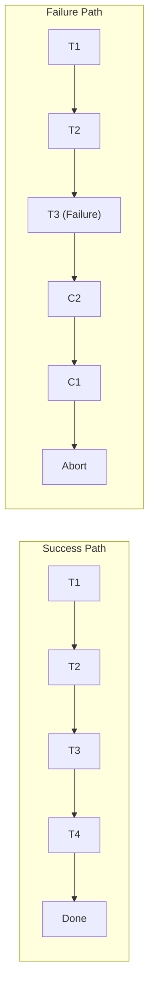

### 4.2 Choreography Saga

A pattern where each service autonomously publishes and subscribes to events, coordinating the Saga cooperatively. There is no central orchestrator.

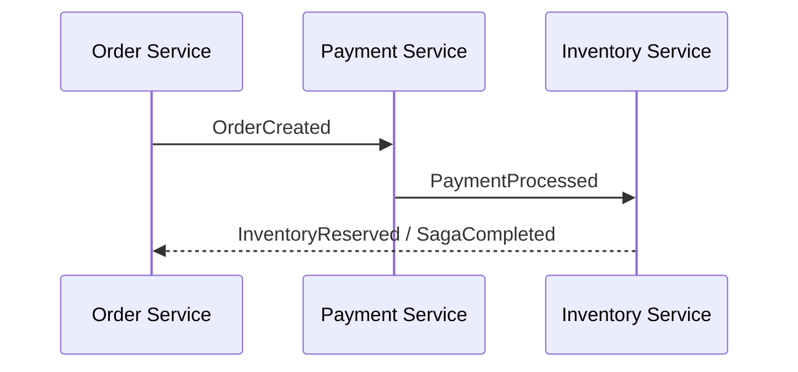

**Advantages:**
- Low coupling between services
- No single point of failure
- High autonomy for each service

**Disadvantages:**
- Difficult to understand the overall Saga state
- Complexity increases rapidly as the number of services grows
- Debugging and testing are difficult
- Risk of circular dependencies

### 4.3 Orchestration Saga

A central Saga orchestrator controls the overall transaction flow.

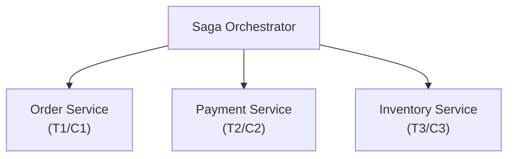

**Advantages:**
- The entire Saga flow can be understood and managed in one place
- Complex workflows are easier to implement
- Compensation logic management is centralized
- Monitoring and debugging are easier

**Disadvantages:**
- The orchestrator itself can become a single point of failure
- Risk of logic concentration in the orchestrator
- Services depend on the orchestrator

### 4.4 Compensating Transaction Design

Important principles in compensating transaction design:

1. **Idempotency**: Compensating transactions must return the same result no matter how many times they are executed. This is for safe retries during network failures
2. **Commutativity**: It is desirable that the final state is the same regardless of the order in which compensations are executed
3. **Semantic reverse operations**: Design business-meaningful reverse operations, such as transitioning to a "cancelled" state rather than physical deletion

```java
// Compensating transaction examples
public class OrderSagaCompensations {
    // Compensation for T1: Set order to cancelled state (not deletion)
    public void compensateOrderCreation(String orderId) {
        order.setStatus(OrderStatus.CANCELLED);
        orderRepository.save(order);
    }

    // Compensation for T2: Refund payment
    public void compensatePayment(String paymentId) {
        payment.setStatus(PaymentStatus.REFUNDED);
        paymentRepository.save(payment);
    }

    // Compensation for T3: Release inventory reservation
    public void compensateInventoryReservation(String reservationId) {
        reservation.setStatus(ReservationStatus.RELEASED);
        inventoryRepository.save(reservation);
    }
}
```

### 4.5 Saga Implementation Patterns with ScalarDB

**Pattern 1: Strengthen each local transaction with ScalarDB**

By using ScalarDB for each Saga step's local transaction, ACID is guaranteed even when a service uses multiple databases.

```java
// Saga Step: Order Service (when using multiple DBs)
public void createOrder(OrderRequest request) {
    DistributedTransaction tx = scalarDbTxManager.start();
    try {
        // Write to orders table on MySQL
        tx.put(orderPut);
        // Record event in order_events table on Cassandra
        tx.put(orderEventPut);
        tx.commit();
        // Success -> Publish event for next Saga step
        eventPublisher.publish(new OrderCreatedEvent(orderId));
    } catch (Exception e) {
        tx.abort();
        throw e;
    }
}
```

**Pattern 2: Eliminate Saga with ScalarDB's 2PC Interface**

Using ScalarDB's 2PC Interface enables direct distributed transactions across microservices, making the Saga pattern itself unnecessary in some cases. This is effective when stronger consistency (strong consistency) is needed compared to Saga's eventual consistency model.

```java
// Replace Saga with ScalarDB 2PC
// Coordinator (Order Service)
TwoPhaseCommitTransaction tx = txManager.start();
String txId = tx.getId();

// Order Service local operations
tx.put(orderPut);

// Request Payment Service participation
paymentService.processPayment(txId, paymentRequest);

// Request Inventory Service participation
inventoryService.reserveStock(txId, reservationRequest);

// All services: Prepare -> Validate -> Commit simultaneously
tx.prepare();
tx.validate();
tx.commit();
// -> Compensating transactions not needed. Automatic rollback across all services on failure
```

**Summary of ScalarDB's Impact on the Saga Pattern:**

| Aspect | Saga Only | ScalarDB + Saga | ScalarDB 2PC (Saga Replacement) |
|---|---|---|---|
| Consistency model | Eventual consistency | Strong consistency within each step | Strong consistency (ACID) |
| Compensating transactions | Required | Required but each step's reliability improved | Not required |
| Complexity | High (compensation design) | Medium | Low (similar to traditional Tx) |
| Availability | High | High | All participants required |
| Heterogeneous DB support | Individual handling per DB | ScalarDB handles uniformly | ScalarDB handles uniformly |

---

## 5. TCC Pattern and Integration with ScalarDB

### 5.1 Basic Concept and Implementation

The TCC (Try-Confirm-Cancel) pattern was systematized by Guy Pardon et al. at Atomikos, and is also related to the philosophy of Pat Helland's "Life beyond Distributed Transactions: an Apostate's Opinion" (2007). Each operation is divided into three phases.

- **Try**: Reserve (tentatively secure) resources. Perform business validation and secure necessary resources in an intermediate state
- **Confirm**: Finalize the reservation. Officially consume resources secured in Try
- **Cancel**: Cancel the reservation. Release resources secured in Try

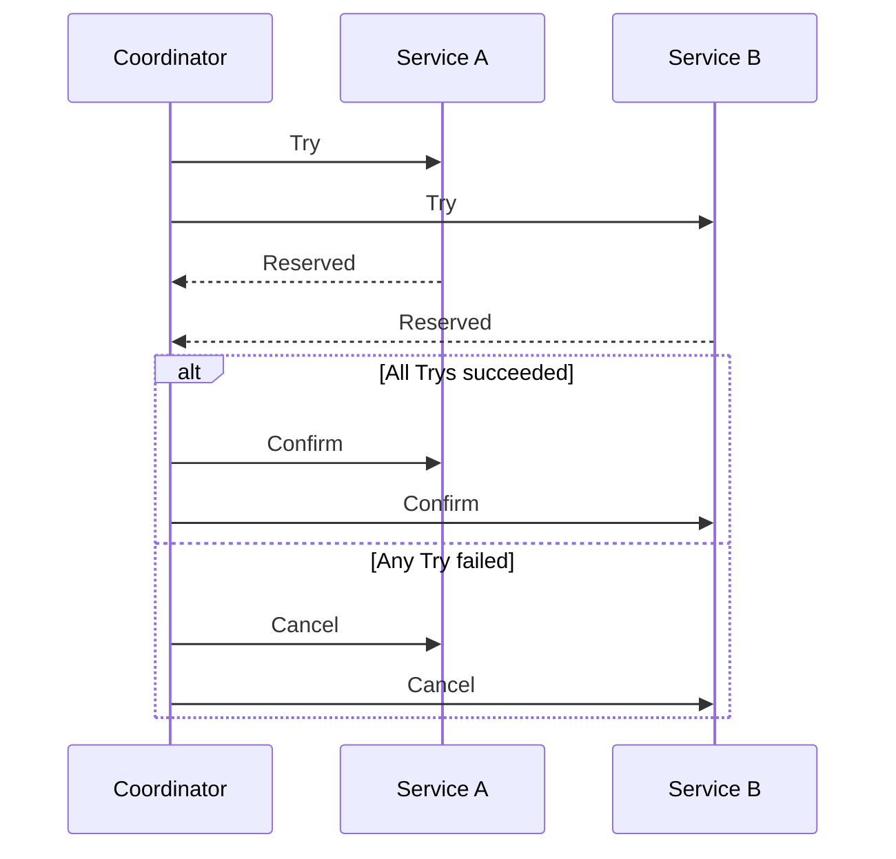

```java
// TCC pattern implementation example
public interface PaymentTccService {
    // Try: Tentatively reserve credit limit
    ReservationResult tryReserveCredit(String customerId, int amount);

    // Confirm: Finalize reservation and actually debit
    void confirmReserveCredit(String reservationId);

    // Cancel: Release reservation
    void cancelReserveCredit(String reservationId);
}

public class PaymentTccServiceImpl implements PaymentTccService {

    @Transactional
    public ReservationResult tryReserveCredit(String customerId, int amount) {
        Customer customer = customerRepo.findById(customerId);
        if (customer.getAvailableCredit() < amount) {
            throw new InsufficientCreditException();
        }
        // Tentative reservation (intermediate state)
        CreditReservation reservation = new CreditReservation(
            customerId, amount, ReservationStatus.RESERVED);
        reservationRepo.save(reservation);
        customer.setReservedCredit(customer.getReservedCredit() + amount);
        customerRepo.save(customer);
        return new ReservationResult(reservation.getId());
    }

    @Transactional
    public void confirmReserveCredit(String reservationId) {
        CreditReservation reservation = reservationRepo.findById(reservationId);
        reservation.setStatus(ReservationStatus.CONFIRMED);
        Customer customer = customerRepo.findById(reservation.getCustomerId());
        customer.setBalance(customer.getBalance() - reservation.getAmount());
        customer.setReservedCredit(customer.getReservedCredit() - reservation.getAmount());
        reservationRepo.save(reservation);
        customerRepo.save(customer);
    }

    @Transactional
    public void cancelReserveCredit(String reservationId) {
        CreditReservation reservation = reservationRepo.findById(reservationId);
        reservation.setStatus(ReservationStatus.CANCELLED);
        Customer customer = customerRepo.findById(reservation.getCustomerId());
        customer.setReservedCredit(customer.getReservedCredit() - reservation.getAmount());
        reservationRepo.save(reservation);
        customerRepo.save(customer);
    }
}
```

**Conditions for TCC applicability:**
- Resources can be modeled as "reservations" (airline seat reservation, inventory hold, credit limit hold, etc.)
- All three operations (Try/Confirm/Cancel) can be designed to be idempotent
- Intermediate states (reserved/unconfirmed) are acceptable from a business perspective

### 5.2 Integration Patterns with ScalarDB

**Pattern 1: Protect local transactions in each phase with ScalarDB**

```java
// Try phase - ScalarDB guarantees local transactions across heterogeneous DBs
public ReservationResult tryReserveInventory(String itemId, int quantity) {
    DistributedTransaction tx = scalarDbTxManager.start();
    try {
        // Read inventory table on Cassandra
        Optional<Result> inventoryResult = tx.get(inventoryGet);
        int available = inventoryResult.get().getInt("available_quantity");

        if (available < quantity) {
            tx.abort();
            throw new InsufficientStockException();
        }

        // Update Cassandra inventory to reserved state
        tx.put(Put.newBuilder()
            .namespace("inventory").table("stock")
            .partitionKey(Key.ofText("item_id", itemId))
            .intValue("reserved_quantity",
                inventoryResult.get().getInt("reserved_quantity") + quantity)
            .build());

        // Record in MySQL reservation table
        tx.put(Put.newBuilder()
            .namespace("reservation").table("reservations")
            .partitionKey(Key.ofText("reservation_id", reservationId))
            .textValue("status", "RESERVED")
            .intValue("quantity", quantity)
            .build());

        tx.commit();
        return new ReservationResult(reservationId);
    } catch (Exception e) {
        tx.abort();
        throw e;
    }
}
```

**Pattern 2: Replace TCC with ScalarDB 2PC**

ScalarDB's 2PC Interface is essentially similar to the TCC pattern's Try-Confirm flow. ScalarDB's `prepare()` corresponds to Try, `commit()` corresponds to Confirm, and `rollback()` corresponds to Cancel.

```java
// ScalarDB 2PC fulfills the role of TCC
TwoPhaseCommitTransaction tx = txManager.start();
String txId = tx.getId();

// Execute operations on each service (= preparatory operations corresponding to TCC's Try)
tx.put(orderPut);                                    // Order Service
inventoryService.reserveStock(txId, itemId, qty);     // Inventory Service
paymentService.reserveCredit(txId, customerId, amount); // Payment Service

// Prepare = corresponds to TCC's Try completion confirmation
tx.prepare();
// Each participant also calls prepare()

// Commit = corresponds to TCC's Confirm
tx.commit();
// On failure, automatic rollback() = corresponds to TCC's Cancel
```

**Impact of ScalarDB on TCC:**

| Aspect | TCC Only | ScalarDB + TCC |
|---|---|---|
| Intermediate state management | Application designs everything | ScalarDB guarantees ACID within each phase |
| Idempotency implementation | Developer implements everything | Uniqueness guaranteed by ScalarDB transaction ID |
| Heterogeneous DBs | Individual implementation per DB | Unified handling through ScalarDB's abstraction |
| Timeout handling | Implemented on app side | ScalarDB's transaction expiration feature |
| Replaceability | - | 2PC Interface can make TCC itself unnecessary in some cases |

---

## 6. CQRS Pattern and ScalarDB's Role

### 6.1 Basic Concept

CQRS is an architecture pattern that separates data writes (Command) from reads (Query). A concept popularized by Martin Fowler and systematized by Greg Young.

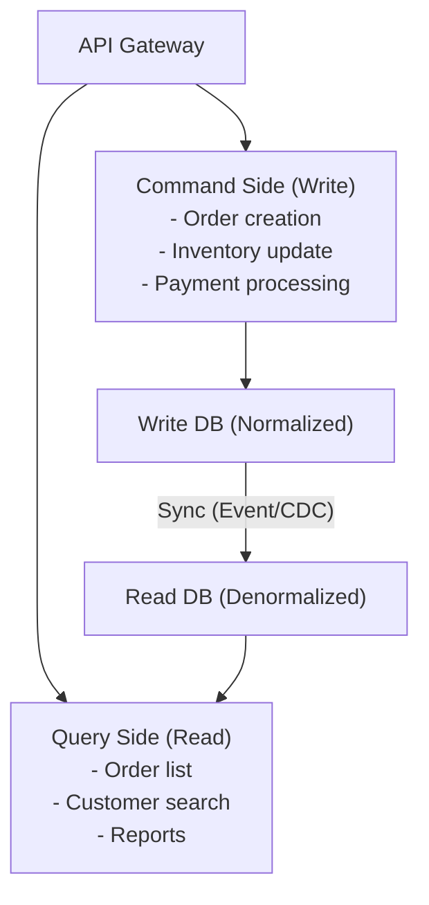

**Advantages:**
- Reads and writes can be scaled independently
- Optimal data model and DB can be chosen for each side
- Write side uses a normalized strict model; read side uses a denormalized query-optimized model
- Improved maintainability through separation of concerns

**Challenges:**
- Acceptance of eventual consistency is required
- System complexity increases
- Implementation and operation of synchronization mechanisms

### 6.2 Combination with Event Sourcing

CQRS is often combined with Event Sourcing. The Command side generates and persists events, which are then used to build the Query side's read model.

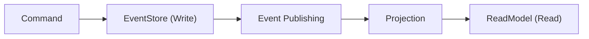

### 6.3 ScalarDB's Role on Command Side / Query Side

**ScalarDB's role on the Command side (Write side):**

1. **ACID transactions across heterogeneous DBs**: Business data updates and event recording can be executed in a single transaction even when distributed across different DBs

```java
// Command side: Cross-DB transaction with ScalarDB
DistributedTransaction tx = scalarDbTxManager.start();
try {
    // Update order table on PostgreSQL
    tx.put(Put.newBuilder()
        .namespace("orders_db").table("orders")
        .partitionKey(Key.ofText("order_id", orderId))
        .textValue("status", "CONFIRMED")
        .build());

    // Record event in event store on Cassandra
    tx.put(Put.newBuilder()
        .namespace("event_store").table("events")
        .partitionKey(Key.ofText("aggregate_id", orderId))
        .clusteringKey(Key.ofBigInt("event_sequence", nextSeq))
        .textValue("event_type", "ORDER_CONFIRMED")
        .textValue("payload", eventPayloadJson)
        .build());

    tx.commit(); // Writes to both DBs are guaranteed with ACID
} catch (Exception e) {
    tx.abort();
}
```

2. **Multi-storage transactions**: ScalarDB's Multi-storage Transaction feature allows transparently using different storage backends per namespace

**ScalarDB's role on the Query side (Read side):**

ScalarDB provides powerful capabilities on the Query side through **ScalarDB Analytics with PostgreSQL**.

1. **Unified read view**: ScalarDB Analytics provides data spanning multiple heterogeneous databases as a single readable view using PostgreSQL's FDW (Foreign Data Wrapper)
2. **ETL-free cross-DB analytical queries**: ScalarDB-managed data can be read directly without building ETL pipelines
3. **Read-Committed consistency**: ScalarDB Analytics provides views with guaranteed read consistency

```sql
-- ScalarDB Analytics: Cross-DB query (PostgreSQL SQL)
-- Joining orders (Cassandra) and customers (MySQL)
SELECT
    c.customer_name,
    o.order_id,
    o.total_amount,
    o.status
FROM customer_service.customers c
JOIN order_service.orders o
    ON c.customer_id = o.customer_id
WHERE o.status = 'CONFIRMED'
ORDER BY o.created_at DESC;
```

**Overall picture of ScalarDB in CQRS:**

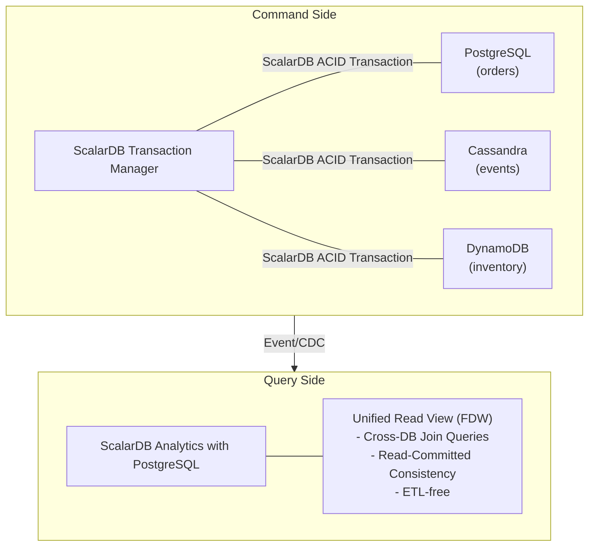

---

## 7. Event Sourcing and Integration with ScalarDB

### 7.1 Event Store Design

Event Sourcing is a pattern that persists entity state as a "sequence of state change events." The current state is restored by replaying events in order.

Event store data model:

| aggregate_id | seq_no | event_type      | payload         |
|--------------|--------|-----------------|-----------------|
| order-001    | 1      | OrderCreated    | {customer:..}   |
| order-001    | 2      | ItemAdded       | {item:..}       |
| order-001    | 3      | PaymentReceived | {amount:..}     |
| order-001    | 4      | OrderShipped    | {tracking:..}   |

Current state = `replay(event_1, event_2, event_3, event_4)`

**Event store design requirements:**
- **Append-only**: Events are immutable and not deleted or updated
- **Order guarantee**: Event order within the same aggregate is guaranteed
- **Optimistic exclusive control**: Detect concurrent writes to the same aggregate
- **Event subscription**: New events can be subscribed to in real-time

### 7.2 Snapshots

As the number of events grows, replaying all events becomes costly. Snapshots are an optimization technique that saves the state at a certain point and only replays differential events from there.

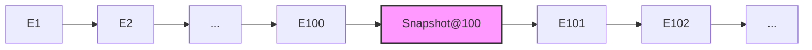

State restoration:
- Without snapshot: `replay(E1, E2, ..., E102)` --> 102 events replayed
- With snapshot: `load(Snapshot@100)` + `replay(E101, E102)` --> 2 events replayed

```java
// Snapshot strategy example
public class SnapshotStrategy {
    private static final int SNAPSHOT_INTERVAL = 100;

    public Order loadOrder(String orderId) {
        // Get latest snapshot
        Optional<Snapshot> snapshot = snapshotStore.getLatest(orderId);

        Order order;
        long fromSequence;
        if (snapshot.isPresent()) {
            order = snapshot.get().getState();
            fromSequence = snapshot.get().getSequenceNumber() + 1;
        } else {
            order = new Order();
            fromSequence = 0;
        }

        // Replay events since the snapshot
        List<Event> events = eventStore.getEvents(orderId, fromSequence);
        for (Event event : events) {
            order.apply(event);
        }

        // Create new snapshot if needed
        if (events.size() >= SNAPSHOT_INTERVAL) {
            snapshotStore.save(new Snapshot(orderId, order,
                events.get(events.size() - 1).getSequenceNumber()));
        }

        return order;
    }
}
```

### 7.3 Integration Potential with ScalarDB

ScalarDB's data model (partition key + clustering key) fits the requirements of an event store.

```java
// Event store implementation with ScalarDB
public class ScalarDbEventStore {
    private final DistributedTransactionManager txManager;

    // Append event (with optimistic exclusive control)
    public void appendEvent(String aggregateId, long expectedVersion,
                           DomainEvent event) {
        DistributedTransaction tx = txManager.start();
        try {
            // Check current version (optimistic exclusive control)
            Optional<Result> current = tx.get(Get.newBuilder()
                .namespace("event_sourcing").table("aggregates")
                .partitionKey(Key.ofText("aggregate_id", aggregateId))
                .build());

            long currentVersion = current.map(r -> r.getBigInt("version")).orElse(0L);
            if (currentVersion != expectedVersion) {
                tx.abort();
                throw new OptimisticLockException(
                    "Expected version " + expectedVersion +
                    " but was " + currentVersion);
            }

            // Append event
            tx.put(Put.newBuilder()
                .namespace("event_sourcing").table("events")
                .partitionKey(Key.ofText("aggregate_id", aggregateId))
                .clusteringKey(Key.ofBigInt("sequence_number", expectedVersion + 1))
                .textValue("event_type", event.getType())
                .textValue("payload", serialize(event))
                .bigIntValue("timestamp", System.currentTimeMillis())
                .build());

            // Update version
            tx.put(Put.newBuilder()
                .namespace("event_sourcing").table("aggregates")
                .partitionKey(Key.ofText("aggregate_id", aggregateId))
                .bigIntValue("version", expectedVersion + 1)
                .build());

            tx.commit();
        } catch (Exception e) {
            tx.abort();
            throw e;
        }
    }

    // Save snapshot (can be done in the same transaction as event)
    public void saveSnapshot(String aggregateId, long version,
                            Object state) {
        DistributedTransaction tx = txManager.start();
        try {
            tx.put(Put.newBuilder()
                .namespace("event_sourcing").table("snapshots")
                .partitionKey(Key.ofText("aggregate_id", aggregateId))
                .clusteringKey(Key.ofBigInt("version", version))
                .textValue("state", serialize(state))
                .build());
            tx.commit();
        } catch (Exception e) {
            tx.abort();
            throw e;
        }
    }
}
```

**Benefits of introducing ScalarDB:**

1. **Event store across heterogeneous DBs**: Event store (e.g., Cassandra) and snapshot store (e.g., MySQL) can be placed on different DBs while guaranteeing consistency with ACID transactions
2. **Atomicity of event publishing and business data updates**: Event appending and read model updates can be executed in a single transaction even against different DBs (combination with Outbox pattern)
3. **Cross-service event store**: ACID transactions spanning multiple services' event stores using ScalarDB's 2PC Interface
4. **Analytical queries**: Cross-DB analytical queries against event stores without ETL via ScalarDB Analytics

---

## 8. Outbox Pattern

### 8.1 Transactional Outbox

The Outbox pattern is a pattern for reliably and consistently performing business data updates and event/message publishing. It solves the dual write problem, where "publishing to a message broker" and "writing to a DB" are inherently operations to different systems and cannot both be performed atomically.

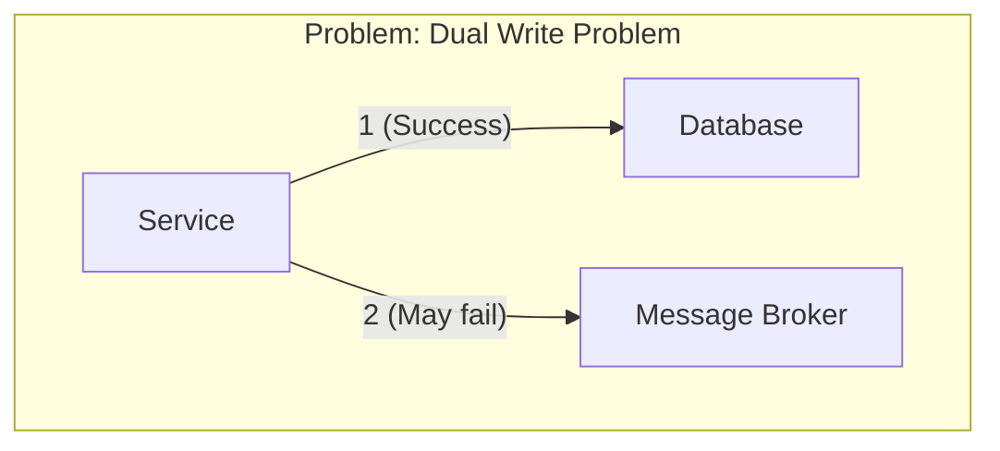

> 1 and 2 cannot be performed atomically

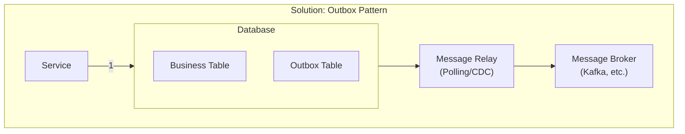

> Write business data and events within the same DB transaction, and a Message Relay monitors the Outbox table to forward messages to the message broker

```java
// Basic Outbox pattern implementation
@Transactional
public void placeOrder(OrderRequest request) {
    // Save business data
    Order order = new Order(request);
    orderRepository.save(order);

    // Save event to Outbox table (within same transaction)
    OutboxEvent event = new OutboxEvent(
        UUID.randomUUID().toString(),
        "OrderCreated",
        "Order",
        order.getId(),
        toJson(new OrderCreatedEvent(order)),
        Instant.now()
    );
    outboxRepository.save(event);
    // -> Both are atomically persisted with DB transaction commit
}
```

### 8.2 Change Data Capture (CDC)

CDC is a technique that monitors database change logs (WAL/binlog) to capture changes in real-time. It captures changes to the Outbox table via CDC and forwards them to the message broker.

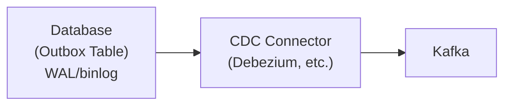

**Advantages of CDC (compared to polling):**
- Low DB load (no additional queries since it reads WAL directly)
- High real-time capability (near-zero latency)
- Prevents Outbox table bloat

**Challenges of CDC:**
- Operational complexity (additional infrastructure management for Debezium, etc.)
- Dependency on DB's WAL format
- Offset management during failure recovery

### 8.3 Outbox Implementation with ScalarDB

Implementing the Outbox pattern with ScalarDB provides significant benefits, particularly in heterogeneous DB environments.

**Pattern 1: Guarantee writes to Outbox table with ScalarDB transactions**

```java
// Outbox pattern implementation with ScalarDB
public class ScalarDbOutboxOrderService {
    private final DistributedTransactionManager txManager;

    public void placeOrder(OrderRequest request) {
        DistributedTransaction tx = txManager.start();
        try {
            String orderId = UUID.randomUUID().toString();

            // Save business data (e.g., order table on Cassandra)
            tx.put(Put.newBuilder()
                .namespace("order_service").table("orders")
                .partitionKey(Key.ofText("order_id", orderId))
                .textValue("customer_id", request.getCustomerId())
                .intValue("total_amount", request.getTotalAmount())
                .textValue("status", "CREATED")
                .build());

            // Write to Outbox table (e.g., same Cassandra or separate MySQL)
            tx.put(Put.newBuilder()
                .namespace("outbox").table("outbox_events")
                .partitionKey(Key.ofText("event_id", UUID.randomUUID().toString()))
                .textValue("aggregate_type", "Order")
                .textValue("aggregate_id", orderId)
                .textValue("event_type", "OrderCreated")
                .textValue("payload", toJson(request))
                .bigIntValue("created_at", System.currentTimeMillis())
                .booleanValue("published", false)
                .build());

            tx.commit();
            // -> Business data and Outbox event are atomically committed
            //   even if stored in different DBs
        } catch (Exception e) {
            tx.abort();
            throw e;
        }
    }
}
```

**Pattern 2: Combining ScalarDB 2PC and Outbox (across microservices)**

```java
// Coordinator service: Multiple service operations + Outbox in 1 transaction
public void processOrderFlow(OrderFlowRequest request) {
    TwoPhaseCommitTransaction tx = txManager.start();
    String txId = tx.getId();

    try {
        // Order Service: Create order
        tx.put(orderPut);

        // Payment Service: Process payment (remote participant)
        paymentService.processPayment(txId, request.getPaymentInfo());

        // Outbox table: Record order completion event
        tx.put(Put.newBuilder()
            .namespace("outbox").table("outbox_events")
            .partitionKey(Key.ofText("event_id", eventId))
            .textValue("event_type", "OrderFlowCompleted")
            .textValue("payload", toJson(orderFlowEvent))
            .build());

        tx.prepare();
        tx.validate();
        tx.commit();
        // -> Order creation + payment processing + Outbox event recording are all atomic
    } catch (Exception e) {
        tx.rollback();
        throw e;
    }
}
```

**Benefits ScalarDB brings to the Outbox pattern:**

| Aspect | Traditional Outbox | ScalarDB + Outbox |
|---|---|---|
| Atomicity of business data and Outbox | Guaranteed only within same DB | Guaranteed across heterogeneous DBs |
| Outbox table placement | Same DB as business data | Can be placed on any DB |
| Across microservices | Each service has independent Outbox | Can integrate multiple services' Outbox with 2PC |
| Combination with CDC | DB-specific CDC configuration required | Monitor WAL including ScalarDB metadata via CDC (ScalarDB-specific considerations needed) |
| Dual write problem | Solved only within same DB | Solved across heterogeneous DBs |

**Caveats:**
- Since ScalarDB attaches metadata (transaction ID, version, state) to records, filtering that accounts for ScalarDB metadata is required when monitoring the Outbox table via CDC
- Direct DB operations bypassing ScalarDB may compromise transaction consistency

**Important considerations regarding CDC and ScalarDB metadata**:

ScalarDB's Consensus Commit metadata (`tx_id`, `tx_state`, `tx_version`, `tx_prepared_at`, `tx_committed_at`, `before_*` columns) is included in WAL events captured by CDC tools (Debezium, etc.).

- **Risk of misidentifying PREPARED state**: Without proper metadata filtering, record changes in PREPARED state (uncommitted) may be misidentified as "finalized," propagating dirty data to downstream systems
- **Filtering by tx_state value is mandatory**: Always configure a filter to propagate only records where `tx_state = 3` (COMMITTED) to downstream
- **When using 3.17 Transaction Metadata Decoupling**: Since metadata is separated into a different table, the structure of CDC target tables changes. Verify CDC connector settings

---

## 9. Comparison Summary of Each Pattern

### 9.1 Comparison With/Without ScalarDB

| Pattern | Without ScalarDB | With ScalarDB |
|---|---|---|
| **Local Tx** | Dependent on DB-specific Tx features | Achieves cross-DB ACID with unified API |
| **2PC** | XA-compatible RDBMS only (NoSQL not possible, high risk of implementation differences between heterogeneous RDBMS), blocking, manual recovery on TM failure | XA not required, supports any DB combination, OCC adopted, automatic recovery via Lazy Recovery |
| **Saga** | Eventual consistency, compensating Tx required | Can replace with 2PC, or strengthen each step |
| **TCC** | Application manages all state | ACID guaranteed per phase, can replace with 2PC |
| **CQRS** | Synchronization between Write/Read DB is a challenge | Command side: cross-DB ACID, Query side: Analytics |
| **Event Sourcing** | Event management within single DB | Event store implementation spanning heterogeneous DBs is possible |
| **Outbox** | Atomicity guaranteed only within same DB | Outbox atomicity guaranteed across heterogeneous DBs |

### 9.2 Core Value of ScalarDB

The most fundamental value ScalarDB brings to microservice transaction patterns is **abstracting database heterogeneity and providing ACID transactions across heterogeneous DBs**.

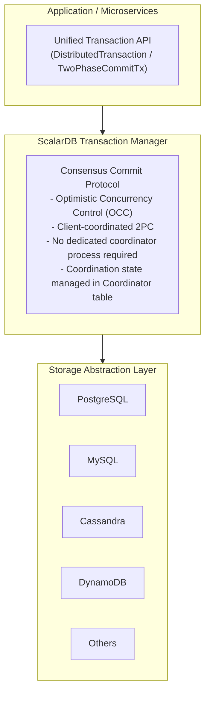

### 9.3 ScalarDB 3.17 Performance Optimization Options

ScalarDB 3.17 provides multiple options to improve transaction performance.

| Option | Configuration Key | Effect |
|---|---|---|
| **Asynchronous commit** | `async_commit.enabled=true` | Reduce latency by asynchronizing commits |
| **Asynchronous rollback** | `async_rollback.enabled=true` | Reduce latency on abort |
| **Group commit** | `coordinator.group_commit.enabled=true` | Improve throughput by batching commits of multiple Tx |
| **Parallel execution** | `parallel_executor_count=128` | Adjust number of parallel execution threads |

Group commit significantly improves write throughput by batching writes to the Coordinator table from multiple transactions. The VLDB 2023 paper reported up to 87% performance improvement with MariaDB backend and up to 48% with PostgreSQL backend.

> **Constraint**: Group Commit cannot be used together with the 2PC Interface. Do not enable Group Commit on services that use 2PC transactions (explicitly stated in official documentation).

**ScalarDB 3.17 Client-Side Optimization Options:**

ScalarDB 3.17 also adds client-side transaction optimization features.

| Option | Configuration Key | Effect |
|---|---|---|
| **Piggyback Begin** (default OFF) | `scalar.db.cluster.client.piggyback_begin.enabled` | Piggyback transaction start onto the first CRUD operation, reducing round trips |
| **Write Buffering** | `scalar.db.cluster.client.write_buffering.enabled` | Buffer write operations on the client side and send them together at prepare time, reducing round trips |
| **Batch Operations API** | `transaction.batch()` | Execute multiple Get/Put/Delete operations in a single RPC call |

> **Reference**: For details on these client-side optimizations (design philosophy, application conditions, performance characteristics), see [`13_scalardb_317_deep_dive.md`](./13_scalardb_317_deep_dive.md).

### 9.4 Criteria for ScalarDB Adoption

Cases where ScalarDB adoption is particularly effective:
1. **Polyglot persistence**: When using multiple types of DBs and transactional consistency is needed between them
2. **Strong consistency across microservices**: When Saga's eventual consistency is insufficient and ACID is needed across services (2PC Interface)
3. **Adding ACID to NoSQL**: When you want to add full ACID transaction capabilities to Cassandra or DynamoDB
4. **Cross-DB analytics**: When data across multiple DBs needs to be analyzed in an integrated manner (ScalarDB Analytics)

Considerations when adopting ScalarDB:
- All data access must go through ScalarDB (mixing with direct DB access compromises consistency)
- ScalarDB metadata is attached to records, causing storage overhead
- Since it is OCC-based, retries may increase for workloads with frequent write conflicts

### 2PC Application Restriction Guidelines

While ScalarDB 2PC is highly convenient, excessive application risks undermining microservice independence and creating a "distributed monolith." Follow these guidelines.

**Principle: Default to eventual consistency (Saga/event-driven), with 2PC as an exceptional choice**

| Item | Guideline |
|------|------------|
| **Application conditions (all must be met)** | (1) Temporary inconsistency directly leads to regulatory violations or financial losses (2) Participating services are 3 or fewer (3) Participating services are managed by the same team (4) Transaction execution time is expected to be under 100ms |
| **Required measures** | Explicit timeout value settings, Circuit Breaker application, fallback strategy for 2PC failures, dedicated monitoring dashboard for 2PC transactions |
| **Cases to avoid** | 2PC across services spanning teams, 2PC with more than 3 participating services, 2PC for batch processing without strict latency requirements |

**Risks of excessive 2PC application (distributed monolith):**
- Runtime coupling: All participating services must be simultaneously operational or the transaction fails
- Deployment coupling: ScalarDB Cluster or API changes affect all participating services
- Failure propagation: Latency in one service delays the entire 2PC prepare/commit
- Increased inter-team coordination costs: Coordinator/Participant relationships create dependencies between teams

---

## References

- [ScalarDB Consensus Commit Protocol](https://scalardb.scalar-labs.com/docs/latest/consensus-commit/)
- [ScalarDB Two-Phase Commit Transactions](https://scalardb.scalar-labs.com/docs/3.13/two-phase-commit-transactions/)
- [ScalarDB Microservice Transaction Sample](https://scalardb.scalar-labs.com/docs/3.13/scalardb-samples/microservice-transaction-sample/)
- [ScalarDB Multi-Storage Transactions](https://scalardb.scalar-labs.com/docs/latest/multi-storage-transactions/)
- [ScalarDB Analytics Design](https://scalardb.scalar-labs.com/docs/latest/scalardb-analytics/design/)
- [ScalarDB: Universal Transaction Manager for Polystores (VLDB'23)](https://www.vldb.org/pvldb/vol16/p3768-yamada.pdf)
- [ScalarDB GitHub Repository](https://github.com/scalar-labs/scalardb)
- [ScalarDB Design Document](https://scalardb.scalar-labs.com/docs/3.5/design/)
- [Saga Pattern - microservices.io](https://microservices.io/patterns/data/saga.html)
- [Saga Design Pattern - Azure Architecture](https://learn.microsoft.com/en-us/azure/architecture/patterns/saga)
- [Saga Pattern Demystified - ByteByteGo](https://blog.bytebytego.com/p/saga-pattern-demystified-orchestration)
- [CQRS Pattern - Azure Architecture](https://learn.microsoft.com/en-us/azure/architecture/patterns/cqrs)
- [Transactional Outbox Pattern - microservices.io](https://microservices.io/patterns/data/transactional-outbox.html)
- [TCC Transaction Protocol - Oracle](https://docs.oracle.com/en/database/oracle/transaction-manager-for-microservices/24.2/tmmdg/tcc-transaction-model.html)
