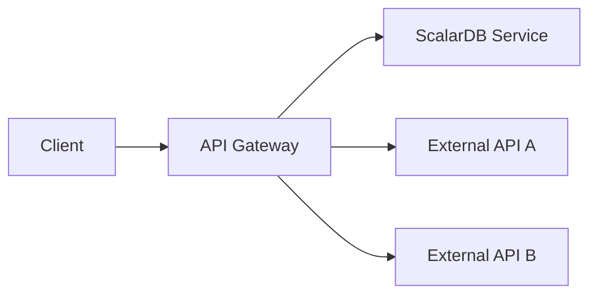
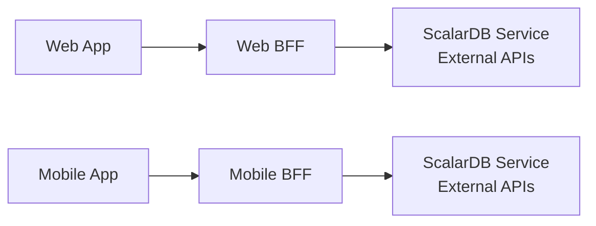
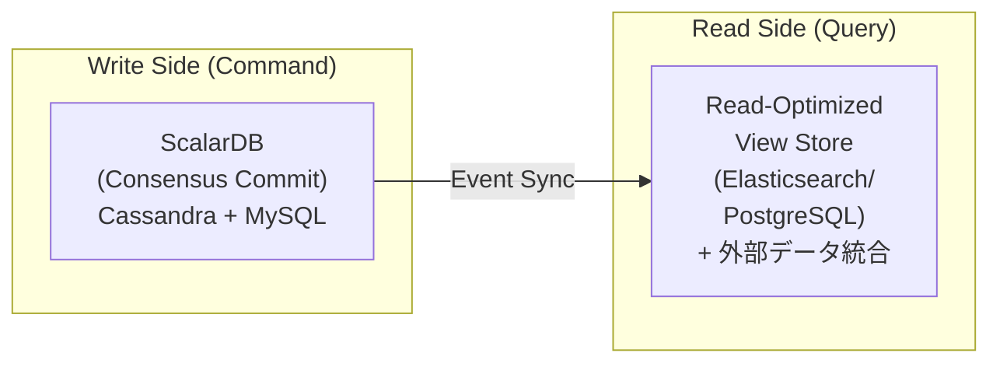
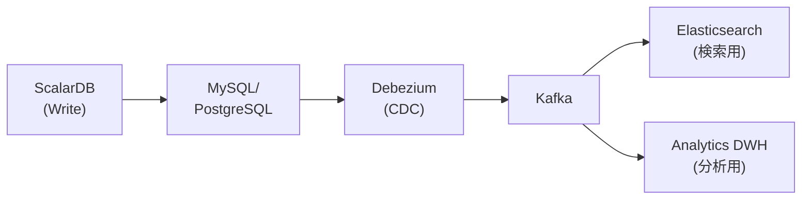
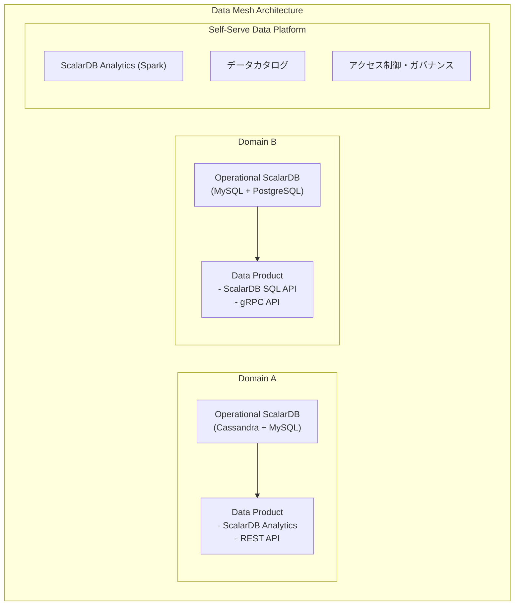

# 透過的データアクセスパターン調査

---

## 1. ScalarDB管理下のデータアクセスパターン

### 1.1 ScalarDB Analyticsによるクロスデータベースクエリ

ScalarDB Analyticsは、ScalarDBが管理する複数の異種データベース（PostgreSQL、MySQL、Cassandra、DynamoDB等）を単一の論理データベースとして統合し、分析クエリを実行可能にするコンポーネントである。

**アーキテクチャ構成:**

- **Universal Data Catalog**: 多様なデータ環境を組織する柔軟なメタデータ管理システム。Catalog > Data Source > Namespace > Table の階層構造を持つ
- **クエリエンジン統合**: 現在Apache Sparkをクエリエンジンとしてサポート。カスタムSparkカタログプラグイン（`ScalarDbAnalyticsCatalog`）を通じて、登録されたデータソースをSparkテーブルとして公開する

**ScalarDB Analytics with PostgreSQL:**

PostgreSQLのForeign Data Wrapper（FDW）拡張フレームワークを活用し、ScalarDB管理下のデータベースに対する読み取り専用の分析クエリを実行する。JOIN、集計、フィルタリング、ソート、ウィンドウ関数、ラテラル結合など、PostgreSQLがサポートする全てのクエリが利用可能である。

```sql
-- ScalarDB Analytics with PostgreSQLでのクロスデータベースJOIN例
SELECT
    c.customer_id, c.name,
    o.order_id, o.timestamp,
    s.item_id, i.name AS item_name, s.count
FROM customer_service.customers c          -- Cassandra上のテーブル
JOIN order_service.orders o                 -- MySQL上のテーブル
    ON c.customer_id = o.customer_id
JOIN order_service.statements s
    ON o.order_id = s.order_id
JOIN order_service.items i
    ON s.item_id = i.item_id
WHERE c.credit_total > 1000;
```

**ScalarDB Analytics with Spark:**

テーブルは `<CATALOG_NAME>.<DATA_SOURCE_NAME>.<NAMESPACE_NAMES>.<TABLE_NAME>` の階層形式で参照される。

```scala
// Spark SQLによるクロスデータソースクエリ
val result = spark.sql("""
    SELECT ds1.customers.customer_service.customers.name,
           ds2.orders.order_service.orders.order_id
    FROM analytics_catalog.cassandra_ds.customer_service.customers
    JOIN analytics_catalog.mysql_ds.order_service.orders
    ON customers.customer_id = orders.customer_id
""")
```

**適用条件:**
- ScalarDBが管理する複数データベースにまたがる分析・レポーティングが必要な場合
- 読み取り専用のクロスデータベースJOINが必要な場合
- アドホック分析の需要がある場合

**メリット:**
- 標準SQL（PostgreSQL互換またはSpark SQL）で透過的にクエリ可能
- アプリケーション側でのデータ結合ロジックが不要
- 既存のBIツールやデータ分析ツールとの親和性が高い

**デメリット:**
- 読み取り専用（書き込みトランザクションには使用不可）
- ScalarDB管理下のデータのみが対象
- FDW方式はリアルタイム性にやや制約がある

### 1.2 マルチストレージトランザクション

ScalarDBのマルチストレージ機能は、名前空間（namespace）とストレージインスタンスのマッピングを保持し、操作実行時に適切なストレージを自動選択する。

**設定例:**

```properties
# トランザクションマネージャ設定
scalar.db.transaction_manager=consensus-commit
scalar.db.storage=multi-storage

# ストレージ定義
scalar.db.multi_storage.storages=cassandra,mysql

# Cassandra設定
scalar.db.multi_storage.storages.cassandra.storage=cassandra
scalar.db.multi_storage.storages.cassandra.contact_points=localhost
scalar.db.multi_storage.storages.cassandra.username=cassandra
scalar.db.multi_storage.storages.cassandra.password=cassandra

# MySQL設定
scalar.db.multi_storage.storages.mysql.storage=jdbc
scalar.db.multi_storage.storages.mysql.contact_points=jdbc:mysql://localhost:3306/
scalar.db.multi_storage.storages.mysql.username=root
scalar.db.multi_storage.storages.mysql.password=mysql

# 名前空間マッピング
scalar.db.multi_storage.namespace_mapping=customer_service:cassandra,order_service:mysql
scalar.db.multi_storage.default_storage=cassandra
```

**Consensus Commitプロトコル:**

ScalarDBの中核であるConsensus Commitは、基盤データベースのトランザクション機能に依存せず、楽観的並行性制御（OCC）と二相コミットの変形を用いてACIDトランザクションを実現する。

- **読み取りフェーズ**: トランザクションがデータを読み取り、読み取りセットを追跡
- **検証フェーズ**: コミット時に競合がないか検証
- **書き込みフェーズ**: prepare-records → validate-records → commit-state → commit-records のサブフェーズで実行

**分離レベル:**

| レベル | 特性 | パフォーマンス |
|--------|------|----------------|
| **SNAPSHOT**（デフォルト） | Snapshot Isolationを提供。Write Skewの可能性あり（Read Skewは防止される）。ほとんどのユースケースに適合 | 高い |
| **SERIALIZABLE** | Extra-Read（anti-dependency check）により完全なSerializableを実現。追加のRead操作によるオーバーヘッドあり | 低い |
| **READ_COMMITTED** | Read Committed分離レベルを提供。軽量な分離が求められる場面に適合 | 高い |

### 1.3 統一的なSQLインターフェース

ScalarDB SQLは、SQLを解析してScalarDB API操作に変換するレイヤーである。JDBC準拠のドライバを提供し、標準的なJava JDBCアプリケーションからScalarDB管理下の異種データベースへ統一的にアクセスできる。

```java
// ScalarDB JDBC接続
String url = "jdbc:scalardb:scalardb.properties";
try (Connection conn = DriverManager.getConnection(url)) {
    conn.setAutoCommit(false);

    // Cassandra上のcustomerテーブルとMySQL上のorderテーブルを
    // 同一トランザクションで操作
    PreparedStatement ps1 = conn.prepareStatement(
        "UPDATE customer_service.customers SET credit_total = credit_total + ? WHERE customer_id = ?"
    );
    ps1.setInt(1, amount);
    ps1.setInt(2, customerId);
    ps1.executeUpdate();

    PreparedStatement ps2 = conn.prepareStatement(
        "INSERT INTO order_service.orders (order_id, customer_id, timestamp) VALUES (?, ?, ?)"
    );
    ps2.setString(1, orderId);
    ps2.setInt(2, customerId);
    ps2.setLong(3, System.currentTimeMillis());
    ps2.executeUpdate();

    conn.commit(); // Consensus Commitにより異種DB間のACIDを保証
}
```

**サポートされるJDBC対応データベース:** MariaDB、Microsoft SQL Server、MySQL、Oracle Database、PostgreSQL、SQLite、Amazon Aurora、YugabyteDB等

### 1.4 Scan操作の制約

ScalarDBのScan操作にはデータアクセスパターン上の重要な制約がある。

| 制約 | 詳細 |
|------|------|
| **パーティション内Scan** | デフォルトではScan操作は単一パーティション内（クラスタリングキー範囲）で動作する |
| **クロスパーティションScan** | パーティションをまたぐScanを行うには `scalar.db.cross_partition_scan.enabled=true` の設定が必要 |
| **非JDBCデータベースの制限** | Cassandra、DynamoDB等の非JDBCデータベースでは、クロスパーティションScanの機能が制限される場合がある |

> **注意**: データアクセスパターンの設計時には、Scan操作がパーティション内に閉じるようにパーティションキーとクラスタリングキーを適切に設計することが推奨される。クロスパーティションScanはパフォーマンスへの影響が大きいため、必要最小限に留めること。

---

## 2. ScalarDB管理外のデータとの統合参照

ScalarDB管理外のデータソース（SaaSのAPI、レガシーシステム、他チームのマイクロサービス等）との統合にはアプリケーションレベルのパターンが必要となる。

### 2.1 API Gateway パターン



**実装例（Spring Cloud Gateway + WebFlux）:**

```java
@RestController
@RequestMapping("/api/v1/dashboard")
public class DashboardController {

    private final ScalarDbOrderService scalarDbOrders;  // ScalarDB管理
    private final ExternalInventoryClient inventoryApi;  // 外部API

    @GetMapping("/customer/{id}")
    public Mono<DashboardResponse> getCustomerDashboard(@PathVariable String id) {
        // ScalarDBデータと外部APIデータを並行取得
        Mono<CustomerOrders> orders = Mono.fromCallable(
            () -> scalarDbOrders.getOrdersByCustomerId(id)
        ).subscribeOn(Schedulers.boundedElastic());

        Mono<InventoryStatus> inventory = inventoryApi.getStatus(id);

        return Mono.zip(orders, inventory)
            .map(tuple -> new DashboardResponse(tuple.getT1(), tuple.getT2()));
    }
}
```

**適用条件:** クライアントに統一的なエンドポイントを提供したい場合

**メリット:** クライアントの複雑さを軽減、認証・レート制限を集約

**デメリット:** 単一障害点のリスク、レイテンシの増加

### 2.2 Backend for Frontend（BFF）パターン



**適用条件:** 異なるクライアント（Web、モバイル、IoT）ごとに最適化されたデータ集約が必要な場合

**メリット:** クライアント特化の最適化が可能

**デメリット:** BFFの数だけコードが増加し、重複ロジックが発生し得る

### 2.3 フェデレーテッドクエリ

複数の異種データソースに対して単一のクエリで横断的にアクセスする手法。ScalarDB AnalyticsのSpark統合は、ScalarDB管理外のデータソースもSparkテーブルとして登録可能であり、事実上のフェデレーテッドクエリエンジンとして機能する。

```scala
// ScalarDB管理データと非ScalarDB管理データのフェデレーテッドクエリ
spark.sql("""
    SELECT
        scalardb_catalog.cassandra.customer_service.customers.name,
        external_catalog.s3.analytics.click_events.page_views
    FROM scalardb_catalog.cassandra.customer_service.customers
    JOIN external_catalog.s3.analytics.click_events
    ON customers.customer_id = click_events.user_id
    WHERE click_events.event_date >= '2026-01-01'
""")
```

他の選択肢としては、Apache Presto/Trino、Google BigQuery Omni、AWS Athena Federated Queryなどがある。

---

## 3. ハイブリッドパターン

### 3.1 CQRSパターンとの組み合わせ

書き込み側（Command）はScalarDBのトランザクション保証を活用し、読み取り側（Query）は結合済みの読み取り専用ビューを提供する。



```java
// CQRSの書き込み側：ScalarDBトランザクション
@Transactional
public void placeOrder(OrderCommand cmd) {
    // ScalarDBマルチストレージトランザクション
    customerRepo.updateCredit(cmd.getCustomerId(), cmd.getAmount());
    orderRepo.createOrder(cmd.toOrder());
    // イベント発行（読み取り側の更新トリガー）
    eventPublisher.publish(new OrderPlacedEvent(cmd));
}

// CQRSの読み取り側：統合ビュー
@Service
public class OrderQueryService {
    private final ElasticsearchClient esClient; // 結合済みビュー

    public OrderDetailView getOrderDetail(String orderId) {
        // ScalarDBデータ + 外部データが統合されたビューから読み取り
        return esClient.get("order_details", orderId, OrderDetailView.class);
    }
}
```

### 3.2 キャッシュ戦略（Redis等）

```java
@Service
public class CachedDataAccessService {

    private final RedisTemplate<String, Object> redis;
    private final ScalarDbRepository scalarDbRepo;
    private final ExternalApiClient externalApi;

    public UnifiedCustomerView getCustomerView(String customerId) {
        String cacheKey = "customer_view:" + customerId;

        // キャッシュヒットチェック
        UnifiedCustomerView cached = (UnifiedCustomerView) redis.opsForValue().get(cacheKey);
        if (cached != null) return cached;

        // ScalarDBからコアデータ取得
        Customer customer = scalarDbRepo.getCustomer(customerId);
        List<Order> orders = scalarDbRepo.getOrders(customerId);

        // 外部APIから補足データ取得
        LoyaltyPoints loyalty = externalApi.getLoyaltyPoints(customerId);

        // 統合ビュー構築 & キャッシュ
        UnifiedCustomerView view = UnifiedCustomerView.of(customer, orders, loyalty);
        redis.opsForValue().set(cacheKey, view, Duration.ofMinutes(5));

        return view;
    }
}
```

**適用条件:** 読み取り頻度が高く、若干のデータ遅延が許容される場合

**メリット:** レイテンシの大幅改善、バックエンドシステムへの負荷軽減

**デメリット:** キャッシュ無効化の複雑さ、データの鮮度と整合性のトレードオフ

### 3.3 Change Data Capture（CDC）による同期

ScalarDB自体にはネイティブCDC機能はないが、ScalarDBが管理する基盤データベース（MySQL、PostgreSQL等）のCDCツール（Debezium等）を使用して変更イベントをキャプチャし、下流システムに伝搬する構成が可能である。



**重要な注意点:** ScalarDBはConsensus Commitプロトコルのメタデータカラム（`tx_id`, `tx_state`, `tx_version`等）をテーブルに追加するため、CDCで変更をキャプチャする際にはこれらのメタデータを考慮したフィルタリングが必要である。コミット済み（`tx_state = COMMITTED`）のレコードのみを伝搬するよう設計すべきである。

### 3.4 マテリアライズドビュー

```java
// 定期的にScalarDBデータと外部データを結合してマテリアライズドビューを更新
@Scheduled(fixedRate = 300000) // 5分ごと
public void refreshMaterializedView() {
    // ScalarDBから最新データ取得
    List<Customer> customers = scalarDbRepo.getAllCustomers();
    List<Order> recentOrders = scalarDbRepo.getRecentOrders(Duration.ofHours(1));

    // 外部システムからデータ取得
    Map<String, ShippingStatus> shippingStatuses =
        shippingApi.getBulkStatus(recentOrders.stream()
            .map(Order::getOrderId).collect(toList()));

    // マテリアライズドビュー更新
    List<OrderDashboardRow> rows = recentOrders.stream()
        .map(order -> OrderDashboardRow.builder()
            .order(order)
            .customer(customerMap.get(order.getCustomerId()))
            .shipping(shippingStatuses.get(order.getOrderId()))
            .build())
        .collect(toList());

    viewStore.bulkUpsert("order_dashboard", rows);
}
```

---

## 4. API Compositionパターン

API Composerが複数サービスのAPIを呼び出し、インメモリでデータを結合する。

```java
@Service
public class OrderSummaryComposer {

    private final ScalarDbCustomerRepository customerRepo; // ScalarDB管理
    private final ScalarDbOrderRepository orderRepo;        // ScalarDB管理
    private final ExternalShippingClient shippingClient;    // 外部API
    private final ExternalPaymentClient paymentClient;      // 外部API

    public OrderSummary compose(String orderId) {
        // 1. ScalarDBトランザクション内でデータ取得
        Order order = orderRepo.findById(orderId);
        Customer customer = customerRepo.findById(order.getCustomerId());

        // 2. 外部APIからデータ取得（並行実行）
        CompletableFuture<ShippingInfo> shippingFuture =
            CompletableFuture.supplyAsync(() -> shippingClient.getStatus(orderId));
        CompletableFuture<PaymentInfo> paymentFuture =
            CompletableFuture.supplyAsync(() -> paymentClient.getStatus(orderId));

        // 3. インメモリ結合
        return OrderSummary.builder()
            .order(order)
            .customer(customer)
            .shipping(shippingFuture.join())
            .payment(paymentFuture.join())
            .build();
    }
}
```

**適用条件:** 複数サービスのデータを結合した読み取りビューが必要な場合

**メリット:** シンプルで理解しやすい、既存サービスの変更が不要

**デメリット:** インメモリ結合のためデータ量が大きいと性能劣化、部分障害時の対応が複雑

---

## 5. ScalarDB Analyticsによる横断クエリ

### 5.1 Spark統合セットアップ

3つのコア要素の設定が必要:

1. **ScalarDB Analyticsパッケージ**: SparkおよびScalaバージョンに一致するJAR依存関係を追加
2. **メータリングリスナー**: `com.scalar.db.analytics.spark.metering.ScalarDbAnalyticsListener` を登録してリソース使用量を追跡
3. **カタログ登録**: ScalarDB Analyticsサーバーに接続するSparkカタログを設定

### 5.2 開発アプローチ

3つの方法がサポートされている:

- **Sparkドライバアプリケーション**: SparkSessionを使用する従来のクラスタベースアプリケーション
- **Spark Connectアプリケーション**: Spark Connectプロトコルを使用するリモートアプリケーション
- **JDBCアプリケーション**: JDBCを使用するリモートアプリケーション（マネージドサービスに依存）

### 5.3 クロスデータソースクエリ例

```python
# PySpark + ScalarDB Analytics によるクロスDB集計
from pyspark.sql import SparkSession

spark = SparkSession.builder \
    .appName("CrossServiceReport") \
    .config("spark.jars.packages", "com.scalar-labs:scalardb-analytics-spark-xxx") \
    .config("spark.sql.catalog.scalardb", "com.scalar.db.analytics.spark.ScalarDbAnalyticsCatalog") \
    .config("spark.sql.catalog.scalardb.server.uri", "grpc://analytics-server:60053") \
    .getOrCreate()

# クロスデータベース集計クエリ
daily_report = spark.sql("""
    SELECT
        DATE(o.timestamp) as order_date,
        c.region,
        COUNT(DISTINCT o.order_id) as order_count,
        SUM(s.price * s.count) as total_revenue,
        COUNT(DISTINCT o.customer_id) as unique_customers
    FROM scalardb.cassandra_ds.customer_service.customers c
    JOIN scalardb.mysql_ds.order_service.orders o
        ON c.customer_id = o.customer_id
    JOIN scalardb.mysql_ds.order_service.statements s
        ON o.order_id = s.order_id
    WHERE o.timestamp >= current_date() - INTERVAL 1 DAY
    GROUP BY DATE(o.timestamp), c.region
    ORDER BY order_date, c.region
""")

daily_report.write.mode("overwrite").parquet("/reports/daily_revenue/")
```

---

## 6. データメッシュにおけるScalarDBの位置づけ

### 6.1 データプロダクトとしてのScalarDB

データメッシュの文脈において、ScalarDBは以下の役割を担い得る。



**ScalarDBがデータプロダクトとして提供する価値:**
- **トランザクション整合性**: ドメイン内の複数データソース間でACID保証を提供
- **ストレージ抽象化**: 基盤データベースの違いを隠蔽し、統一インターフェースを公開
- **分析アクセス**: ScalarDB Analytics経由で標準SQLでのアクセスを提供

### 6.2 セルフサーブプラットフォーム

ScalarDB Analyticsは、データメッシュにおけるセルフサーブデータプラットフォームの構成要素として機能する。

- **Universal Data Catalog**: 各ドメインのデータプロダクトをカタログとして登録・管理
- **Sparkクエリエンジン**: ドメイン横断的な分析クエリをセルフサーブで実行可能
- **データ型マッピング**: 異種データベース間の型の差異を自動的に解決

### 6.3 ScalarDB Clusterのデプロイパターン

マイクロサービスにおけるScalarDB Clusterのデプロイには2つの主要パターンがある。

**Shared-Cluster パターン:**
マイクロサービスが1つのScalarDB Clusterインスタンスを共有し、同じインスタンスを通じてデータベースにアクセスする。

**Separated-Cluster パターン:**
マイクロサービスが複数のScalarDB Clusterインスタンスを使用する。通常、1つのマイクロサービスが1つのScalarDB Clusterインスタンスにアクセスする。

| 観点 | Shared-Cluster | Separated-Cluster |
|------|---|---|
| **APIインターフェース** | One-phase commit | Two-phase commit |
| **リソース使用** | 低い | 高い |
| **分離レベル** | 弱い | 強い |
| **複雑さ** | シンプル | 複雑 |
| **管理** | 集中型 | 分散型 |

ドキュメントでは「可能な限りShared-Clusterパターンの使用を推奨」している。ただし、リソース分離要件が運用の複雑さを上回る場合はSeparated-Clusterパターンが必要となる。

### 6.4 Virtual Tables によるデータアクセスの拡張（ScalarDB 3.17）

ScalarDB 3.17で導入された**Virtual Tables**は、**Transaction Metadata Decoupling**（トランザクションメタデータ分離）のための機能である。具体的には、データカラムとトランザクションメタデータカラム（`tx_id`, `tx_state`, `tx_version`, `tx_prepared_at`, `tx_committed_at`, `before_*`等）を異なる物理テーブルに分離し、実行時にプライマリキーで結合して1つの論理テーブルとして扱う仕組みである。

> **注意**: Virtual Tablesは汎用的な任意テーブル結合機能ではない。同一プライマリキーを持つデータテーブルとメタデータテーブルの結合に特化した機能であり、一般的なJOIN操作の代替ではない。

**Transaction Metadata Decouplingの利点:**
- データテーブルからトランザクションメタデータカラムを分離することで、既存のアプリケーションやツール（CDC、BIツール等）がメタデータカラムの影響を受けずにデータテーブルにアクセスできる
- メタデータの分離により、CDCコネクタの設定がシンプルになる場合がある

**インデックステーブルの透過的統合:**
従来、Secondary Indexの代替としてインデックステーブル（逆引きテーブル）を手動で管理する必要があったが、Virtual Tablesによりベーステーブルとインデックステーブルを論理的に統合し、アプリケーションからは単一テーブルとして扱える。

**クロスサービスマスタデータの参照:**
異なるマイクロサービスが管理するマスタデータを、Virtual Tablesで論理的に結合することで、API Compositionを使わずに統合参照が可能になるケースがある。

---

## Sources

- [ScalarDB Analytics Design](https://scalardb.scalar-labs.com/docs/latest/scalardb-analytics/design/)
- [Multi-Storage Transactions](https://scalardb.scalar-labs.com/docs/latest/multi-storage-transactions/)
- [Consensus Commit Protocol](https://scalardb.scalar-labs.com/docs/latest/consensus-commit/)
- [Transactions with a Two-Phase Commit Interface](https://scalardb.scalar-labs.com/docs/latest/two-phase-commit-transactions/)
- [ScalarDB JDBC Guide](https://scalardb.scalar-labs.com/docs/latest/scalardb-sql/jdbc-guide/)
- [ScalarDB Cluster Deployment Patterns for Microservices](https://scalardb.scalar-labs.com/docs/latest/scalardb-cluster/deployment-patterns-for-microservices/)
- [Create a Sample Application That Supports Microservice Transactions](https://scalardb.scalar-labs.com/docs/latest/scalardb-samples/microservice-transaction-sample/)
- [Run Analytical Queries Through ScalarDB Analytics](https://scalardb.scalar-labs.com/docs/latest/scalardb-analytics/run-analytical-queries/)
- [Getting Started with ScalarDB Analytics with PostgreSQL](https://scalardb.scalar-labs.com/docs/latest/scalardb-analytics-postgresql/getting-started/)
- [ScalarDB: Universal Transaction Manager for Polystores (VLDB)](https://dl.acm.org/doi/10.14778/3611540.3611563)
- [Microservices Pattern: API Composition](https://microservices.io/patterns/data/api-composition.html)
- [Microservices Pattern: CQRS](https://microservices.io/patterns/data/cqrs.html)
- [GitHub - ScalarDB](https://github.com/scalar-labs/scalardb)
