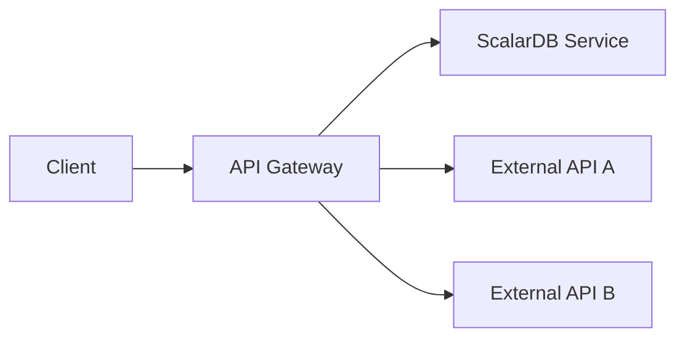
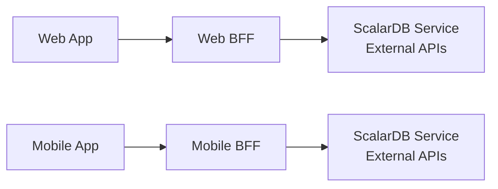
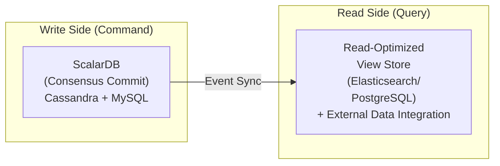
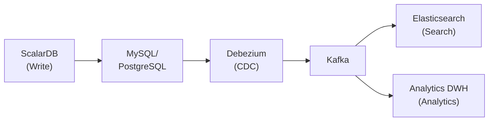
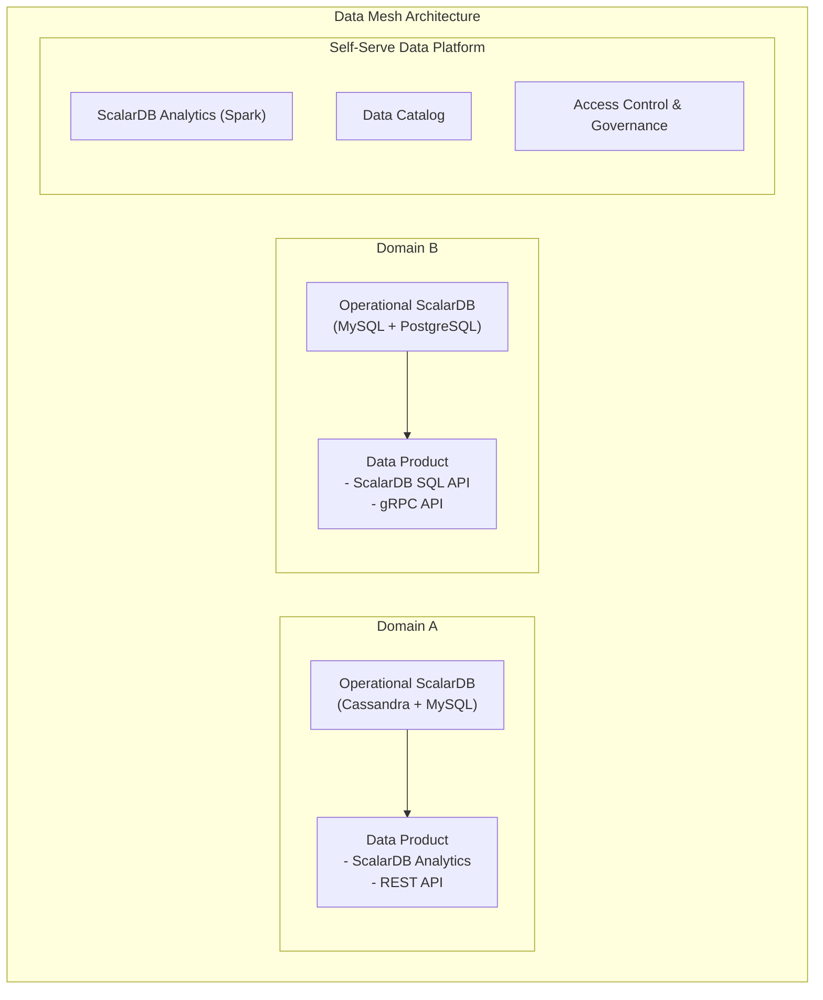

# Transparent Data Access Pattern Research

---

## 1. Data Access Patterns Under ScalarDB Management

### 1.1 Cross-Database Queries with ScalarDB Analytics

ScalarDB Analytics is a component that integrates multiple heterogeneous databases managed by ScalarDB (PostgreSQL, MySQL, Cassandra, DynamoDB, etc.) into a single logical database, enabling the execution of analytical queries.

**Architecture Components:**

- **Universal Data Catalog**: A flexible metadata management system that organizes diverse data environments. It has a hierarchical structure of Catalog > Data Source > Namespace > Table
- **Query Engine Integration**: Currently supports Apache Spark as the query engine. Through a custom Spark catalog plugin (`ScalarDbAnalyticsCatalog`), registered data sources are exposed as Spark tables

**ScalarDB Analytics with PostgreSQL:**

Leveraging PostgreSQL's Foreign Data Wrapper (FDW) extension framework, it executes read-only analytical queries against databases managed by ScalarDB. All queries supported by PostgreSQL are available, including JOINs, aggregations, filtering, sorting, window functions, and lateral joins.

```sql
-- Cross-database JOIN example with ScalarDB Analytics with PostgreSQL
SELECT
    c.customer_id, c.name,
    o.order_id, o.timestamp,
    s.item_id, i.name AS item_name, s.count
FROM customer_service.customers c          -- Table on Cassandra
JOIN order_service.orders o                 -- Table on MySQL
    ON c.customer_id = o.customer_id
JOIN order_service.statements s
    ON o.order_id = s.order_id
JOIN order_service.items i
    ON s.item_id = i.item_id
WHERE c.credit_total > 1000;
```

**ScalarDB Analytics with Spark:**

Tables are referenced in the hierarchical format `<CATALOG_NAME>.<DATA_SOURCE_NAME>.<NAMESPACE_NAMES>.<TABLE_NAME>`.

```scala
// Cross-data source query with Spark SQL
val result = spark.sql("""
    SELECT ds1.customers.customer_service.customers.name,
           ds2.orders.order_service.orders.order_id
    FROM analytics_catalog.cassandra_ds.customer_service.customers
    JOIN analytics_catalog.mysql_ds.order_service.orders
    ON customers.customer_id = orders.customer_id
""")
```

**Applicable Conditions:**
- When analytics/reporting across multiple databases managed by ScalarDB is needed
- When read-only cross-database JOINs are required
- When there is demand for ad-hoc analysis

**Advantages:**
- Transparently queryable with standard SQL (PostgreSQL-compatible or Spark SQL)
- No need for data joining logic on the application side
- High compatibility with existing BI tools and data analysis tools

**Disadvantages:**
- Read-only (cannot be used for write transactions)
- Only targets data under ScalarDB management
- The FDW approach has some limitations on real-time capabilities

### 1.2 Multi-Storage Transactions

ScalarDB's multi-storage feature maintains a mapping between namespaces and storage instances, automatically selecting the appropriate storage when executing operations.

**Configuration Example:**

```properties
# Transaction manager configuration
scalar.db.transaction_manager=consensus-commit
scalar.db.storage=multi-storage

# Storage definitions
scalar.db.multi_storage.storages=cassandra,mysql

# Cassandra configuration
scalar.db.multi_storage.storages.cassandra.storage=cassandra
scalar.db.multi_storage.storages.cassandra.contact_points=localhost
scalar.db.multi_storage.storages.cassandra.username=cassandra
scalar.db.multi_storage.storages.cassandra.password=cassandra

# MySQL configuration
scalar.db.multi_storage.storages.mysql.storage=jdbc
scalar.db.multi_storage.storages.mysql.contact_points=jdbc:mysql://localhost:3306/
scalar.db.multi_storage.storages.mysql.username=root
scalar.db.multi_storage.storages.mysql.password=mysql

# Namespace mapping
scalar.db.multi_storage.namespace_mapping=customer_service:cassandra,order_service:mysql
scalar.db.multi_storage.default_storage=cassandra
```

**Consensus Commit Protocol:**

Consensus Commit, the core of ScalarDB, achieves ACID transactions using optimistic concurrency control (OCC) and a variant of two-phase commit, without depending on the transaction capabilities of the underlying databases.

- **Read Phase**: The transaction reads data and tracks the read set
- **Validation Phase**: Validates for conflicts at commit time
- **Write Phase**: Executed in sub-phases: prepare-records -> validate-records -> commit-state -> commit-records

**Isolation Levels:**

| Level | Characteristics | Performance |
|-------|----------------|-------------|
| **SNAPSHOT** (default) | Provides Snapshot Isolation. Write Skew is possible (Read Skew is prevented). Suitable for most use cases | High |
| **SERIALIZABLE** | Achieves full Serializability through Extra-Read (anti-dependency check). Additional overhead from extra Read operations | Low |
| **READ_COMMITTED** | Provides Read Committed isolation level. Suitable for scenarios requiring lightweight isolation | High |

### 1.3 Unified SQL Interface

ScalarDB SQL is a layer that parses SQL and converts it into ScalarDB API operations. It provides a JDBC-compliant driver, enabling unified access from standard Java JDBC applications to heterogeneous databases managed by ScalarDB.

```java
// ScalarDB JDBC connection
String url = "jdbc:scalardb:scalardb.properties";
try (Connection conn = DriverManager.getConnection(url)) {
    conn.setAutoCommit(false);

    // Operate on the customer table on Cassandra and the order table on MySQL
    // within the same transaction
    PreparedStatement ps1 = conn.prepareStatement(
        "UPDATE customer_service.customers SET credit_total = credit_total + ? WHERE customer_id = ?"
    );
    ps1.setInt(1, amount);
    ps1.setInt(2, customerId);
    ps1.executeUpdate();

    PreparedStatement ps2 = conn.prepareStatement(
        "INSERT INTO order_service.orders (order_id, customer_id, timestamp) VALUES (?, ?, ?)"
    );
    ps2.setString(1, orderId);
    ps2.setInt(2, customerId);
    ps2.setLong(3, System.currentTimeMillis());
    ps2.executeUpdate();

    conn.commit(); // Consensus Commit guarantees ACID across heterogeneous DBs
}
```

**Supported JDBC-Compatible Databases:** MariaDB, Microsoft SQL Server, MySQL, Oracle Database, PostgreSQL, SQLite, Amazon Aurora, YugabyteDB, etc.

### 1.4 Scan Operation Constraints

ScalarDB's Scan operations have important constraints regarding data access patterns.

| Constraint | Details |
|-----------|---------|
| **Intra-Partition Scan** | By default, Scan operations work within a single partition (clustering key range) |
| **Cross-Partition Scan** | To perform Scans across partitions, the setting `scalar.db.cross_partition_scan.enabled=true` is required |
| **Non-JDBC Database Limitations** | For non-JDBC databases such as Cassandra and DynamoDB, cross-partition Scan capabilities may be limited |

> **Note**: When designing data access patterns, it is recommended to design partition keys and clustering keys so that Scan operations are confined within partitions. Cross-partition Scans have a significant performance impact and should be kept to a minimum.

---

## 2. Integrated Access with Data Outside ScalarDB Management

Application-level patterns are required for integration with data sources outside ScalarDB management (SaaS APIs, legacy systems, other teams' microservices, etc.).

### 2.1 API Gateway Pattern



**Implementation Example (Spring Cloud Gateway + WebFlux):**

```java
@RestController
@RequestMapping("/api/v1/dashboard")
public class DashboardController {

    private final ScalarDbOrderService scalarDbOrders;  // ScalarDB managed
    private final ExternalInventoryClient inventoryApi;  // External API

    @GetMapping("/customer/{id}")
    public Mono<DashboardResponse> getCustomerDashboard(@PathVariable String id) {
        // Fetch ScalarDB data and external API data concurrently
        Mono<CustomerOrders> orders = Mono.fromCallable(
            () -> scalarDbOrders.getOrdersByCustomerId(id)
        ).subscribeOn(Schedulers.boundedElastic());

        Mono<InventoryStatus> inventory = inventoryApi.getStatus(id);

        return Mono.zip(orders, inventory)
            .map(tuple -> new DashboardResponse(tuple.getT1(), tuple.getT2()));
    }
}
```

**Applicable Conditions:** When providing a unified endpoint to clients

**Advantages:** Reduces client complexity, centralizes authentication and rate limiting

**Disadvantages:** Risk of single point of failure, increased latency

### 2.2 Backend for Frontend (BFF) Pattern



**Applicable Conditions:** When optimized data aggregation is needed for different clients (Web, mobile, IoT)

**Advantages:** Enables client-specific optimization

**Disadvantages:** Code increases proportionally to the number of BFFs, and duplicated logic may arise

### 2.3 Federated Query

A technique for accessing multiple heterogeneous data sources cross-sectionally through a single query. ScalarDB Analytics' Spark integration can also register non-ScalarDB-managed data sources as Spark tables, effectively functioning as a federated query engine.

```scala
// Federated query across ScalarDB-managed and non-ScalarDB-managed data
spark.sql("""
    SELECT
        scalardb_catalog.cassandra.customer_service.customers.name,
        external_catalog.s3.analytics.click_events.page_views
    FROM scalardb_catalog.cassandra.customer_service.customers
    JOIN external_catalog.s3.analytics.click_events
    ON customers.customer_id = click_events.user_id
    WHERE click_events.event_date >= '2026-01-01'
""")
```

Other alternatives include Apache Presto/Trino, Google BigQuery Omni, and AWS Athena Federated Query.

---

## 3. Hybrid Patterns

### 3.1 Combining with the CQRS Pattern

The write side (Command) leverages ScalarDB's transaction guarantees, while the read side (Query) provides pre-joined read-only views.



```java
// CQRS write side: ScalarDB transaction
@Transactional
public void placeOrder(OrderCommand cmd) {
    // ScalarDB multi-storage transaction
    customerRepo.updateCredit(cmd.getCustomerId(), cmd.getAmount());
    orderRepo.createOrder(cmd.toOrder());
    // Publish event (trigger for read side update)
    eventPublisher.publish(new OrderPlacedEvent(cmd));
}

// CQRS read side: integrated view
@Service
public class OrderQueryService {
    private final ElasticsearchClient esClient; // Pre-joined view

    public OrderDetailView getOrderDetail(String orderId) {
        // Read from view where ScalarDB data + external data are integrated
        return esClient.get("order_details", orderId, OrderDetailView.class);
    }
}
```

### 3.2 Caching Strategy (Redis, etc.)

```java
@Service
public class CachedDataAccessService {

    private final RedisTemplate<String, Object> redis;
    private final ScalarDbRepository scalarDbRepo;
    private final ExternalApiClient externalApi;

    public UnifiedCustomerView getCustomerView(String customerId) {
        String cacheKey = "customer_view:" + customerId;

        // Check cache hit
        UnifiedCustomerView cached = (UnifiedCustomerView) redis.opsForValue().get(cacheKey);
        if (cached != null) return cached;

        // Retrieve core data from ScalarDB
        Customer customer = scalarDbRepo.getCustomer(customerId);
        List<Order> orders = scalarDbRepo.getOrders(customerId);

        // Retrieve supplementary data from external API
        LoyaltyPoints loyalty = externalApi.getLoyaltyPoints(customerId);

        // Build integrated view & cache
        UnifiedCustomerView view = UnifiedCustomerView.of(customer, orders, loyalty);
        redis.opsForValue().set(cacheKey, view, Duration.ofMinutes(5));

        return view;
    }
}
```

**Applicable Conditions:** When read frequency is high and slight data staleness is acceptable

**Advantages:** Significant latency improvement, reduced load on backend systems

**Disadvantages:** Complexity of cache invalidation, trade-off between data freshness and consistency

### 3.3 Synchronization via Change Data Capture (CDC)

ScalarDB itself does not have native CDC capabilities, but it is possible to use CDC tools (such as Debezium) on the underlying databases managed by ScalarDB (MySQL, PostgreSQL, etc.) to capture change events and propagate them to downstream systems.



**Important Note:** ScalarDB adds Consensus Commit protocol metadata columns (`tx_id`, `tx_state`, `tx_version`, etc.) to tables, so filtering that accounts for these metadata columns is necessary when capturing changes via CDC. The design should propagate only committed records (`tx_state = COMMITTED`).

### 3.4 Materialized View

```java
// Periodically join ScalarDB data with external data to update the materialized view
@Scheduled(fixedRate = 300000) // Every 5 minutes
public void refreshMaterializedView() {
    // Retrieve latest data from ScalarDB
    List<Customer> customers = scalarDbRepo.getAllCustomers();
    List<Order> recentOrders = scalarDbRepo.getRecentOrders(Duration.ofHours(1));

    // Retrieve data from external systems
    Map<String, ShippingStatus> shippingStatuses =
        shippingApi.getBulkStatus(recentOrders.stream()
            .map(Order::getOrderId).collect(toList()));

    // Update materialized view
    List<OrderDashboardRow> rows = recentOrders.stream()
        .map(order -> OrderDashboardRow.builder()
            .order(order)
            .customer(customerMap.get(order.getCustomerId()))
            .shipping(shippingStatuses.get(order.getOrderId()))
            .build())
        .collect(toList());

    viewStore.bulkUpsert("order_dashboard", rows);
}
```

---

## 4. API Composition Pattern

An API Composer calls APIs from multiple services and joins data in-memory.

```java
@Service
public class OrderSummaryComposer {

    private final ScalarDbCustomerRepository customerRepo; // ScalarDB managed
    private final ScalarDbOrderRepository orderRepo;        // ScalarDB managed
    private final ExternalShippingClient shippingClient;    // External API
    private final ExternalPaymentClient paymentClient;      // External API

    public OrderSummary compose(String orderId) {
        // 1. Retrieve data within a ScalarDB transaction
        Order order = orderRepo.findById(orderId);
        Customer customer = customerRepo.findById(order.getCustomerId());

        // 2. Retrieve data from external APIs (concurrent execution)
        CompletableFuture<ShippingInfo> shippingFuture =
            CompletableFuture.supplyAsync(() -> shippingClient.getStatus(orderId));
        CompletableFuture<PaymentInfo> paymentFuture =
            CompletableFuture.supplyAsync(() -> paymentClient.getStatus(orderId));

        // 3. In-memory join
        return OrderSummary.builder()
            .order(order)
            .customer(customer)
            .shipping(shippingFuture.join())
            .payment(paymentFuture.join())
            .build();
    }
}
```

**Applicable Conditions:** When a read view combining data from multiple services is needed

**Advantages:** Simple and easy to understand, no changes required to existing services

**Disadvantages:** Performance degradation with large data volumes due to in-memory joins, complex handling of partial failures

---

## 5. Cross-Cutting Queries with ScalarDB Analytics

### 5.1 Spark Integration Setup

Three core elements need to be configured:

1. **ScalarDB Analytics Package**: Add JAR dependencies matching the Spark and Scala versions
2. **Metering Listener**: Register `com.scalar.db.analytics.spark.metering.ScalarDbAnalyticsListener` to track resource usage
3. **Catalog Registration**: Configure a Spark catalog that connects to the ScalarDB Analytics server

### 5.2 Development Approaches

Three methods are supported:

- **Spark Driver Application**: Traditional cluster-based applications using SparkSession
- **Spark Connect Application**: Remote applications using the Spark Connect protocol
- **JDBC Application**: Remote applications using JDBC (depends on managed service)

### 5.3 Cross-Data Source Query Example

```python
# PySpark + ScalarDB Analytics cross-DB aggregation
from pyspark.sql import SparkSession

spark = SparkSession.builder \
    .appName("CrossServiceReport") \
    .config("spark.jars.packages", "com.scalar-labs:scalardb-analytics-spark-xxx") \
    .config("spark.sql.catalog.scalardb", "com.scalar.db.analytics.spark.ScalarDbAnalyticsCatalog") \
    .config("spark.sql.catalog.scalardb.server.uri", "grpc://analytics-server:60053") \
    .getOrCreate()

# Cross-database aggregation query
daily_report = spark.sql("""
    SELECT
        DATE(o.timestamp) as order_date,
        c.region,
        COUNT(DISTINCT o.order_id) as order_count,
        SUM(s.price * s.count) as total_revenue,
        COUNT(DISTINCT o.customer_id) as unique_customers
    FROM scalardb.cassandra_ds.customer_service.customers c
    JOIN scalardb.mysql_ds.order_service.orders o
        ON c.customer_id = o.customer_id
    JOIN scalardb.mysql_ds.order_service.statements s
        ON o.order_id = s.order_id
    WHERE o.timestamp >= current_date() - INTERVAL 1 DAY
    GROUP BY DATE(o.timestamp), c.region
    ORDER BY order_date, c.region
""")

daily_report.write.mode("overwrite").parquet("/reports/daily_revenue/")
```

---

## 6. Positioning of ScalarDB in Data Mesh

### 6.1 ScalarDB as a Data Product

In the context of Data Mesh, ScalarDB can serve the following roles.



**Value Provided by ScalarDB as a Data Product:**
- **Transactional Consistency**: Provides ACID guarantees across multiple data sources within a domain
- **Storage Abstraction**: Hides differences in underlying databases and exposes a unified interface
- **Analytical Access**: Provides standard SQL access via ScalarDB Analytics

### 6.2 Self-Serve Platform

ScalarDB Analytics functions as a component of the self-serve data platform in Data Mesh.

- **Universal Data Catalog**: Registers and manages data products from each domain as a catalog
- **Spark Query Engine**: Enables self-serve execution of cross-domain analytical queries
- **Data Type Mapping**: Automatically resolves type differences between heterogeneous databases

### 6.3 ScalarDB Cluster Deployment Patterns

There are two main patterns for deploying ScalarDB Cluster in microservices.

**Shared-Cluster Pattern:**
Microservices share a single ScalarDB Cluster instance and access databases through the same instance.

**Separated-Cluster Pattern:**
Microservices use multiple ScalarDB Cluster instances. Typically, one microservice accesses one ScalarDB Cluster instance.

| Aspect | Shared-Cluster | Separated-Cluster |
|--------|---|---|
| **API Interface** | One-phase commit | Two-phase commit |
| **Resource Usage** | Low | High |
| **Isolation Level** | Weak | Strong |
| **Complexity** | Simple | Complex |
| **Management** | Centralized | Distributed |

The documentation "recommends using the Shared-Cluster pattern whenever possible." However, the Separated-Cluster pattern is necessary when resource isolation requirements outweigh operational complexity.

### 6.4 Extending Data Access with Virtual Tables (ScalarDB 3.17)

**Virtual Tables**, introduced in ScalarDB 3.17, is a feature for **Transaction Metadata Decoupling**. Specifically, it separates data columns and transaction metadata columns (`tx_id`, `tx_state`, `tx_version`, `tx_prepared_at`, `tx_committed_at`, `before_*`, etc.) into different physical tables and joins them at runtime by primary key to treat them as a single logical table.

> **Note**: Virtual Tables is not a general-purpose arbitrary table join feature. It is a specialized feature for joining data tables and metadata tables with the same primary key, and is not a substitute for general JOIN operations.

**Benefits of Transaction Metadata Decoupling:**
- By separating transaction metadata columns from data tables, existing applications and tools (CDC, BI tools, etc.) can access data tables without being affected by metadata columns
- Metadata separation may simplify CDC connector configuration in some cases

**Transparent Integration of Index Tables:**
Previously, index tables (reverse lookup tables) as alternatives to Secondary Indexes had to be managed manually, but Virtual Tables logically integrates base tables and index tables, allowing applications to treat them as a single table.

**Cross-Service Master Data Reference:**
In some cases, master data managed by different microservices can be logically joined through Virtual Tables, enabling integrated reference without using API Composition.

---

## Sources

- [ScalarDB Analytics Design](https://scalardb.scalar-labs.com/docs/latest/scalardb-analytics/design/)
- [Multi-Storage Transactions](https://scalardb.scalar-labs.com/docs/latest/multi-storage-transactions/)
- [Consensus Commit Protocol](https://scalardb.scalar-labs.com/docs/latest/consensus-commit/)
- [Transactions with a Two-Phase Commit Interface](https://scalardb.scalar-labs.com/docs/latest/two-phase-commit-transactions/)
- [ScalarDB JDBC Guide](https://scalardb.scalar-labs.com/docs/latest/scalardb-sql/jdbc-guide/)
- [ScalarDB Cluster Deployment Patterns for Microservices](https://scalardb.scalar-labs.com/docs/latest/scalardb-cluster/deployment-patterns-for-microservices/)
- [Create a Sample Application That Supports Microservice Transactions](https://scalardb.scalar-labs.com/docs/latest/scalardb-samples/microservice-transaction-sample/)
- [Run Analytical Queries Through ScalarDB Analytics](https://scalardb.scalar-labs.com/docs/latest/scalardb-analytics/run-analytical-queries/)
- [Getting Started with ScalarDB Analytics with PostgreSQL](https://scalardb.scalar-labs.com/docs/latest/scalardb-analytics-postgresql/getting-started/)
- [ScalarDB: Universal Transaction Manager for Polystores (VLDB)](https://dl.acm.org/doi/10.14778/3611540.3611563)
- [Microservices Pattern: API Composition](https://microservices.io/patterns/data/api-composition.html)
- [Microservices Pattern: CQRS](https://microservices.io/patterns/data/cqrs.html)
- [GitHub - ScalarDB](https://github.com/scalar-labs/scalardb)
