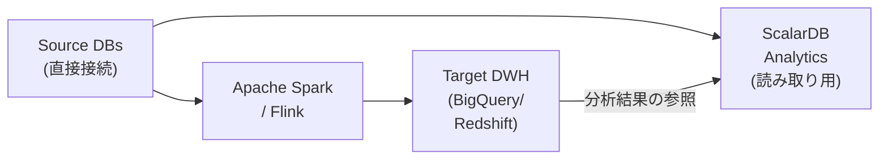
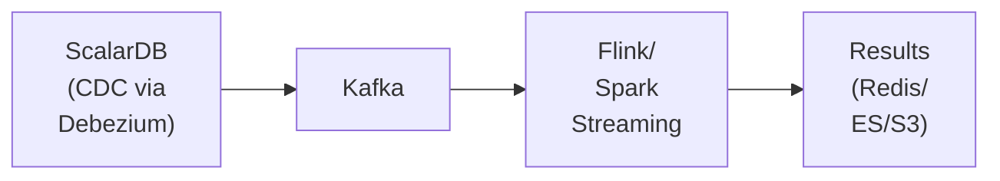
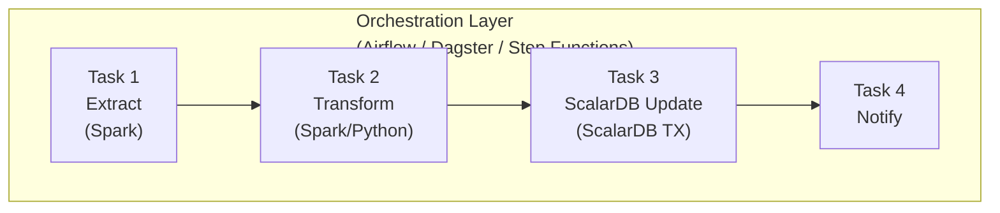

# バッチ処理パターン調査

---

## 0. API変更に関する重要な注意

> **注意**: 本ドキュメントのコード例では一部 `Put` APIを使用しているが、`Put` は **ScalarDB 3.13 で非推奨（deprecated）** となっている。新規開発では `Insert`（新規作成）、`Update`（既存更新）、`Upsert`（存在すれば更新、なければ挿入）を使い分けること。

#### Put API → 新API変換ルール

| 旧パターン | 新パターン | 説明 |
|-----------|-----------|------|
| `Put`（既存有無不明） | `Upsert` | 存在すれば更新、存在しなければ挿入 |
| `Put`（新規保証） | `Insert` | 新規レコード作成 |
| `Put`（既存保証） | `Update` | 既存レコード更新 |
| `Put` + `ifExists` | `Update` | 存在する場合のみ更新 |
| `Put` + `ifNotExists` | `Insert` | 存在しない場合のみ挿入 |

---

## 1. ScalarDBが有効なバッチ処理ケース

### 1.1 マルチデータベース間のデータ整合性が必要なバッチ

**ケース:** 月次請求処理で、顧客マスタ（Cassandra）と注文履歴（MySQL）を結合し、請求額を計算して両データベースを更新する。

```java
@Service
public class MonthlyBillingBatch {

    private final TwoPhaseCommitTransactionManager txManager;

    public void executeBilling(YearMonth billingMonth) {
        List<String> customerIds = getActiveCustomerIds();

        for (List<String> chunk : Lists.partition(customerIds, 100)) {
            processChunk(chunk, billingMonth);
        }
    }

    private void processChunk(List<String> customerIds, YearMonth month) {
        TwoPhaseCommitTransaction tx = txManager.start();
        try {
            for (String customerId : customerIds) {
                // Cassandraから顧客情報取得
                Optional<Result> customer = tx.get(Get.newBuilder()
                    .namespace("customer_service").table("customers")
                    .partitionKey(Key.ofText("customer_id", customerId))
                    .build());

                // MySQLから当月注文取得・集計
                List<Result> orders = tx.scan(Scan.newBuilder()
                    .namespace("order_service").table("orders")
                    .partitionKey(Key.ofText("customer_id", customerId))
                    .build());

                int totalAmount = calculateBillingAmount(orders, month);

                // Cassandra上の顧客クレジットを更新
                tx.put(Put.newBuilder()
                    .namespace("customer_service").table("customers")
                    .partitionKey(Key.ofText("customer_id", customerId))
                    .intValue("credit_total", totalAmount)
                    .build());

                // MySQL上の請求レコードを作成
                tx.put(Put.newBuilder()
                    .namespace("billing_service").table("invoices")
                    .partitionKey(Key.ofText("invoice_id", generateInvoiceId()))
                    .textValue("customer_id", customerId)
                    .intValue("amount", totalAmount)
                    .build());
            }

            tx.prepare();
            tx.validate();
            tx.commit();
        } catch (Exception e) {
            tx.rollback();
            throw new BatchProcessingException("Chunk processing failed", e);
        }
    }
}
```

> **注意**: 上記の例は複数のScalarDB Clusterインスタンスにまたがるケースを想定しています。単一のScalarDB Clusterインスタンスで全DBをMulti-Storage構成で管理する場合は、`DistributedTransactionManager`（1PC）を使用する方がオーバーヘッドが少なく効率的です。

**設計指針:**
- チャンクサイズはトランザクションタイムアウトとメモリを考慮して決定（目安: 50-200件）
- ScalarDBのOCCは競合が少ない場合に最適であるため、バッチ処理中はオンライン処理との競合を最小化する
- Consensus Commitのメタデータオーバーヘッドを考慮し、大量レコードの場合はチャンクを小さくする

### 1.2 トランザクション保証が必要な大量データ更新

**ケース:** 価格改定バッチ（複数データベースにまたがる商品情報の一括更新）

```java
public class PriceRevisionBatch {

    private static final int CHUNK_SIZE = 50;
    private static final int MAX_RETRIES = 3;

    public BatchResult execute(List<PriceRevision> revisions) {
        BatchResult result = new BatchResult();

        for (List<PriceRevision> chunk : Lists.partition(revisions, CHUNK_SIZE)) {
            retryWithBackoff(() -> {
                DistributedTransaction tx = txManager.start();
                try {
                    for (PriceRevision rev : chunk) {
                        // 商品マスタ更新（PostgreSQL）
                        tx.put(Put.newBuilder()
                            .namespace("product_service").table("products")
                            .partitionKey(Key.ofInt("product_id", rev.getProductId()))
                            .intValue("price", rev.getNewPrice())
                            .build());

                        // 在庫評価額更新（Cassandra）
                        tx.put(Put.newBuilder()
                            .namespace("inventory_service").table("inventory_values")
                            .partitionKey(Key.ofInt("product_id", rev.getProductId()))
                            .intValue("unit_value", rev.getNewPrice())
                            .build());
                    }
                    tx.commit();
                    result.addSuccess(chunk.size());
                } catch (Exception e) {
                    tx.abort();
                    throw e;
                }
            }, MAX_RETRIES);
        }
        return result;
    }

    private void retryWithBackoff(Runnable task, int maxRetries) {
        for (int attempt = 1; attempt <= maxRetries; attempt++) {
            try {
                task.run();
                return;
            } catch (TransactionConflictException e) {
                if (attempt == maxRetries) throw e;
                sleepWithExponentialBackoff(attempt);
            }
        }
    }
}
```

### 1.3 クロスサービスのデータ集計・レポーティング

ScalarDB Analyticsを活用した分析バッチ。

```python
# PySpark + ScalarDB Analytics によるクロスDB集計バッチ
from pyspark.sql import SparkSession

spark = SparkSession.builder \
    .appName("CrossServiceReport") \
    .config("spark.jars.packages", "com.scalar-labs:scalardb-analytics-spark-xxx") \
    .config("spark.sql.catalog.scalardb", "com.scalar.db.analytics.spark.ScalarDbAnalyticsCatalog") \
    .config("spark.sql.catalog.scalardb.server.uri", "grpc://analytics-server:60053") \
    .getOrCreate()

# クロスデータベース集計クエリ
daily_report = spark.sql("""
    SELECT
        DATE(o.timestamp) as order_date,
        c.region,
        COUNT(DISTINCT o.order_id) as order_count,
        SUM(s.price * s.count) as total_revenue,
        COUNT(DISTINCT o.customer_id) as unique_customers
    FROM scalardb.cassandra_ds.customer_service.customers c
    JOIN scalardb.mysql_ds.order_service.orders o
        ON c.customer_id = o.customer_id
    JOIN scalardb.mysql_ds.order_service.statements s
        ON o.order_id = s.order_id
    WHERE o.timestamp >= current_date() - INTERVAL 1 DAY
    GROUP BY DATE(o.timestamp), c.region
    ORDER BY order_date, c.region
""")

daily_report.write.mode("overwrite").parquet("/reports/daily_revenue/")
```

---

## 2. ScalarDBが無効なバッチ処理ケース

### 2.1 超大量データのETL処理

**ScalarDBが適さない理由:**

- **Consensus Commitのオーバーヘッド**: 各レコードにメタデータカラム（`tx_id`, `tx_state`, `tx_version`等）が付加され、トランザクションごとにprepare→validate→commitのフェーズが必要。数億レコードのETLではこのオーバーヘッドが致命的
- **楽観的並行性制御の限界**: 大量データの同時更新では競合率が上がり、リトライが頻発
- **スキャン制約**: 非JDBCデータベースではパーティションキーなしのスキャンでシリアライザビリティが保証されない

**代替パターン:**



```python
# 大量ETL: Sparkで直接データベースから読み取り
customers_df = spark.read \
    .format("jdbc") \
    .option("url", "jdbc:postgresql://host:5432/customers") \
    .option("dbtable", "customers") \
    .option("partitionColumn", "customer_id") \
    .option("lowerBound", 1) \
    .option("upperBound", 10000000) \
    .option("numPartitions", 100) \
    .load()

# 大量変換・ロード（ScalarDBを介さない）
transformed = customers_df \
    .filter(col("status") == "active") \
    .groupBy("region") \
    .agg(sum("lifetime_value").alias("total_ltv"))

transformed.write \
    .format("bigquery") \
    .option("table", "analytics.customer_ltv_summary") \
    .mode("overwrite") \
    .save()
```

### 2.2 ストリーム処理（Apache Spark Streaming, Flink）

**ScalarDBが適さない理由:**
- ストリーム処理はイベント単位のミリ秒レベルの処理が求められ、Consensus Commitのレイテンシが許容されない
- ウィンドウ集計やイベント時間処理などストリーム特有のセマンティクスをScalarDBは提供しない

**代替パターン:**



```java
// Flink + Kafkaによるリアルタイム処理
StreamExecutionEnvironment env = StreamExecutionEnvironment.getExecutionEnvironment();

// ScalarDB管理DBからCDCで変更を受信
DataStream<OrderEvent> orders = env
    .addSource(new FlinkKafkaConsumer<>("scalardb.order_service.orders",
        new OrderEventDeserializer(), kafkaProps));

// ストリーム処理（ウィンドウ集計）
DataStream<RevenueMetric> revenue = orders
    .filter(e -> e.getTxState().equals("COMMITTED")) // ScalarDBコミット済みのみ
    .keyBy(OrderEvent::getRegion)
    .window(TumblingEventTimeWindows.of(Time.minutes(5)))
    .aggregate(new RevenueAggregator());

revenue.addSink(new ElasticsearchSink<>(esConfig, new RevenueIndexer()));
```

### 2.3 機械学習パイプライン

**ScalarDBが適さない理由:**
- 大量の特徴量データの読み出しにトランザクションオーバーヘッドが不要
- MLフレームワーク（TensorFlow, PyTorch, scikit-learn）との統合インターフェースがない
- ベクトル演算やGPU処理との親和性がない

**代替パターン & ScalarDBとの連携:**

```python
# MLパイプライン: ScalarDB Analyticsで特徴量を抽出し、MLに渡す
# Step 1: ScalarDB Analyticsで特徴量抽出
features_df = spark.sql("""
    SELECT
        c.customer_id,
        c.credit_limit,
        COUNT(o.order_id) as order_count,
        AVG(s.price * s.count) as avg_order_value,
        MAX(o.timestamp) as last_order_date
    FROM scalardb.cassandra.customer_service.customers c
    LEFT JOIN scalardb.mysql.order_service.orders o ON c.customer_id = o.customer_id
    LEFT JOIN scalardb.mysql.order_service.statements s ON o.order_id = s.order_id
    GROUP BY c.customer_id, c.credit_limit
""")

# Step 2: Parquet/Delta Lakeに特徴量を保存
features_df.write.parquet("/ml/features/customer_features/")

# Step 3: MLモデルのトレーニング（ScalarDB外で実行）
from sklearn.ensemble import RandomForestClassifier
import pandas as pd

features = pd.read_parquet("/ml/features/customer_features/")
model = RandomForestClassifier()
model.fit(features[feature_cols], features[target_col])

# Step 4: 予測結果をScalarDBに書き戻す（必要に応じて）
# ScalarDB JDBC経由でトランザクション付き書き込み
for prediction in predictions:
    conn.execute(
        "UPDATE customer_service.customers SET churn_risk = ? WHERE customer_id = ?",
        prediction.score, prediction.customer_id
    )
```

### 2.4 ScalarDBと非ScalarDBバッチの連携方法



**設計原則:** ETLの重い処理はSpark/Flink等のネイティブツールで実行し、トランザクション整合性が必要な最終書き込みフェーズのみScalarDBを使用する。

---

## 3. Spring Batch + ScalarDB統合パターン

ScalarDBはSpring Data JDBC統合を提供しており、Spring Batchとの組み合わせが可能である。

### 3.1 基本構成

```java
@Configuration
@EnableBatchProcessing
public class ScalarDbBatchConfig {

    @Bean
    public Job monthlyBillingJob(JobRepository jobRepository, Step billingStep) {
        return new JobBuilder("monthlyBillingJob", jobRepository)
            .start(billingStep)
            .build();
    }

    @Bean
    public Step billingStep(JobRepository jobRepository,
                            PlatformTransactionManager txManager) {
        return new StepBuilder("billingStep", jobRepository)
            .<Customer, BillingRecord>chunk(50, txManager) // ScalarDBトランザクション管理
            .reader(customerReader())
            .processor(billingProcessor())
            .writer(billingWriter())
            .faultTolerant()
            .retryLimit(3)
            .retry(TransactionConflictException.class)    // OCC競合リトライ
            .skipLimit(10)
            .skip(ValidationException.class)
            .listener(billingStepListener())
            .build();
    }

    @Bean
    public ItemReader<Customer> customerReader() {
        // ScalarDB JDBC経由で顧客データを読み取り
        return new JdbcCursorItemReaderBuilder<Customer>()
            .dataSource(scalarDbDataSource())
            .sql("SELECT customer_id, name, credit_limit, credit_total " +
                 "FROM customer_service.customers WHERE status = 'ACTIVE'")
            .rowMapper(new CustomerRowMapper())
            .build();
    }

    @Bean
    public ItemWriter<BillingRecord> billingWriter() {
        // ScalarDB JDBC経由でマルチストレージ書き込み
        return new JdbcBatchItemWriterBuilder<BillingRecord>()
            .dataSource(scalarDbDataSource())
            .sql("INSERT INTO billing_service.invoices " +
                 "(invoice_id, customer_id, amount, billing_date) " +
                 "VALUES (?, ?, ?, ?)")
            .itemPreparedStatementSetter(new BillingRecordSetter())
            .build();
    }
}
```

### 3.2 Spring Data JDBC for ScalarDBの活用

Spring Data JDBC for ScalarDBはカスタムトランザクションマネージャを提供し、2PCトランザクションをSpringの`@Transactional`アノテーションで宣言的に管理できる。

```java
// Spring Data JDBC for ScalarDB でのリポジトリ定義
@Repository
public interface CustomerRepository extends CrudRepository<Customer, String> {
    @Query("SELECT * FROM customer_service.customers WHERE region = :region")
    List<Customer> findByRegion(@Param("region") String region);
}

// バッチプロセッサ
@Component
public class BillingProcessor implements ItemProcessor<Customer, BillingRecord> {

    @Autowired
    private OrderRepository orderRepository; // 別DBのリポジトリ

    @Override
    @Transactional // ScalarDBカスタムトランザクションマネージャが管理
    public BillingRecord process(Customer customer) {
        List<Order> orders = orderRepository.findByCustomerIdAndMonth(
            customer.getId(), YearMonth.now().minusMonths(1));
        return BillingRecord.calculate(customer, orders);
    }
}
```

---

## 4. Airflow/Dagsterによるオーケストレーション

### 4.1 Apache Airflow DAG

```python
# Airflow DAG: ScalarDBバッチと非ScalarDBバッチの混合パイプライン
from airflow import DAG
from airflow.operators.python import PythonOperator
from airflow.providers.apache.spark.operators.spark_submit import SparkSubmitOperator
from datetime import datetime, timedelta

default_args = {
    'retries': 3,
    'retry_delay': timedelta(minutes=5),
    'retry_exponential_backoff': True,
}

with DAG(
    'monthly_billing_pipeline',
    default_args=default_args,
    schedule_interval='0 2 1 * *',  # 毎月1日 AM2:00
    start_date=datetime(2026, 1, 1),
    catchup=False,
) as dag:

    # Task 1: 大量データ抽出（Spark直接、ScalarDB不使用）
    extract_data = SparkSubmitOperator(
        task_id='extract_raw_data',
        application='/jobs/extract_orders.py',
        conf={
            'spark.sql.catalog.scalardb':
                'com.scalar.db.analytics.spark.ScalarDbAnalyticsCatalog',
        },
    )

    # Task 2: データ変換（Spark、ScalarDB不使用）
    transform_data = SparkSubmitOperator(
        task_id='transform_billing_data',
        application='/jobs/transform_billing.py',
    )

    # Task 3: ScalarDBトランザクション付き更新（小〜中規模）
    update_scalardb = PythonOperator(
        task_id='update_billing_records',
        python_callable=update_billing_with_scalardb,
        op_kwargs={'chunk_size': 100, 'max_retries': 3},
    )

    # Task 4: レポート生成（ScalarDB Analytics）
    generate_report = SparkSubmitOperator(
        task_id='generate_billing_report',
        application='/jobs/billing_report.py',
    )

    # Task 5: 通知
    notify = PythonOperator(
        task_id='send_notification',
        python_callable=send_slack_notification,
    )

    extract_data >> transform_data >> update_scalardb >> generate_report >> notify
```

### 4.2 Dagsterによるアセットベースのオーケストレーション

```python
# Dagster版: より型安全なオーケストレーション
from dagster import asset, Definitions, AssetExecutionContext

@asset(
    description="ScalarDB Analyticsからクロスデータベース集計",
    group_name="billing"
)
def billing_aggregation(context: AssetExecutionContext):
    """ScalarDB Analytics (Spark) で注文データを集計"""
    spark = get_spark_session_with_scalardb()
    result = spark.sql("""
        SELECT customer_id, SUM(amount) as total_billing
        FROM scalardb.mysql.order_service.order_totals
        WHERE billing_month = current_date() - INTERVAL 1 MONTH
        GROUP BY customer_id
    """)
    result.write.parquet("/staging/billing_aggregation/")
    return {"record_count": result.count()}

@asset(
    deps=[billing_aggregation],
    description="ScalarDBトランザクションで請求レコードを更新",
    group_name="billing"
)
def billing_update(context: AssetExecutionContext):
    """トランザクション保証付きでScalarDBを更新"""
    records = read_parquet("/staging/billing_aggregation/")
    updated = update_billing_with_scalardb(records, chunk_size=100)
    return {"updated_count": updated}
```

---

## 5. チャンク処理 vs ストリーム処理

| 観点 | チャンク処理（ScalarDB向き） | ストリーム処理（ScalarDB不向き） |
|------|------------------------------|----------------------------------|
| **データ量** | 数千〜数百万件 | 無制限（連続） |
| **レイテンシ** | 秒〜分 | ミリ秒〜秒 |
| **整合性** | トランザクション保証可能 | Eventually Consistent が主流 |
| **ScalarDB適性** | 高い（チャンクごとのTX） | 低い（オーバーヘッド大） |
| **エラー処理** | チャンク単位のリトライ | レコード単位のリトライ |
| **ユースケース** | 月次集計、一括更新、マイグレーション | リアルタイムダッシュボード、アラート |

> **ScalarDB 3.17 新機能**: Batch Operations API（`transaction.batch()`）により、複数のミューテーション操作を単一リクエストにバッチ化可能。RPCラウンドトリップの削減によりバッチ処理の性能向上が期待できる。詳細は `13_scalardb_317_deep_dive.md` Section 2.3 参照。

**チャンクサイズの決定指針（ScalarDB固有）:**

```
推奨チャンクサイズ = min(
    トランザクションタイムアウト内で処理可能な件数,
    OCC競合が許容範囲に収まる件数,
    JVMヒープメモリが許容する読み取りセットサイズ
)

実践的な目安:
- 単純なPut/Get操作: 100-500件/チャンク
- スキャンを含む操作: 50-200件/チャンク
- クロスストレージ操作: 50-100件/チャンク
```

### トランザクション内メモリ管理

ScalarDBのOCCでは、Read Set / Write Setがトランザクション完了までメモリに保持される。バッチ処理では特に注意が必要。

#### チャンクサイズ別メモリ見積もり（1レコード1KB想定）

| チャンクサイズ | Read Set | Write Set | 合計/Tx | 100Tx同時の場合 |
|-------------|----------|-----------|---------|----------------|
| 50件 | 50KB | 50KB | ~100KB | ~10MB |
| 200件 | 200KB | 200KB | ~400KB | ~40MB |
| 500件 | 500KB | 500KB | ~1MB | ~100MB |

**設計原則**: 同時Txのメモリ消費をJVMヒープの10-20%以下に抑える。

**Scanを含む場合の注意**: `scan_fetch_size`（デフォルト10）× レコードサイズがRead Setに蓄積される。大きなパーティションをスキャンする場合、Scan結果のLimit指定を必須とする。

> **パフォーマンス最適化: Group Commit**: `scalar.db.consensus_commit.coordinator.group_commit.enabled=true` を設定すると、複数トランザクションのコミットリクエストをグループ化し、Coordinatorテーブルへの書き込み回数を削減できる。バッチ処理で多数の小さなトランザクションを連続実行するワークロードにおいて、スループットの大幅な向上が期待できる。（注意: Group Commitは2PC Interfaceとの併用不可。2PCを使用するトランザクションには適用されない）

---

## 6. リトライ戦略とエラーハンドリング

ScalarDBのConsensus Commitはオプティミスティック並行性制御（OCC）を使用するため、競合時のリトライ戦略が極めて重要である。

### 6.1 ScalarDB固有の例外に応じたリトライ戦略

```java
@Component
public class ScalarDbBatchRetryHandler {

    private static final int MAX_RETRIES = 5;
    private static final long BASE_DELAY_MS = 100;

    /**
     * ScalarDB固有の例外に応じたリトライ戦略
     */
    public <T> T executeWithRetry(Supplier<T> operation) {
        for (int attempt = 1; attempt <= MAX_RETRIES; attempt++) {
            try {
                return operation.get();
            } catch (TransactionConflictException e) {
                // OCC競合: 指数バックオフでリトライ
                if (attempt == MAX_RETRIES) {
                    log.error("Max retries reached for OCC conflict", e);
                    throw new BatchAbortException("OCC conflict unresolved", e);
                }
                long delay = BASE_DELAY_MS * (long) Math.pow(2, attempt - 1)
                           + ThreadLocalRandom.current().nextLong(50); // ジッター
                log.warn("OCC conflict on attempt {}, retrying in {}ms", attempt, delay);
                sleep(delay);

            } catch (UnknownTransactionStatusException e) {
                // トランザクション状態不明: コミット済みか確認が必要
                log.error("Unknown transaction status - manual verification required", e);
                recordForManualReview(e.getTransactionId());
                throw e; // リトライ不可

            } catch (TransactionException e) {
                // その他のトランザクションエラー: 即座に失敗
                log.error("Non-retryable transaction error", e);
                throw new BatchAbortException("Transaction failed", e);
            }
        }
        throw new IllegalStateException("Should not reach here");
    }
}
```

### 6.2 エラーハンドリングの設計パターン

```java
@Service
public class ResilientBatchProcessor {

    private final ScalarDbBatchRetryHandler retryHandler;
    private final DeadLetterQueue dlq;
    private final BatchMetrics metrics;

    public BatchReport processBatch(List<BatchItem> items) {
        BatchReport report = new BatchReport();

        for (List<BatchItem> chunk : Lists.partition(items, CHUNK_SIZE)) {
            try {
                retryHandler.executeWithRetry(() -> {
                    processChunkTransactionally(chunk);
                    return null;
                });
                report.recordSuccess(chunk.size());
                metrics.incrementProcessed(chunk.size());

            } catch (BatchAbortException e) {
                // チャンク失敗: Dead Letter Queueに送信
                dlq.send(chunk, e);
                report.recordFailure(chunk.size(), e.getMessage());
                metrics.incrementFailed(chunk.size());

                // 失敗率が閾値を超えたらバッチ全体を停止
                if (report.getFailureRate() > 0.1) { // 10%
                    throw new BatchHaltException(
                        "Failure rate exceeded threshold: " + report.getFailureRate());
                }
            }
        }
        return report;
    }
}
```

---

## 7. パターン選択ガイド

### 7.1 総合比較表

| シナリオ | 推奨パターン | ScalarDB活用度 |
|----------|-------------|----------------|
| ScalarDB管理下の複数DBの分析クエリ | ScalarDB Analytics (Spark/PostgreSQL) | 高 |
| マイクロサービス間のトランザクション | Two-Phase Commit Interface | 高 |
| クロスDB整合性が必要なバッチ更新 | Spring Batch + ScalarDB TX (チャンク) | 高 |
| 超大量ETL | Spark/Flink直接 + 最終書き込みのみScalarDB | 低 |
| リアルタイムストリーム処理 | Kafka + Flink (CDCで連携) | 低（CDC経由） |
| ML特徴量生成 | ScalarDB Analytics抽出 + MLパイプライン | 中（読み取りのみ） |
| 複合バッチパイプライン | Airflow/Dagster オーケストレーション | 混合 |

### 7.2 核心的な設計原則

1. **ScalarDBの強みを活かす場面**: マルチデータベース間のACIDトランザクション保証が必要な書き込み処理、および異種DB横断の読み取りクエリ
2. **ScalarDBを避けるべき場面**: 超大量データのスループット重視の処理、ミリ秒レベルのストリーム処理、GPU/ベクトル演算が必要なML処理
3. **ハイブリッドが最適解**: 実際の業務パイプラインでは、重いETL/ML処理はネイティブツールで実行し、整合性が必要な箇所のみScalarDBトランザクションを適用する「境界での整合性パターン」が最も実践的である

---

## Sources

- [ScalarDB Analytics Design](https://scalardb.scalar-labs.com/docs/latest/scalardb-analytics/design/)
- [Multi-Storage Transactions](https://scalardb.scalar-labs.com/docs/latest/multi-storage-transactions/)
- [Consensus Commit Protocol](https://scalardb.scalar-labs.com/docs/latest/consensus-commit/)
- [Transactions with a Two-Phase Commit Interface](https://scalardb.scalar-labs.com/docs/latest/two-phase-commit-transactions/)
- [ScalarDB JDBC Guide](https://scalardb.scalar-labs.com/docs/latest/scalardb-sql/jdbc-guide/)
- [ScalarDB Cluster Deployment Patterns for Microservices](https://scalardb.scalar-labs.com/docs/latest/scalardb-cluster/deployment-patterns-for-microservices/)
- [Create a Sample Application That Supports Microservice Transactions](https://scalardb.scalar-labs.com/docs/latest/scalardb-samples/microservice-transaction-sample/)
- [Run Analytical Queries Through ScalarDB Analytics](https://scalardb.scalar-labs.com/docs/latest/scalardb-analytics/run-analytical-queries/)
- [Getting Started with ScalarDB Analytics with PostgreSQL](https://scalardb.scalar-labs.com/docs/latest/scalardb-analytics-postgresql/getting-started/)
- [ScalarDB: Universal Transaction Manager for Polystores (VLDB)](https://dl.acm.org/doi/10.14778/3611540.3611563)
- [Guide of Spring Data JDBC for ScalarDB](https://scalardb.scalar-labs.com/docs/3.12/scalardb-sql/spring-data-guide/)
- [GitHub - ScalarDB](https://github.com/scalar-labs/scalardb)
