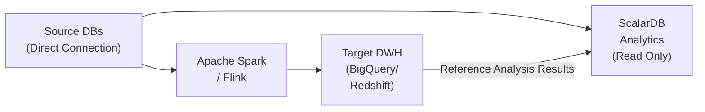
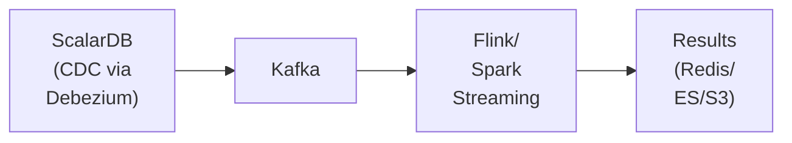
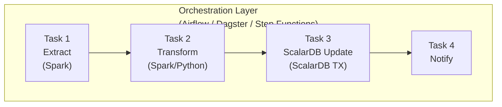

# Batch Processing Pattern Research

---

## 0. Important Note on API Changes

> **Note**: Some code examples in this document use the `Put` API, but `Put` was **deprecated in ScalarDB 3.13**. For new development, use `Insert` (create new), `Update` (update existing), and `Upsert` (update if exists, insert if not) appropriately.

#### Put API to New API Conversion Rules

| Old Pattern | New Pattern | Description |
|------------|------------|-------------|
| `Put` (existence unknown) | `Upsert` | Update if exists, insert if not |
| `Put` (guaranteed new) | `Insert` | Create new record |
| `Put` (guaranteed existing) | `Update` | Update existing record |
| `Put` + `ifExists` | `Update` | Update only if exists |
| `Put` + `ifNotExists` | `Insert` | Insert only if not exists |

---

## 1. Batch Processing Cases Where ScalarDB Is Effective

### 1.1 Batches Requiring Data Consistency Across Multiple Databases

**Case:** Monthly billing processing that joins customer master data (Cassandra) with order history (MySQL), calculates billing amounts, and updates both databases.

```java
@Service
public class MonthlyBillingBatch {

    private final TwoPhaseCommitTransactionManager txManager;

    public void executeBilling(YearMonth billingMonth) {
        List<String> customerIds = getActiveCustomerIds();

        for (List<String> chunk : Lists.partition(customerIds, 100)) {
            processChunk(chunk, billingMonth);
        }
    }

    private void processChunk(List<String> customerIds, YearMonth month) {
        TwoPhaseCommitTransaction tx = txManager.start();
        try {
            for (String customerId : customerIds) {
                // Retrieve customer information from Cassandra
                Optional<Result> customer = tx.get(Get.newBuilder()
                    .namespace("customer_service").table("customers")
                    .partitionKey(Key.ofText("customer_id", customerId))
                    .build());

                // Retrieve and aggregate current month's orders from MySQL
                List<Result> orders = tx.scan(Scan.newBuilder()
                    .namespace("order_service").table("orders")
                    .partitionKey(Key.ofText("customer_id", customerId))
                    .build());

                int totalAmount = calculateBillingAmount(orders, month);

                // Update customer credit on Cassandra
                tx.put(Put.newBuilder()
                    .namespace("customer_service").table("customers")
                    .partitionKey(Key.ofText("customer_id", customerId))
                    .intValue("credit_total", totalAmount)
                    .build());

                // Create billing record on MySQL
                tx.put(Put.newBuilder()
                    .namespace("billing_service").table("invoices")
                    .partitionKey(Key.ofText("invoice_id", generateInvoiceId()))
                    .textValue("customer_id", customerId)
                    .intValue("amount", totalAmount)
                    .build());
            }

            tx.prepare();
            tx.validate();
            tx.commit();
        } catch (Exception e) {
            tx.rollback();
            throw new BatchProcessingException("Chunk processing failed", e);
        }
    }
}
```

> **Note**: The above example assumes a case spanning multiple ScalarDB Cluster instances. When managing all DBs with a Multi-Storage configuration on a single ScalarDB Cluster instance, using `DistributedTransactionManager` (1PC) is more efficient with less overhead.

**Design Guidelines:**
- Determine chunk size considering transaction timeout and memory (guideline: 50-200 records)
- ScalarDB's OCC is optimal when contention is low, so minimize conflicts with online processing during batch processing
- Consider Consensus Commit metadata overhead and use smaller chunks for large record volumes

### 1.2 Large-Scale Data Updates Requiring Transaction Guarantees

**Case:** Price revision batch (bulk update of product information across multiple databases)

```java
public class PriceRevisionBatch {

    private static final int CHUNK_SIZE = 50;
    private static final int MAX_RETRIES = 3;

    public BatchResult execute(List<PriceRevision> revisions) {
        BatchResult result = new BatchResult();

        for (List<PriceRevision> chunk : Lists.partition(revisions, CHUNK_SIZE)) {
            retryWithBackoff(() -> {
                DistributedTransaction tx = txManager.start();
                try {
                    for (PriceRevision rev : chunk) {
                        // Update product master (PostgreSQL)
                        tx.put(Put.newBuilder()
                            .namespace("product_service").table("products")
                            .partitionKey(Key.ofInt("product_id", rev.getProductId()))
                            .intValue("price", rev.getNewPrice())
                            .build());

                        // Update inventory valuation (Cassandra)
                        tx.put(Put.newBuilder()
                            .namespace("inventory_service").table("inventory_values")
                            .partitionKey(Key.ofInt("product_id", rev.getProductId()))
                            .intValue("unit_value", rev.getNewPrice())
                            .build());
                    }
                    tx.commit();
                    result.addSuccess(chunk.size());
                } catch (Exception e) {
                    tx.abort();
                    throw e;
                }
            }, MAX_RETRIES);
        }
        return result;
    }

    private void retryWithBackoff(Runnable task, int maxRetries) {
        for (int attempt = 1; attempt <= maxRetries; attempt++) {
            try {
                task.run();
                return;
            } catch (TransactionConflictException e) {
                if (attempt == maxRetries) throw e;
                sleepWithExponentialBackoff(attempt);
            }
        }
    }
}
```

### 1.3 Cross-Service Data Aggregation and Reporting

Analytical batch leveraging ScalarDB Analytics.

```python
# PySpark + ScalarDB Analytics cross-DB aggregation batch
from pyspark.sql import SparkSession

spark = SparkSession.builder \
    .appName("CrossServiceReport") \
    .config("spark.jars.packages", "com.scalar-labs:scalardb-analytics-spark-xxx") \
    .config("spark.sql.catalog.scalardb", "com.scalar.db.analytics.spark.ScalarDbAnalyticsCatalog") \
    .config("spark.sql.catalog.scalardb.server.uri", "grpc://analytics-server:60053") \
    .getOrCreate()

# Cross-database aggregation query
daily_report = spark.sql("""
    SELECT
        DATE(o.timestamp) as order_date,
        c.region,
        COUNT(DISTINCT o.order_id) as order_count,
        SUM(s.price * s.count) as total_revenue,
        COUNT(DISTINCT o.customer_id) as unique_customers
    FROM scalardb.cassandra_ds.customer_service.customers c
    JOIN scalardb.mysql_ds.order_service.orders o
        ON c.customer_id = o.customer_id
    JOIN scalardb.mysql_ds.order_service.statements s
        ON o.order_id = s.order_id
    WHERE o.timestamp >= current_date() - INTERVAL 1 DAY
    GROUP BY DATE(o.timestamp), c.region
    ORDER BY order_date, c.region
""")

daily_report.write.mode("overwrite").parquet("/reports/daily_revenue/")
```

---

## 2. Batch Processing Cases Where ScalarDB Is Ineffective

### 2.1 Ultra-Large-Scale ETL Processing

**Reasons ScalarDB Is Not Suitable:**

- **Consensus Commit Overhead**: Metadata columns (`tx_id`, `tx_state`, `tx_version`, etc.) are added to each record, and prepare -> validate -> commit phases are required per transaction. This overhead is critical for ETL of hundreds of millions of records
- **Limitations of Optimistic Concurrency Control**: Conflict rates increase with large-scale concurrent updates, causing frequent retries
- **Scan Constraints**: Serializability is not guaranteed for scans without partition keys on non-JDBC databases

**Alternative Pattern:**



```python
# Large-scale ETL: Read directly from databases with Spark
customers_df = spark.read \
    .format("jdbc") \
    .option("url", "jdbc:postgresql://host:5432/customers") \
    .option("dbtable", "customers") \
    .option("partitionColumn", "customer_id") \
    .option("lowerBound", 1) \
    .option("upperBound", 10000000) \
    .option("numPartitions", 100) \
    .load()

# Large-scale transformation and loading (without ScalarDB)
transformed = customers_df \
    .filter(col("status") == "active") \
    .groupBy("region") \
    .agg(sum("lifetime_value").alias("total_ltv"))

transformed.write \
    .format("bigquery") \
    .option("table", "analytics.customer_ltv_summary") \
    .mode("overwrite") \
    .save()
```

### 2.2 Stream Processing (Apache Spark Streaming, Flink)

**Reasons ScalarDB Is Not Suitable:**
- Stream processing requires millisecond-level processing per event, and the latency of Consensus Commit is not tolerable
- ScalarDB does not provide stream-specific semantics such as window aggregation and event time processing

**Alternative Pattern:**



```java
// Real-time processing with Flink + Kafka
StreamExecutionEnvironment env = StreamExecutionEnvironment.getExecutionEnvironment();

// Receive changes from ScalarDB-managed DB via CDC
DataStream<OrderEvent> orders = env
    .addSource(new FlinkKafkaConsumer<>("scalardb.order_service.orders",
        new OrderEventDeserializer(), kafkaProps));

// Stream processing (window aggregation)
DataStream<RevenueMetric> revenue = orders
    .filter(e -> e.getTxState().equals("COMMITTED")) // Only ScalarDB committed records
    .keyBy(OrderEvent::getRegion)
    .window(TumblingEventTimeWindows.of(Time.minutes(5)))
    .aggregate(new RevenueAggregator());

revenue.addSink(new ElasticsearchSink<>(esConfig, new RevenueIndexer()));
```

### 2.3 Machine Learning Pipelines

**Reasons ScalarDB Is Not Suitable:**
- Transaction overhead is unnecessary for reading large volumes of feature data
- No integration interface with ML frameworks (TensorFlow, PyTorch, scikit-learn)
- No compatibility with vector operations or GPU processing

**Alternative Pattern & Integration with ScalarDB:**

```python
# ML Pipeline: Extract features with ScalarDB Analytics and pass to ML
# Step 1: Extract features with ScalarDB Analytics
features_df = spark.sql("""
    SELECT
        c.customer_id,
        c.credit_limit,
        COUNT(o.order_id) as order_count,
        AVG(s.price * s.count) as avg_order_value,
        MAX(o.timestamp) as last_order_date
    FROM scalardb.cassandra.customer_service.customers c
    LEFT JOIN scalardb.mysql.order_service.orders o ON c.customer_id = o.customer_id
    LEFT JOIN scalardb.mysql.order_service.statements s ON o.order_id = s.order_id
    GROUP BY c.customer_id, c.credit_limit
""")

# Step 2: Save features to Parquet/Delta Lake
features_df.write.parquet("/ml/features/customer_features/")

# Step 3: Train ML model (executed outside ScalarDB)
from sklearn.ensemble import RandomForestClassifier
import pandas as pd

features = pd.read_parquet("/ml/features/customer_features/")
model = RandomForestClassifier()
model.fit(features[feature_cols], features[target_col])

# Step 4: Write prediction results back to ScalarDB (if needed)
# Transactional write via ScalarDB JDBC
for prediction in predictions:
    conn.execute(
        "UPDATE customer_service.customers SET churn_risk = ? WHERE customer_id = ?",
        prediction.score, prediction.customer_id
    )
```

### 2.4 Integration Methods for ScalarDB and Non-ScalarDB Batches



**Design Principle:** Execute heavy ETL processing with native tools like Spark/Flink, and use ScalarDB transactions only for the final write phase where transactional consistency is required.

---

## 3. Spring Batch + ScalarDB Integration Pattern

ScalarDB provides Spring Data JDBC integration, enabling combination with Spring Batch.

### 3.1 Basic Configuration

```java
@Configuration
@EnableBatchProcessing
public class ScalarDbBatchConfig {

    @Bean
    public Job monthlyBillingJob(JobRepository jobRepository, Step billingStep) {
        return new JobBuilder("monthlyBillingJob", jobRepository)
            .start(billingStep)
            .build();
    }

    @Bean
    public Step billingStep(JobRepository jobRepository,
                            PlatformTransactionManager txManager) {
        return new StepBuilder("billingStep", jobRepository)
            .<Customer, BillingRecord>chunk(50, txManager) // ScalarDB transaction management
            .reader(customerReader())
            .processor(billingProcessor())
            .writer(billingWriter())
            .faultTolerant()
            .retryLimit(3)
            .retry(TransactionConflictException.class)    // OCC conflict retry
            .skipLimit(10)
            .skip(ValidationException.class)
            .listener(billingStepListener())
            .build();
    }

    @Bean
    public ItemReader<Customer> customerReader() {
        // Read customer data via ScalarDB JDBC
        return new JdbcCursorItemReaderBuilder<Customer>()
            .dataSource(scalarDbDataSource())
            .sql("SELECT customer_id, name, credit_limit, credit_total " +
                 "FROM customer_service.customers WHERE status = 'ACTIVE'")
            .rowMapper(new CustomerRowMapper())
            .build();
    }

    @Bean
    public ItemWriter<BillingRecord> billingWriter() {
        // Multi-storage write via ScalarDB JDBC
        return new JdbcBatchItemWriterBuilder<BillingRecord>()
            .dataSource(scalarDbDataSource())
            .sql("INSERT INTO billing_service.invoices " +
                 "(invoice_id, customer_id, amount, billing_date) " +
                 "VALUES (?, ?, ?, ?)")
            .itemPreparedStatementSetter(new BillingRecordSetter())
            .build();
    }
}
```

### 3.2 Leveraging Spring Data JDBC for ScalarDB

Spring Data JDBC for ScalarDB provides a custom transaction manager that enables declarative management of 2PC transactions through Spring's `@Transactional` annotation.

```java
// Repository definition with Spring Data JDBC for ScalarDB
@Repository
public interface CustomerRepository extends CrudRepository<Customer, String> {
    @Query("SELECT * FROM customer_service.customers WHERE region = :region")
    List<Customer> findByRegion(@Param("region") String region);
}

// Batch processor
@Component
public class BillingProcessor implements ItemProcessor<Customer, BillingRecord> {

    @Autowired
    private OrderRepository orderRepository; // Repository for another DB

    @Override
    @Transactional // Managed by ScalarDB custom transaction manager
    public BillingRecord process(Customer customer) {
        List<Order> orders = orderRepository.findByCustomerIdAndMonth(
            customer.getId(), YearMonth.now().minusMonths(1));
        return BillingRecord.calculate(customer, orders);
    }
}
```

---

## 4. Orchestration with Airflow/Dagster

### 4.1 Apache Airflow DAG

```python
# Airflow DAG: Mixed pipeline of ScalarDB and non-ScalarDB batches
from airflow import DAG
from airflow.operators.python import PythonOperator
from airflow.providers.apache.spark.operators.spark_submit import SparkSubmitOperator
from datetime import datetime, timedelta

default_args = {
    'retries': 3,
    'retry_delay': timedelta(minutes=5),
    'retry_exponential_backoff': True,
}

with DAG(
    'monthly_billing_pipeline',
    default_args=default_args,
    schedule_interval='0 2 1 * *',  # 1st of every month at 2:00 AM
    start_date=datetime(2026, 1, 1),
    catchup=False,
) as dag:

    # Task 1: Large-scale data extraction (Spark direct, no ScalarDB)
    extract_data = SparkSubmitOperator(
        task_id='extract_raw_data',
        application='/jobs/extract_orders.py',
        conf={
            'spark.sql.catalog.scalardb':
                'com.scalar.db.analytics.spark.ScalarDbAnalyticsCatalog',
        },
    )

    # Task 2: Data transformation (Spark, no ScalarDB)
    transform_data = SparkSubmitOperator(
        task_id='transform_billing_data',
        application='/jobs/transform_billing.py',
    )

    # Task 3: ScalarDB transactional update (small to medium scale)
    update_scalardb = PythonOperator(
        task_id='update_billing_records',
        python_callable=update_billing_with_scalardb,
        op_kwargs={'chunk_size': 100, 'max_retries': 3},
    )

    # Task 4: Report generation (ScalarDB Analytics)
    generate_report = SparkSubmitOperator(
        task_id='generate_billing_report',
        application='/jobs/billing_report.py',
    )

    # Task 5: Notification
    notify = PythonOperator(
        task_id='send_notification',
        python_callable=send_slack_notification,
    )

    extract_data >> transform_data >> update_scalardb >> generate_report >> notify
```

### 4.2 Asset-Based Orchestration with Dagster

```python
# Dagster version: More type-safe orchestration
from dagster import asset, Definitions, AssetExecutionContext

@asset(
    description="Cross-database aggregation from ScalarDB Analytics",
    group_name="billing"
)
def billing_aggregation(context: AssetExecutionContext):
    """Aggregate order data with ScalarDB Analytics (Spark)"""
    spark = get_spark_session_with_scalardb()
    result = spark.sql("""
        SELECT customer_id, SUM(amount) as total_billing
        FROM scalardb.mysql.order_service.order_totals
        WHERE billing_month = current_date() - INTERVAL 1 MONTH
        GROUP BY customer_id
    """)
    result.write.parquet("/staging/billing_aggregation/")
    return {"record_count": result.count()}

@asset(
    deps=[billing_aggregation],
    description="Update billing records with ScalarDB transactions",
    group_name="billing"
)
def billing_update(context: AssetExecutionContext):
    """Update ScalarDB with transaction guarantees"""
    records = read_parquet("/staging/billing_aggregation/")
    updated = update_billing_with_scalardb(records, chunk_size=100)
    return {"updated_count": updated}
```

---

## 5. Chunk Processing vs Stream Processing

| Aspect | Chunk Processing (Suited for ScalarDB) | Stream Processing (Not Suited for ScalarDB) |
|--------|---------------------------------------|---------------------------------------------|
| **Data Volume** | Thousands to millions of records | Unlimited (continuous) |
| **Latency** | Seconds to minutes | Milliseconds to seconds |
| **Consistency** | Transaction guarantees possible | Predominantly eventually consistent |
| **ScalarDB Suitability** | High (TX per chunk) | Low (high overhead) |
| **Error Handling** | Retry per chunk | Retry per record |
| **Use Cases** | Monthly aggregation, bulk updates, migration | Real-time dashboards, alerts |

> **ScalarDB 3.17 New Feature**: The Batch Operations API (`transaction.batch()`) enables batching multiple mutation operations into a single request. Performance improvement in batch processing is expected through reduction of RPC round trips. See `13_scalardb_317_deep_dive.md` Section 2.3 for details.

**Chunk Size Determination Guidelines (ScalarDB-Specific):**

```
Recommended chunk size = min(
    Number of records processable within transaction timeout,
    Number of records keeping OCC conflicts within acceptable range,
    Read set size within JVM heap memory capacity
)

Practical guidelines:
- Simple Put/Get operations: 100-500 records/chunk
- Operations including Scans: 50-200 records/chunk
- Cross-storage operations: 50-100 records/chunk
```

### Transaction In-Memory Management

In ScalarDB's OCC, Read Set / Write Set are held in memory until transaction completion. Special attention is needed for batch processing.

#### Memory Estimation by Chunk Size (Assuming 1KB per record)

| Chunk Size | Read Set | Write Set | Total/Tx | With 100 Concurrent Tx |
|-----------|----------|-----------|---------|------------------------|
| 50 records | 50KB | 50KB | ~100KB | ~10MB |
| 200 records | 200KB | 200KB | ~400KB | ~40MB |
| 500 records | 500KB | 500KB | ~1MB | ~100MB |

**Design Principle**: Keep concurrent Tx memory consumption below 10-20% of JVM heap.

**Note for Scans**: `scan_fetch_size` (default 10) x record size accumulates in the Read Set. When scanning large partitions, specifying a Limit on Scan results is mandatory.

> **Performance Optimization: Group Commit**: Setting `scalar.db.consensus_commit.coordinator.group_commit.enabled=true` groups commit requests from multiple transactions, reducing the number of writes to the Coordinator table. Significant throughput improvement is expected for workloads that consecutively execute many small transactions in batch processing. (Note: Group Commit cannot be used with the 2PC Interface. It does not apply to transactions using 2PC)

---

## 6. Retry Strategy and Error Handling

ScalarDB's Consensus Commit uses optimistic concurrency control (OCC), making retry strategies upon conflicts critically important.

### 6.1 Retry Strategy Based on ScalarDB-Specific Exceptions

```java
@Component
public class ScalarDbBatchRetryHandler {

    private static final int MAX_RETRIES = 5;
    private static final long BASE_DELAY_MS = 100;

    /**
     * Retry strategy based on ScalarDB-specific exceptions
     */
    public <T> T executeWithRetry(Supplier<T> operation) {
        for (int attempt = 1; attempt <= MAX_RETRIES; attempt++) {
            try {
                return operation.get();
            } catch (TransactionConflictException e) {
                // OCC conflict: Retry with exponential backoff
                if (attempt == MAX_RETRIES) {
                    log.error("Max retries reached for OCC conflict", e);
                    throw new BatchAbortException("OCC conflict unresolved", e);
                }
                long delay = BASE_DELAY_MS * (long) Math.pow(2, attempt - 1)
                           + ThreadLocalRandom.current().nextLong(50); // Jitter
                log.warn("OCC conflict on attempt {}, retrying in {}ms", attempt, delay);
                sleep(delay);

            } catch (UnknownTransactionStatusException e) {
                // Unknown transaction status: Verification of commit status required
                log.error("Unknown transaction status - manual verification required", e);
                recordForManualReview(e.getTransactionId());
                throw e; // Not retryable

            } catch (TransactionException e) {
                // Other transaction errors: Fail immediately
                log.error("Non-retryable transaction error", e);
                throw new BatchAbortException("Transaction failed", e);
            }
        }
        throw new IllegalStateException("Should not reach here");
    }
}
```

### 6.2 Error Handling Design Patterns

```java
@Service
public class ResilientBatchProcessor {

    private final ScalarDbBatchRetryHandler retryHandler;
    private final DeadLetterQueue dlq;
    private final BatchMetrics metrics;

    public BatchReport processBatch(List<BatchItem> items) {
        BatchReport report = new BatchReport();

        for (List<BatchItem> chunk : Lists.partition(items, CHUNK_SIZE)) {
            try {
                retryHandler.executeWithRetry(() -> {
                    processChunkTransactionally(chunk);
                    return null;
                });
                report.recordSuccess(chunk.size());
                metrics.incrementProcessed(chunk.size());

            } catch (BatchAbortException e) {
                // Chunk failure: Send to Dead Letter Queue
                dlq.send(chunk, e);
                report.recordFailure(chunk.size(), e.getMessage());
                metrics.incrementFailed(chunk.size());

                // Halt entire batch if failure rate exceeds threshold
                if (report.getFailureRate() > 0.1) { // 10%
                    throw new BatchHaltException(
                        "Failure rate exceeded threshold: " + report.getFailureRate());
                }
            }
        }
        return report;
    }
}
```

---

## 7. Pattern Selection Guide

### 7.1 Comprehensive Comparison Table

| Scenario | Recommended Pattern | ScalarDB Utilization Level |
|----------|--------------------|-----------------------------|
| Analytical queries across multiple DBs under ScalarDB management | ScalarDB Analytics (Spark/PostgreSQL) | High |
| Transactions between microservices | Two-Phase Commit Interface | High |
| Batch updates requiring cross-DB consistency | Spring Batch + ScalarDB TX (chunked) | High |
| Ultra-large-scale ETL | Spark/Flink direct + ScalarDB only for final write | Low |
| Real-time stream processing | Kafka + Flink (integration via CDC) | Low (via CDC) |
| ML feature generation | ScalarDB Analytics extraction + ML pipeline | Medium (read only) |
| Composite batch pipeline | Airflow/Dagster orchestration | Mixed |

### 7.2 Core Design Principles

1. **Scenarios Where ScalarDB Excels**: Write processing requiring ACID transaction guarantees across multiple databases, and cross-heterogeneous-DB read queries
2. **Scenarios to Avoid ScalarDB**: Ultra-large-scale throughput-oriented processing, millisecond-level stream processing, ML processing requiring GPU/vector operations
3. **Hybrid Is the Optimal Solution**: In actual business pipelines, the most practical approach is the "consistency at the boundary pattern" where heavy ETL/ML processing is executed with native tools, and ScalarDB transactions are applied only where consistency is required

---

## Sources

- [ScalarDB Analytics Design](https://scalardb.scalar-labs.com/docs/latest/scalardb-analytics/design/)
- [Multi-Storage Transactions](https://scalardb.scalar-labs.com/docs/latest/multi-storage-transactions/)
- [Consensus Commit Protocol](https://scalardb.scalar-labs.com/docs/latest/consensus-commit/)
- [Transactions with a Two-Phase Commit Interface](https://scalardb.scalar-labs.com/docs/latest/two-phase-commit-transactions/)
- [ScalarDB JDBC Guide](https://scalardb.scalar-labs.com/docs/latest/scalardb-sql/jdbc-guide/)
- [ScalarDB Cluster Deployment Patterns for Microservices](https://scalardb.scalar-labs.com/docs/latest/scalardb-cluster/deployment-patterns-for-microservices/)
- [Create a Sample Application That Supports Microservice Transactions](https://scalardb.scalar-labs.com/docs/latest/scalardb-samples/microservice-transaction-sample/)
- [Run Analytical Queries Through ScalarDB Analytics](https://scalardb.scalar-labs.com/docs/latest/scalardb-analytics/run-analytical-queries/)
- [Getting Started with ScalarDB Analytics with PostgreSQL](https://scalardb.scalar-labs.com/docs/latest/scalardb-analytics-postgresql/getting-started/)
- [ScalarDB: Universal Transaction Manager for Polystores (VLDB)](https://dl.acm.org/doi/10.14778/3611540.3611563)
- [Guide of Spring Data JDBC for ScalarDB](https://scalardb.scalar-labs.com/docs/3.12/scalardb-sql/spring-data-guide/)
- [GitHub - ScalarDB](https://github.com/scalar-labs/scalardb)
