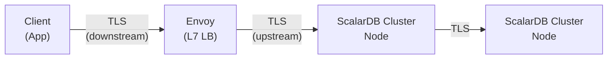
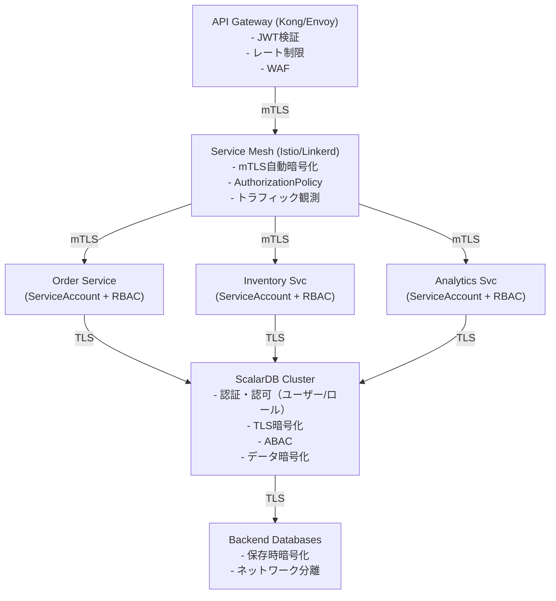
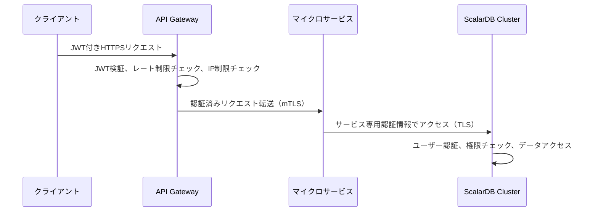
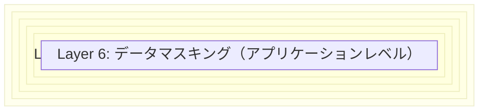
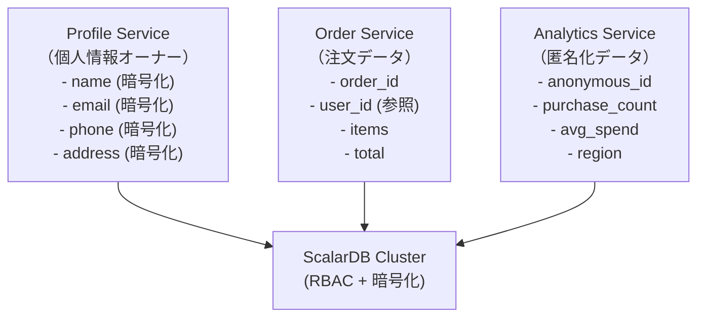

# ScalarDB Cluster + マイクロサービスアーキテクチャ セキュリティモデル調査

## 概要

本ドキュメントでは、ScalarDB Clusterをマイクロサービスアーキテクチャで運用する際の包括的なセキュリティモデルについて調査した結果をまとめる。ScalarDB Cluster固有のセキュリティ機能から、Kubernetes上でのセキュリティ、コンプライアンス対応まで、本番環境で必要となるセキュリティ要件を網羅的に整理する。

---

## 1. ScalarDB Cluster固有のセキュリティ機能

### 1.1 認証機能（Authentication）

ScalarDB Clusterは組み込みの認証メカニズムを提供しており、`scalar.db.cluster.auth.enabled=true` で有効化できる。

#### 認証アーキテクチャ

- **トークンベース認証**: クライアントがユーザー名/パスワードで認証すると、認証トークンが発行される
- **パスワードハッシュ**: パスワードはハッシュ化されて保存され、オプションでペッパー（pepper）を追加可能
- **トークンライフサイクル管理**: トークンの有効期限設定とガベージコレクション機能を搭載

#### サーバー側設定

```properties
# 認証・認可の有効化
scalar.db.cluster.auth.enabled=true

# 認証情報キャッシュの有効期限（ミリ秒、デフォルト: 60,000）
scalar.db.cluster.auth.cache_expiration_time_millis=60000

# 認証トークンの有効期限（分、デフォルト: 1,440 = 1日）
scalar.db.cluster.auth.auth_token_expiration_time_minutes=1440

# トークンGCスレッドの実行間隔（分、デフォルト: 360 = 6時間）
scalar.db.cluster.auth.auth_token_gc_thread_interval_minutes=360

# パスワードハッシュ用のペッパー値（任意、セキュリティ強化用）
scalar.db.cluster.auth.pepper=<SECRET_PEPPER_VALUE>

# システム名前空間のクロスパーティションスキャンを有効化（認証機能の前提条件）
scalar.db.cross_partition_scan.enabled=true
```

#### クライアント側設定（Java API）

```properties
# クライアント認証の有効化
scalar.db.cluster.auth.enabled=true

# SQL インターフェース用の認証情報
scalar.db.sql.cluster_mode.username=<USERNAME>
scalar.db.sql.cluster_mode.password=<PASSWORD>
```

#### クライアント側設定（.NET SDK）

```json
{
  "ScalarDbOptions": {
    "Address": "https://<HOSTNAME_OR_IP_ADDRESS>:<PORT>",
    "HopLimit": 10,
    "AuthEnabled": true,
    "Username": "<USERNAME>",
    "Password": "<PASSWORD>"
  }
}
```

#### ユーザー管理

ScalarDB Clusterでは2種類のユーザーが存在する。

| ユーザー種別 | 説明 |
|-------------|------|
| **スーパーユーザー** | 全権限を保持。他ユーザーや名前空間の作成・削除が可能 |
| **一般ユーザー** | 初期状態では権限なし。スーパーユーザーから権限を付与される |

初期状態では `admin` / `admin` のスーパーユーザーが自動作成される。**本番環境デプロイ前に必ずパスワードを変更すること**。

```sql
-- ユーザー作成
CREATE USER app_user WITH PASSWORD 'secure_password_here';

-- ユーザー一覧表示
SHOW USERS;

-- パスワード変更
ALTER USER admin WITH PASSWORD 'new_secure_password';

-- ユーザー削除
DROP USER app_user;
```

#### ロードマップ: OIDC認証

ScalarDBロードマップ（CY2026 Q1予定）では、OpenID Connect（OIDC）認証のサポートが計画されている。これにより、外部IdP（Identity Provider）との統合が可能になる。

#### ブルートフォース・DoS対策

| 対策 | 実装箇所 | 方法 |
|------|---------|------|
| **ログイン試行回数制限** | API Gateway | 5回失敗で15分ロックアウト |
| **レート制限** | API Gateway（Kong） | IPベースのレート制限（例: 100 req/min） |
| **クロスパーティションスキャン保護** | アプリケーション層 | `cross_partition_scan.enabled=true`が必須だが、アプリ側でスキャン結果のLimit指定を必須化 |
| **大量データ取得防止** | API Gateway | レスポンスサイズ制限、ページネーション強制 |

参照元:
- [Authenticate and Authorize Users](https://scalardb.scalar-labs.com/docs/latest/scalardb-cluster/scalardb-auth-with-sql/)
- [ScalarDB Cluster Configurations](https://scalardb.scalar-labs.com/docs/latest/scalardb-cluster/scalardb-cluster-configurations/)
- [ScalarDB Roadmap](https://scalardb.scalar-labs.com/docs/latest/roadmap/)

---

### 1.2 認可機能（Authorization）

#### ロールベースアクセス制御（RBAC）

ScalarDB Cluster v3.17以降ではRBACがサポートされ、ロールを通じた権限管理が可能である。

##### 利用可能な権限

| 権限 | 説明 |
|------|------|
| `SELECT` | データの読み取り |
| `INSERT` | データの挿入 |
| `UPDATE` | データの更新 |
| `DELETE` | データの削除 |
| `CREATE` | テーブル/名前空間の作成 |
| `DROP` | テーブル/名前空間の削除 |
| `TRUNCATE` | テーブルの全データ削除 |
| `ALTER` | テーブル構造の変更 |
| `GRANT` | 権限の付与 |

##### 権限の制約事項

- `INSERT` と `UPDATE` は常にセットで付与/取り消しが必要
- `UPDATE` または `DELETE` の付与には、対象ユーザーが `SELECT` を保持している必要がある
- `INSERT` または `UPDATE` を保持しているユーザーから `SELECT` を取り消すことはできない

##### ロール管理SQL

```sql
-- ロール作成
CREATE ROLE readonly_role;
CREATE ROLE data_writer_role;
CREATE ROLE cleanup_role;

-- ロールに権限を付与（テーブルレベル）
GRANT SELECT ON ns1.users TO ROLE readonly_role;
GRANT SELECT, INSERT, UPDATE ON ns1.orders TO ROLE data_writer_role;
GRANT DELETE, TRUNCATE ON ns1.logs TO ROLE cleanup_role;

-- ロールに権限を付与（名前空間レベル）
GRANT SELECT ON NAMESPACE ns_analytics TO ROLE readonly_role;

-- ユーザーにロールを付与
GRANT ROLE readonly_role TO analyst_user;
GRANT ROLE data_writer_role TO app_user;

-- 管理権限委譲付きでロールを付与
GRANT ROLE cleanup_role TO ops_user WITH ADMIN OPTION;

-- ロールの取り消し
REVOKE ROLE readonly_role FROM analyst_user;
REVOKE ADMIN OPTION FOR cleanup_role FROM ops_user;

-- 権限の確認
SHOW GRANTS FOR app_user;
SHOW ROLE GRANTS FOR readonly_role;
SHOW ROLES;
```

##### マイクロサービスパターンでの権限設計例

```sql
-- 注文サービス用ユーザー
CREATE USER order_service WITH PASSWORD '<SECURE_PASSWORD>';
GRANT SELECT, INSERT, UPDATE ON order_db.orders TO order_service;
GRANT SELECT ON order_db.order_items TO order_service;
GRANT SELECT ON product_db.products TO order_service;  -- 読み取りのみ

-- 在庫サービス用ユーザー
CREATE USER inventory_service WITH PASSWORD '<SECURE_PASSWORD>';
GRANT SELECT, INSERT, UPDATE ON inventory_db.stock TO inventory_service;
GRANT SELECT ON inventory_db.warehouses TO inventory_service;

-- 分析サービス用ユーザー（読み取り専用）
CREATE USER analytics_service WITH PASSWORD '<SECURE_PASSWORD>';
CREATE ROLE analytics_readonly;
GRANT SELECT ON NAMESPACE order_db TO ROLE analytics_readonly;
GRANT SELECT ON NAMESPACE inventory_db TO ROLE analytics_readonly;
GRANT ROLE analytics_readonly TO analytics_service;
```

#### 属性ベースアクセス制御（ABAC）

ScalarDB Clusterはv3.17時点でABAC（Attribute-Based Access Control）機能を提供している。ABACにより、テーブルレベルのポリシーに基づいたより細かなアクセス制御が可能である。

```properties
# ABACの有効化
scalar.db.cluster.abac.enabled=true

# ABACメタデータキャッシュの有効期限（ミリ秒、デフォルト: 60,000）
scalar.db.cluster.abac.cache_expiration_time_millis=60000
```

**前提条件**:
- 認証・認可機能が有効化されていること（`scalar.db.cluster.auth.enabled=true`）
- システム名前空間のクロスパーティションスキャンが有効化されていること

参照元:
- [Authenticate and Authorize Users](https://scalardb.scalar-labs.com/docs/latest/scalardb-cluster/scalardb-auth-with-sql/)
- [ScalarDB Cluster Configurations](https://scalardb.scalar-labs.com/docs/latest/scalardb-cluster/scalardb-cluster-configurations/)
- [ScalarDB 3.17 Release Notes](https://scalardb.scalar-labs.com/docs/latest/releases/release-notes/)

---

### 1.3 TLS暗号化（Wire Encryption）

ScalarDB Clusterは、クライアント-Cluster間およびCluster内ノード間通信のTLS暗号化をサポートしている。

#### TLS通信の構成



#### サーバー側TLS設定

```properties
# TLSの有効化
scalar.db.cluster.tls.enabled=true

# CA ルート証明書パス
scalar.db.cluster.tls.ca_root_cert_path=/tls/scalardb-cluster/certs/ca.crt

# サーバー証明書チェーン
scalar.db.cluster.node.tls.cert_chain_path=/tls/scalardb-cluster/certs/tls.crt

# サーバー秘密鍵
scalar.db.cluster.node.tls.private_key_path=/tls/scalardb-cluster/certs/tls.key

# TLS検証用のホスト名オーバーライド（テストまたはDNS構成に応じて使用）
scalar.db.cluster.tls.override_authority=cluster.scalardb.example.com
```

#### クライアント側TLS設定

```properties
# クライアント側TLS有効化
scalar.db.cluster.tls.enabled=true

# CA証明書パス（PEMファイルパスまたはPEMデータ）
scalar.db.cluster.tls.ca_root_cert_path=/certs/ca.crt
# または PEMデータ直接指定
# scalar.db.cluster.tls.ca_root_cert_pem=-----BEGIN CERTIFICATE-----...

# ホスト名オーバーライド
scalar.db.cluster.tls.override_authority=envoy.scalar.example.com
```

#### Helm Chartによる TLS設定

##### 方法1: 手動証明書管理

```yaml
# Kubernetes Secretの作成
# kubectl create secret generic scalardb-cluster-tls-ca \
#   --from-file=ca.crt=ca.pem
# kubectl create secret generic scalardb-cluster-tls-cert \
#   --from-file=tls.crt=scalardb-cluster.pem
# kubectl create secret generic scalardb-cluster-tls-key \
#   --from-file=tls.key=scalardb-cluster-key.pem

envoy:
  enabled: true
  tls:
    downstream:
      enabled: true
      certChainSecret: "envoy-tls-cert"
      privateKeySecret: "envoy-tls-key"
    upstream:
      enabled: true
      overrideAuthority: "cluster.scalardb.example.com"
      caRootCertSecret: "scalardb-cluster-tls-ca"

scalardbCluster:
  scalardbClusterNodeProperties: |
    scalar.db.cluster.tls.enabled=true
    scalar.db.cluster.tls.ca_root_cert_path=/tls/scalardb-cluster/certs/ca.crt
    scalar.db.cluster.node.tls.cert_chain_path=/tls/scalardb-cluster/certs/tls.crt
    scalar.db.cluster.node.tls.private_key_path=/tls/scalardb-cluster/certs/tls.key
    scalar.db.cluster.tls.override_authority=cluster.scalardb.example.com
  tls:
    enabled: true
    overrideAuthority: "cluster.scalardb.example.com"
    caRootCertSecret: "scalardb-cluster-tls-ca"
    certChainSecret: "scalardb-cluster-tls-cert"
    privateKeySecret: "scalardb-cluster-tls-key"
```

##### 方法2: cert-manager自動管理（信頼されたCA）

```yaml
scalardbCluster:
  tls:
    enabled: true
    certManager:
      enabled: true
      issuerRef:
        name: <YOUR_TRUSTED_CA_ISSUER>
      dnsNames:
        - cluster.scalardb.example.com
```

##### 方法3: cert-manager自己署名証明書（開発/テスト用）

```yaml
scalardbCluster:
  tls:
    enabled: true
    certManager:
      enabled: true
      selfSigned:
        enabled: true
      dnsNames:
        - cluster.scalardb.example.com
```

#### 証明書の作成手順（cfssl使用）

```bash
# 1. 作業ディレクトリ作成
mkdir -p ${HOME}/scalar/certs/ && cd ${HOME}/scalar/certs/

# 2. CA設定ファイル作成（ca.json）
cat > ca.json <<'EOF'
{
  "CN": "ScalarDB Test CA",
  "key": {
    "algo": "ecdsa",
    "size": 256
  },
  "names": [
    {
      "C": "JP",
      "ST": "Tokyo",
      "L": "Shinjuku"
    }
  ]
}
EOF

# 3. CA証明書生成
cfssl gencert -initca ca.json | cfssljson -bare ca

# 4. CA署名プロファイル作成（ca-config.json）
cat > ca-config.json <<'EOF'
{
  "signing": {
    "default": {
      "expiry": "87600h"
    },
    "profiles": {
      "scalar-ca": {
        "expiry": "87600h",
        "usages": ["signing", "key encipherment", "server auth"]
      }
    }
  }
}
EOF

# 5. サーバー証明書設定（server.json）
cat > server.json <<'EOF'
{
  "CN": "cluster.scalardb.example.com",
  "hosts": [
    "cluster.scalardb.example.com",
    "*.scalardb-cluster-headless.default.svc.cluster.local"
  ],
  "key": {
    "algo": "ecdsa",
    "size": 256
  }
}
EOF

# 6. サーバー証明書生成
cfssl gencert -ca ca.pem -ca-key ca-key.pem \
  -config ca-config.json -profile scalar-ca \
  server.json | cfssljson -bare server

# 出力ファイル: server-key.pem（秘密鍵）, server.pem（証明書）, ca.pem（CA証明書）
```

**本番環境での注意**: 自己署名証明書は本番環境では使用しないこと。信頼されたCAから証明書を取得すること。サポートされるアルゴリズムはRSAまたはECDSAのみ。

参照元:
- [Getting Started with Helm Charts (ScalarDB Cluster with TLS)](https://scalardb.scalar-labs.com/docs/latest/helm-charts/getting-started-scalardb-cluster-tls/)
- [How to Create Private Key and Certificate Files](https://scalardb.scalar-labs.com/docs/latest/scalar-kubernetes/HowToCreateKeyAndCertificateFiles/)
- [Configure a custom values file for ScalarDB Cluster](https://scalardb.scalar-labs.com/docs/latest/helm-charts/configure-custom-values-scalardb-cluster/)

---

### 1.4 監査ログ

#### 現状（v3.17時点）

ScalarDB Cluster v3.17時点では、専用の監査ログ機能は提供されていない。ScalarDBロードマップ（CY2026 Q2予定）において、監査ログ機能の実装が計画されている。

> "Users will be able to view and manage the access logs of ScalarDB Cluster and Analytics, mainly for auditing purposes."

#### 現時点での代替アプローチ

##### 1. アプリケーションレベルログ

ScalarDB Clusterのログレベルを設定し、操作ログを収集する。

```yaml
scalardbCluster:
  logLevel: INFO  # DEBUG, INFO, WARN, ERROR
```

##### 2. Kubernetes上でのログ収集（Grafana Loki + Promtail）

```bash
# Lokiスタックのデプロイ
helm repo add grafana https://grafana.github.io/helm-charts
helm install scalar-logging-loki grafana/loki-stack \
  -n monitoring \
  -f scalar-loki-stack-custom-values.yaml
```

Grafanaでのデータソース設定:

```yaml
# scalar-prometheus-custom-values.yaml 内のLokiデータソース設定
grafana:
  additionalDataSources:
    - name: Loki
      type: loki
      url: http://scalar-logging-loki:3100/
      access: proxy
```

##### 3. バックエンドDB側の監査ログ

バックエンドデータベース（PostgreSQL, MySQL等）の監査ログ機能を利用して、実際のデータアクセスを記録する。

```sql
-- PostgreSQLの例: pgauditの設定
-- postgresql.conf
-- shared_preload_libraries = 'pgaudit'
-- pgaudit.log = 'write, ddl, role'
```

##### 4. Prometheusメトリクスによる監視

```yaml
scalardbCluster:
  serviceMonitor:
    enabled: true
  prometheusRule:
    enabled: true
  grafanaDashboard:
    enabled: true
```

参照元:
- [ScalarDB Roadmap](https://scalardb.scalar-labs.com/docs/latest/roadmap/)
- [Getting Started with Helm Charts (Logging using Loki Stack)](https://scalardb.scalar-labs.com/docs/latest/helm-charts/getting-started-logging/)
- [Monitoring Scalar products on a Kubernetes cluster](https://scalardb.scalar-labs.com/docs/latest/scalar-kubernetes/K8sMonitorGuide/)

### 監査ログ暫定対策（ScalarDB Audit Logging提供前の必須対応）

ScalarDB Cluster自体の監査ログ機能はCY2026 Q2にリリース予定である。それまでの間、コンプライアンス要件を満たすために以下の暫定対策を**必須**として実施する。

| 対策 | 優先度 | 実装方法 |
|------|--------|---------|
| **バックエンドDB監査ログの有効化** | 必須 | PostgreSQL: pgaudit拡張、MySQL: audit_log プラグイン |
| **Kubernetes Audit Logの有効化** | 必須 | ScalarDB Cluster名前空間のSecret/Pod操作を記録 |
| **アプリケーション側Structured Audit Logging** | 必須 | 誰が・何の操作を・どのテーブルに実行したかを構造化ログで記録 |
| **ログの改ざん防止** | 推奨 | WORM（Write Once Read Many）ストレージ、またはイミュータブルなログバックエンド（Amazon S3 Object Lock等）を使用 |
| **ログの保持期間設定** | 必須 | PCI-DSS: 1年以上、HIPAA: 6年以上のリテンション設定 |

---

### 1.5 Coordinatorテーブルの保護

Coordinatorテーブルにはトランザクション状態（COMMITTED, ABORTED等）が格納される。このテーブルへの不正アクセスや改ざんはトランザクション一貫性の破壊につながる。

| 対策 | 実装方法 |
|------|---------|
| **アクセス制御** | ScalarDB用DBユーザー（scalardb_app）のみがアクセス可能にする |
| **直接アクセス禁止** | DBAによる直接SQL修正は整合性を壊す可能性があるため、必ずScalarDB API経由で操作 |
| **監視** | Coordinatorテーブルへの直接UPDATE/DELETEをDB監査ログで検知しアラート発報 |
| **バックアップ** | Coordinatorテーブルを含むDBのバックアップを最優先で実施 |

---

## 2. ネットワークセキュリティ

### 2.1 サービスメッシュによる通信暗号化

マイクロサービス間の通信を暗号化し、ゼロトラストネットワークを実現するためにサービスメッシュを活用する。

#### Istio によるmTLS実装

```yaml
# PeerAuthentication: 名前空間全体でSTRICT mTLSを強制
apiVersion: security.istio.io/v1
kind: PeerAuthentication
metadata:
  name: default
  namespace: scalardb-namespace
spec:
  mtls:
    mode: STRICT
---
# AuthorizationPolicy: ScalarDB Clusterへのアクセス制御
apiVersion: security.istio.io/v1
kind: AuthorizationPolicy
metadata:
  name: scalardb-cluster-access
  namespace: scalardb-namespace
spec:
  selector:
    matchLabels:
      app.kubernetes.io/name: scalardb-cluster
  action: ALLOW
  rules:
    - from:
        - source:
            principals:
              - "cluster.local/ns/app-namespace/sa/order-service"
              - "cluster.local/ns/app-namespace/sa/inventory-service"
      to:
        - operation:
            ports: ["60053"]  # gRPC/SQLポート
---
# デフォルト拒否ポリシー
apiVersion: security.istio.io/v1
kind: AuthorizationPolicy
metadata:
  name: deny-all
  namespace: scalardb-namespace
spec:
  {}
```

#### Linkerd によるmTLS実装

```yaml
# Linkerdアノテーションによる自動mTLS有効化
apiVersion: apps/v1
kind: Deployment
metadata:
  name: scalardb-cluster
  annotations:
    linkerd.io/inject: enabled
spec:
  template:
    metadata:
      annotations:
        linkerd.io/inject: enabled
---
# ServerAuthorization: アクセス許可ポリシー
apiVersion: policy.linkerd.io/v1beta1
kind: ServerAuthorization
metadata:
  name: scalardb-cluster-auth
  namespace: scalardb-namespace
spec:
  server:
    name: scalardb-cluster-grpc
  client:
    meshTLS:
      serviceAccounts:
        - name: order-service
          namespace: app-namespace
        - name: inventory-service
          namespace: app-namespace
```

#### ScalarDB Cluster TLSとサービスメッシュの使い分け

| 通信経路 | ScalarDB TLS | サービスメッシュ mTLS | 推奨 |
|---------|-------------|---------------------|------|
| クライアント → ScalarDB Cluster | 対応 | 対応 | 両方利用可。ScalarDB TLSはアプリケーションレベル認証も兼ねる |
| ScalarDB Cluster ノード間 | 対応 | 対応 | ScalarDB TLSを推奨（Cluster内部通信のため） |
| マイクロサービス間 | - | 対応 | サービスメッシュmTLSを推奨 |
| ScalarDB Cluster → バックエンドDB | - | 限定的 | バックエンドDB側のTLS設定を利用 |

参照元:
- [Istio Security](https://istio.io/latest/docs/concepts/security/)
- [Zero Trust for Kubernetes: Implementing Service Mesh Security](https://medium.com/@heinancabouly/zero-trust-for-kubernetes-implementing-service-mesh-security-529adb66665a)

---

### 2.2 Kubernetes NetworkPolicy

ScalarDB Clusterはプライベートネットワーク上にデプロイすることが推奨されている。NetworkPolicyにより、不要な通信を遮断する。

#### デフォルト拒否ポリシー

```yaml
# 名前空間内のすべてのIngressトラフィックをデフォルト拒否
apiVersion: networking.k8s.io/v1
kind: NetworkPolicy
metadata:
  name: default-deny-ingress
  namespace: scalardb-namespace
spec:
  podSelector: {}
  policyTypes:
    - Ingress

---
# 名前空間内のすべてのEgressトラフィックをデフォルト拒否
apiVersion: networking.k8s.io/v1
kind: NetworkPolicy
metadata:
  name: default-deny-egress
  namespace: scalardb-namespace
spec:
  podSelector: {}
  policyTypes:
    - Egress
```

#### ScalarDB Cluster用NetworkPolicy

```yaml
apiVersion: networking.k8s.io/v1
kind: NetworkPolicy
metadata:
  name: scalardb-cluster-network-policy
  namespace: scalardb-namespace
spec:
  podSelector:
    matchLabels:
      app.kubernetes.io/name: scalardb-cluster
  policyTypes:
    - Ingress
    - Egress
  ingress:
    # gRPC/SQLアクセス（クライアントアプリケーションから）
    - from:
        - namespaceSelector:
            matchLabels:
              name: app-namespace
        - podSelector:
            matchLabels:
              app: order-service
      ports:
        - port: 60053
          protocol: TCP
    # GraphQLアクセス（必要な場合のみ）
    - from:
        - namespaceSelector:
            matchLabels:
              name: app-namespace
      ports:
        - port: 8080
          protocol: TCP
    # Prometheus メトリクス収集
    - from:
        - namespaceSelector:
            matchLabels:
              name: monitoring
      ports:
        - port: 9080
          protocol: TCP
    # Cluster内ノード間通信
    - from:
        - podSelector:
            matchLabels:
              app.kubernetes.io/name: scalardb-cluster
  egress:
    # バックエンドDBへの接続
    - to:
        - namespaceSelector:
            matchLabels:
              name: database-namespace
      ports:
        - port: 5432  # PostgreSQL
          protocol: TCP
    # DNS解決
    - to:
        - namespaceSelector: {}
          podSelector:
            matchLabels:
              k8s-app: kube-dns
      ports:
        - port: 53
          protocol: UDP
        - port: 53
          protocol: TCP
    # Cluster内ノード間通信
    - to:
        - podSelector:
            matchLabels:
              app.kubernetes.io/name: scalardb-cluster
```

#### Envoy用NetworkPolicy（indirectモード時）

```yaml
apiVersion: networking.k8s.io/v1
kind: NetworkPolicy
metadata:
  name: envoy-network-policy
  namespace: scalardb-namespace
spec:
  podSelector:
    matchLabels:
      app.kubernetes.io/name: envoy
  policyTypes:
    - Ingress
    - Egress
  ingress:
    # 外部クライアントからのgRPCアクセス
    - from:
        - namespaceSelector:
            matchLabels:
              name: app-namespace
      ports:
        - port: 60053
          protocol: TCP
    # Envoy監視ポート
    - from:
        - namespaceSelector:
            matchLabels:
              name: monitoring
      ports:
        - port: 9001
          protocol: TCP
  egress:
    # ScalarDB Clusterへの接続
    - to:
        - podSelector:
            matchLabels:
              app.kubernetes.io/name: scalardb-cluster
      ports:
        - port: 60053
          protocol: TCP
```

**注意**: AKS環境でNetworkPolicyを使用する場合、kubenetはCalico Network Policyのみサポートし、Azureサポートチームのサポート対象外となる。Azureサポートを受ける場合はAzure CNIを使用すること。

参照元:
- [Guidelines for creating an EKS cluster for ScalarDB Cluster](https://scalardb.scalar-labs.com/docs/latest/scalar-kubernetes/CreateEKSClusterForScalarDBCluster/)
- [Configure a custom values file for ScalarDB Cluster](https://scalardb.scalar-labs.com/docs/latest/helm-charts/configure-custom-values-scalardb-cluster/)

---

### 2.3 ゼロトラスト原則の適用

マイクロサービスアーキテクチャにおけるゼロトラスト原則を、ScalarDB Cluster環境に適用する。

#### ゼロトラスト実装マトリクス

| 原則 | 実装方法 | ScalarDB Cluster対応 |
|------|---------|---------------------|
| **Never Trust, Always Verify** | すべてのリクエストを認証・認可 | 認証・認可機能で対応 |
| **最小権限** | 必要最小限のアクセス権限のみ付与 | テーブル/名前空間レベルRBACで対応 |
| **マイクロセグメンテーション** | ネットワークを細粒度で分割 | NetworkPolicy + サービスメッシュで対応 |
| **暗号化通信** | すべての通信を暗号化 | TLS + mTLSで対応 |
| **継続的監視** | すべてのアクセスを記録・監視 | Prometheus/Grafana + ログ収集で対応 |
| **デバイス/ワークロード検証** | ワークロードIDの検証 | サービスメッシュのSPIFFE IDで対応 |

#### ゼロトラストアーキテクチャ構成図



---

### 2.4 API Gatewayでの認証・認可

マイクロサービスの統一的なエントリーポイントとして API Gatewayを配置し、認証・認可を集約する。

#### Kong API Gateway設定例

```yaml
# JWT認証プラグイン
apiVersion: configuration.konghq.com/v1
kind: KongPlugin
metadata:
  name: jwt-auth
  namespace: app-namespace
config:
  key_claim_name: iss
  claims_to_verify:
    - exp
plugin: jwt
---
# レート制限プラグイン
apiVersion: configuration.konghq.com/v1
kind: KongPlugin
metadata:
  name: rate-limiting
  namespace: app-namespace
config:
  minute: 100
  hour: 5000
  policy: redis
plugin: rate-limiting
---
# IPリストリクション
apiVersion: configuration.konghq.com/v1
kind: KongPlugin
metadata:
  name: ip-restriction
  namespace: app-namespace
config:
  allow:
    - 10.0.0.0/8
    - 172.16.0.0/12
plugin: ip-restriction
---
# サービスへのルーティング
apiVersion: networking.k8s.io/v1
kind: Ingress
metadata:
  name: order-service-ingress
  annotations:
    konghq.com/plugins: jwt-auth,rate-limiting,ip-restriction
    konghq.com/protocols: https
spec:
  ingressClassName: kong
  tls:
    - hosts:
        - api.example.com
      secretName: api-tls-cert
  rules:
    - host: api.example.com
      http:
        paths:
          - path: /api/v1/orders
            pathType: Prefix
            backend:
              service:
                name: order-service
                port:
                  number: 8080
```

#### 認証フロー



---

## 3. データセキュリティ

### 3.1 保存時暗号化（Encryption at Rest）

ScalarDB Clusterは、アプリケーションから透過的にデータを暗号化する機能を提供している。暗号化はデータがバックエンドデータベースに保存される前に実行され、読み取り時に復号される。

#### ScalarDB Clusterのカラムレベル暗号化

##### 方式1: HashiCorp Vault暗号化

```properties
# ScalarDB Cluster ノード設定
scalar.db.cluster.encryption.enabled=true
scalar.db.cluster.encryption.type=vault
scalar.db.cluster.encryption.vault.address=https://vault.example.com:8200
scalar.db.cluster.encryption.vault.token=<VAULT_TOKEN>
scalar.db.cluster.encryption.vault.namespace=scalardb
scalar.db.cluster.encryption.vault.transit_secrets_engine_path=transit
scalar.db.cluster.encryption.vault.key_type=aes256-gcm96
scalar.db.cluster.encryption.vault.column_batch_size=64
scalar.db.cross_partition_scan.enabled=true
```

Helm Chart設定:

```yaml
scalardbCluster:
  scalardbClusterNodeProperties: |
    scalar.db.cluster.encryption.enabled=true
    scalar.db.cluster.encryption.type=vault
    scalar.db.cluster.encryption.vault.address=https://vault.example.com:8200
    scalar.db.cluster.encryption.vault.token=${env:VAULT_TOKEN}
    scalar.db.cluster.encryption.vault.transit_secrets_engine_path=transit
    scalar.db.cluster.encryption.vault.key_type=aes256-gcm96
    scalar.db.cross_partition_scan.enabled=true
  encryption:
    enabled: true
    type: "vault"
  secretName: "scalardb-cluster-vault-secret"
```

> **セキュリティ警告**: 上記の静的Vault Token（`${env:VAULT_TOKEN}`）は開発環境専用です。本番環境ではKubernetes ServiceAccount Tokenベースの認証に切り替えてください。静的トークンはローテーションが困難であり、漏洩時の影響が大きいため、本番環境での使用は推奨しません。

##### 方式2: Self暗号化（Kubernetes Secrets利用）

```properties
scalar.db.cluster.encryption.enabled=true
scalar.db.cluster.encryption.type=self
scalar.db.cluster.encryption.self.key_type=AES256_GCM
scalar.db.cluster.encryption.self.kubernetes.secret.namespace_name=scalardb-namespace
scalar.db.cluster.encryption.self.data_encryption_key_cache_expiration_time=60000
scalar.db.cross_partition_scan.enabled=true
```

Helm Chart設定:

```yaml
scalardbCluster:
  scalardbClusterNodeProperties: |
    scalar.db.cluster.encryption.enabled=true
    scalar.db.cluster.encryption.type=self
    scalar.db.cluster.encryption.self.key_type=AES256_GCM
    scalar.db.cluster.encryption.self.kubernetes.secret.namespace_name=${env:SCALAR_DB_CLUSTER_ENCRYPTION_SELF_KUBERNETES_SECRET_NAMESPACE_NAME}
    scalar.db.cross_partition_scan.enabled=true
  encryption:
    enabled: true
    type: "self"
```

##### サポートされる暗号化アルゴリズム

| 暗号化方式 | Vault | Self |
|-----------|-------|------|
| AES-128-GCM | `aes128-gcm96` | `AES128_GCM` |
| AES-256-GCM | `aes256-gcm96` | `AES256_GCM` |
| ChaCha20-Poly1305 | `chacha20-poly1305` | `CHACHA20_POLY1305` |
| AES-128-EAX | - | `AES128_EAX` |
| AES-256-EAX | - | `AES256_EAX` |
| AES-128-CTR-HMAC-SHA256 | - | `AES128_CTR_HMAC_SHA256` |
| AES-256-CTR-HMAC-SHA256 | - | `AES256_CTR_HMAC_SHA256` |
| XChaCha20-Poly1305 | - | `XCHACHA20_POLY1305` |

##### テーブル定義でのカラム暗号化

```sql
-- ENCRYPTEDキーワードで暗号化対象カラムを指定
CREATE TABLE customer_db.customers (
  customer_id INT PRIMARY KEY,
  name TEXT,
  email TEXT ENCRYPTED,          -- 暗号化対象
  phone TEXT ENCRYPTED,          -- 暗号化対象
  credit_card TEXT ENCRYPTED,    -- 暗号化対象
  address TEXT,
  created_at BIGINT
);

CREATE TABLE order_db.payments (
  payment_id INT PRIMARY KEY,
  order_id INT,
  amount DOUBLE,
  card_number TEXT ENCRYPTED,    -- 暗号化対象
  card_holder TEXT ENCRYPTED,    -- 暗号化対象
  status TEXT,
  processed_at BIGINT
);
```

##### 暗号化の制約事項

- **主キーカラムは暗号化不可**: PRIMARY KEY列にはENCRYPTEDを指定できない
- **WHERE句での使用不可**: 暗号化カラムはWHERE句やORDER BY句で使用できない
- **BLOBサイズ制限**: 暗号化データはBLOB型で格納されるため、バックエンドDBのBLOBサイズ制限に注意
- **カラム名変更不可**: 暗号化カラムのリネームは不可
- **型変更不可**: 暗号化カラムのデータ型変更は不可

#### バックエンドDB側の保存時暗号化

ScalarDB Clusterのカラムレベル暗号化に加えて、バックエンドDB側のストレージレベル暗号化も併用することを推奨する。

| バックエンドDB | 暗号化機能 | 設定方法 |
|---------------|-----------|---------|
| **PostgreSQL** | TDE（Transparent Data Encryption） | `postgresql.conf` で設定、またはクラウドマネージドサービスで有効化 |
| **MySQL** | InnoDB Tablespace Encryption | `innodb_encrypt_tables=ON` |
| **Amazon DynamoDB** | AWS KMS統合 | デフォルトで暗号化。カスタマーマネージドキーも選択可能 |
| **Azure Cosmos DB** | サービスマネージド暗号化 | デフォルトで有効。カスタマーマネージドキーも選択可能 |
| **Amazon RDS** | ストレージ暗号化 | インスタンス作成時に `--storage-encrypted` を指定 |

参照元:
- [Encrypt Data at Rest](https://scalardb.scalar-labs.com/docs/latest/scalardb-cluster/encrypt-data-at-rest/)
- [ScalarDB Cluster Configurations](https://scalardb.scalar-labs.com/docs/latest/scalardb-cluster/scalardb-cluster-configurations/)

---

### 3.2 転送中暗号化（Encryption in Transit）

転送中のデータを保護するために、すべての通信経路でTLSを有効化する。

#### 暗号化対象の通信経路

| 通信経路 | 暗号化方式 | 設定箇所 |
|---------|-----------|---------|
| クライアント → Envoy | TLS | Envoy downstream TLS設定 |
| Envoy → ScalarDB Cluster | TLS | Envoy upstream TLS + ScalarDB Cluster TLS設定 |
| ScalarDB Cluster ノード間 | TLS | ScalarDB Cluster TLS設定 |
| ScalarDB Cluster → バックエンドDB | TLS | バックエンドDB接続設定 |
| マイクロサービス間 | mTLS | サービスメッシュ設定 |
| Prometheus → ScalarDB Cluster | TLS | ServiceMonitor TLS設定 |

#### バックエンドDB接続時のTLS設定例

```properties
# PostgreSQLへのTLS接続
scalar.db.contact_points=jdbc:postgresql://db.example.com:5432/scalardb?ssl=true&sslmode=verify-full&sslrootcert=/certs/db-ca.crt

# MySQLへのTLS接続
scalar.db.contact_points=jdbc:mysql://db.example.com:3306/scalardb?useSSL=true&requireSSL=true&verifyServerCertificate=true
```

#### Prometheus監視のTLS設定

```yaml
scalardbCluster:
  tls:
    caRootCertSecretForServiceMonitor: "scalardb-cluster-tls-ca-for-prometheus"
  serviceMonitor:
    enabled: true
```

**重要**: ScalarDB公式ドキュメントでは、認証・認可機能またはデータ暗号化機能を有効にする場合、本番環境ではワイヤー暗号化（TLS）の有効化が強く推奨されている。

参照元:
- [Getting Started with Helm Charts (ScalarDB Cluster with TLS)](https://scalardb.scalar-labs.com/docs/latest/helm-charts/getting-started-scalardb-cluster-tls/)
- [Configure a custom values file for ScalarDB Cluster](https://scalardb.scalar-labs.com/docs/latest/helm-charts/configure-custom-values-scalardb-cluster/)

---

### 3.3 フィールドレベル暗号化

ScalarDB Clusterは`ENCRYPTED`キーワードによるカラムレベルの暗号化をネイティブにサポートしている（3.1節で詳述）。これはフィールドレベル暗号化として機能し、機密データを含むカラムのみを選択的に暗号化できる。

#### マイクロサービスでの活用パターン

```sql
-- 顧客サービス: 個人情報の暗号化
CREATE TABLE customer_ns.profiles (
  user_id INT PRIMARY KEY,
  username TEXT,
  email TEXT ENCRYPTED,
  phone_number TEXT ENCRYPTED,
  date_of_birth TEXT ENCRYPTED,
  preferences TEXT              -- 非機密データは暗号化不要
);

-- 決済サービス: 金融情報の暗号化
CREATE TABLE payment_ns.payment_methods (
  method_id INT PRIMARY KEY,
  user_id INT,
  card_number TEXT ENCRYPTED,
  card_expiry TEXT ENCRYPTED,
  card_cvv TEXT ENCRYPTED,
  billing_address TEXT ENCRYPTED,
  is_default BOOLEAN
);

-- 医療サービス: 健康情報の暗号化
CREATE TABLE health_ns.medical_records (
  record_id INT PRIMARY KEY,
  patient_id INT,
  diagnosis TEXT ENCRYPTED,
  prescription TEXT ENCRYPTED,
  doctor_notes TEXT ENCRYPTED,
  visit_date BIGINT
);
```

---

### 3.4 データマスキング

ScalarDB Cluster v3.17時点では、ネイティブのデータマスキング機能は提供されていない。以下のアプローチで代替する。

#### アプリケーションレベルでのデータマスキング

```java
// マスキングユーティリティの例
public class DataMaskingUtil {

    // メールアドレスマスキング: user@example.com → u***@example.com
    public static String maskEmail(String email) {
        if (email == null || !email.contains("@")) return "***";
        String[] parts = email.split("@");
        return parts[0].charAt(0) + "***@" + parts[1];
    }

    // 電話番号マスキング: 090-1234-5678 → 090-****-5678
    public static String maskPhone(String phone) {
        if (phone == null || phone.length() < 4) return "***";
        return phone.substring(0, 4) + "****" + phone.substring(phone.length() - 4);
    }

    // クレジットカード番号マスキング: 4111111111111111 → ****1111
    public static String maskCreditCard(String cardNumber) {
        if (cardNumber == null || cardNumber.length() < 4) return "***";
        return "****" + cardNumber.substring(cardNumber.length() - 4);
    }
}
```

#### データベースビューを利用したマスキング（バックエンドDB側）

```sql
-- PostgreSQLの例: マスキングビュー
CREATE VIEW customer_masked AS
SELECT
  customer_id,
  name,
  CONCAT(LEFT(email, 1), '***@', SPLIT_PART(email, '@', 2)) AS email,
  CONCAT(LEFT(phone, 3), '-****-', RIGHT(phone, 4)) AS phone,
  '****' || RIGHT(credit_card, 4) AS credit_card
FROM customers;
```

---

## 4. Kubernetes上でのセキュリティ

### 4.1 Pod Security Standards / Policies

Kubernetes 1.25以降、Pod Security Policies（PSP）は廃止され、Pod Security Standards（PSS）が標準となった。ScalarDB ClusterのPodには `restricted` プロファイルを適用することを推奨する。

#### Pod Security Admission設定

```yaml
# 名前空間レベルでのPod Security Standards適用
apiVersion: v1
kind: Namespace
metadata:
  name: scalardb-namespace
  labels:
    pod-security.kubernetes.io/enforce: restricted
    pod-security.kubernetes.io/audit: restricted
    pod-security.kubernetes.io/warn: restricted
```

#### ScalarDB Cluster Helm Chart SecurityContext設定

```yaml
scalardbCluster:
  # Pod レベルのセキュリティコンテキスト
  podSecurityContext:
    runAsNonRoot: true
    runAsUser: 1000
    runAsGroup: 1000
    fsGroup: 1000
    seccompProfile:
      type: RuntimeDefault

  # コンテナレベルのセキュリティコンテキスト
  securityContext:
    capabilities:
      drop:
        - ALL
    runAsNonRoot: true
    allowPrivilegeEscalation: false
    readOnlyRootFilesystem: true
    seccompProfile:
      type: RuntimeDefault
```

#### Pod Security Standardsの3つのレベル

| レベル | 説明 | ScalarDB Clusterでの適用 |
|-------|------|------------------------|
| **Privileged** | 制限なし | 非推奨 |
| **Baseline** | 基本的な制限 | 最低限 |
| **Restricted** | 最も厳格な制限 | 本番環境推奨 |

参照元:
- [Configure a custom values file for ScalarDB Cluster](https://scalardb.scalar-labs.com/docs/latest/helm-charts/configure-custom-values-scalardb-cluster/)
- [Pod Security Standards](https://kubernetes.io/docs/concepts/security/pod-security-standards/)

---

### 4.2 Kubernetes RBAC設定

ScalarDB Clusterの `direct-kubernetes` モードでは、クライアントアプリケーションがKubernetes APIを通じてScalarDB Clusterのエンドポイントを発見する。このために適切なRBAC設定が必要である。

#### direct-kubernetes モード用RBAC

```yaml
# Role: ScalarDB Clusterのエンドポイント情報読み取り権限
apiVersion: rbac.authorization.k8s.io/v1
kind: Role
metadata:
  name: scalardb-cluster-client-role
  namespace: scalardb-namespace
rules:
  - apiGroups: [""]
    resources: ["endpoints"]
    verbs: ["get", "watch", "list"]
---
# ServiceAccount: クライアントアプリケーション用
apiVersion: v1
kind: ServiceAccount
metadata:
  name: order-service-sa
  namespace: app-namespace
---
# RoleBinding: ServiceAccountにRoleをバインド
apiVersion: rbac.authorization.k8s.io/v1
kind: RoleBinding
metadata:
  name: scalardb-cluster-client-rolebinding
  namespace: scalardb-namespace
subjects:
  - kind: ServiceAccount
    name: order-service-sa
    namespace: app-namespace
roleRef:
  kind: Role
  name: scalardb-cluster-client-role
  apiGroup: rbac.authorization.k8s.io
```

#### 運用チーム向けRBAC

```yaml
# ClusterRole: ScalarDB運用管理者
apiVersion: rbac.authorization.k8s.io/v1
kind: ClusterRole
metadata:
  name: scalardb-operator
rules:
  - apiGroups: [""]
    resources: ["pods", "services", "configmaps"]
    verbs: ["get", "list", "watch"]
  - apiGroups: [""]
    resources: ["secrets"]
    verbs: ["get", "list"]  # 書き込み権限は付与しない
  - apiGroups: ["apps"]
    resources: ["deployments", "statefulsets"]
    verbs: ["get", "list", "watch", "update", "patch"]
  - apiGroups: [""]
    resources: ["pods/log"]
    verbs: ["get", "list"]
---
# ClusterRole: ScalarDB読み取り専用（監視用）
apiVersion: rbac.authorization.k8s.io/v1
kind: ClusterRole
metadata:
  name: scalardb-viewer
rules:
  - apiGroups: [""]
    resources: ["pods", "services", "configmaps"]
    verbs: ["get", "list", "watch"]
  - apiGroups: ["apps"]
    resources: ["deployments", "statefulsets"]
    verbs: ["get", "list", "watch"]
```

参照元:
- [How to deploy ScalarDB Cluster](https://scalardb.scalar-labs.com/docs/latest/helm-charts/how-to-deploy-scalardb-cluster/)

---

### 4.3 Secret管理

ScalarDB ClusterのDB認証情報、TLS証明書、暗号化キーなどの機密情報を安全に管理する。

#### 方法1: Kubernetes Secrets（環境変数参照）

ScalarDB Cluster Helm Chartでは `secretName` パラメータでKubernetes Secretを参照し、環境変数としてPodに注入できる。

```yaml
# Kubernetes Secretの作成
# kubectl create secret generic scalardb-cluster-credentials \
#   --from-literal=SCALAR_DB_USERNAME=scalardb_user \
#   --from-literal=SCALAR_DB_PASSWORD=<SECURE_PASSWORD> \
#   --from-literal=VAULT_TOKEN=<VAULT_TOKEN>

scalardbCluster:
  secretName: "scalardb-cluster-credentials"
  scalardbClusterNodeProperties: |
    scalar.db.username=${env:SCALAR_DB_USERNAME}
    scalar.db.password=${env:SCALAR_DB_PASSWORD}
    scalar.db.cluster.encryption.vault.token=${env:VAULT_TOKEN}
```

#### 方法2: External Secrets Operator + HashiCorp Vault

```yaml
# SecretStore: Vault接続設定
apiVersion: external-secrets.io/v1beta1
kind: SecretStore
metadata:
  name: vault-secret-store
  namespace: scalardb-namespace
spec:
  provider:
    vault:
      server: "https://vault.example.com:8200"
      path: "secret"
      version: "v2"
      auth:
        kubernetes:
          mountPath: "kubernetes"
          role: "scalardb-cluster"
          serviceAccountRef:
            name: "scalardb-cluster-sa"
---
# ExternalSecret: VaultからDB認証情報を同期
apiVersion: external-secrets.io/v1beta1
kind: ExternalSecret
metadata:
  name: scalardb-cluster-credentials
  namespace: scalardb-namespace
spec:
  refreshInterval: 1h
  secretStoreRef:
    name: vault-secret-store
    kind: SecretStore
  target:
    name: scalardb-cluster-credentials
    creationPolicy: Owner
  data:
    - secretKey: SCALAR_DB_USERNAME
      remoteRef:
        key: scalardb/credentials
        property: username
    - secretKey: SCALAR_DB_PASSWORD
      remoteRef:
        key: scalardb/credentials
        property: password
---
# ExternalSecret: VaultからTLS証明書を同期
apiVersion: external-secrets.io/v1beta1
kind: ExternalSecret
metadata:
  name: scalardb-cluster-tls-cert
  namespace: scalardb-namespace
spec:
  refreshInterval: 24h
  secretStoreRef:
    name: vault-secret-store
    kind: SecretStore
  target:
    name: scalardb-cluster-tls-cert
    creationPolicy: Owner
  data:
    - secretKey: tls.crt
      remoteRef:
        key: scalardb/tls
        property: cert_chain
    - secretKey: tls.key
      remoteRef:
        key: scalardb/tls
        property: private_key
```

#### 方法3: AWS Secrets Manager + External Secrets Operator

```yaml
apiVersion: external-secrets.io/v1beta1
kind: ClusterSecretStore
metadata:
  name: aws-secret-store
spec:
  provider:
    aws:
      service: SecretsManager
      region: ap-northeast-1
      auth:
        jwt:
          serviceAccountRef:
            name: external-secrets-sa
            namespace: external-secrets
---
apiVersion: external-secrets.io/v1beta1
kind: ExternalSecret
metadata:
  name: scalardb-cluster-credentials
  namespace: scalardb-namespace
spec:
  refreshInterval: 1h
  secretStoreRef:
    name: aws-secret-store
    kind: ClusterSecretStore
  target:
    name: scalardb-cluster-credentials
  dataFrom:
    - extract:
        key: scalardb/cluster/credentials
```

#### Secret管理のベストプラクティス

| 項目 | 推奨 |
|------|------|
| **暗号化** | Kubernetes etcd暗号化を有効化（`EncryptionConfiguration`） |
| **RBAC** | Secret読み取り権限は必要なServiceAccountのみに限定 |
| **ローテーション** | External Secrets Operatorの `refreshInterval` で定期的に同期 |
| **監査** | Kubernetes Audit Logで Secret へのアクセスを記録 |
| **ファイル参照** | 環境変数よりファイルマウントを推奨（ローテーション対応が容易） |

参照元:
- [Configure a custom values file for ScalarDB Cluster](https://scalardb.scalar-labs.com/docs/latest/helm-charts/configure-custom-values-scalardb-cluster/)
- [External Secrets Operator - HashiCorp Vault](https://external-secrets.io/latest/provider/hashicorp-vault/)

---

### 4.4 コンテナイメージセキュリティ

#### ScalarDB Clusterのコンテナイメージ

ScalarDB Clusterの公式イメージは `ghcr.io/scalar-labs/` から提供される。

```
ghcr.io/scalar-labs/scalardb-cluster-node-byol-premium:<VERSION>
```

#### イメージセキュリティのベストプラクティス

```yaml
# Pod設定でのイメージセキュリティ
spec:
  containers:
    - name: scalardb-cluster
      image: ghcr.io/scalar-labs/scalardb-cluster-node-byol-premium:3.17.1
      # イメージダイジェストによる固定（推奨）
      # image: ghcr.io/scalar-labs/scalardb-cluster-node-byol-premium@sha256:<DIGEST>
      imagePullPolicy: Always
      securityContext:
        capabilities:
          drop:
            - ALL
        runAsNonRoot: true
        allowPrivilegeEscalation: false
        readOnlyRootFilesystem: true
```

#### イメージスキャンの統合

```yaml
# CI/CDパイプラインでのイメージスキャン例（GitHub Actions）
- name: Scan container image
  uses: aquasecurity/trivy-action@master
  with:
    image-ref: 'ghcr.io/scalar-labs/scalardb-cluster-node-byol-premium:3.17.1'
    format: 'sarif'
    output: 'trivy-results.sarif'
    severity: 'CRITICAL,HIGH'
```

#### Pod配置の分離

```yaml
# ScalarDB Cluster専用ノードへの配置
scalardbCluster:
  tolerations:
    - effect: NoSchedule
      key: scalar-labs.com/dedicated-node
      operator: Equal
      value: scalardb-cluster
  affinity:
    podAntiAffinity:
      preferredDuringSchedulingIgnoredDuringExecution:
        - podAffinityTerm:
            labelSelector:
              matchExpressions:
                - key: app.kubernetes.io/name
                  operator: In
                  values:
                    - scalardb-cluster
            topologyKey: kubernetes.io/hostname
          weight: 50
    nodeAffinity:
      requiredDuringSchedulingIgnoredDuringExecution:
        nodeSelectorTerms:
          - matchExpressions:
              - key: scalar-labs.com/dedicated-node
                operator: In
                values:
                  - scalardb-cluster
```

参照元:
- [Configure a custom values file for ScalarDB Cluster](https://scalardb.scalar-labs.com/docs/latest/helm-charts/configure-custom-values-scalardb-cluster/)
- [Guidelines for creating an EKS cluster for ScalarDB Cluster](https://scalardb.scalar-labs.com/docs/latest/scalar-kubernetes/CreateEKSClusterForScalarDBCluster/)

---

## 5. コンプライアンス・規制対応

### 5.1 GDPR（EU一般データ保護規則）対応パターン

#### ScalarDB Clusterでの GDPR対応マッピング

| GDPR要件 | ScalarDB Cluster対応 |
|---------|---------------------|
| **データ最小化（第5条）** | 必要最小限のカラムのみ定義。テーブル/名前空間レベルのアクセス制御で不要データへのアクセスを制限 |
| **アクセス制御（第25条・32条）** | RBAC/ABAC による細粒度のアクセス制御。認証・認可機能の有効化 |
| **暗号化（第32条）** | カラムレベル暗号化（ENCRYPTED）、TLS通信暗号化、バックエンドDB保存時暗号化 |
| **データ削除権（第17条）** | ScalarDBトランザクションによる確実なデータ削除。マルチDB環境でも一貫性のある削除が可能 |
| **データポータビリティ（第20条）** | ScalarDB SQL/GraphQL API経由でのデータエクスポート |
| **データ侵害通知（第33条・34条）** | 監視・アラート機能（Prometheus/Grafana）。今後の監査ログ機能で強化予定 |
| **同意管理（第7条）** | アプリケーションレベルで実装。ScalarDBのトランザクション保証により同意レコードの一貫性を確保 |

#### GDPR対応のテーブル設計例

```sql
-- 個人情報テーブル: 機密フィールドを暗号化
CREATE TABLE gdpr_ns.personal_data (
  data_subject_id INT PRIMARY KEY,
  name TEXT ENCRYPTED,
  email TEXT ENCRYPTED,
  phone TEXT ENCRYPTED,
  address TEXT ENCRYPTED,
  consent_status TEXT,
  consent_timestamp BIGINT,
  data_retention_expiry BIGINT,
  created_at BIGINT,
  updated_at BIGINT
);

-- データ処理記録テーブル（第30条: 処理活動の記録）
CREATE TABLE gdpr_ns.processing_records (
  record_id INT PRIMARY KEY,
  data_subject_id INT,
  processing_purpose TEXT,
  legal_basis TEXT,
  data_categories TEXT,
  recipients TEXT,
  retention_period TEXT,
  processed_at BIGINT
);

-- データ主体要求管理テーブル
CREATE TABLE gdpr_ns.subject_requests (
  request_id INT PRIMARY KEY,
  data_subject_id INT,
  request_type TEXT,  -- ACCESS, RECTIFICATION, ERASURE, PORTABILITY
  status TEXT,
  requested_at BIGINT,
  completed_at BIGINT
);
```

---

### 5.2 PCI-DSS（Payment Card Industry Data Security Standard）対応パターン

#### ScalarDB Clusterでの PCI-DSS対応マッピング

| PCI-DSS要件 | ScalarDB Cluster対応 |
|-------------|---------------------|
| **要件1: ファイアウォール** | Kubernetes NetworkPolicy、セキュリティグループ、プライベートネットワーク |
| **要件2: デフォルトパスワード変更** | adminユーザーのパスワード変更必須 |
| **要件3: 保存データの保護** | カラムレベル暗号化（ENCRYPTED）、Vault/Self暗号化 |
| **要件4: 転送中データの暗号化** | TLS通信、サービスメッシュmTLS |
| **要件5: マルウェア対策** | コンテナイメージスキャン、読み取り専用ファイルシステム |
| **要件6: セキュアな開発** | ScalarDB Clusterのセキュリティパッチ適用（CVE対応） |
| **要件7: アクセス制御** | RBAC/ABAC、最小権限原則 |
| **要件8: 認証** | ユーザー認証、パスワードハッシュ＋ペッパー、トークン有効期限管理 |
| **要件9: 物理アクセス制御** | クラウドプロバイダーの物理セキュリティに依存 |
| **要件10: ログと監視** | Prometheus/Grafana監視、ログ収集（Loki）、今後の監査ログ機能 |
| **要件11: セキュリティテスト** | コンテナイメージの脆弱性スキャン |
| **要件12: セキュリティポリシー** | 組織のセキュリティポリシーに基づく運用手順の策定 |

#### PCI-DSS対応のカード情報テーブル設計例

```sql
-- カード情報テーブル（PCI-DSS要件3準拠）
CREATE TABLE pci_ns.card_data (
  token_id INT PRIMARY KEY,
  card_number TEXT ENCRYPTED,       -- PAN暗号化必須
  card_expiry TEXT ENCRYPTED,
  cardholder_name TEXT ENCRYPTED,
  -- CVVは保存禁止（PCI-DSS要件3.2）
  created_at BIGINT,
  last_used_at BIGINT
);

-- トークン化テーブル
CREATE TABLE pci_ns.card_tokens (
  token TEXT PRIMARY KEY,
  card_ref INT,  -- card_dataへの参照
  created_at BIGINT,
  expires_at BIGINT
);
```

---

### 5.3 データ保持ポリシー

#### データ保持ポリシーの実装パターン

```java
// データ保持ポリシーに基づく定期削除ジョブの例
public class DataRetentionJob {

    private final DistributedTransactionManager transactionManager;

    public void executeRetentionPolicy() {
        // 保持期限切れデータの検索と削除
        DistributedTransaction tx = transactionManager.start();
        try {
            // 期限切れレコードの取得
            Scan scan = Scan.newBuilder()
                .namespace("gdpr_ns")
                .table("personal_data")
                .all()
                .build();

            List<Result> results = tx.scan(scan);
            long now = System.currentTimeMillis();

            for (Result result : results) {
                long retentionExpiry = result.getBigInt("data_retention_expiry");
                if (retentionExpiry > 0 && retentionExpiry < now) {
                    Key partitionKey = Key.ofInt("data_subject_id",
                        result.getInt("data_subject_id"));
                    Delete delete = Delete.newBuilder()
                        .namespace("gdpr_ns")
                        .table("personal_data")
                        .partitionKey(partitionKey)
                        .build();
                    tx.delete(delete);
                }
            }
            tx.commit();
        } catch (Exception e) {
            tx.abort();
            throw new RuntimeException("Retention policy execution failed", e);
        }
    }
}
```

#### データ保持ポリシーの設定例

| データカテゴリ | 保持期間 | 法的根拠 |
|-------------|---------|---------|
| トランザクションログ | 7年 | PCI-DSS要件10、商法 |
| 個人情報 | 同意撤回後30日以内に削除 | GDPR第17条 |
| アクセスログ | 1年 | 内部セキュリティポリシー |
| バックアップデータ | 90日 | BCP要件 |
| カード情報 | 取引完了後即時トークン化 | PCI-DSS要件3 |

---

### 5.4 個人情報の取り扱い

#### 個人情報保護のための多層防御



#### マイクロサービスにおける個人情報の分離パターン



---

## 6. セキュリティベストプラクティス

### 6.1 推奨構成パターン

#### 本番環境推奨セキュリティ構成（完全版）

```yaml
# scalardb-cluster-production-values.yaml

# === ScalarDB Cluster ノード設定 ===
scalardbCluster:
  replicaCount: 3

  scalardbClusterNodeProperties: |
    # === 認証・認可 ===
    scalar.db.cluster.auth.enabled=true
    scalar.db.cluster.auth.auth_token_expiration_time_minutes=480
    scalar.db.cluster.auth.pepper=${env:AUTH_PEPPER}
    scalar.db.cross_partition_scan.enabled=true

    # === TLS ===
    scalar.db.cluster.tls.enabled=true
    scalar.db.cluster.tls.ca_root_cert_path=/tls/scalardb-cluster/certs/ca.crt
    scalar.db.cluster.node.tls.cert_chain_path=/tls/scalardb-cluster/certs/tls.crt
    scalar.db.cluster.node.tls.private_key_path=/tls/scalardb-cluster/certs/tls.key
    scalar.db.cluster.tls.override_authority=cluster.scalardb.example.com

    # === データ暗号化（Vault方式） ===
    scalar.db.cluster.encryption.enabled=true
    scalar.db.cluster.encryption.type=vault
    scalar.db.cluster.encryption.vault.address=https://vault.example.com:8200
    scalar.db.cluster.encryption.vault.token=${env:VAULT_TOKEN}
    scalar.db.cluster.encryption.vault.key_type=aes256-gcm96

    # === DB接続 ===
    scalar.db.storage=jdbc
    scalar.db.contact_points=jdbc:postgresql://db.example.com:5432/scalardb?ssl=true&sslmode=verify-full
    scalar.db.username=${env:SCALAR_DB_USERNAME}
    scalar.db.password=${env:SCALAR_DB_PASSWORD}

  # === TLS証明書 ===
  tls:
    enabled: true
    overrideAuthority: "cluster.scalardb.example.com"
    caRootCertSecret: "scalardb-cluster-tls-ca"
    certChainSecret: "scalardb-cluster-tls-cert"
    privateKeySecret: "scalardb-cluster-tls-key"
    # cert-manager自動管理の場合
    # certManager:
    #   enabled: true
    #   issuerRef:
    #     name: production-ca-issuer
    #   dnsNames:
    #     - cluster.scalardb.example.com

  # === 暗号化設定 ===
  encryption:
    enabled: true
    type: "vault"

  # === Secret管理 ===
  secretName: "scalardb-cluster-credentials"

  # === Pod セキュリティ ===
  podSecurityContext:
    runAsNonRoot: true
    runAsUser: 1000
    runAsGroup: 1000
    fsGroup: 1000
    seccompProfile:
      type: RuntimeDefault

  securityContext:
    capabilities:
      drop:
        - ALL
    runAsNonRoot: true
    allowPrivilegeEscalation: false
    readOnlyRootFilesystem: true

  # === リソース制限 ===
  resources:
    requests:
      cpu: 2000m
      memory: 4Gi
    limits:
      cpu: 2000m
      memory: 4Gi

  # === Pod配置 ===
  tolerations:
    - effect: NoSchedule
      key: scalar-labs.com/dedicated-node
      operator: Equal
      value: scalardb-cluster
  affinity:
    podAntiAffinity:
      preferredDuringSchedulingIgnoredDuringExecution:
        - podAffinityTerm:
            labelSelector:
              matchExpressions:
                - key: app.kubernetes.io/name
                  operator: In
                  values:
                    - scalardb-cluster
            topologyKey: kubernetes.io/hostname
          weight: 50

  # === 監視 ===
  grafanaDashboard:
    enabled: true
  serviceMonitor:
    enabled: true
  prometheusRule:
    enabled: true
  logLevel: INFO

# === Envoy プロキシ（indirectモード） ===
envoy:
  enabled: true
  tls:
    downstream:
      enabled: true
      certChainSecret: "envoy-tls-cert"
      privateKeySecret: "envoy-tls-key"
    upstream:
      enabled: true
      overrideAuthority: "cluster.scalardb.example.com"
      caRootCertSecret: "scalardb-cluster-tls-ca"
```

---

### 6.2 バックエンドDB権限の最小化設計

ScalarDB ClusterがバックエンドDBに接続する際のblast radius（被害範囲）を最小化するため、DBユーザーの権限を分離する。

| DBユーザー | 用途 | 権限 | 使用タイミング |
|-----------|------|------|--------------|
| **scalardb_admin** | スキーマ管理 | DDL + DML | Schema Loader実行時のみ |
| **scalardb_app** | アプリケーション運用 | DMLのみ（SELECT, INSERT, UPDATE, DELETE） | 通常運用中 |
| **scalardb_readonly** | 監視・分析 | SELECTのみ | モニタリング、Analytics |

**設計原則**: 通常運用中はDDL権限を持つユーザーを使用しない。スキーマ変更はCI/CDパイプライン経由でのみ実行する。

---

### 6.3 セキュリティチェックリスト

#### 認証・認可

| # | チェック項目 | 優先度 | 状態 |
|---|------------|--------|------|
| 1 | `scalar.db.cluster.auth.enabled=true` で認証・認可を有効化 | 必須 | [ ] |
| 2 | 初期管理者(`admin`)のパスワードを変更 | 必須 | [ ] |
| 3 | パスワードペッパー（`scalar.db.cluster.auth.pepper`）を設定 | 推奨 | [ ] |
| 4 | 認証トークンの有効期限を適切に設定（デフォルト24時間から短縮を検討） | 推奨 | [ ] |
| 5 | 各マイクロサービスに専用ユーザーを作成 | 必須 | [ ] |
| 6 | 最小権限原則に基づいたロール設計と権限付与 | 必須 | [ ] |
| 7 | スーパーユーザーの数を最小限に制限 | 推奨 | [ ] |
| 8 | ロールを活用した権限の一元管理 | 推奨 | [ ] |

#### TLS暗号化

| # | チェック項目 | 優先度 | 状態 |
|---|------------|--------|------|
| 9 | `scalar.db.cluster.tls.enabled=true` でTLSを有効化 | 必須 | [ ] |
| 10 | 信頼されたCAからの証明書を使用（自己署名証明書を本番で使用しない） | 必須 | [ ] |
| 11 | 証明書の有効期限監視を設定 | 推奨 | [ ] |
| 12 | cert-managerによる証明書の自動ローテーションを検討 | 推奨 | [ ] |
| 13 | Envoy（indirectモード）のdownstream/upstream TLSを有効化 | 必須 | [ ] |
| 14 | バックエンドDB接続のTLSを有効化 | 必須 | [ ] |

#### データ暗号化

| # | チェック項目 | 優先度 | 状態 |
|---|------------|--------|------|
| 15 | 機密データカラムに `ENCRYPTED` キーワードを指定 | 必須 | [ ] |
| 16 | 暗号化方式（Vault/Self）を選択し設定 | 必須 | [ ] |
| 17 | 本番環境ではHashiCorp Vault暗号化を推奨 | 推奨 | [ ] |
| 18 | バックエンドDBのストレージ暗号化を有効化 | 推奨 | [ ] |
| 19 | 暗号化キーのローテーションポリシーを策定 | 推奨 | [ ] |

#### ネットワークセキュリティ

| # | チェック項目 | 優先度 | 状態 |
|---|------------|--------|------|
| 20 | ScalarDB Clusterをプライベートサブネットにデプロイ | 必須 | [ ] |
| 21 | デフォルト拒否のNetworkPolicyを適用 | 必須 | [ ] |
| 22 | 必要なポート（60053, 8080, 9080）のみ許可 | 必須 | [ ] |
| 23 | クラウドプロバイダーのセキュリティグループ/NACLを設定 | 必須 | [ ] |
| 24 | サービスメッシュによるmTLSの有効化を検討 | 推奨 | [ ] |

#### Kubernetesセキュリティ

| # | チェック項目 | 優先度 | 状態 |
|---|------------|--------|------|
| 25 | Pod Security Standards（restricted）を適用 | 必須 | [ ] |
| 26 | SecurityContext で特権昇格を禁止 | 必須 | [ ] |
| 27 | `runAsNonRoot: true` を設定 | 必須 | [ ] |
| 28 | すべてのcapabilitiesをドロップ | 推奨 | [ ] |
| 29 | 読み取り専用ルートファイルシステムを設定 | 推奨 | [ ] |
| 30 | Kubernetes RBAC で最小権限を設定 | 必須 | [ ] |
| 31 | Secret管理にExternal Secrets Operatorを使用 | 推奨 | [ ] |
| 32 | etcd暗号化を有効化 | 推奨 | [ ] |

#### 監視・ログ

| # | チェック項目 | 優先度 | 状態 |
|---|------------|--------|------|
| 33 | Prometheus ServiceMonitorを有効化 | 必須 | [ ] |
| 34 | Grafanaダッシュボードを有効化 | 必須 | [ ] |
| 35 | PrometheusRuleによるアラートを設定 | 必須 | [ ] |
| 36 | ログ収集（Loki/Promtail）を設定 | 推奨 | [ ] |
| 37 | バックエンドDBの監査ログを有効化 | 推奨 | [ ] |
| 38 | Kubernetes Audit Logを有効化 | 推奨 | [ ] |

#### コンプライアンス

| # | チェック項目 | 優先度 | 状態 |
|---|------------|--------|------|
| 39 | 個人情報カラムの暗号化 | 必須 | [ ] |
| 40 | データ保持ポリシーの策定と実装 | 必須 | [ ] |
| 41 | データ削除プロセスの確立 | 必須 | [ ] |
| 42 | コンテナイメージの脆弱性スキャンをCI/CDに統合 | 推奨 | [ ] |
| 43 | バックアップとPITRの有効化 | 必須 | [ ] |
| 44 | インシデント対応手順の策定 | 推奨 | [ ] |

---

## 参考文献一覧

### ScalarDB 公式ドキュメント

1. [Authenticate and Authorize Users](https://scalardb.scalar-labs.com/docs/latest/scalardb-cluster/scalardb-auth-with-sql/) - ScalarDB Cluster認証・認可ガイド
2. [ScalarDB Cluster Configurations](https://scalardb.scalar-labs.com/docs/latest/scalardb-cluster/scalardb-cluster-configurations/) - ScalarDB Cluster設定リファレンス
3. [Configure a custom values file for ScalarDB Cluster](https://scalardb.scalar-labs.com/docs/latest/helm-charts/configure-custom-values-scalardb-cluster/) - Helm Chart設定ガイド
4. [Getting Started with Helm Charts (ScalarDB Cluster with TLS)](https://scalardb.scalar-labs.com/docs/latest/helm-charts/getting-started-scalardb-cluster-tls/) - TLS設定チュートリアル
5. [How to Create Private Key and Certificate Files](https://scalardb.scalar-labs.com/docs/latest/scalar-kubernetes/HowToCreateKeyAndCertificateFiles/) - TLS証明書作成ガイド
6. [Encrypt Data at Rest](https://scalardb.scalar-labs.com/docs/latest/scalardb-cluster/encrypt-data-at-rest/) - データ保存時暗号化ガイド
7. [Guidelines for creating an EKS cluster for ScalarDB Cluster](https://scalardb.scalar-labs.com/docs/latest/scalar-kubernetes/CreateEKSClusterForScalarDBCluster/) - EKSクラスタ作成ガイドライン
8. [Deploy ScalarDB Cluster on Amazon EKS](https://scalardb.scalar-labs.com/docs/latest/scalar-kubernetes/ManualDeploymentGuideScalarDBClusterOnEKS/) - EKSデプロイガイド
9. [How to deploy ScalarDB Cluster](https://scalardb.scalar-labs.com/docs/latest/helm-charts/how-to-deploy-scalardb-cluster/) - ScalarDB Clusterデプロイガイド
10. [ScalarDB Cluster Deployment Patterns for Microservices](https://scalardb.scalar-labs.com/docs/latest/scalardb-cluster/deployment-patterns-for-microservices/) - マイクロサービスデプロイパターン
11. [Developer Guide for ScalarDB Cluster with the Java API](https://scalardb.scalar-labs.com/docs/latest/scalardb-cluster/developer-guide-for-scalardb-cluster-with-java-api/) - Java API開発ガイド
12. [Getting Started with Authentication and Authorization by Using ScalarDB Cluster .NET Client SDK](https://scalardb.scalar-labs.com/docs/latest/scalardb-cluster-dotnet-client-sdk/getting-started-with-auth/) - .NET SDK認証ガイド
13. [Getting Started with Helm Charts (Logging using Loki Stack)](https://scalardb.scalar-labs.com/docs/latest/helm-charts/getting-started-logging/) - ログ収集設定ガイド
14. [Monitoring Scalar products on a Kubernetes cluster](https://scalardb.scalar-labs.com/docs/latest/scalar-kubernetes/K8sMonitorGuide/) - 監視設定ガイド
15. [ScalarDB 3.17 Release Notes](https://scalardb.scalar-labs.com/docs/latest/releases/release-notes/) - リリースノート
16. [ScalarDB Roadmap](https://scalardb.scalar-labs.com/docs/latest/roadmap/) - ロードマップ

### Kubernetes / クラウドネイティブセキュリティ

17. [Pod Security Standards - Kubernetes](https://kubernetes.io/docs/concepts/security/pod-security-standards/) - Pod Security Standards公式ドキュメント
18. [Istio Security](https://istio.io/latest/docs/concepts/security/) - Istioセキュリティコンセプト
19. [External Secrets Operator - HashiCorp Vault](https://external-secrets.io/latest/provider/hashicorp-vault/) - ESO Vault統合ドキュメント
20. [Manage Kubernetes native secrets with the Vault Secrets Operator](https://developer.hashicorp.com/vault/tutorials/kubernetes-introduction/vault-secrets-operator) - HashiCorp Vault Kubernetes統合

### コンプライアンス

21. [Kubernetes Compliance: PCI-DSS 4.0 Best Practices](https://24x7servermanagement.com/blog/kubernetes-for-compliance-pci-dss-controls/) - PCI-DSS Kubernetes対応ガイド
22. [Kubernetes Compliance: Ensuring HIPAA, PCI-DSS, and GDPR with CI/CD Pipelines](https://cpluz.com/blog/kubernetes-compliance-ensuring-hipaa-pci-dss-and-gdpr-with-cicd-pipelines/) - コンプライアンス統合ガイド

---

*本ドキュメントはScalarDB Cluster v3.17時点の公式ドキュメントに基づいて作成されている。最新の情報については [ScalarDB公式ドキュメント](https://scalardb.scalar-labs.com/docs/latest/) を参照のこと。*

*作成日: 2026-02-17*
