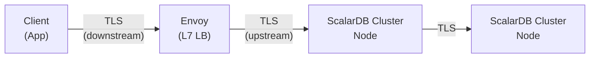
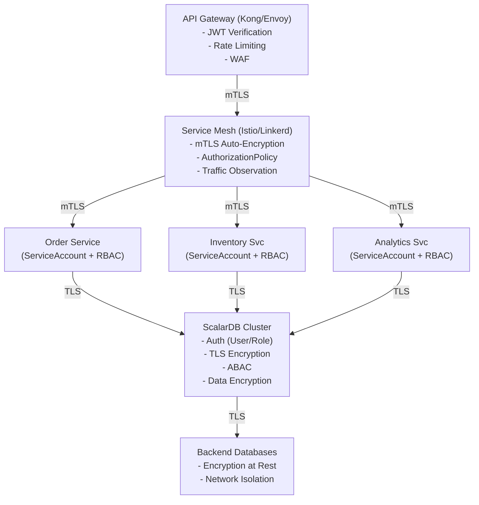
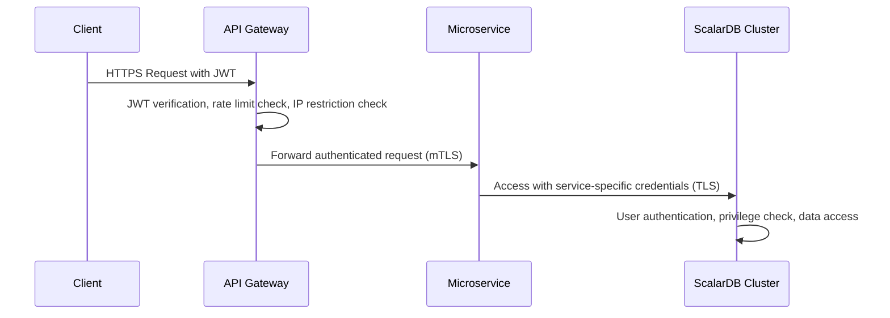
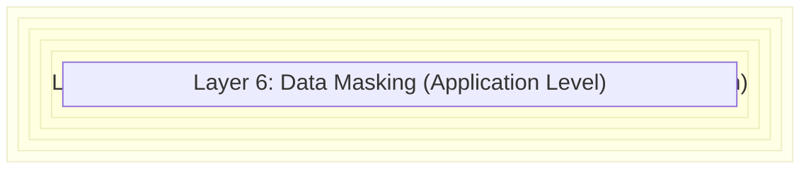
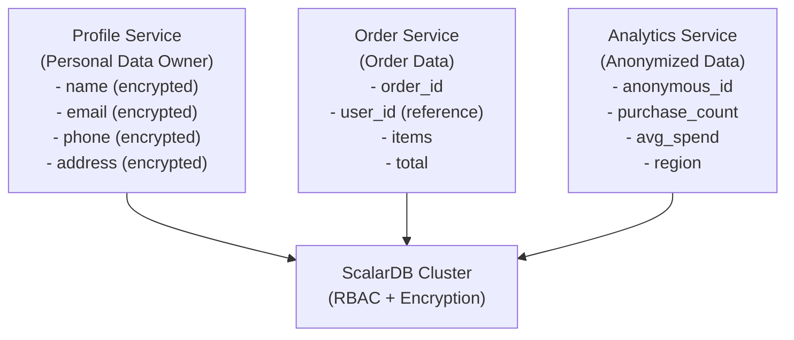

# ScalarDB Cluster + Microservices Architecture Security Model Research

## Overview

This document summarizes the findings of a research on comprehensive security models when operating ScalarDB Cluster in a microservices architecture. It covers ScalarDB Cluster-specific security features, security on Kubernetes, and compliance requirements in a systematic manner for production environments.

---

## 1. ScalarDB Cluster-Specific Security Features

### 1.1 Authentication

ScalarDB Cluster provides a built-in authentication mechanism that can be enabled with `scalar.db.cluster.auth.enabled=true`.

#### Authentication Architecture

- **Token-Based Authentication**: When a client authenticates with a username/password, an authentication token is issued
- **Password Hashing**: Passwords are stored hashed, with an optional pepper
- **Token Lifecycle Management**: Equipped with token expiration settings and garbage collection functionality

#### Server-Side Configuration

```properties
# Enable authentication and authorization
scalar.db.cluster.auth.enabled=true

# Authentication credential cache expiration (milliseconds, default: 60,000)
scalar.db.cluster.auth.cache_expiration_time_millis=60000

# Authentication token expiration (minutes, default: 1,440 = 1 day)
scalar.db.cluster.auth.auth_token_expiration_time_minutes=1440

# Token GC thread execution interval (minutes, default: 360 = 6 hours)
scalar.db.cluster.auth.auth_token_gc_thread_interval_minutes=360

# Pepper value for password hashing (optional, for security enhancement)
scalar.db.cluster.auth.pepper=<SECRET_PEPPER_VALUE>

# Enable cross-partition scan for system namespace (prerequisite for authentication)
scalar.db.cross_partition_scan.enabled=true
```

#### Client-Side Configuration (Java API)

```properties
# Enable client authentication
scalar.db.cluster.auth.enabled=true

# Authentication credentials for SQL interface
scalar.db.sql.cluster_mode.username=<USERNAME>
scalar.db.sql.cluster_mode.password=<PASSWORD>
```

#### Client-Side Configuration (.NET SDK)

```json
{
  "ScalarDbOptions": {
    "Address": "https://<HOSTNAME_OR_IP_ADDRESS>:<PORT>",
    "HopLimit": 10,
    "AuthEnabled": true,
    "Username": "<USERNAME>",
    "Password": "<PASSWORD>"
  }
}
```

#### User Management

ScalarDB Cluster has two types of users.

| User Type | Description |
|-----------|-------------|
| **Superuser** | Holds all privileges. Can create/delete other users and namespaces |
| **Regular User** | Has no privileges initially. Privileges are granted by a superuser |

An `admin` / `admin` superuser is automatically created in the initial state. **Be sure to change the password before deploying to production.**

```sql
-- Create user
CREATE USER app_user WITH PASSWORD 'secure_password_here';

-- List users
SHOW USERS;

-- Change password
ALTER USER admin WITH PASSWORD 'new_secure_password';

-- Delete user
DROP USER app_user;
```

#### Roadmap: OIDC Authentication

The ScalarDB roadmap (planned for CY2026 Q1) includes support for OpenID Connect (OIDC) authentication. This will enable integration with external IdPs (Identity Providers).

#### Brute Force / DoS Countermeasures

| Countermeasure | Implementation Location | Method |
|---------------|------------------------|--------|
| **Login attempt rate limiting** | API Gateway | Lockout after 5 failures for 15 minutes |
| **Rate limiting** | API Gateway (Kong) | IP-based rate limiting (e.g., 100 req/min) |
| **Cross-partition scan protection** | Application layer | `cross_partition_scan.enabled=true` is required, but enforce Limit specification on scan results at the application side |
| **Large data retrieval prevention** | API Gateway | Response size limits, enforce pagination |

References:
- [Authenticate and Authorize Users](https://scalardb.scalar-labs.com/docs/latest/scalardb-cluster/scalardb-auth-with-sql/)
- [ScalarDB Cluster Configurations](https://scalardb.scalar-labs.com/docs/latest/scalardb-cluster/scalardb-cluster-configurations/)
- [ScalarDB Roadmap](https://scalardb.scalar-labs.com/docs/latest/roadmap/)

---

### 1.2 Authorization

#### Role-Based Access Control (RBAC)

ScalarDB Cluster v3.17 and later supports RBAC, enabling privilege management through roles.

##### Available Privileges

| Privilege | Description |
|-----------|-------------|
| `SELECT` | Read data |
| `INSERT` | Insert data |
| `UPDATE` | Update data |
| `DELETE` | Delete data |
| `CREATE` | Create tables/namespaces |
| `DROP` | Drop tables/namespaces |
| `TRUNCATE` | Delete all data from a table |
| `ALTER` | Modify table structure |
| `GRANT` | Grant privileges |

##### Privilege Constraints

- `INSERT` and `UPDATE` must always be granted/revoked as a set
- Granting `UPDATE` or `DELETE` requires the target user to hold `SELECT`
- `SELECT` cannot be revoked from a user holding `INSERT` or `UPDATE`

##### Role Management SQL

```sql
-- Create roles
CREATE ROLE readonly_role;
CREATE ROLE data_writer_role;
CREATE ROLE cleanup_role;

-- Grant privileges to roles (table level)
GRANT SELECT ON ns1.users TO ROLE readonly_role;
GRANT SELECT, INSERT, UPDATE ON ns1.orders TO ROLE data_writer_role;
GRANT DELETE, TRUNCATE ON ns1.logs TO ROLE cleanup_role;

-- Grant privileges to roles (namespace level)
GRANT SELECT ON NAMESPACE ns_analytics TO ROLE readonly_role;

-- Assign roles to users
GRANT ROLE readonly_role TO analyst_user;
GRANT ROLE data_writer_role TO app_user;

-- Grant role with admin delegation
GRANT ROLE cleanup_role TO ops_user WITH ADMIN OPTION;

-- Revoke roles
REVOKE ROLE readonly_role FROM analyst_user;
REVOKE ADMIN OPTION FOR cleanup_role FROM ops_user;

-- Check privileges
SHOW GRANTS FOR app_user;
SHOW ROLE GRANTS FOR readonly_role;
SHOW ROLES;
```

##### Privilege Design Example for Microservices Pattern

```sql
-- User for order service
CREATE USER order_service WITH PASSWORD '<SECURE_PASSWORD>';
GRANT SELECT, INSERT, UPDATE ON order_db.orders TO order_service;
GRANT SELECT ON order_db.order_items TO order_service;
GRANT SELECT ON product_db.products TO order_service;  -- Read only

-- User for inventory service
CREATE USER inventory_service WITH PASSWORD '<SECURE_PASSWORD>';
GRANT SELECT, INSERT, UPDATE ON inventory_db.stock TO inventory_service;
GRANT SELECT ON inventory_db.warehouses TO inventory_service;

-- User for analytics service (read-only)
CREATE USER analytics_service WITH PASSWORD '<SECURE_PASSWORD>';
CREATE ROLE analytics_readonly;
GRANT SELECT ON NAMESPACE order_db TO ROLE analytics_readonly;
GRANT SELECT ON NAMESPACE inventory_db TO ROLE analytics_readonly;
GRANT ROLE analytics_readonly TO analytics_service;
```

#### Attribute-Based Access Control (ABAC)

ScalarDB Cluster provides ABAC (Attribute-Based Access Control) functionality as of v3.17. ABAC enables finer-grained access control based on table-level policies.

```properties
# Enable ABAC
scalar.db.cluster.abac.enabled=true

# ABAC metadata cache expiration (milliseconds, default: 60,000)
scalar.db.cluster.abac.cache_expiration_time_millis=60000
```

**Prerequisites**:
- Authentication and authorization must be enabled (`scalar.db.cluster.auth.enabled=true`)
- Cross-partition scan for system namespace must be enabled

References:
- [Authenticate and Authorize Users](https://scalardb.scalar-labs.com/docs/latest/scalardb-cluster/scalardb-auth-with-sql/)
- [ScalarDB Cluster Configurations](https://scalardb.scalar-labs.com/docs/latest/scalardb-cluster/scalardb-cluster-configurations/)
- [ScalarDB 3.17 Release Notes](https://scalardb.scalar-labs.com/docs/latest/releases/release-notes/)

---

### 1.3 TLS Encryption (Wire Encryption)

ScalarDB Cluster supports TLS encryption for client-to-Cluster and intra-Cluster node-to-node communication.

#### TLS Communication Architecture



#### Server-Side TLS Configuration

```properties
# Enable TLS
scalar.db.cluster.tls.enabled=true

# CA root certificate path
scalar.db.cluster.tls.ca_root_cert_path=/tls/scalardb-cluster/certs/ca.crt

# Server certificate chain
scalar.db.cluster.node.tls.cert_chain_path=/tls/scalardb-cluster/certs/tls.crt

# Server private key
scalar.db.cluster.node.tls.private_key_path=/tls/scalardb-cluster/certs/tls.key

# Hostname override for TLS verification (used for testing or DNS configuration)
scalar.db.cluster.tls.override_authority=cluster.scalardb.example.com
```

#### Client-Side TLS Configuration

```properties
# Enable client-side TLS
scalar.db.cluster.tls.enabled=true

# CA certificate path (PEM file path or PEM data)
scalar.db.cluster.tls.ca_root_cert_path=/certs/ca.crt
# Or specify PEM data directly
# scalar.db.cluster.tls.ca_root_cert_pem=-----BEGIN CERTIFICATE-----...

# Hostname override
scalar.db.cluster.tls.override_authority=envoy.scalar.example.com
```

#### TLS Configuration via Helm Chart

##### Method 1: Manual Certificate Management

```yaml
# Kubernetes Secret creation
# kubectl create secret generic scalardb-cluster-tls-ca \
#   --from-file=ca.crt=ca.pem
# kubectl create secret generic scalardb-cluster-tls-cert \
#   --from-file=tls.crt=scalardb-cluster.pem
# kubectl create secret generic scalardb-cluster-tls-key \
#   --from-file=tls.key=scalardb-cluster-key.pem

envoy:
  enabled: true
  tls:
    downstream:
      enabled: true
      certChainSecret: "envoy-tls-cert"
      privateKeySecret: "envoy-tls-key"
    upstream:
      enabled: true
      overrideAuthority: "cluster.scalardb.example.com"
      caRootCertSecret: "scalardb-cluster-tls-ca"

scalardbCluster:
  scalardbClusterNodeProperties: |
    scalar.db.cluster.tls.enabled=true
    scalar.db.cluster.tls.ca_root_cert_path=/tls/scalardb-cluster/certs/ca.crt
    scalar.db.cluster.node.tls.cert_chain_path=/tls/scalardb-cluster/certs/tls.crt
    scalar.db.cluster.node.tls.private_key_path=/tls/scalardb-cluster/certs/tls.key
    scalar.db.cluster.tls.override_authority=cluster.scalardb.example.com
  tls:
    enabled: true
    overrideAuthority: "cluster.scalardb.example.com"
    caRootCertSecret: "scalardb-cluster-tls-ca"
    certChainSecret: "scalardb-cluster-tls-cert"
    privateKeySecret: "scalardb-cluster-tls-key"
```

##### Method 2: cert-manager Automatic Management (Trusted CA)

```yaml
scalardbCluster:
  tls:
    enabled: true
    certManager:
      enabled: true
      issuerRef:
        name: <YOUR_TRUSTED_CA_ISSUER>
      dnsNames:
        - cluster.scalardb.example.com
```

##### Method 3: cert-manager Self-Signed Certificate (Development/Testing)

```yaml
scalardbCluster:
  tls:
    enabled: true
    certManager:
      enabled: true
      selfSigned:
        enabled: true
      dnsNames:
        - cluster.scalardb.example.com
```

#### Certificate Creation Steps (Using cfssl)

```bash
# 1. Create working directory
mkdir -p ${HOME}/scalar/certs/ && cd ${HOME}/scalar/certs/

# 2. Create CA configuration file (ca.json)
cat > ca.json <<'EOF'
{
  "CN": "ScalarDB Test CA",
  "key": {
    "algo": "ecdsa",
    "size": 256
  },
  "names": [
    {
      "C": "JP",
      "ST": "Tokyo",
      "L": "Shinjuku"
    }
  ]
}
EOF

# 3. Generate CA certificate
cfssl gencert -initca ca.json | cfssljson -bare ca

# 4. Create CA signing profile (ca-config.json)
cat > ca-config.json <<'EOF'
{
  "signing": {
    "default": {
      "expiry": "87600h"
    },
    "profiles": {
      "scalar-ca": {
        "expiry": "87600h",
        "usages": ["signing", "key encipherment", "server auth"]
      }
    }
  }
}
EOF

# 5. Create server certificate configuration (server.json)
cat > server.json <<'EOF'
{
  "CN": "cluster.scalardb.example.com",
  "hosts": [
    "cluster.scalardb.example.com",
    "*.scalardb-cluster-headless.default.svc.cluster.local"
  ],
  "key": {
    "algo": "ecdsa",
    "size": 256
  }
}
EOF

# 6. Generate server certificate
cfssl gencert -ca ca.pem -ca-key ca-key.pem \
  -config ca-config.json -profile scalar-ca \
  server.json | cfssljson -bare server

# Output files: server-key.pem (private key), server.pem (certificate), ca.pem (CA certificate)
```

**Production Note**: Do not use self-signed certificates in production environments. Obtain certificates from a trusted CA. Supported algorithms are RSA or ECDSA only.

References:
- [Getting Started with Helm Charts (ScalarDB Cluster with TLS)](https://scalardb.scalar-labs.com/docs/latest/helm-charts/getting-started-scalardb-cluster-tls/)
- [How to Create Private Key and Certificate Files](https://scalardb.scalar-labs.com/docs/latest/scalar-kubernetes/HowToCreateKeyAndCertificateFiles/)
- [Configure a custom values file for ScalarDB Cluster](https://scalardb.scalar-labs.com/docs/latest/helm-charts/configure-custom-values-scalardb-cluster/)

---

### 1.4 Audit Logging

#### Current Status (v3.17)

As of ScalarDB Cluster v3.17, no dedicated audit logging feature is provided. The ScalarDB roadmap (planned for CY2026 Q2) includes implementation of audit logging functionality.

> "Users will be able to view and manage the access logs of ScalarDB Cluster and Analytics, mainly for auditing purposes."

#### Current Alternative Approaches

##### 1. Application-Level Logging

Configure the ScalarDB Cluster log level and collect operation logs.

```yaml
scalardbCluster:
  logLevel: INFO  # DEBUG, INFO, WARN, ERROR
```

##### 2. Log Collection on Kubernetes (Grafana Loki + Promtail)

```bash
# Deploy Loki stack
helm repo add grafana https://grafana.github.io/helm-charts
helm install scalar-logging-loki grafana/loki-stack \
  -n monitoring \
  -f scalar-loki-stack-custom-values.yaml
```

Grafana data source configuration:

```yaml
# Loki data source configuration in scalar-prometheus-custom-values.yaml
grafana:
  additionalDataSources:
    - name: Loki
      type: loki
      url: http://scalar-logging-loki:3100/
      access: proxy
```

##### 3. Backend DB Audit Logging

Use the audit logging features of the backend database (PostgreSQL, MySQL, etc.) to record actual data access.

```sql
-- PostgreSQL example: pgaudit configuration
-- postgresql.conf
-- shared_preload_libraries = 'pgaudit'
-- pgaudit.log = 'write, ddl, role'
```

##### 4. Monitoring via Prometheus Metrics

```yaml
scalardbCluster:
  serviceMonitor:
    enabled: true
  prometheusRule:
    enabled: true
  grafanaDashboard:
    enabled: true
```

References:
- [ScalarDB Roadmap](https://scalardb.scalar-labs.com/docs/latest/roadmap/)
- [Getting Started with Helm Charts (Logging using Loki Stack)](https://scalardb.scalar-labs.com/docs/latest/helm-charts/getting-started-logging/)
- [Monitoring Scalar products on a Kubernetes cluster](https://scalardb.scalar-labs.com/docs/latest/scalar-kubernetes/K8sMonitorGuide/)

### Interim Audit Log Measures (Mandatory Actions Before ScalarDB Audit Logging Is Available)

ScalarDB Cluster's native audit logging feature is planned for release in CY2026 Q2. Until then, the following interim measures are **mandatory** to meet compliance requirements.

| Measure | Priority | Implementation Method |
|---------|----------|----------------------|
| **Enable backend DB audit logging** | Mandatory | PostgreSQL: pgaudit extension, MySQL: audit_log plugin |
| **Enable Kubernetes Audit Log** | Mandatory | Record Secret/Pod operations in the ScalarDB Cluster namespace |
| **Application-side Structured Audit Logging** | Mandatory | Record who performed what operation on which table in structured logs |
| **Log tampering prevention** | Recommended | Use WORM (Write Once Read Many) storage, or immutable log backends (Amazon S3 Object Lock, etc.) |
| **Log retention period configuration** | Mandatory | PCI-DSS: 1 year or more, HIPAA: 6 years or more retention settings |

---

### 1.5 Coordinator Table Protection

The Coordinator table stores transaction states (COMMITTED, ABORTED, etc.). Unauthorized access or tampering with this table leads to the destruction of transaction consistency.

| Measure | Implementation Method |
|---------|----------------------|
| **Access control** | Only the ScalarDB DB user (scalardb_app) should have access |
| **Prohibit direct access** | Direct SQL modifications by DBAs may break consistency; always operate through the ScalarDB API |
| **Monitoring** | Detect direct UPDATE/DELETE to the Coordinator table via DB audit logs and trigger alerts |
| **Backup** | Prioritize backups of the DB containing the Coordinator table |

---

## 2. Network Security

### 2.1 Communication Encryption via Service Mesh

Leverage service mesh to encrypt communication between microservices and achieve a zero-trust network.

#### mTLS Implementation with Istio

```yaml
# PeerAuthentication: Enforce STRICT mTLS across the namespace
apiVersion: security.istio.io/v1
kind: PeerAuthentication
metadata:
  name: default
  namespace: scalardb-namespace
spec:
  mtls:
    mode: STRICT
---
# AuthorizationPolicy: Access control for ScalarDB Cluster
apiVersion: security.istio.io/v1
kind: AuthorizationPolicy
metadata:
  name: scalardb-cluster-access
  namespace: scalardb-namespace
spec:
  selector:
    matchLabels:
      app.kubernetes.io/name: scalardb-cluster
  action: ALLOW
  rules:
    - from:
        - source:
            principals:
              - "cluster.local/ns/app-namespace/sa/order-service"
              - "cluster.local/ns/app-namespace/sa/inventory-service"
      to:
        - operation:
            ports: ["60053"]  # gRPC/SQL port
---
# Default deny policy
apiVersion: security.istio.io/v1
kind: AuthorizationPolicy
metadata:
  name: deny-all
  namespace: scalardb-namespace
spec:
  {}
```

#### mTLS Implementation with Linkerd

```yaml
# Linkerd annotation for automatic mTLS enablement
apiVersion: apps/v1
kind: Deployment
metadata:
  name: scalardb-cluster
  annotations:
    linkerd.io/inject: enabled
spec:
  template:
    metadata:
      annotations:
        linkerd.io/inject: enabled
---
# ServerAuthorization: Access permission policy
apiVersion: policy.linkerd.io/v1beta1
kind: ServerAuthorization
metadata:
  name: scalardb-cluster-auth
  namespace: scalardb-namespace
spec:
  server:
    name: scalardb-cluster-grpc
  client:
    meshTLS:
      serviceAccounts:
        - name: order-service
          namespace: app-namespace
        - name: inventory-service
          namespace: app-namespace
```

#### ScalarDB Cluster TLS vs Service Mesh Selection Guide

| Communication Path | ScalarDB TLS | Service Mesh mTLS | Recommendation |
|-------------------|-------------|-------------------|----------------|
| Client -> ScalarDB Cluster | Supported | Supported | Both usable. ScalarDB TLS also serves as application-level authentication |
| ScalarDB Cluster inter-node | Supported | Supported | ScalarDB TLS recommended (for Cluster internal communication) |
| Between microservices | - | Supported | Service mesh mTLS recommended |
| ScalarDB Cluster -> Backend DB | - | Limited | Use backend DB-side TLS configuration |

References:
- [Istio Security](https://istio.io/latest/docs/concepts/security/)
- [Zero Trust for Kubernetes: Implementing Service Mesh Security](https://medium.com/@heinancabouly/zero-trust-for-kubernetes-implementing-service-mesh-security-529adb66665a)

---

### 2.2 Kubernetes NetworkPolicy

ScalarDB Cluster is recommended to be deployed on a private network. NetworkPolicy is used to block unnecessary traffic.

#### Default Deny Policy

```yaml
# Default deny all Ingress traffic in the namespace
apiVersion: networking.k8s.io/v1
kind: NetworkPolicy
metadata:
  name: default-deny-ingress
  namespace: scalardb-namespace
spec:
  podSelector: {}
  policyTypes:
    - Ingress

---
# Default deny all Egress traffic in the namespace
apiVersion: networking.k8s.io/v1
kind: NetworkPolicy
metadata:
  name: default-deny-egress
  namespace: scalardb-namespace
spec:
  podSelector: {}
  policyTypes:
    - Egress
```

#### NetworkPolicy for ScalarDB Cluster

```yaml
apiVersion: networking.k8s.io/v1
kind: NetworkPolicy
metadata:
  name: scalardb-cluster-network-policy
  namespace: scalardb-namespace
spec:
  podSelector:
    matchLabels:
      app.kubernetes.io/name: scalardb-cluster
  policyTypes:
    - Ingress
    - Egress
  ingress:
    # gRPC/SQL access (from client applications)
    - from:
        - namespaceSelector:
            matchLabels:
              name: app-namespace
        - podSelector:
            matchLabels:
              app: order-service
      ports:
        - port: 60053
          protocol: TCP
    # GraphQL access (if needed)
    - from:
        - namespaceSelector:
            matchLabels:
              name: app-namespace
      ports:
        - port: 8080
          protocol: TCP
    # Prometheus metrics collection
    - from:
        - namespaceSelector:
            matchLabels:
              name: monitoring
      ports:
        - port: 9080
          protocol: TCP
    # Intra-Cluster node communication
    - from:
        - podSelector:
            matchLabels:
              app.kubernetes.io/name: scalardb-cluster
  egress:
    # Connection to backend DB
    - to:
        - namespaceSelector:
            matchLabels:
              name: database-namespace
      ports:
        - port: 5432  # PostgreSQL
          protocol: TCP
    # DNS resolution
    - to:
        - namespaceSelector: {}
          podSelector:
            matchLabels:
              k8s-app: kube-dns
      ports:
        - port: 53
          protocol: UDP
        - port: 53
          protocol: TCP
    # Intra-Cluster node communication
    - to:
        - podSelector:
            matchLabels:
              app.kubernetes.io/name: scalardb-cluster
```

#### NetworkPolicy for Envoy (Indirect Mode)

```yaml
apiVersion: networking.k8s.io/v1
kind: NetworkPolicy
metadata:
  name: envoy-network-policy
  namespace: scalardb-namespace
spec:
  podSelector:
    matchLabels:
      app.kubernetes.io/name: envoy
  policyTypes:
    - Ingress
    - Egress
  ingress:
    # gRPC access from external clients
    - from:
        - namespaceSelector:
            matchLabels:
              name: app-namespace
      ports:
        - port: 60053
          protocol: TCP
    # Envoy monitoring port
    - from:
        - namespaceSelector:
            matchLabels:
              name: monitoring
      ports:
        - port: 9001
          protocol: TCP
  egress:
    # Connection to ScalarDB Cluster
    - to:
        - podSelector:
            matchLabels:
              app.kubernetes.io/name: scalardb-cluster
      ports:
        - port: 60053
          protocol: TCP
```

**Note**: When using NetworkPolicy in AKS environments, kubenet only supports Calico Network Policy and is not covered by Azure support teams. Use Azure CNI to receive Azure support.

References:
- [Guidelines for creating an EKS cluster for ScalarDB Cluster](https://scalardb.scalar-labs.com/docs/latest/scalar-kubernetes/CreateEKSClusterForScalarDBCluster/)
- [Configure a custom values file for ScalarDB Cluster](https://scalardb.scalar-labs.com/docs/latest/helm-charts/configure-custom-values-scalardb-cluster/)

---

### 2.3 Applying Zero Trust Principles

Apply zero trust principles in a microservices architecture to the ScalarDB Cluster environment.

#### Zero Trust Implementation Matrix

| Principle | Implementation Method | ScalarDB Cluster Support |
|-----------|----------------------|--------------------------|
| **Never Trust, Always Verify** | Authenticate and authorize every request | Supported by authentication/authorization features |
| **Least Privilege** | Grant only minimum necessary access rights | Supported by table/namespace-level RBAC |
| **Microsegmentation** | Segment the network at fine granularity | Supported by NetworkPolicy + service mesh |
| **Encrypted Communication** | Encrypt all communication | Supported by TLS + mTLS |
| **Continuous Monitoring** | Record and monitor all access | Supported by Prometheus/Grafana + log collection |
| **Device/Workload Verification** | Verify workload identity | Supported by service mesh SPIFFE IDs |

#### Zero Trust Architecture Diagram



---

### 2.4 Authentication and Authorization at the API Gateway

Deploy an API Gateway as a unified entry point for microservices, centralizing authentication and authorization.

#### Kong API Gateway Configuration Example

```yaml
# JWT authentication plugin
apiVersion: configuration.konghq.com/v1
kind: KongPlugin
metadata:
  name: jwt-auth
  namespace: app-namespace
config:
  key_claim_name: iss
  claims_to_verify:
    - exp
plugin: jwt
---
# Rate limiting plugin
apiVersion: configuration.konghq.com/v1
kind: KongPlugin
metadata:
  name: rate-limiting
  namespace: app-namespace
config:
  minute: 100
  hour: 5000
  policy: redis
plugin: rate-limiting
---
# IP restriction
apiVersion: configuration.konghq.com/v1
kind: KongPlugin
metadata:
  name: ip-restriction
  namespace: app-namespace
config:
  allow:
    - 10.0.0.0/8
    - 172.16.0.0/12
plugin: ip-restriction
---
# Routing to service
apiVersion: networking.k8s.io/v1
kind: Ingress
metadata:
  name: order-service-ingress
  annotations:
    konghq.com/plugins: jwt-auth,rate-limiting,ip-restriction
    konghq.com/protocols: https
spec:
  ingressClassName: kong
  tls:
    - hosts:
        - api.example.com
      secretName: api-tls-cert
  rules:
    - host: api.example.com
      http:
        paths:
          - path: /api/v1/orders
            pathType: Prefix
            backend:
              service:
                name: order-service
                port:
                  number: 8080
```

#### Authentication Flow



---

## 3. Data Security

### 3.1 Encryption at Rest

ScalarDB Cluster provides the ability to transparently encrypt data from the application's perspective. Encryption is performed before data is stored in the backend database, and decryption occurs on read.

#### Column-Level Encryption in ScalarDB Cluster

##### Method 1: HashiCorp Vault Encryption

```properties
# ScalarDB Cluster node configuration
scalar.db.cluster.encryption.enabled=true
scalar.db.cluster.encryption.type=vault
scalar.db.cluster.encryption.vault.address=https://vault.example.com:8200
scalar.db.cluster.encryption.vault.token=<VAULT_TOKEN>
scalar.db.cluster.encryption.vault.namespace=scalardb
scalar.db.cluster.encryption.vault.transit_secrets_engine_path=transit
scalar.db.cluster.encryption.vault.key_type=aes256-gcm96
scalar.db.cluster.encryption.vault.column_batch_size=64
scalar.db.cross_partition_scan.enabled=true
```

Helm Chart configuration:

```yaml
scalardbCluster:
  scalardbClusterNodeProperties: |
    scalar.db.cluster.encryption.enabled=true
    scalar.db.cluster.encryption.type=vault
    scalar.db.cluster.encryption.vault.address=https://vault.example.com:8200
    scalar.db.cluster.encryption.vault.token=${env:VAULT_TOKEN}
    scalar.db.cluster.encryption.vault.transit_secrets_engine_path=transit
    scalar.db.cluster.encryption.vault.key_type=aes256-gcm96
    scalar.db.cross_partition_scan.enabled=true
  encryption:
    enabled: true
    type: "vault"
  secretName: "scalardb-cluster-vault-secret"
```

> **Security Warning**: The static Vault Token (`${env:VAULT_TOKEN}`) above is for development environments only. Switch to Kubernetes ServiceAccount Token-based authentication for production environments. Static tokens are difficult to rotate and have a significant impact if leaked, so their use in production is not recommended.

##### Method 2: Self Encryption (Using Kubernetes Secrets)

```properties
scalar.db.cluster.encryption.enabled=true
scalar.db.cluster.encryption.type=self
scalar.db.cluster.encryption.self.key_type=AES256_GCM
scalar.db.cluster.encryption.self.kubernetes.secret.namespace_name=scalardb-namespace
scalar.db.cluster.encryption.self.data_encryption_key_cache_expiration_time=60000
scalar.db.cross_partition_scan.enabled=true
```

Helm Chart configuration:

```yaml
scalardbCluster:
  scalardbClusterNodeProperties: |
    scalar.db.cluster.encryption.enabled=true
    scalar.db.cluster.encryption.type=self
    scalar.db.cluster.encryption.self.key_type=AES256_GCM
    scalar.db.cluster.encryption.self.kubernetes.secret.namespace_name=${env:SCALAR_DB_CLUSTER_ENCRYPTION_SELF_KUBERNETES_SECRET_NAMESPACE_NAME}
    scalar.db.cross_partition_scan.enabled=true
  encryption:
    enabled: true
    type: "self"
```

##### Supported Encryption Algorithms

| Encryption Method | Vault | Self |
|-------------------|-------|------|
| AES-128-GCM | `aes128-gcm96` | `AES128_GCM` |
| AES-256-GCM | `aes256-gcm96` | `AES256_GCM` |
| ChaCha20-Poly1305 | `chacha20-poly1305` | `CHACHA20_POLY1305` |
| AES-128-EAX | - | `AES128_EAX` |
| AES-256-EAX | - | `AES256_EAX` |
| AES-128-CTR-HMAC-SHA256 | - | `AES128_CTR_HMAC_SHA256` |
| AES-256-CTR-HMAC-SHA256 | - | `AES256_CTR_HMAC_SHA256` |
| XChaCha20-Poly1305 | - | `XCHACHA20_POLY1305` |

##### Column Encryption in Table Definitions

```sql
-- Specify encryption target columns with the ENCRYPTED keyword
CREATE TABLE customer_db.customers (
  customer_id INT PRIMARY KEY,
  name TEXT,
  email TEXT ENCRYPTED,          -- Encryption target
  phone TEXT ENCRYPTED,          -- Encryption target
  credit_card TEXT ENCRYPTED,    -- Encryption target
  address TEXT,
  created_at BIGINT
);

CREATE TABLE order_db.payments (
  payment_id INT PRIMARY KEY,
  order_id INT,
  amount DOUBLE,
  card_number TEXT ENCRYPTED,    -- Encryption target
  card_holder TEXT ENCRYPTED,    -- Encryption target
  status TEXT,
  processed_at BIGINT
);
```

##### Encryption Constraints

- **Primary key columns cannot be encrypted**: ENCRYPTED cannot be specified on PRIMARY KEY columns
- **Cannot be used in WHERE clauses**: Encrypted columns cannot be used in WHERE or ORDER BY clauses
- **BLOB size limitation**: Encrypted data is stored as BLOB type, so be aware of backend DB BLOB size limits
- **Column renaming not possible**: Encrypted columns cannot be renamed
- **Type change not possible**: Data type changes on encrypted columns are not possible

#### Backend DB-Side Encryption at Rest

In addition to ScalarDB Cluster's column-level encryption, it is recommended to also use storage-level encryption on the backend DB side.

| Backend DB | Encryption Feature | Configuration Method |
|-----------|-------------------|---------------------|
| **PostgreSQL** | TDE (Transparent Data Encryption) | Configure in `postgresql.conf`, or enable via cloud managed service |
| **MySQL** | InnoDB Tablespace Encryption | `innodb_encrypt_tables=ON` |
| **Amazon DynamoDB** | AWS KMS Integration | Encrypted by default. Customer-managed keys also selectable |
| **Azure Cosmos DB** | Service-Managed Encryption | Enabled by default. Customer-managed keys also selectable |
| **Amazon RDS** | Storage Encryption | Specify `--storage-encrypted` at instance creation |

References:
- [Encrypt Data at Rest](https://scalardb.scalar-labs.com/docs/latest/scalardb-cluster/encrypt-data-at-rest/)
- [ScalarDB Cluster Configurations](https://scalardb.scalar-labs.com/docs/latest/scalardb-cluster/scalardb-cluster-configurations/)

---

### 3.2 Encryption in Transit

Enable TLS on all communication paths to protect data in transit.

#### Communication Paths for Encryption

| Communication Path | Encryption Method | Configuration Location |
|-------------------|------------------|----------------------|
| Client -> Envoy | TLS | Envoy downstream TLS settings |
| Envoy -> ScalarDB Cluster | TLS | Envoy upstream TLS + ScalarDB Cluster TLS settings |
| ScalarDB Cluster inter-node | TLS | ScalarDB Cluster TLS settings |
| ScalarDB Cluster -> Backend DB | TLS | Backend DB connection settings |
| Between microservices | mTLS | Service mesh settings |
| Prometheus -> ScalarDB Cluster | TLS | ServiceMonitor TLS settings |

#### TLS Configuration Example for Backend DB Connection

```properties
# TLS connection to PostgreSQL
scalar.db.contact_points=jdbc:postgresql://db.example.com:5432/scalardb?ssl=true&sslmode=verify-full&sslrootcert=/certs/db-ca.crt

# TLS connection to MySQL
scalar.db.contact_points=jdbc:mysql://db.example.com:3306/scalardb?useSSL=true&requireSSL=true&verifyServerCertificate=true
```

#### Prometheus Monitoring TLS Configuration

```yaml
scalardbCluster:
  tls:
    caRootCertSecretForServiceMonitor: "scalardb-cluster-tls-ca-for-prometheus"
  serviceMonitor:
    enabled: true
```

**Important**: ScalarDB official documentation strongly recommends enabling wire encryption (TLS) in production environments when authentication/authorization or data encryption features are enabled.

References:
- [Getting Started with Helm Charts (ScalarDB Cluster with TLS)](https://scalardb.scalar-labs.com/docs/latest/helm-charts/getting-started-scalardb-cluster-tls/)
- [Configure a custom values file for ScalarDB Cluster](https://scalardb.scalar-labs.com/docs/latest/helm-charts/configure-custom-values-scalardb-cluster/)

---

### 3.3 Field-Level Encryption

ScalarDB Cluster natively supports column-level encryption via the `ENCRYPTED` keyword (detailed in Section 3.1). This functions as field-level encryption, allowing selective encryption of only columns containing sensitive data.

#### Usage Patterns in Microservices

```sql
-- Customer service: Encrypt personal information
CREATE TABLE customer_ns.profiles (
  user_id INT PRIMARY KEY,
  username TEXT,
  email TEXT ENCRYPTED,
  phone_number TEXT ENCRYPTED,
  date_of_birth TEXT ENCRYPTED,
  preferences TEXT              -- Non-sensitive data does not need encryption
);

-- Payment service: Encrypt financial information
CREATE TABLE payment_ns.payment_methods (
  method_id INT PRIMARY KEY,
  user_id INT,
  card_number TEXT ENCRYPTED,
  card_expiry TEXT ENCRYPTED,
  card_cvv TEXT ENCRYPTED,
  billing_address TEXT ENCRYPTED,
  is_default BOOLEAN
);

-- Healthcare service: Encrypt health information
CREATE TABLE health_ns.medical_records (
  record_id INT PRIMARY KEY,
  patient_id INT,
  diagnosis TEXT ENCRYPTED,
  prescription TEXT ENCRYPTED,
  doctor_notes TEXT ENCRYPTED,
  visit_date BIGINT
);
```

---

### 3.4 Data Masking

As of ScalarDB Cluster v3.17, no native data masking feature is provided. Use the following approaches as alternatives.

#### Application-Level Data Masking

```java
// Data masking utility example
public class DataMaskingUtil {

    // Email masking: user@example.com -> u***@example.com
    public static String maskEmail(String email) {
        if (email == null || !email.contains("@")) return "***";
        String[] parts = email.split("@");
        return parts[0].charAt(0) + "***@" + parts[1];
    }

    // Phone number masking: 090-1234-5678 -> 090-****-5678
    public static String maskPhone(String phone) {
        if (phone == null || phone.length() < 4) return "***";
        return phone.substring(0, 4) + "****" + phone.substring(phone.length() - 4);
    }

    // Credit card number masking: 4111111111111111 -> ****1111
    public static String maskCreditCard(String cardNumber) {
        if (cardNumber == null || cardNumber.length() < 4) return "***";
        return "****" + cardNumber.substring(cardNumber.length() - 4);
    }
}
```

#### Masking via Database Views (Backend DB Side)

```sql
-- PostgreSQL example: Masking view
CREATE VIEW customer_masked AS
SELECT
  customer_id,
  name,
  CONCAT(LEFT(email, 1), '***@', SPLIT_PART(email, '@', 2)) AS email,
  CONCAT(LEFT(phone, 3), '-****-', RIGHT(phone, 4)) AS phone,
  '****' || RIGHT(credit_card, 4) AS credit_card
FROM customers;
```

---

## 4. Security on Kubernetes

### 4.1 Pod Security Standards / Policies

Since Kubernetes 1.25, Pod Security Policies (PSP) have been deprecated and Pod Security Standards (PSS) have become the standard. It is recommended to apply the `restricted` profile to ScalarDB Cluster Pods.

#### Pod Security Admission Configuration

```yaml
# Apply Pod Security Standards at namespace level
apiVersion: v1
kind: Namespace
metadata:
  name: scalardb-namespace
  labels:
    pod-security.kubernetes.io/enforce: restricted
    pod-security.kubernetes.io/audit: restricted
    pod-security.kubernetes.io/warn: restricted
```

#### ScalarDB Cluster Helm Chart SecurityContext Configuration

```yaml
scalardbCluster:
  # Pod-level security context
  podSecurityContext:
    runAsNonRoot: true
    runAsUser: 1000
    runAsGroup: 1000
    fsGroup: 1000
    seccompProfile:
      type: RuntimeDefault

  # Container-level security context
  securityContext:
    capabilities:
      drop:
        - ALL
    runAsNonRoot: true
    allowPrivilegeEscalation: false
    readOnlyRootFilesystem: true
    seccompProfile:
      type: RuntimeDefault
```

#### Three Levels of Pod Security Standards

| Level | Description | Application in ScalarDB Cluster |
|-------|-------------|-------------------------------|
| **Privileged** | No restrictions | Not recommended |
| **Baseline** | Basic restrictions | Minimum |
| **Restricted** | Most strict restrictions | Recommended for production |

References:
- [Configure a custom values file for ScalarDB Cluster](https://scalardb.scalar-labs.com/docs/latest/helm-charts/configure-custom-values-scalardb-cluster/)
- [Pod Security Standards](https://kubernetes.io/docs/concepts/security/pod-security-standards/)

---

### 4.2 Kubernetes RBAC Configuration

In ScalarDB Cluster's `direct-kubernetes` mode, client applications discover ScalarDB Cluster endpoints through the Kubernetes API. Appropriate RBAC configuration is required for this.

#### RBAC for direct-kubernetes Mode

```yaml
# Role: Permission to read ScalarDB Cluster endpoint information
apiVersion: rbac.authorization.k8s.io/v1
kind: Role
metadata:
  name: scalardb-cluster-client-role
  namespace: scalardb-namespace
rules:
  - apiGroups: [""]
    resources: ["endpoints"]
    verbs: ["get", "watch", "list"]
---
# ServiceAccount: For client applications
apiVersion: v1
kind: ServiceAccount
metadata:
  name: order-service-sa
  namespace: app-namespace
---
# RoleBinding: Bind the Role to the ServiceAccount
apiVersion: rbac.authorization.k8s.io/v1
kind: RoleBinding
metadata:
  name: scalardb-cluster-client-rolebinding
  namespace: scalardb-namespace
subjects:
  - kind: ServiceAccount
    name: order-service-sa
    namespace: app-namespace
roleRef:
  kind: Role
  name: scalardb-cluster-client-role
  apiGroup: rbac.authorization.k8s.io
```

#### RBAC for Operations Team

```yaml
# ClusterRole: ScalarDB operations administrator
apiVersion: rbac.authorization.k8s.io/v1
kind: ClusterRole
metadata:
  name: scalardb-operator
rules:
  - apiGroups: [""]
    resources: ["pods", "services", "configmaps"]
    verbs: ["get", "list", "watch"]
  - apiGroups: [""]
    resources: ["secrets"]
    verbs: ["get", "list"]  # No write permission granted
  - apiGroups: ["apps"]
    resources: ["deployments", "statefulsets"]
    verbs: ["get", "list", "watch", "update", "patch"]
  - apiGroups: [""]
    resources: ["pods/log"]
    verbs: ["get", "list"]
---
# ClusterRole: ScalarDB read-only (for monitoring)
apiVersion: rbac.authorization.k8s.io/v1
kind: ClusterRole
metadata:
  name: scalardb-viewer
rules:
  - apiGroups: [""]
    resources: ["pods", "services", "configmaps"]
    verbs: ["get", "list", "watch"]
  - apiGroups: ["apps"]
    resources: ["deployments", "statefulsets"]
    verbs: ["get", "list", "watch"]
```

References:
- [How to deploy ScalarDB Cluster](https://scalardb.scalar-labs.com/docs/latest/helm-charts/how-to-deploy-scalardb-cluster/)

---

### 4.3 Secret Management

Securely manage sensitive information such as DB credentials, TLS certificates, and encryption keys for ScalarDB Cluster.

#### Method 1: Kubernetes Secrets (Environment Variable Reference)

The ScalarDB Cluster Helm Chart can reference Kubernetes Secrets via the `secretName` parameter and inject them as environment variables into Pods.

```yaml
# Kubernetes Secret creation
# kubectl create secret generic scalardb-cluster-credentials \
#   --from-literal=SCALAR_DB_USERNAME=scalardb_user \
#   --from-literal=SCALAR_DB_PASSWORD=<SECURE_PASSWORD> \
#   --from-literal=VAULT_TOKEN=<VAULT_TOKEN>

scalardbCluster:
  secretName: "scalardb-cluster-credentials"
  scalardbClusterNodeProperties: |
    scalar.db.username=${env:SCALAR_DB_USERNAME}
    scalar.db.password=${env:SCALAR_DB_PASSWORD}
    scalar.db.cluster.encryption.vault.token=${env:VAULT_TOKEN}
```

#### Method 2: External Secrets Operator + HashiCorp Vault

```yaml
# SecretStore: Vault connection configuration
apiVersion: external-secrets.io/v1beta1
kind: SecretStore
metadata:
  name: vault-secret-store
  namespace: scalardb-namespace
spec:
  provider:
    vault:
      server: "https://vault.example.com:8200"
      path: "secret"
      version: "v2"
      auth:
        kubernetes:
          mountPath: "kubernetes"
          role: "scalardb-cluster"
          serviceAccountRef:
            name: "scalardb-cluster-sa"
---
# ExternalSecret: Sync DB credentials from Vault
apiVersion: external-secrets.io/v1beta1
kind: ExternalSecret
metadata:
  name: scalardb-cluster-credentials
  namespace: scalardb-namespace
spec:
  refreshInterval: 1h
  secretStoreRef:
    name: vault-secret-store
    kind: SecretStore
  target:
    name: scalardb-cluster-credentials
    creationPolicy: Owner
  data:
    - secretKey: SCALAR_DB_USERNAME
      remoteRef:
        key: scalardb/credentials
        property: username
    - secretKey: SCALAR_DB_PASSWORD
      remoteRef:
        key: scalardb/credentials
        property: password
---
# ExternalSecret: Sync TLS certificates from Vault
apiVersion: external-secrets.io/v1beta1
kind: ExternalSecret
metadata:
  name: scalardb-cluster-tls-cert
  namespace: scalardb-namespace
spec:
  refreshInterval: 24h
  secretStoreRef:
    name: vault-secret-store
    kind: SecretStore
  target:
    name: scalardb-cluster-tls-cert
    creationPolicy: Owner
  data:
    - secretKey: tls.crt
      remoteRef:
        key: scalardb/tls
        property: cert_chain
    - secretKey: tls.key
      remoteRef:
        key: scalardb/tls
        property: private_key
```

#### Method 3: AWS Secrets Manager + External Secrets Operator

```yaml
apiVersion: external-secrets.io/v1beta1
kind: ClusterSecretStore
metadata:
  name: aws-secret-store
spec:
  provider:
    aws:
      service: SecretsManager
      region: ap-northeast-1
      auth:
        jwt:
          serviceAccountRef:
            name: external-secrets-sa
            namespace: external-secrets
---
apiVersion: external-secrets.io/v1beta1
kind: ExternalSecret
metadata:
  name: scalardb-cluster-credentials
  namespace: scalardb-namespace
spec:
  refreshInterval: 1h
  secretStoreRef:
    name: aws-secret-store
    kind: ClusterSecretStore
  target:
    name: scalardb-cluster-credentials
  dataFrom:
    - extract:
        key: scalardb/cluster/credentials
```

#### Secret Management Best Practices

| Item | Recommendation |
|------|---------------|
| **Encryption** | Enable Kubernetes etcd encryption (`EncryptionConfiguration`) |
| **RBAC** | Limit Secret read permissions to only necessary ServiceAccounts |
| **Rotation** | Periodically sync via External Secrets Operator's `refreshInterval` |
| **Auditing** | Record access to Secrets via Kubernetes Audit Log |
| **File reference** | Prefer file mounts over environment variables (easier rotation support) |

References:
- [Configure a custom values file for ScalarDB Cluster](https://scalardb.scalar-labs.com/docs/latest/helm-charts/configure-custom-values-scalardb-cluster/)
- [External Secrets Operator - HashiCorp Vault](https://external-secrets.io/latest/provider/hashicorp-vault/)

---

### 4.4 Container Image Security

#### ScalarDB Cluster Container Images

Official ScalarDB Cluster images are provided from `ghcr.io/scalar-labs/`.

```
ghcr.io/scalar-labs/scalardb-cluster-node-byol-premium:<VERSION>
```

#### Image Security Best Practices

```yaml
# Image security in Pod configuration
spec:
  containers:
    - name: scalardb-cluster
      image: ghcr.io/scalar-labs/scalardb-cluster-node-byol-premium:3.17.1
      # Pin by image digest (recommended)
      # image: ghcr.io/scalar-labs/scalardb-cluster-node-byol-premium@sha256:<DIGEST>
      imagePullPolicy: Always
      securityContext:
        capabilities:
          drop:
            - ALL
        runAsNonRoot: true
        allowPrivilegeEscalation: false
        readOnlyRootFilesystem: true
```

#### Image Scanning Integration

```yaml
# Image scanning example in CI/CD pipeline (GitHub Actions)
- name: Scan container image
  uses: aquasecurity/trivy-action@master
  with:
    image-ref: 'ghcr.io/scalar-labs/scalardb-cluster-node-byol-premium:3.17.1'
    format: 'sarif'
    output: 'trivy-results.sarif'
    severity: 'CRITICAL,HIGH'
```

#### Pod Placement Isolation

```yaml
# Place on ScalarDB Cluster dedicated nodes
scalardbCluster:
  tolerations:
    - effect: NoSchedule
      key: scalar-labs.com/dedicated-node
      operator: Equal
      value: scalardb-cluster
  affinity:
    podAntiAffinity:
      preferredDuringSchedulingIgnoredDuringExecution:
        - podAffinityTerm:
            labelSelector:
              matchExpressions:
                - key: app.kubernetes.io/name
                  operator: In
                  values:
                    - scalardb-cluster
            topologyKey: kubernetes.io/hostname
          weight: 50
    nodeAffinity:
      requiredDuringSchedulingIgnoredDuringExecution:
        nodeSelectorTerms:
          - matchExpressions:
              - key: scalar-labs.com/dedicated-node
                operator: In
                values:
                  - scalardb-cluster
```

References:
- [Configure a custom values file for ScalarDB Cluster](https://scalardb.scalar-labs.com/docs/latest/helm-charts/configure-custom-values-scalardb-cluster/)
- [Guidelines for creating an EKS cluster for ScalarDB Cluster](https://scalardb.scalar-labs.com/docs/latest/scalar-kubernetes/CreateEKSClusterForScalarDBCluster/)

---

## 5. Compliance and Regulatory Requirements

### 5.1 GDPR (General Data Protection Regulation) Compliance Pattern

#### GDPR Compliance Mapping for ScalarDB Cluster

| GDPR Requirement | ScalarDB Cluster Support |
|-----------------|-------------------------|
| **Data Minimization (Article 5)** | Define only minimum necessary columns. Restrict access to unnecessary data through table/namespace-level access control |
| **Access Control (Articles 25 & 32)** | Fine-grained access control with RBAC/ABAC. Enable authentication/authorization |
| **Encryption (Article 32)** | Column-level encryption (ENCRYPTED), TLS communication encryption, backend DB encryption at rest |
| **Right to Erasure (Article 17)** | Reliable data deletion through ScalarDB transactions. Consistent deletion possible even in multi-DB environments |
| **Data Portability (Article 20)** | Data export via ScalarDB SQL/GraphQL API |
| **Data Breach Notification (Articles 33 & 34)** | Monitoring/alerting (Prometheus/Grafana). To be enhanced with future audit log functionality |
| **Consent Management (Article 7)** | Implemented at the application level. Consent record consistency ensured by ScalarDB transaction guarantees |

#### GDPR-Compliant Table Design Example

```sql
-- Personal data table: Encrypt sensitive fields
CREATE TABLE gdpr_ns.personal_data (
  data_subject_id INT PRIMARY KEY,
  name TEXT ENCRYPTED,
  email TEXT ENCRYPTED,
  phone TEXT ENCRYPTED,
  address TEXT ENCRYPTED,
  consent_status TEXT,
  consent_timestamp BIGINT,
  data_retention_expiry BIGINT,
  created_at BIGINT,
  updated_at BIGINT
);

-- Processing records table (Article 30: Records of processing activities)
CREATE TABLE gdpr_ns.processing_records (
  record_id INT PRIMARY KEY,
  data_subject_id INT,
  processing_purpose TEXT,
  legal_basis TEXT,
  data_categories TEXT,
  recipients TEXT,
  retention_period TEXT,
  processed_at BIGINT
);

-- Data subject request management table
CREATE TABLE gdpr_ns.subject_requests (
  request_id INT PRIMARY KEY,
  data_subject_id INT,
  request_type TEXT,  -- ACCESS, RECTIFICATION, ERASURE, PORTABILITY
  status TEXT,
  requested_at BIGINT,
  completed_at BIGINT
);
```

---

### 5.2 PCI-DSS (Payment Card Industry Data Security Standard) Compliance Pattern

#### PCI-DSS Compliance Mapping for ScalarDB Cluster

| PCI-DSS Requirement | ScalarDB Cluster Support |
|---------------------|-------------------------|
| **Requirement 1: Firewall** | Kubernetes NetworkPolicy, security groups, private network |
| **Requirement 2: Change default passwords** | Mandatory admin user password change |
| **Requirement 3: Protect stored data** | Column-level encryption (ENCRYPTED), Vault/Self encryption |
| **Requirement 4: Encrypt data in transit** | TLS communication, service mesh mTLS |
| **Requirement 5: Malware protection** | Container image scanning, read-only filesystem |
| **Requirement 6: Secure development** | Apply ScalarDB Cluster security patches (CVE response) |
| **Requirement 7: Access control** | RBAC/ABAC, principle of least privilege |
| **Requirement 8: Authentication** | User authentication, password hash + pepper, token expiration management |
| **Requirement 9: Physical access control** | Depends on cloud provider's physical security |
| **Requirement 10: Logging and monitoring** | Prometheus/Grafana monitoring, log collection (Loki), future audit log functionality |
| **Requirement 11: Security testing** | Container image vulnerability scanning |
| **Requirement 12: Security policy** | Establish operational procedures based on organizational security policies |

#### PCI-DSS Compliant Card Data Table Design Example

```sql
-- Card data table (PCI-DSS Requirement 3 compliant)
CREATE TABLE pci_ns.card_data (
  token_id INT PRIMARY KEY,
  card_number TEXT ENCRYPTED,       -- PAN encryption required
  card_expiry TEXT ENCRYPTED,
  cardholder_name TEXT ENCRYPTED,
  -- CVV storage is prohibited (PCI-DSS Requirement 3.2)
  created_at BIGINT,
  last_used_at BIGINT
);

-- Tokenization table
CREATE TABLE pci_ns.card_tokens (
  token TEXT PRIMARY KEY,
  card_ref INT,  -- Reference to card_data
  created_at BIGINT,
  expires_at BIGINT
);
```

---

### 5.3 Data Retention Policy

#### Data Retention Policy Implementation Pattern

```java
// Example of a periodic deletion job based on data retention policy
public class DataRetentionJob {

    private final DistributedTransactionManager transactionManager;

    public void executeRetentionPolicy() {
        // Search and delete expired data
        DistributedTransaction tx = transactionManager.start();
        try {
            // Retrieve expired records
            Scan scan = Scan.newBuilder()
                .namespace("gdpr_ns")
                .table("personal_data")
                .all()
                .build();

            List<Result> results = tx.scan(scan);
            long now = System.currentTimeMillis();

            for (Result result : results) {
                long retentionExpiry = result.getBigInt("data_retention_expiry");
                if (retentionExpiry > 0 && retentionExpiry < now) {
                    Key partitionKey = Key.ofInt("data_subject_id",
                        result.getInt("data_subject_id"));
                    Delete delete = Delete.newBuilder()
                        .namespace("gdpr_ns")
                        .table("personal_data")
                        .partitionKey(partitionKey)
                        .build();
                    tx.delete(delete);
                }
            }
            tx.commit();
        } catch (Exception e) {
            tx.abort();
            throw new RuntimeException("Retention policy execution failed", e);
        }
    }
}
```

#### Data Retention Policy Configuration Examples

| Data Category | Retention Period | Legal Basis |
|--------------|-----------------|-------------|
| Transaction logs | 7 years | PCI-DSS Requirement 10, Commercial Code |
| Personal information | Delete within 30 days after consent withdrawal | GDPR Article 17 |
| Access logs | 1 year | Internal security policy |
| Backup data | 90 days | BCP requirements |
| Card information | Tokenize immediately after transaction completion | PCI-DSS Requirement 3 |

---

### 5.4 Personal Information Handling

#### Defense in Depth for Personal Information Protection



#### Personal Information Separation Pattern in Microservices



---

## 6. Security Best Practices

### 6.1 Recommended Configuration Pattern

#### Production Environment Recommended Security Configuration (Complete Version)

```yaml
# scalardb-cluster-production-values.yaml

# === ScalarDB Cluster Node Configuration ===
scalardbCluster:
  replicaCount: 3

  scalardbClusterNodeProperties: |
    # === Authentication & Authorization ===
    scalar.db.cluster.auth.enabled=true
    scalar.db.cluster.auth.auth_token_expiration_time_minutes=480
    scalar.db.cluster.auth.pepper=${env:AUTH_PEPPER}
    scalar.db.cross_partition_scan.enabled=true

    # === TLS ===
    scalar.db.cluster.tls.enabled=true
    scalar.db.cluster.tls.ca_root_cert_path=/tls/scalardb-cluster/certs/ca.crt
    scalar.db.cluster.node.tls.cert_chain_path=/tls/scalardb-cluster/certs/tls.crt
    scalar.db.cluster.node.tls.private_key_path=/tls/scalardb-cluster/certs/tls.key
    scalar.db.cluster.tls.override_authority=cluster.scalardb.example.com

    # === Data Encryption (Vault Method) ===
    scalar.db.cluster.encryption.enabled=true
    scalar.db.cluster.encryption.type=vault
    scalar.db.cluster.encryption.vault.address=https://vault.example.com:8200
    scalar.db.cluster.encryption.vault.token=${env:VAULT_TOKEN}
    scalar.db.cluster.encryption.vault.key_type=aes256-gcm96

    # === DB Connection ===
    scalar.db.storage=jdbc
    scalar.db.contact_points=jdbc:postgresql://db.example.com:5432/scalardb?ssl=true&sslmode=verify-full
    scalar.db.username=${env:SCALAR_DB_USERNAME}
    scalar.db.password=${env:SCALAR_DB_PASSWORD}

  # === TLS Certificates ===
  tls:
    enabled: true
    overrideAuthority: "cluster.scalardb.example.com"
    caRootCertSecret: "scalardb-cluster-tls-ca"
    certChainSecret: "scalardb-cluster-tls-cert"
    privateKeySecret: "scalardb-cluster-tls-key"
    # For cert-manager automatic management
    # certManager:
    #   enabled: true
    #   issuerRef:
    #     name: production-ca-issuer
    #   dnsNames:
    #     - cluster.scalardb.example.com

  # === Encryption Configuration ===
  encryption:
    enabled: true
    type: "vault"

  # === Secret Management ===
  secretName: "scalardb-cluster-credentials"

  # === Pod Security ===
  podSecurityContext:
    runAsNonRoot: true
    runAsUser: 1000
    runAsGroup: 1000
    fsGroup: 1000
    seccompProfile:
      type: RuntimeDefault

  securityContext:
    capabilities:
      drop:
        - ALL
    runAsNonRoot: true
    allowPrivilegeEscalation: false
    readOnlyRootFilesystem: true

  # === Resource Limits ===
  resources:
    requests:
      cpu: 2000m
      memory: 4Gi
    limits:
      cpu: 2000m
      memory: 4Gi

  # === Pod Placement ===
  tolerations:
    - effect: NoSchedule
      key: scalar-labs.com/dedicated-node
      operator: Equal
      value: scalardb-cluster
  affinity:
    podAntiAffinity:
      preferredDuringSchedulingIgnoredDuringExecution:
        - podAffinityTerm:
            labelSelector:
              matchExpressions:
                - key: app.kubernetes.io/name
                  operator: In
                  values:
                    - scalardb-cluster
            topologyKey: kubernetes.io/hostname
          weight: 50

  # === Monitoring ===
  grafanaDashboard:
    enabled: true
  serviceMonitor:
    enabled: true
  prometheusRule:
    enabled: true
  logLevel: INFO

# === Envoy Proxy (Indirect Mode) ===
envoy:
  enabled: true
  tls:
    downstream:
      enabled: true
      certChainSecret: "envoy-tls-cert"
      privateKeySecret: "envoy-tls-key"
    upstream:
      enabled: true
      overrideAuthority: "cluster.scalardb.example.com"
      caRootCertSecret: "scalardb-cluster-tls-ca"
```

---

### 6.2 Minimizing Backend DB Permission Design

To minimize the blast radius when ScalarDB Cluster connects to backend DBs, separate DB user privileges.

| DB User | Purpose | Privileges | Usage Timing |
|---------|---------|-----------|--------------|
| **scalardb_admin** | Schema management | DDL + DML | Only during Schema Loader execution |
| **scalardb_app** | Application operation | DML only (SELECT, INSERT, UPDATE, DELETE) | During normal operation |
| **scalardb_readonly** | Monitoring/analytics | SELECT only | Monitoring, Analytics |

**Design Principle**: Do not use users with DDL privileges during normal operation. Execute schema changes only through CI/CD pipelines.

---

### 6.3 Security Checklist

#### Authentication & Authorization

| # | Check Item | Priority | Status |
|---|-----------|----------|--------|
| 1 | Enable authentication/authorization with `scalar.db.cluster.auth.enabled=true` | Mandatory | [ ] |
| 2 | Change initial admin (`admin`) password | Mandatory | [ ] |
| 3 | Set password pepper (`scalar.db.cluster.auth.pepper`) | Recommended | [ ] |
| 4 | Set appropriate authentication token expiration (consider shortening from default 24 hours) | Recommended | [ ] |
| 5 | Create dedicated users for each microservice | Mandatory | [ ] |
| 6 | Design roles and grant privileges based on the principle of least privilege | Mandatory | [ ] |
| 7 | Limit the number of superusers to a minimum | Recommended | [ ] |
| 8 | Centralize privilege management using roles | Recommended | [ ] |

#### TLS Encryption

| # | Check Item | Priority | Status |
|---|-----------|----------|--------|
| 9 | Enable TLS with `scalar.db.cluster.tls.enabled=true` | Mandatory | [ ] |
| 10 | Use certificates from a trusted CA (do not use self-signed certificates in production) | Mandatory | [ ] |
| 11 | Set up certificate expiration monitoring | Recommended | [ ] |
| 12 | Consider automatic certificate rotation with cert-manager | Recommended | [ ] |
| 13 | Enable downstream/upstream TLS for Envoy (indirect mode) | Mandatory | [ ] |
| 14 | Enable TLS for backend DB connections | Mandatory | [ ] |

#### Data Encryption

| # | Check Item | Priority | Status |
|---|-----------|----------|--------|
| 15 | Specify `ENCRYPTED` keyword on sensitive data columns | Mandatory | [ ] |
| 16 | Select and configure encryption method (Vault/Self) | Mandatory | [ ] |
| 17 | HashiCorp Vault encryption recommended for production | Recommended | [ ] |
| 18 | Enable storage encryption on backend DBs | Recommended | [ ] |
| 19 | Establish encryption key rotation policy | Recommended | [ ] |

#### Network Security

| # | Check Item | Priority | Status |
|---|-----------|----------|--------|
| 20 | Deploy ScalarDB Cluster in a private subnet | Mandatory | [ ] |
| 21 | Apply default deny NetworkPolicy | Mandatory | [ ] |
| 22 | Allow only required ports (60053, 8080, 9080) | Mandatory | [ ] |
| 23 | Configure cloud provider security groups/NACLs | Mandatory | [ ] |
| 24 | Consider enabling mTLS via service mesh | Recommended | [ ] |

#### Kubernetes Security

| # | Check Item | Priority | Status |
|---|-----------|----------|--------|
| 25 | Apply Pod Security Standards (restricted) | Mandatory | [ ] |
| 26 | Prohibit privilege escalation in SecurityContext | Mandatory | [ ] |
| 27 | Set `runAsNonRoot: true` | Mandatory | [ ] |
| 28 | Drop all capabilities | Recommended | [ ] |
| 29 | Set read-only root filesystem | Recommended | [ ] |
| 30 | Set minimum privileges with Kubernetes RBAC | Mandatory | [ ] |
| 31 | Use External Secrets Operator for secret management | Recommended | [ ] |
| 32 | Enable etcd encryption | Recommended | [ ] |

#### Monitoring & Logging

| # | Check Item | Priority | Status |
|---|-----------|----------|--------|
| 33 | Enable Prometheus ServiceMonitor | Mandatory | [ ] |
| 34 | Enable Grafana dashboard | Mandatory | [ ] |
| 35 | Configure alerts via PrometheusRule | Mandatory | [ ] |
| 36 | Configure log collection (Loki/Promtail) | Recommended | [ ] |
| 37 | Enable backend DB audit logging | Recommended | [ ] |
| 38 | Enable Kubernetes Audit Log | Recommended | [ ] |

#### Compliance

| # | Check Item | Priority | Status |
|---|-----------|----------|--------|
| 39 | Encrypt personal information columns | Mandatory | [ ] |
| 40 | Establish and implement data retention policy | Mandatory | [ ] |
| 41 | Establish data deletion process | Mandatory | [ ] |
| 42 | Integrate container image vulnerability scanning into CI/CD | Recommended | [ ] |
| 43 | Enable backup and PITR | Mandatory | [ ] |
| 44 | Establish incident response procedures | Recommended | [ ] |

---

## References

### ScalarDB Official Documentation

1. [Authenticate and Authorize Users](https://scalardb.scalar-labs.com/docs/latest/scalardb-cluster/scalardb-auth-with-sql/) - ScalarDB Cluster Authentication/Authorization Guide
2. [ScalarDB Cluster Configurations](https://scalardb.scalar-labs.com/docs/latest/scalardb-cluster/scalardb-cluster-configurations/) - ScalarDB Cluster Configuration Reference
3. [Configure a custom values file for ScalarDB Cluster](https://scalardb.scalar-labs.com/docs/latest/helm-charts/configure-custom-values-scalardb-cluster/) - Helm Chart Configuration Guide
4. [Getting Started with Helm Charts (ScalarDB Cluster with TLS)](https://scalardb.scalar-labs.com/docs/latest/helm-charts/getting-started-scalardb-cluster-tls/) - TLS Configuration Tutorial
5. [How to Create Private Key and Certificate Files](https://scalardb.scalar-labs.com/docs/latest/scalar-kubernetes/HowToCreateKeyAndCertificateFiles/) - TLS Certificate Creation Guide
6. [Encrypt Data at Rest](https://scalardb.scalar-labs.com/docs/latest/scalardb-cluster/encrypt-data-at-rest/) - Data Encryption at Rest Guide
7. [Guidelines for creating an EKS cluster for ScalarDB Cluster](https://scalardb.scalar-labs.com/docs/latest/scalar-kubernetes/CreateEKSClusterForScalarDBCluster/) - EKS Cluster Creation Guidelines
8. [Deploy ScalarDB Cluster on Amazon EKS](https://scalardb.scalar-labs.com/docs/latest/scalar-kubernetes/ManualDeploymentGuideScalarDBClusterOnEKS/) - EKS Deployment Guide
9. [How to deploy ScalarDB Cluster](https://scalardb.scalar-labs.com/docs/latest/helm-charts/how-to-deploy-scalardb-cluster/) - ScalarDB Cluster Deployment Guide
10. [ScalarDB Cluster Deployment Patterns for Microservices](https://scalardb.scalar-labs.com/docs/latest/scalardb-cluster/deployment-patterns-for-microservices/) - Microservice Deployment Patterns
11. [Developer Guide for ScalarDB Cluster with the Java API](https://scalardb.scalar-labs.com/docs/latest/scalardb-cluster/developer-guide-for-scalardb-cluster-with-java-api/) - Java API Developer Guide
12. [Getting Started with Authentication and Authorization by Using ScalarDB Cluster .NET Client SDK](https://scalardb.scalar-labs.com/docs/latest/scalardb-cluster-dotnet-client-sdk/getting-started-with-auth/) - .NET SDK Authentication Guide
13. [Getting Started with Helm Charts (Logging using Loki Stack)](https://scalardb.scalar-labs.com/docs/latest/helm-charts/getting-started-logging/) - Log Collection Configuration Guide
14. [Monitoring Scalar products on a Kubernetes cluster](https://scalardb.scalar-labs.com/docs/latest/scalar-kubernetes/K8sMonitorGuide/) - Monitoring Configuration Guide
15. [ScalarDB 3.17 Release Notes](https://scalardb.scalar-labs.com/docs/latest/releases/release-notes/) - Release Notes
16. [ScalarDB Roadmap](https://scalardb.scalar-labs.com/docs/latest/roadmap/) - Roadmap

### Kubernetes / Cloud-Native Security

17. [Pod Security Standards - Kubernetes](https://kubernetes.io/docs/concepts/security/pod-security-standards/) - Pod Security Standards Official Documentation
18. [Istio Security](https://istio.io/latest/docs/concepts/security/) - Istio Security Concepts
19. [External Secrets Operator - HashiCorp Vault](https://external-secrets.io/latest/provider/hashicorp-vault/) - ESO Vault Integration Documentation
20. [Manage Kubernetes native secrets with the Vault Secrets Operator](https://developer.hashicorp.com/vault/tutorials/kubernetes-introduction/vault-secrets-operator) - HashiCorp Vault Kubernetes Integration

### Compliance

21. [Kubernetes Compliance: PCI-DSS 4.0 Best Practices](https://24x7servermanagement.com/blog/kubernetes-for-compliance-pci-dss-controls/) - PCI-DSS Kubernetes Compliance Guide
22. [Kubernetes Compliance: Ensuring HIPAA, PCI-DSS, and GDPR with CI/CD Pipelines](https://cpluz.com/blog/kubernetes-compliance-ensuring-hipaa-pci-dss-and-gdpr-with-cicd-pipelines/) - Compliance Integration Guide

---

*This document was created based on the ScalarDB Cluster v3.17 official documentation. For the latest information, refer to the [ScalarDB Official Documentation](https://scalardb.scalar-labs.com/docs/latest/).*

*Created: 2026-02-17*
