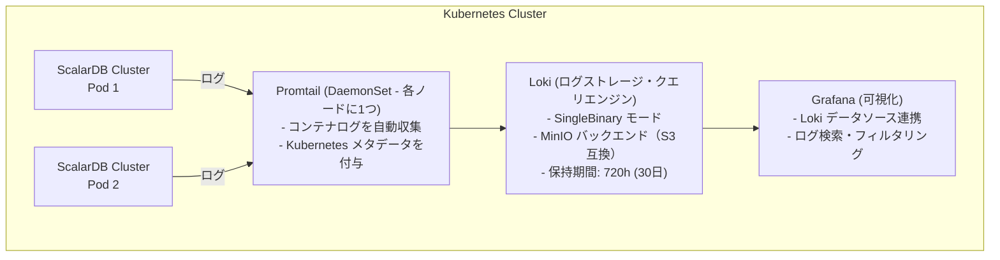
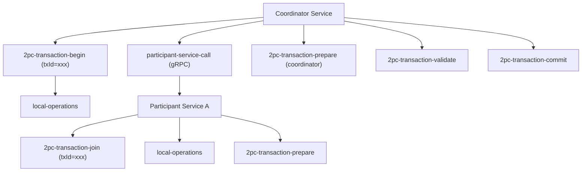
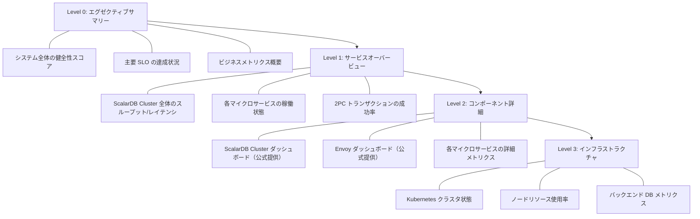
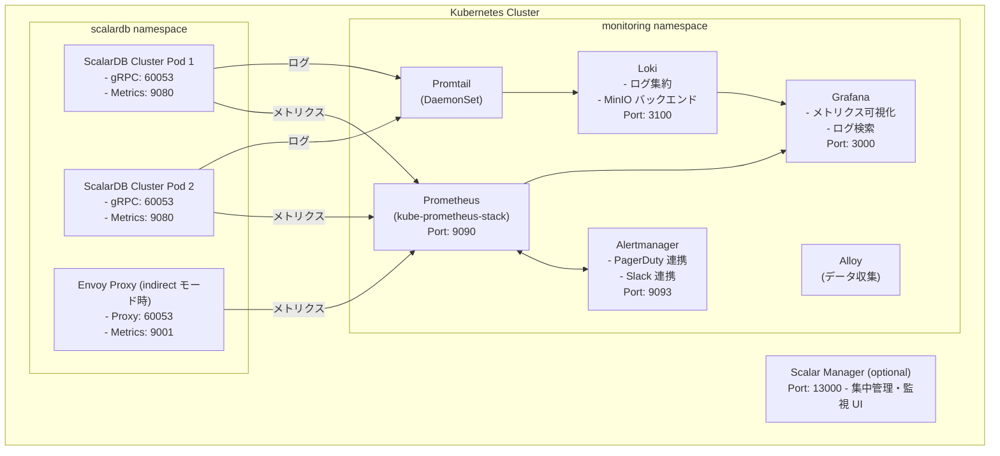

# ScalarDB Cluster + マイクロサービスアーキテクチャにおける運用監視・オブザーバビリティ

## 目次

1. [ScalarDB Cluster のメトリクス監視](#1-scalardb-cluster-のメトリクス監視)
2. [ログ管理](#2-ログ管理)
3. [分散トレーシング](#3-分散トレーシング)
4. [ヘルスチェック・可用性監視](#4-ヘルスチェック可用性監視)
5. [アラート設計](#5-アラート設計)
6. [運用ダッシュボード](#6-運用ダッシュボード)
7. [Kubernetes上での監視スタック](#7-kubernetes上での監視スタック)
8. [参考文献](#8-参考文献)

---

## 1. ScalarDB Cluster のメトリクス監視

### 1.1 メトリクスエンドポイント

ScalarDB Cluster は Prometheus 形式のメトリクスを HTTP エンドポイントで公開する。

| 項目 | 値 |
|------|-----|
| **ポート** | 9080（デフォルト） |
| **パス** | `/metrics` |
| **形式** | Prometheus テキスト形式 / OpenMetrics |
| **設定プロパティ** | `scalar.db.cluster.node.prometheus_exporter_port` |

メトリクスエンドポイントのポートは `scalar.db.cluster.node.prometheus_exporter_port` プロパティで変更可能であり、デフォルト値は `9080` である。

参照: [ScalarDB Cluster Configurations](https://scalardb.scalar-labs.com/docs/latest/scalardb-cluster/scalardb-cluster-configurations/)

### 1.2 公開されるメトリクス一覧

ScalarDB Cluster の公式 Grafana ダッシュボード定義（[scalardb_cluster_grafana_dashboard.json](https://github.com/scalar-labs/helm-charts/blob/main/charts/scalardb-cluster/files/grafana/scalardb_cluster_grafana_dashboard.json)）から判明するメトリクス体系は以下の通りである。

#### 1.2.1 全体統計メトリクス

| メトリクス名 | 種別 | 説明 |
|-------------|------|------|
| `scalardb_cluster_stats_total_success` | Counter | 成功リクエスト総数 |
| `scalardb_cluster_stats_total_failure` | Counter | 失敗リクエスト総数 |

#### 1.2.2 Distributed Transaction Service メトリクス

各操作について、スループット（リクエスト/秒）とレイテンシ（パーセンタイル: p50, p75, p95, p98, p99, p99.9）が計測される。

| 操作 | メトリクスプレフィックス |
|------|----------------------|
| **Transaction Begin** | `scalardb_cluster_distributed_transaction_begin_*` |
| **Transaction Get** | `scalardb_cluster_distributed_transaction_get_*` |
| **Transaction Scan** | `scalardb_cluster_distributed_transaction_scan_*` |
| **Transaction Put** | `scalardb_cluster_distributed_transaction_put_*` |
| **Transaction Delete** | `scalardb_cluster_distributed_transaction_delete_*` |
| **Transaction Mutate** | `scalardb_cluster_distributed_transaction_mutate_*` |
| **Transaction Commit** | `scalardb_cluster_distributed_transaction_commit_*` |
| **Transaction Rollback** | `scalardb_cluster_distributed_transaction_rollback_*` |

各操作のメトリクスには以下のサフィックスが含まれる:
- `_all`: 全リクエスト数（成功+失敗）
- `_success`: 成功リクエスト数
- `_failure`: 失敗リクエスト数
- パーセンタイルメトリクス（quantile ラベル付き）: `0.5`, `0.75`, `0.95`, `0.98`, `0.99`, `0.999`

#### 1.2.3 Distributed Transaction Admin Service メトリクス

| 操作 | メトリクスプレフィックス |
|------|----------------------|
| **Create Table** | `scalardb_cluster_admin_create_table_*` |
| **Drop Table** | `scalardb_cluster_admin_drop_table_*` |
| **Truncate Table** | `scalardb_cluster_admin_truncate_table_*` |
| **Get Table Metadata** | `scalardb_cluster_admin_get_table_metadata_*` |

#### 1.2.4 Two-Phase Commit Transaction Service メトリクス

2PC トランザクション固有の操作について、通常のトランザクションメトリクスに加えて以下の操作が計測される。

| 操作 | メトリクスプレフィックス |
|------|----------------------|
| **2PC Begin** | `scalardb_cluster_two_phase_commit_transaction_begin_*` |
| **2PC Join** | `scalardb_cluster_two_phase_commit_transaction_join_*` |
| **2PC Prepare** | `scalardb_cluster_two_phase_commit_transaction_prepare_*` |
| **2PC Validate** | `scalardb_cluster_two_phase_commit_transaction_validate_*` |
| **2PC Commit** | `scalardb_cluster_two_phase_commit_transaction_commit_*` |
| **2PC Rollback** | `scalardb_cluster_two_phase_commit_transaction_rollback_*` |
| **2PC Get/Scan/Put/Delete/Mutate** | 各操作に対応するメトリクス |

### 1.3 Consensus Commit プロトコル固有のメトリクス

#### グループコミットメトリクス

ScalarDB の Consensus Commit プロトコルでは、グループコミット機能が利用可能であり、関連するメトリクスのログ出力を有効化できる。

| 設定プロパティ | デフォルト値 | 説明 |
|---------------|-------------|------|
| `scalar.db.consensus_commit.coordinator.group_commit.enabled` | `false` | グループコミットの有効化 |
| `scalar.db.consensus_commit.coordinator.group_commit.metrics_monitor_log_enabled` | `false` | グループコミットメトリクスの定期ログ出力 |
| `scalar.db.consensus_commit.coordinator.group_commit.slot_capacity` | `20` | グループ内の最大スロット数 |
| `scalar.db.consensus_commit.coordinator.group_commit.group_size_fix_timeout_millis` | `40` | グループサイズ確定のタイムアウト |
| `scalar.db.consensus_commit.coordinator.group_commit.delayed_slot_move_timeout_millis` | `1200` | 遅延スロット移動のタイムアウト |
| `scalar.db.consensus_commit.coordinator.group_commit.old_group_abort_timeout_millis` | `60000` | 古いグループのアボートタイムアウト |
| `scalar.db.consensus_commit.coordinator.group_commit.timeout_check_interval_millis` | `20` | タイムアウトチェック間隔 |

`metrics_monitor_log_enabled` を `true` に設定すると、グループコミットの内部パフォーマンスメトリクスが定期的にログに出力される。これによりグループコミットのチューニングに必要な情報を取得できる。

参照: [ScalarDB Core Configurations](https://scalardb.scalar-labs.com/docs/latest/configurations/)

#### パフォーマンス関連の監視対象設定

| 設定プロパティ | デフォルト値 | 監視観点 |
|---------------|-------------|---------|
| `scalar.db.consensus_commit.parallel_executor_count` | `128` | 並列実行スレッド数の飽和監視 |
| `scalar.db.consensus_commit.async_commit.enabled` | `false` | 非同期コミットの有効/無効状態 |
| `scalar.db.active_transaction_management.expiration_time_millis` | `60000` | アイドルトランザクションの有効期限 |
| `scalar.db.metadata.cache_expiration_time_secs` | `60` | メタデータキャッシュの有効期限 |

### 1.4 Grafana ダッシュボード構成

ScalarDB Cluster の公式 Helm チャートには、Grafana ダッシュボード JSON ファイルが同梱されている。

**ダッシュボードファイル**: `scalardb_cluster_grafana_dashboard.json`
（[GitHub](https://github.com/scalar-labs/helm-charts/blob/main/charts/scalardb-cluster/files/grafana/scalardb_cluster_grafana_dashboard.json)）

ダッシュボードは以下の4セクションで構成されている:

| セクション | 内容 |
|-----------|------|
| **Total Requests** | 成功/失敗リクエスト数のリアルタイム表示 |
| **Distributed Transaction Admin Service** | テーブル操作（Create/Drop/Truncate/GetMetadata）のスループットとレイテンシ |
| **Distributed Transaction Service** | CRUD操作（Begin/Get/Scan/Put/Delete/Mutate/Commit/Rollback）のスループットとレイテンシ |
| **Two Phase Commit Transaction Service** | 2PC操作（Begin/Join/Prepare/Validate/Commit/Rollback等）のスループットとレイテンシ |

各パネルは以下の2種類で構成される:
- **スループットパネル**: `irate()` 関数による1分間のリクエスト/秒（Pod別に色分け）
- **レイテンシパネル**: パーセンタイル分布（p50, p75, p95, p98, p99, p99.9）

ダッシュボード変数として `$pod` が定義されており、特定の Pod でフィルタリングが可能である。

#### Envoy ダッシュボード

Indirect モードで Envoy を使用する場合、Envoy 用の Grafana ダッシュボードも提供される。

**ダッシュボードファイル**: `scalar_envoy_grafana_dashboard.json`
（[GitHub](https://github.com/scalar-labs/helm-charts/blob/main/charts/scalardb-cluster-monitoring/files/grafana/scalar_envoy_grafana_dashboard.json)）

### 1.5 ServiceMonitor 設定

ScalarDB Cluster の Helm チャートには ServiceMonitor テンプレートが含まれており、Prometheus Operator による自動メトリクス収集が可能である。

**テンプレートファイル**: `charts/scalardb-cluster/templates/scalardb-cluster/servicemonitor.yaml`

ServiceMonitor の構成:
- **ポート名**: `scalardb-cluster-prometheus`
- **メトリクスパス**: `/metrics`
- **スクレイプ間隔**: `serviceMonitor.interval` で設定可能（デフォルト: `15s`）
- **TLS対応**: TLS 有効時は HTTPS スキーム + CA証明書指定が可能

```yaml
# Helm values での ServiceMonitor 有効化
scalardbCluster:
  serviceMonitor:
    enabled: true
    namespace: monitoring
    interval: "15s"
```

TLS 使用時は追加設定が必要:

```yaml
scalardbCluster:
  tls:
    enabled: true
    caRootCertSecretForServiceMonitor: "scalardb-cluster-tls-ca-for-prometheus"
```

CA 証明書の Secret を Prometheus の名前空間に作成する:

```bash
kubectl create secret generic scalardb-cluster-tls-ca-for-prometheus \
  --from-file=ca.crt=/path/to/ca/cert \
  -n monitoring
```

参照: [Configure a custom values file for ScalarDB Cluster](https://scalardb.scalar-labs.com/docs/latest/helm-charts/configure-custom-values-scalardb-cluster/)

---

## 2. ログ管理

### 2.1 ScalarDB Cluster のログ出力仕様

ScalarDB Cluster は Java ベースのアプリケーションであり、標準的な Java ログフレームワークを使用してログを出力する。

#### ログレベル設定

Helm チャートの `values.yaml` でログレベルを設定可能:

```yaml
scalardbCluster:
  logLevel: INFO
```

利用可能なログレベル:

| レベル | 用途 |
|--------|------|
| `TRACE` | 最も詳細なトレース情報 |
| `DEBUG` | デバッグ情報 |
| `INFO` | 通常の動作情報（デフォルト） |
| `WARN` | 警告情報 |
| `ERROR` | エラー情報 |

参照: [Configure a custom values file for ScalarDB Cluster](https://scalardb.scalar-labs.com/docs/latest/helm-charts/configure-custom-values-scalardb-cluster/)

#### トランザクション関連ログ

ScalarDB のエラーコード体系はログ内で構造化されたエラー識別を可能にする:

| コードカテゴリ | 範囲 | 内容 |
|---------------|------|------|
| **ユーザーエラー** | `DB-CORE-1xxxx` | 設定・操作上の問題 |
| **並行性エラー** | `DB-CORE-2xxxx` | トランザクション競合・シリアライゼーション問題 |
| **内部エラー** | `DB-CORE-3xxxx` | システムレベルの操作失敗 |
| **不明ステータス** | `DB-CORE-4xxxx` | トランザクション完了状態が不確定 |

**監視上の重要なエラーコード例**:

| コード | 説明 | 監視アクション |
|--------|------|---------------|
| `DB-CORE-20011` | 競合発生、トランザクション再試行が必要 | 競合率の監視 |
| `DB-CORE-20015` | Coordinator でのコミット状態遷移失敗、トランザクションがアボート | コミット失敗率の監視 |
| `DB-CORE-30030` | コミット操作失敗 | インフラレベルの調査トリガー |
| `DB-CORE-40000` | ロールバック失敗（リカバリ影響あり） | 即座の調査が必要 |
| `DB-CORE-40001` | Coordinator ステータスなしの NoMutation 例外 | トランザクション整合性の確認 |

参照: [ScalarDB Core Status Codes](https://scalardb.scalar-labs.com/docs/latest/scalardb-core-status-codes/)

#### グループコミットメトリクスログ

グループコミット機能使用時、`metrics_monitor_log_enabled` を有効にすることで、グループコミットの内部メトリクスが定期的にログに出力される:

```properties
scalar.db.consensus_commit.coordinator.group_commit.metrics_monitor_log_enabled=true
```

### 2.2 ログ集約アーキテクチャ

ScalarDB の公式ガイドでは、**Grafana Loki + Promtail** を推奨するログ集約アーキテクチャとして採用している。

#### アーキテクチャ概要



#### Loki Stack デプロイ手順

```bash
# Grafana Helm リポジトリ追加
helm repo add grafana https://grafana.github.io/helm-charts

# Loki Stack インストール
helm install scalar-logging-loki grafana/loki-stack \
  -n monitoring \
  -f scalar-loki-stack-custom-values.yaml
```

#### Grafana への Loki データソース追加

Prometheus スタックの custom values ファイルに以下を追加:

```yaml
grafana:
  additionalDataSources:
  - name: Loki
    type: loki
    uid: loki
    url: http://scalar-logging-loki:3100/
    access: proxy
    editable: false
    isDefault: false
```

その後、Prometheus スタックをアップグレード:

```bash
helm upgrade scalar-monitoring prometheus-community/kube-prometheus-stack \
  -n monitoring \
  -f scalar-prometheus-custom-values.yaml
```

参照: [Collecting logs from Scalar products on a Kubernetes cluster](https://scalardb.scalar-labs.com/docs/latest/scalar-kubernetes/K8sLogCollectionGuide/)、[Getting Started with Helm Charts (Logging using Loki Stack)](https://scalardb.scalar-labs.com/docs/latest/helm-charts/getting-started-logging/)

#### Promtail のノードスケジューリング設定

ScalarDB Cluster 専用ノードにデプロイされている場合、Promtail の nodeSelector と tolerations を設定する:

```yaml
promtail:
  nodeSelector:
    scalar-labs.com/dedicated-node: scalardb-cluster
  tolerations:
    - effect: NoSchedule
      key: scalar-labs.com/dedicated-node
      operator: Equal
      value: scalardb-cluster
```

### 2.3 トランザクションログの追跡方法

ScalarDB Cluster の gRPC API はリッチエラーモデル（`google.rpc.ErrorInfo`）を使用し、以下のフィールドでエラーを構造化する:

| フィールド | 説明 | 例 |
|-----------|------|-----|
| `reason` | エラー種別 | `TRANSACTION_NOT_FOUND`, `HOP_LIMIT_EXCEEDED` |
| `domain` | ドメイン | `com.scalar.db.cluster` |
| `metadata` | 追加情報（Map） | `transactionId` キーでトランザクション ID が含まれる |

トランザクションに関連するエラーの場合、metadata マップに `transactionId` キーが含まれるため、特定のトランザクション ID をキーにしてログを横断的に追跡することが可能である。

**ログ追跡の実践的なアプローチ**:

1. **トランザクション ID による追跡**: 各トランザクションに一意の ID が割り当てられるため、Loki の LogQL を使用してトランザクション ID でフィルタリングする
2. **エラーコードによるフィルタリング**: `DB-CORE-2xxxx`（並行性エラー）や `DB-CORE-4xxxx`（不明ステータス）を重点的に監視する
3. **2PC トランザクションの追跡**: 2PC Interface では Coordinator サービスが発行したトランザクション ID を参加者サービスでも使用するため、同一 ID で全参加者のログを追跡できる

```
# Loki LogQL クエリ例: 特定トランザクションIDのログ追跡
{namespace="scalardb"} |= "tx-id-12345"

# エラーコードによるフィルタリング
{namespace="scalardb"} |~ "DB-CORE-[234]\\d{4}"

# コミット失敗のログ
{namespace="scalardb"} |= "DB-CORE-20015"
```

### 2.4 代替ログ基盤: EFK スタック

公式推奨は Loki + Promtail であるが、既存の EFK（Elasticsearch + Fluentd/Fluent Bit + Kibana）スタックを使用している場合は、以下の構成が適用可能である。

```yaml
# Fluent Bit DaemonSet 設定例（Kubernetes 環境）
apiVersion: v1
kind: ConfigMap
metadata:
  name: fluent-bit-config
  namespace: monitoring
data:
  fluent-bit.conf: |
    [SERVICE]
        Flush         5
        Log_Level     info
        Daemon        off
        Parsers_File  parsers.conf

    [INPUT]
        Name              tail
        Tag               scalardb.*
        Path              /var/log/containers/scalardb-cluster-*.log
        Parser            docker
        DB                /var/log/flb_scalardb.db
        Mem_Buf_Limit     5MB
        Skip_Long_Lines   On
        Refresh_Interval  10

    [FILTER]
        Name                kubernetes
        Match               scalardb.*
        Kube_URL            https://kubernetes.default.svc:443
        Kube_CA_File        /var/run/secrets/kubernetes.io/serviceaccount/ca.crt
        Kube_Token_File     /var/run/secrets/kubernetes.io/serviceaccount/token
        Merge_Log           On
        K8S-Logging.Parser  On

    [OUTPUT]
        Name            es
        Match           scalardb.*
        Host            elasticsearch.monitoring.svc.cluster.local
        Port            9200
        Index           scalardb-logs
        Type            _doc
        Logstash_Format On
        Logstash_Prefix scalardb
        Retry_Limit     False
```

---

## 3. 分散トレーシング

### 3.1 OpenTelemetry 対応状況

2026年2月現在、ScalarDB Cluster は **OpenTelemetry によるネイティブな分散トレーシングを公式にはサポートしていない**。ScalarDB のロードマップ（[ScalarDB Roadmap](https://scalardb.scalar-labs.com/docs/latest/roadmap/)）にも、OpenTelemetry 対応の項目は明記されていない。

ただし、ScalarDB Cluster は以下の特性を持つため、アプリケーション層での分散トレーシング実装は可能である:

- gRPC ベースの通信プロトコルを使用
- Java ベースのアプリケーション（JVM 上で動作）
- トランザクション ID によるリクエスト追跡が組み込まれている

#### 将来の展望

ScalarDB のロードマップでは、**Audit Logging（CY2026 Q2 予定）** として「ScalarDB Cluster と Analytics のアクセスログの表示・管理機能」が計画されている。これは監査目的が主であるが、オブザーバビリティの観点からも有用な機能となる可能性がある。

### 3.2 アプリケーション層でのトレーシング実装

ScalarDB Cluster がネイティブに OpenTelemetry をサポートしていない現状では、アプリケーション層で以下のアプローチにより分散トレーシングを実現できる。

#### 3.2.1 gRPC インターセプタによるトレース注入

ScalarDB Cluster は gRPC API を提供しているため、OpenTelemetry の gRPC インターセプタを使用してトレースコンテキストを伝播できる。

```java
// OpenTelemetry gRPC クライアントインターセプタの設定例
import io.opentelemetry.api.OpenTelemetry;
import io.opentelemetry.instrumentation.grpc.v1_6.GrpcTelemetry;
import io.grpc.ManagedChannel;
import io.grpc.ManagedChannelBuilder;

// OpenTelemetry SDK の初期化
OpenTelemetry openTelemetry = initializeOpenTelemetry();

// gRPC テレメトリインターセプタの作成
GrpcTelemetry grpcTelemetry = GrpcTelemetry.create(openTelemetry);

// ScalarDB Cluster への gRPC チャネルにインターセプタを追加
ManagedChannel channel = ManagedChannelBuilder
    .forAddress("scalardb-cluster", 60053)
    .intercept(grpcTelemetry.newClientInterceptor())
    .build();
```

#### 3.2.2 マイクロサービス間のトランザクション追跡

2PC トランザクションを使用するマイクロサービス間の追跡には、トランザクション ID をトレーススパンの属性として記録する:

```java
// Coordinator サービス側
Span span = tracer.spanBuilder("2pc-transaction-coordinate")
    .setAttribute("scalardb.transaction.id", txId)
    .setAttribute("scalardb.transaction.type", "two-phase-commit")
    .startSpan();

try (Scope scope = span.makeCurrent()) {
    // 2PC トランザクション開始
    TwoPhaseCommitTransaction tx = txManager.start();
    String txId = tx.getId();

    // トランザクション ID をトレースコンテキストと共に伝播
    span.setAttribute("scalardb.transaction.id", txId);

    // 参加者サービスへの呼び出し
    // （gRPC メタデータにトレースコンテキストが自動伝播される）
    participantService.join(txId, operationData);

    // Prepare & Commit
    tx.prepare();
    tx.validate();
    tx.commit();

    span.setStatus(StatusCode.OK);
} catch (Exception e) {
    span.setStatus(StatusCode.ERROR, e.getMessage());
    span.recordException(e);
    throw e;
} finally {
    span.end();
}
```

```java
// 参加者サービス側
Span span = tracer.spanBuilder("2pc-transaction-participate")
    .setAttribute("scalardb.transaction.id", txId)
    .setAttribute("scalardb.transaction.role", "participant")
    .startSpan();

try (Scope scope = span.makeCurrent()) {
    TwoPhaseCommitTransaction tx = txManager.join(txId);
    // ローカル操作の実行
    tx.put(/* ... */);
    tx.prepare();
    tx.validate();
    // Coordinator からの commit 指示を待機
} finally {
    span.end();
}
```

### 3.3 OpenTelemetry Collector を用いたトレース収集アーキテクチャ

ScalarDB Cluster 自体がトレースを出力しない場合でも、アプリケーション層のトレースを OpenTelemetry Collector で収集し、Jaeger や Zipkin に転送する構成を構築できる。

```yaml
# OpenTelemetry Collector 設定例
apiVersion: v1
kind: ConfigMap
metadata:
  name: otel-collector-config
  namespace: monitoring
data:
  otel-collector-config.yaml: |
    receivers:
      otlp:
        protocols:
          grpc:
            endpoint: 0.0.0.0:4317
          http:
            endpoint: 0.0.0.0:4318

    processors:
      batch:
        timeout: 10s
        send_batch_size: 1024
      memory_limiter:
        check_interval: 5s
        limit_mib: 512

    exporters:
      jaeger:
        endpoint: jaeger-collector.monitoring:14250
        tls:
          insecure: true
      prometheus:
        endpoint: 0.0.0.0:8889
        namespace: scalardb

    service:
      pipelines:
        traces:
          receivers: [otlp]
          processors: [batch, memory_limiter]
          exporters: [jaeger]
        metrics:
          receivers: [otlp]
          processors: [batch]
          exporters: [prometheus]
```

### 3.4 ScalarDB 2PC トランザクションのトレース設計

マイクロサービス間の 2PC トランザクションを追跡するための推奨スパン設計:



各スパンに以下の属性を記録することを推奨する:

| 属性キー | 説明 |
|---------|------|
| `scalardb.transaction.id` | ScalarDB トランザクション ID |
| `scalardb.transaction.type` | `consensus-commit` / `two-phase-commit` |
| `scalardb.transaction.phase` | `begin` / `prepare` / `validate` / `commit` / `rollback` |
| `scalardb.operation.type` | `get` / `scan` / `put` / `delete` / `mutate` |
| `scalardb.namespace` | 対象の名前空間 |
| `scalardb.table` | 対象のテーブル名 |

---

## 4. ヘルスチェック・可用性監視

### 4.1 Kubernetes Liveness / Startup Probe 設定

ScalarDB Cluster の Helm チャート（[deployment.yaml](https://github.com/scalar-labs/helm-charts/blob/main/charts/scalardb-cluster/templates/scalardb-cluster/deployment.yaml)）では、gRPC ヘルスチェックプロトコルを使用した Probe が設定されている。

#### Startup Probe

```yaml
startupProbe:
  exec:
    command:
      - /usr/local/bin/grpc_health_probe
      - -addr=localhost:60053
  failureThreshold: 60
  periodSeconds: 5
```

- gRPC Health Checking Protocol を使用
- 最大 300 秒（60回 x 5秒）の起動待機
- TLS 有効時は CA 証明書とサーバー名の指定が追加される

#### Liveness Probe

```yaml
livenessProbe:
  exec:
    command:
      - /usr/local/bin/grpc_health_probe
      - -addr=localhost:60053
  failureThreshold: 3
  periodSeconds: 10
  successThreshold: 1
  timeoutSeconds: 1
```

- gRPC Health Checking Protocol を使用
- 30 秒間（3回 x 10秒）応答がない場合にコンテナを再起動
- `grpc_health_probe` コマンドを使用

#### TLS 有効時のヘルスチェック

TLS が有効な場合、`overrideAuthority` パラメータが startup probe と liveness probe で使用される:

```yaml
scalardbCluster:
  tls:
    enabled: true
    overrideAuthority: "cluster.scalardb.example.com"
```

この設定により、ヘルスチェックコマンドに TLS 関連のフラグが追加される:

```
grpc_health_probe -addr=localhost:60053 \
  -tls \
  -tls-ca-cert=/path/to/ca.crt \
  -tls-server-name=cluster.scalardb.example.com
```

参照: [Configure a custom values file for ScalarDB Cluster](https://scalardb.scalar-labs.com/docs/latest/helm-charts/configure-custom-values-scalardb-cluster/)

#### Readiness Probe

現在の Helm チャートでは、**明示的な Readiness Probe は定義されていない**。`minReadySeconds` は `0` に設定されており、Pod は作成後即座に Ready 状態となる。必要に応じて、カスタム values ファイルで Readiness Probe を追加設定できる。

### Readiness Probe の推奨設定

現行Helm ChartではReadiness Probeが明示的に定義されていない。起動直後のPodにトラフィックが転送されてトランザクション失敗が発生するリスクを軽減するため、以下の設定を推奨する。

```yaml
readinessProbe:
  exec:
    command:
      - /bin/grpc_health_probe
      - -addr=:60053
  initialDelaySeconds: 10
  periodSeconds: 5
  failureThreshold: 3
```

また、`minReadySeconds: 15` を Deployment に設定し、Podが安定するまでトラフィックを転送しないようにする。

### 4.2 ScalarDB Cluster のヘルスチェックエンドポイント

| エンドポイント | ポート | プロトコル | 用途 |
|---------------|--------|-----------|------|
| gRPC Health Check | 60053 | gRPC | Kubernetes Probe 用（grpc.health.v1.Health/Check） |
| Prometheus Metrics | 9080 | HTTP | メトリクス公開（`/metrics`） |
| GraphQL | 8080 | HTTP | GraphQL API（有効時） |

### 4.3 バックエンド DB 接続の監視

ScalarDB Cluster はバックエンドデータベースへの接続を内部的に管理する。以下の設定パラメータが接続プールの監視に関連する:

| 設定 | デフォルト値 | 説明 |
|------|-------------|------|
| `scalar.db.jdbc.connection_pool.max_total` | `200` | JDBC 最大接続プール数 |
| `scalar.db.active_transaction_management.expiration_time_millis` | `60000` | アイドルトランザクションの有効期限 |
| `scalar.db.cluster.node.scanner_management.expiration_time_millis` | `60000` | アイドルスキャナーの有効期限（リソースリーク防止） |

バックエンド DB の接続状態は、トランザクション操作のエラーレート（特に `DB-CORE-3xxxx` 系内部エラー）を監視することで間接的に把握できる。

### 4.4 Cluster Membership の監視

ScalarDB Cluster は一貫性ハッシュアルゴリズムによるリクエストルーティングを使用しており、クラスタメンバーシップの変化はトランザクション処理に影響する。

**監視すべき項目**:

| 項目 | 監視方法 |
|------|---------|
| Pod 数の変化 | `kube_deployment_spec_replicas` と `kube_deployment_status_available_replicas` の差分 |
| Pod の状態 | `kube_pod_status_phase` メトリクスで Pending/Running/Failed を監視 |
| クラスタ縮退 | 利用可能レプリカ数が spec レプリカ数未満の状態を検知 |
| Pod 再起動 | `kube_pod_container_status_restarts_total` の増加を監視 |

#### PrometheusRule によるクラスタ状態監視

ScalarDB Cluster の Helm チャートには、以下の PrometheusRule アラートが組み込まれている:

| アラート名 | 重大度 | 条件 | 持続時間 |
|-----------|--------|------|---------|
| **ScalarDBClusterDown** | `critical` | 利用可能レプリカ数がゼロ | 1分 |
| **ScalarDBClusterDegraded** | `warning` | 1つ以上の利用不可レプリカが存在 | 1分 |
| **ScalarDBPodsPending** | `warning` | Pod が Pending 状態で停滞 | 1分 |
| **ScalarDBPodsError** | `warning` | コンテナが作成フェーズ以外の待機状態（エラー） | 1分 |

参照: [prometheusrules.yaml](https://github.com/scalar-labs/helm-charts/blob/main/charts/scalardb-cluster/templates/scalardb-cluster/prometheusrules.yaml)

### 4.5 Scalar Manager による統合的な可用性監視

[Scalar Manager](https://scalardb.scalar-labs.com/docs/latest/scalar-manager/overview/) は、ScalarDB Cluster の集中管理・監視ソリューションとして以下の機能を提供する:

| 機能 | 説明 |
|------|------|
| **クラスタ可視化** | リアルタイムのクラスタヘルスメトリクス表示 |
| **Pod 監視** | Pod ログ、パフォーマンスデータ、ハードウェア使用統計 |
| **RPS 監視** | リクエスト/秒のリアルタイム表示 |
| **ポーズジョブ管理** | トランザクション一貫性を確保したポーズ操作のスケジューリング |
| **ユーザー管理** | 認証・認可によるアクセス制御 |
| **Grafana 統合** | シームレスな認証統合によるダッシュボードアクセス |

Scalar Manager は以下の Kubernetes ラベルで自動的にターゲットを検出する:
- ScalarDB Cluster: `app.kubernetes.io/app=scalardb-cluster`
- ScalarDL Ledger: `app.kubernetes.io/app=ledger`
- ScalarDL Auditor: `app.kubernetes.io/app=auditor`

**ポート**: 13000（Scalar Manager アクセス用）

参照: [Deploy Scalar Manager](https://scalardb.scalar-labs.com/docs/latest/helm-charts/getting-started-scalar-manager/)

---

## 5. アラート設計

### 5.1 SLI/SLO 定義例

ScalarDB Cluster を用いたマイクロサービスシステムの SLI/SLO 定義例:

#### 可用性 SLI/SLO

| SLI | 計測方法 | SLO目標例 |
|-----|---------|----------|
| **サービス可用性** | ScalarDB Cluster の利用可能レプリカ数 / 目標レプリカ数 | 99.9%（月間ダウンタイム 43.8分以内） |
| **トランザクション成功率** | `scalardb_cluster_stats_total_success / (success + failure)` | 99.95% |
| **API 可用性** | gRPC ヘルスチェック成功率 | 99.99% |

#### レイテンシ SLI/SLO

| SLI | 計測方法 | SLO目標例 |
|-----|---------|----------|
| **トランザクション Commit レイテンシ (p99)** | `scalardb_cluster_distributed_transaction_commit` の p99 | 500ms 以下 |
| **Get 操作レイテンシ (p95)** | `scalardb_cluster_distributed_transaction_get` の p95 | 100ms 以下 |
| **2PC Commit レイテンシ (p99)** | `scalardb_cluster_two_phase_commit_transaction_commit` の p99 | 1000ms 以下 |

#### エラー率 SLI/SLO

| SLI | 計測方法 | SLO目標例 |
|-----|---------|----------|
| **トランザクション競合率** | `DB-CORE-2xxxx` エラーの発生率 | 5% 以下 |
| **内部エラー率** | `DB-CORE-3xxxx` エラーの発生率 | 0.1% 以下 |
| **不明ステータス率** | `DB-CORE-4xxxx` エラーの発生率 | 0.01% 以下 |

### 5.2 アラートルール設計パターン

#### 組み込みアラートルール（Helm チャート提供）

ScalarDB Cluster の Helm チャートに組み込まれている PrometheusRule:

```yaml
# ScalarDB Cluster Helm チャート内蔵のアラートルール
# prometheusRule.enabled: true で有効化
groups:
  - name: ScalarDBClusterAlerts
    rules:
      - alert: ScalarDBClusterDown
        # 利用可能レプリカ数がゼロ
        expr: |
          kube_deployment_spec_replicas{deployment=~".*scalardb-cluster.*"}
          - kube_deployment_status_unavailable_replicas{deployment=~".*scalardb-cluster.*"}
          == 0
        for: 1m
        labels:
          severity: critical
          app: ScalarDB
        annotations:
          summary: "ScalarDB Cluster is down"
          description: "No available replicas for ScalarDB Cluster"

      - alert: ScalarDBClusterDegraded
        # 1つ以上の利用不可レプリカ
        expr: |
          kube_deployment_status_unavailable_replicas{deployment=~".*scalardb-cluster.*"}
          >= 1
        for: 1m
        labels:
          severity: warning
          app: ScalarDB
        annotations:
          summary: "ScalarDB Cluster is degraded"

      - alert: ScalarDBPodsPending
        # Pod が Pending 状態
        expr: |
          kube_pod_status_phase{pod=~".*scalardb-cluster.*", phase="Pending"}
          == 1
        for: 1m
        labels:
          severity: warning

      - alert: ScalarDBPodsError
        # コンテナのエラー状態
        expr: |
          kube_pod_container_status_waiting_reason{
            pod=~".*scalardb-cluster.*",
            reason!="ContainerCreating"
          } == 1
        for: 1m
        labels:
          severity: warning
```

#### カスタムアラートルール（追加推奨）

以下は、ScalarDB Cluster の運用に追加で推奨するアラートルール:

```yaml
groups:
  - name: ScalarDBClusterCustomAlerts
    rules:
      # トランザクション成功率が低下
      - alert: ScalarDBTransactionSuccessRateLow
        expr: |
          rate(scalardb_cluster_stats_total_success[5m])
          / (rate(scalardb_cluster_stats_total_success[5m])
             + rate(scalardb_cluster_stats_total_failure[5m]))
          < 0.99
        for: 5m
        labels:
          severity: warning
          app: ScalarDB
        annotations:
          summary: "ScalarDB transaction success rate below 99%"
          description: |
            Transaction success rate is {{ $value | humanizePercentage }}.
            This may indicate increased contention or backend issues.

      # Commit レイテンシの増加
      - alert: ScalarDBCommitLatencyHigh
        expr: |
          scalardb_cluster_distributed_transaction_commit{quantile="0.99"}
          > 1000
        for: 5m
        labels:
          severity: warning
          app: ScalarDB
        annotations:
          summary: "ScalarDB commit latency p99 exceeds 1 second"
          description: |
            Pod {{ $labels.pod }}: commit p99 latency is {{ $value }}ms.

      # Pod 再起動の頻発
      - alert: ScalarDBPodRestarting
        expr: |
          increase(kube_pod_container_status_restarts_total{
            container="scalardb-cluster"
          }[1h]) > 3
        for: 5m
        labels:
          severity: warning
          app: ScalarDB
        annotations:
          summary: "ScalarDB Cluster pod restarting frequently"
          description: |
            Pod {{ $labels.pod }} has restarted {{ $value }} times in the last hour.

      # 2PC トランザクションの失敗率
      - alert: ScalarDB2PCFailureRateHigh
        expr: |
          rate(scalardb_cluster_two_phase_commit_transaction_commit_failure[5m])
          / (rate(scalardb_cluster_two_phase_commit_transaction_commit_failure[5m])
             + rate(scalardb_cluster_two_phase_commit_transaction_commit_success[5m]))
          > 0.05
        for: 5m
        labels:
          severity: critical
          app: ScalarDB
        annotations:
          summary: "2PC transaction failure rate exceeds 5%"

      # メモリ使用量の警告
      - alert: ScalarDBMemoryUsageHigh
        expr: |
          container_memory_working_set_bytes{
            container="scalardb-cluster"
          }
          / container_spec_memory_limit_bytes{
            container="scalardb-cluster"
          } > 0.85
        for: 10m
        labels:
          severity: warning
          app: ScalarDB
        annotations:
          summary: "ScalarDB Cluster memory usage above 85%"

      # CPU 使用率の警告
      - alert: ScalarDBCPUUsageHigh
        expr: |
          rate(container_cpu_usage_seconds_total{
            container="scalardb-cluster"
          }[5m])
          / container_spec_cpu_quota{
            container="scalardb-cluster"
          }
          * container_spec_cpu_period{
            container="scalardb-cluster"
          } > 0.8
        for: 10m
        labels:
          severity: warning
          app: ScalarDB
        annotations:
          summary: "ScalarDB Cluster CPU usage above 80%"
```

### セキュリティ異常検知アラート

| アラート名 | 条件 | 重要度 |
|-----------|------|--------|
| ScalarDBAuthFailureSpike | 認証失敗率が5分間で通常の5倍以上 | Critical |
| ScalarDBUnusualScanRate | クロスパーティションスキャンが通常の10倍以上 | Warning |
| ScalarDBHighAbortRate | トランザクションアボート率が30%以上 | Warning |
| ScalarDBCoordinatorTableGrowth | Coordinatorテーブルサイズが閾値を超過 | Warning |

### 5.3 エスカレーションポリシー

| 重大度 | 初動 | エスカレーション | 対応期限 |
|--------|------|----------------|---------|
| **Critical** | オンコール担当に即座通知 | 15分以内に応答なければリーダーへ | 30分以内に初動対応 |
| **Warning** | Slack チャネルに通知 | 30分以内に応答なければオンコールへ | 1時間以内に確認 |
| **Info** | ダッシュボード表示のみ | - | 次営業日に確認 |

### 5.4 PagerDuty / Slack 連携

#### Alertmanager 設定例

```yaml
# Alertmanager 設定（scalar-prometheus-custom-values.yaml 内）
alertmanager:
  config:
    global:
      resolve_timeout: 5m
      slack_api_url: 'https://hooks.slack.com/services/xxx/yyy/zzz'
      pagerduty_url: 'https://events.pagerduty.com/v2/enqueue'

    route:
      receiver: 'default-receiver'
      group_by: ['alertname', 'namespace', 'app']
      group_wait: 30s
      group_interval: 5m
      repeat_interval: 4h
      routes:
        - receiver: 'pagerduty-critical'
          match:
            severity: critical
          continue: true
        - receiver: 'slack-warning'
          match:
            severity: warning

    receivers:
      - name: 'default-receiver'
        slack_configs:
          - channel: '#scalardb-alerts'
            send_resolved: true
            title: '{{ .GroupLabels.alertname }}'
            text: >-
              {{ range .Alerts }}
              *Alert:* {{ .Labels.alertname }}
              *Severity:* {{ .Labels.severity }}
              *Description:* {{ .Annotations.description }}
              *Details:*
                {{ range .Labels.SortedPairs }}
                  - *{{ .Name }}:* {{ .Value }}
                {{ end }}
              {{ end }}

      - name: 'pagerduty-critical'
        pagerduty_configs:
          - routing_key: '<PAGERDUTY_INTEGRATION_KEY>'
            severity: 'critical'
            description: '{{ .CommonAnnotations.summary }}'
            details:
              alertname: '{{ .GroupLabels.alertname }}'
              namespace: '{{ .GroupLabels.namespace }}'

      - name: 'slack-warning'
        slack_configs:
          - channel: '#scalardb-alerts'
            send_resolved: true
            color: '{{ if eq .Status "firing" }}warning{{ else }}good{{ end }}'
            title: '[{{ .Status | toUpper }}] {{ .GroupLabels.alertname }}'
            text: >-
              {{ range .Alerts }}
              *Summary:* {{ .Annotations.summary }}
              *Description:* {{ .Annotations.description }}
              {{ end }}
```

---

## 6. 運用ダッシュボード

### 6.1 推奨ダッシュボード構成

ScalarDB Cluster を含むマイクロサービスシステムの運用には、以下の階層構造でダッシュボードを構成することを推奨する。

#### ダッシュボード階層



### 6.2 ビジネスメトリクス vs インフラメトリクス

| カテゴリ | メトリクス例 | データソース |
|---------|------------|------------|
| **ビジネスメトリクス** | | |
| トランザクション処理件数/秒 | `rate(scalardb_cluster_stats_total_success[5m])` | Prometheus |
| 注文処理成功率 | アプリケーション固有メトリクス | Prometheus |
| 2PC トランザクション完了率 | `scalardb_cluster_two_phase_commit_transaction_commit_success` | Prometheus |
| **インフラメトリクス** | | |
| CPU 使用率 | `container_cpu_usage_seconds_total` | cAdvisor |
| メモリ使用率 | `container_memory_working_set_bytes` | cAdvisor |
| Pod 数 / レプリカ数 | `kube_deployment_status_replicas` | kube-state-metrics |
| DB 接続プール使用率 | JDBC プロバイダのメトリクス | Prometheus |

### 6.3 トランザクションのリアルタイムモニタリング

公式 Grafana ダッシュボードで提供されるパネルに加え、以下のカスタムパネルの追加を推奨する:

#### トランザクション成功率のリアルタイムパネル

```
# Grafana パネル PromQL
# トランザクション成功率（5分移動平均）
rate(scalardb_cluster_stats_total_success[5m])
/ (rate(scalardb_cluster_stats_total_success[5m])
   + rate(scalardb_cluster_stats_total_failure[5m]))
* 100
```

#### 操作別レイテンシ比較パネル

```
# 各操作の p99 レイテンシを比較するクエリ
scalardb_cluster_distributed_transaction_begin{quantile="0.99"}
scalardb_cluster_distributed_transaction_get{quantile="0.99"}
scalardb_cluster_distributed_transaction_commit{quantile="0.99"}
```

#### 2PC トランザクションのフェーズ別監視パネル

```
# 2PC 各フェーズのスループット
rate(scalardb_cluster_two_phase_commit_transaction_begin_success[5m])
rate(scalardb_cluster_two_phase_commit_transaction_prepare_success[5m])
rate(scalardb_cluster_two_phase_commit_transaction_validate_success[5m])
rate(scalardb_cluster_two_phase_commit_transaction_commit_success[5m])

# 2PC 各フェーズの失敗率
rate(scalardb_cluster_two_phase_commit_transaction_prepare_failure[5m])
rate(scalardb_cluster_two_phase_commit_transaction_commit_failure[5m])
```

---

## 7. Kubernetes 上での監視スタック

### 7.1 監視スタックの全体構成

ScalarDB Cluster の公式推奨構成に基づく監視スタックの全体像:



### 7.2 Prometheus Operator / kube-prometheus-stack

#### デプロイ手順

```bash
# 1. Helm リポジトリ追加
helm repo add prometheus-community \
  https://prometheus-community.github.io/helm-charts
helm repo update

# 2. 名前空間作成
kubectl create namespace monitoring

# 3. kube-prometheus-stack インストール
helm install scalar-monitoring \
  prometheus-community/kube-prometheus-stack \
  -n monitoring \
  -f scalar-prometheus-custom-values.yaml
```

#### scalar-prometheus-custom-values.yaml

```yaml
# Prometheus Operator カスタム設定
prometheus:
  service:
    type: LoadBalancer  # テスト時は ClusterIP + port-forward
  prometheusSpec:
    # Scalar 製品の ServiceMonitor/PrometheusRule を検出するために必須
    serviceMonitorSelectorNilUsesHelmValues: false
    ruleSelectorNilUsesHelmValues: false

alertmanager:
  service:
    type: LoadBalancer  # テスト時は ClusterIP + port-forward

grafana:
  service:
    type: LoadBalancer
    port: 3000

  # Scalar Manager 統合時に必要
  grafana.ini:
    security:
      allow_embedding: true
    auth.anonymous:
      enabled: true

  # Loki データソース追加
  additionalDataSources:
    - name: Loki
      type: loki
      uid: loki
      url: http://scalar-logging-loki:3100/
      access: proxy
      editable: false
      isDefault: false

  # ダッシュボードプロビジョニング
  sidecar:
    dashboards:
      enabled: true
      searchNamespace: ALL
    datasources:
      enabled: true

# リソース収集（Scalar Manager 連携用）
kubeStateMetrics:
  enabled: true
nodeExporter:
  enabled: true
kubelet:
  enabled: true
```

#### ScalarDB Cluster の監視有効化

```yaml
# ScalarDB Cluster Helm values に以下を追加
scalardbCluster:
  # 監視設定
  prometheusRule:
    enabled: true
    namespace: monitoring
  grafanaDashboard:
    enabled: true
    namespace: monitoring
  serviceMonitor:
    enabled: true
    namespace: monitoring
    interval: "15s"

  # ログレベル
  logLevel: INFO

# Envoy 監視（indirect モード時）
envoy:
  prometheusRule:
    enabled: true
    namespace: monitoring
  grafanaDashboard:
    enabled: true
    namespace: monitoring
  serviceMonitor:
    enabled: true
    namespace: monitoring
    interval: "15s"
```

### 7.3 scalardb-cluster-monitoring チャート（統合監視チャート）

Scalar Labs は、ScalarDB Cluster 専用の統合監視チャート `scalardb-cluster-monitoring` を提供している。このチャートは以下の4つのコンポーネントをバンドルしている:

| コンポーネント | バージョン | 役割 |
|--------------|-----------|------|
| **Prometheus** | ~27.7.0 | メトリクス収集・保存 |
| **Grafana** | ~8.10.4 | ダッシュボード・可視化 |
| **Loki** | ~6.28.0 | ログ集約・検索 |
| **Alloy** | ~0.12.5 | データ収集エージェント |

この統合チャートの主な特徴:

- ScalarDB Cluster のメトリクスエンドポイント（`/metrics`）への自動スクレイプ設定（10秒間隔）
- Grafana に Prometheus と Loki のデータソースが事前設定
- Loki は SingleBinary モードで MinIO バックエンド使用、保持期間 720時間（30日）
- セキュリティハードニング（権限エスカレーション制限、全コンポーネントで capabilities drop）
- ScalarDB Cluster と Envoy 用の Grafana ダッシュボード JSON ファイルが同梱

参照: [scalardb-cluster-monitoring chart](https://github.com/scalar-labs/helm-charts/tree/main/charts/scalardb-cluster-monitoring)

### 7.4 ログ基盤（Loki Stack）

#### 独立デプロイ方式

```bash
# Grafana Helm リポジトリ追加
helm repo add grafana https://grafana.github.io/helm-charts

# Loki Stack インストール
helm install scalar-logging-loki grafana/loki-stack \
  -n monitoring \
  -f scalar-loki-stack-custom-values.yaml
```

#### scalar-loki-stack-custom-values.yaml（参考設定）

```yaml
# Promtail 設定
promtail:
  enabled: true
  # ScalarDB Cluster 専用ノード用スケジューリング
  nodeSelector:
    scalar-labs.com/dedicated-node: scalardb-cluster
  tolerations:
    - effect: NoSchedule
      key: scalar-labs.com/dedicated-node
      operator: Equal
      value: scalardb-cluster

# Loki 設定
loki:
  enabled: true
  persistence:
    enabled: true
    size: 50Gi
```

### 7.5 ダッシュボードアクセス方法

#### テスト環境（port-forward 使用）

```bash
# Prometheus
kubectl port-forward -n monitoring \
  svc/scalar-monitoring-kube-pro-prometheus 9090:9090

# Alertmanager
kubectl port-forward -n monitoring \
  svc/scalar-monitoring-kube-pro-alertmanager 9093:9093

# Grafana
kubectl port-forward -n monitoring \
  svc/scalar-monitoring-grafana 3000:3000
```

アクセス URL:
- Prometheus: http://localhost:9090/
- Alertmanager: http://localhost:9093/
- Grafana: http://localhost:3000/

#### Grafana 認証情報の取得

```bash
# ユーザー名
kubectl get secrets scalar-monitoring-grafana -n monitoring \
  -o jsonpath='{.data.admin-user}' | base64 -d

# パスワード
kubectl get secrets scalar-monitoring-grafana -n monitoring \
  -o jsonpath='{.data.admin-password}' | base64 -d
```

#### 本番環境

本番環境では以下のいずれかの方法でダッシュボードを公開する:

- **LoadBalancer**: `*.service.type: LoadBalancer` を設定
- **Ingress**: `*.ingress.enabled: true` を設定し、Ingress Controller 経由でアクセス

### 7.6 完全なデプロイ手順（まとめ）

以下に、ScalarDB Cluster の監視スタック全体のデプロイ手順をまとめる。

```bash
# Step 1: 名前空間作成
kubectl create namespace monitoring

# Step 2: Helm リポジトリ追加
helm repo add prometheus-community \
  https://prometheus-community.github.io/helm-charts
helm repo add grafana https://grafana.github.io/helm-charts
helm repo add scalar-labs https://scalar-labs.github.io/helm-charts
helm repo update

# Step 3: kube-prometheus-stack デプロイ
helm install scalar-monitoring \
  prometheus-community/kube-prometheus-stack \
  -n monitoring \
  -f scalar-prometheus-custom-values.yaml

# Step 4: Loki Stack デプロイ
helm install scalar-logging-loki grafana/loki-stack \
  -n monitoring \
  -f scalar-loki-stack-custom-values.yaml

# Step 5: Grafana に Loki データソースを追加して更新
helm upgrade scalar-monitoring \
  prometheus-community/kube-prometheus-stack \
  -n monitoring \
  -f scalar-prometheus-custom-values.yaml

# Step 6: ScalarDB Cluster デプロイ（監視有効）
helm install scalardb-cluster scalar-labs/scalardb-cluster \
  -n scalardb \
  -f scalardb-cluster-custom-values.yaml

# Step 7: (オプション) Scalar Manager デプロイ
helm install scalar-manager scalar-labs/scalar-manager \
  -n monitoring \
  -f scalar-manager-custom-values.yaml

# Step 8: 監視状態の確認
kubectl get pods -n monitoring
kubectl get servicemonitor -n monitoring
kubectl get prometheusrule -n monitoring
```

---

## 8. 参考文献

### ScalarDB 公式ドキュメント

| タイトル | URL |
|---------|-----|
| Monitoring Scalar products on a Kubernetes cluster | https://scalardb.scalar-labs.com/docs/latest/scalar-kubernetes/K8sMonitorGuide/ |
| Collecting logs from Scalar products on a Kubernetes cluster | https://scalardb.scalar-labs.com/docs/latest/scalar-kubernetes/K8sLogCollectionGuide/ |
| Configure a custom values file for ScalarDB Cluster | https://scalardb.scalar-labs.com/docs/latest/helm-charts/configure-custom-values-scalardb-cluster/ |
| Production checklist for ScalarDB Cluster | https://scalardb.scalar-labs.com/docs/latest/scalar-kubernetes/ProductionChecklistForScalarDBCluster/ |
| ScalarDB Cluster Configurations | https://scalardb.scalar-labs.com/docs/latest/scalardb-cluster/scalardb-cluster-configurations/ |
| ScalarDB Core Configurations | https://scalardb.scalar-labs.com/docs/latest/configurations/ |
| ScalarDB Core Status Codes | https://scalardb.scalar-labs.com/docs/latest/scalardb-core-status-codes/ |
| ScalarDB Cluster gRPC API Guide | https://scalardb.scalar-labs.com/docs/latest/scalardb-cluster/scalardb-cluster-grpc-api-guide/ |
| Getting Started with Helm Charts (Monitoring) | https://scalardb.scalar-labs.com/docs/latest/helm-charts/getting-started-monitoring/ |
| Getting Started with Helm Charts (Logging using Loki Stack) | https://scalardb.scalar-labs.com/docs/latest/helm-charts/getting-started-logging/ |
| Deploy Scalar Manager | https://scalardb.scalar-labs.com/docs/latest/helm-charts/getting-started-scalar-manager/ |
| Scalar Manager Overview | https://scalardb.scalar-labs.com/docs/latest/scalar-manager/overview/ |
| ScalarDB Cluster Deployment Patterns for Microservices | https://scalardb.scalar-labs.com/docs/latest/scalardb-cluster/deployment-patterns-for-microservices/ |
| ScalarDB Roadmap | https://scalardb.scalar-labs.com/docs/latest/roadmap/ |
| Configure a custom values file for Scalar Envoy | https://scalardb.scalar-labs.com/docs/latest/helm-charts/configure-custom-values-envoy/ |

### GitHub リポジトリ

| タイトル | URL |
|---------|-----|
| Scalar Labs Helm Charts | https://github.com/scalar-labs/helm-charts |
| ScalarDB Cluster Helm Chart (templates) | https://github.com/scalar-labs/helm-charts/tree/main/charts/scalardb-cluster |
| ScalarDB Cluster Monitoring Chart | https://github.com/scalar-labs/helm-charts/tree/main/charts/scalardb-cluster-monitoring |
| ScalarDB Cluster PrometheusRule Template | https://github.com/scalar-labs/helm-charts/blob/main/charts/scalardb-cluster/templates/scalardb-cluster/prometheusrules.yaml |
| ScalarDB Cluster ServiceMonitor Template | https://github.com/scalar-labs/helm-charts/blob/main/charts/scalardb-cluster/templates/scalardb-cluster/servicemonitor.yaml |
| ScalarDB Cluster Deployment Template | https://github.com/scalar-labs/helm-charts/blob/main/charts/scalardb-cluster/templates/scalardb-cluster/deployment.yaml |
| ScalarDB Cluster Grafana Dashboard JSON | https://github.com/scalar-labs/helm-charts/blob/main/charts/scalardb-cluster/files/grafana/scalardb_cluster_grafana_dashboard.json |

### コミュニティ・外部リソース

| タイトル | URL |
|---------|-----|
| kube-prometheus-stack Helm Chart | https://github.com/prometheus-community/helm-charts/tree/main/charts/kube-prometheus-stack |
| Grafana Loki Documentation | https://grafana.com/docs/loki/latest/ |
| gRPC Health Checking Protocol | https://github.com/grpc/grpc/blob/master/doc/health-checking.md |
| grpc-health-probe | https://github.com/grpc-ecosystem/grpc-health-probe |
| OpenTelemetry gRPC Instrumentation | https://opentelemetry.io/docs/languages/java/instrumentation/ |
| Prometheus Operator | https://prometheus-operator.dev/ |
