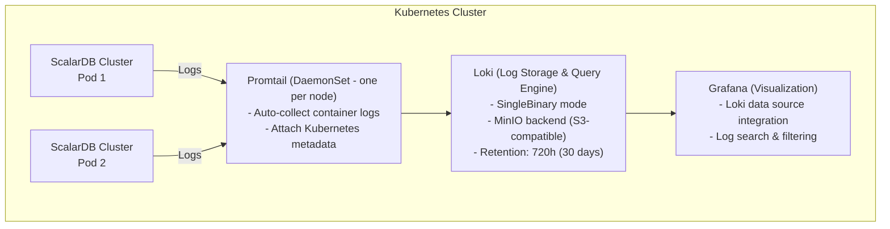
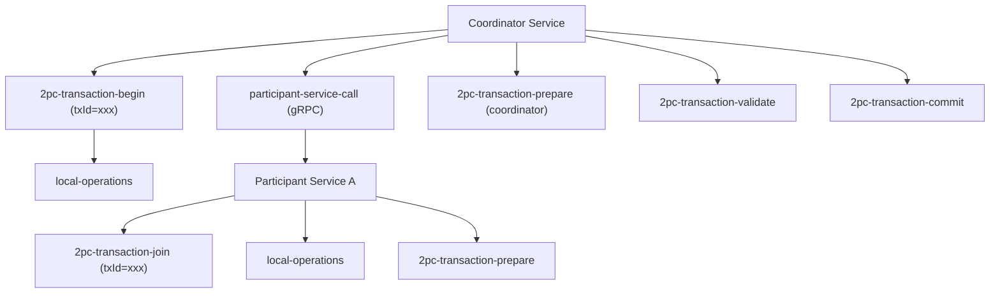
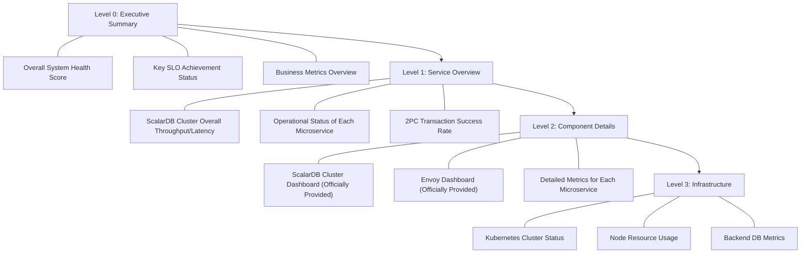
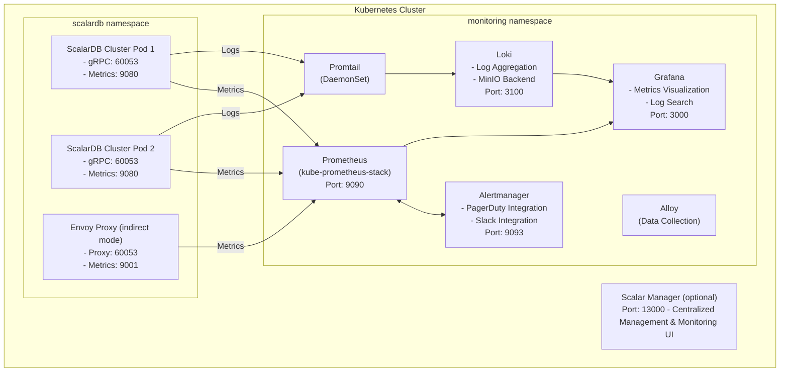

# Operational Monitoring and Observability for ScalarDB Cluster + Microservices Architecture

## Table of Contents

1. [ScalarDB Cluster Metrics Monitoring](#1-scalardb-cluster-metrics-monitoring)
2. [Log Management](#2-log-management)
3. [Distributed Tracing](#3-distributed-tracing)
4. [Health Checks and Availability Monitoring](#4-health-checks-and-availability-monitoring)
5. [Alert Design](#5-alert-design)
6. [Operations Dashboard](#6-operations-dashboard)
7. [Monitoring Stack on Kubernetes](#7-monitoring-stack-on-kubernetes)
8. [References](#8-references)

---

## 1. ScalarDB Cluster Metrics Monitoring

### 1.1 Metrics Endpoint

ScalarDB Cluster exposes Prometheus-format metrics via an HTTP endpoint.

| Item | Value |
|------|-------|
| **Port** | 9080 (default) |
| **Path** | `/metrics` |
| **Format** | Prometheus text format / OpenMetrics |
| **Configuration Property** | `scalar.db.cluster.node.prometheus_exporter_port` |

The metrics endpoint port can be changed via the `scalar.db.cluster.node.prometheus_exporter_port` property, with a default value of `9080`.

Reference: [ScalarDB Cluster Configurations](https://scalardb.scalar-labs.com/docs/latest/scalardb-cluster/scalardb-cluster-configurations/)

### 1.2 Available Metrics

The metrics system identified from the ScalarDB Cluster official Grafana dashboard definition ([scalardb_cluster_grafana_dashboard.json](https://github.com/scalar-labs/helm-charts/blob/main/charts/scalardb-cluster/files/grafana/scalardb_cluster_grafana_dashboard.json)) is as follows.

#### 1.2.1 Overall Statistics Metrics

| Metric Name | Type | Description |
|------------|------|-------------|
| `scalardb_cluster_stats_total_success` | Counter | Total successful requests |
| `scalardb_cluster_stats_total_failure` | Counter | Total failed requests |

#### 1.2.2 Distributed Transaction Service Metrics

For each operation, throughput (requests/second) and latency (percentiles: p50, p75, p95, p98, p99, p99.9) are measured.

| Operation | Metric Prefix |
|-----------|--------------|
| **Transaction Begin** | `scalardb_cluster_distributed_transaction_begin_*` |
| **Transaction Get** | `scalardb_cluster_distributed_transaction_get_*` |
| **Transaction Scan** | `scalardb_cluster_distributed_transaction_scan_*` |
| **Transaction Put** | `scalardb_cluster_distributed_transaction_put_*` |
| **Transaction Delete** | `scalardb_cluster_distributed_transaction_delete_*` |
| **Transaction Mutate** | `scalardb_cluster_distributed_transaction_mutate_*` |
| **Transaction Commit** | `scalardb_cluster_distributed_transaction_commit_*` |
| **Transaction Rollback** | `scalardb_cluster_distributed_transaction_rollback_*` |

Each operation's metrics include the following suffixes:
- `_all`: Total request count (success + failure)
- `_success`: Successful request count
- `_failure`: Failed request count
- Percentile metrics (with quantile label): `0.5`, `0.75`, `0.95`, `0.98`, `0.99`, `0.999`

#### 1.2.3 Distributed Transaction Admin Service Metrics

| Operation | Metric Prefix |
|-----------|--------------|
| **Create Table** | `scalardb_cluster_admin_create_table_*` |
| **Drop Table** | `scalardb_cluster_admin_drop_table_*` |
| **Truncate Table** | `scalardb_cluster_admin_truncate_table_*` |
| **Get Table Metadata** | `scalardb_cluster_admin_get_table_metadata_*` |

#### 1.2.4 Two-Phase Commit Transaction Service Metrics

In addition to the standard transaction metrics, the following operations specific to 2PC transactions are measured.

| Operation | Metric Prefix |
|-----------|--------------|
| **2PC Begin** | `scalardb_cluster_two_phase_commit_transaction_begin_*` |
| **2PC Join** | `scalardb_cluster_two_phase_commit_transaction_join_*` |
| **2PC Prepare** | `scalardb_cluster_two_phase_commit_transaction_prepare_*` |
| **2PC Validate** | `scalardb_cluster_two_phase_commit_transaction_validate_*` |
| **2PC Commit** | `scalardb_cluster_two_phase_commit_transaction_commit_*` |
| **2PC Rollback** | `scalardb_cluster_two_phase_commit_transaction_rollback_*` |
| **2PC Get/Scan/Put/Delete/Mutate** | Corresponding metrics for each operation |

### 1.3 Consensus Commit Protocol-Specific Metrics

#### Group Commit Metrics

The Consensus Commit protocol in ScalarDB supports a group commit feature, and related metrics log output can be enabled.

| Configuration Property | Default Value | Description |
|-----------------------|---------------|-------------|
| `scalar.db.consensus_commit.coordinator.group_commit.enabled` | `false` | Enable group commit |
| `scalar.db.consensus_commit.coordinator.group_commit.metrics_monitor_log_enabled` | `false` | Periodic log output of group commit metrics |
| `scalar.db.consensus_commit.coordinator.group_commit.slot_capacity` | `20` | Maximum slot count within a group |
| `scalar.db.consensus_commit.coordinator.group_commit.group_size_fix_timeout_millis` | `40` | Timeout for group size finalization |
| `scalar.db.consensus_commit.coordinator.group_commit.delayed_slot_move_timeout_millis` | `1200` | Timeout for delayed slot movement |
| `scalar.db.consensus_commit.coordinator.group_commit.old_group_abort_timeout_millis` | `60000` | Abort timeout for old groups |
| `scalar.db.consensus_commit.coordinator.group_commit.timeout_check_interval_millis` | `20` | Timeout check interval |

Setting `metrics_monitor_log_enabled` to `true` periodically outputs internal performance metrics of group commit to the logs. This provides information needed for tuning group commit.

Reference: [ScalarDB Core Configurations](https://scalardb.scalar-labs.com/docs/latest/configurations/)

#### Performance-Related Monitoring Configuration

| Configuration Property | Default Value | Monitoring Perspective |
|-----------------------|---------------|----------------------|
| `scalar.db.consensus_commit.parallel_executor_count` | `128` | Monitor saturation of parallel execution threads |
| `scalar.db.consensus_commit.async_commit.enabled` | `false` | Async commit enabled/disabled state |
| `scalar.db.active_transaction_management.expiration_time_millis` | `60000` | Idle transaction expiration |
| `scalar.db.metadata.cache_expiration_time_secs` | `60` | Metadata cache expiration |

### 1.4 Grafana Dashboard Configuration

The official ScalarDB Cluster Helm chart includes a Grafana dashboard JSON file.

**Dashboard File**: `scalardb_cluster_grafana_dashboard.json`
([GitHub](https://github.com/scalar-labs/helm-charts/blob/main/charts/scalardb-cluster/files/grafana/scalardb_cluster_grafana_dashboard.json))

The dashboard consists of the following 4 sections:

| Section | Contents |
|---------|----------|
| **Total Requests** | Real-time display of successful/failed request counts |
| **Distributed Transaction Admin Service** | Throughput and latency for table operations (Create/Drop/Truncate/GetMetadata) |
| **Distributed Transaction Service** | Throughput and latency for CRUD operations (Begin/Get/Scan/Put/Delete/Mutate/Commit/Rollback) |
| **Two Phase Commit Transaction Service** | Throughput and latency for 2PC operations (Begin/Join/Prepare/Validate/Commit/Rollback, etc.) |

Each panel consists of two types:
- **Throughput Panel**: Requests/second using the `irate()` function over 1 minute (color-coded by Pod)
- **Latency Panel**: Percentile distribution (p50, p75, p95, p98, p99, p99.9)

A dashboard variable `$pod` is defined, allowing filtering by specific Pods.

#### Envoy Dashboard

When using Envoy in indirect mode, a Grafana dashboard for Envoy is also provided.

**Dashboard File**: `scalar_envoy_grafana_dashboard.json`
([GitHub](https://github.com/scalar-labs/helm-charts/blob/main/charts/scalardb-cluster-monitoring/files/grafana/scalar_envoy_grafana_dashboard.json))

### 1.5 ServiceMonitor Configuration

The ScalarDB Cluster Helm chart includes a ServiceMonitor template, enabling automatic metrics collection by Prometheus Operator.

**Template File**: `charts/scalardb-cluster/templates/scalardb-cluster/servicemonitor.yaml`

ServiceMonitor configuration:
- **Port Name**: `scalardb-cluster-prometheus`
- **Metrics Path**: `/metrics`
- **Scrape Interval**: Configurable via `serviceMonitor.interval` (default: `15s`)
- **TLS Support**: HTTPS scheme + CA certificate specification possible when TLS is enabled

```yaml
# Enable ServiceMonitor in Helm values
scalardbCluster:
  serviceMonitor:
    enabled: true
    namespace: monitoring
    interval: "15s"
```

Additional configuration required when using TLS:

```yaml
scalardbCluster:
  tls:
    enabled: true
    caRootCertSecretForServiceMonitor: "scalardb-cluster-tls-ca-for-prometheus"
```

Create the CA certificate Secret in the Prometheus namespace:

```bash
kubectl create secret generic scalardb-cluster-tls-ca-for-prometheus \
  --from-file=ca.crt=/path/to/ca/cert \
  -n monitoring
```

Reference: [Configure a custom values file for ScalarDB Cluster](https://scalardb.scalar-labs.com/docs/latest/helm-charts/configure-custom-values-scalardb-cluster/)

---

## 2. Log Management

### 2.1 ScalarDB Cluster Log Output Specifications

ScalarDB Cluster is a Java-based application that outputs logs using standard Java logging frameworks.

#### Log Level Configuration

Log levels can be set in the Helm chart `values.yaml`:

```yaml
scalardbCluster:
  logLevel: INFO
```

Available log levels:

| Level | Usage |
|-------|-------|
| `TRACE` | Most detailed trace information |
| `DEBUG` | Debug information |
| `INFO` | Normal operational information (default) |
| `WARN` | Warning information |
| `ERROR` | Error information |

Reference: [Configure a custom values file for ScalarDB Cluster](https://scalardb.scalar-labs.com/docs/latest/helm-charts/configure-custom-values-scalardb-cluster/)

#### Transaction-Related Logs

ScalarDB's error code system enables structured error identification within logs:

| Code Category | Range | Contents |
|--------------|-------|----------|
| **User Errors** | `DB-CORE-1xxxx` | Configuration/operational issues |
| **Concurrency Errors** | `DB-CORE-2xxxx` | Transaction conflict/serialization issues |
| **Internal Errors** | `DB-CORE-3xxxx` | System-level operation failures |
| **Unknown Status** | `DB-CORE-4xxxx` | Transaction completion status indeterminate |

**Important Error Codes for Monitoring**:

| Code | Description | Monitoring Action |
|------|-------------|-------------------|
| `DB-CORE-20011` | Conflict occurred, transaction retry required | Monitor conflict rate |
| `DB-CORE-20015` | Commit state transition failure at Coordinator, transaction aborted | Monitor commit failure rate |
| `DB-CORE-30030` | Commit operation failure | Trigger infrastructure-level investigation |
| `DB-CORE-40000` | Rollback failure (recovery impact) | Immediate investigation required |
| `DB-CORE-40001` | NoMutation exception without Coordinator status | Verify transaction consistency |

Reference: [ScalarDB Core Status Codes](https://scalardb.scalar-labs.com/docs/latest/scalardb-core-status-codes/)

#### Group Commit Metrics Log

When using the group commit feature, enabling `metrics_monitor_log_enabled` periodically outputs internal metrics of group commit to the logs:

```properties
scalar.db.consensus_commit.coordinator.group_commit.metrics_monitor_log_enabled=true
```

### 2.2 Log Aggregation Architecture

The ScalarDB official guide adopts **Grafana Loki + Promtail** as the recommended log aggregation architecture.

#### Architecture Overview



#### Loki Stack Deployment Steps

```bash
# Add Grafana Helm repository
helm repo add grafana https://grafana.github.io/helm-charts

# Install Loki Stack
helm install scalar-logging-loki grafana/loki-stack \
  -n monitoring \
  -f scalar-loki-stack-custom-values.yaml
```

#### Adding Loki Data Source to Grafana

Add the following to the Prometheus stack custom values file:

```yaml
grafana:
  additionalDataSources:
  - name: Loki
    type: loki
    uid: loki
    url: http://scalar-logging-loki:3100/
    access: proxy
    editable: false
    isDefault: false
```

Then upgrade the Prometheus stack:

```bash
helm upgrade scalar-monitoring prometheus-community/kube-prometheus-stack \
  -n monitoring \
  -f scalar-prometheus-custom-values.yaml
```

Reference: [Collecting logs from Scalar products on a Kubernetes cluster](https://scalardb.scalar-labs.com/docs/latest/scalar-kubernetes/K8sLogCollectionGuide/), [Getting Started with Helm Charts (Logging using Loki Stack)](https://scalardb.scalar-labs.com/docs/latest/helm-charts/getting-started-logging/)

#### Promtail Node Scheduling Configuration

When deployed on ScalarDB Cluster dedicated nodes, configure Promtail's nodeSelector and tolerations:

```yaml
promtail:
  nodeSelector:
    scalar-labs.com/dedicated-node: scalardb-cluster
  tolerations:
    - effect: NoSchedule
      key: scalar-labs.com/dedicated-node
      operator: Equal
      value: scalardb-cluster
```

### 2.3 Transaction Log Tracing Methods

ScalarDB Cluster's gRPC API uses a rich error model (`google.rpc.ErrorInfo`) to structure errors with the following fields:

| Field | Description | Example |
|-------|-------------|---------|
| `reason` | Error type | `TRANSACTION_NOT_FOUND`, `HOP_LIMIT_EXCEEDED` |
| `domain` | Domain | `com.scalar.db.cluster` |
| `metadata` | Additional information (Map) | Contains transaction ID under the `transactionId` key |

For transaction-related errors, the metadata map includes a `transactionId` key, enabling cross-cutting log tracing using a specific transaction ID as the key.

**Practical Log Tracing Approaches**:

1. **Transaction ID Tracing**: Each transaction is assigned a unique ID, so use Loki's LogQL to filter by transaction ID
2. **Error Code Filtering**: Focus monitoring on `DB-CORE-2xxxx` (concurrency errors) and `DB-CORE-4xxxx` (unknown status)
3. **2PC Transaction Tracing**: In the 2PC Interface, the transaction ID issued by the Coordinator service is also used by participant services, so all participant logs can be traced with the same ID

```
# Loki LogQL query examples: Trace logs by specific transaction ID
{namespace="scalardb"} |= "tx-id-12345"

# Filter by error code
{namespace="scalardb"} |~ "DB-CORE-[234]\\d{4}"

# Commit failure logs
{namespace="scalardb"} |= "DB-CORE-20015"
```

### 2.4 Alternative Log Infrastructure: EFK Stack

While the official recommendation is Loki + Promtail, the following configuration can be applied when using an existing EFK (Elasticsearch + Fluentd/Fluent Bit + Kibana) stack.

```yaml
# Fluent Bit DaemonSet configuration example (Kubernetes environment)
apiVersion: v1
kind: ConfigMap
metadata:
  name: fluent-bit-config
  namespace: monitoring
data:
  fluent-bit.conf: |
    [SERVICE]
        Flush         5
        Log_Level     info
        Daemon        off
        Parsers_File  parsers.conf

    [INPUT]
        Name              tail
        Tag               scalardb.*
        Path              /var/log/containers/scalardb-cluster-*.log
        Parser            docker
        DB                /var/log/flb_scalardb.db
        Mem_Buf_Limit     5MB
        Skip_Long_Lines   On
        Refresh_Interval  10

    [FILTER]
        Name                kubernetes
        Match               scalardb.*
        Kube_URL            https://kubernetes.default.svc:443
        Kube_CA_File        /var/run/secrets/kubernetes.io/serviceaccount/ca.crt
        Kube_Token_File     /var/run/secrets/kubernetes.io/serviceaccount/token
        Merge_Log           On
        K8S-Logging.Parser  On

    [OUTPUT]
        Name            es
        Match           scalardb.*
        Host            elasticsearch.monitoring.svc.cluster.local
        Port            9200
        Index           scalardb-logs
        Type            _doc
        Logstash_Format On
        Logstash_Prefix scalardb
        Retry_Limit     False
```

---

## 3. Distributed Tracing

### 3.1 OpenTelemetry Support Status

As of February 2026, ScalarDB Cluster **does not officially support native distributed tracing via OpenTelemetry**. The ScalarDB roadmap ([ScalarDB Roadmap](https://scalardb.scalar-labs.com/docs/latest/roadmap/)) does not explicitly include OpenTelemetry support.

However, since ScalarDB Cluster has the following characteristics, implementing distributed tracing at the application layer is possible:

- Uses gRPC-based communication protocol
- Java-based application (runs on JVM)
- Built-in request tracing via transaction IDs

#### Future Outlook

The ScalarDB roadmap includes **Audit Logging (planned for CY2026 Q2)** as a feature for "viewing and managing access logs of ScalarDB Cluster and Analytics." While primarily for auditing purposes, this may also be useful from an observability perspective.

### 3.2 Application-Layer Tracing Implementation

Given that ScalarDB Cluster does not natively support OpenTelemetry, distributed tracing can be achieved at the application layer using the following approaches.

#### 3.2.1 Trace Injection via gRPC Interceptor

Since ScalarDB Cluster provides a gRPC API, OpenTelemetry's gRPC interceptor can be used to propagate trace context.

```java
// OpenTelemetry gRPC client interceptor configuration example
import io.opentelemetry.api.OpenTelemetry;
import io.opentelemetry.instrumentation.grpc.v1_6.GrpcTelemetry;
import io.grpc.ManagedChannel;
import io.grpc.ManagedChannelBuilder;

// Initialize OpenTelemetry SDK
OpenTelemetry openTelemetry = initializeOpenTelemetry();

// Create gRPC telemetry interceptor
GrpcTelemetry grpcTelemetry = GrpcTelemetry.create(openTelemetry);

// Add interceptor to gRPC channel for ScalarDB Cluster
ManagedChannel channel = ManagedChannelBuilder
    .forAddress("scalardb-cluster", 60053)
    .intercept(grpcTelemetry.newClientInterceptor())
    .build();
```

#### 3.2.2 Transaction Tracing Across Microservices

For tracing across microservices using 2PC transactions, record the transaction ID as a trace span attribute:

```java
// Coordinator service side
Span span = tracer.spanBuilder("2pc-transaction-coordinate")
    .setAttribute("scalardb.transaction.id", txId)
    .setAttribute("scalardb.transaction.type", "two-phase-commit")
    .startSpan();

try (Scope scope = span.makeCurrent()) {
    // Start 2PC transaction
    TwoPhaseCommitTransaction tx = txManager.start();
    String txId = tx.getId();

    // Propagate transaction ID with trace context
    span.setAttribute("scalardb.transaction.id", txId);

    // Call participant service
    // (Trace context is automatically propagated via gRPC metadata)
    participantService.join(txId, operationData);

    // Prepare & Commit
    tx.prepare();
    tx.validate();
    tx.commit();

    span.setStatus(StatusCode.OK);
} catch (Exception e) {
    span.setStatus(StatusCode.ERROR, e.getMessage());
    span.recordException(e);
    throw e;
} finally {
    span.end();
}
```

```java
// Participant service side
Span span = tracer.spanBuilder("2pc-transaction-participate")
    .setAttribute("scalardb.transaction.id", txId)
    .setAttribute("scalardb.transaction.role", "participant")
    .startSpan();

try (Scope scope = span.makeCurrent()) {
    TwoPhaseCommitTransaction tx = txManager.join(txId);
    // Execute local operations
    tx.put(/* ... */);
    tx.prepare();
    tx.validate();
    // Wait for commit instruction from Coordinator
} finally {
    span.end();
}
```

### 3.3 Trace Collection Architecture with OpenTelemetry Collector

Even when ScalarDB Cluster itself does not emit traces, a configuration can be built to collect application-layer traces with the OpenTelemetry Collector and forward them to Jaeger or Zipkin.

```yaml
# OpenTelemetry Collector configuration example
apiVersion: v1
kind: ConfigMap
metadata:
  name: otel-collector-config
  namespace: monitoring
data:
  otel-collector-config.yaml: |
    receivers:
      otlp:
        protocols:
          grpc:
            endpoint: 0.0.0.0:4317
          http:
            endpoint: 0.0.0.0:4318

    processors:
      batch:
        timeout: 10s
        send_batch_size: 1024
      memory_limiter:
        check_interval: 5s
        limit_mib: 512

    exporters:
      jaeger:
        endpoint: jaeger-collector.monitoring:14250
        tls:
          insecure: true
      prometheus:
        endpoint: 0.0.0.0:8889
        namespace: scalardb

    service:
      pipelines:
        traces:
          receivers: [otlp]
          processors: [batch, memory_limiter]
          exporters: [jaeger]
        metrics:
          receivers: [otlp]
          processors: [batch]
          exporters: [prometheus]
```

### 3.4 Trace Design for ScalarDB 2PC Transactions

Recommended span design for tracing 2PC transactions across microservices:



The following attributes are recommended for each span:

| Attribute Key | Description |
|--------------|-------------|
| `scalardb.transaction.id` | ScalarDB transaction ID |
| `scalardb.transaction.type` | `consensus-commit` / `two-phase-commit` |
| `scalardb.transaction.phase` | `begin` / `prepare` / `validate` / `commit` / `rollback` |
| `scalardb.operation.type` | `get` / `scan` / `put` / `delete` / `mutate` |
| `scalardb.namespace` | Target namespace |
| `scalardb.table` | Target table name |

---

## 4. Health Checks and Availability Monitoring

### 4.1 Kubernetes Liveness / Startup Probe Configuration

The ScalarDB Cluster Helm chart ([deployment.yaml](https://github.com/scalar-labs/helm-charts/blob/main/charts/scalardb-cluster/templates/scalardb-cluster/deployment.yaml)) configures Probes using the gRPC health checking protocol.

#### Startup Probe

```yaml
startupProbe:
  exec:
    command:
      - /usr/local/bin/grpc_health_probe
      - -addr=localhost:60053
  failureThreshold: 60
  periodSeconds: 5
```

- Uses gRPC Health Checking Protocol
- Maximum 300 seconds (60 x 5 seconds) startup wait
- When TLS is enabled, CA certificate and server name specifications are added

#### Liveness Probe

```yaml
livenessProbe:
  exec:
    command:
      - /usr/local/bin/grpc_health_probe
      - -addr=localhost:60053
  failureThreshold: 3
  periodSeconds: 10
  successThreshold: 1
  timeoutSeconds: 1
```

- Uses gRPC Health Checking Protocol
- Restarts container if no response for 30 seconds (3 x 10 seconds)
- Uses the `grpc_health_probe` command

#### Health Checks with TLS Enabled

When TLS is enabled, the `overrideAuthority` parameter is used in startup and liveness probes:

```yaml
scalardbCluster:
  tls:
    enabled: true
    overrideAuthority: "cluster.scalardb.example.com"
```

This setting adds TLS-related flags to the health check command:

```
grpc_health_probe -addr=localhost:60053 \
  -tls \
  -tls-ca-cert=/path/to/ca.crt \
  -tls-server-name=cluster.scalardb.example.com
```

Reference: [Configure a custom values file for ScalarDB Cluster](https://scalardb.scalar-labs.com/docs/latest/helm-charts/configure-custom-values-scalardb-cluster/)

#### Readiness Probe

In the current Helm chart, **no explicit Readiness Probe is defined**. `minReadySeconds` is set to `0`, and Pods become Ready immediately after creation. A Readiness Probe can be added in a custom values file as needed.

### Recommended Readiness Probe Configuration

Since the current Helm Chart does not explicitly define a Readiness Probe, the following configuration is recommended to mitigate the risk of traffic being forwarded to Pods immediately after startup, which may cause transaction failures.

```yaml
readinessProbe:
  exec:
    command:
      - /bin/grpc_health_probe
      - -addr=:60053
  initialDelaySeconds: 10
  periodSeconds: 5
  failureThreshold: 3
```

Additionally, set `minReadySeconds: 15` on the Deployment to prevent traffic forwarding until the Pod has stabilized.

### 4.2 ScalarDB Cluster Health Check Endpoints

| Endpoint | Port | Protocol | Purpose |
|----------|------|----------|---------|
| gRPC Health Check | 60053 | gRPC | For Kubernetes Probes (grpc.health.v1.Health/Check) |
| Prometheus Metrics | 9080 | HTTP | Metrics exposure (`/metrics`) |
| GraphQL | 8080 | HTTP | GraphQL API (when enabled) |

### 4.3 Backend DB Connection Monitoring

ScalarDB Cluster manages connections to backend databases internally. The following configuration parameters are relevant to connection pool monitoring:

| Setting | Default Value | Description |
|---------|---------------|-------------|
| `scalar.db.jdbc.connection_pool.max_total` | `200` | Maximum JDBC connection pool size |
| `scalar.db.active_transaction_management.expiration_time_millis` | `60000` | Idle transaction expiration |
| `scalar.db.cluster.node.scanner_management.expiration_time_millis` | `60000` | Idle scanner expiration (resource leak prevention) |

Backend DB connection status can be indirectly assessed by monitoring error rates for transaction operations (especially `DB-CORE-3xxxx` internal errors).

### 4.4 Cluster Membership Monitoring

ScalarDB Cluster uses consistent hashing algorithm for request routing, so changes in cluster membership affect transaction processing.

**Items to Monitor**:

| Item | Monitoring Method |
|------|------------------|
| Pod count changes | Difference between `kube_deployment_spec_replicas` and `kube_deployment_status_available_replicas` |
| Pod status | Monitor Pending/Running/Failed via `kube_pod_status_phase` metric |
| Cluster degradation | Detect when available replicas are below spec replicas |
| Pod restarts | Monitor increases in `kube_pod_container_status_restarts_total` |

#### PrometheusRule for Cluster State Monitoring

The ScalarDB Cluster Helm chart includes the following built-in PrometheusRule alerts:

| Alert Name | Severity | Condition | Duration |
|-----------|----------|-----------|----------|
| **ScalarDBClusterDown** | `critical` | Available replicas count is zero | 1 minute |
| **ScalarDBClusterDegraded** | `warning` | One or more unavailable replicas exist | 1 minute |
| **ScalarDBPodsPending** | `warning` | Pod stuck in Pending state | 1 minute |
| **ScalarDBPodsError** | `warning` | Container in waiting state other than creation phase (error) | 1 minute |

Reference: [prometheusrules.yaml](https://github.com/scalar-labs/helm-charts/blob/main/charts/scalardb-cluster/templates/scalardb-cluster/prometheusrules.yaml)

### 4.5 Integrated Availability Monitoring with Scalar Manager

[Scalar Manager](https://scalardb.scalar-labs.com/docs/latest/scalar-manager/overview/) provides the following features as a centralized management and monitoring solution for ScalarDB Cluster:

| Feature | Description |
|---------|-------------|
| **Cluster Visualization** | Real-time cluster health metrics display |
| **Pod Monitoring** | Pod logs, performance data, hardware usage statistics |
| **RPS Monitoring** | Real-time requests/second display |
| **Pause Job Management** | Scheduling pause operations ensuring transaction consistency |
| **User Management** | Access control through authentication/authorization |
| **Grafana Integration** | Dashboard access with seamless authentication integration |

Scalar Manager automatically detects targets using the following Kubernetes labels:
- ScalarDB Cluster: `app.kubernetes.io/app=scalardb-cluster`
- ScalarDL Ledger: `app.kubernetes.io/app=ledger`
- ScalarDL Auditor: `app.kubernetes.io/app=auditor`

**Port**: 13000 (for Scalar Manager access)

Reference: [Deploy Scalar Manager](https://scalardb.scalar-labs.com/docs/latest/helm-charts/getting-started-scalar-manager/)

---

## 5. Alert Design

### 5.1 SLI/SLO Definition Examples

SLI/SLO definition examples for a microservices system using ScalarDB Cluster:

#### Availability SLI/SLO

| SLI | Measurement Method | SLO Target Example |
|-----|-------------------|-------------------|
| **Service Availability** | ScalarDB Cluster available replicas / target replicas | 99.9% (monthly downtime within 43.8 minutes) |
| **Transaction Success Rate** | `scalardb_cluster_stats_total_success / (success + failure)` | 99.95% |
| **API Availability** | gRPC health check success rate | 99.99% |

#### Latency SLI/SLO

| SLI | Measurement Method | SLO Target Example |
|-----|-------------------|-------------------|
| **Transaction Commit Latency (p99)** | `scalardb_cluster_distributed_transaction_commit` p99 | 500ms or less |
| **Get Operation Latency (p95)** | `scalardb_cluster_distributed_transaction_get` p95 | 100ms or less |
| **2PC Commit Latency (p99)** | `scalardb_cluster_two_phase_commit_transaction_commit` p99 | 1000ms or less |

#### Error Rate SLI/SLO

| SLI | Measurement Method | SLO Target Example |
|-----|-------------------|-------------------|
| **Transaction Conflict Rate** | `DB-CORE-2xxxx` error occurrence rate | 5% or less |
| **Internal Error Rate** | `DB-CORE-3xxxx` error occurrence rate | 0.1% or less |
| **Unknown Status Rate** | `DB-CORE-4xxxx` error occurrence rate | 0.01% or less |

### 5.2 Alert Rule Design Patterns

#### Built-in Alert Rules (Provided by Helm Chart)

PrometheusRules built into the ScalarDB Cluster Helm chart:

```yaml
# ScalarDB Cluster Helm chart built-in alert rules
# Enable with prometheusRule.enabled: true
groups:
  - name: ScalarDBClusterAlerts
    rules:
      - alert: ScalarDBClusterDown
        # Available replicas count is zero
        expr: |
          kube_deployment_spec_replicas{deployment=~".*scalardb-cluster.*"}
          - kube_deployment_status_unavailable_replicas{deployment=~".*scalardb-cluster.*"}
          == 0
        for: 1m
        labels:
          severity: critical
          app: ScalarDB
        annotations:
          summary: "ScalarDB Cluster is down"
          description: "No available replicas for ScalarDB Cluster"

      - alert: ScalarDBClusterDegraded
        # One or more unavailable replicas
        expr: |
          kube_deployment_status_unavailable_replicas{deployment=~".*scalardb-cluster.*"}
          >= 1
        for: 1m
        labels:
          severity: warning
          app: ScalarDB
        annotations:
          summary: "ScalarDB Cluster is degraded"

      - alert: ScalarDBPodsPending
        # Pod in Pending state
        expr: |
          kube_pod_status_phase{pod=~".*scalardb-cluster.*", phase="Pending"}
          == 1
        for: 1m
        labels:
          severity: warning

      - alert: ScalarDBPodsError
        # Container error state
        expr: |
          kube_pod_container_status_waiting_reason{
            pod=~".*scalardb-cluster.*",
            reason!="ContainerCreating"
          } == 1
        for: 1m
        labels:
          severity: warning
```

#### Custom Alert Rules (Additional Recommendations)

The following alert rules are additionally recommended for ScalarDB Cluster operations:

```yaml
groups:
  - name: ScalarDBClusterCustomAlerts
    rules:
      # Transaction success rate decrease
      - alert: ScalarDBTransactionSuccessRateLow
        expr: |
          rate(scalardb_cluster_stats_total_success[5m])
          / (rate(scalardb_cluster_stats_total_success[5m])
             + rate(scalardb_cluster_stats_total_failure[5m]))
          < 0.99
        for: 5m
        labels:
          severity: warning
          app: ScalarDB
        annotations:
          summary: "ScalarDB transaction success rate below 99%"
          description: |
            Transaction success rate is {{ $value | humanizePercentage }}.
            This may indicate increased contention or backend issues.

      # Commit latency increase
      - alert: ScalarDBCommitLatencyHigh
        expr: |
          scalardb_cluster_distributed_transaction_commit{quantile="0.99"}
          > 1000
        for: 5m
        labels:
          severity: warning
          app: ScalarDB
        annotations:
          summary: "ScalarDB commit latency p99 exceeds 1 second"
          description: |
            Pod {{ $labels.pod }}: commit p99 latency is {{ $value }}ms.

      # Frequent Pod restarts
      - alert: ScalarDBPodRestarting
        expr: |
          increase(kube_pod_container_status_restarts_total{
            container="scalardb-cluster"
          }[1h]) > 3
        for: 5m
        labels:
          severity: warning
          app: ScalarDB
        annotations:
          summary: "ScalarDB Cluster pod restarting frequently"
          description: |
            Pod {{ $labels.pod }} has restarted {{ $value }} times in the last hour.

      # 2PC transaction failure rate
      - alert: ScalarDB2PCFailureRateHigh
        expr: |
          rate(scalardb_cluster_two_phase_commit_transaction_commit_failure[5m])
          / (rate(scalardb_cluster_two_phase_commit_transaction_commit_failure[5m])
             + rate(scalardb_cluster_two_phase_commit_transaction_commit_success[5m]))
          > 0.05
        for: 5m
        labels:
          severity: critical
          app: ScalarDB
        annotations:
          summary: "2PC transaction failure rate exceeds 5%"

      # Memory usage warning
      - alert: ScalarDBMemoryUsageHigh
        expr: |
          container_memory_working_set_bytes{
            container="scalardb-cluster"
          }
          / container_spec_memory_limit_bytes{
            container="scalardb-cluster"
          } > 0.85
        for: 10m
        labels:
          severity: warning
          app: ScalarDB
        annotations:
          summary: "ScalarDB Cluster memory usage above 85%"

      # CPU usage warning
      - alert: ScalarDBCPUUsageHigh
        expr: |
          rate(container_cpu_usage_seconds_total{
            container="scalardb-cluster"
          }[5m])
          / container_spec_cpu_quota{
            container="scalardb-cluster"
          }
          * container_spec_cpu_period{
            container="scalardb-cluster"
          } > 0.8
        for: 10m
        labels:
          severity: warning
          app: ScalarDB
        annotations:
          summary: "ScalarDB Cluster CPU usage above 80%"
```

### Security Anomaly Detection Alerts

| Alert Name | Condition | Severity |
|-----------|-----------|----------|
| ScalarDBAuthFailureSpike | Authentication failure rate is 5x or more than normal over 5 minutes | Critical |
| ScalarDBUnusualScanRate | Cross-partition scan rate is 10x or more than normal | Warning |
| ScalarDBHighAbortRate | Transaction abort rate is 30% or higher | Warning |
| ScalarDBCoordinatorTableGrowth | Coordinator table size exceeds threshold | Warning |

### 5.3 Escalation Policy

| Severity | Initial Response | Escalation | Response Deadline |
|----------|-----------------|------------|-------------------|
| **Critical** | Immediate notification to on-call | Escalate to lead if no response within 15 minutes | Initial response within 30 minutes |
| **Warning** | Notification to Slack channel | Escalate to on-call if no response within 30 minutes | Acknowledge within 1 hour |
| **Info** | Dashboard display only | - | Review on next business day |

### 5.4 PagerDuty / Slack Integration

#### Alertmanager Configuration Example

```yaml
# Alertmanager configuration (within scalar-prometheus-custom-values.yaml)
alertmanager:
  config:
    global:
      resolve_timeout: 5m
      slack_api_url: 'https://hooks.slack.com/services/xxx/yyy/zzz'
      pagerduty_url: 'https://events.pagerduty.com/v2/enqueue'

    route:
      receiver: 'default-receiver'
      group_by: ['alertname', 'namespace', 'app']
      group_wait: 30s
      group_interval: 5m
      repeat_interval: 4h
      routes:
        - receiver: 'pagerduty-critical'
          match:
            severity: critical
          continue: true
        - receiver: 'slack-warning'
          match:
            severity: warning

    receivers:
      - name: 'default-receiver'
        slack_configs:
          - channel: '#scalardb-alerts'
            send_resolved: true
            title: '{{ .GroupLabels.alertname }}'
            text: >-
              {{ range .Alerts }}
              *Alert:* {{ .Labels.alertname }}
              *Severity:* {{ .Labels.severity }}
              *Description:* {{ .Annotations.description }}
              *Details:*
                {{ range .Labels.SortedPairs }}
                  - *{{ .Name }}:* {{ .Value }}
                {{ end }}
              {{ end }}

      - name: 'pagerduty-critical'
        pagerduty_configs:
          - routing_key: '<PAGERDUTY_INTEGRATION_KEY>'
            severity: 'critical'
            description: '{{ .CommonAnnotations.summary }}'
            details:
              alertname: '{{ .GroupLabels.alertname }}'
              namespace: '{{ .GroupLabels.namespace }}'

      - name: 'slack-warning'
        slack_configs:
          - channel: '#scalardb-alerts'
            send_resolved: true
            color: '{{ if eq .Status "firing" }}warning{{ else }}good{{ end }}'
            title: '[{{ .Status | toUpper }}] {{ .GroupLabels.alertname }}'
            text: >-
              {{ range .Alerts }}
              *Summary:* {{ .Annotations.summary }}
              *Description:* {{ .Annotations.description }}
              {{ end }}
```

---

## 6. Operations Dashboard

### 6.1 Recommended Dashboard Structure

For operating a microservices system including ScalarDB Cluster, it is recommended to organize dashboards in the following hierarchical structure.

#### Dashboard Hierarchy



### 6.2 Business Metrics vs Infrastructure Metrics

| Category | Metric Examples | Data Source |
|----------|----------------|------------|
| **Business Metrics** | | |
| Transaction processing count/second | `rate(scalardb_cluster_stats_total_success[5m])` | Prometheus |
| Order processing success rate | Application-specific metrics | Prometheus |
| 2PC transaction completion rate | `scalardb_cluster_two_phase_commit_transaction_commit_success` | Prometheus |
| **Infrastructure Metrics** | | |
| CPU usage | `container_cpu_usage_seconds_total` | cAdvisor |
| Memory usage | `container_memory_working_set_bytes` | cAdvisor |
| Pod count / replica count | `kube_deployment_status_replicas` | kube-state-metrics |
| DB connection pool usage | JDBC provider metrics | Prometheus |

### 6.3 Real-Time Transaction Monitoring

In addition to panels provided by the official Grafana dashboard, the following custom panels are recommended:

#### Real-Time Transaction Success Rate Panel

```
# Grafana panel PromQL
# Transaction success rate (5-minute moving average)
rate(scalardb_cluster_stats_total_success[5m])
/ (rate(scalardb_cluster_stats_total_success[5m])
   + rate(scalardb_cluster_stats_total_failure[5m]))
* 100
```

#### Operation-Specific Latency Comparison Panel

```
# Query to compare p99 latency for each operation
scalardb_cluster_distributed_transaction_begin{quantile="0.99"}
scalardb_cluster_distributed_transaction_get{quantile="0.99"}
scalardb_cluster_distributed_transaction_commit{quantile="0.99"}
```

#### 2PC Transaction Phase-Specific Monitoring Panel

```
# 2PC throughput per phase
rate(scalardb_cluster_two_phase_commit_transaction_begin_success[5m])
rate(scalardb_cluster_two_phase_commit_transaction_prepare_success[5m])
rate(scalardb_cluster_two_phase_commit_transaction_validate_success[5m])
rate(scalardb_cluster_two_phase_commit_transaction_commit_success[5m])

# 2PC failure rate per phase
rate(scalardb_cluster_two_phase_commit_transaction_prepare_failure[5m])
rate(scalardb_cluster_two_phase_commit_transaction_commit_failure[5m])
```

---

## 7. Monitoring Stack on Kubernetes

### 7.1 Overall Monitoring Stack Architecture

The overall monitoring stack based on the ScalarDB Cluster official recommended configuration:



### 7.2 Prometheus Operator / kube-prometheus-stack

#### Deployment Steps

```bash
# 1. Add Helm repository
helm repo add prometheus-community \
  https://prometheus-community.github.io/helm-charts
helm repo update

# 2. Create namespace
kubectl create namespace monitoring

# 3. Install kube-prometheus-stack
helm install scalar-monitoring \
  prometheus-community/kube-prometheus-stack \
  -n monitoring \
  -f scalar-prometheus-custom-values.yaml
```

#### scalar-prometheus-custom-values.yaml

```yaml
# Prometheus Operator custom configuration
prometheus:
  service:
    type: LoadBalancer  # Use ClusterIP + port-forward for testing
  prometheusSpec:
    # Required to detect Scalar product ServiceMonitor/PrometheusRule
    serviceMonitorSelectorNilUsesHelmValues: false
    ruleSelectorNilUsesHelmValues: false

alertmanager:
  service:
    type: LoadBalancer  # Use ClusterIP + port-forward for testing

grafana:
  service:
    type: LoadBalancer
    port: 3000

  # Required for Scalar Manager integration
  grafana.ini:
    security:
      allow_embedding: true
    auth.anonymous:
      enabled: true

  # Add Loki data source
  additionalDataSources:
    - name: Loki
      type: loki
      uid: loki
      url: http://scalar-logging-loki:3100/
      access: proxy
      editable: false
      isDefault: false

  # Dashboard provisioning
  sidecar:
    dashboards:
      enabled: true
      searchNamespace: ALL
    datasources:
      enabled: true

# Resource collection (for Scalar Manager integration)
kubeStateMetrics:
  enabled: true
nodeExporter:
  enabled: true
kubelet:
  enabled: true
```

#### Enabling Monitoring for ScalarDB Cluster

```yaml
# Add the following to ScalarDB Cluster Helm values
scalardbCluster:
  # Monitoring configuration
  prometheusRule:
    enabled: true
    namespace: monitoring
  grafanaDashboard:
    enabled: true
    namespace: monitoring
  serviceMonitor:
    enabled: true
    namespace: monitoring
    interval: "15s"

  # Log level
  logLevel: INFO

# Envoy monitoring (indirect mode)
envoy:
  prometheusRule:
    enabled: true
    namespace: monitoring
  grafanaDashboard:
    enabled: true
    namespace: monitoring
  serviceMonitor:
    enabled: true
    namespace: monitoring
    interval: "15s"
```

### 7.3 scalardb-cluster-monitoring Chart (Integrated Monitoring Chart)

Scalar Labs provides a dedicated integrated monitoring chart `scalardb-cluster-monitoring` for ScalarDB Cluster. This chart bundles the following 4 components:

| Component | Version | Role |
|-----------|---------|------|
| **Prometheus** | ~27.7.0 | Metrics collection and storage |
| **Grafana** | ~8.10.4 | Dashboard and visualization |
| **Loki** | ~6.28.0 | Log aggregation and search |
| **Alloy** | ~0.12.5 | Data collection agent |

Key features of this integrated chart:

- Auto-scrape configuration for ScalarDB Cluster metrics endpoint (`/metrics`) at 10-second intervals
- Prometheus and Loki data sources pre-configured in Grafana
- Loki in SingleBinary mode with MinIO backend, 720-hour (30-day) retention
- Security hardening (privilege escalation restrictions, capabilities drop on all components)
- Grafana dashboard JSON files for ScalarDB Cluster and Envoy included

Reference: [scalardb-cluster-monitoring chart](https://github.com/scalar-labs/helm-charts/tree/main/charts/scalardb-cluster-monitoring)

### 7.4 Log Infrastructure (Loki Stack)

#### Standalone Deployment Method

```bash
# Add Grafana Helm repository
helm repo add grafana https://grafana.github.io/helm-charts

# Install Loki Stack
helm install scalar-logging-loki grafana/loki-stack \
  -n monitoring \
  -f scalar-loki-stack-custom-values.yaml
```

#### scalar-loki-stack-custom-values.yaml (Reference Configuration)

```yaml
# Promtail configuration
promtail:
  enabled: true
  # Scheduling for ScalarDB Cluster dedicated nodes
  nodeSelector:
    scalar-labs.com/dedicated-node: scalardb-cluster
  tolerations:
    - effect: NoSchedule
      key: scalar-labs.com/dedicated-node
      operator: Equal
      value: scalardb-cluster

# Loki configuration
loki:
  enabled: true
  persistence:
    enabled: true
    size: 50Gi
```

### 7.5 Dashboard Access Methods

#### Test Environment (Using port-forward)

```bash
# Prometheus
kubectl port-forward -n monitoring \
  svc/scalar-monitoring-kube-pro-prometheus 9090:9090

# Alertmanager
kubectl port-forward -n monitoring \
  svc/scalar-monitoring-kube-pro-alertmanager 9093:9093

# Grafana
kubectl port-forward -n monitoring \
  svc/scalar-monitoring-grafana 3000:3000
```

Access URLs:
- Prometheus: http://localhost:9090/
- Alertmanager: http://localhost:9093/
- Grafana: http://localhost:3000/

#### Retrieving Grafana Credentials

```bash
# Username
kubectl get secrets scalar-monitoring-grafana -n monitoring \
  -o jsonpath='{.data.admin-user}' | base64 -d

# Password
kubectl get secrets scalar-monitoring-grafana -n monitoring \
  -o jsonpath='{.data.admin-password}' | base64 -d
```

#### Production Environment

In production environments, expose dashboards using one of the following methods:

- **LoadBalancer**: Set `*.service.type: LoadBalancer`
- **Ingress**: Set `*.ingress.enabled: true` and access via Ingress Controller

### 7.6 Complete Deployment Steps (Summary)

The following summarizes the complete deployment steps for the ScalarDB Cluster monitoring stack.

```bash
# Step 1: Create namespace
kubectl create namespace monitoring

# Step 2: Add Helm repositories
helm repo add prometheus-community \
  https://prometheus-community.github.io/helm-charts
helm repo add grafana https://grafana.github.io/helm-charts
helm repo add scalar-labs https://scalar-labs.github.io/helm-charts
helm repo update

# Step 3: Deploy kube-prometheus-stack
helm install scalar-monitoring \
  prometheus-community/kube-prometheus-stack \
  -n monitoring \
  -f scalar-prometheus-custom-values.yaml

# Step 4: Deploy Loki Stack
helm install scalar-logging-loki grafana/loki-stack \
  -n monitoring \
  -f scalar-loki-stack-custom-values.yaml

# Step 5: Update with Loki data source added to Grafana
helm upgrade scalar-monitoring \
  prometheus-community/kube-prometheus-stack \
  -n monitoring \
  -f scalar-prometheus-custom-values.yaml

# Step 6: Deploy ScalarDB Cluster (monitoring enabled)
helm install scalardb-cluster scalar-labs/scalardb-cluster \
  -n scalardb \
  -f scalardb-cluster-custom-values.yaml

# Step 7: (Optional) Deploy Scalar Manager
helm install scalar-manager scalar-labs/scalar-manager \
  -n monitoring \
  -f scalar-manager-custom-values.yaml

# Step 8: Verify monitoring status
kubectl get pods -n monitoring
kubectl get servicemonitor -n monitoring
kubectl get prometheusrule -n monitoring
```

---

## 8. References

### ScalarDB Official Documentation

| Title | URL |
|-------|-----|
| Monitoring Scalar products on a Kubernetes cluster | https://scalardb.scalar-labs.com/docs/latest/scalar-kubernetes/K8sMonitorGuide/ |
| Collecting logs from Scalar products on a Kubernetes cluster | https://scalardb.scalar-labs.com/docs/latest/scalar-kubernetes/K8sLogCollectionGuide/ |
| Configure a custom values file for ScalarDB Cluster | https://scalardb.scalar-labs.com/docs/latest/helm-charts/configure-custom-values-scalardb-cluster/ |
| Production checklist for ScalarDB Cluster | https://scalardb.scalar-labs.com/docs/latest/scalar-kubernetes/ProductionChecklistForScalarDBCluster/ |
| ScalarDB Cluster Configurations | https://scalardb.scalar-labs.com/docs/latest/scalardb-cluster/scalardb-cluster-configurations/ |
| ScalarDB Core Configurations | https://scalardb.scalar-labs.com/docs/latest/configurations/ |
| ScalarDB Core Status Codes | https://scalardb.scalar-labs.com/docs/latest/scalardb-core-status-codes/ |
| ScalarDB Cluster gRPC API Guide | https://scalardb.scalar-labs.com/docs/latest/scalardb-cluster/scalardb-cluster-grpc-api-guide/ |
| Getting Started with Helm Charts (Monitoring) | https://scalardb.scalar-labs.com/docs/latest/helm-charts/getting-started-monitoring/ |
| Getting Started with Helm Charts (Logging using Loki Stack) | https://scalardb.scalar-labs.com/docs/latest/helm-charts/getting-started-logging/ |
| Deploy Scalar Manager | https://scalardb.scalar-labs.com/docs/latest/helm-charts/getting-started-scalar-manager/ |
| Scalar Manager Overview | https://scalardb.scalar-labs.com/docs/latest/scalar-manager/overview/ |
| ScalarDB Cluster Deployment Patterns for Microservices | https://scalardb.scalar-labs.com/docs/latest/scalardb-cluster/deployment-patterns-for-microservices/ |
| ScalarDB Roadmap | https://scalardb.scalar-labs.com/docs/latest/roadmap/ |
| Configure a custom values file for Scalar Envoy | https://scalardb.scalar-labs.com/docs/latest/helm-charts/configure-custom-values-envoy/ |

### GitHub Repositories

| Title | URL |
|-------|-----|
| Scalar Labs Helm Charts | https://github.com/scalar-labs/helm-charts |
| ScalarDB Cluster Helm Chart (templates) | https://github.com/scalar-labs/helm-charts/tree/main/charts/scalardb-cluster |
| ScalarDB Cluster Monitoring Chart | https://github.com/scalar-labs/helm-charts/tree/main/charts/scalardb-cluster-monitoring |
| ScalarDB Cluster PrometheusRule Template | https://github.com/scalar-labs/helm-charts/blob/main/charts/scalardb-cluster/templates/scalardb-cluster/prometheusrules.yaml |
| ScalarDB Cluster ServiceMonitor Template | https://github.com/scalar-labs/helm-charts/blob/main/charts/scalardb-cluster/templates/scalardb-cluster/servicemonitor.yaml |
| ScalarDB Cluster Deployment Template | https://github.com/scalar-labs/helm-charts/blob/main/charts/scalardb-cluster/templates/scalardb-cluster/deployment.yaml |
| ScalarDB Cluster Grafana Dashboard JSON | https://github.com/scalar-labs/helm-charts/blob/main/charts/scalardb-cluster/files/grafana/scalardb_cluster_grafana_dashboard.json |

### Community and External Resources

| Title | URL |
|-------|-----|
| kube-prometheus-stack Helm Chart | https://github.com/prometheus-community/helm-charts/tree/main/charts/kube-prometheus-stack |
| Grafana Loki Documentation | https://grafana.com/docs/loki/latest/ |
| gRPC Health Checking Protocol | https://github.com/grpc/grpc/blob/master/doc/health-checking.md |
| grpc-health-probe | https://github.com/grpc-ecosystem/grpc-health-probe |
| OpenTelemetry gRPC Instrumentation | https://opentelemetry.io/docs/languages/java/instrumentation/ |
| Prometheus Operator | https://prometheus-operator.dev/ |
