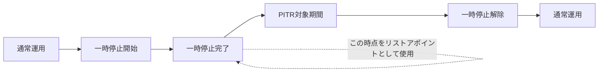
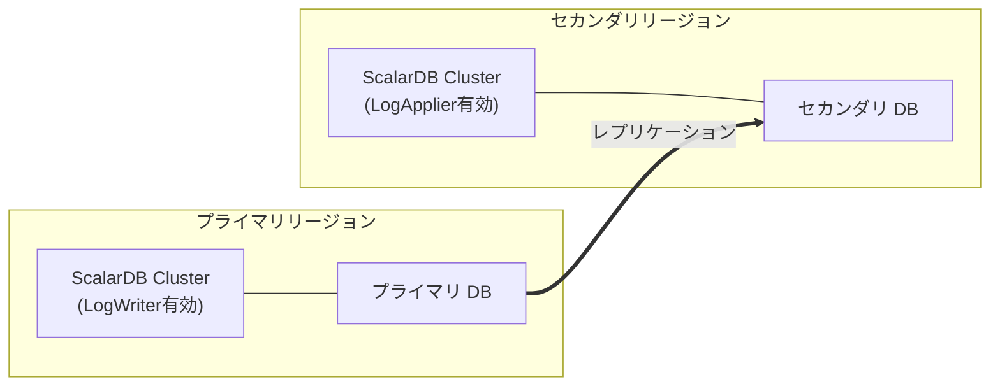

# 障害復旧（Disaster Recovery）と高可用性（High Availability）調査

## 1. ScalarDB Cluster の高可用性アーキテクチャ

### 1.1 Clusterメンバーシップと自動検出

ScalarDB Cluster は、複数のクラスタノードで構成されるミドルウェア層であり、各ノードが ScalarDB の機能を搭載し、独立してトランザクションを実行できる。クラスタ内のリクエストルーティングには**コンシステントハッシュ**が用いられ、適切なノードにリクエストが転送される。

**メンバーシップ管理:**

現在、ScalarDB Cluster のメンバーシップ管理は **Kubernetes API** を通じて行われる。これが唯一のサポートされるメンバーシップタイプである。

```properties
# メンバーシップ設定
scalar.db.cluster.membership.type=KUBERNETES
scalar.db.cluster.membership.kubernetes.endpoint.namespace_name=default
scalar.db.cluster.membership.kubernetes.endpoint.name=<endpoint-name>
```

- ノードがクラスタに参加・離脱すると、メンバーシップ情報が自動的に更新される
- Kubernetes API を通じた Service Endpoint の監視により、Pod の追加・削除がリアルタイムに検出される
- `direct-kubernetes` モードでは、クライアント SDK が直接 Kubernetes API を参照してノード一覧を取得する

**クライアント接続モード:**

| モード | 説明 | 用途 |
|--------|------|------|
| `indirect` | ロードバランサー経由 (`indirect:<LB_IP>`) | Kubernetes 外部からのアクセス |
| `direct-kubernetes` | Kubernetes API 直接参照 (`direct-kubernetes:<NS>/<EP>`) | 同一クラスタ内のアプリケーション |

参照: [ScalarDB Cluster Configurations](https://scalardb.scalar-labs.com/docs/latest/scalardb-cluster/scalardb-cluster-configurations/)

### 1.2 ノード障害時の自動フェイルオーバー

ScalarDB Cluster のフェイルオーバーは、Kubernetes のメカニズムと ScalarDB 固有の機能の組み合わせで実現される。

**Kubernetes レベルのフェイルオーバー:**
- Deployment コントローラが Pod の死活を監視し、障害ポッドを自動再起動する
- Readiness Probe / Liveness Probe による健全性チェック
- ReplicaSet が指定されたレプリカ数を維持する

**ScalarDB Cluster レベルのフェイルオーバー:**
- リクエストを受信したノードが処理に適切でない場合、クラスタ内の適切なノードにルーティングする
- コンシステントハッシュリングの再計算により、障害ノードの担当範囲が他のノードに自動的に再分配される
- クライアント SDK はメンバーシップ情報の更新を検知し、利用可能なノードにリクエストを送信する

**gRPC 接続管理（ScalarDB 3.17 以降）:**

```properties
# gRPC 接続のリフレッシュ設定
scalar.db.cluster.node.grpc.max_connection_age_millis=<ミリ秒>
scalar.db.cluster.node.grpc.max_connection_age_grace_millis=<ミリ秒>
```

これにより、長時間維持された gRPC 接続を定期的にリフレッシュし、ローリングアップデート時やノード障害時の接続切り替えをスムーズに行うことができる。

### 1.3 ローリングアップデート戦略

ScalarDB Cluster は Kubernetes の Deployment としてデプロイされ、ローリングアップデートによりゼロダウンタイムでのアップグレードが可能である。

**Helm Chart でのアップデート戦略:**

```yaml
scalardbCluster:
  # デフォルトのローリングアップデート設定
  strategy:
    type: RollingUpdate
    rollingUpdate:
      maxSurge: 25%        # アップデート中に追加で作成できるPod数
      maxUnavailable: 25%   # アップデート中に利用不可にできるPod数
```

**グレースフルシャットダウン:**

```properties
# ノードのデコミッション期間（デフォルト: 30秒）
scalar.db.cluster.node.decommissioning_duration_secs=30
```

デコミッション状態に入ったノードは、新規リクエストの受付を停止しつつ、進行中のリクエストを処理完了するまで待機する。これにより、ローリングアップデート中のリクエスト損失を防止する。

**アップグレード手順:**

```bash
# Helm Chart によるローリングアップデート
helm upgrade <RELEASE_NAME> scalar-labs/scalardb-cluster \
  -n <NAMESPACE> \
  -f /<PATH_TO_CUSTOM_VALUES_FILE> \
  --version <NEW_CHART_VERSION>
```

**注意事項:**
- ScalarDB はダウングレードをサポートしない。アップグレードのみ可能
- メジャーバージョンアップでは後方互換性が保証されない。スキーマ更新や API 変更が必要になる場合がある
- アップグレード前に ScalarDB Cluster Compatibility Matrix を確認し、クライアント SDK との互換性を検証する

参照: [How to Upgrade ScalarDB](https://scalardb.scalar-labs.com/docs/3.13/scalar-kubernetes/HowToUpgradeScalarDB/), [Configure a custom values file for ScalarDB Cluster](https://scalardb.scalar-labs.com/docs/latest/helm-charts/configure-custom-values-scalardb-cluster/)

### 1.4 スケーリング（水平スケール）

**手動スケーリング:**

```yaml
scalardbCluster:
  replicaCount: 5  # ポッド数を増加
```

```bash
# レプリカ数の変更
helm upgrade <RELEASE_NAME> scalar-labs/scalardb-cluster \
  -n <NAMESPACE> \
  -f /<PATH_TO_UPDATED_VALUES_FILE> \
  --version <CHART_VERSION>
```

**Horizontal Pod Autoscaler（HPA）との連携:**

ScalarDB Cluster は HPA と組み合わせることができる。HPA を使用する場合は、Kubernetes の Cluster Autoscaler も併せて設定し、ワーカーノード数の自動調整を行う。

```yaml
apiVersion: autoscaling/v2
kind: HorizontalPodAutoscaler
metadata:
  name: scalardb-cluster-hpa
spec:
  scaleTargetRef:
    apiVersion: apps/v1
    kind: Deployment
    name: <RELEASE_NAME>-scalardb-cluster
  minReplicas: 3
  maxReplicas: 10
  metrics:
    - type: Resource
      resource:
        name: cpu
        target:
          type: Utilization
          averageUtilization: 70
```

**スケーリング時の考慮事項:**
- 商用ライセンスでは、各ポッドのリソースは **2vCPU / 4GB メモリ**に制限される
- 最低3ポッドを本番環境で維持することが推奨される
- コンシステントハッシュリングの再計算によりトラフィックが自動的に再分配される

参照: [Production checklist for ScalarDB Cluster](https://scalardb.scalar-labs.com/docs/latest/scalar-kubernetes/ProductionChecklistForScalarDBCluster/), [Guidelines for creating an EKS cluster for ScalarDB Cluster](https://scalardb.scalar-labs.com/docs/latest/scalar-kubernetes/CreateEKSClusterForScalarDBCluster/)

---

## 2. バックアップ・リストア

### 2.1 ScalarDB公式のバックアップ/リストア手順

ScalarDB のバックアップ・リストアには、バックエンドデータベースの構成に応じて 2 つのアプローチが存在する。

#### アプローチ1: 明示的な一時停止なしのバックアップ（単一RDB使用時）

**適用条件:**
- 単一のリレーショナルデータベースを使用している場合
- Multi-storage Transactions や Two-phase Commit Transactions を使用していない場合

**特徴:**
- データベース固有のトランザクション一貫性バックアップ機能を利用する
- ScalarDB の一時停止は不要
- マネージドデータベースの自動バックアップ機能を有効にすることが推奨される

**データベース別の手順:**

| データベース | バックアップ方法 |
|-------------|-----------------|
| MySQL / Amazon RDS | `mysqldump --single-transaction` |
| PostgreSQL | `pg_dump` コマンド |
| SQLite | `.backup` コマンド（`.timeout` 設定と併用） |
| YugabyteDB Managed | クラスタポリシーに基づく自動バックアップ |
| Db2 | `backup` コマンド |

#### アプローチ2: 明示的な一時停止を伴うバックアップ（NoSQL / マルチDB使用時）

**適用条件:**
- NoSQL データベース（DynamoDB, Cassandra, Cosmos DB）を使用している場合
- 複数のデータベースを使用している場合（Multi-storage / 2PC）

**基本手順:**

```
1. kubectl get pod でポッドの状態を記録（ポッド数、名前、ステータス、リスタート回数）
2. scalar-admin で ScalarDB Cluster ポッドを一時停止（pause）
3. 一時停止完了時刻を記録（PITR のリストアポイントとして使用）
4. 約10秒待機（クロック同期の時間差を考慮）
5. データベースのバックアップを取得（自動バックアップ/PITRが有効な場合は自動）
6. scalar-admin で ScalarDB Cluster ポッドの一時停止を解除（unpause）
7. 一時停止解除時刻を記録
8. kubectl get pod でポッドの状態を確認し、一時停止前と一致することを検証
```

**重要:** 一時停止前後でポッド数、名前、ステータス、リスタート回数のいずれかが異なる場合、バックアップをやり直す必要がある。一時停止中に追加またはリスタートされたポッドは一時停止されていないため、データの不整合が生じる。

参照: [How to Back Up and Restore Databases Used Through ScalarDB](https://scalardb.scalar-labs.com/docs/latest/backup-restore/), [Back up a NoSQL database in a Kubernetes environment](https://scalardb.scalar-labs.com/docs/latest/scalar-kubernetes/BackupNoSQL/)

### 2.2 トランザクション一貫性を保ったバックアップ方法

ScalarDB は「**トランザクション的に一貫性があるか、自動回復可能な**」バックアップを全管理テーブル（Coordinator テーブルを含む）に対して要求する。

**一貫性保証のメカニズム:**

1. **Scalar Admin による一時停止**: 進行中のトランザクションを全て完了させてから一時停止状態に入る。これにより、バックアップ時点で中途半端なトランザクションが存在しない状態を作る
2. **PITR との組み合わせ**: 一時停止中の特定時点にリストアすることで、トランザクション的に一貫性のある状態を復元できる
3. **NTP 同期**: クライアントとデータベースサーバー間のクロックドリフトを最小化するため、NTP 同期が必須。一時停止の持続時間は最低5秒を確保し、中間時点をリストアポイントとして使用する

**Scalar Admin for Kubernetes の使用:**

```bash
# Kubernetes 環境での一時停止コマンド
kubectl run scalar-admin-pause \
  --image=ghcr.io/scalar-labs/scalar-admin:<TAG> \
  --restart=Never -it -- \
  -c pause \
  -s _scalardb._tcp.<HELM_RELEASE>-headless.<NAMESPACE>.svc.cluster.local
```

**Scalar Admin for Kubernetes CLI:**

```bash
# 推奨: Kubernetes 専用の scalar-admin-for-kubernetes を使用
scalar-admin-for-kubernetes \
  -r <HELM_RELEASE_NAME> \
  -n <NAMESPACE> \
  -d 5000           # 一時停止期間（ミリ秒、デフォルト5000）
  -w 30000          # リクエストドレイン最大待機時間（ミリ秒）
  -z Asia/Tokyo     # タイムゾーン
```

**TLS が有効な場合:**

```bash
scalar-admin-for-kubernetes \
  -r <HELM_RELEASE_NAME> \
  -n <NAMESPACE> \
  --tls \
  --ca-root-cert-path /path/to/ca-cert.pem
```

参照: [Scalar Admin for Kubernetes](https://github.com/scalar-labs/scalar-admin-for-kubernetes), [Scalar Admin](https://github.com/scalar-labs/scalar-admin)

### 2.3 バックエンドDB別のバックアップ戦略

#### PostgreSQL / MySQL（マネージドRDB）

```
戦略: マネージドDBの自動バックアップ + PITR を有効化
一時停止: 単一DB使用時は不要
手順: クラウドプロバイダーの自動バックアップ機能に依存
```

**AWS RDS / Aurora:**
- 自動バックアップを有効化（デフォルト7日間の保持期間）
- PITR は自動的にサポートされる
- Aurora の場合、連続バックアップがデフォルトで有効

**Azure Database for PostgreSQL/MySQL:**
- Flexible Server でバックアップを自動有効化
- PITR サポート

#### Amazon DynamoDB

```
戦略: PITR（Point-in-Time Recovery）を必ず有効化
一時停止: 必須（scalar-admin による一時停止）
```

**リストア手順:**
1. PITR を使用して各テーブルを別名テーブルにリストア
2. 元のテーブルを削除
3. 別名テーブルを元のテーブル名にリネーム
4. 全テーブルに対して上記を繰り返す

#### Apache Cassandra

```
戦略: クラスタ全体のスナップショット（一時停止中に取得）
一時停止: 必須
```

**バックアップ手順:**
1. ScalarDB Cluster を一時停止
2. 全ノードで `nodetool snapshot` を実行
3. スナップショットファイルを安全な場所にコピー

**リストア手順:**
1. Cassandra クラスタを停止
2. `data/`, `commitlog/`, `hints/` ディレクトリをクリーニング
3. スナップショットを各ノードに復元
4. Cassandra クラスタを再起動

#### Azure Cosmos DB for NoSQL

```
戦略: 継続的バックアップモード（Continuous backup）を有効化
一時停止: 必須
```

**リストア手順:**
1. Azure Portal からリストアを実行
2. リストア後、一貫性レベルを `STRONG` に再設定
3. Schema Loader の `--repair-all` オプションでストアドプロシージャを再インストール

```bash
# ストアドプロシージャの再インストール
java -jar scalardb-schema-loader-<VERSION>.jar \
  --config <CONFIG_FILE> \
  --schema-file <SCHEMA_FILE> \
  --repair-all
```

#### オブジェクトストレージ（S3, Blob Storage, Cloud Storage）

```
戦略: バージョニング + クロスリージョンレプリケーション
一時停止: 必須
```

リストア後は `scalar.db.contact_points` 設定を復元先のバケット/コンテナに更新する。

参照: [How to Back Up and Restore Databases Used Through ScalarDB](https://scalardb.scalar-labs.com/docs/latest/backup-restore/), [Back up an RDB in a Kubernetes environment](https://scalardb.scalar-labs.com/docs/latest/scalar-kubernetes/BackupRDB/)

### 2.4 Point-in-Time Recovery（PITR）

PITR は、ScalarDB の一時停止と組み合わせることで、トランザクション一貫性のあるリストアポイントを確立するための重要な機能である。

**PITR の仕組み:**



**クロックドリフト対策:**
- 一時停止期間は最低5秒確保する
- 一時停止期間の中間時点をリストアポイントとする
- 全サーバーで NTP 同期を必須とする

**各データベースの PITR サポート状況:**

| データベース | PITR サポート | 備考 |
|-------------|-------------|------|
| Amazon RDS / Aurora | あり | 自動バックアップ有効化で利用可能 |
| Azure Database for PostgreSQL/MySQL | あり | Flexible Server で利用可能 |
| Amazon DynamoDB | あり | テーブル単位で PITR を有効化する必要がある |
| Azure Cosmos DB | あり | 継続的バックアップモードで利用可能 |
| Apache Cassandra | なし（ネイティブ） | スナップショット + 増分バックアップで代替 |
| Google AlloyDB | あり | 連続バックアップで利用可能 |

### 2.5 バックアップの自動化

#### Scalar Manager によるスケジュール管理

Scalar Manager（Enterprise オプション）は、GUI ベースでバックアップ用の一時停止ジョブを管理できる。

**主な機能:**
- 一時停止ジョブのスケジュール実行
- スケジュールされたジョブの確認・管理
- 一時停止状態のモニタリング
- クラスタヘルス、Pod ログ、ハードウェア使用率の可視化

参照: [Scalar Manager Overview](https://scalardb.scalar-labs.com/docs/latest/scalar-manager/overview/)

#### Kubernetes CronJob による自動化

Scalar Manager が利用できない場合、Kubernetes CronJob で一時停止と連動したバックアップを自動化できる。

```yaml
apiVersion: batch/v1
kind: CronJob
metadata:
  name: scalardb-backup-pause
  namespace: scalardb
spec:
  schedule: "0 2 * * *"  # 毎日午前2時
  jobTemplate:
    spec:
      template:
        spec:
          serviceAccountName: scalar-admin-sa
          containers:
            - name: scalar-admin
              image: ghcr.io/scalar-labs/scalar-admin-for-kubernetes:<TAG>
              args:
                - "-r"
                - "<HELM_RELEASE_NAME>"
                - "-n"
                - "scalardb"
                - "-d"
                - "10000"
                - "-z"
                - "Asia/Tokyo"
          restartPolicy: OnFailure
```

**注意:** マネージドデータベースの自動バックアップおよび PITR が有効であれば、一時停止の時刻を記録するだけで実質的なバックアップは自動的に行われる。一時停止のタイムスタンプを永続化するための仕組み（例: ConfigMap、外部ストレージへの書き出し）を別途用意する必要がある。

---

## 3. 障害パターンと復旧手順

### 3.1 ScalarDB Cluster ノードの障害

#### 単一ノード障害

**症状:** 1つの ScalarDB Cluster ポッドがクラッシュまたは応答不能になる

**自動復旧:**
1. Kubernetes の Liveness Probe が異常を検知
2. kubelet がポッドを再起動
3. メンバーシップ情報が自動更新され、コンシステントハッシュリングが再計算される
4. クライアントが新しいメンバーシップ情報を取得し、利用可能なノードにリクエストを送信

**影響範囲:**
- 障害ノードで処理中のトランザクションは失敗する可能性がある
- クライアントはリトライにより復旧可能（冪等な操作である場合）
- 3ノード以上の構成では、残りのノードがリクエストを引き継ぐ

**手動確認:**

```bash
# ポッドの状態確認
kubectl get pods -n <NAMESPACE> -l app.kubernetes.io/name=scalardb-cluster

# ポッドのログ確認
kubectl logs <POD_NAME> -n <NAMESPACE>

# ポッドの詳細イベント確認
kubectl describe pod <POD_NAME> -n <NAMESPACE>
```

#### 全ノード障害

**症状:** 全ての ScalarDB Cluster ポッドが同時にダウン

**復旧手順:**
1. バックエンドデータベースの健全性を確認する
2. Kubernetes ワーカーノードの状態を確認する
3. ネットワーク接続性を確認する
4. ScalarDB Cluster ポッドが自動的に再起動されるのを待つ
5. 再起動しない場合は Helm Chart を再デプロイする

```bash
# 全ポッドの強制再起動
kubectl rollout restart deployment/<RELEASE_NAME>-scalardb-cluster -n <NAMESPACE>

# Helm による再デプロイ
helm upgrade <RELEASE_NAME> scalar-labs/scalardb-cluster \
  -n <NAMESPACE> \
  -f /<PATH_TO_CUSTOM_VALUES_FILE> \
  --version <CHART_VERSION>
```

### 3.2 バックエンドDBの障害

#### 単一DBインスタンスの障害

**マネージドDB（RDS / Aurora / Cosmos DB）の場合:**
- クラウドプロバイダーのフェイルオーバー機構により自動復旧
- Aurora: 自動フェイルオーバー（通常30秒以内）
- RDS Multi-AZ: 自動フェイルオーバー（数分以内）
- Cosmos DB: マルチリージョンレプリカへの自動フェイルオーバー

**ScalarDB側の影響と対応:**
- DB フェイルオーバー中は ScalarDB のトランザクションが一時的に失敗する
- ScalarDB はトランザクションエラーをクライアントに返す
- クライアント側でリトライロジックを実装する

```java
// リトライパターンの例
int maxRetries = 3;
for (int i = 0; i < maxRetries; i++) {
    DistributedTransaction tx = transactionManager.start();
    try {
        // トランザクション処理
        tx.commit();
        break;  // 成功
    } catch (UnknownTransactionStatusException e) {
        // トランザクション状態が不明 - ステータスを確認してからリトライ
        // Coordinator テーブルの状態を確認する必要がある
    } catch (TransactionException e) {
        tx.abort();
        if (i == maxRetries - 1) throw e;
        // リトライ前に待機
        Thread.sleep(1000 * (i + 1));
    }
}
```

#### DB データ損失時の復旧

1. PITR を使用して一貫性のある時点にリストアする
2. ScalarDB Cluster を停止する
3. DB をリストアする
4. ScalarDB Cluster を再起動する
5. Lazy Recovery により中途トランザクションが自動的に解決される

### 3.3 ネットワーク分断（Split-Brain）

#### ScalarDB Cluster ノード間のネットワーク分断

**症状:** クラスタノード間の通信が途絶し、ノードが互いに認識できなくなる

**影響:**
- Kubernetes API を通じたメンバーシップ管理のため、Kubernetes コントロールプレーンにアクセスできるノードは正常に動作を継続できる
- Kubernetes コントロールプレーンから切断されたノードは、メンバーシップ情報を更新できず、孤立する可能性がある

**対応:**
- ScalarDB 自体にはスプリットブレイン検出メカニズムは組み込まれていない
- Kubernetes のネットワークポリシーとノードのステータス管理により、孤立したノードへのトラフィックが自動的に遮断される
- バックエンドDB側の一貫性保証（例: Cassandra のクォーラム、RDB のトランザクション分離）がデータの不整合を防止する

#### ScalarDB Cluster とバックエンドDB間のネットワーク分断

**影響:**
- トランザクションの実行が失敗する
- Consensus Commit プロトコルの PREPARED 状態のレコードが残る可能性がある

**復旧:**
- ネットワーク復旧後、Lazy Recovery メカニズムにより中途レコードが自動的にコミットまたはロールバックされる

### 3.4 Consensus Commit プロトコルにおける障害回復

Consensus Commit プロトコルは、障害からの回復を以下の仕組みで実現する。

#### Coordinator テーブルの役割

Coordinator テーブルは、トランザクションの状態を管理する**唯一の信頼できる情報源（Single Source of Truth）**として機能する。管理される状態は以下の通り。

| 状態 | 説明 |
|------|------|
| COMMITTED | トランザクションがコミットされた |
| ABORTED | トランザクションが中止された |
| （なし） | Prepare 前にクラッシュした場合 |

#### Atomic Commitment Protocol の4つのサブフェーズ

```
1. Prepare-records フェーズ: レコードに PREPARED ステータスとトランザクションログを付与。書き込みバリデーションを実行
2. Validate-records フェーズ: 読み取りバリデーション（SERIALIZABLE 分離レベルの場合のみ）
3. Commit-state フェーズ: Coordinator テーブルにトランザクションの COMMITTED 状態を書き込む
4. Commit-records フェーズ: 各レコードのステータスを COMMITTED に更新
```

#### コーディネータ障害

ScalarDB の Consensus Commit は**クライアント協調型（マスターレス）**であるため、伝統的な 2PC のような中央コーディネータの単一障害点は存在しない。各クライアント（ScalarDB Cluster ノード）がコーディネータの役割を果たすが、クライアントが各フェーズの途中でクラッシュした場合の回復は以下のように行われる。

**ケース1: Prepare フェーズ前のクラッシュ**
- トランザクションはメモリ上にのみ存在するため、単純に破棄される
- データベースへの影響はない

**ケース2: Prepare フェーズ後、Commit-state フェーズ前のクラッシュ**
- Coordinator テーブルにはトランザクション状態が記録されていない
- 次のトランザクションが PREPARED 状態のレコードを読み取った際に、Coordinator テーブルに状態がないことを検出する
- ABORTED 状態を Coordinator テーブルに書き込み、レコードをロールバックする

**ケース3: Commit-state フェーズ後のクラッシュ**
- Coordinator テーブルに COMMITTED 状態が記録済み
- 次のトランザクションが PREPARED 状態のレコードを読み取った際に、Coordinator テーブルで COMMITTED を確認する
- レコードを COMMITTED 状態にロールフォワードする

#### 参加者障害

ScalarDB では、レコードそのものにトランザクションメタデータ（分散WAL）が埋め込まれるため、参加者障害時も同様の Lazy Recovery が機能する。

**Coordinator テーブルの高可用性:**

Coordinator テーブルをレプリケーション機能を持つデータベースに配置することで、Paxos Commit に近い耐障害性を実現できる。

```
例: Cassandra にレプリケーションファクター 3 で Coordinator テーブルを管理
→ 1台のレプリカ障害を許容できる
```

参照: [Consensus Commit Protocol](https://scalardb.scalar-labs.com/docs/latest/consensus-commit/), [ScalarDB: Universal Transaction Manager for Polystores (VLDB 2023)](https://dl.acm.org/doi/10.14778/3611540.3611563)

### Coordinatorテーブルの可用性設計

Coordinatorテーブルは全トランザクションの状態管理を担っており、利用不能になると**全ての書き込みトランザクションが停止**する。

#### 推奨構成

| 構成 | Coordinatorテーブル配置 | 可用性 |
|------|----------------------|--------|
| **最小構成** | アプリケーションDBと同一インスタンス | DBの可用性に依存 |
| **推奨構成** | 専用のHA構成DB（Aurora Multi-AZ等） | DB独立のフェイルオーバー |
| **最高可用性** | Cassandra（RF=3）またはDynamoDB | ノード障害に対する高耐性 |

#### Coordinatorテーブルのサイズ管理

- コミット済みTxの状態レコードが蓄積され続ける（自動パージ機能は現時点で未提供）
- 目安: 100万Tx/日 ≒ 100MB/日 ≒ 3GB/月
- **対策**: 定期的なアーカイブジョブの実施、サイズ監視アラートの設定

### 3.5 中途トランザクションの回復（Lazy Recovery）

ScalarDB の Lazy Recovery は、中途半端な状態で残されたレコードを**次のアクセス時に遅延的に回復する**メカニズムである。

**動作原理:**

```
トランザクション T2 が PREPARED 状態のレコード R を読み取る場合:

1. R を更新したトランザクション T1 の ID を取得
2. Coordinator テーブルで T1 の状態を確認
3. 状態に応じて処理:
   - T1 が COMMITTED → R をロールフォワード（COMMITTED 状態に更新）
   - T1 が ABORTED → R をロールバック（before-image に戻す）
   - T1 の状態がない + 有効期限内 → スピンウェイト（T1 のコミットを待機）
   - T1 の状態がない + 有効期限切れ → T1 を ABORTED とし、R をロールバック
```

**トランザクション有効期限:**
- デフォルトでトランザクションは **15秒** で期限切れとなる
- 期限切れの PREPARED レコードを発見した場合、ScalarDB は Coordinator テーブルに ABORTED 状態を書き込む（リトライ付き）

**スピンウェイト最適化:**
- T2 が依存トランザクション T1 の完了を待つ場合、Coordinator テーブルの状態が COMMITTED になるまで待機する
- T1 の全レコードが COMMITTED になるまで待つのではなく、Coordinator テーブルの状態のみを確認する
- これにより、ロールフォワードの遅延によるパフォーマンス低下を最小化する

参照: [Consensus Commit Protocol](https://scalardb.scalar-labs.com/docs/latest/consensus-commit/), [Scalar DB: Universal transaction manager (Medium)](https://medium.com/scalar-engineering/scalar-db-universal-transaction-manager-715379e07f34)

### 追加の障害パターン

| 障害パターン | 影響 | RTO目安 | 対応 |
|-------------|------|---------|------|
| ライセンスキー期限切れ | ScalarDB Cluster起動不可 | キー更新後即時 | 期限30日前からアラート。ライセンスキーの有効期限を監視 |
| TLS証明書期限切れ | gRPC接続不可、全Tx停止 | 証明書更新後即時 | cert-managerによる自動更新。有効期限30日前アラート |
| K8sコントロールプレーン障害 | メンバーシップ更新停止（既存ルーティングは維持） | K8s復旧まで | EKS/AKS/GKEのマネージドSLAに依存。メンバーシップ凍結中は手動スケーリング不可 |
| Envoyプロキシ障害（indirect） | 当該Pod経由のトラフィック遮断 | Pod再起動まで | Envoy sidecarのヘルスチェック、複数Podへの負荷分散 |
| ディスク枯渇 | DB書き込み不可、全Tx失敗 | ディスク拡張後 | ディスク使用率80%でアラート。自動拡張の設定 |
| OOMKill | 当該Pod停止、Tx失敗 | Pod再起動（数秒） | メモリ使用率監視。JVMヒープをPodメモリの70%以下に設定 |
| 設定ミスデプロイ | 全Tx失敗の可能性 | ロールバック完了まで | カナリアリリースで事前検証。ダウングレード不可のため旧イメージの再デプロイで対応 |
| Coordinatorテーブル破損 | 全Tx停止、整合性喪失 | バックアップからの復旧 | Coordinatorテーブルの定期バックアップ。直接SQL操作の厳禁 |

---

## 4. RPO/RTO 設計

### 4.1 RPO（Recovery Point Objective）の決定要因

RPO は「障害発生時にどの時点までのデータを回復できるか」を定義する。ScalarDB 環境における RPO の主な決定要因は以下の通り。

| 要因 | 影響 | 推奨設定 |
|------|------|----------|
| バックエンドDB のバックアップ頻度 | バックアップ間隔が長いほど RPO が大きくなる | 自動バックアップ + PITR を有効化し RPO を最小化 |
| PITR の有効/無効 | PITR が有効ならば任意の時点に復旧可能 | 全バックエンドDB で PITR を有効化 |
| 一時停止の頻度 | NoSQL 使用時は一時停止間隔が RPO に影響 | 業務要件に応じて定期的な一時停止を実施 |
| レプリケーション遅延 | クロスリージョンレプリケーションの遅延が RPO に影響 | 同期レプリケーションまたは遅延モニタリング |
| Coordinator テーブルのレプリケーション | Coordinator テーブルの可用性が RPO に影響 | レプリケーションファクター 3 以上 |

**データベース別の RPO 見積もり:**

| データベース | PITR 有効時の RPO | PITR 無効時の RPO |
|-------------|-------------------|-------------------|
| Amazon RDS / Aurora | 秒単位（連続バックアップ） | 最大24時間（日次バックアップ） |
| Amazon DynamoDB | 秒単位（PITR 有効時） | バックアップ時点まで |
| Azure Cosmos DB | 秒単位（継続バックアップ） | バックアップ時点まで |
| Apache Cassandra | 一時停止時のスナップショット時点まで | スナップショット時点まで |
| PostgreSQL / MySQL（セルフホスト） | WAL / binlog アーカイブ頻度に依存 | バックアップ時点まで |

### 4.2 RTO（Recovery Time Objective）の決定要因

RTO は「障害発生からサービス復旧までの目標時間」を定義する。

| 要因 | 影響 | 推奨対策 |
|------|------|----------|
| ScalarDB Cluster の再起動時間 | ポッドのスケジューリング + 起動 + メンバーシップ同期 | 最低3ポッド構成で単一障害を自動吸収 |
| バックエンドDB のフェイルオーバー時間 | DB のフェイルオーバー完了までの時間 | Multi-AZ 構成、自動フェイルオーバー有効化 |
| DB リストア時間 | データサイズに比例するリストア時間 | 小さいスナップショット単位、高速リストア |
| ネットワーク復旧時間 | ネットワーク障害の検知と復旧 | 冗長化、BGP フェイルオーバー |
| Lazy Recovery 時間 | 中途トランザクションの解決時間 | 通常は自動で数秒以内に完了 |

### 4.3 SLA 設計パターン

#### パターン1: 高可用性（HA）- 99.95% 以上

```
構成:
- ScalarDB Cluster: 3ノード以上、マルチAZ配置
- バックエンド DB: マネージド DB の Multi-AZ 構成
- 自動フェイルオーバー有効

RPO: 秒単位（PITR有効）
RTO: 数分以内（自動フェイルオーバー）
```

#### パターン2: ディザスタリカバリ（DR）- 99.99% 以上

```
構成:
- ScalarDB Cluster: マルチリージョン構成
- バックエンド DB: クロスリージョンレプリケーション
- DR サイトへの自動切り替え

RPO: 秒〜分単位（レプリケーション遅延に依存）
RTO: 分〜時間単位（DR サイト切り替え時間に依存）
```

#### パターン3: コスト最適化 - 99.9%

```
構成:
- ScalarDB Cluster: 3ノード、単一AZ
- バックエンド DB: 単一インスタンス + 自動バックアップ
- 手動フェイルオーバー

RPO: 分単位（自動バックアップ頻度に依存）
RTO: 時間単位（手動リストア + 再構成）
```

#### SLA達成の現実性に関する注記

- **99.95%**: RDS Multi-AZフェイルオーバー（数分）だけで月間許容ダウンタイム21.9分の大半を消費する。バックエンドDBのフェイルオーバー頻度を考慮した現実的な見積もりが必要
- **99.99%**: Remote Replicationが非同期であり、Active-Activeが未サポートのため、リージョン切り替えRTOが数分〜数十分となり、月間許容ダウンタイム4.3分では達成困難な場合がある
- **複合SLA計算**: ScalarDB Cluster × バックエンドDB(複数) × Kubernetes の複合SLAを算出すること。例: Aurora(99.99%) × ScalarDB Cluster(99.9%) = 99.89%

### 4.4 各障害シナリオにおける RPO/RTO 見積もり

| 障害シナリオ | RPO | RTO | 備考 |
|-------------|-----|-----|------|
| ScalarDB 単一ポッド障害 | 0（データ損失なし） | 数秒〜数十秒 | Kubernetes が自動復旧 |
| ScalarDB 全ポッド障害 | 0（データ損失なし） | 数分 | ポッドの再スケジューリング |
| バックエンドDB フェイルオーバー（マネージド） | 0〜数秒 | 30秒〜数分 | 自動フェイルオーバー |
| バックエンドDB データ損失 | PITR 有効: 秒単位 | 数十分〜数時間 | PITR リストア |
| AZ 障害 | 0〜秒単位 | 数分 | マルチAZ 構成時 |
| リージョン障害 | 秒〜分単位 | 分〜時間単位 | クロスリージョンレプリケーション時 |
| ネットワーク分断 | 0（データ損失なし） | ネットワーク復旧まで | Lazy Recovery で自動解決 |

---

## 5. マルチリージョン・DR 戦略

### 5.1 Active-Passive 構成

Active-Passive 構成は、プライマリリージョンでのみトランザクションを処理し、セカンダリリージョンはスタンバイとして待機する構成である。

**ScalarDB の Remote Replication 機能:**

ScalarDB 3.17 では、リモートレプリケーション機能が提供されている。これは LogWriter（プライマリ側）と LogApplier（バックアップ側）を使用した非同期レプリケーションである。

**プライマリサイト（LogWriter）設定:**

```properties
# LogWriter を有効化
scalar.db.replication.log_writer.enabled=true

# レプリケーションパーティション数
scalar.db.replication.partition_count=256

# レプリケーション名前空間
scalar.db.replication.repl_db.namespace=replication

# 圧縮設定
scalar.db.replication.log_writer.compression_type=GZIP

# バッチ設定
# 最大100msまたは32トランザクションでバッチコミット
# 最大4096スレッドでバッチ処理
```

**バックアップサイト（LogApplier）設定:**

```properties
# LogApplier を有効化
scalar.db.replication.log_applier.enabled=true

# レプリケーションパーティション数（プライマリと一致させる）
scalar.db.replication.partition_count=256

# レプリケーション名前空間（プライマリと一致させる）
scalar.db.replication.repl_db.namespace=replication

# トランザクション有効期限（デフォルト: 30秒）
scalar.db.replication.log_applier.transaction_expiration_time_millis=30000

# スキャナースレッド数（デフォルト: 16）
scalar.db.replication.log_applier.scanner_thread_count=16

# トランザクションハンドラースレッド数（デフォルト: 128）
scalar.db.replication.log_applier.transaction_handler_thread_count=128

# Coordinator 状態キャッシュ（デフォルト: 30秒）
scalar.db.replication.log_applier.coordinator_state_cache_expiration_time_millis=30000

# 重複排除ウィンドウ（デフォルト: 10秒）
```

**構成図:**



**制限事項:**
- レプリケーションは非同期であるため、データの遅延が発生する
- One-phase commit 最適化が有効な場合はレプリケーション機能を使用できない
- `partition_count` の変更にはクラスタの再起動が必要

参照: [ScalarDB Cluster Configurations](https://scalardb.scalar-labs.com/docs/latest/scalardb-cluster/scalardb-cluster-configurations/), [ScalarDB 3.17 Release Notes](https://scalardb.scalar-labs.com/docs/latest/releases/release-notes/)

### 5.2 Active-Active 構成（制限事項含む）

ScalarDB の Active-Active 構成は現時点では公式にはサポートされていない。以下の制限事項が存在する。

**技術的制限:**
- Consensus Commit プロトコルは、Coordinator テーブルを単一の信頼できる情報源として使用するため、複数のリージョンで独立したトランザクションコーディネーションを行うことが困難
- 異なるリージョンからの同時書き込みは、コンフリクトの検出と解決が複雑になる
- LogWriter/LogApplier は一方向のレプリケーションであり、双方向レプリケーションは未サポート

**代替アプローチ:**
- バックエンドDB のネイティブなマルチリージョン機能を活用する（例: DynamoDB Global Tables, Cosmos DB マルチリージョン書き込み）
- ただし、ScalarDB のトランザクション一貫性保証との整合性を慎重に検証する必要がある

### 5.3 クロスリージョンレプリケーション

バックエンドDB のネイティブなクロスリージョンレプリケーション機能を活用する。

| データベース | クロスリージョン機能 | 備考 |
|-------------|---------------------|------|
| Amazon Aurora | Global Database | リーダーエンドポイントでの読み取り可能。フェイルオーバーは手動または自動 |
| Amazon DynamoDB | Global Tables | マルチリージョン書き込み可能。ただし ScalarDB との併用時は注意が必要 |
| Azure Cosmos DB | マルチリージョンレプリケーション | 複数リージョンでの書き込みが可能 |
| Apache Cassandra | マルチデータセンターレプリケーション | NetworkTopologyStrategy で設定 |
| PostgreSQL | ストリーミングレプリケーション | 読み取り専用レプリカ |

**ScalarDB の Remote Replication と DB ネイティブレプリケーションの使い分け:**

| 項目 | ScalarDB Remote Replication | DB ネイティブレプリケーション |
|------|---------------------------|---------------------------|
| レプリケーション対象 | ScalarDB トランザクションレベル | DB 内部の変更レベル |
| 一貫性 | トランザクション一貫性を保証 | DB 固有の保証に依存 |
| 対応DB | ScalarDB がサポートする全DB | 各DB の機能に依存 |
| 設定の容易さ | ScalarDB 設定で完結 | DB ごとに個別設定 |
| パフォーマンス影響 | LogWriter のオーバーヘッド | DB 固有のオーバーヘッド |

### 5.4 データセンター障害への対応

**フェイルオーバー手順（Active-Passive 構成）:**

```
1. プライマリリージョンの障害を検知
   - モニタリングアラート、ヘルスチェック失敗等

2. セカンダリリージョンの ScalarDB Cluster をアクティブ化
   - LogApplier を無効化
   - LogWriter を有効化（新しいプライマリとして）

3. DNS / ロードバランサーの切り替え
   - アプリケーションのエンドポイントをセカンダリリージョンに向ける

4. バックエンドDB のフェイルオーバー
   - Aurora Global Database: セカンダリリージョンを昇格
   - DynamoDB Global Tables: 書き込みリージョンを変更
   - Cosmos DB: フェイルオーバーリージョンを昇格

5. アプリケーションの接続設定を更新
   - scalar.db.contact_points をセカンダリリージョンに変更

6. サービスの健全性を検証
```

**フェイルバック手順:**

```
1. 元のプライマリリージョンの復旧を確認
2. セカンダリ→プライマリへのレプリケーションを設定
3. データの同期が完了するまで待機
4. 計画的なフェイルオーバーで元のプライマリに切り戻し
5. レプリケーション方向を元に戻す
```

---

## 6. Kubernetes 上での HA 構成

### 6.1 Pod Disruption Budget（PDB）

PDB は、計画的な障害（ノードのメンテナンス、クラスタアップグレード等）時に、一定数のポッドが常に稼働していることを保証する。

**ScalarDB Cluster 用の PDB 設定:**

```yaml
apiVersion: policy/v1
kind: PodDisruptionBudget
metadata:
  name: scalardb-cluster-pdb
  namespace: scalardb
spec:
  maxUnavailable: 1  # 同時に利用不可にできるポッド数の上限
  selector:
    matchLabels:
      app.kubernetes.io/name: scalardb-cluster
      app.kubernetes.io/instance: <RELEASE_NAME>
```

**推奨設定:**
- 3ポッド構成: `maxUnavailable: 1`（常に最低2ポッドが稼働）
- 5ポッド構成: `maxUnavailable: 2`（常に最低3ポッドが稼働）

**注意:** Helm Chart のデフォルト values.yaml には PDB が含まれていないため、別途作成する必要がある。

### 6.2 Pod Anti-Affinity

Pod Anti-Affinity は、ScalarDB Cluster のポッドを異なるワーカーノードに分散配置するための設定である。これにより、単一ノード障害でのサービス中断を防止する。

**推奨設定（Helm Chart values.yaml）:**

```yaml
scalardbCluster:
  affinity:
    podAntiAffinity:
      # ソフト制約: 可能な限り異なるノードに配置
      preferredDuringSchedulingIgnoredDuringExecution:
        - podAffinityTerm:
            labelSelector:
              matchExpressions:
                - key: app.kubernetes.io/name
                  operator: In
                  values:
                    - scalardb-cluster
                - key: app.kubernetes.io/app
                  operator: In
                  values:
                    - scalardb-cluster
            topologyKey: kubernetes.io/hostname
          weight: 50
```

**ハード制約が必要な場合:**

```yaml
scalardbCluster:
  affinity:
    podAntiAffinity:
      # ハード制約: 必ず異なるノードに配置（ノード不足時はスケジュール不可）
      requiredDuringSchedulingIgnoredDuringExecution:
        - labelSelector:
            matchExpressions:
              - key: app.kubernetes.io/name
                operator: In
                values:
                  - scalardb-cluster
          topologyKey: kubernetes.io/hostname
```

参照: [Configure a custom values file for ScalarDB Cluster](https://scalardb.scalar-labs.com/docs/latest/helm-charts/configure-custom-values-scalardb-cluster/)

### 6.3 Node Affinity / Topology Spread Constraints

#### Node Affinity（専用ノードへの配置）

Taint/Toleration と組み合わせて、ScalarDB Cluster を専用のワーカーノードに配置する。

```yaml
scalardbCluster:
  # Toleration: 専用ノードの Taint を許容
  tolerations:
    - effect: NoSchedule
      key: scalar-labs.com/dedicated-node
      operator: Equal
      value: scalardb-cluster

  # Node Affinity: 専用ノードラベルを持つノードに配置
  affinity:
    nodeAffinity:
      requiredDuringSchedulingIgnoredDuringExecution:
        nodeSelectorTerms:
          - matchExpressions:
              - key: scalar-labs.com/dedicated-node
                operator: In
                values:
                  - scalardb-cluster
```

**ワーカーノードの Taint 設定:**

```bash
# 専用ノードに Taint を設定
kubectl taint nodes <NODE_NAME> scalar-labs.com/dedicated-node=scalardb-cluster:NoSchedule

# ノードにラベルを追加
kubectl label nodes <NODE_NAME> scalar-labs.com/dedicated-node=scalardb-cluster
```

#### Topology Spread Constraints（AZ 間分散）

```yaml
scalardbCluster:
  topologySpreadConstraints:
    - maxSkew: 1
      topologyKey: topology.kubernetes.io/zone
      whenUnsatisfiable: DoNotSchedule
      labelSelector:
        matchLabels:
          app.kubernetes.io/name: scalardb-cluster
    - maxSkew: 1
      topologyKey: kubernetes.io/hostname
      whenUnsatisfiable: ScheduleAnyway
      labelSelector:
        matchLabels:
          app.kubernetes.io/name: scalardb-cluster
```

この設定により:
- AZ 間でポッド数の偏りが最大1になるよう制約される（ハード制約）
- ホスト間でもポッド数の偏りが最大1になるよう努力される（ソフト制約）

### 6.4 StatefulSet vs Deployment

ScalarDB Cluster は Kubernetes の **Deployment** としてデプロイされる（StatefulSet ではない）。

| 項目 | Deployment（ScalarDB） | StatefulSet |
|------|----------------------|-------------|
| Pod の識別子 | ランダム | 固定（ordinal index） |
| ストレージ | 不要（ステートレス） | PersistentVolume |
| スケーリング | 任意の順序 | 順序付き |
| ローリングアップデート | 並列可能 | 順序付き |
| 適用場面 | ScalarDB Cluster ノード | バックエンドDB（セルフホスト時） |

**理由:** ScalarDB Cluster ノードはステートレスであり、トランザクション状態は全てバックエンドDB の Coordinator テーブルと各レコードのメタデータに保持される。そのため、永続ストレージは不要であり、Deployment が適切である。

**ただし、ヒープダンプや一時データの永続化が必要な場合:**

```yaml
scalardbCluster:
  extraVolumes:
    - name: heap-dump
      emptyDir: {}
  extraVolumeMounts:
    - name: heap-dump
      mountPath: /dump
```

### 6.5 Persistent Volume の管理

ScalarDB Cluster 自体はステートレスであるため、Persistent Volume は原則不要であるが、以下のケースで必要になる。

**バックエンドDB がセルフホストの場合（例: Cassandra on Kubernetes）:**

```yaml
# Cassandra StatefulSet の PV 設定例
apiVersion: apps/v1
kind: StatefulSet
metadata:
  name: cassandra
spec:
  volumeClaimTemplates:
    - metadata:
        name: cassandra-data
      spec:
        accessModes: ["ReadWriteOnce"]
        storageClassName: gp3
        resources:
          requests:
            storage: 100Gi
```

**PV のバックアップ考慮事項:**
- EBS スナップショット（AWS）や Managed Disk スナップショット（Azure）を使用
- Velero 等のツールを使用して PV のバックアップを自動化

```bash
# Velero によるバックアップ例
velero backup create scalardb-backup \
  --include-namespaces scalardb \
  --snapshot-volumes \
  --wait
```

参照: [Production checklist for ScalarDB Cluster](https://scalardb.scalar-labs.com/docs/latest/scalar-kubernetes/ProductionChecklistForScalarDBCluster/), [Guidelines for creating an EKS cluster for ScalarDB Cluster](https://scalardb.scalar-labs.com/docs/latest/scalar-kubernetes/CreateEKSClusterForScalarDBCluster/)

---

## 7. データ整合性の回復

### 7.1 不整合データの検出方法

ScalarDB 環境でのデータ不整合は、主に以下のケースで発生する可能性がある。

**不整合の原因:**
1. バックアップ・リストア時の不完全な一時停止
2. ScalarDB を介さないデータベースへの直接アクセス
3. バックエンドDB の障害からの不完全な復旧
4. レプリケーション遅延によるデータの不一致

**検出方法:**

#### メタデータベースの検査

ScalarDB は各レコードに以下のトランザクションメタデータを埋め込んでいる。

| メタデータカラム | 説明 |
|-----------------|------|
| `tx_id` | トランザクション ID |
| `tx_version` | レコードバージョン番号 |
| `tx_state` | レコードの状態（COMMITTED, PREPARED, DELETED） |
| `tx_prepared_at` | Prepare の実行時刻 |
| `tx_committed_at` | Commit の実行時刻 |
| `before_*` | 更新前の値（before-image） |

#### 不整合の検出クエリ例

```sql
-- PREPARED 状態のまま残っているレコードの検出（Coordinator テーブルに対応するエントリがないもの）
SELECT r.tx_id, r.tx_state, r.tx_prepared_at
FROM <namespace>.<table>__records r
WHERE r.tx_state = 'PREPARED'
  AND r.tx_prepared_at < NOW() - INTERVAL '15 seconds';

-- Coordinator テーブルの状態確認
SELECT tx_id, tx_state, tx_created_at
FROM coordinator.state
WHERE tx_id = '<TRANSACTION_ID>';
```

**注意:** データベースに対する直接的な SQL クエリは、ScalarDB のメタデータ構造を理解した上で慎重に行う必要がある。ScalarDB を介さない操作はトランザクションの一貫性を破壊する可能性がある。

#### Prometheus メトリクスによるモニタリング

```yaml
# PrometheusRule によるアラート設定例
scalardbCluster:
  prometheusRule:
    enabled: true
  serviceMonitor:
    enabled: true
```

ScalarDB Cluster はメトリクスエンドポイント（ポート 9080）を提供し、以下のようなメトリクスを監視できる。

- トランザクション成功率/失敗率
- コミット/ロールバック回数
- レイテンシ分布
- アクティブトランザクション数

### 7.2 Consensus Commit メタデータを使った整合性チェック

**整合性チェックの手順:**

1. **Coordinator テーブルの整合性確認:**
   - COMMITTED 状態のトランザクションに対応するレコードが全て COMMITTED 状態であることを確認
   - ABORTED 状態のトランザクションに対応するレコードが全てロールバックされていることを確認

2. **孤立した PREPARED レコードの検出:**
   - Coordinator テーブルに対応するエントリがない PREPARED レコードを検出
   - これらは Lazy Recovery で自動的に解決されるはずだが、アクセスされないレコードは残存する可能性がある

3. **バージョンの一貫性確認:**
   - 同一レコードの `tx_version` が連続していることを確認
   - ギャップがある場合、中間のトランザクションが正しく処理されなかった可能性がある

**整合性チェックスクリプトの概念例:**

```bash
#!/bin/bash
# 期限切れの PREPARED レコードを検出するスクリプト
# 注意: これは概念的な例であり、実際のメタデータ構造に合わせて調整が必要

EXPIRATION_THRESHOLD="15 seconds"

echo "=== 孤立した PREPARED レコードの検出 ==="
# バックエンドDB に対して直接クエリを実行
# ScalarDB のメタデータカラム名は実装に依存する

echo "=== Coordinator テーブルの状態確認 ==="
# coordinator.state テーブルの内容を確認
```

### 7.3 手動復旧手順

**ケース1: 孤立した PREPARED レコードの解決**

通常は Lazy Recovery により自動解決されるが、アクセス頻度の低いレコードは手動での解決が必要になる場合がある。

```
1. 孤立した PREPARED レコードの tx_id を特定
2. Coordinator テーブルで該当 tx_id の状態を確認
3. 状態に応じて:
   - COMMITTED の場合: ScalarDB を通じて該当レコードへの読み取りを実行（自動ロールフォワード）
   - ABORTED の場合: ScalarDB を通じて該当レコードへの読み取りを実行（自動ロールバック）
   - 状態なしの場合: Coordinator テーブルに ABORTED を書き込み、レコードをロールバック
```

**ケース2: Cosmos DB リストア後のメタデータ修復**

```bash
# Schema Loader による修復
java -jar scalardb-schema-loader-<VERSION>.jar \
  --config <CONFIG_FILE> \
  --schema-file <SCHEMA_FILE> \
  --repair-all
```

`--repair-all` オプションは以下を行う:
- ストアドプロシージャの再インストール
- メタデータテーブルの修復
- Coordinator テーブルの修復

**ケース3: ScalarDB を介さないデータ変更の修復**

ScalarDB を介さずにデータベースを直接変更した場合、トランザクションメタデータの一貫性が破壊されている可能性がある。この場合の修復は以下の手順で行う。

```
1. 変更されたレコードの特定
2. ScalarDB のメタデータカラムの値を正しい状態に修復
   - tx_state を COMMITTED に設定
   - tx_version をインクリメント
   - tx_committed_at を現在時刻に設定
   - before-image を更新
3. Coordinator テーブルに対応するエントリがない場合は追加
```

**重要な警告:** ScalarDB を介さないデータ操作は公式にサポートされておらず、トランザクション整合性を破壊する可能性がある。修復は最後の手段として、必ずScalar Labs のサポートに相談すること。

参照: [Consensus Commit Protocol](https://scalardb.scalar-labs.com/docs/latest/consensus-commit/)

---

## 8. DR テスト・運用

### 8.1 Chaos Engineering

Chaos Engineering は、本番環境に近い状態で意図的に障害を注入し、システムの回復力を検証する手法である。

#### Chaos Mesh

Chaos Mesh は Kubernetes ネイティブの Chaos Engineering プラットフォームであり、以下の障害シナリオを ScalarDB 環境で検証できる。

```yaml
# Pod Kill: ScalarDB Cluster ポッドのランダム削除
apiVersion: chaos-mesh.org/v1alpha1
kind: PodChaos
metadata:
  name: scalardb-pod-kill
  namespace: chaos-testing
spec:
  action: pod-kill
  mode: one
  selector:
    namespaces:
      - scalardb
    labelSelectors:
      app.kubernetes.io/name: scalardb-cluster
  scheduler:
    cron: "@every 30m"
```

```yaml
# Network Chaos: ScalarDB ↔ バックエンドDB 間のネットワーク遅延
apiVersion: chaos-mesh.org/v1alpha1
kind: NetworkChaos
metadata:
  name: scalardb-network-delay
  namespace: chaos-testing
spec:
  action: delay
  mode: all
  selector:
    namespaces:
      - scalardb
    labelSelectors:
      app.kubernetes.io/name: scalardb-cluster
  delay:
    latency: "500ms"
    jitter: "100ms"
    correlation: "50"
  direction: to
  target:
    selector:
      namespaces:
        - database
    mode: all
  duration: "5m"
```

```yaml
# Network Partition: ScalarDB Cluster ノード間のネットワーク分断
apiVersion: chaos-mesh.org/v1alpha1
kind: NetworkChaos
metadata:
  name: scalardb-network-partition
  namespace: chaos-testing
spec:
  action: partition
  mode: one
  selector:
    namespaces:
      - scalardb
    labelSelectors:
      app.kubernetes.io/name: scalardb-cluster
  direction: both
  target:
    selector:
      namespaces:
        - scalardb
      labelSelectors:
        app.kubernetes.io/name: scalardb-cluster
    mode: all
  duration: "2m"
```

#### Litmus

Litmus は Kubernetes 環境向けの Chaos Engineering フレームワークである。

```yaml
# Litmus ChaosEngine: ScalarDB ポッド障害実験
apiVersion: litmuschaos.io/v1alpha1
kind: ChaosEngine
metadata:
  name: scalardb-chaos
  namespace: scalardb
spec:
  appinfo:
    appns: scalardb
    applabel: app.kubernetes.io/name=scalardb-cluster
    appkind: deployment
  engineState: active
  chaosServiceAccount: litmus-admin
  experiments:
    - name: pod-delete
      spec:
        components:
          env:
            - name: TOTAL_CHAOS_DURATION
              value: "60"
            - name: CHAOS_INTERVAL
              value: "10"
            - name: FORCE
              value: "false"
```

#### 推奨する Chaos テストシナリオ

| シナリオ | 障害注入方法 | 検証ポイント |
|---------|------------|-------------|
| ScalarDB ポッド障害 | PodChaos (pod-kill) | フェイルオーバー時間、トランザクション成功率 |
| DB 接続遅延 | NetworkChaos (delay) | トランザクションタイムアウト、リトライ動作 |
| DB 接続断 | NetworkChaos (partition) | トランザクション失敗処理、Lazy Recovery |
| ノード障害 | NodeChaos (node-drain) | ポッドの再スケジューリング、PDB の動作 |
| ディスク I/O 遅延 | IOChaos (delay) | DB パフォーマンス影響 |
| AZ 障害 | 複合シナリオ | マルチAZ フェイルオーバー |

### 8.2 DR 訓練の計画

#### 訓練頻度と種類

| 訓練種類 | 頻度 | 参加者 | 目的 |
|---------|------|--------|------|
| テーブルトップ演習 | 四半期ごと | 開発・運用チーム | DR 手順の確認、ギャップの特定 |
| 機能テスト | 月次 | 運用チーム | バックアップ・リストア手順の検証 |
| フルスケール DR 訓練 | 半年ごと | 全関係者 | リージョンフェイルオーバーの実施 |
| Chaos テスト | 継続的 | 開発・SRE チーム | 回復力の継続的検証 |

#### DR 訓練チェックリスト

```
□ バックアップの健全性確認
  □ 自動バックアップが正常に実行されていることを確認
  □ PITR が有効であることを確認
  □ バックアップからのリストアテストを実施

□ フェイルオーバーテスト
  □ ScalarDB Cluster ポッドの障害と自動復旧を確認
  □ バックエンドDB のフェイルオーバーを確認
  □ クライアントのリトライロジックが正常に動作することを確認

□ リストアテスト
  □ PITR によるリストアを実施
  □ リストア後のデータ整合性を検証
  □ ScalarDB のトランザクションが正常に実行できることを確認
  □ Cosmos DB の場合、--repair-all によるストアドプロシージャ再インストールを確認

□ レプリケーションテスト（DR サイトがある場合）
  □ プライマリ→セカンダリのレプリケーション遅延を計測
  □ セカンダリサイトへのフェイルオーバーを実施
  □ フェイルバック手順を検証

□ コミュニケーション
  □ エスカレーションパスの確認
  □ ステークホルダーへの通知手順の確認
  □ 外部ベンダー（Scalar Labs）への連絡手順の確認
```

### 8.3 Runbook 作成のベストプラクティス

#### Runbook の構成テンプレート

```markdown
# [障害名] 復旧 Runbook

## 概要
- 障害の説明
- 影響範囲
- 優先度

## 前提条件
- 必要なアクセス権限
- 必要なツール（kubectl, helm, scalar-admin 等）
- 連絡先一覧

## 障害の検知
- アラート条件
- 確認コマンド

## 復旧手順
### ステップ1: 初期診断
### ステップ2: 影響範囲の確認
### ステップ3: 復旧アクション
### ステップ4: 検証

## エスカレーション
- いつエスカレーションするか
- エスカレーション先

## 事後対応
- インシデントレポート作成
- ポストモーテム実施
- 改善アクションの特定
```

#### ScalarDB 固有の Runbook 項目

**1. ScalarDB Cluster ポッド障害 Runbook**

```bash
# 1. 障害の確認
kubectl get pods -n scalardb -l app.kubernetes.io/name=scalardb-cluster
kubectl describe pod <POD_NAME> -n scalardb
kubectl logs <POD_NAME> -n scalardb --previous

# 2. ポッドの状態確認
kubectl get events -n scalardb --sort-by='.lastTimestamp'

# 3. リソース使用状況確認
kubectl top pods -n scalardb

# 4. 自動復旧を待つ（通常数十秒以内）
# 自動復旧しない場合:
kubectl rollout restart deployment/<RELEASE_NAME>-scalardb-cluster -n scalardb

# 5. 復旧確認
kubectl get pods -n scalardb -l app.kubernetes.io/name=scalardb-cluster
# 全ポッドが Running かつ Ready であることを確認
```

**2. バックエンドDB フェイルオーバー Runbook**

```bash
# 1. DB の状態確認
# AWS Aurora の場合:
aws rds describe-db-clusters --db-cluster-identifier <CLUSTER_ID>

# 2. ScalarDB Cluster のログでエラーを確認
kubectl logs -l app.kubernetes.io/name=scalardb-cluster -n scalardb --tail=100

# 3. DB フェイルオーバー（手動の場合）
# Aurora:
aws rds failover-db-cluster --db-cluster-identifier <CLUSTER_ID>

# 4. ScalarDB Cluster のトランザクションが回復することを確認
# テスト用のトランザクションを実行

# 5. Lazy Recovery の完了を待つ
# 中途トランザクションが次のアクセスで自動解決される
```

**3. バックアップ・リストア Runbook**

```bash
# === バックアップ手順 ===

# 1. 事前状態の記録
kubectl get pods -n scalardb -o wide > /tmp/pre-backup-pods.txt

# 2. 一時停止
scalar-admin-for-kubernetes \
  -r <RELEASE_NAME> -n scalardb -d 10000 -z Asia/Tokyo

# 3. 一時停止完了時刻を記録
echo "Pause completed at: $(date -u)" >> /tmp/backup-timestamps.txt

# 4. 10秒待機
sleep 10

# 5. バックアップ実行（マネージドDB は自動）
# 手動バックアップが必要な場合:
# Cassandra: nodetool snapshot
# PostgreSQL: pg_dump

# 6. 一時停止解除は自動（-d で指定した期間後）
# または明示的に解除が必要な場合はドキュメントを参照

# 7. 事後状態の確認
kubectl get pods -n scalardb -o wide > /tmp/post-backup-pods.txt
diff /tmp/pre-backup-pods.txt /tmp/post-backup-pods.txt

# === リストア手順 ===

# 1. ScalarDB Cluster を停止
helm uninstall <RELEASE_NAME> -n scalardb

# 2. DB をリストア（PITR を使用）
# AWS Aurora: 一時停止時刻を指定してリストア
# DynamoDB: PITR でテーブルごとにリストア

# 3. ScalarDB Cluster を再デプロイ
helm install <RELEASE_NAME> scalar-labs/scalardb-cluster \
  -n scalardb -f values.yaml --version <CHART_VERSION>

# 4. 健全性確認
kubectl get pods -n scalardb
# テスト用のトランザクションを実行して動作確認
```

---

## 参考文献

### ScalarDB 公式ドキュメント

1. [How to Back Up and Restore Databases Used Through ScalarDB](https://scalardb.scalar-labs.com/docs/latest/backup-restore/) - バックアップ・リストアの公式ガイド
2. [ScalarDB Cluster](https://scalardb.scalar-labs.com/docs/latest/scalardb-cluster/) - ScalarDB Cluster のアーキテクチャ概要
3. [ScalarDB Cluster Configurations](https://scalardb.scalar-labs.com/docs/latest/scalardb-cluster/scalardb-cluster-configurations/) - クラスタ設定リファレンス
4. [Consensus Commit Protocol](https://scalardb.scalar-labs.com/docs/latest/consensus-commit/) - Consensus Commit プロトコルの詳細
5. [Transactions with a Two-Phase Commit Interface](https://scalardb.scalar-labs.com/docs/latest/two-phase-commit-transactions/) - 2PC インターフェースの使用方法
6. [Configure a custom values file for ScalarDB Cluster](https://scalardb.scalar-labs.com/docs/latest/helm-charts/configure-custom-values-scalardb-cluster/) - Helm Chart カスタム値の設定
7. [How to deploy ScalarDB Cluster](https://scalardb.scalar-labs.com/docs/latest/helm-charts/how-to-deploy-scalardb-cluster/) - デプロイ手順
8. [Production checklist for ScalarDB Cluster](https://scalardb.scalar-labs.com/docs/latest/scalar-kubernetes/ProductionChecklistForScalarDBCluster/) - 本番環境チェックリスト
9. [Guidelines for creating an EKS cluster for ScalarDB Cluster](https://scalardb.scalar-labs.com/docs/latest/scalar-kubernetes/CreateEKSClusterForScalarDBCluster/) - EKS クラスタガイドライン
10. [ScalarDB Cluster Deployment Patterns for Microservices](https://scalardb.scalar-labs.com/docs/latest/scalardb-cluster/deployment-patterns-for-microservices/) - マイクロサービスデプロイパターン
11. [Back up a NoSQL database in a Kubernetes environment](https://scalardb.scalar-labs.com/docs/latest/scalar-kubernetes/BackupNoSQL/) - NoSQL バックアップ手順
12. [Back up an RDB in a Kubernetes environment](https://scalardb.scalar-labs.com/docs/latest/scalar-kubernetes/BackupRDB/) - RDB バックアップ手順
13. [Scalar Manager Overview](https://scalardb.scalar-labs.com/docs/latest/scalar-manager/overview/) - Scalar Manager の概要
14. [Requirements](https://scalardb.scalar-labs.com/docs/latest/requirements/) - システム要件
15. [ScalarDB 3.17 Release Notes](https://scalardb.scalar-labs.com/docs/latest/releases/release-notes/) - 最新リリースノート
16. [ScalarDB Design Document](https://scalardb.scalar-labs.com/docs/latest/design/) - 設計ドキュメント
17. [ScalarDB Configurations](https://scalardb.scalar-labs.com/docs/latest/configurations/) - コア設定リファレンス

### 関連ツール・リポジトリ

18. [Scalar Admin](https://github.com/scalar-labs/scalar-admin) - 管理インターフェースツール
19. [Scalar Admin for Kubernetes](https://github.com/scalar-labs/scalar-admin-for-kubernetes) - Kubernetes 専用の管理ツール
20. [Scalar Helm Charts](https://github.com/scalar-labs/helm-charts) - Helm チャートリポジトリ
21. [ScalarDB GitHub Repository](https://github.com/scalar-labs/scalardb) - ScalarDB ソースコード

### 学術論文

22. Hiroyuki Yamada et al., "ScalarDB: Universal Transaction Manager for Polystores," Proceedings of the VLDB Endowment, Vol. 16, No. 12, 2023. ([PDF](https://www.vldb.org/pvldb/vol16/p3768-yamada.pdf)) - Consensus Commit プロトコルの詳細な技術論文

### 関連技術ドキュメント

23. [Scalar DB: Universal transaction manager (Medium)](https://medium.com/scalar-engineering/scalar-db-universal-transaction-manager-715379e07f34) - ScalarDB の技術解説ブログ
24. [ScalarDB TLA+ Consensus Commit README](https://github.com/scalar-labs/scalardb/blob/master/tla+/consensus-commit/README.md) - Consensus Commit の形式検証
