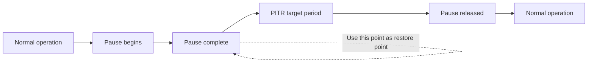
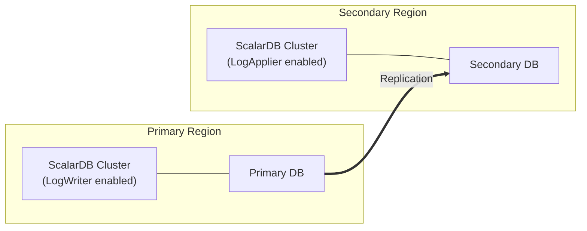

# Disaster Recovery and High Availability Investigation

## 1. ScalarDB Cluster High Availability Architecture

### 1.1 Cluster Membership and Auto-Discovery

ScalarDB Cluster is a middleware layer consisting of multiple cluster nodes, each equipped with ScalarDB functionality and capable of independently executing transactions. **Consistent hashing** is used for request routing within the cluster, forwarding requests to the appropriate nodes.

**Membership Management:**

Currently, ScalarDB Cluster membership management is performed through the **Kubernetes API**. This is the only supported membership type.

```properties
# Membership configuration
scalar.db.cluster.membership.type=KUBERNETES
scalar.db.cluster.membership.kubernetes.endpoint.namespace_name=default
scalar.db.cluster.membership.kubernetes.endpoint.name=<endpoint-name>
```

- When nodes join or leave the cluster, membership information is automatically updated
- Monitoring of Service Endpoints through the Kubernetes API enables real-time detection of Pod additions and removals
- In `direct-kubernetes` mode, the client SDK directly references the Kubernetes API to retrieve the node list

**Client Connection Modes:**

| Mode | Description | Use Case |
|--------|------|------|
| `indirect` | Via load balancer (`indirect:<LB_IP>`) | Access from outside Kubernetes |
| `direct-kubernetes` | Direct Kubernetes API reference (`direct-kubernetes:<NS>/<EP>`) | Applications within the same cluster |

Reference: [ScalarDB Cluster Configurations](https://scalardb.scalar-labs.com/docs/latest/scalardb-cluster/scalardb-cluster-configurations/)

### 1.2 Automatic Failover on Node Failure

ScalarDB Cluster failover is achieved through a combination of Kubernetes mechanisms and ScalarDB-specific features.

**Kubernetes-Level Failover:**
- The Deployment controller monitors Pod health and automatically restarts failed Pods
- Health checks via Readiness Probe / Liveness Probe
- ReplicaSet maintains the specified number of replicas

**ScalarDB Cluster-Level Failover:**
- If a node receiving a request is not appropriate for processing, it routes to the appropriate node within the cluster
- Recalculation of the consistent hash ring automatically redistributes the failed node's range to other nodes
- The client SDK detects updates to membership information and sends requests to available nodes

**gRPC Connection Management (ScalarDB 3.17 and later):**

```properties
# gRPC connection refresh settings
scalar.db.cluster.node.grpc.max_connection_age_millis=<milliseconds>
scalar.db.cluster.node.grpc.max_connection_age_grace_millis=<milliseconds>
```

This allows periodic refresh of long-lived gRPC connections, enabling smooth connection switching during rolling updates and node failures.

### 1.3 Rolling Update Strategy

ScalarDB Cluster is deployed as a Kubernetes Deployment, enabling zero-downtime upgrades through rolling updates.

**Update Strategy in Helm Chart:**

```yaml
scalardbCluster:
  # Default rolling update settings
  strategy:
    type: RollingUpdate
    rollingUpdate:
      maxSurge: 25%        # Additional Pods that can be created during update
      maxUnavailable: 25%   # Pods that can be unavailable during update
```

**Graceful Shutdown:**

```properties
# Node decommissioning duration (default: 30 seconds)
scalar.db.cluster.node.decommissioning_duration_secs=30
```

A node entering decommissioning state stops accepting new requests while waiting for in-progress requests to complete. This prevents request loss during rolling updates.

**Upgrade Procedure:**

```bash
# Rolling update via Helm Chart
helm upgrade <RELEASE_NAME> scalar-labs/scalardb-cluster \
  -n <NAMESPACE> \
  -f /<PATH_TO_CUSTOM_VALUES_FILE> \
  --version <NEW_CHART_VERSION>
```

**Notes:**
- ScalarDB does not support downgrade. Only upgrades are possible
- Backward compatibility is not guaranteed for major version upgrades. Schema updates or API changes may be required
- Before upgrading, check the ScalarDB Cluster Compatibility Matrix to verify compatibility with the client SDK

Reference: [How to Upgrade ScalarDB](https://scalardb.scalar-labs.com/docs/3.13/scalar-kubernetes/HowToUpgradeScalarDB/), [Configure a custom values file for ScalarDB Cluster](https://scalardb.scalar-labs.com/docs/latest/helm-charts/configure-custom-values-scalardb-cluster/)

### 1.4 Scaling (Horizontal Scale)

**Manual Scaling:**

```yaml
scalardbCluster:
  replicaCount: 5  # Increase Pod count
```

```bash
# Change replica count
helm upgrade <RELEASE_NAME> scalar-labs/scalardb-cluster \
  -n <NAMESPACE> \
  -f /<PATH_TO_UPDATED_VALUES_FILE> \
  --version <CHART_VERSION>
```

**Horizontal Pod Autoscaler (HPA) Integration:**

ScalarDB Cluster can be combined with HPA. When using HPA, also configure the Kubernetes Cluster Autoscaler to enable automatic adjustment of worker node count.

```yaml
apiVersion: autoscaling/v2
kind: HorizontalPodAutoscaler
metadata:
  name: scalardb-cluster-hpa
spec:
  scaleTargetRef:
    apiVersion: apps/v1
    kind: Deployment
    name: <RELEASE_NAME>-scalardb-cluster
  minReplicas: 3
  maxReplicas: 10
  metrics:
    - type: Resource
      resource:
        name: cpu
        target:
          type: Utilization
          averageUtilization: 70
```

**Scaling Considerations:**
- With commercial licenses, each Pod's resources are limited to **2 vCPU / 4 GB memory**
- A minimum of 3 Pods is recommended for production environments
- Recalculation of the consistent hash ring automatically redistributes traffic

Reference: [Production checklist for ScalarDB Cluster](https://scalardb.scalar-labs.com/docs/latest/scalar-kubernetes/ProductionChecklistForScalarDBCluster/), [Guidelines for creating an EKS cluster for ScalarDB Cluster](https://scalardb.scalar-labs.com/docs/latest/scalar-kubernetes/CreateEKSClusterForScalarDBCluster/)

---

## 2. Backup and Restore

### 2.1 Official ScalarDB Backup/Restore Procedures

There are two approaches for ScalarDB backup and restore, depending on the backend database configuration.

#### Approach 1: Backup Without Explicit Pause (When Using a Single RDB)

**Applicable Conditions:**
- When using a single relational database
- When not using Multi-storage Transactions or Two-phase Commit Transactions

**Characteristics:**
- Utilizes the database-specific transactionally consistent backup feature
- No ScalarDB pause required
- Enabling managed database automatic backup is recommended

**Per-Database Procedures:**

| Database | Backup Method |
|-------------|-----------------|
| MySQL / Amazon RDS | `mysqldump --single-transaction` |
| PostgreSQL | `pg_dump` command |
| SQLite | `.backup` command (combined with `.timeout` setting) |
| YugabyteDB Managed | Automatic backup based on cluster policy |
| Db2 | `backup` command |

#### Approach 2: Backup With Explicit Pause (When Using NoSQL / Multi-DB)

**Applicable Conditions:**
- When using NoSQL databases (DynamoDB, Cassandra, Cosmos DB)
- When using multiple databases (Multi-storage / 2PC)

**Basic Procedure:**

```
1. Record Pod status with kubectl get pod (Pod count, names, status, restart count)
2. Pause ScalarDB Cluster Pods using scalar-admin
3. Record the pause completion time (used as the PITR restore point)
4. Wait approximately 10 seconds (to account for clock synchronization time differences)
5. Take database backup (automatic if automatic backup/PITR is enabled)
6. Unpause ScalarDB Cluster Pods using scalar-admin
7. Record the unpause time
8. Verify Pod status with kubectl get pod and confirm it matches pre-pause state
```

**Important:** If Pod count, names, status, or restart count differ between before and after the pause, the backup must be redone. Pods added or restarted during the pause are not paused, which can cause data inconsistency.

Reference: [How to Back Up and Restore Databases Used Through ScalarDB](https://scalardb.scalar-labs.com/docs/latest/backup-restore/), [Back up a NoSQL database in a Kubernetes environment](https://scalardb.scalar-labs.com/docs/latest/scalar-kubernetes/BackupNoSQL/)

### 2.2 Transactionally Consistent Backup Methods

ScalarDB requires backups that are "**transactionally consistent or auto-recoverable**" for all managed tables (including the Coordinator table).

**Consistency Guarantee Mechanism:**

1. **Pause via Scalar Admin**: All in-progress transactions are completed before entering the paused state. This ensures no in-flight transactions exist at the backup point
2. **Combination with PITR**: Restoring to a specific point during the pause ensures a transactionally consistent state
3. **NTP Synchronization**: NTP synchronization is mandatory to minimize clock drift between clients and database servers. The pause duration should be at least 5 seconds, with the midpoint used as the restore point

**Using Scalar Admin for Kubernetes:**

```bash
# Pause command in Kubernetes environment
kubectl run scalar-admin-pause \
  --image=ghcr.io/scalar-labs/scalar-admin:<TAG> \
  --restart=Never -it -- \
  -c pause \
  -s _scalardb._tcp.<HELM_RELEASE>-headless.<NAMESPACE>.svc.cluster.local
```

**Scalar Admin for Kubernetes CLI:**

```bash
# Recommended: Use scalar-admin-for-kubernetes dedicated to Kubernetes
scalar-admin-for-kubernetes \
  -r <HELM_RELEASE_NAME> \
  -n <NAMESPACE> \
  -d 5000           # Pause duration (milliseconds, default 5000)
  -w 30000          # Maximum wait time for request draining (milliseconds)
  -z Asia/Tokyo     # Timezone
```

**When TLS is enabled:**

```bash
scalar-admin-for-kubernetes \
  -r <HELM_RELEASE_NAME> \
  -n <NAMESPACE> \
  --tls \
  --ca-root-cert-path /path/to/ca-cert.pem
```

Reference: [Scalar Admin for Kubernetes](https://github.com/scalar-labs/scalar-admin-for-kubernetes), [Scalar Admin](https://github.com/scalar-labs/scalar-admin)

### 2.3 Backup Strategies by Backend DB

#### PostgreSQL / MySQL (Managed RDB)

```
Strategy: Enable managed DB automatic backup + PITR
Pause: Not required for single-DB usage
Procedure: Depends on cloud provider's automatic backup feature
```

**AWS RDS / Aurora:**
- Enable automatic backup (default 7-day retention period)
- PITR is automatically supported
- For Aurora, continuous backup is enabled by default

**Azure Database for PostgreSQL/MySQL:**
- Backup automatically enabled with Flexible Server
- PITR supported

#### Amazon DynamoDB

```
Strategy: Always enable PITR (Point-in-Time Recovery)
Pause: Required (pause via scalar-admin)
```

**Restore Procedure:**
1. Restore each table to an alternate table name using PITR
2. Delete the original table
3. Rename the alternate table to the original table name
4. Repeat for all tables

#### Apache Cassandra

```
Strategy: Cluster-wide snapshot (taken during pause)
Pause: Required
```

**Backup Procedure:**
1. Pause ScalarDB Cluster
2. Execute `nodetool snapshot` on all nodes
3. Copy snapshot files to a safe location

**Restore Procedure:**
1. Stop the Cassandra cluster
2. Clean `data/`, `commitlog/`, `hints/` directories
3. Restore snapshots to each node
4. Restart the Cassandra cluster

#### Azure Cosmos DB for NoSQL

```
Strategy: Enable Continuous backup mode
Pause: Required
```

**Restore Procedure:**
1. Execute restore from Azure Portal
2. After restore, reconfigure consistency level to `STRONG`
3. Reinstall stored procedures with Schema Loader's `--repair-all` option

```bash
# Reinstall stored procedures
java -jar scalardb-schema-loader-<VERSION>.jar \
  --config <CONFIG_FILE> \
  --schema-file <SCHEMA_FILE> \
  --repair-all
```

#### Object Storage (S3, Blob Storage, Cloud Storage)

```
Strategy: Versioning + Cross-region replication
Pause: Required
```

After restore, update the `scalar.db.contact_points` configuration to the restored bucket/container.

Reference: [How to Back Up and Restore Databases Used Through ScalarDB](https://scalardb.scalar-labs.com/docs/latest/backup-restore/), [Back up an RDB in a Kubernetes environment](https://scalardb.scalar-labs.com/docs/latest/scalar-kubernetes/BackupRDB/)

### 2.4 Point-in-Time Recovery (PITR)

PITR is a critical feature for establishing a transactionally consistent restore point when combined with ScalarDB's pause.

**How PITR Works:**



**Clock Drift Countermeasures:**
- Ensure a minimum pause duration of 5 seconds
- Use the midpoint of the pause duration as the restore point
- NTP synchronization is mandatory on all servers

**PITR Support by Database:**

| Database | PITR Support | Notes |
|-------------|-------------|------|
| Amazon RDS / Aurora | Yes | Available with automatic backup enabled |
| Azure Database for PostgreSQL/MySQL | Yes | Available with Flexible Server |
| Amazon DynamoDB | Yes | PITR must be enabled per table |
| Azure Cosmos DB | Yes | Available with continuous backup mode |
| Apache Cassandra | No (native) | Alternative: snapshot + incremental backup |
| Google AlloyDB | Yes | Available with continuous backup |

### 2.5 Backup Automation

#### Schedule Management with Scalar Manager

Scalar Manager (Enterprise option) provides GUI-based management of pause jobs for backup.

**Key Features:**
- Scheduled execution of pause jobs
- Viewing and managing scheduled jobs
- Monitoring of pause status
- Visualization of cluster health, Pod logs, and hardware utilization

Reference: [Scalar Manager Overview](https://scalardb.scalar-labs.com/docs/latest/scalar-manager/overview/)

#### Automation with Kubernetes CronJob

When Scalar Manager is not available, Kubernetes CronJob can automate backups in conjunction with pause.

```yaml
apiVersion: batch/v1
kind: CronJob
metadata:
  name: scalardb-backup-pause
  namespace: scalardb
spec:
  schedule: "0 2 * * *"  # Daily at 2:00 AM
  jobTemplate:
    spec:
      template:
        spec:
          serviceAccountName: scalar-admin-sa
          containers:
            - name: scalar-admin
              image: ghcr.io/scalar-labs/scalar-admin-for-kubernetes:<TAG>
              args:
                - "-r"
                - "<HELM_RELEASE_NAME>"
                - "-n"
                - "scalardb"
                - "-d"
                - "10000"
                - "-z"
                - "Asia/Tokyo"
          restartPolicy: OnFailure
```

**Note:** If managed database automatic backup and PITR are enabled, simply recording the pause time effectively provides automatic backup. A separate mechanism to persist the pause timestamp (e.g., ConfigMap, writing to external storage) is needed.

---

## 3. Failure Patterns and Recovery Procedures

### 3.1 ScalarDB Cluster Node Failure

#### Single Node Failure

**Symptoms:** One ScalarDB Cluster Pod crashes or becomes unresponsive

**Automatic Recovery:**
1. Kubernetes Liveness Probe detects the anomaly
2. kubelet restarts the Pod
3. Membership information is automatically updated and the consistent hash ring is recalculated
4. Clients obtain new membership information and send requests to available nodes

**Impact Scope:**
- Transactions being processed on the failed node may fail
- Clients can recover through retry (if operations are idempotent)
- In configurations with 3 or more nodes, remaining nodes take over requests

**Manual Verification:**

```bash
# Check Pod status
kubectl get pods -n <NAMESPACE> -l app.kubernetes.io/name=scalardb-cluster

# Check Pod logs
kubectl logs <POD_NAME> -n <NAMESPACE>

# Check Pod detailed events
kubectl describe pod <POD_NAME> -n <NAMESPACE>
```

#### All-Node Failure

**Symptoms:** All ScalarDB Cluster Pods are simultaneously down

**Recovery Procedure:**
1. Verify the health of backend databases
2. Check the status of Kubernetes worker nodes
3. Verify network connectivity
4. Wait for ScalarDB Cluster Pods to restart automatically
5. Redeploy the Helm Chart if they do not restart

```bash
# Force restart all Pods
kubectl rollout restart deployment/<RELEASE_NAME>-scalardb-cluster -n <NAMESPACE>

# Redeploy via Helm
helm upgrade <RELEASE_NAME> scalar-labs/scalardb-cluster \
  -n <NAMESPACE> \
  -f /<PATH_TO_CUSTOM_VALUES_FILE> \
  --version <CHART_VERSION>
```

### 3.2 Backend DB Failure

#### Single DB Instance Failure

**For Managed DBs (RDS / Aurora / Cosmos DB):**
- Automatic recovery via cloud provider's failover mechanism
- Aurora: Automatic failover (typically within 30 seconds)
- RDS Multi-AZ: Automatic failover (within minutes)
- Cosmos DB: Automatic failover to multi-region replicas

**ScalarDB-Side Impact and Response:**
- ScalarDB transactions temporarily fail during DB failover
- ScalarDB returns transaction errors to clients
- Implement retry logic on the client side

```java
// Retry pattern example
int maxRetries = 3;
for (int i = 0; i < maxRetries; i++) {
    DistributedTransaction tx = transactionManager.start();
    try {
        // Transaction processing
        tx.commit();
        break;  // Success
    } catch (UnknownTransactionStatusException e) {
        // Transaction status unknown - need to check status before retrying
        // Need to check the Coordinator table status
    } catch (TransactionException e) {
        tx.abort();
        if (i == maxRetries - 1) throw e;
        // Wait before retry
        Thread.sleep(1000 * (i + 1));
    }
}
```

#### DB Data Loss Recovery

1. Restore to a consistent point using PITR
2. Stop ScalarDB Cluster
3. Restore the DB
4. Restart ScalarDB Cluster
5. In-flight transactions are automatically resolved via Lazy Recovery

### 3.3 Network Partition (Split-Brain)

#### Network Partition Between ScalarDB Cluster Nodes

**Symptoms:** Communication between cluster nodes is disrupted and nodes cannot recognize each other

**Impact:**
- Since membership management is through the Kubernetes API, nodes that can access the Kubernetes control plane continue to operate normally
- Nodes disconnected from the Kubernetes control plane cannot update membership information and may become isolated

**Response:**
- ScalarDB does not have a built-in split-brain detection mechanism
- Kubernetes network policies and node status management automatically block traffic to isolated nodes
- Consistency guarantees on the backend DB side (e.g., Cassandra quorum, RDB transaction isolation) prevent data inconsistency

#### Network Partition Between ScalarDB Cluster and Backend DB

**Impact:**
- Transaction execution fails
- Records in PREPARED state from the Consensus Commit protocol may remain

**Recovery:**
- After network recovery, the Lazy Recovery mechanism automatically commits or rolls back in-flight records

### 3.4 Failure Recovery in the Consensus Commit Protocol

The Consensus Commit protocol achieves failure recovery through the following mechanisms.

#### Role of the Coordinator Table

The Coordinator table functions as the **Single Source of Truth** for managing transaction state. The managed states are as follows:

| State | Description |
|------|------|
| COMMITTED | Transaction has been committed |
| ABORTED | Transaction has been aborted |
| (none) | Crashed before Prepare |

#### Four Sub-Phases of the Atomic Commitment Protocol

```
1. Prepare-records phase: Assigns PREPARED status and transaction logs to records. Executes write validation
2. Validate-records phase: Read validation (only for SERIALIZABLE isolation level)
3. Commit-state phase: Writes the COMMITTED state of the transaction to the Coordinator table
4. Commit-records phase: Updates each record's status to COMMITTED
```

#### Coordinator Failure

ScalarDB's Consensus Commit is **client-coordinated (masterless)**, so there is no single point of failure from a central coordinator as in traditional 2PC. Each client (ScalarDB Cluster node) acts as a coordinator, and recovery when a client crashes during each phase works as follows:

**Case 1: Crash Before Prepare Phase**
- The transaction exists only in memory and is simply discarded
- No impact on the database

**Case 2: Crash After Prepare Phase, Before Commit-State Phase**
- The transaction state is not recorded in the Coordinator table
- When the next transaction reads a record in PREPARED state, it detects the absence of state in the Coordinator table
- Writes ABORTED state to the Coordinator table and rolls back the record

**Case 3: Crash After Commit-State Phase**
- COMMITTED state is already recorded in the Coordinator table
- When the next transaction reads a record in PREPARED state, it confirms COMMITTED in the Coordinator table
- Rolls the record forward to COMMITTED state

#### Participant Failure

In ScalarDB, transaction metadata (distributed WAL) is embedded in the records themselves, so the same Lazy Recovery works during participant failures.

**Coordinator Table High Availability:**

Placing the Coordinator table in a database with replication capabilities achieves fault tolerance close to Paxos Commit.

```
Example: Managing the Coordinator table in Cassandra with replication factor 3
→ Can tolerate failure of 1 replica
```

Reference: [Consensus Commit Protocol](https://scalardb.scalar-labs.com/docs/latest/consensus-commit/), [ScalarDB: Universal Transaction Manager for Polystores (VLDB 2023)](https://dl.acm.org/doi/10.14778/3611540.3611563)

### Coordinator Table Availability Design

The Coordinator table manages the state of all transactions, and if it becomes unavailable, **all write transactions stop**.

#### Recommended Configurations

| Configuration | Coordinator Table Placement | Availability |
|------|----------------------|--------|
| **Minimum configuration** | Same instance as application DB | Depends on DB availability |
| **Recommended configuration** | Dedicated HA-configured DB (Aurora Multi-AZ, etc.) | DB-independent failover |
| **Maximum availability** | Cassandra (RF=3) or DynamoDB | High resilience to node failures |

#### Coordinator Table Size Management

- Committed Tx state records accumulate continuously (automatic purge is not currently provided)
- Estimate: 1 million Tx/day ≈ 100 MB/day ≈ 3 GB/month
- **Countermeasures**: Implement periodic archive jobs, set up size monitoring alerts

### 3.5 In-Flight Transaction Recovery (Lazy Recovery)

ScalarDB's Lazy Recovery is a mechanism that **lazily recovers records left in incomplete state at the time of the next access**.

**Operating Principle:**

```
When transaction T2 reads record R in PREPARED state:

1. Obtain the ID of transaction T1 that updated R
2. Check the state of T1 in the Coordinator table
3. Process according to state:
   - T1 is COMMITTED → Roll forward R (update to COMMITTED state)
   - T1 is ABORTED → Roll back R (restore to before-image)
   - T1 state is absent + within expiration → Spin wait (wait for T1 commit)
   - T1 state is absent + expired → Mark T1 as ABORTED and roll back R
```

**Transaction Expiration:**
- By default, transactions expire after **15 seconds**
- When an expired PREPARED record is discovered, ScalarDB writes ABORTED state to the Coordinator table (with retry)

**Spin Wait Optimization:**
- When T2 waits for dependent transaction T1 to complete, it waits until the Coordinator table state becomes COMMITTED
- Rather than waiting for all of T1's records to become COMMITTED, it only checks the Coordinator table state
- This minimizes performance degradation from roll-forward delays

Reference: [Consensus Commit Protocol](https://scalardb.scalar-labs.com/docs/latest/consensus-commit/), [Scalar DB: Universal transaction manager (Medium)](https://medium.com/scalar-engineering/scalar-db-universal-transaction-manager-715379e07f34)

### Additional Failure Patterns

| Failure Pattern | Impact | Estimated RTO | Response |
|-------------|------|---------|------|
| License key expiration | ScalarDB Cluster cannot start | Immediate after key update | Alert 30 days before expiration. Monitor license key expiration |
| TLS certificate expiration | gRPC connections unavailable, all Tx stopped | Immediate after certificate update | Automatic renewal via cert-manager. Alert 30 days before expiration |
| K8s control plane failure | Membership updates stop (existing routing is maintained) | Until K8s recovery | Depends on EKS/AKS/GKE managed SLA. Manual scaling not possible during membership freeze |
| Envoy proxy failure (indirect) | Traffic through affected Pod is blocked | Until Pod restart | Envoy sidecar health checks, load distribution across multiple Pods |
| Disk exhaustion | DB writes impossible, all Tx fail | After disk expansion | Alert at 80% disk usage. Configure auto-expansion |
| OOMKill | Affected Pod stops, Tx failure | Pod restart (seconds) | Monitor memory usage. Set JVM heap to 70% or less of Pod memory |
| Configuration error deployment | All Tx may fail | Until rollback complete | Pre-validate with canary release. Since downgrade is not possible, respond by redeploying the old image |
| Coordinator table corruption | All Tx stop, consistency loss | Recovery from backup | Regular backup of Coordinator table. Strictly prohibit direct SQL operations |

---

## 4. RPO/RTO Design

### 4.1 RPO (Recovery Point Objective) Determining Factors

RPO defines "to what point in time data can be recovered after a failure." The main determining factors for RPO in a ScalarDB environment are as follows:

| Factor | Impact | Recommended Setting |
|------|------|----------|
| Backend DB backup frequency | Longer backup intervals increase RPO | Enable automatic backup + PITR to minimize RPO |
| PITR enabled/disabled | If PITR is enabled, recovery to any point is possible | Enable PITR on all backend DBs |
| Pause frequency | When using NoSQL, pause intervals affect RPO | Perform regular pauses according to business requirements |
| Replication lag | Cross-region replication lag affects RPO | Synchronous replication or lag monitoring |
| Coordinator table replication | Coordinator table availability affects RPO | Replication factor 3 or higher |

**RPO Estimates by Database:**

| Database | RPO with PITR Enabled | RPO without PITR |
|-------------|-------------------|-------------------|
| Amazon RDS / Aurora | Seconds (continuous backup) | Up to 24 hours (daily backup) |
| Amazon DynamoDB | Seconds (when PITR enabled) | Up to last backup point |
| Azure Cosmos DB | Seconds (continuous backup) | Up to last backup point |
| Apache Cassandra | Up to snapshot point during pause | Up to snapshot point |
| PostgreSQL / MySQL (self-hosted) | Depends on WAL / binlog archive frequency | Up to last backup point |

### 4.2 RTO (Recovery Time Objective) Determining Factors

RTO defines "the target time from failure occurrence to service recovery."

| Factor | Impact | Recommended Countermeasure |
|------|------|----------|
| ScalarDB Cluster restart time | Pod scheduling + startup + membership sync | Absorb single failures automatically with minimum 3-Pod configuration |
| Backend DB failover time | Time until DB failover completes | Multi-AZ configuration, enable automatic failover |
| DB restore time | Restore time proportional to data size | Smaller snapshot units, high-speed restore |
| Network recovery time | Detection and recovery of network failures | Redundancy, BGP failover |
| Lazy Recovery time | Time to resolve in-flight transactions | Typically completes automatically within seconds |

### 4.3 SLA Design Patterns

#### Pattern 1: High Availability (HA) - 99.95% or Higher

```
Configuration:
- ScalarDB Cluster: 3+ nodes, multi-AZ placement
- Backend DB: Managed DB Multi-AZ configuration
- Automatic failover enabled

RPO: Seconds (PITR enabled)
RTO: Within minutes (automatic failover)
```

#### Pattern 2: Disaster Recovery (DR) - 99.99% or Higher

```
Configuration:
- ScalarDB Cluster: Multi-region configuration
- Backend DB: Cross-region replication
- Automatic switchover to DR site

RPO: Seconds to minutes (depends on replication lag)
RTO: Minutes to hours (depends on DR site switchover time)
```

#### Pattern 3: Cost Optimization - 99.9%

```
Configuration:
- ScalarDB Cluster: 3 nodes, single AZ
- Backend DB: Single instance + automatic backup
- Manual failover

RPO: Minutes (depends on automatic backup frequency)
RTO: Hours (manual restore + reconfiguration)
```

#### Notes on SLA Achievement Realism

- **99.95%**: RDS Multi-AZ failover (several minutes) alone consumes most of the 21.9-minute monthly allowed downtime. Realistic estimates considering backend DB failover frequency are necessary
- **99.99%**: Since Remote Replication is asynchronous and Active-Active is not supported, the region switchover RTO of several minutes to tens of minutes may make the 4.3-minute monthly allowed downtime difficult to achieve
- **Composite SLA calculation**: Calculate the composite SLA of ScalarDB Cluster x Backend DB(s) x Kubernetes. Example: Aurora (99.99%) x ScalarDB Cluster (99.9%) = 99.89%

### 4.4 RPO/RTO Estimates by Failure Scenario

| Failure Scenario | RPO | RTO | Notes |
|-------------|-----|-----|------|
| ScalarDB single Pod failure | 0 (no data loss) | Seconds to tens of seconds | Automatic recovery by Kubernetes |
| ScalarDB all-Pod failure | 0 (no data loss) | Minutes | Pod rescheduling |
| Backend DB failover (managed) | 0 to seconds | 30 seconds to minutes | Automatic failover |
| Backend DB data loss | PITR enabled: seconds | Tens of minutes to hours | PITR restore |
| AZ failure | 0 to seconds | Minutes | With multi-AZ configuration |
| Region failure | Seconds to minutes | Minutes to hours | With cross-region replication |
| Network partition | 0 (no data loss) | Until network recovery | Automatic resolution via Lazy Recovery |

---

## 5. Multi-Region / DR Strategy

### 5.1 Active-Passive Configuration

Active-Passive configuration processes transactions only in the primary region, with the secondary region on standby.

**ScalarDB's Remote Replication Feature:**

ScalarDB 3.17 provides remote replication functionality. This is asynchronous replication using LogWriter (primary side) and LogApplier (backup side).

**Primary Site (LogWriter) Configuration:**

```properties
# Enable LogWriter
scalar.db.replication.log_writer.enabled=true

# Replication partition count
scalar.db.replication.partition_count=256

# Replication namespace
scalar.db.replication.repl_db.namespace=replication

# Compression settings
scalar.db.replication.log_writer.compression_type=GZIP

# Batch settings
# Batch commit at max 100ms or 32 transactions
# Batch processing with max 4096 threads
```

**Backup Site (LogApplier) Configuration:**

```properties
# Enable LogApplier
scalar.db.replication.log_applier.enabled=true

# Replication partition count (must match primary)
scalar.db.replication.partition_count=256

# Replication namespace (must match primary)
scalar.db.replication.repl_db.namespace=replication

# Transaction expiration (default: 30 seconds)
scalar.db.replication.log_applier.transaction_expiration_time_millis=30000

# Scanner thread count (default: 16)
scalar.db.replication.log_applier.scanner_thread_count=16

# Transaction handler thread count (default: 128)
scalar.db.replication.log_applier.transaction_handler_thread_count=128

# Coordinator state cache (default: 30 seconds)
scalar.db.replication.log_applier.coordinator_state_cache_expiration_time_millis=30000

# Deduplication window (default: 10 seconds)
```

**Architecture Diagram:**



**Limitations:**
- Replication is asynchronous, so data delay occurs
- Replication cannot be used when one-phase commit optimization is enabled
- Changing `partition_count` requires a cluster restart

Reference: [ScalarDB Cluster Configurations](https://scalardb.scalar-labs.com/docs/latest/scalardb-cluster/scalardb-cluster-configurations/), [ScalarDB 3.17 Release Notes](https://scalardb.scalar-labs.com/docs/latest/releases/release-notes/)

### 5.2 Active-Active Configuration (Including Limitations)

Active-Active configuration for ScalarDB is not officially supported at this time. The following limitations exist.

**Technical Limitations:**
- The Consensus Commit protocol uses the Coordinator table as a single source of truth, making independent transaction coordination across multiple regions difficult
- Simultaneous writes from different regions make conflict detection and resolution complex
- LogWriter/LogApplier is unidirectional replication, and bidirectional replication is not supported

**Alternative Approaches:**
- Leverage the backend DB's native multi-region capabilities (e.g., DynamoDB Global Tables, Cosmos DB multi-region writes)
- However, careful verification of consistency with ScalarDB's transaction consistency guarantees is required

### 5.3 Cross-Region Replication

Leverage the backend DB's native cross-region replication capabilities.

| Database | Cross-Region Feature | Notes |
|-------------|---------------------|------|
| Amazon Aurora | Global Database | Reads available via reader endpoint. Failover can be manual or automatic |
| Amazon DynamoDB | Global Tables | Multi-region writes possible. Caution needed when used with ScalarDB |
| Azure Cosmos DB | Multi-region replication | Writes possible in multiple regions |
| Apache Cassandra | Multi-datacenter replication | Configured with NetworkTopologyStrategy |
| PostgreSQL | Streaming replication | Read-only replicas |

**Choosing Between ScalarDB Remote Replication and DB-Native Replication:**

| Item | ScalarDB Remote Replication | DB-Native Replication |
|------|---------------------------|---------------------------|
| Replication target | ScalarDB transaction level | DB internal change level |
| Consistency | Guarantees transaction consistency | Depends on DB-specific guarantees |
| Supported DBs | All DBs supported by ScalarDB | Depends on each DB's features |
| Configuration ease | Completed within ScalarDB configuration | Individual configuration per DB |
| Performance impact | LogWriter overhead | DB-specific overhead |

### 5.4 Responding to Data Center Failures

**Failover Procedure (Active-Passive Configuration):**

```
1. Detect primary region failure
   - Monitoring alerts, health check failures, etc.

2. Activate the secondary region's ScalarDB Cluster
   - Disable LogApplier
   - Enable LogWriter (as the new primary)

3. DNS / Load balancer switchover
   - Point application endpoints to the secondary region

4. Backend DB failover
   - Aurora Global Database: Promote secondary region
   - DynamoDB Global Tables: Change write region
   - Cosmos DB: Promote failover region

5. Update application connection settings
   - Change scalar.db.contact_points to the secondary region

6. Verify service health
```

**Failback Procedure:**

```
1. Confirm recovery of the original primary region
2. Configure replication from secondary to primary
3. Wait for data synchronization to complete
4. Perform planned failover back to the original primary
5. Restore original replication direction
```

---

## 6. HA Configuration on Kubernetes

### 6.1 Pod Disruption Budget (PDB)

PDB guarantees that a certain number of Pods are always running during planned disruptions (node maintenance, cluster upgrades, etc.).

**PDB Configuration for ScalarDB Cluster:**

```yaml
apiVersion: policy/v1
kind: PodDisruptionBudget
metadata:
  name: scalardb-cluster-pdb
  namespace: scalardb
spec:
  maxUnavailable: 1  # Maximum number of Pods that can be unavailable simultaneously
  selector:
    matchLabels:
      app.kubernetes.io/name: scalardb-cluster
      app.kubernetes.io/instance: <RELEASE_NAME>
```

**Recommended Settings:**
- 3-Pod configuration: `maxUnavailable: 1` (at least 2 Pods always running)
- 5-Pod configuration: `maxUnavailable: 2` (at least 3 Pods always running)

**Note:** The Helm Chart's default values.yaml does not include PDB, so it must be created separately.

### 6.2 Pod Anti-Affinity

Pod Anti-Affinity is a configuration to distribute ScalarDB Cluster Pods across different worker nodes. This prevents service interruption from single-node failures.

**Recommended Settings (Helm Chart values.yaml):**

```yaml
scalardbCluster:
  affinity:
    podAntiAffinity:
      # Soft constraint: Place on different nodes when possible
      preferredDuringSchedulingIgnoredDuringExecution:
        - podAffinityTerm:
            labelSelector:
              matchExpressions:
                - key: app.kubernetes.io/name
                  operator: In
                  values:
                    - scalardb-cluster
                - key: app.kubernetes.io/app
                  operator: In
                  values:
                    - scalardb-cluster
            topologyKey: kubernetes.io/hostname
          weight: 50
```

**When Hard Constraints Are Needed:**

```yaml
scalardbCluster:
  affinity:
    podAntiAffinity:
      # Hard constraint: Must be placed on different nodes (unschedulable if nodes insufficient)
      requiredDuringSchedulingIgnoredDuringExecution:
        - labelSelector:
            matchExpressions:
              - key: app.kubernetes.io/name
                operator: In
                values:
                  - scalardb-cluster
          topologyKey: kubernetes.io/hostname
```

Reference: [Configure a custom values file for ScalarDB Cluster](https://scalardb.scalar-labs.com/docs/latest/helm-charts/configure-custom-values-scalardb-cluster/)

### 6.3 Node Affinity / Topology Spread Constraints

#### Node Affinity (Placement on Dedicated Nodes)

Combined with Taint/Toleration to place ScalarDB Cluster on dedicated worker nodes.

```yaml
scalardbCluster:
  # Toleration: Tolerate dedicated node Taint
  tolerations:
    - effect: NoSchedule
      key: scalar-labs.com/dedicated-node
      operator: Equal
      value: scalardb-cluster

  # Node Affinity: Place on nodes with dedicated node label
  affinity:
    nodeAffinity:
      requiredDuringSchedulingIgnoredDuringExecution:
        nodeSelectorTerms:
          - matchExpressions:
              - key: scalar-labs.com/dedicated-node
                operator: In
                values:
                  - scalardb-cluster
```

**Worker Node Taint Configuration:**

```bash
# Set Taint on dedicated nodes
kubectl taint nodes <NODE_NAME> scalar-labs.com/dedicated-node=scalardb-cluster:NoSchedule

# Add label to nodes
kubectl label nodes <NODE_NAME> scalar-labs.com/dedicated-node=scalardb-cluster
```

#### Topology Spread Constraints (AZ Distribution)

```yaml
scalardbCluster:
  topologySpreadConstraints:
    - maxSkew: 1
      topologyKey: topology.kubernetes.io/zone
      whenUnsatisfiable: DoNotSchedule
      labelSelector:
        matchLabels:
          app.kubernetes.io/name: scalardb-cluster
    - maxSkew: 1
      topologyKey: kubernetes.io/hostname
      whenUnsatisfiable: ScheduleAnyway
      labelSelector:
        matchLabels:
          app.kubernetes.io/name: scalardb-cluster
```

This configuration ensures:
- Pod count skew across AZs is constrained to a maximum of 1 (hard constraint)
- Pod count skew across hosts is also targeted to a maximum of 1 (soft constraint)

### 6.4 StatefulSet vs Deployment

ScalarDB Cluster is deployed as a Kubernetes **Deployment** (not StatefulSet).

| Item | Deployment (ScalarDB) | StatefulSet |
|------|----------------------|-------------|
| Pod identifier | Random | Fixed (ordinal index) |
| Storage | Not required (stateless) | PersistentVolume |
| Scaling | Any order | Ordered |
| Rolling update | Can be parallel | Ordered |
| Use case | ScalarDB Cluster nodes | Backend DB (when self-hosted) |

**Reason:** ScalarDB Cluster nodes are stateless, and all transaction state is maintained in the backend DB's Coordinator table and each record's metadata. Therefore, persistent storage is not required, and Deployment is appropriate.

**However, if persistence of heap dumps or temporary data is needed:**

```yaml
scalardbCluster:
  extraVolumes:
    - name: heap-dump
      emptyDir: {}
  extraVolumeMounts:
    - name: heap-dump
      mountPath: /dump
```

### 6.5 Persistent Volume Management

Since ScalarDB Cluster itself is stateless, Persistent Volumes are generally not required, but they are needed in the following cases.

**When Backend DB Is Self-Hosted (e.g., Cassandra on Kubernetes):**

```yaml
# Cassandra StatefulSet PV configuration example
apiVersion: apps/v1
kind: StatefulSet
metadata:
  name: cassandra
spec:
  volumeClaimTemplates:
    - metadata:
        name: cassandra-data
      spec:
        accessModes: ["ReadWriteOnce"]
        storageClassName: gp3
        resources:
          requests:
            storage: 100Gi
```

**PV Backup Considerations:**
- Use EBS snapshots (AWS) or Managed Disk snapshots (Azure)
- Automate PV backups using tools such as Velero

```bash
# Backup example with Velero
velero backup create scalardb-backup \
  --include-namespaces scalardb \
  --snapshot-volumes \
  --wait
```

Reference: [Production checklist for ScalarDB Cluster](https://scalardb.scalar-labs.com/docs/latest/scalar-kubernetes/ProductionChecklistForScalarDBCluster/), [Guidelines for creating an EKS cluster for ScalarDB Cluster](https://scalardb.scalar-labs.com/docs/latest/scalar-kubernetes/CreateEKSClusterForScalarDBCluster/)

---

## 7. Data Consistency Recovery

### 7.1 Methods for Detecting Inconsistent Data

Data inconsistency in a ScalarDB environment can primarily occur in the following cases.

**Causes of Inconsistency:**
1. Incomplete pause during backup/restore
2. Direct database access bypassing ScalarDB
3. Incomplete recovery from backend DB failure
4. Data mismatch due to replication lag

**Detection Methods:**

#### Metadata-Based Inspection

ScalarDB embeds the following transaction metadata in each record.

| Metadata Column | Description |
|-----------------|------|
| `tx_id` | Transaction ID |
| `tx_version` | Record version number |
| `tx_state` | Record state (COMMITTED, PREPARED, DELETED) |
| `tx_prepared_at` | Prepare execution time |
| `tx_committed_at` | Commit execution time |
| `before_*` | Pre-update values (before-image) |

#### Example Detection Queries

```sql
-- Detect records remaining in PREPARED state (with no corresponding entry in the Coordinator table)
SELECT r.tx_id, r.tx_state, r.tx_prepared_at
FROM <namespace>.<table>__records r
WHERE r.tx_state = 'PREPARED'
  AND r.tx_prepared_at < NOW() - INTERVAL '15 seconds';

-- Check Coordinator table status
SELECT tx_id, tx_state, tx_created_at
FROM coordinator.state
WHERE tx_id = '<TRANSACTION_ID>';
```

**Note:** Direct SQL queries against the database should be performed carefully with understanding of ScalarDB's metadata structure. Operations bypassing ScalarDB may break transaction consistency.

#### Monitoring via Prometheus Metrics

```yaml
# PrometheusRule alert configuration example
scalardbCluster:
  prometheusRule:
    enabled: true
  serviceMonitor:
    enabled: true
```

ScalarDB Cluster provides a metrics endpoint (port 9080) for monitoring the following metrics:

- Transaction success/failure rate
- Commit/rollback counts
- Latency distribution
- Active transaction count

### 7.2 Consistency Checks Using Consensus Commit Metadata

**Consistency Check Procedure:**

1. **Coordinator Table Consistency Verification:**
   - Verify that all records corresponding to COMMITTED transactions are in COMMITTED state
   - Verify that all records corresponding to ABORTED transactions have been rolled back

2. **Detection of Orphaned PREPARED Records:**
   - Detect PREPARED records with no corresponding entry in the Coordinator table
   - These should be automatically resolved by Lazy Recovery, but records that are not accessed may persist

3. **Version Consistency Verification:**
   - Verify that `tx_version` for the same record is sequential
   - Gaps may indicate that intermediate transactions were not processed correctly

**Conceptual Example of Consistency Check Script:**

```bash
#!/bin/bash
# Script to detect expired PREPARED records
# Note: This is a conceptual example and needs to be adjusted for actual metadata structure

EXPIRATION_THRESHOLD="15 seconds"

echo "=== Detection of Orphaned PREPARED Records ==="
# Execute direct queries against the backend DB
# ScalarDB metadata column names depend on the implementation

echo "=== Coordinator Table Status Check ==="
# Check the contents of the coordinator.state table
```

### 7.3 Manual Recovery Procedures

**Case 1: Resolving Orphaned PREPARED Records**

Normally resolved automatically by Lazy Recovery, but records with low access frequency may require manual resolution.

```
1. Identify the tx_id of the orphaned PREPARED record
2. Check the status of the tx_id in the Coordinator table
3. Depending on the status:
   - If COMMITTED: Execute a read on the record through ScalarDB (automatic roll forward)
   - If ABORTED: Execute a read on the record through ScalarDB (automatic rollback)
   - If no status: Write ABORTED to the Coordinator table and roll back the record
```

**Case 2: Metadata Repair After Cosmos DB Restore**

```bash
# Repair with Schema Loader
java -jar scalardb-schema-loader-<VERSION>.jar \
  --config <CONFIG_FILE> \
  --schema-file <SCHEMA_FILE> \
  --repair-all
```

The `--repair-all` option performs:
- Reinstallation of stored procedures
- Repair of metadata tables
- Repair of the Coordinator table

**Case 3: Repairing Data Changes Made Without ScalarDB**

If the database was directly modified without going through ScalarDB, transaction metadata consistency may be broken. In this case, repair proceeds as follows:

```
1. Identify the changed records
2. Repair ScalarDB metadata column values to the correct state
   - Set tx_state to COMMITTED
   - Increment tx_version
   - Set tx_committed_at to the current time
   - Update before-image
3. Add corresponding entries to the Coordinator table if they do not exist
```

**Important Warning:** Data operations bypassing ScalarDB are not officially supported and may break transaction consistency. Repair should be used only as a last resort, and always consult Scalar Labs support.

Reference: [Consensus Commit Protocol](https://scalardb.scalar-labs.com/docs/latest/consensus-commit/)

---

## 8. DR Testing and Operations

### 8.1 Chaos Engineering

Chaos Engineering is a methodology for verifying system resilience by intentionally injecting failures in conditions close to production.

#### Chaos Mesh

Chaos Mesh is a Kubernetes-native Chaos Engineering platform that can verify the following failure scenarios in a ScalarDB environment.

```yaml
# Pod Kill: Random deletion of ScalarDB Cluster Pods
apiVersion: chaos-mesh.org/v1alpha1
kind: PodChaos
metadata:
  name: scalardb-pod-kill
  namespace: chaos-testing
spec:
  action: pod-kill
  mode: one
  selector:
    namespaces:
      - scalardb
    labelSelectors:
      app.kubernetes.io/name: scalardb-cluster
  scheduler:
    cron: "@every 30m"
```

```yaml
# Network Chaos: Network delay between ScalarDB and backend DB
apiVersion: chaos-mesh.org/v1alpha1
kind: NetworkChaos
metadata:
  name: scalardb-network-delay
  namespace: chaos-testing
spec:
  action: delay
  mode: all
  selector:
    namespaces:
      - scalardb
    labelSelectors:
      app.kubernetes.io/name: scalardb-cluster
  delay:
    latency: "500ms"
    jitter: "100ms"
    correlation: "50"
  direction: to
  target:
    selector:
      namespaces:
        - database
    mode: all
  duration: "5m"
```

```yaml
# Network Partition: Network partition between ScalarDB Cluster nodes
apiVersion: chaos-mesh.org/v1alpha1
kind: NetworkChaos
metadata:
  name: scalardb-network-partition
  namespace: chaos-testing
spec:
  action: partition
  mode: one
  selector:
    namespaces:
      - scalardb
    labelSelectors:
      app.kubernetes.io/name: scalardb-cluster
  direction: both
  target:
    selector:
      namespaces:
        - scalardb
      labelSelectors:
        app.kubernetes.io/name: scalardb-cluster
    mode: all
  duration: "2m"
```

#### Litmus

Litmus is a Chaos Engineering framework for Kubernetes environments.

```yaml
# Litmus ChaosEngine: ScalarDB Pod failure experiment
apiVersion: litmuschaos.io/v1alpha1
kind: ChaosEngine
metadata:
  name: scalardb-chaos
  namespace: scalardb
spec:
  appinfo:
    appns: scalardb
    applabel: app.kubernetes.io/name=scalardb-cluster
    appkind: deployment
  engineState: active
  chaosServiceAccount: litmus-admin
  experiments:
    - name: pod-delete
      spec:
        components:
          env:
            - name: TOTAL_CHAOS_DURATION
              value: "60"
            - name: CHAOS_INTERVAL
              value: "10"
            - name: FORCE
              value: "false"
```

#### Recommended Chaos Test Scenarios

| Scenario | Failure Injection Method | Verification Points |
|---------|------------|-------------|
| ScalarDB Pod failure | PodChaos (pod-kill) | Failover time, transaction success rate |
| DB connection delay | NetworkChaos (delay) | Transaction timeout, retry behavior |
| DB connection loss | NetworkChaos (partition) | Transaction failure handling, Lazy Recovery |
| Node failure | NodeChaos (node-drain) | Pod rescheduling, PDB behavior |
| Disk I/O delay | IOChaos (delay) | DB performance impact |
| AZ failure | Combined scenario | Multi-AZ failover |

### 8.2 DR Drill Planning

#### Drill Frequency and Types

| Drill Type | Frequency | Participants | Purpose |
|---------|------|--------|------|
| Tabletop exercise | Quarterly | Dev and ops teams | Confirm DR procedures, identify gaps |
| Functional test | Monthly | Ops team | Verify backup/restore procedures |
| Full-scale DR drill | Semi-annually | All stakeholders | Execute region failover |
| Chaos test | Continuous | Dev and SRE teams | Continuous resilience verification |

#### DR Drill Checklist

```
□ Verify backup health
  □ Confirm automatic backups are running normally
  □ Confirm PITR is enabled
  □ Perform restore test from backup

□ Failover test
  □ Confirm ScalarDB Cluster Pod failure and automatic recovery
  □ Confirm backend DB failover
  □ Confirm client retry logic operates normally

□ Restore test
  □ Perform restore via PITR
  □ Verify data consistency after restore
  □ Confirm ScalarDB transactions execute normally
  □ For Cosmos DB, confirm stored procedure reinstallation via --repair-all

□ Replication test (if DR site exists)
  □ Measure replication lag from primary to secondary
  □ Execute failover to secondary site
  □ Verify failback procedures

□ Communication
  □ Confirm escalation paths
  □ Confirm stakeholder notification procedures
  □ Confirm contact procedures for external vendors (Scalar Labs)
```

### 8.3 Runbook Creation Best Practices

#### Runbook Structure Template

```markdown
# [Failure Name] Recovery Runbook

## Overview
- Failure description
- Impact scope
- Priority

## Prerequisites
- Required access permissions
- Required tools (kubectl, helm, scalar-admin, etc.)
- Contact list

## Failure Detection
- Alert conditions
- Verification commands

## Recovery Procedure
### Step 1: Initial Diagnosis
### Step 2: Confirm Impact Scope
### Step 3: Recovery Action
### Step 4: Verification

## Escalation
- When to escalate
- Escalation targets

## Post-Incident
- Create incident report
- Conduct postmortem
- Identify improvement actions
```

#### ScalarDB-Specific Runbook Items

**1. ScalarDB Cluster Pod Failure Runbook**

```bash
# 1. Confirm the failure
kubectl get pods -n scalardb -l app.kubernetes.io/name=scalardb-cluster
kubectl describe pod <POD_NAME> -n scalardb
kubectl logs <POD_NAME> -n scalardb --previous

# 2. Check Pod status
kubectl get events -n scalardb --sort-by='.lastTimestamp'

# 3. Check resource usage
kubectl top pods -n scalardb

# 4. Wait for automatic recovery (typically within tens of seconds)
# If automatic recovery does not occur:
kubectl rollout restart deployment/<RELEASE_NAME>-scalardb-cluster -n scalardb

# 5. Confirm recovery
kubectl get pods -n scalardb -l app.kubernetes.io/name=scalardb-cluster
# Verify all Pods are Running and Ready
```

**2. Backend DB Failover Runbook**

```bash
# 1. Check DB status
# For AWS Aurora:
aws rds describe-db-clusters --db-cluster-identifier <CLUSTER_ID>

# 2. Check ScalarDB Cluster logs for errors
kubectl logs -l app.kubernetes.io/name=scalardb-cluster -n scalardb --tail=100

# 3. DB failover (if manual)
# Aurora:
aws rds failover-db-cluster --db-cluster-identifier <CLUSTER_ID>

# 4. Confirm ScalarDB Cluster transactions recover
# Execute test transactions

# 5. Wait for Lazy Recovery to complete
# In-flight transactions are automatically resolved on next access
```

**3. Backup and Restore Runbook**

```bash
# === Backup Procedure ===

# 1. Record pre-backup state
kubectl get pods -n scalardb -o wide > /tmp/pre-backup-pods.txt

# 2. Pause
scalar-admin-for-kubernetes \
  -r <RELEASE_NAME> -n scalardb -d 10000 -z Asia/Tokyo

# 3. Record pause completion time
echo "Pause completed at: $(date -u)" >> /tmp/backup-timestamps.txt

# 4. Wait 10 seconds
sleep 10

# 5. Execute backup (automatic for managed DBs)
# If manual backup is needed:
# Cassandra: nodetool snapshot
# PostgreSQL: pg_dump

# 6. Unpause is automatic (after the duration specified by -d)
# Or refer to documentation if explicit unpause is needed

# 7. Verify post-backup state
kubectl get pods -n scalardb -o wide > /tmp/post-backup-pods.txt
diff /tmp/pre-backup-pods.txt /tmp/post-backup-pods.txt

# === Restore Procedure ===

# 1. Stop ScalarDB Cluster
helm uninstall <RELEASE_NAME> -n scalardb

# 2. Restore DB (using PITR)
# AWS Aurora: Restore specifying the pause time
# DynamoDB: Restore per table using PITR

# 3. Redeploy ScalarDB Cluster
helm install <RELEASE_NAME> scalar-labs/scalardb-cluster \
  -n scalardb -f values.yaml --version <CHART_VERSION>

# 4. Verify health
kubectl get pods -n scalardb
# Execute test transactions to confirm operation
```

---

## References

### ScalarDB Official Documentation

1. [How to Back Up and Restore Databases Used Through ScalarDB](https://scalardb.scalar-labs.com/docs/latest/backup-restore/) - Official guide for backup and restore
2. [ScalarDB Cluster](https://scalardb.scalar-labs.com/docs/latest/scalardb-cluster/) - ScalarDB Cluster architecture overview
3. [ScalarDB Cluster Configurations](https://scalardb.scalar-labs.com/docs/latest/scalardb-cluster/scalardb-cluster-configurations/) - Cluster configuration reference
4. [Consensus Commit Protocol](https://scalardb.scalar-labs.com/docs/latest/consensus-commit/) - Consensus Commit protocol details
5. [Transactions with a Two-Phase Commit Interface](https://scalardb.scalar-labs.com/docs/latest/two-phase-commit-transactions/) - How to use the 2PC interface
6. [Configure a custom values file for ScalarDB Cluster](https://scalardb.scalar-labs.com/docs/latest/helm-charts/configure-custom-values-scalardb-cluster/) - Helm Chart custom value configuration
7. [How to deploy ScalarDB Cluster](https://scalardb.scalar-labs.com/docs/latest/helm-charts/how-to-deploy-scalardb-cluster/) - Deployment procedures
8. [Production checklist for ScalarDB Cluster](https://scalardb.scalar-labs.com/docs/latest/scalar-kubernetes/ProductionChecklistForScalarDBCluster/) - Production environment checklist
9. [Guidelines for creating an EKS cluster for ScalarDB Cluster](https://scalardb.scalar-labs.com/docs/latest/scalar-kubernetes/CreateEKSClusterForScalarDBCluster/) - EKS cluster guidelines
10. [ScalarDB Cluster Deployment Patterns for Microservices](https://scalardb.scalar-labs.com/docs/latest/scalardb-cluster/deployment-patterns-for-microservices/) - Microservice deployment patterns
11. [Back up a NoSQL database in a Kubernetes environment](https://scalardb.scalar-labs.com/docs/latest/scalar-kubernetes/BackupNoSQL/) - NoSQL backup procedures
12. [Back up an RDB in a Kubernetes environment](https://scalardb.scalar-labs.com/docs/latest/scalar-kubernetes/BackupRDB/) - RDB backup procedures
13. [Scalar Manager Overview](https://scalardb.scalar-labs.com/docs/latest/scalar-manager/overview/) - Scalar Manager overview
14. [Requirements](https://scalardb.scalar-labs.com/docs/latest/requirements/) - System requirements
15. [ScalarDB 3.17 Release Notes](https://scalardb.scalar-labs.com/docs/latest/releases/release-notes/) - Latest release notes
16. [ScalarDB Design Document](https://scalardb.scalar-labs.com/docs/latest/design/) - Design document
17. [ScalarDB Configurations](https://scalardb.scalar-labs.com/docs/latest/configurations/) - Core configuration reference

### Related Tools and Repositories

18. [Scalar Admin](https://github.com/scalar-labs/scalar-admin) - Administration interface tool
19. [Scalar Admin for Kubernetes](https://github.com/scalar-labs/scalar-admin-for-kubernetes) - Kubernetes-specific administration tool
20. [Scalar Helm Charts](https://github.com/scalar-labs/helm-charts) - Helm chart repository
21. [ScalarDB GitHub Repository](https://github.com/scalar-labs/scalardb) - ScalarDB source code

### Academic Papers

22. Hiroyuki Yamada et al., "ScalarDB: Universal Transaction Manager for Polystores," Proceedings of the VLDB Endowment, Vol. 16, No. 12, 2023. ([PDF](https://www.vldb.org/pvldb/vol16/p3768-yamada.pdf)) - Detailed technical paper on the Consensus Commit protocol

### Related Technical Documentation

23. [Scalar DB: Universal transaction manager (Medium)](https://medium.com/scalar-engineering/scalar-db-universal-transaction-manager-715379e07f34) - ScalarDB technical blog post
24. [ScalarDB TLA+ Consensus Commit README](https://github.com/scalar-labs/scalardb/blob/master/tla+/consensus-commit/README.md) - Formal verification of Consensus Commit
