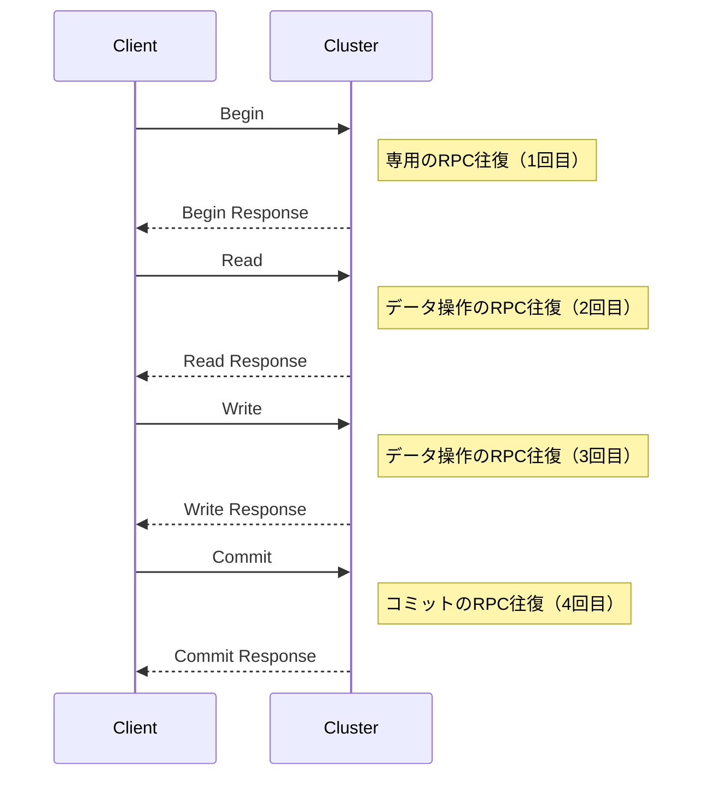
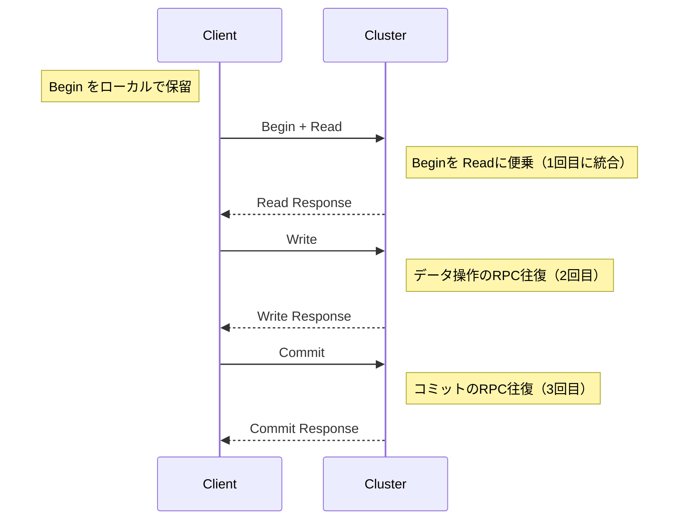
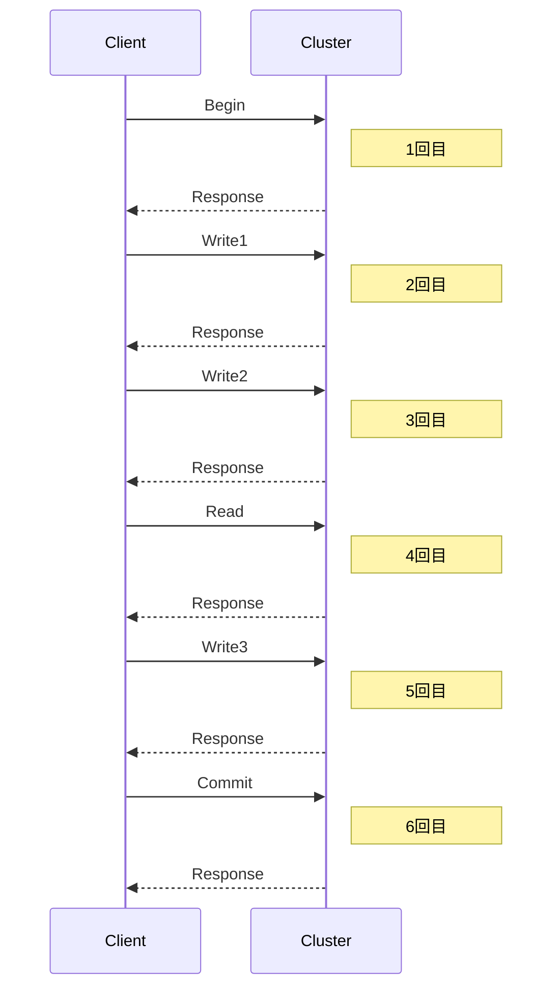
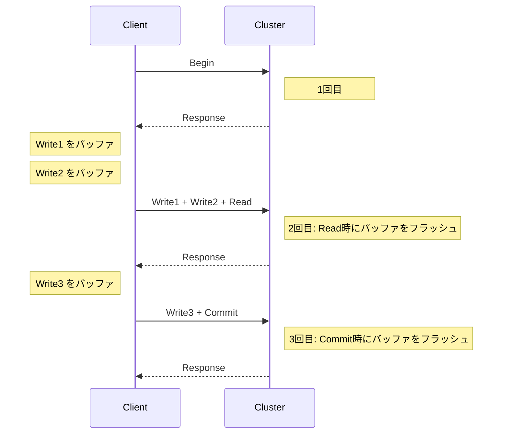
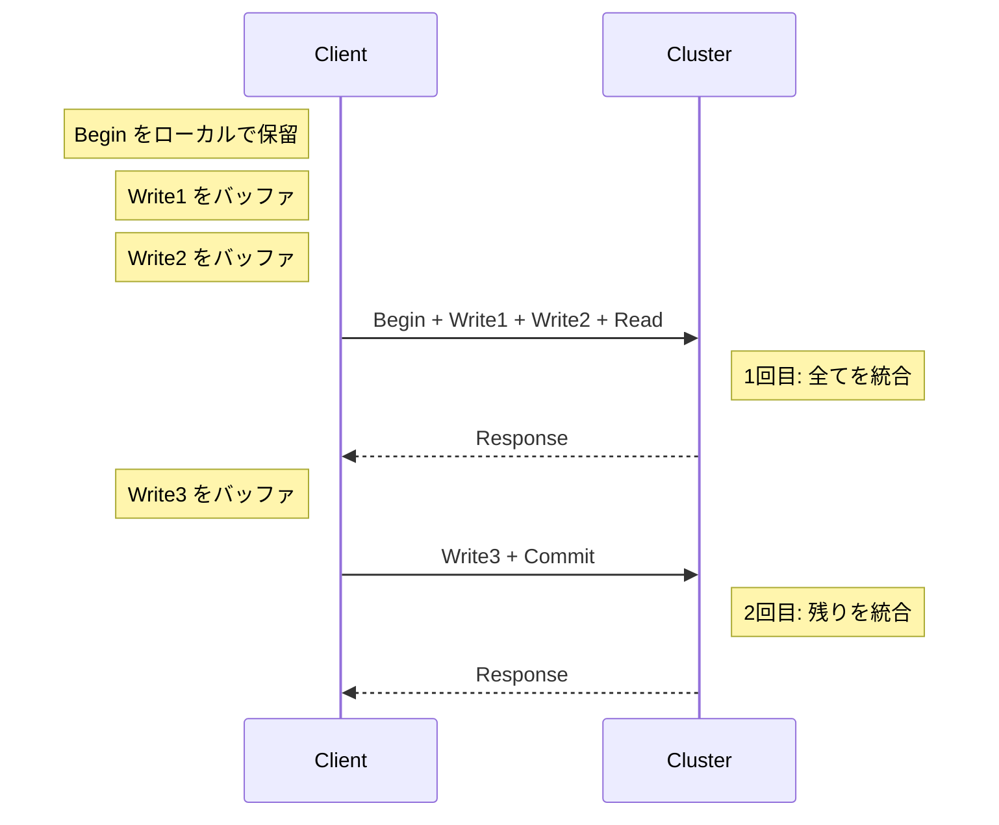
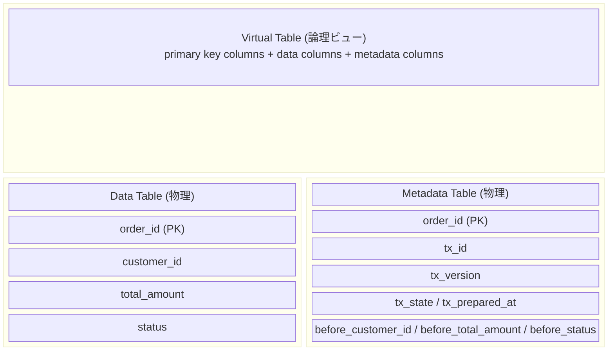
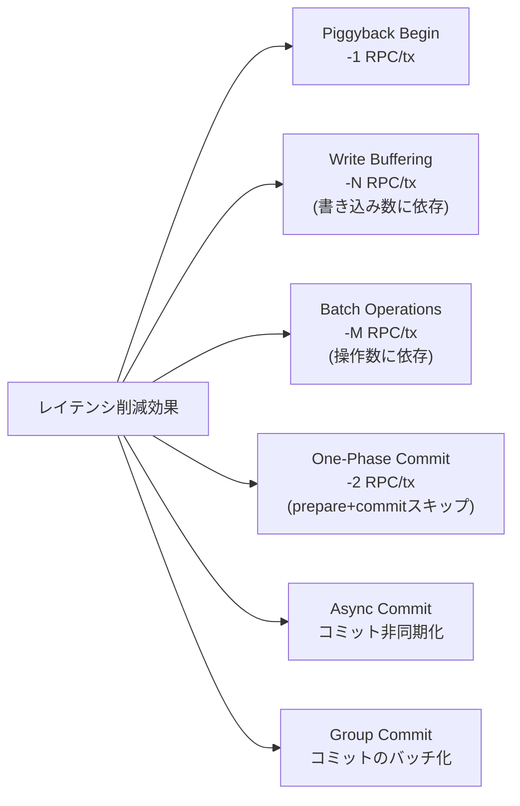
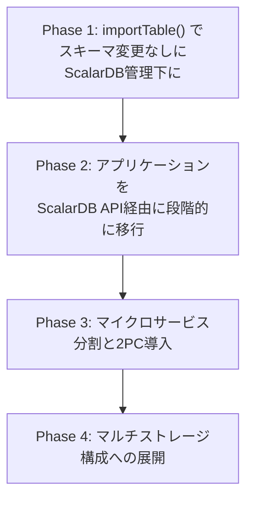

# ScalarDB 3.17 Deep Dive 調査

> **出典**: ScalarDB 3.17 Deep Dive (Toshihiro Suzuki)

## 1. ScalarDB 3.17 主要アップデート一覧

ScalarDB 3.17では以下の主要な機能追加・改善が行われた。

| # | 機能 | カテゴリ | 影響範囲 |
|---|------|---------|---------|
| 1 | Batch Operations in Transaction API | Core/Cluster | パフォーマンス・API |
| 2 | Client-side Optimizations (Piggyback Begin / Write Buffering) | Cluster | パフォーマンス |
| 3 | Transaction Metadata Decoupling (Private Preview, JDBC限定) | Core (Consensus Commit) | データモデル・移行 |
| 4 | Multiple Named Embedding Stores/Models | Cluster | AI/Vector Search |
| 5 | Fix Secondary Index Behavior | Core (Consensus Commit) | 正確性・パフォーマンス |

---

## 2. Batch Operations in Transaction API

### 2.1 概要

Transaction APIに**バッチオペレーション**が追加された。1回のリクエストで複数のCRUD操作（Get, Scan, Put, Insert, Upsert, Update, Delete）をまとめて実行できる。

### 2.2 主なメリット

- **RPC往復回数の削減**: ScalarDB Clusterでは複数のオペレーションが単一リクエストで実行される
- **パフォーマンス向上**: ネットワークラウンドトリップの削減により、特にCluster構成でレイテンシが大幅改善
- **APIの簡潔さ**: 複数操作を1メソッド呼び出しにまとめられる

### 2.3 使用例

```java
// オペレーションオブジェクトの作成
Key partitionKey = Key.ofInt("c1", 10);
Key clusteringKeyForGet = Key.of("c2", "aaa", "c3", 100L);

Get get = Get.newBuilder()
    .namespace("ns")
    .table("tbl")
    .partitionKey(partitionKey)
    .clusteringKey(clusteringKeyForGet)
    .build();

Scan scan = Scan.newBuilder()
    .namespace("ns")
    .table("tbl")
    .partitionKey(partitionKey)
    .build();

Key clusteringKeyForInsert = Key.of("c2", "bbb", "c3", 200L);
Insert insert = Insert.newBuilder()
    .namespace("ns")
    .table("tbl")
    .partitionKey(partitionKey)
    .clusteringKey(clusteringKeyForInsert)
    .floatValue("c4", 1.23f)
    .doubleValue("c5", 4.56)
    .build();

Key clusteringKeyForDelete = Key.of("c2", "ccc", "c3", 300L);
Delete delete = Delete.newBuilder()
    .namespace("ns")
    .table("tbl")
    .partitionKey(partitionKey)
    .clusteringKey(clusteringKeyForDelete)
    .build();

// バッチ実行
List<BatchResult> batchResults = transaction.batch(
    Arrays.asList(get, scan, insert, delete)
);

// 結果の取得
Optional<Result> getResult = batchResults.get(0).getGetResult();
List<Result> scanResult = batchResults.get(1).getScanResult();
```

### 2.4 対応PR

- Core: [scalar-labs/scalardb#3082](https://github.com/scalar-labs/scalardb/pull/3082)
- Cluster: [scalar-labs/scalardb-cluster#1377](https://github.com/scalar-labs/scalardb-cluster/pull/1377), [#1386](https://github.com/scalar-labs/scalardb-cluster/pull/1386)

---

## 3. Client-side Optimizations for ScalarDB Cluster

ScalarDB 3.17ではクライアントサイドの最適化として**2つの新機能**が導入された。いずれもRPCオーバーヘッドを削減し、パフォーマンスを向上させるものである。

### 3.1 Piggyback Begin（ピギーバック・ビギン）

#### 3.1.1 概要

**Piggyback Begin**は、トランザクションの開始（Begin）を最初のCRUD操作まで遅延させ、最初のオペレーションに「便乗（piggyback）」させることで、専用のBegin RPCコールを不要にする最適化である。

#### 3.1.2 動作メカニズム

**従来の動作（最適化なし）:**



**Piggyback Begin有効時:**



#### 3.1.3 設定

```properties
# Piggyback Begin を有効化（デフォルト: false）
scalar.db.cluster.client.piggyback_begin.enabled=true
```

#### 3.1.4 技術的詳細

- クライアント側で`transaction.begin()`が呼ばれた時点ではRPCを発行しない
- 最初のCRUD操作（Get/Scan/Put/Insert/Update/Delete）が実行される時に、Begin要求を同じRPCメッセージに含める
- サーバー側で1回のRPC処理内でBeginとCRUD操作を順次実行する
- クライアントから見たAPI利用方法は変わらない（透過的な最適化）

#### 3.1.5 効果

- RPC往復回数が1回削減される
- 特にネットワークレイテンシが大きい環境（マルチリージョン、Envoy経由など）で効果が顕著
- トランザクションあたりの所要時間が短縮される

### 3.2 Write Buffering（ライトバッファリング）

#### 3.2.1 概要

**Write Buffering**は、非条件付きの書き込みオペレーション（Insert, Upsert, 無条件Update/Delete）をクライアント側でバッファリングし、次のRead操作やCommit時にまとめてバッチ送信する最適化である。

> **対象範囲の制約**: 対象は非条件的な書込み操作（insert, upsert, 無条件のput/update/delete）のみ。条件付きミューテーション（updateIf, deleteIf等）はバッファされず、即座にサーバーに送信される。

#### 3.2.2 動作メカニズム

**従来の動作（最適化なし）:**



**Write Buffering有効時:**



#### 3.2.3 設定

```properties
# Write Buffering を有効化（デフォルト: false）
scalar.db.cluster.client.write_buffering.enabled=true
```

#### 3.2.4 バッファリング対象

| 操作タイプ | バッファリング対象 | 理由 |
|-----------|----------------|------|
| Insert | 対象 | 条件なし書き込み |
| Upsert | 対象 | 条件なし書き込み |
| 無条件 Update | 対象 | 条件なし書き込み |
| 無条件 Delete | 対象 | 条件なし書き込み |
| 条件付き Put/Delete | **対象外** | 条件評価にサーバー側処理が必要 |
| Get/Scan | **対象外**（フラッシュトリガー） | 読み取り時にバッファを送信 |

#### 3.2.5 フラッシュタイミング

バッファされた書き込み操作は以下のタイミングでサーバーに送信される:
1. **Read操作（Get/Scan）実行時**: バッファされた書き込みをReadと一緒に送信
2. **Commit実行時**: 残りのバッファされた書き込みをCommitと一緒に送信

### 3.3 Piggyback Begin + Write Buffering の組み合わせ

両方の最適化を同時に有効化すると、最大限のRPC削減が実現される。

**組み合わせ時の動作例:**



**設定:**

```properties
# 両方の最適化を有効化
scalar.db.cluster.client.piggyback_begin.enabled=true
scalar.db.cluster.client.write_buffering.enabled=true
```

**効果**: 上記の例では、6回のRPC往復が2回に削減される（67%削減）。

### 3.4 ベンチマーク結果

#### 3.4.1 テスト環境

| 項目 | 構成 |
|------|------|
| Client | m5.4xlarge |
| Envoy | m5.xlarge x4 (リソース制限なし) |
| ScalarDB Cluster | m5.xlarge x10 (1 pod/node, リソース制限あり) |
| RDS PostgreSQL | db.m5.4xlarge |
| ScalarDB設定 | async_commit=true, one_phase_commit=true |
| コネクションプール | min_idle/max_idle/max_total = 200/500/500 |
| ワークロード | YCSB-F (1 read-modify-write per transaction) |

#### 3.4.2 テストモード

- **Indirect mode**: [Client Pod] → [Envoy] → [ScalarDB Cluster]
- **Direct mode**: [Client Pod] → [ScalarDB Cluster]

#### 3.4.3 結果サマリ

| モード | スレッド数 | 最適化なし (ops/sec) | 最適化あり (ops/sec) | 改善率 |
|--------|----------|---------------------|---------------------|--------|
| Indirect | 1 | ~100 | ~100 | - |
| Indirect | 16 | ~2,500 | ~3,500 | ~40% |
| Indirect | 64 | ~3,800 | ~7,500 | ~97% |
| Indirect | 128 | ~4,500 | ~9,000 | ~100% |
| Direct | 1 | ~100 | ~100 | - |
| Direct | 16 | ~5,000 | ~6,500 | ~30% |
| Direct | 64 | ~12,000 | ~16,000 | ~33% |
| Direct | 128 | ~17,000 | ~23,000 | ~35% |

**考察:**
- Indirect mode（Envoy経由）では改善率がより大きい（RPCオーバーヘッドが大きいため）
- 高並行数（64-128スレッド）で最大約2倍のスループット改善
- Direct modeでも30-35%の改善が確認される
- 低並行数（1スレッド）では改善が限定的（RPCオーバーヘッドの比率が小さいため）

### 3.5 適用推奨シナリオ

| シナリオ | Piggyback Begin | Write Buffering | 期待効果 |
|---------|:---------------:|:---------------:|---------|
| 読み取り中心のワークロード | 推奨 | 限定的 | Begin RPCの削減 |
| 書き込み中心のワークロード | 推奨 | **強く推奨** | 大幅なRPC削減 |
| Read-Modify-Write | 推奨 | 推奨 | 両方のメリット |
| Envoy経由のIndirect mode | **強く推奨** | **強く推奨** | 最大2倍の改善 |
| Direct mode | 推奨 | 推奨 | 30-35%改善 |
| 条件付き操作が多い | 推奨 | 限定的 | 条件付き操作はバッファ対象外 |

### 3.6 注意事項

- デフォルトでは**両方とも無効**（`false`）
- 互換性を保つためのデフォルト設定であり、新規プロジェクトでは有効化を推奨
- 条件付き操作（conditional Put/Delete）はWrite Bufferingの対象外
- クライアントSDKのバージョンが3.17以上であることが必要

---

## 4. Transaction Metadata Decoupling（トランザクションメタデータ分離）(Private Preview, JDBC限定)

### 4.1 概要

Consensus Commitのトランザクションメタデータをアプリケーションデータから**物理的に分離**する機能。従来はアプリケーションテーブルにメタデータカラム（`tx_id`, `tx_version`, `tx_state`, `tx_prepared_at`, `before_*`）が混在していたが、これを別テーブルに分離できる。

### 4.2 従来の問題点

従来のConsensus Commitでは、各レコードに以下のメタデータカラムが付与されていた:

```sql
-- 従来のテーブル構造（メタデータ混在）
CREATE TABLE orders (
    -- アプリケーションカラム
    order_id INT PRIMARY KEY,
    customer_id INT,
    total_amount DECIMAL,
    status VARCHAR(50),
    -- ScalarDBトランザクションメタデータ（自動追加）
    tx_id VARCHAR(255),
    tx_version INT,
    tx_state INT,
    tx_prepared_at BIGINT,
    before_customer_id INT,      -- before-image
    before_total_amount DECIMAL, -- before-image
    before_status VARCHAR(50),   -- before-image
    tx_committed_at BIGINT
);
```

**問題:**
- 既存テーブルをScalarDB管理下に取り込む際にスキーマ変更が必要
- アプリケーションテーブルにScalarDB固有のカラムが混在し、設計が汚染される
- 他システムからのダイレクトアクセス時にメタデータが可視化される

### 4.3 メタデータ分離のアーキテクチャ

#### 4.3.1 Virtual Table（仮想テーブル）概念

メタデータ分離は**Virtual Table**（仮想テーブル）という新しいストレージ抽象を利用する。Virtual Tableは2つのソーステーブルをプライマリキーで結合した論理的なビューである。



#### 4.3.2 結合タイプ

| 結合タイプ | 用途 | 理由 |
|-----------|------|------|
| INNER JOIN | 新規テーブル | データとメタデータが常に1:1で存在するため |
| LEFT OUTER JOIN | インポートテーブル | 既存行にはメタデータ行がまだ存在しない可能性があるため |

#### 4.3.3 JDBC Adapter の実装

JDBCアダプタでは、Virtual Tableは**データベースのVIEW**として実装される:

- **テーブル作成時**: JDBCアダプタがデータテーブル、メタデータテーブル、およびVIEW（JOIN）を自動作成
- **Read操作（Get/Scan）**: VIEWに対してクエリ実行（DBネイティブのJOIN最適化を活用）
- **Write操作（Put/Delete）**: 自動的に各ソーステーブルへの個別操作に分割し、単一トランザクション内で実行

**Writeの分割理由**: 多くのRDBはJOINされたVIEWへの更新に厳しい制限を設けている（更新不可、トリガー必要など）。アダプタレベルで分割することで、シームレスな「更新可能」な体験を提供。

### 4.4 使用方法

#### 4.4.1 新規テーブルの作成

```java
// transaction-metadata-decoupling オプションを指定して作成
admin.createTable("ns", "orders", tableMetadata,
    Map.of("transaction-metadata-decoupling", "true"));
```

#### 4.4.2 既存テーブルのインポート

```java
// 既存テーブルをスキーマ変更なしでScalarDB管理下に取り込む
admin.importTable("ns", "legacy_orders", tableMetadata,
    Map.of("transaction-metadata-decoupling", "true"));
```

### 4.5 主なメリット

| メリット | 説明 |
|---------|------|
| Zero-Schema Change Import | 既存テーブルのスキーマを一切変更せずにScalarDB管理下に取り込める |
| クリーンなデータテーブル | アプリケーションテーブルにはビジネスデータのみが格納される |
| 既存システムとの共存 | 他システムからデータテーブルを直接参照してもメタデータが見えない |
| 段階的移行 | 既存システムを稼働させたまま、段階的にScalarDB管理に移行できる |

### 4.6 Metadata Decouplingのパフォーマンス考慮事項

Metadata Decoupling有効時、全Read操作がVIEW経由のJOIN（データテーブル + メタデータテーブル）となるため、以下の影響がある:

- **Read レイテンシ**: JOIN実行によりRead操作のI/Oが増加する可能性がある。特にインデックス設計が適切でない場合やレコード数が多い場合に顕著
- **Write パフォーマンス**: メタデータの書き込み先が変わるが、パフォーマンスへの影響は限定的
- **推奨**: 本番適用前にMetadata Decoupling有効/無効でのRead/Write性能比較ベンチマークを実施すること

### 4.7 一貫性保証と制約

#### 4.7.1 Virtual Table の一貫性問題

Virtual TableはJOIN実装であるため、2つのソーステーブルの読み取りタイミングが異なると一貫性が崩れる可能性がある。

- `StorageInfo#isConsistentVirtualTableReadGuaranteed()` APIで一貫性保証を確認可能
- JDBCアダプタの場合、結果はDBとトランザクション分離レベルに依存（例: OracleはSERIALIZABLEのみtrue）
- 一貫性が保証されないストレージでは、メタデータ分離テーブルの作成・インポートが拒否される

#### 4.7.2 現在のサポート状況

- **対応**: JDBCアダプタのみ（Private Preview）
- **将来候補**: DynamoDBアダプタ（DynamoDBはマルチテーブルのトランザクショナル書き込みをサポートするため）

### 4.8 対応PR

- [scalar-labs/scalardb#3180](https://github.com/scalar-labs/scalardb/pull/3180) - Virtual Table概念の導入
- [scalar-labs/scalardb#3204](https://github.com/scalar-labs/scalardb/pull/3204) - 一貫性チェックAPI
- [scalar-labs/scalardb#3207](https://github.com/scalar-labs/scalardb/pull/3207) - メタデータ分離実装

---

## 5. Multiple Named Embedding Stores and Models

### 5.1 概要

従来、ScalarDB Clusterでは1つのエンベディングストアと1つのエンベディングモデルしか構成できなかった。3.17では**名前付きの複数インスタンス**を定義し、実行時に選択できるようになった。

### 5.2 設定例

#### 5.2.1 エンベディングストアの設定

```properties
# 複数ストアの定義
scalar.db.embedding.stores=store1,store2

# Store1: OpenSearch
scalar.db.embedding.stores.store1.type=opensearch
scalar.db.embedding.stores.store1.opensearch.server_url=<SERVER_URL>
scalar.db.embedding.stores.store1.opensearch.api_key=<API_KEY>
scalar.db.embedding.stores.store1.opensearch.user_name=<USER_NAME>
scalar.db.embedding.stores.store1.opensearch.password=<PASSWORD>
scalar.db.embedding.stores.store1.opensearch.index_name=<INDEX_NAME>

# Store2: Azure Cosmos DB NoSQL
scalar.db.embedding.stores.store2.type=azure-cosmos-nosql
scalar.db.embedding.stores.store2.azure-cosmos-nosql.endpoint=<ENDPOINT>
scalar.db.embedding.stores.store2.azure-cosmos-nosql.key=<KEY>
scalar.db.embedding.stores.store2.azure-cosmos-nosql.database_name=<DATABASE_NAME>
scalar.db.embedding.stores.store2.azure-cosmos-nosql.container_name=<CONTAINER_NAME>
```

#### 5.2.2 エンベディングモデルの設定

```properties
# 複数モデルの定義
scalar.db.embedding.models=model1,model2

# Model1: Amazon Bedrock Titan
scalar.db.embedding.models.model1.type=bedrock-titan
scalar.db.embedding.models.model1.bedrock-titan.region=<REGION>
scalar.db.embedding.models.model1.bedrock-titan.access_key_id=<ACCESS_KEY_ID>
scalar.db.embedding.models.model1.bedrock-titan.secret_access_key=<SECRET_ACCESS_KEY>
scalar.db.embedding.models.model1.bedrock-titan.model=<MODEL>
scalar.db.embedding.models.model1.bedrock-titan.dimensions=<DIMENSIONS>

# Model2: Azure OpenAI
scalar.db.embedding.models.model2.type=azure-open-ai
scalar.db.embedding.models.model2.azure-open-ai.endpoint=<ENDPOINT>
scalar.db.embedding.models.model2.azure-open-ai.api_key=<API_KEY>
scalar.db.embedding.models.model2.azure-open-ai.deployment_name=<DEPLOYMENT_NAME>
scalar.db.embedding.models.model2.azure-open-ai.dimensions=<DIMENSIONS>
```

#### 5.2.3 クライアントコード例

```java
try (ScalarDbEmbeddingClientFactory scalarDbEmbeddingClientFactory =
    ScalarDbEmbeddingClientFactory.builder()
        .withProperty("scalar.db.embedding.client.contact_points", "indirect:localhost")
        .withProperty("scalar.db.embedding.client.store", "store1")  // ストア指定
        .withProperty("scalar.db.embedding.client.model", "model2")  // モデル指定
        .build()) {

    // エンベディングストアとモデルのインスタンスを作成
    EmbeddingStore<TextSegment> scalarDbEmbeddingStore =
        scalarDbEmbeddingClientFactory.createEmbeddingStore();
    EmbeddingModel scalarDbEmbeddingModel =
        scalarDbEmbeddingClientFactory.createEmbeddingModel();

    // 使用...
}
```

### 5.3 ユースケース

- **マルチテナント**: テナントごとに異なるベクトルストアを使用
- **A/Bテスト**: 異なるエンベディングモデルの比較検証
- **マルチリージョン**: リージョンごとに最適なストアを選択
- **段階的移行**: 旧モデルから新モデルへの段階的移行

### 5.4 対応PR

- [scalar-labs/scalardb-cluster#1441](https://github.com/scalar-labs/scalardb-cluster/pull/1441)

---

## 6. Fix Secondary Index Behavior in Consensus Commit

### 6.1 背景: Before-Image と Prepared レコード

Consensus Commitでは、レコードが更新される際に以下の状態遷移が発生する:

```
1. 元の値がbefore-imageカラムに保存される
2. 現在の値（current）が新しい値に更新される
3. tx_state が PREPARED に設定される
4. コミット後、tx_state が COMMITTED に変更される
```

つまり、PREPAREDステートのレコードは**現在値（current）**と**元値（before-image）**の両方を持ち、currentの値はまだコミットされていない可能性がある。

### 6.2 セカンダリインデックスの問題

**例**: `status = 'A'`でScanする場合

| pk | status (current) | before_status | tx_state |
|----|-----------------|---------------|----------|
| 1 | B | A | PREPARED |
| 2 | A | (null) | COMMITTED |

**問題**: `status = 'A'` で検索すると:
- pk=2 はヒットする（status='A', COMMITTED）
- pk=1 はヒット**しない**（status='B'）
- しかしpk=1は本来 `before_status='A'` なので、トランザクションが最終的にアボートされると status='A' に戻る

**従来の対処**: 述語を拡張して `status = 'A' OR before_status = 'A'` として検索
**問題点**: この拡張によりセカンダリインデックスが使用不可になり、深刻なパフォーマンス劣化を引き起こす

### 6.3 3.17での設計判断

**決定**: セカンダリインデックス経由のGet/Scanを「**結果整合性（Eventually Consistent）**」と再定義

- セカンダリインデックスを使用するGet/Scanでは、before-columnの条件を**追加しない**
- セカンダリインデックスを効率的に使用可能にする
- **トレードオフ**: PREPAREDステートの一部のレコードを見逃すリスクがある
- **リスク緩和**: 継続的なトランザクション処理やLazy Recoveryにより、最終的にはレコードが正しい状態に収束する

> **Value Propositionへの影響**: この変更により、セカンダリインデックス経由のアクセスはACID保証のスコープ外（結果整合性）となります。ScalarDBの「異種DB間ACID保証」は、プライマリキー（Partition Key + Clustering Key）によるアクセスに対して完全に適用されます。セカンダリインデックスを多用する設計を検討する場合、この特性を理解した上で判断してください。

### 6.4 影響と推奨事項

| 影響 | 説明 |
|------|------|
| パフォーマンス | セカンダリインデックスの使用が効率化される |
| 正確性 | PREPAREDレコードの一時的な見逃しが発生しうる |
| 最終一貫性 | Lazy Recoveryにより自動的に正しい状態に収束 |
| 推奨 | OLTP処理ではプライマリキーアクセスを基本とし、セカンダリインデックスは補助的に使用 |

### 6.5 対応PR

- [scalar-labs/scalardb#3133](https://github.com/scalar-labs/scalardb/pull/3133)

---

## 7. マイクロサービスアーキテクチャへの影響と推奨設定

### 7.1 推奨設定マトリクス

ScalarDB 3.17の新機能を踏まえたマイクロサービス向け推奨設定:

```properties
# === ScalarDB Cluster クライアント設定 ===

# [推奨] Piggyback Begin: RPCラウンドトリップ削減
scalar.db.cluster.client.piggyback_begin.enabled=true

# [推奨] Write Buffering: 書き込み操作のバッチ化
scalar.db.cluster.client.write_buffering.enabled=true

# === ScalarDB Consensus Commit 最適化 ===

# [推奨] 非同期コミット: スループット向上
scalar.db.consensus_commit.async_commit.enabled=true

# [推奨] 1フェーズコミット: 単一パーティション操作の高速化
scalar.db.consensus_commit.one_phase_commit.enabled=true

# [推奨] Group Commit: バッチコミットによるスループット向上
scalar.db.consensus_commit.coordinator.group_commit.enabled=true

# === メタデータ分離（既存DB移行時） ===
# テーブル作成時のオプションとして指定
# admin.createTable(..., Map.of("transaction-metadata-decoupling", "true"))
```

### 7.2 パフォーマンス最適化の組み合わせ



スループット向上効果（YCSB-F, 128スレッド, Indirect mode）:
- 最適化なし: ~4,500 ops/sec
- 全最適化: ~9,000 ops/sec (約2倍)

### 7.3 既存システム移行戦略への影響

Transaction Metadata Decouplingにより、既存データベースのScalarDBへの移行パスが大幅に改善された:



---

## 8. まとめ

ScalarDB 3.17は**パフォーマンス最適化**と**既存システムとの統合容易性**の両面で大きな進歩を遂げたリリースである。

### 主要テーマと効果

| テーマ | 機能 | ビジネスインパクト |
|--------|------|-------------------|
| パフォーマンス | Piggyback Begin | トランザクションレイテンシの削減 |
| パフォーマンス | Write Buffering | 書き込み重視ワークロードの高速化 |
| パフォーマンス | Batch Operations | 複数操作のラウンドトリップ削減 |
| データモデル | Metadata Decoupling | 既存DBのスキーマ変更なし移行 |
| データモデル | Virtual Tables | 論理的なテーブル結合抽象 |
| AI/Vector | Multiple Embeddings | マルチモデル・マルチストア対応 |
| 正確性 | Secondary Index Fix | インデックス利用の効率化 |

### 最も影響の大きい変更

1. **Piggyback Begin + Write Buffering**: 特にScalarDB Cluster構成のマイクロサービスにおいて、設定変更のみで最大2倍のスループット改善を実現。新規プロジェクトでは両方の有効化を強く推奨。

2. **Transaction Metadata Decoupling**: 既存データベースをScalarDB管理下に取り込む際の最大の障壁であった「スキーマ変更」が不要になり、段階的移行の実現可能性が飛躍的に向上。

3. **Batch Operations**: マイクロサービスにおける複数エンティティの同時操作パターン（注文+在庫更新など）で、API呼び出しの簡素化とパフォーマンス向上を両立。
