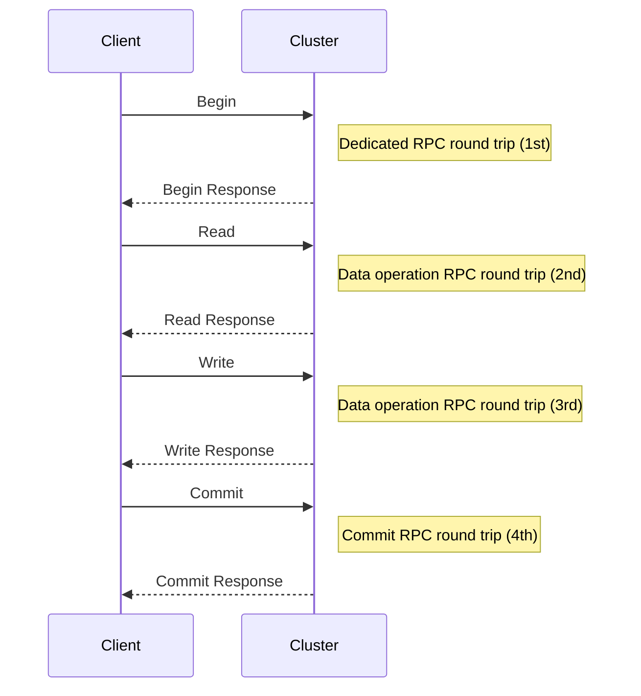
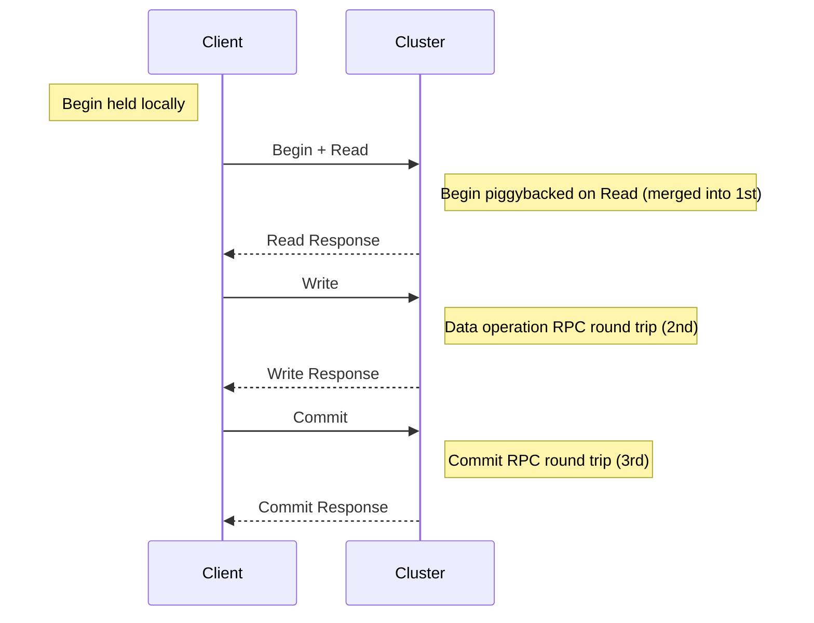
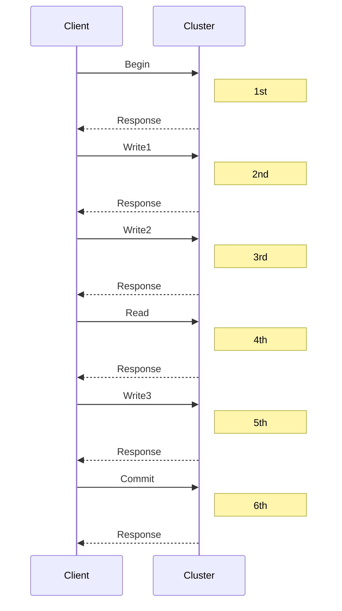
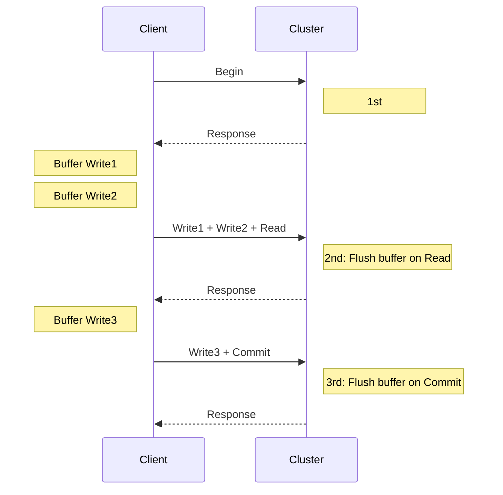
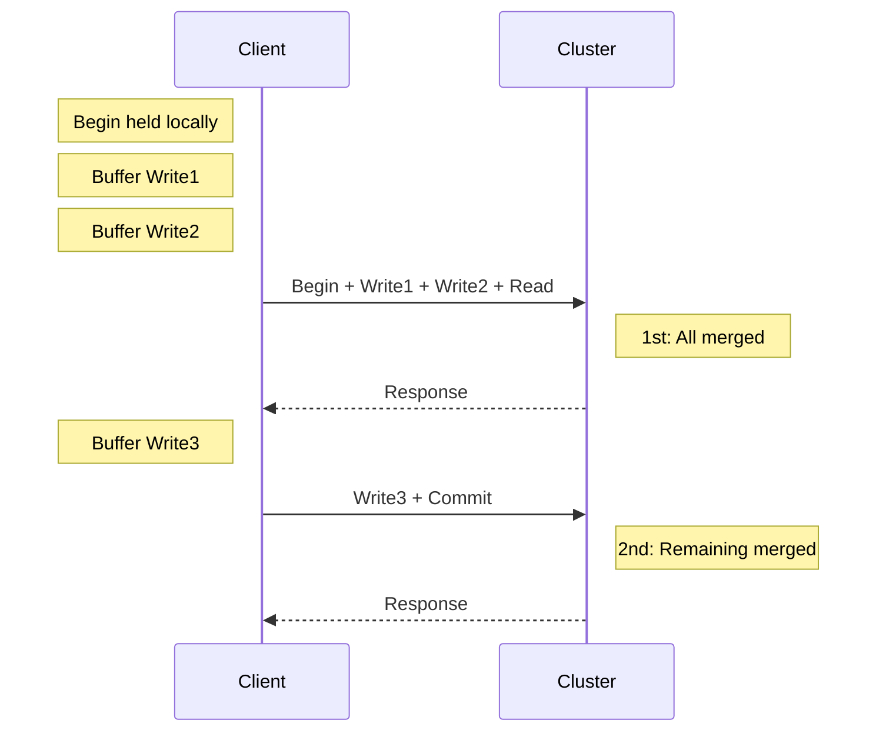
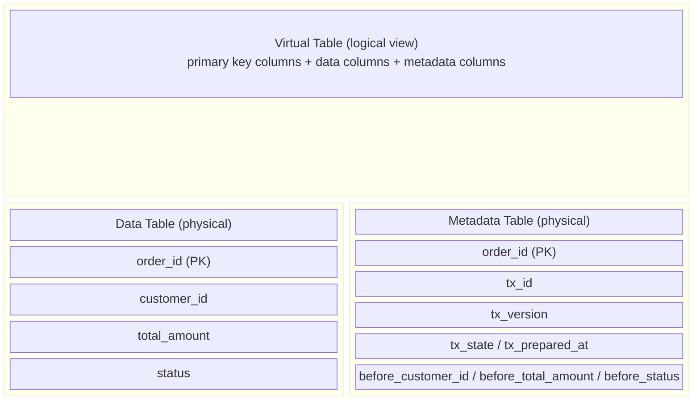
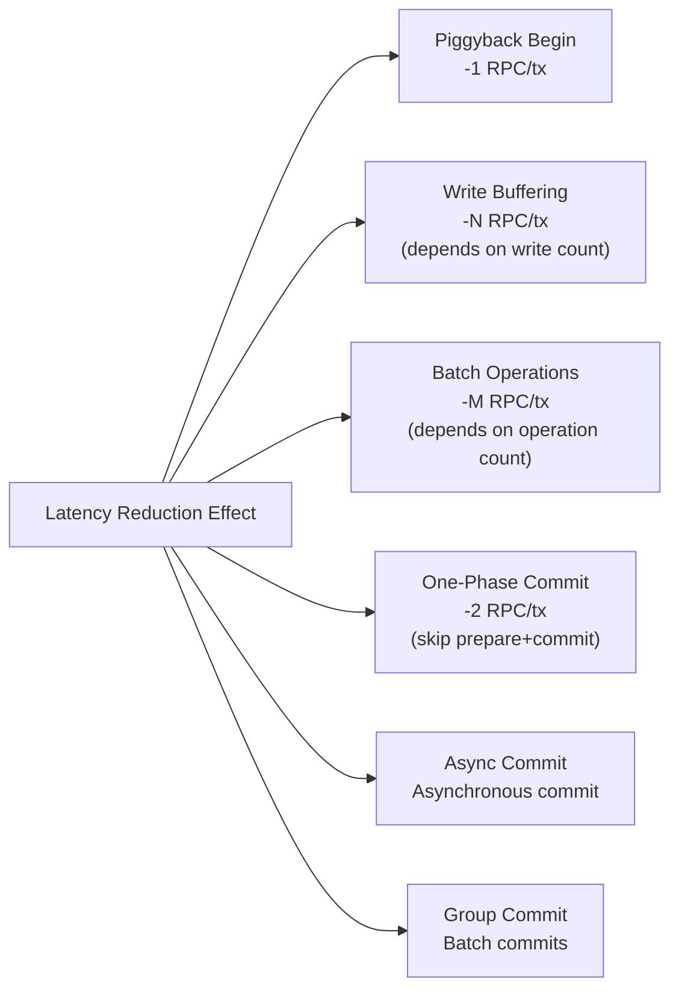
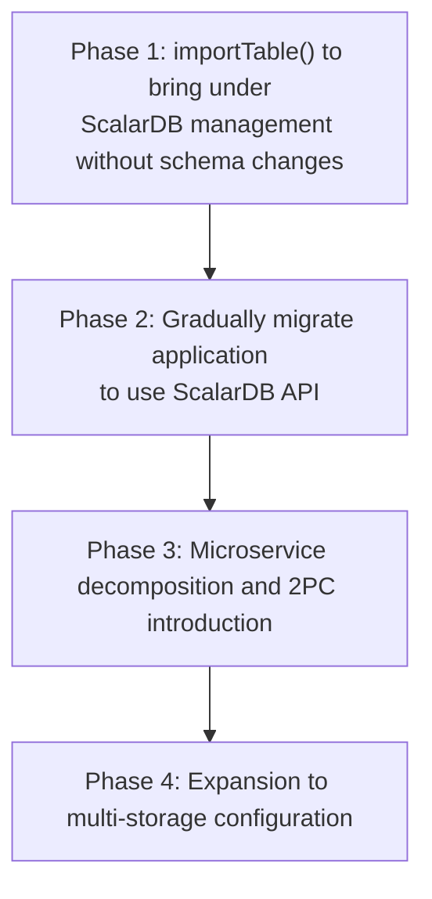

# ScalarDB 3.17 Deep Dive Investigation

> **Source**: ScalarDB 3.17 Deep Dive (Toshihiro Suzuki)

## 1. ScalarDB 3.17 Major Updates Overview

The following major feature additions and improvements were made in ScalarDB 3.17.

| # | Feature | Category | Impact Area |
|---|------|---------|---------|
| 1 | Batch Operations in Transaction API | Core/Cluster | Performance / API |
| 2 | Client-side Optimizations (Piggyback Begin / Write Buffering) | Cluster | Performance |
| 3 | Transaction Metadata Decoupling (Private Preview, JDBC only) | Core (Consensus Commit) | Data Model / Migration |
| 4 | Multiple Named Embedding Stores/Models | Cluster | AI/Vector Search |
| 5 | Fix Secondary Index Behavior | Core (Consensus Commit) | Correctness / Performance |

---

## 2. Batch Operations in Transaction API

### 2.1 Overview

**Batch operations** have been added to the Transaction API. Multiple CRUD operations (Get, Scan, Put, Insert, Upsert, Update, Delete) can be executed together in a single request.

### 2.2 Key Benefits

- **Reduced RPC round trips**: In ScalarDB Cluster, multiple operations are executed in a single request
- **Performance improvement**: Significant latency improvement, especially in Cluster configurations, due to reduced network round trips
- **API simplicity**: Multiple operations can be combined into a single method call

### 2.3 Usage Example

```java
// Create operation objects
Key partitionKey = Key.ofInt("c1", 10);
Key clusteringKeyForGet = Key.of("c2", "aaa", "c3", 100L);

Get get = Get.newBuilder()
    .namespace("ns")
    .table("tbl")
    .partitionKey(partitionKey)
    .clusteringKey(clusteringKeyForGet)
    .build();

Scan scan = Scan.newBuilder()
    .namespace("ns")
    .table("tbl")
    .partitionKey(partitionKey)
    .build();

Key clusteringKeyForInsert = Key.of("c2", "bbb", "c3", 200L);
Insert insert = Insert.newBuilder()
    .namespace("ns")
    .table("tbl")
    .partitionKey(partitionKey)
    .clusteringKey(clusteringKeyForInsert)
    .floatValue("c4", 1.23f)
    .doubleValue("c5", 4.56)
    .build();

Key clusteringKeyForDelete = Key.of("c2", "ccc", "c3", 300L);
Delete delete = Delete.newBuilder()
    .namespace("ns")
    .table("tbl")
    .partitionKey(partitionKey)
    .clusteringKey(clusteringKeyForDelete)
    .build();

// Batch execution
List<BatchResult> batchResults = transaction.batch(
    Arrays.asList(get, scan, insert, delete)
);

// Retrieve results
Optional<Result> getResult = batchResults.get(0).getGetResult();
List<Result> scanResult = batchResults.get(1).getScanResult();
```

### 2.4 Related PRs

- Core: [scalar-labs/scalardb#3082](https://github.com/scalar-labs/scalardb/pull/3082)
- Cluster: [scalar-labs/scalardb-cluster#1377](https://github.com/scalar-labs/scalardb-cluster/pull/1377), [#1386](https://github.com/scalar-labs/scalardb-cluster/pull/1386)

---

## 3. Client-side Optimizations for ScalarDB Cluster

ScalarDB 3.17 introduces **two new features** as client-side optimizations. Both reduce RPC overhead and improve performance.

### 3.1 Piggyback Begin

#### 3.1.1 Overview

**Piggyback Begin** is an optimization that defers the transaction start (Begin) until the first CRUD operation and "piggybacks" it on the first operation, eliminating the need for a dedicated Begin RPC call.

#### 3.1.2 How It Works

**Previous behavior (without optimization):**



**With Piggyback Begin enabled:**



#### 3.1.3 Configuration

```properties
# Enable Piggyback Begin (default: false)
scalar.db.cluster.client.piggyback_begin.enabled=true
```

#### 3.1.4 Technical Details

- When `transaction.begin()` is called on the client side, no RPC is issued at that point
- When the first CRUD operation (Get/Scan/Put/Insert/Update/Delete) is executed, the Begin request is included in the same RPC message
- On the server side, Begin and the CRUD operation are executed sequentially within a single RPC processing
- The API usage from the client's perspective remains unchanged (transparent optimization)

#### 3.1.5 Effect

- One less RPC round trip per transaction
- Especially effective in environments with high network latency (multi-region, via Envoy, etc.)
- Reduces the time required per transaction

### 3.2 Write Buffering

#### 3.2.1 Overview

**Write Buffering** is an optimization that buffers unconditional write operations (Insert, Upsert, unconditional Update/Delete) on the client side and batch-sends them together with the next Read operation or at Commit time.

> **Scope constraint**: Only unconditional write operations (insert, upsert, unconditional put/update/delete) are targeted. Conditional mutations (updateIf, deleteIf, etc.) are not buffered and are sent to the server immediately.

#### 3.2.2 How It Works

**Previous behavior (without optimization):**



**With Write Buffering enabled:**



#### 3.2.3 Configuration

```properties
# Enable Write Buffering (default: false)
scalar.db.cluster.client.write_buffering.enabled=true
```

#### 3.2.4 Buffering Targets

| Operation Type | Buffered | Reason |
|-----------|----------------|------|
| Insert | Yes | Unconditional write |
| Upsert | Yes | Unconditional write |
| Unconditional Update | Yes | Unconditional write |
| Unconditional Delete | Yes | Unconditional write |
| Conditional Put/Delete | **No** | Server-side processing needed for condition evaluation |
| Get/Scan | **No** (flush trigger) | Buffer is sent on read |

#### 3.2.5 Flush Timing

Buffered write operations are sent to the server at the following times:
1. **On Read operation (Get/Scan) execution**: Buffered writes are sent together with the Read
2. **On Commit execution**: Remaining buffered writes are sent together with Commit

### 3.3 Combining Piggyback Begin + Write Buffering

When both optimizations are enabled simultaneously, maximum RPC reduction is achieved.

**Combined operation example:**



**Configuration:**

```properties
# Enable both optimizations
scalar.db.cluster.client.piggyback_begin.enabled=true
scalar.db.cluster.client.write_buffering.enabled=true
```

**Effect**: In the above example, 6 RPC round trips are reduced to 2 (67% reduction).

### 3.4 Benchmark Results

#### 3.4.1 Test Environment

| Item | Configuration |
|------|------|
| Client | m5.4xlarge |
| Envoy | m5.xlarge x4 (no resource limits) |
| ScalarDB Cluster | m5.xlarge x10 (1 pod/node, resource limits applied) |
| RDS PostgreSQL | db.m5.4xlarge |
| ScalarDB settings | async_commit=true, one_phase_commit=true |
| Connection pool | min_idle/max_idle/max_total = 200/500/500 |
| Workload | YCSB-F (1 read-modify-write per transaction) |

#### 3.4.2 Test Modes

- **Indirect mode**: [Client Pod] → [Envoy] → [ScalarDB Cluster]
- **Direct mode**: [Client Pod] → [ScalarDB Cluster]

#### 3.4.3 Results Summary

| Mode | Threads | Without optimization (ops/sec) | With optimization (ops/sec) | Improvement |
|--------|----------|---------------------|---------------------|--------|
| Indirect | 1 | ~100 | ~100 | - |
| Indirect | 16 | ~2,500 | ~3,500 | ~40% |
| Indirect | 64 | ~3,800 | ~7,500 | ~97% |
| Indirect | 128 | ~4,500 | ~9,000 | ~100% |
| Direct | 1 | ~100 | ~100 | - |
| Direct | 16 | ~5,000 | ~6,500 | ~30% |
| Direct | 64 | ~12,000 | ~16,000 | ~33% |
| Direct | 128 | ~17,000 | ~23,000 | ~35% |

**Analysis:**
- In Indirect mode (via Envoy), improvement is greater (due to larger RPC overhead)
- Up to approximately 2x throughput improvement at high concurrency (64-128 threads)
- 30-35% improvement confirmed in Direct mode as well
- Limited improvement at low concurrency (1 thread) (RPC overhead proportion is small)

### 3.5 Recommended Application Scenarios

| Scenario | Piggyback Begin | Write Buffering | Expected Effect |
|---------|:---------------:|:---------------:|---------|
| Read-heavy workloads | Recommended | Limited | Elimination of Begin RPC |
| Write-heavy workloads | Recommended | **Strongly recommended** | Significant RPC reduction |
| Read-Modify-Write | Recommended | Recommended | Benefits of both |
| Indirect mode via Envoy | **Strongly recommended** | **Strongly recommended** | Up to 2x improvement |
| Direct mode | Recommended | Recommended | 30-35% improvement |
| Many conditional operations | Recommended | Limited | Conditional operations are not buffered |

### 3.6 Notes

- Both are **disabled by default** (`false`)
- This is the default for backward compatibility; enabling is recommended for new projects
- Conditional operations (conditional Put/Delete) are excluded from Write Buffering
- Client SDK version 3.17 or later is required

---

## 4. Transaction Metadata Decoupling (Private Preview, JDBC Only)

### 4.1 Overview

A feature to **physically separate** Consensus Commit transaction metadata from application data. Previously, metadata columns (`tx_id`, `tx_version`, `tx_state`, `tx_prepared_at`, `before_*`) were mixed into application tables, but now they can be separated into a different table.

### 4.2 Previous Issues

In the conventional Consensus Commit approach, each record had the following metadata columns appended:

```sql
-- Previous table structure (mixed metadata)
CREATE TABLE orders (
    -- Application columns
    order_id INT PRIMARY KEY,
    customer_id INT,
    total_amount DECIMAL,
    status VARCHAR(50),
    -- ScalarDB transaction metadata (automatically added)
    tx_id VARCHAR(255),
    tx_version INT,
    tx_state INT,
    tx_prepared_at BIGINT,
    before_customer_id INT,      -- before-image
    before_total_amount DECIMAL, -- before-image
    before_status VARCHAR(50),   -- before-image
    tx_committed_at BIGINT
);
```

**Problems:**
- Schema changes required when bringing existing tables under ScalarDB management
- ScalarDB-specific columns mixed into application tables, polluting the design
- Metadata visible when directly accessing from other systems

### 4.3 Metadata Decoupling Architecture

#### 4.3.1 Virtual Table Concept

Metadata decoupling utilizes a new storage abstraction called **Virtual Tables**. A Virtual Table is a logical view that joins two source tables by primary key.



#### 4.3.2 Join Types

| Join Type | Use Case | Reason |
|-----------|------|------|
| INNER JOIN | New tables | Data and metadata always exist 1:1 |
| LEFT OUTER JOIN | Imported tables | Metadata rows may not yet exist for existing rows |

#### 4.3.3 JDBC Adapter Implementation

In the JDBC adapter, Virtual Tables are implemented as **database VIEWs**:

- **Table creation**: The JDBC adapter automatically creates the data table, metadata table, and VIEW (JOIN)
- **Read operations (Get/Scan)**: Queries are executed against the VIEW (leveraging DB-native JOIN optimization)
- **Write operations (Put/Delete)**: Automatically split into individual operations on each source table, executed within a single transaction

**Reason for write splitting**: Many RDBs impose strict restrictions on updates to JOINed VIEWs (non-updatable, triggers required, etc.). By splitting at the adapter level, a seamless "updatable" experience is provided.

### 4.4 Usage

#### 4.4.1 Creating New Tables

```java
// Create with transaction-metadata-decoupling option
admin.createTable("ns", "orders", tableMetadata,
    Map.of("transaction-metadata-decoupling", "true"));
```

#### 4.4.2 Importing Existing Tables

```java
// Bring existing table under ScalarDB management without schema changes
admin.importTable("ns", "legacy_orders", tableMetadata,
    Map.of("transaction-metadata-decoupling", "true"));
```

### 4.5 Key Benefits

| Benefit | Description |
|---------|------|
| Zero-Schema Change Import | Bring existing tables under ScalarDB management without any schema changes |
| Clean data tables | Only business data is stored in application tables |
| Coexistence with existing systems | Metadata is not visible when other systems directly reference the data table |
| Gradual migration | Can gradually migrate to ScalarDB management while keeping existing systems running |

### 4.6 Performance Considerations for Metadata Decoupling

When Metadata Decoupling is enabled, all Read operations go through a VIEW with a JOIN (data table + metadata table), resulting in the following impacts:

- **Read latency**: I/O for Read operations may increase due to JOIN execution. This is especially notable when index design is inadequate or the number of records is large
- **Write performance**: The destination for metadata writes changes, but the impact on performance is limited
- **Recommendation**: Conduct Read/Write performance comparison benchmarks with Metadata Decoupling enabled/disabled before production deployment

### 4.7 Consistency Guarantees and Constraints

#### 4.7.1 Virtual Table Consistency Issues

Since Virtual Tables are implemented as JOINs, consistency may be broken if the read timing of the two source tables differs.

- The `StorageInfo#isConsistentVirtualTableReadGuaranteed()` API can verify consistency guarantees
- For the JDBC adapter, the result depends on the DB and transaction isolation level (e.g., Oracle returns true only for SERIALIZABLE)
- In storage where consistency is not guaranteed, creation and import of metadata-decoupled tables are rejected

#### 4.7.2 Current Support Status

- **Supported**: JDBC adapter only (Private Preview)
- **Future candidates**: DynamoDB adapter (since DynamoDB supports multi-table transactional writes)

### 4.8 Related PRs

- [scalar-labs/scalardb#3180](https://github.com/scalar-labs/scalardb/pull/3180) - Introduction of Virtual Table concept
- [scalar-labs/scalardb#3204](https://github.com/scalar-labs/scalardb/pull/3204) - Consistency check API
- [scalar-labs/scalardb#3207](https://github.com/scalar-labs/scalardb/pull/3207) - Metadata decoupling implementation

---

## 5. Multiple Named Embedding Stores and Models

### 5.1 Overview

Previously, ScalarDB Cluster could only configure one embedding store and one embedding model. In 3.17, **multiple named instances** can be defined and selected at runtime.

### 5.2 Configuration Examples

#### 5.2.1 Embedding Store Configuration

```properties
# Define multiple stores
scalar.db.embedding.stores=store1,store2

# Store1: OpenSearch
scalar.db.embedding.stores.store1.type=opensearch
scalar.db.embedding.stores.store1.opensearch.server_url=<SERVER_URL>
scalar.db.embedding.stores.store1.opensearch.api_key=<API_KEY>
scalar.db.embedding.stores.store1.opensearch.user_name=<USER_NAME>
scalar.db.embedding.stores.store1.opensearch.password=<PASSWORD>
scalar.db.embedding.stores.store1.opensearch.index_name=<INDEX_NAME>

# Store2: Azure Cosmos DB NoSQL
scalar.db.embedding.stores.store2.type=azure-cosmos-nosql
scalar.db.embedding.stores.store2.azure-cosmos-nosql.endpoint=<ENDPOINT>
scalar.db.embedding.stores.store2.azure-cosmos-nosql.key=<KEY>
scalar.db.embedding.stores.store2.azure-cosmos-nosql.database_name=<DATABASE_NAME>
scalar.db.embedding.stores.store2.azure-cosmos-nosql.container_name=<CONTAINER_NAME>
```

#### 5.2.2 Embedding Model Configuration

```properties
# Define multiple models
scalar.db.embedding.models=model1,model2

# Model1: Amazon Bedrock Titan
scalar.db.embedding.models.model1.type=bedrock-titan
scalar.db.embedding.models.model1.bedrock-titan.region=<REGION>
scalar.db.embedding.models.model1.bedrock-titan.access_key_id=<ACCESS_KEY_ID>
scalar.db.embedding.models.model1.bedrock-titan.secret_access_key=<SECRET_ACCESS_KEY>
scalar.db.embedding.models.model1.bedrock-titan.model=<MODEL>
scalar.db.embedding.models.model1.bedrock-titan.dimensions=<DIMENSIONS>

# Model2: Azure OpenAI
scalar.db.embedding.models.model2.type=azure-open-ai
scalar.db.embedding.models.model2.azure-open-ai.endpoint=<ENDPOINT>
scalar.db.embedding.models.model2.azure-open-ai.api_key=<API_KEY>
scalar.db.embedding.models.model2.azure-open-ai.deployment_name=<DEPLOYMENT_NAME>
scalar.db.embedding.models.model2.azure-open-ai.dimensions=<DIMENSIONS>
```

#### 5.2.3 Client Code Example

```java
try (ScalarDbEmbeddingClientFactory scalarDbEmbeddingClientFactory =
    ScalarDbEmbeddingClientFactory.builder()
        .withProperty("scalar.db.embedding.client.contact_points", "indirect:localhost")
        .withProperty("scalar.db.embedding.client.store", "store1")  // Specify store
        .withProperty("scalar.db.embedding.client.model", "model2")  // Specify model
        .build()) {

    // Create embedding store and model instances
    EmbeddingStore<TextSegment> scalarDbEmbeddingStore =
        scalarDbEmbeddingClientFactory.createEmbeddingStore();
    EmbeddingModel scalarDbEmbeddingModel =
        scalarDbEmbeddingClientFactory.createEmbeddingModel();

    // Use...
}
```

### 5.3 Use Cases

- **Multi-tenancy**: Use different vector stores per tenant
- **A/B testing**: Comparative evaluation of different embedding models
- **Multi-region**: Select optimal store per region
- **Gradual migration**: Phased migration from old model to new model

### 5.4 Related PRs

- [scalar-labs/scalardb-cluster#1441](https://github.com/scalar-labs/scalardb-cluster/pull/1441)

---

## 6. Fix Secondary Index Behavior in Consensus Commit

### 6.1 Background: Before-Image and Prepared Records

In Consensus Commit, the following state transitions occur when a record is updated:

```
1. The original value is saved in before-image columns
2. The current value is updated to the new value
3. tx_state is set to PREPARED
4. After commit, tx_state is changed to COMMITTED
```

This means that a record in PREPARED state has both the **current value** and the **original value (before-image)**, and the current value may not yet be committed.

### 6.2 The Secondary Index Problem

**Example**: Scanning with `status = 'A'`

| pk | status (current) | before_status | tx_state |
|----|-----------------|---------------|----------|
| 1 | B | A | PREPARED |
| 2 | A | (null) | COMMITTED |

**Problem**: When searching with `status = 'A'`:
- pk=2 is returned (status='A', COMMITTED)
- pk=1 is **not** returned (status='B')
- However, pk=1 originally had `before_status='A'`, so if the transaction is eventually aborted, status returns to 'A'

**Previous approach**: Expand the predicate to search with `status = 'A' OR before_status = 'A'`
**Issue**: This expansion makes the secondary index unusable, causing severe performance degradation

### 6.3 Design Decision in 3.17

**Decision**: Redefine Get/Scan via secondary index as "**Eventually Consistent**"

- For Get/Scan using secondary indexes, the before-column condition is **not added**
- Enables efficient use of secondary indexes
- **Trade-off**: Risk of missing some records in PREPARED state
- **Risk mitigation**: Continuous transaction processing and Lazy Recovery ensure records eventually converge to the correct state

> **Impact on Value Proposition**: With this change, access via secondary indexes is outside the scope of ACID guarantees (eventually consistent). ScalarDB's "ACID guarantee across heterogeneous DBs" fully applies to access by primary key (Partition Key + Clustering Key). When considering designs that heavily use secondary indexes, please make decisions with this characteristic in mind.

### 6.4 Impact and Recommendations

| Impact | Description |
|------|------|
| Performance | Secondary index usage is made more efficient |
| Correctness | Temporary misses of PREPARED records may occur |
| Eventual consistency | Automatically converges to the correct state via Lazy Recovery |
| Recommendation | For OLTP processing, use primary key access as the default and secondary indexes as supplementary |

### 6.5 Related PRs

- [scalar-labs/scalardb#3133](https://github.com/scalar-labs/scalardb/pull/3133)

---

## 7. Impact on Microservices Architecture and Recommended Settings

### 7.1 Recommended Settings Matrix

Recommended settings for microservices based on ScalarDB 3.17 new features:

```properties
# === ScalarDB Cluster Client Settings ===

# [Recommended] Piggyback Begin: Reduce RPC round trips
scalar.db.cluster.client.piggyback_begin.enabled=true

# [Recommended] Write Buffering: Batch write operations
scalar.db.cluster.client.write_buffering.enabled=true

# === ScalarDB Consensus Commit Optimizations ===

# [Recommended] Async Commit: Improve throughput
scalar.db.consensus_commit.async_commit.enabled=true

# [Recommended] One-Phase Commit: Speed up single-partition operations
scalar.db.consensus_commit.one_phase_commit.enabled=true

# [Recommended] Group Commit: Improve throughput via batch commits
scalar.db.consensus_commit.coordinator.group_commit.enabled=true

# === Metadata Decoupling (for existing DB migration) ===
# Specify as an option when creating tables
# admin.createTable(..., Map.of("transaction-metadata-decoupling", "true"))
```

### 7.2 Performance Optimization Combinations



Throughput improvement (YCSB-F, 128 threads, Indirect mode):
- Without optimization: ~4,500 ops/sec
- All optimizations: ~9,000 ops/sec (approximately 2x)

### 7.3 Impact on Existing System Migration Strategy

Transaction Metadata Decoupling has significantly improved the migration path for existing databases to ScalarDB:



---

## 8. Summary

ScalarDB 3.17 is a release that achieves significant progress in both **performance optimization** and **ease of integration with existing systems**.

### Key Themes and Effects

| Theme | Feature | Business Impact |
|--------|------|-------------------|
| Performance | Piggyback Begin | Reduced transaction latency |
| Performance | Write Buffering | Faster write-heavy workloads |
| Performance | Batch Operations | Reduced round trips for multiple operations |
| Data Model | Metadata Decoupling | Migration of existing DBs without schema changes |
| Data Model | Virtual Tables | Logical table join abstraction |
| AI/Vector | Multiple Embeddings | Multi-model and multi-store support |
| Correctness | Secondary Index Fix | More efficient index usage |

### Most Impactful Changes

1. **Piggyback Begin + Write Buffering**: Especially for microservices in ScalarDB Cluster configurations, up to 2x throughput improvement achieved with configuration changes only. Strongly recommended to enable both for new projects.

2. **Transaction Metadata Decoupling**: The biggest barrier to bringing existing databases under ScalarDB management - "schema changes" - is no longer required, dramatically improving the feasibility of gradual migration.

3. **Batch Operations**: For patterns of simultaneous multi-entity operations in microservices (such as order + inventory update), this combines API call simplification with performance improvement.
