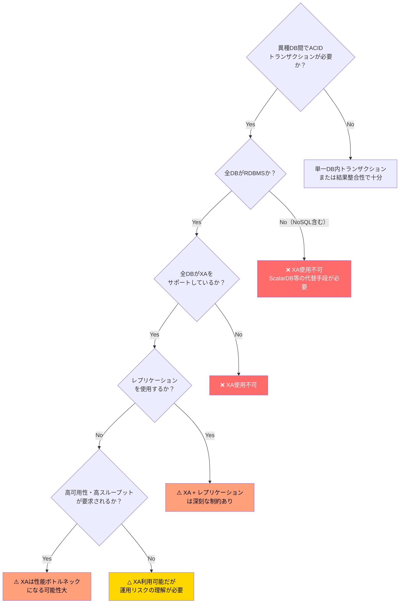
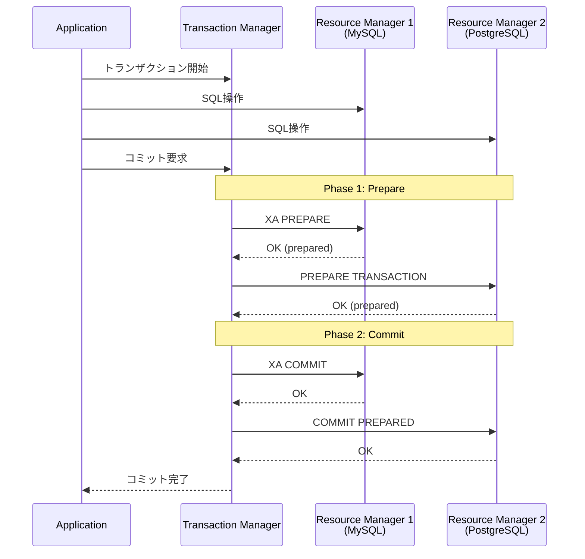
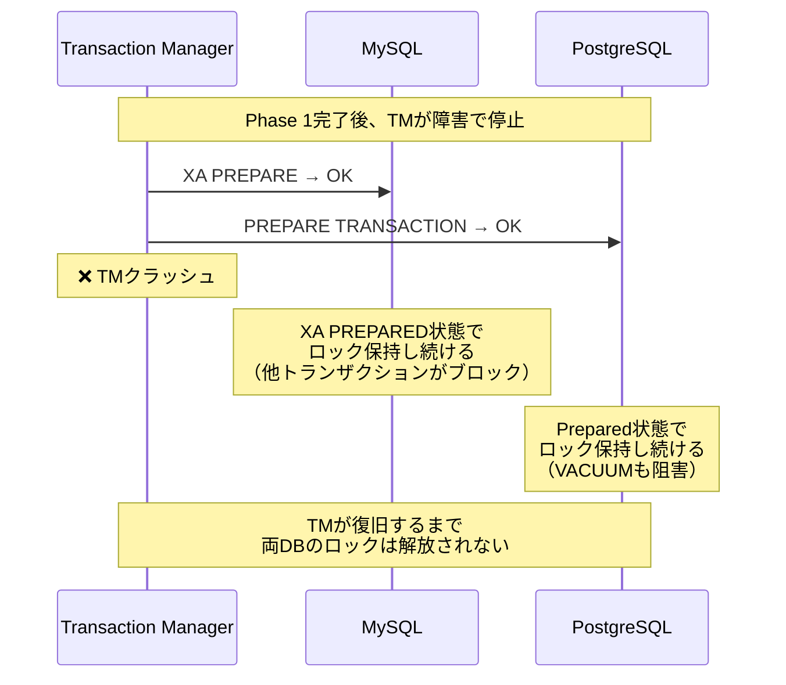
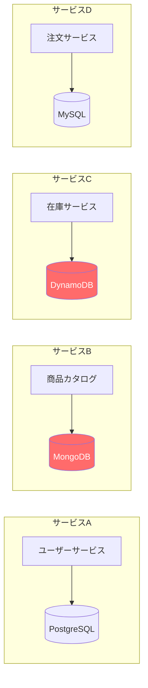

# XA（X/Open XA）異種DB間利用の調査レポート

## 1. エグゼクティブサマリー

**結論: XAは異種DB間で「問題なく使える」とは言えない。**

XA（X/Open XA）は分散トランザクションの業界標準だが、異種データベース間での利用には多くの制約・問題がある。特に以下の3つの根本的課題がある：

1. **NoSQLは対象外**: Cassandra、DynamoDB、MongoDB、Azure Cosmos DBなどのNoSQLはXAを一切サポートしない
2. **RDBMS間でも実装差異が大きい**: MySQL、PostgreSQL、Oracleそれぞれに固有の制約・バグがあり、混在環境での安定運用は困難
3. **運用リスクが高い**: ブロッキング、孤立トランザクション、レプリケーション障害など、本番環境での深刻な問題が多数報告されている

---

## 2. XA標準の概要

### 2.1 X/Open XAとは

X/Open XA（eXtended Architecture）は、X/Open（現The Open Group）が1991年に策定した分散トランザクション処理（DTP）の標準仕様である。

**主要コンポーネント:**

| コンポーネント | 役割 | 例 |
|---|---|---|
| **AP（Application Program）** | アプリケーション | Java EEアプリ、Spring Boot |
| **TM（Transaction Manager）** | トランザクション管理 | Atomikos、Narayana、Bitronix |
| **RM（Resource Manager）** | リソース管理 | MySQL、PostgreSQL、Oracle |

**2PC（Two-Phase Commit）プロトコル:**

### 2.2 XAをサポートするDB / しないDB

| カテゴリ | データベース | XAサポート | 備考 |
|---|---|---|---|
| **RDBMS** | MySQL (InnoDB) | ✅ | InnoDB限定。MyISAM等は不可 |
| | PostgreSQL | ✅ | `PREPARE TRANSACTION`経由。`max_prepared_transactions`の設定が必要 |
| | Oracle | ✅ | 最も成熟した実装 |
| | SQL Server | ✅ | MSDTC経由 |
| | MariaDB | ✅ | MySQL互換だが独自制約あり |
| **NewSQL** | CockroachDB | ❌ | 独自の分散トランザクション |
| | TiDB | ⚠️ | MySQL互換だがXA制約あり |
| | YugabyteDB | ❌ | 独自の分散トランザクション |
| **NoSQL** | Cassandra | ❌ | Lightweight Transaction(LWT)のみ |
| | DynamoDB | ❌ | TransactWriteItems/TransactGetItems（最大100項目、複数テーブル対応） |
| | MongoDB | ❌ | Multi-document transactionsのみ（XAなし） |
| | Azure Cosmos DB | ❌ | 独自のトランザクションモデル |
| | Redis | ❌ | MULTI/EXECのみ |
| **オブジェクトストレージ** | S3 | ❌ | トランザクション概念なし |

---

## 3. RDBMS間でのXA利用における具体的問題

### 3.1 MySQL固有の制約

MySQL公式ドキュメント（8.0/8.4）に記載されている制約:

| # | 制約 | 深刻度 | 詳細 |
|---|---|---|---|
| 1 | **InnoDB限定** | 高 | XAはInnoDBストレージエンジンでのみサポート |
| 2 | **レプリケーションフィルタ不可** | 高 | XAトランザクションとレプリケーションフィルタの併用は非サポート。フィルタにより空のXAトランザクションが生成されるとレプリカが停止する |
| 3 | **Statement-Basedレプリケーションで安全でない** | 高 | 並行XAトランザクションのPrepare順序逆転でデッドロック発生の可能性。`binlog_format=ROW`の使用が必須 |
| 4 | **バイナリログの分割** | 中 | XA PREPAREとXA COMMITが別々のバイナリログファイルに分かれる可能性。インターリーブされたログ |
| 5 | **XA START JOIN/RESUME未実装** | 中 | 構文は認識されるが実際には効果なし |
| 6 | **XA END SUSPEND未実装** | 中 | 同上 |
| 7 | **bqual一意性要件** | 低 | MySQL固有の制限。XA仕様にはない要件 |
| 8 | **8.0.30以前のバイナリログ非耐性** | 高 | XA PREPARE/COMMIT/ROLLBACK中の異常停止でバイナリログとストレージエンジンの不整合が発生する可能性 |
| 9 | **SERIALIZABLE分離レベルでの性能劣化** | 中 | XAトランザクションでSERIALIZABLE分離レベルを使用すると、ギャップロックの競合が激増し、デッドロックや深刻な性能劣化が発生する。ScalarDBのようにSERIALIZABLE相当の分離レベルを必要とするシステムとの組み合わせでは特に注意が必要 |

**報告されている実際のバグ:**

- [Bug #106818](https://bugs.mysql.com/106818): `REPLACE INTO`使用時のXAレプリケーション失敗
- [Bug #83295](https://bugs.mysql.com/bug.php?id=83295): XA transaction (one phase)でのレプリケーションエラー
- [Bug #99082](https://bugs.mysql.com/bug.php?id=99082): XAトランザクション+一時テーブル+ROWベースbinlogでのレプリケーション障害
- [Bug #91633](https://bugs.mysql.com/bug.php?id=91633): XAトランザクション内でのデッドロック後のレプリケーション失敗(errno 1399)

### 3.2 PostgreSQL固有の問題

PostgreSQLはXAを直接サポートせず、`PREPARE TRANSACTION`/`COMMIT PREPARED`コマンドを通じて2PCを実装する。

| # | 問題 | 深刻度 | 詳細 |
|---|---|---|---|
| 1 | **VACUUMの阻害** | 高 | Preparedトランザクションが長時間残ると、VACUUMがストレージを回収できなくなる。最悪の場合、Transaction ID Wraparound防止のためDBがシャットダウンする |
| 2 | **孤立トランザクション** | 高 | TMの障害でpreparedトランザクションが孤立すると、ロックが保持され続ける。DBの再起動でも解消されない。手動で`ROLLBACK PREPARED`が必要 |
| 3 | **ロック長期保持** | 高 | Prepared状態のトランザクションはロックを保持し続けるため、他セッションのブロッキングやデッドロックリスクが増大 |
| 4 | **max_prepared_transactions設定** | 中 | デフォルトは0（無効）。`max_connections`以上に設定しないとヒューリスティック問題が発生 |
| 5 | **Transaction interleaving未実装** | 中 | PostgreSQLのJDBCドライバで「Transaction interleaving not implemented」警告。`supportsTmJoin=false`で回避 |
| 6 | **公式ドキュメントの警告** | - | 「PREPARE TRANSACTIONはアプリケーションや対話セッションでの使用を意図していない。TMを書いているのでなければ、おそらく使うべきではない」 |

### 3.3 Oracle固有の問題

| # | 問題 | 深刻度 | 詳細 |
|---|---|---|---|
| 1 | **RAC環境での問題** | 高 | Oracle RACで、あるクラスタノードでsuspendされたトランザクションが別ノードでresumeされると問題発生 |
| 2 | **DBA_2PC_PENDINGの管理** | 中 | 孤立した分散トランザクションの手動解決が必要 |
| 3 | **XADataSource互換性** | 中 | 汎用DataSourceからXAConnectionを作成する際の互換性問題 |

### 3.4 異種RDBMS混在時の追加問題

MySQL + PostgreSQL + Oracle等を混在させた場合、上記の個別問題に加え以下が発生:

| # | 問題 | 詳細 |
|---|---|---|
| 1 | **2PC実装の差異** | 各DBのXA実装は微妙に異なり、TMが差異を吸収する必要がある。例: PostgreSQLはXA STARTではなくBEGIN + PREPARE TRANSACTIONを使用 |
| 2 | **障害回復の複雑化** | DB AはCommit済み、DB BはPrepared状態で停止した場合の回復手順が各DBで異なる |
| 3 | **タイムアウト挙動の差異** | 各DBのトランザクションタイムアウト、ロックタイムアウトの挙動が異なるため、一方のみがタイムアウトするケースが発生 |
| 4 | **ドライバの互換性** | JDBCドライバのXA実装品質がDBベンダーにより異なる。PostgreSQLのJDBCドライバはXAサポートが限定的 |
| 5 | **監視・デバッグの困難さ** | 各DBのXA状態確認コマンドが異なる（MySQL: `XA RECOVER`, PostgreSQL: `pg_prepared_xacts`, Oracle: `DBA_2PC_PENDING`） |
| 6 | **ヒューリスティック決定** | TMが決定を下す前にRMが独自にcommit/rollbackする可能性（ヒューリスティック決定）。異種DB間では各DBの判断基準が異なり、データ不整合のリスクが高まる |

---

## 4. XAの構造的な限界

### 4.1 ブロッキングプロトコル問題

XA/2PCは本質的にブロッキングプロトコルである:

**影響:**
- TMが障害を起こすと、全参加DBのトランザクションがPrepared状態で凍結
- ロックが長時間保持され、関連テーブルへの書き込みがすべてブロック
- 高可用性が要求されるシステムではSPOF（単一障害点）になる

### 4.2 パフォーマンスの制約

| 項目 | XA 2PC | ScalarDB Consensus Commit |
|---|---|---|
| **ロック期間** | PREPARE〜COMMIT間ロック保持（悲観的） | OCC（楽観的）でロック競合を軽減 |
| **ネットワークラウンドトリップ** | TM↔各RM間で最低4回（begin, prepare, commit, end） | 直接DBアクセスでオーバーヘッド削減 |
| **高並行性** | ロック競合による性能劣化が顕著 | OCCにより読み取りはロックフリー |
| **レイテンシ** | 全RMのPREPARE完了を待つ必要あり（最遅RMがボトルネック） | Write Buffering等で最適化可能 |

### 4.3 可用性の制約

- **TMのSPOF**: TMが停止すると全分散トランザクションが停止
- **Prepare後のDB障害**: Prepare済みのDBが障害を起こすとヒューリスティック決定が必要になり、データ不整合のリスク
- **ネットワーク分断**: TMとRM間のネットワーク分断でトランザクションが宙ぶらりん状態に

---

## 5. NoSQLを含む環境での状況

### 5.1 XAが完全に使えないケース

以下のNoSQLデータベースはXAプロトコルを一切サポートしていない:

| NoSQL | 独自トランザクション機能 | XAとの互換性 |
|---|---|---|
| **Cassandra** | Lightweight Transaction (LWT) - 単一パーティション内のCompare-and-Set | ❌ XAなし |
| **DynamoDB** | TransactWriteItems/TransactGetItems - 最大100項目、25テーブル | ❌ XAなし |
| **MongoDB** | Multi-document Transactions (4.0+) - レプリカセット内 | ❌ XAなし。[公式フィードバック](https://feedback.mongodb.com/forums/924280-database/suggestions/40236337-xa-support)で要望あるが未対応 |
| **Azure Cosmos DB** | Transactional Batch - 同一パーティション内 | ❌ XAなし |
| **Redis** | MULTI/EXEC - 単一ノード内 | ❌ XAなし |

### 5.2 現実のシステムにおける影響

現代のマイクロサービスアーキテクチャでは、以下の構成が一般的：

この構成でサービスA（PostgreSQL）とサービスD（MySQL）間のみXAが可能だが、サービスB（MongoDB）やサービスC（DynamoDB）を含むトランザクションはXAでは実現不可能。

---

## 6. 代替手段の比較

| 観点 | XA (2PC) | Saga | TCC | ScalarDB Consensus Commit |
|---|---|---|---|---|
| **対応DB** | XA対応RDBMSのみ | 任意（補償TXが書ければ） | 任意（Try/Confirm/Cancel実装要） | 任意（Storage Abstraction Layer経由） |
| **一貫性** | Strong (ACID) | Eventual (BASE) | Eventual〜Strong | Strong (Serializable/Snapshot Isolation) |
| **ブロッキング** | あり（悲観的ロック） | なし | 部分的（Try段階でリソース予約） | なし（OCC） |
| **実装複雑度** | 中（TM設定） | 高（補償ロジック実装） | 非常に高（3API×サービス数） | 低（SDK利用） |
| **障害回復** | 手動介入が必要な場合あり | 自動（補償TX） | 自動（Cancel） | 自動（Lazy Recovery） |
| **NoSQL対応** | ❌ | ✅ | ✅ | ✅ |
| **性能** | 低〜中 | 高 | 中〜高 | 中〜高 |
| **可用性** | TMがSPOF | 高 | 高 | 高（Coordinatorテーブルを格納するDBの高可用性構成が必要） |

---

## 7. 主要トランザクションマネージャの実績

### 7.1 Atomikos

- **対応DB**: Oracle, MySQL, PostgreSQL, SQL Server, DB2等
- **既知の問題**:
  - MySQL: 同一DBへの同一トランザクション内での複数アクセスでバグ
  - PostgreSQL: `max_prepared_transactions`の設定不備でヒューリスティック問題
  - PostgreSQL: 「Transaction interleaving not implemented」警告（`supportsTmJoin=false`で回避）
  - Oracle RAC: クラスタノード間でのtransaction suspend/resumeで問題

### 7.2 Narayana (JBoss)

- Red Hat / JBoss系の標準TM
- Jakarta EE（旧Java EE）準拠
- 異種DB間で使用可能だが、各DBドライバのXA実装品質に依存

### 7.3 Spring Boot + JTA

- Spring BootはAtomikosまたはBitronixをサポート（Spring Boot 3.xではAtomikosのみ）
- 設定例が公開されているが、本番環境での異種DB間利用の事例は限定的

---

## 8. 総合評価

### 8.1 XAが「問題なく使える」条件

以下の**すべてを満たす**場合のみ、XAは比較的安全に利用できる:

1. ✅ 全DBがRDBMS（NoSQLを含まない）
2. ✅ 全DBがXAをサポートしている（InnoDBエンジン等）
3. ✅ レプリケーションを使用しない、または`binlog_format=ROW`を使用
4. ✅ 高可用性・高スループットの要件が厳しくない
5. ✅ TM（トランザクションマネージャ）の冗長化と監視が可能
6. ✅ 孤立トランザクションの手動解決運用が確立されている
7. ✅ 同種のRDBMS間（例: MySQL同士）であること

### 8.2 XAを避けるべき条件

以下の**いずれか**に該当する場合、XAは推奨しない:

1. ❌ NoSQLデータベースが含まれる → **XA使用不可**
2. ❌ 異種RDBMS間（MySQL + PostgreSQL等） → **実装差異によるリスク大**
3. ❌ 高可用性（99.99%+）が要求される → **TMがSPOFになる**
4. ❌ 高スループット（数千TPS以上）が要求される → **ブロッキングがボトルネック**
5. ❌ マイクロサービスアーキテクチャ → **サービス間の結合度が高くなりすぎる**
6. ❌ クラウドネイティブ環境 → **マネージドDBのXAサポートが限定的な場合がある**

### 8.3 ScalarDB Consensus Commitとの比較における結論

| 観点 | XA | ScalarDB |
|---|---|---|
| 異種RDBMS間 | △ 可能だが実装差異・バグのリスクあり | ✅ Storage Abstraction Layerで吸収 |
| RDBMS + NoSQL間 | ❌ 不可 | ✅ Cassandra, DynamoDB等を含めて対応 |
| ブロッキング | ❌ 悲観的ロックで性能劣化 | ✅ OCCでロックフリー読み取り |
| 障害回復 | ❌ 手動介入が必要な場合あり | ✅ Lazy Recoveryで自動回復 |
| 運用負荷 | ❌ TMの管理、孤立TX対応が必要 | △ ScalarDB Cluster自体の運用は必要 |
| 標準準拠 | ✅ X/Open XA標準 | △ 独自プロトコル |
| エコシステム | ✅ Java EE/Jakarta EE標準 | △ ScalarDB SDK依存 |

---

## 9. 参考資料

- [X/Open XA - Wikipedia](https://en.wikipedia.org/wiki/X/Open_XA)
- [MySQL 8.0 XA Transactions](https://dev.mysql.com/doc/refman/8.0/en/xa.html)
- [MySQL 8.4 XA Transaction Restrictions](https://dev.mysql.com/doc/refman/8.4/en/xa-restrictions.html)
- [PostgreSQL PREPARE TRANSACTION](https://www.postgresql.org/docs/current/sql-prepare-transaction.html)
- [PostgreSQL Two-Phase Transactions](https://www.postgresql.org/docs/current/two-phase.html)
- [Prepared Transactions and Their Dangers (CYBERTEC)](https://www.cybertec-postgresql.com/en/prepared-transactions/)
- [Be Careful with Prepared Transactions in PostgreSQL (DBI Services)](https://www.dbi-services.com/blog/be-careful-with-prepared-transactions-in-postgresql/)
- [Oracle XA and Distributed Transactions (White Paper)](https://www.oracle.com/technetwork/products/clustering/overview/distributed-transactions-and-xa-163941.pdf)
- [Atomikos - What is XA](https://www.atomikos.com/Documentation/WhatIsXa)
- [Atomikos - Known Problems](https://www.atomikos.com/Documentation/KnownProblems)
- [Understanding XA Transactions - SQL Server JDBC](https://learn.microsoft.com/en-us/sql/connect/jdbc/understanding-xa-transactions)
- [MongoDB XA Support Request](https://feedback.mongodb.com/forums/924280-database/suggestions/40236337-xa-support)
- [Percona Blog - MySQL XA Transactions](https://www.percona.com/blog/mysql-xa-transactions/)
- [Distributed Transactions with Quarkus and JTA](https://www.the-main-thread.com/p/distributed-transactions-quarkus-jta-xa-postgresql)
- [Spring Boot Managing Multi-Database Transaction with Atomikos](https://medium.com/@ands0927/spring-boot-managing-multi-database-transaction-with-atomikos-38d53112afbb)
- [Alibaba Cloud - XA Mode of Distributed Transaction](https://www.alibabacloud.com/blog/understand-the-xa-mode-of-distributed-transaction-in-six-figures_598163)
