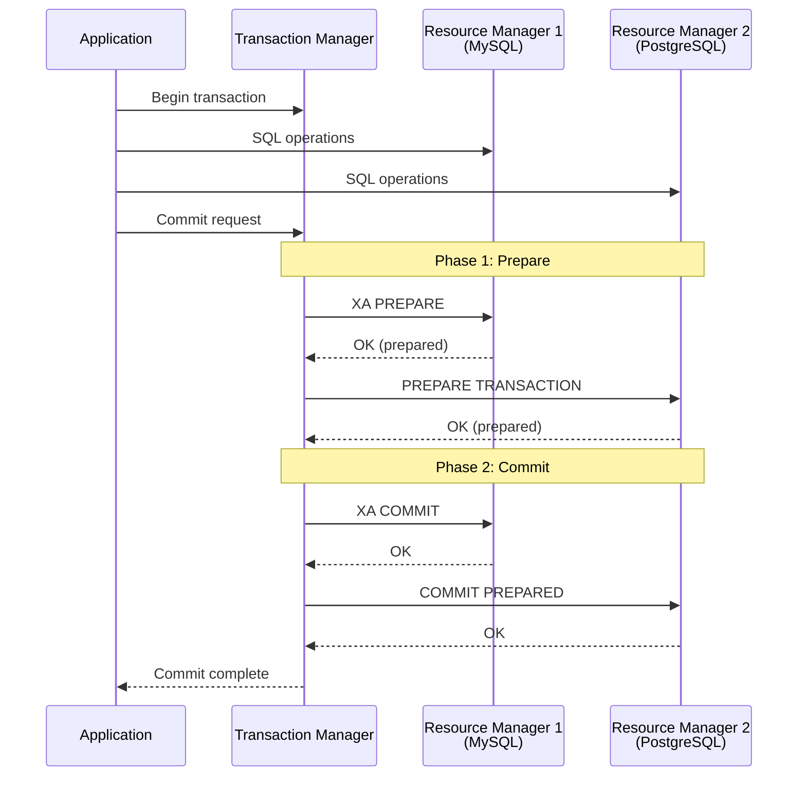
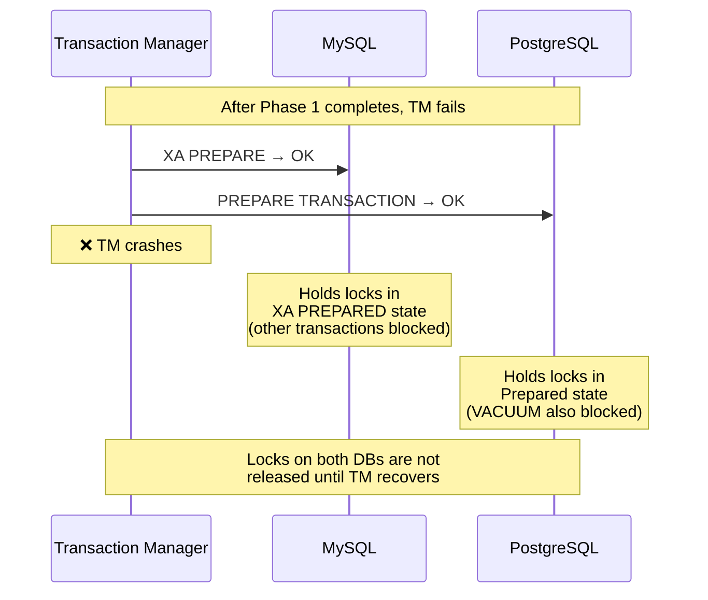
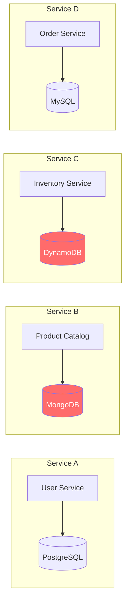

# Investigation Report on XA (X/Open XA) Usage Across Heterogeneous Databases

## 1. Executive Summary

**Conclusion: XA cannot be said to "work without issues" across heterogeneous databases.**

XA (X/Open XA) is an industry standard for distributed transactions, but its use across heterogeneous databases involves many constraints and issues. In particular, there are three fundamental challenges:

1. **NoSQL is out of scope**: NoSQL databases such as Cassandra, DynamoDB, MongoDB, and Azure Cosmos DB do not support XA at all
2. **Significant implementation differences even among RDBMSs**: MySQL, PostgreSQL, and Oracle each have their own constraints and bugs, making stable operation in mixed environments difficult
3. **High operational risk**: Numerous serious issues in production environments have been reported, including blocking, orphaned transactions, and replication failures

```mermaid
flowchart TD
    Q1{"Do you need ACID\ntransactions across\nheterogeneous DBs?"}
    Q2{"Are all DBs RDBMS?"}
    Q3{"Do all DBs support\nXA?"}
    Q4{"Do you use\nreplication?"}
    Q5{"Are high availability\nand high throughput\nrequired?"}

    Q1 -->|Yes| Q2
    Q1 -->|No| R1["Single-DB transactions\nor eventual consistency\nis sufficient"]

    Q2 -->|Yes| Q3
    Q2 -->|No (includes NoSQL)| R2["❌ XA not available\nAlternatives such as ScalarDB required"]

    Q3 -->|Yes| Q4
    Q3 -->|No| R3["❌ XA not available"]

    Q4 -->|Yes| R4["⚠️ XA + replication\nhas serious constraints"]
    Q4 -->|No| Q5

    Q5 -->|Yes| R5["⚠️ XA is likely to become\na performance bottleneck"]
    Q5 -->|No| R6["△ XA is available but\nunderstanding operational\nrisks is essential"]

    style R2 fill:#ff6b6b,color:#fff
    style R3 fill:#ff6b6b,color:#fff
    style R4 fill:#ffa07a,color:#000
    style R5 fill:#ffa07a,color:#000
    style R6 fill:#ffd700,color:#000
```

---

## 2. Overview of the XA Standard

### 2.1 What is X/Open XA?

X/Open XA (eXtended Architecture) is a standard specification for distributed transaction processing (DTP) established by X/Open (now The Open Group) in 1991.

**Key Components:**

| Component | Role | Examples |
|---|---|---|
| **AP (Application Program)** | Application | Java EE apps, Spring Boot |
| **TM (Transaction Manager)** | Transaction management | Atomikos, Narayana, Bitronix |
| **RM (Resource Manager)** | Resource management | MySQL, PostgreSQL, Oracle |

**2PC (Two-Phase Commit) Protocol:**



### 2.2 Databases That Support / Do Not Support XA

| Category | Database | XA Support | Notes |
|---|---|---|---|
| **RDBMS** | MySQL (InnoDB) | ✅ | InnoDB only. MyISAM etc. not supported |
| | PostgreSQL | ✅ | Via `PREPARE TRANSACTION`. Requires `max_prepared_transactions` setting |
| | Oracle | ✅ | Most mature implementation |
| | SQL Server | ✅ | Via MSDTC |
| | MariaDB | ✅ | MySQL-compatible but has its own constraints |
| **NewSQL** | CockroachDB | ❌ | Own distributed transactions |
| | TiDB | ⚠️ | MySQL-compatible but has XA constraints |
| | YugabyteDB | ❌ | Own distributed transactions |
| **NoSQL** | Cassandra | ❌ | Lightweight Transaction (LWT) only |
| | DynamoDB | ❌ | TransactWriteItems/TransactGetItems (up to 100 items, multi-table support) |
| | MongoDB | ❌ | Multi-document transactions only (no XA) |
| | Azure Cosmos DB | ❌ | Own transaction model |
| | Redis | ❌ | MULTI/EXEC only |
| **Object Storage** | S3 | ❌ | No transaction concept |

---

## 3. Specific Issues with XA Usage Among RDBMSs

### 3.1 MySQL-Specific Constraints

Constraints documented in the official MySQL documentation (8.0/8.4):

| # | Constraint | Severity | Details |
|---|---|---|---|
| 1 | **InnoDB only** | High | XA is only supported with the InnoDB storage engine |
| 2 | **Replication filters not supported** | High | Combining XA transactions with replication filters is not supported. If filters produce empty XA transactions, replicas will stop |
| 3 | **Unsafe with statement-based replication** | High | Potential deadlocks due to prepare order reversal of concurrent XA transactions. Use of `binlog_format=ROW` is mandatory |
| 4 | **Binary log splitting** | Medium | XA PREPARE and XA COMMIT may end up in separate binary log files. Interleaved logs |
| 5 | **XA START JOIN/RESUME not implemented** | Medium | Syntax is recognized but has no actual effect |
| 6 | **XA END SUSPEND not implemented** | Medium | Same as above |
| 7 | **bqual uniqueness requirement** | Low | MySQL-specific restriction. Not required by the XA specification |
| 8 | **Binary log non-resilience before 8.0.30** | High | Abnormal shutdown during XA PREPARE/COMMIT/ROLLBACK may cause inconsistency between binary log and storage engine |
| 9 | **Performance degradation with SERIALIZABLE isolation level** | Medium | Using SERIALIZABLE isolation level with XA transactions causes a dramatic increase in gap lock contention, leading to deadlocks and severe performance degradation. Special attention is needed when combining with systems like ScalarDB that require SERIALIZABLE-equivalent isolation levels |

**Reported actual bugs:**

- [Bug #106818](https://bugs.mysql.com/106818): XA replication failure when using `REPLACE INTO`
- [Bug #83295](https://bugs.mysql.com/bug.php?id=83295): Replication error with XA transaction (one phase)
- [Bug #99082](https://bugs.mysql.com/bug.php?id=99082): Replication failure with XA transactions + temporary tables + ROW-based binlog
- [Bug #91633](https://bugs.mysql.com/bug.php?id=91633): Replication failure after deadlock within XA transaction (errno 1399)

### 3.2 PostgreSQL-Specific Issues

PostgreSQL does not directly support XA but implements 2PC through the `PREPARE TRANSACTION`/`COMMIT PREPARED` commands.

| # | Issue | Severity | Details |
|---|---|---|---|
| 1 | **VACUUM blocking** | High | If prepared transactions persist for a long time, VACUUM cannot reclaim storage. In the worst case, the DB shuts down to prevent Transaction ID Wraparound |
| 2 | **Orphaned transactions** | High | If prepared transactions are orphaned due to TM failure, locks are held indefinitely. Not resolved even by DB restart. Manual `ROLLBACK PREPARED` is required |
| 3 | **Long-term lock holding** | High | Transactions in prepared state continue to hold locks, increasing the risk of blocking other sessions and deadlocks |
| 4 | **max_prepared_transactions setting** | Medium | Default is 0 (disabled). Heuristic issues occur if not set higher than `max_connections` |
| 5 | **Transaction interleaving not implemented** | Medium | "Transaction interleaving not implemented" warning in PostgreSQL JDBC driver. Workaround: `supportsTmJoin=false` |
| 6 | **Official documentation warning** | - | "PREPARE TRANSACTION is not intended for use in applications or interactive sessions. Unless you are writing a TM, you probably should not use it" |

### 3.3 Oracle-Specific Issues

| # | Issue | Severity | Details |
|---|---|---|---|
| 1 | **Issues in RAC environments** | High | In Oracle RAC, problems occur when a transaction suspended on one cluster node is resumed on another node |
| 2 | **DBA_2PC_PENDING management** | Medium | Manual resolution of orphaned distributed transactions required |
| 3 | **XADataSource compatibility** | Medium | Compatibility issues when creating XAConnection from a generic DataSource |

### 3.4 Additional Issues When Mixing Heterogeneous RDBMSs

When mixing MySQL + PostgreSQL + Oracle etc., the following issues arise in addition to the individual issues above:

| # | Issue | Details |
|---|---|---|
| 1 | **Differences in 2PC implementation** | Each DB's XA implementation differs subtly, and the TM needs to absorb the differences. Example: PostgreSQL uses BEGIN + PREPARE TRANSACTION instead of XA START |
| 2 | **Complexity of failure recovery** | Recovery procedures differ for each DB when DB A has committed and DB B has stopped in prepared state |
| 3 | **Differences in timeout behavior** | Transaction timeout and lock timeout behaviors differ across DBs, causing cases where only one side times out |
| 4 | **Driver compatibility** | XA implementation quality in JDBC drivers varies by DB vendor. PostgreSQL's JDBC driver has limited XA support |
| 5 | **Difficulty of monitoring and debugging** | XA status check commands differ across DBs (MySQL: `XA RECOVER`, PostgreSQL: `pg_prepared_xacts`, Oracle: `DBA_2PC_PENDING`) |
| 6 | **Heuristic decisions** | RMs may independently commit/rollback before TM makes a decision (heuristic decisions). Across heterogeneous DBs, each DB's decision criteria differ, increasing the risk of data inconsistency |

---

## 4. Structural Limitations of XA

### 4.1 Blocking Protocol Problem

XA/2PC is inherently a blocking protocol:



**Impact:**
- If the TM fails, transactions on all participating DBs are frozen in prepared state
- Locks are held for an extended period, blocking all writes to related tables
- Becomes a SPOF (Single Point of Failure) in systems requiring high availability

### 4.2 Performance Constraints

| Item | XA 2PC | ScalarDB Consensus Commit |
|---|---|---|
| **Lock duration** | Locks held between PREPARE and COMMIT (pessimistic) | OCC (optimistic) reduces lock contention |
| **Network round trips** | At least 4 between TM and each RM (begin, prepare, commit, end) | Reduced overhead with direct DB access |
| **High concurrency** | Significant performance degradation due to lock contention | Lock-free reads with OCC |
| **Latency** | Must wait for all RMs to complete PREPARE (slowest RM is the bottleneck) | Optimizable with Write Buffering etc. |

### 4.3 Availability Constraints

- **SPOF of TM**: All distributed transactions stop when TM is down
- **DB failure after Prepare**: If a prepared DB fails, heuristic decisions are required, risking data inconsistency
- **Network partition**: Network partition between TM and RM leaves transactions in limbo

---

## 5. Situation in Environments Including NoSQL

### 5.1 Cases Where XA Is Completely Unavailable

The following NoSQL databases do not support the XA protocol at all:

| NoSQL | Own Transaction Feature | XA Compatibility |
|---|---|---|
| **Cassandra** | Lightweight Transaction (LWT) - Compare-and-Set within a single partition | ❌ No XA |
| **DynamoDB** | TransactWriteItems/TransactGetItems - up to 100 items, 25 tables | ❌ No XA |
| **MongoDB** | Multi-document Transactions (4.0+) - within a replica set | ❌ No XA. [Official feedback](https://feedback.mongodb.com/forums/924280-database/suggestions/40236337-xa-support) request exists but not addressed |
| **Azure Cosmos DB** | Transactional Batch - within the same partition | ❌ No XA |
| **Redis** | MULTI/EXEC - within a single node | ❌ No XA |

### 5.2 Impact on Real-World Systems

In modern microservices architecture, the following configurations are common:



In this configuration, XA is only possible between Service A (PostgreSQL) and Service D (MySQL), but transactions that include Service B (MongoDB) or Service C (DynamoDB) cannot be achieved with XA.

---

## 6. Comparison of Alternatives

| Aspect | XA (2PC) | Saga | TCC | ScalarDB Consensus Commit |
|---|---|---|---|---|
| **Supported DBs** | XA-compatible RDBMS only | Any (if compensation TXs can be written) | Any (requires Try/Confirm/Cancel implementation) | Any (via Storage Abstraction Layer) |
| **Consistency** | Strong (ACID) | Eventual (BASE) | Eventual to Strong | Strong (Serializable/Snapshot Isolation) |
| **Blocking** | Yes (pessimistic locking) | No | Partial (resource reservation at Try stage) | No (OCC) |
| **Implementation complexity** | Medium (TM configuration) | High (compensation logic implementation) | Very high (3 APIs x number of services) | Low (using SDK) |
| **Failure recovery** | May require manual intervention | Automatic (compensation TXs) | Automatic (Cancel) | Automatic (Lazy Recovery) |
| **NoSQL support** | ❌ | ✅ | ✅ | ✅ |
| **Performance** | Low to medium | High | Medium to high | Medium to high |
| **Availability** | TM is a SPOF | High | High | High (requires HA configuration for the DB storing the Coordinator table) |

---

## 7. Track Record of Major Transaction Managers

### 7.1 Atomikos

- **Supported DBs**: Oracle, MySQL, PostgreSQL, SQL Server, DB2, etc.
- **Known issues**:
  - MySQL: Bug with multiple accesses to the same DB within the same transaction
  - PostgreSQL: Heuristic issues due to misconfigured `max_prepared_transactions`
  - PostgreSQL: "Transaction interleaving not implemented" warning (workaround: `supportsTmJoin=false`)
  - Oracle RAC: Issues with transaction suspend/resume across cluster nodes

### 7.2 Narayana (JBoss)

- Standard TM for Red Hat / JBoss ecosystem
- Jakarta EE (formerly Java EE) compliant
- Can be used across heterogeneous DBs, but depends on XA implementation quality of each DB driver

### 7.3 Spring Boot + JTA

- Spring Boot supports Atomikos or Bitronix (Spring Boot 3.x supports Atomikos only)
- Configuration examples are published, but production use cases across heterogeneous DBs are limited

---

## 8. Overall Assessment

### 8.1 Conditions Where XA Can Be "Used Without Issues"

XA can be used relatively safely only when **all** of the following are met:

1. ✅ All DBs are RDBMS (no NoSQL)
2. ✅ All DBs support XA (InnoDB engine, etc.)
3. ✅ Replication is not used, or `binlog_format=ROW` is used
4. ✅ High availability and high throughput requirements are not strict
5. ✅ Redundancy and monitoring of the TM (Transaction Manager) are possible
6. ✅ Operational procedures for manually resolving orphaned transactions are established
7. ✅ Same type of RDBMS (e.g., MySQL to MySQL)

### 8.2 Conditions Where XA Should Be Avoided

If **any** of the following apply, XA is not recommended:

1. ❌ NoSQL databases are included → **XA not available**
2. ❌ Heterogeneous RDBMSs (MySQL + PostgreSQL, etc.) → **High risk due to implementation differences**
3. ❌ High availability (99.99%+) is required → **TM becomes a SPOF**
4. ❌ High throughput (thousands of TPS or more) is required → **Blocking becomes a bottleneck**
5. ❌ Microservices architecture → **Coupling between services becomes too tight**
6. ❌ Cloud-native environment → **XA support of managed DBs may be limited**

### 8.3 Conclusion in Comparison with ScalarDB Consensus Commit

| Aspect | XA | ScalarDB |
|---|---|---|
| Across heterogeneous RDBMS | △ Possible but risk of implementation differences and bugs | ✅ Absorbed by Storage Abstraction Layer |
| RDBMS + NoSQL | ❌ Not possible | ✅ Supports Cassandra, DynamoDB, etc. |
| Blocking | ❌ Performance degradation with pessimistic locking | ✅ Lock-free reads with OCC |
| Failure recovery | ❌ May require manual intervention | ✅ Automatic recovery with Lazy Recovery |
| Operational burden | ❌ TM management and orphaned TX handling required | △ Operating ScalarDB Cluster itself is required |
| Standards compliance | ✅ X/Open XA standard | △ Proprietary protocol |
| Ecosystem | ✅ Java EE/Jakarta EE standard | △ Depends on ScalarDB SDK |

---

## 9. References

- [X/Open XA - Wikipedia](https://en.wikipedia.org/wiki/X/Open_XA)
- [MySQL 8.0 XA Transactions](https://dev.mysql.com/doc/refman/8.0/en/xa.html)
- [MySQL 8.4 XA Transaction Restrictions](https://dev.mysql.com/doc/refman/8.4/en/xa-restrictions.html)
- [PostgreSQL PREPARE TRANSACTION](https://www.postgresql.org/docs/current/sql-prepare-transaction.html)
- [PostgreSQL Two-Phase Transactions](https://www.postgresql.org/docs/current/two-phase.html)
- [Prepared Transactions and Their Dangers (CYBERTEC)](https://www.cybertec-postgresql.com/en/prepared-transactions/)
- [Be Careful with Prepared Transactions in PostgreSQL (DBI Services)](https://www.dbi-services.com/blog/be-careful-with-prepared-transactions-in-postgresql/)
- [Oracle XA and Distributed Transactions (White Paper)](https://www.oracle.com/technetwork/products/clustering/overview/distributed-transactions-and-xa-163941.pdf)
- [Atomikos - What is XA](https://www.atomikos.com/Documentation/WhatIsXa)
- [Atomikos - Known Problems](https://www.atomikos.com/Documentation/KnownProblems)
- [Understanding XA Transactions - SQL Server JDBC](https://learn.microsoft.com/en-us/sql/connect/jdbc/understanding-xa-transactions)
- [MongoDB XA Support Request](https://feedback.mongodb.com/forums/924280-database/suggestions/40236337-xa-support)
- [Percona Blog - MySQL XA Transactions](https://www.percona.com/blog/mysql-xa-transactions/)
- [Distributed Transactions with Quarkus and JTA](https://www.the-main-thread.com/p/distributed-transactions-quarkus-jta-xa-postgresql)
- [Spring Boot Managing Multi-Database Transaction with Atomikos](https://medium.com/@ands0927/spring-boot-managing-multi-database-transaction-with-atomikos-38d53112afbb)
- [Alibaba Cloud - XA Mode of Distributed Transaction](https://www.alibabacloud.com/blog/understand-the-xa-mode-of-distributed-transaction-in-six-figures_598163)
