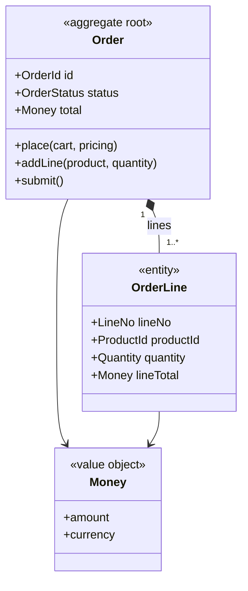

# Aggregate Design

Applies whenever a skill **designs, reviews, or generates code for the tactical model inside a
bounded context**: `/architect:design-aggregate` above all, plus `design-state-machine`,
`design-scalardb` / `design-data-layer`, `design-implementation`, the code generators, the
test-spec generator and the reviews that consume its output.

Strategic design (`redesign`, `map-domains`) decides *where the boundaries between contexts are*.
This rule governs the next decision, which no schema and no API can make on its own: *which objects
change together, under which invariants, in one transaction*. An aggregate is that unit. In a
ScalarDB system it is also, and not by coincidence, the unit of optimistic concurrency and the
scope of a local transaction — so an aggregate boundary nobody designed is a transaction boundary
nobody designed.

## 1. What earns an aggregate

Model a cluster of objects as one aggregate when **all three** hold:

1. It has an **invariant that spans more than one attribute or more than one object** and must be
   true at the end of every transaction (`sum(lines) == total`, `at most one primary address`,
   `a shipped order cannot lose a line`). An object with no cross-attribute invariant is an entity
   inside someone else's aggregate, or a value.
2. It has a **root** — one entity through which every change enters, holding the identity the rest
   of the system refers to. Outsiders hold the root's ID, never a reference into the interior.
3. It is **the unit a transaction writes**. Every command changes exactly one aggregate; the
   aggregate is small enough that two users editing different orders never contend, and large
   enough that its invariant can be checked without reading a second aggregate.

Do **not** mint an aggregate for: a lookup or reference-data table, a value that has no identity of
its own (an address, a money amount — those are value objects, §2), or "everything that belongs to
the customer" — a cluster held together by navigation convenience rather than by an invariant is a
large aggregate, and a large aggregate is the design defect this rule exists to prevent (§4).

**One aggregate, one lifecycle.** When the aggregate has a state machine
(@rules/state-modeling.md §1), the state is the root's state. Two independent lifecycles inside one
aggregate is evidence that the boundary is wrong — the same evidence, read from the other side.

## 2. The building blocks

Every element is named in the ubiquitous language, and each has a place in the manifest the skill
emits:

| Element | Definition | Must record |
|---------|-----------|-------------|
| **Aggregate root** | The entity that owns the identity and guards every change | Identity, the invariants it enforces, the state column when it has a lifecycle |
| **Entity** (interior) | An object with identity that lives only inside the aggregate | Its identity scope — local to the root, never referenced from outside |
| **Value object** | An object defined by its attributes, immutable, compared by value | Its attributes and the validation that makes an instance legal (`amount >= 0`, ISO currency) |
| **Invariant** | A predicate that holds at the end of every transaction on this aggregate | Statement, which commands can violate it, how the root enforces it |
| **Command** | A request to change the aggregate, handled by the root | Actor, guard, the invariants it must preserve, the event it emits, its consistency class |
| **Domain event** | A fact the aggregate publishes after a command succeeds | Its payload (IDs and values, never the whole aggregate), whether it is emitted after commit |
| **Factory** | The creation rule when constructing a valid aggregate takes more than a constructor | Which invariants must already hold at birth and where the inputs come from |
| **Specification** | A named, reusable business rule that answers yes/no about an aggregate | Its predicate, the commands and queries that apply it |
| **Repository** | The collection abstraction for the root — one per aggregate, never per entity | Lookup keys, whether it loads the whole aggregate, the consistency it reads with |

**Value objects before entities.** Anything without identity of its own is a value object. Giving
an `Address` a surrogate key because the table needs one is a persistence concern leaking into the
model; the schema can have the key, the model does not. Every attribute group with its own
validation rule (money, quantity with unit, period, email, coordinates) is a value object
candidate, and `define-data-model`'s entity list is where to look for the ones it promoted by
mistake.

**A factory is named only when creation has a rule.** `new Order(customerId)` is not a factory.
`Order.place(cart, pricing, customer)` that must produce an order whose total equals the priced
lines — that is, because the invariant must hold from the first moment and the inputs come from
three places. Record it as a creation command (the same one @rules/state-modeling.md §2 calls the
creation event) and name what it needs.

**A specification is a rule that more than one caller asks.** `CanBeShipped`, `IsOverdue`,
`EligibleForDiscount`: if a guard, a query filter and a report all embed the same predicate, it is a
specification, extracted once so the three cannot drift. A predicate one command evaluates once is a
guard, not a specification.

## 3. Well-formedness rules

An aggregate design is not written out until all seven hold. Each is mechanically checkable and
each is asserted by `tools/lib/aggregate_manifest.py` against the manifest the skill emits.

1. **Exactly one root**, and it is the identity outsiders hold.
2. **At least one invariant**, stated as a predicate. An aggregate with none is a table with a
   class name — either find the invariant that justified the boundary or dissolve the aggregate
   into its owner.
3. **Every invariant is protected by the root** — it names at least one command that can violate
   it and is checked inside that command's transaction. An invariant no command can violate is
   documentation, not a rule; an invariant checked outside the transaction is a race.
4. **Every command names an actor, a consistency class and the event it emits** (or states it
   emits none). A command nobody is authorized to send, or whose transactional scope is unknown, is
   not designed yet.
5. **Interior entities and value objects are reachable only through the root.** No repository for
   an interior entity, no external reference to an interior identity.
6. **Other aggregates are referenced by identity only.** A member whose type is another aggregate's
   root is a boundary defect: hold its ID, and if the invariant genuinely needs the other
   aggregate's state, the transaction has two aggregates — say so (§4).
7. **Every name exists in the ubiquitous language** (`reports/01_analysis/ubiquitous-language.md`
   or the product `ubiquitous-language.md`), or its addition is proposed explicitly.

## 4. Size and the transaction boundary

- **One command, one aggregate, one transaction** is the design target. Under ScalarDB's
  optimistic concurrency control the aggregate is the natural OCC scope: keys designed so that one
  aggregate's records share a partition, and so that two aggregates never do beyond what the
  business requires (@rules/scalardb-schema-design.md).
- **A transaction that must write two aggregates is a decision, not an accident.** Either the
  invariant truly spans both — then say which one is the transaction's owner and classify the
  command `distributed` (one ACID transaction across services — shared cluster / Global Transaction
  API / 2PC, @rules/scalardb-2pc-patterns.md) — or it does not, and the second write happens in a
  reaction to the first's event, classified `saga` with a compensation
  (@rules/scalardb-saga-patterns.md). Record the choice on the command. Never leave a two-aggregate
  write classified `local`.
- **Eventual consistency between aggregates is the default, not a compromise.** Invariants inside
  an aggregate are transactional; rules between aggregates are enforced by events and reactions.
  A rule that "must" be transactional across two aggregates is either a mis-drawn boundary or a
  genuine `distributed` case; the design says which.
- **Small aggregates win.** More than roughly a dozen attributes on the root plus interior, or an
  interior collection with no upper bound (every line of every order a customer ever placed), is
  evidence of state the invariant does not need. Extract the part with its own invariant into its
  own aggregate, referenced by ID.
- **Load what the invariant needs.** A repository that loads the whole aggregate to check one
  invariant is the honest default; a repository that loads part of it must say which invariants
  it can no longer enforce.

## 5. Concrete examples

Every aggregate document carries at least one **concrete example per invariant** — an instance
with real values, a command applied to it, and the outcome: the invariant holds and the event is
emitted, or the invariant is violated and the command is rejected with the named outcome. These are
not decoration: they are what `generate-test-specs` turns into property and unit tests, and they are
the fastest way for a domain expert to spot an invariant that is stated wrong. An invariant with no
example is one nobody has tried.

When `/product:example-map` has run, its `EX-` examples for the features that map to this
aggregate's commands are the first candidates; an invariant they do not exercise still needs one.

## 6. Diagrams

Use `classDiagram`, per @rules/mermaid-best-practices.md — one per aggregate:

- Stereotype every class: `<<aggregate root>>`, `<<entity>>`, `<<value object>>`.
- Composition (`*--`) only inside the aggregate; a reference to another aggregate is an attribute
  typed as that aggregate's ID, never an association arrow to its class.
- Identifiers stay ASCII/English; display labels follow `options.output_language`.

## 7. What downstream consumes

| Consumer | What it takes |
|----------|---------------|
| `design-state-machine` | The root and its commands — a command with a guard on the root's condition is a transition; the aggregate list is Stage 1's candidate list |
| `design-scalardb` / `design-data-layer` | The aggregate as the OCC scope and partition-key design unit; interior entities and value objects as the tables/columns of one aggregate; the repository interface per root |
| `design-api` | Commands become operations on the root's resource; interior entities are sub-resources, never top-level; invariant violations become registered problem types |
| `design-implementation` | The domain layer skeleton: root, entities, value objects, factory, specifications, one repository interface per aggregate |
| `generate-scalardb-code` / `generate-api-code` | Invariants enforced in the root — never in a controller, never only in the UI — and value objects validated on construction |
| `generate-test-specs` / `generate-scalardb-code` | One example test per `positive` / `negative` example, and one jqwik property per invariant over generated valid instances driving the root — *invariant holds or command rejected* — with the value objects' validation rules as the generators |
| `review-consistency` / `review-scalardb` / `review-data-integrity` | The seven rules of §3, and whether the schema and the transaction design still agree with the boundaries |

**Enforcement lives in the root.** An invariant documented here and enforced in a service or a
controller is enforced nowhere: the second caller — a batch job, another service, a support script —
bypasses it. The root rejects its own illegal changes.
