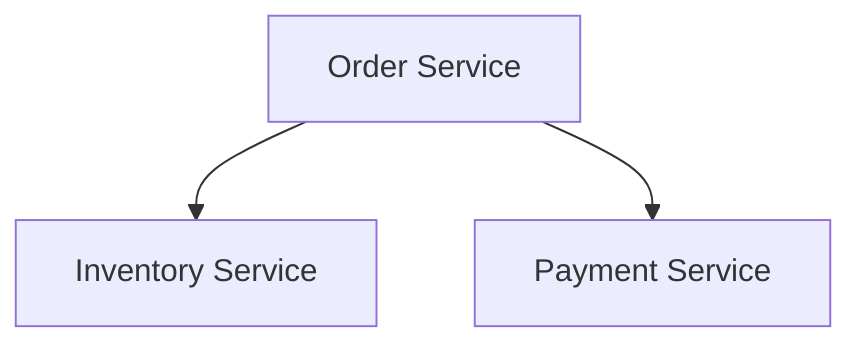

# Mermaid Best Practices

## Valid Diagram Types

graph, flowchart, sequenceDiagram, classDiagram, stateDiagram, erDiagram,
journey, gantt, pie, mindmap, timeline, C4Context

## Non-ASCII Text

Nodes whose labels contain non-ASCII text (e.g., localized labels in Japanese or
other non-Latin scripts, when output_language is not "en") must be wrapped in quotes.
The label text itself follows the configured output language; the node IDs stay ASCII:

## Node ID Naming

- Use short English identifiers: `OrderSvc`, `InventoryDB`
- Use the configured language for labels, never for IDs
- IDs must be unique and descriptive

## Common Syntax Errors

| Error | Cause | Fix |
|-------|-------|-----|
| Mismatched brackets | Unbalanced `[` and `]` | Verify opening and closing brackets |
| Arrow syntax | Using `->` instead of `-->` | Use the correct arrow syntax |
| Special characters | `(`, `)` inside labels | Wrap in quotes |
| Empty block | `\`\`\`mermaid` immediately followed by `\`\`\`` | Add content |

## Complexity Guidelines

- Maximum of 20 nodes per diagram
- Split complex diagrams and show cross-references
- Use subgraphs for logical grouping
