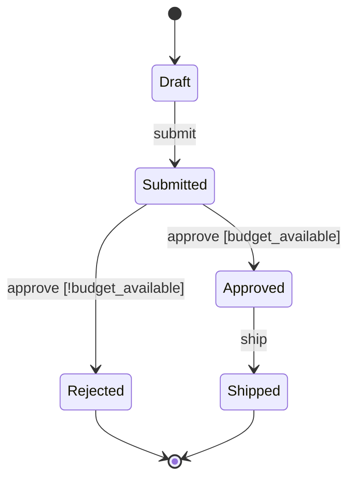

# State Transition Modeling

Applies whenever a skill **models, reviews, or generates code for an object that has a lifecycle**:
`/architect:design-state-machine` above all, plus the data-layer, API, test-spec, code-generation
and review skills that consume its output.

A state transition model is the answer to one question a prose design never answers precisely:
*given what this object is now, which changes are legal, who may make them, and what happens to the
attempts that are not legal?* Everything below exists to keep that answer complete rather than
plausible.

## 1. What earns a state machine

Model an object as a state machine when **all three** hold:

1. It has a named condition that changes over time and is visible to the business (`Draft`,
   `Reserved`, `Shipped`), not merely a derived flag.
2. Some operations are legal in one condition and illegal in another — the object's behaviour,
   not just its data, depends on the condition.
3. Getting an illegal change wrong has a cost: money moved twice, stock reserved for nobody, an
   audit trail that cannot explain itself.

Do **not** mint a machine for: a boolean that is only ever read (`is_active` with no guarded
transitions), a value that changes freely in any direction with no rules, or a workflow that belongs
to a human process outside the system. A machine per aggregate root is the norm; a machine per
attribute is a smell.

**One aggregate, one machine.** The state of an aggregate is the state of its root. If two parts of
one aggregate need independent lifecycles, that is evidence the aggregate boundary is wrong, or that
the second lifecycle belongs to a separate machine with its own aggregate — decide which, and record
the decision. Do not model orthogonal regions inside one machine unless the two regions genuinely
never interact.

## 2. The model

Five element types, and every one of them is named in the ubiquitous language:

| Element | Definition | Must record |
|---------|-----------|-------------|
| **State** | A named condition of the aggregate in which a specific set of operations is legal | The invariant that holds while in it, and what it permits/forbids |
| **Event** | What triggers a change — a command from an actor, an integration event, a timer | Its source: `command` \| `event` \| `timeout` \| `schedule` |
| **Transition** | `(from state, event) [guard] → to state` | Guard, effect, actor/role, consistency class, idempotency |
| **Guard** | A predicate that must hold for the transition to fire | What happens when it is false — never left implicit (§4) |
| **Effect** | The side effect the transition performs besides changing state | Whether it is transactional with the state write, or emitted after commit |

**Terminal states are declared, not inferred.** A state with no outgoing transition is either a
declared terminal state or a defect; the model says which.

**Creation is an event, not a transition.** The command that brings the aggregate into being
(`place`, `open`, `register`) is listed among the events with its guard and its actor, but it has no
`from` state and appears in no transition: its target is the initial state and its guard failing
means *no aggregate* — a rejected creation, never a `Cancelled` row. It still earns a column in the
matrix (§4), because it can reach an **existing** aggregate in exactly one way: a redelivery of the
same request (same idempotency key). Every cell in that column is therefore decided by the creation
command's idempotency contract — `ignore` (return the original outcome) where the API replays, and
never `allow`, since a fresh request creates a fresh aggregate and reaches no existing one.

Two shapes the paragraph above does not cover, both decided explicitly rather than by default:

- **Business-keyed aggregates.** When the identity is a business key (`Reservation` =
  `orderId + productId`, `Payment` = `orderId`), a *fresh* request can reach an existing aggregate
  — a second `charge` for the same order. The creation column then carries one verdict for the
  whole column, chosen from the aggregate's own uniqueness invariant: `ignore` (return the existing
  one — the idempotent-create reading) or `reject` (a registered problem type such as
  `already-exists`). Say which and why in the document.
- **Create-then-confirm factories.** A command that creates the aggregate in a provisional state
  and later settles it on an external answer (`charge` → `PENDING`, PSP reply → `SUCCESS`) is
  **two** events: the creation (no `from`, per above) and the settling event, named from the API
  or the ubiquitous language (`record_payment`) — and proposed as a UL addition when neither names
  it. One verb doing both violates rule 1 (creation appears in a transition).

A guard that reads **another aggregate's** state (`pivot_passed` on the order process while
expiring a reservation) is a specification that aggregate exposes, evaluated on a read in the same
transaction when both live on one datastore and on a snapshot otherwise; name the aggregate and the
read in the transition's `guard`, and expect `review-consistency` to check the direction agrees
with the context map.

## 3. Well-formedness rules

A state machine is not written out until all seven hold. Each is mechanically checkable and each is
asserted by `tools/lib/state_machine_manifest.py` against the manifest the skill emits.

1. **Exactly one initial state**, and it is reachable by creation only.
2. **Every state is reachable** from the initial state by some sequence of transitions.
3. **No undeclared dead end** — every non-terminal state has at least one outgoing transition.
4. **Determinism** — no two transitions share `(from state, event)` unless their guards are stated
   and mutually exclusive. Two unguarded transitions on the same pair are a defect, not a choice.
5. **Every guard has an else branch** — what happens when the event arrives in this state and the
   guard is false is recorded on the transition itself (`else`), not left as an unwritten
   assumption. The matrix (§4) cannot hold it: that cell is `allow`, because the event *is* legal
   here — the guard decides between outcomes, not between legal and illegal.
6. **Every transition names an actor and a consistency class** (§5). A transition nobody is
   authorized to fire, or whose transactional scope is unknown, is not designed yet.
7. **Every state and event name exists in the ubiquitous language** (`reports/01_analysis/
   ubiquitous-language.md`) — or the model proposes the addition explicitly rather than inventing a
   synonym.

## 4. The state × event matrix

The diagram shows what is legal. The **matrix shows what happens to everything else**, and that is
where the defects live. Build it with one row per state, one column per event, and **no empty
cells** — every cell carries one of four verdicts:

| Verdict | Meaning | Typical response |
|---------|---------|------------------|
| `allow` | A defined transition fires | The target state |
| `reject` | Illegal in this state; the attempt is an error | 409/422 with a registered problem type (@rules/api-error-standard.md) for a **business** rejection; a cell that only an orchestration bug can reach (a settlement for a payment that was never requested) is protocol misuse — 500 `internal-error` plus an alert, not a 409 the client is invited to handle |
| `ignore` | Legal but a no-op — the event has already been applied | Success, unchanged state (this is what makes retries safe) |
| `defer` | Legal but not yet — the event is queued or re-delivered later | Accepted, applied on a later transition |

The `ignore` cells are the idempotency design. Deciding them by default — "a duplicate event is an
error" — is what turns an at-least-once delivery into a support ticket.

Two things are easy to conflate here. A **fresh** occurrence of an event after the transition has
committed — the customer clicks *submit* again — reaches the aggregate in its new state, and the
`(to state, event)` cell above decides it. A **redelivery of the same request** — the same
idempotency key, a retried message, a duplicate webhook — is the transition's own `idempotency`
verdict: `ignore` returns the original outcome without re-executing the effect, `reject` reports the
key reuse. There is no third value: "fire again" for a committed transition is by definition the
matrix cell, never the transition.

## 5. Concurrency and consistency

A transition is a **transaction**, and treating it as anything less is the failure mode this section
exists to prevent.

- **Read-check-write is one transaction.** The guard is evaluated on the state read *inside* the
  transaction that writes the new state. A guard checked before the transaction begins is not a
  guard; it is a race with a comment.
- **Write the contention table.** One row per pair of transitions that can be fired against the
  same aggregate by different actors — orchestrator vs. recovery worker, request path vs. sweeper,
  two clients on one key — naming **who wins** (the first commit, the lease holder, the first
  arrival) and **what the loser does** (re-read and re-evaluate, retreat until the next sweep,
  return `409`). A pair with no row is a race nobody designed.
- **Concurrent transitions conflict, by design.** Under ScalarDB's optimistic concurrency control,
  two actors firing transitions from one state means one commits and one fails — that is correct.
  What must be designed is what the loser does: retry (re-reading the state and re-evaluating the
  guard, which may now `reject`), or surface a conflict. Never retry a transition without
  re-evaluating its guard. Design keys so the contended transitions do not share a partition beyond
  what the business requires (@rules/scalardb-schema-design.md).
- **Classify every transition.** `local` (one service, one datastore), `distributed` (one ACID
  transaction across services — shared cluster / Global Transaction API / 2PC), or `saga` (steps
  with compensation). The classification comes from `scalardb-transaction.md` when it exists, and
  feeds it when it does not (@rules/scalardb-2pc-patterns.md, @rules/scalardb-saga-patterns.md).
- **A compensation is a transition.** A saga that rolls back moves the aggregate to a real state —
  `PaymentFailed`, `ReservationReleased` — that appears in the model with its own row. A
  compensation that "returns to the previous state" is almost always wrong: the aggregate has been
  observed in the intermediate state, and the history matters.
- **Timeouts are transitions with a sweeper.** A state that expires names: the deadline, the state
  it expires into, who fires it (a scheduled sweeper, not the request path), and how the sweeper's
  write races with a concurrent legitimate transition — both cannot win.
- **`UnknownTransactionStatusException` is not a rejected transition.** The transition may have
  committed. The model records how the caller re-establishes the state before retrying
  (@rules/scalardb-exception-handling.md).

## 6. Persistence and history

Two decisions the model must make, because the data design cannot make them alone:

- **The current state** is one column on the aggregate root, storing the state name verbatim — not
  an ordinal, whose meaning shifts the day a state is inserted. Constrain the permitted values in
  the application, and treat the column as part of the aggregate's OCC scope.
- **The transition history** is a separate append-only record (`from`, `to`, `event`, actor,
  timestamp, correlation id) whenever any of these apply: the business asks "why is it in this
  state?", the transition moves money or goods, or an auditor will. Decide it explicitly; a history
  nobody designed is a history nobody has.

## 7. Diagrams

Use `stateDiagram-v2`, per @rules/mermaid-best-practices.md:

- State identifiers stay ASCII/English; display labels follow `options.output_language` and are
  quoted when non-ASCII.
- Label every arrow `event [guard]` — an unlabelled arrow is an undesigned transition.
- One diagram per machine. When a machine exceeds roughly 12 states, that is evidence of state
  explosion: extract a sub-lifecycle into its own machine (§1) rather than shrinking the font.

## 8. What downstream consumes

| Consumer | What it takes |
|----------|---------------|
| `design-scalardb` / `design-data-layer` | The state column, its OCC scope, the history table, and the per-transition consistency class |
| `design-api` | Transitions become operations; `reject` cells become registered problem types; `ignore` cells become the idempotency contract |
| `generate-test-specs` / `generate-contract-tests` | Transition coverage (every `allow` fires), rejection coverage (every `reject` returns the contracted error), idempotency (every `ignore` replays cleanly) |
| `generate-scalardb-code` / `generate-api-code` | Guards enforced server-side in exactly one place — the aggregate — never in a controller and never only in the UI |
| `review-consistency` / `review-risk` | The seven rules of §3, and whether the design documents still agree with the model |

**Enforcement lives in the domain.** A state machine documented in a report and enforced in a
controller is enforced nowhere: the second caller — a batch job, another service, a support script —
bypasses it. The aggregate rejects its own illegal transitions.
