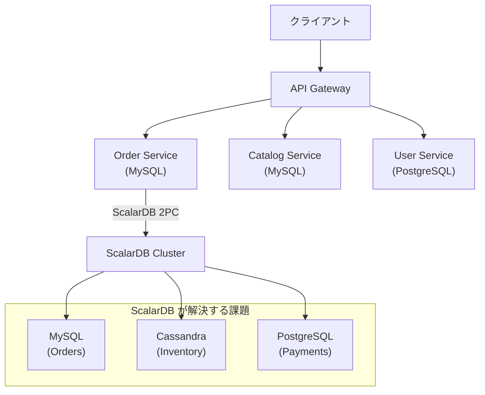

# EC Monolith — nexus-architect 検証用サンプルプロジェクト

このプロジェクトは **nexus-architect** エージェントの動作検証用に作成されたサンプルアプリケーションです。Spring Boot + JPA で実装された EC サイトモノリスで、意図的な技術負債とセキュリティ課題を含みます。

---

## クイックスタート

```bash
# 1. MySQL 起動
docker-compose up -d

# 2. 起動確認（MySQL が Ready になるまで待つ）
docker-compose ps

# 3. アプリケーション起動
./gradlew bootRun
```

起動後、以下にアクセスできます：
- **Swagger UI**: http://localhost:8080/swagger-ui.html
- **API ドキュメント**: http://localhost:8080/api-docs

---

## サンプルデータ

起動時に自動投入されます：

| ユーザー | メール | パスワード | ロール |
|------|------|----------|------|
| 管理者 | admin@example-ec.com | admin1234 | ADMIN |
| Alice Tanaka | alice@example.com | pass1234 | CUSTOMER |
| Bob Yamamoto | bob@example.com | pass5678 | CUSTOMER |
| Carol Sato | carol@example.com | pass9012 | CUSTOMER |

商品: 10件（Electronics・Peripherals・Accessories・Wearables）、各50個在庫

---

## API 使用例

```bash
# 商品検索（SQLインジェクション脆弱性の確認）
curl "http://localhost:8080/api/products/search?keyword=スマート"
curl "http://localhost:8080/api/products/search?keyword=' OR '1'='1"  # 全件返却される

# ユーザー登録
curl -X POST http://localhost:8080/api/auth/register \
  -H "Content-Type: application/json" \
  -d '{"email":"test@example.com","password":"mypass","name":"Test User"}'

# 注文確定（Basic 認証）
curl -X POST http://localhost:8080/api/orders \
  -H "Content-Type: application/json" \
  -u alice@example.com:pass1234 \
  -d '{"userId":2,"cardNumber":"4242424242424242","items":[{"productId":1,"quantity":1}]}'

# 管理者エンドポイント（認証なしでアクセスできる — セキュリティバグ）
curl http://localhost:8080/api/admin/users
```

---

## 埋め込まれた技術負債

| # | 種別 | 場所 | 説明 |
|---|------|------|------|
| D1 | God Service | `OrderService.java` | 500行超・在庫/決済/メール/ポイント処理を単一クラスに集約 |
| D2 | N+1 クエリ | `OrderService.getOrdersByUser()` | `findByUserId()` 後に各 Order.items を lazy アクセス |
| D3 | DTO 未使用 | 全 Controller | Entity をそのまま JSON レスポンスとして返却 |
| D4 | 循環依存 | `order` ↔ `inventory`, `order` → `payment` | ドメイン間の直接 import |
| D5 | ハードコード設定 | `AppConstants.java` | DB パスワード・SMTP 認証情報・決済 API キー |
| D6 | 貧血ドメインモデル | 全 Entity | ゲッター/セッターのみ、ビジネスロジックなし |

---

## 埋め込まれたセキュリティ課題（OWASP Top 10）

| # | OWASP | 場所 | 説明 |
|---|-------|------|------|
| S1 | A03:2021 SQLインジェクション | `ProductService.searchProducts()` | `keyword` を native query に直接結合 |
| S2 | A01:2021 IDOR | `OrderController.getOrder()` | 注文 ID の所有者確認なし |
| S3 | A02:2021 弱い暗号 | `UserService.md5Hash()` | salt なし MD5 でパスワード保存 |
| S4 | A09:2021 機密情報ログ | `PaymentGateway.charge()` | カード番号・API キーをログ出力 |
| S5 | A07:2021 設定ミス | `SecurityConfig.java` | `/admin/**` を誰でもアクセス可に設定 |

---

## ドメイン構成

```
com.example.ec/
├── config/       # Spring 設定・DataLoader・定数（ハードコード設定 D5）
├── user/         # ユーザー認証・登録ドメイン
├── catalog/      # 商品カタログドメイン（SQLインジェクション S1）
├── inventory/    # 在庫管理ドメイン
├── order/        # 注文ドメイン（God Service D1・N+1 D2・IDOR S2）
└── payment/      # 決済ドメイン（機密ログ S4）
```

---

## nexus-architect 検証方法

```bash
# リポジトリルートに戻る
cd /path/to/nexus-architect

# エージェントパイプライン実行
# Claude Code で以下を入力：
# /architect:pipeline samples/ec-monolith
```

期待される出力：
1. `reports/before/ec-monolith/` に調査結果（技術負債・セキュリティ課題）
2. `reports/01_analysis/` にドメイン分析（5つの BC 検出）
3. `reports/02_evaluation/` に MMI/DDD スコア（低スコア期待）
4. `reports/03_design/` に ScalarDB 2PC マイクロサービス設計
5. `reports/00_summary/full-report.html` に統合 HTML レポート

---

## 移行ターゲットアーキテクチャ（エージェント出力の期待値）

モノリスからマイクロサービスへの移行後、ScalarDB が Order・Inventory・Payment の分散トランザクションを保証します。



### ScalarDB を必要とする理由

モノリスでは「注文確定＝在庫引き当て＋決済」が単一 DB トランザクションで完結していました。マイクロサービス化後は Order・Inventory・Payment が異なるデータストアに分散するため、以下の問題が発生します：

- 在庫引き当て成功 → 決済失敗 → 在庫が戻らない
- 決済成功 → Order 保存失敗 → 請求だけが発生する

ScalarDB の 2PC（Two-Phase Commit）がこれらを原子的に解決します。

---

## ビルド情報

- Java 17
- Spring Boot 3.2.5
- MySQL 8.0
- Swagger UI (springdoc-openapi 2.3.0)
