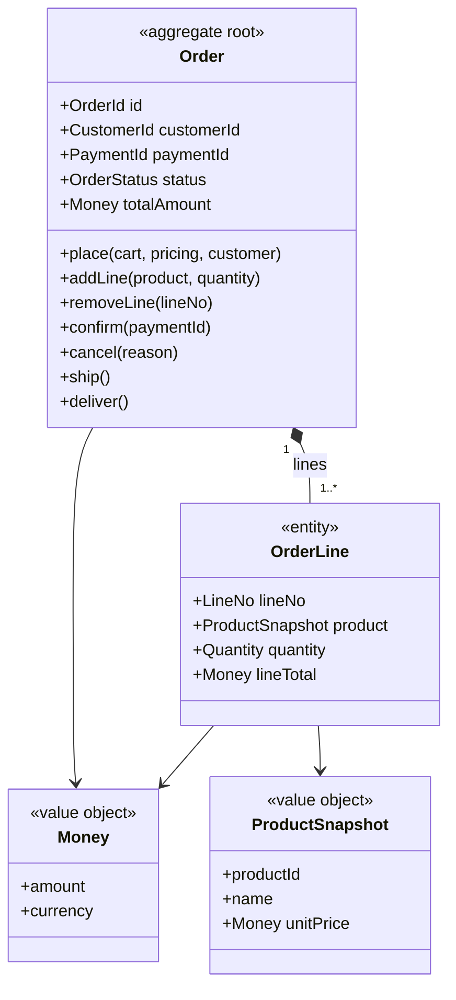

# Aggregate: Order

## Scope

Ordering コンテキスト（CTX-001）の中核集約。「顧客が何をいくらで買ったか」を一つの単位として守り、注文明細の合計と注文ステータスの遷移をトランザクション境界にする。

現行モノリスの `OrderService.placeOrder()` は在庫引当・決済・メール送信を同期で呼び出す God Service（技術負債 D1）だが、本集約はそのうち **注文自身の状態だけ** を持つ。在庫数量・決済結果・通知はそれぞれ StockItem（AGG-002）・Payment（AGG-004）・Notification コンテキストの責務であり、Order はそれらを ID と受信イベントで知るのみ（ADR-001, ADR-003）。

集約候補として検討し、採用しなかったもの:

| 候補 | 扱い | 理由 |
|------|------|------|
| Cart（カート） | Order の `place` ファクトリ入力 | Draft 状態の Order がカートの役割を兼ねる。別集約にすると Draft ↔ Cart の同期が要る |
| Shipment（出荷） | Order の `ship` / `deliver` コマンドと `shippedAt` / `deliveredAt` 属性 | 現行スコープでは分割出荷がなく、独立した不変条件を持たない。分割出荷が要件になった時点で切り出す |
| Customer | 参照（`customerId`） | Identity コンテキストの集約。Order は ID のみ保持する |

## Boundary

| Member | Kind | Identity / Validation | Notes |
|--------|------|-----------------------|-------|
| Order | root | `OrderId` | Payment・Reservation・Notification が `orderId` で参照する |
| OrderLine | entity | `LineNo`（Order 内でローカル） | 外部から参照されない。`removeLine(lineNo)` の宛先にのみ使う |
| Money | value object | `amount >= 0`、scale 0、通貨 JPY | `totalAmount`・`unitPrice` の型 |
| ProductSnapshot | value object | `productId`・`name`・`unitPrice` を `place` 時に複写 | Catalog の価格改定が確定済み注文の金額を変えないようにする |
| customerId | reference → Customer | | ID のみ |
| paymentId | reference → Payment | | `confirm` で設定。Confirmed 以降は必ず非 null（INV-4） |

## Invariants

| ID | Invariant | Violated by | Enforced |
|----|-----------|-------------|----------|
| INV-1 | `totalAmount` は全明細の `unitPrice × quantity` の合計に等しい | place, addLine, removeLine | ルートが明細変更のたびに再計算し、同一トランザクション内で保存する |
| INV-2 | Draft を離れた注文は 1 行以上の明細を持つ | place, removeLine | `place` のガードと、`removeLine` の「1 行より多く残っている」ガード |
| INV-3 | Placed 以降、明細は凍結される（追加・削除・数量変更不可） | addLine, removeLine | 両コマンドのガード `status is Draft` |
| INV-4 | Confirmed の注文はちょうど 1 件の成功した Payment を参照する | confirm | `confirm(paymentId)` が `PaymentCaptured` を受けた paymentId 以外を拒否する |

### Examples

| Invariant | Kind | Given | When | Then |
|-----------|------|-------|------|------|
| INV-1 | positive | 1,200 JPY × 2 の明細 1 行を持つ Draft 注文 | addLine(product 7, 800 JPY × 1) | totalAmount 3,200 JPY、OrderLineAdded |
| INV-1 | negative | 1,200 JPY × 2 の明細 1 行を持つ Draft 注文 | quantity 0 で addLine | rejected: invalid-quantity、合計は変わらない |
| INV-2 | positive | 明細 2 行の Draft 注文 | removeLine(2) | 1 行が残る、OrderLineRemoved |
| INV-2 | negative | 明細 1 行の Draft 注文 | place | 許可される — ただし先に removeLine(1) すると rejected: order-would-be-empty |
| INV-3 | positive | Draft 注文 | addLine(product 3, qty 1) | 明細が追加される |
| INV-3 | negative | Placed 注文 | addLine(product 3, qty 1) | rejected: order-not-editable |
| INV-4 | positive | Placed 注文と、それに対する PaymentCaptured | confirm(paymentId) | status Confirmed、paymentId 設定、OrderConfirmed |
| INV-4 | negative | 捕捉済み決済のない Placed 注文 | confirm(null) | rejected: payment-required |

## Commands and Events

| Command | Creation | Actor | Guard | Preserves | Emits | Consistency | also_writes |
|---------|----------|-------|-------|-----------|-------|-------------|-------------|
| place | yes（factory: cart, pricing, customer） | Customer | カートに 1 行以上あり、全行の quantity >= 1 | INV-1, INV-2 | OrderPlaced | local | — |
| addLine | | Customer | status is Draft | INV-1, INV-3 | OrderLineAdded | local | — |
| removeLine | | Customer | status is Draft かつ 1 行より多く残る | INV-1, INV-2, INV-3 | OrderLineRemoved | local | — |
| confirm | | Payment context（PaymentCaptured への反応） | status is Placed かつ捕捉済み決済が存在 | INV-4 | OrderConfirmed | saga | — |
| cancel | | Customer または Payment context（PaymentDeclined への反応） | status is Placed または Confirmed、未出荷 | — | OrderCancelled | saga | — |
| ship | | Warehouse operator | status is Confirmed かつ全行が引当済み | — | OrderShipped | local | — |
| deliver | | Carrier webhook | status is Shipped | — | OrderDelivered | local | — |

本集約に `also_writes` を持つコマンドはない。Order は常に単独で 1 トランザクションを構成する（@rules/aggregate-design.md §4 の第 1 ケースには該当しない）。

**Saga コマンド（ADR-003）。** `confirm` と `cancel` は注文確定 Saga の最終ステップであり、トランザクションの所有者は Ordering だが、その契機は他コンテキストのイベントである:

| Command | Saga の流れ | 補償 |
|---------|-------------|------|
| confirm | OrderPlaced → Inventory が reserve、Payment が authorize/capture → PaymentCaptured → **confirm** | 確定後のキャンセルは `cancel` が担い、Inventory の release と Payment の refund を OrderCancelled で誘発する |
| cancel | PaymentDeclined → **cancel**（または顧客の明示的キャンセル） | それ自体が補償ステップ。OrderCancelled が Inventory の release（AGG-002）と Payment の refund（AGG-004）を誘発する |

各ステップは `orderId` を冪等キーにするため、`PaymentCaptured` の再配信で `confirm` が二度呼ばれても、二度目は `status is Placed` のガードで無視される。

**イベントとペイロード。**

| Event | Payload | Scope |
|-------|---------|-------|
| OrderPlaced | orderId, customerId, lines[].productId, lines[].quantity, totalAmount | published |
| OrderLineAdded | orderId, lineNo, productId, quantity | internal |
| OrderLineRemoved | orderId, lineNo | internal |
| OrderConfirmed | orderId, paymentId | published |
| OrderCancelled | orderId, reason | published |
| OrderShipped | orderId, shippedAt | published |
| OrderDelivered | orderId, deliveredAt, totalAmount | published |

ペイロードは ID と値のみで、明細の `ProductSnapshot` 全体は載せない。消費側（Inventory・Payment）は `productId` と `quantity`、`totalAmount` だけで自分の仕事ができる。

## Specifications

| Specification | Predicate | Used by |
|---------------|-----------|---------|
| CanBeShipped | status is Confirmed かつ全行が Confirmed 状態の引当を持つ | ship, shippable-orders query |

`CanBeShipped` は `ship` のガードと倉庫画面の「出荷可能注文一覧」クエリが同じ述語を使うため仕様として抽出した。引当の状態は `StockReserved` を受けて明細に記録した「引当済み」マークから判定し、Inventory の集約を読みにいかない。

## Repository

- ルックアップ: `byId`、`byCustomerAndStatus`（マイページの注文一覧）
- 常に集約全体（Order + 全 OrderLine）をロードする。INV-1 は全明細なしに検査できない
- OCC スコープは Order 1 件。ScalarDB では `orderId` をパーティションキーとし、OrderLine を同一パーティションのクラスタリングキー `lineNo` で並べる（`design-scalardb` が決める）
- 読み取り一貫性: コマンド前の読み取りはトランザクション内（read-your-writes）。一覧クエリはスナップショット読みで十分

## Diagram

`customerId` と `paymentId` は他集約の ID を型とする属性であり、クラスへの関連線は引かない（@rules/aggregate-design.md §6）。

## Lifecycle

ルートは Draft → Placed → Confirmed → Shipped → Delivered（および Cancelled）の状態機械を持ち、`confirm` / `cancel` / `ship` / `deliver` は全てルートの状態に対するガードを持つ。よって状態機械に値し、`design-state-machine` が **STM-001** として書き戻している（マニフェストの `state_machine: "STM-001"`）。

## Open Items

- なし。整形式チェック（@rules/aggregate-design.md §3 の 7 規則）は全て通過し、既定値で埋めた一貫性クラスはない。
- 分割出荷が要件化された場合は Shipment を別集約に切り出し、`ship` / `deliver` と `CanBeShipped` を移す（Scope 参照）。

## Traceability

| ID | Type | Upstream |
|----|------|----------|
| AGG-001 | aggregate | CTX-001 (Ordering) |

関連: STM-001（状態機械）、ADR-001（Inventory の分離）、ADR-003（注文確定 Saga）、ADR-004（Notification / Identity の Conformist 購読）。
