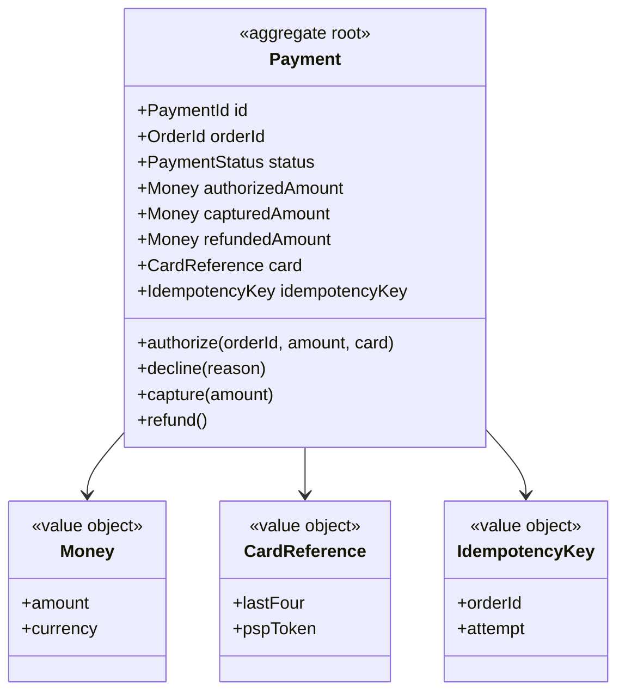

## Scope

Payment コンテキスト（CTX-003）の集約で、1 注文に対する決済の試行と結果を守る。本集約の特殊性は **状態の一部が外部 PSP（決済代行）にある** ことにある。オーソリ・キャプチャ・返金は PSP への呼び出しで確定し、その応答は秒単位で遅れ、失敗すると再試行される。したがって Payment の不変条件は「PSP を二度呼ばない」「PSP が確定した金額と食い違わない」という形をとる。

集約候補として検討し、採用しなかったもの:

| 候補 | 扱い | 理由 |
|------|------|------|
| PaymentAttempt（試行ごとの行） | `IdempotencyKey`（orderId + attempt）の値として Payment 内に保持 | 試行の履歴は監査ログで足り、独立した不変条件を持たない |
| Refund | Payment の `refund` コマンドと Refunded 状態 | 部分返金がスコープ外のため、返金は 1 回・全額（INV-3）で Payment の遷移として表せる |
| Card / PaymentMethod | 値オブジェクト `CardReference` | PAN を保持しない設計（PCI DSS スコープ外）。トークンと下 4 桁のみ |

## Boundary

| Member | Kind | Identity / Validation | Notes |
|--------|------|-----------------------|-------|
| Payment | root | `PaymentId` | Order が `confirm(paymentId)` で参照する |
| Money | value object | `amount >= 0`、scale 0、通貨 JPY | `authorizedAmount` / `capturedAmount` / `refundedAmount` の型 |
| CardReference | value object | 下 4 桁と PSP トークンのみ — PAN は決して保持しない | 表示用と PSP 再照会用 |
| IdempotencyKey | value object | `orderId + attempt`、PSP 呼び出しごとに一意 | PSP に渡すキー。同じキーでの再送を PSP 側が重複排除する |
| orderId | reference → Order | | Ordering の集約 ID。`byOrderId` ルックアップと INV-1 のキー |

## Invariants

| ID | Invariant | Violated by | Enforced |
|----|-----------|-------------|----------|
| INV-1 | `orderId` ごとに Captured の決済は高々 1 件 | authorize, capture | `authorize` が `byOrderId` で既存の Captured を確認してから PSP を呼ぶ。`capture` は自身の状態ガードで二重捕捉を防ぐ |
| INV-2 | 捕捉金額はオーソリ金額に等しい | capture | `capture` のガード `amount equals authorized amount`。部分捕捉は本スコープで許可しない |
| INV-3 | 返金は捕捉金額を超えず、高々 1 回 | refund | `refund` のガード `status is Captured`。Refunded に遷移した後は 2 回目が状態で止まる |

### Examples

| Invariant | Kind | Given | When | Then |
|-----------|------|-------|------|------|
| INV-1 | positive | order 9 の決済なし | authorize(order 9, 3,200 JPY) | Authorized、PaymentAuthorized |
| INV-1 | negative | order 9 の Captured 決済あり | authorize(order 9, 3,200 JPY) が再配信 | 無視 — 既存の決済が返り、PSP は呼ばれない |
| INV-2 | positive | 3,200 JPY で Authorized | capture | Captured 3,200 JPY、PaymentCaptured |
| INV-2 | negative | 3,200 JPY で Authorized | 金額 3,000 JPY で capture | rejected: amount-mismatch |
| INV-3 | positive | Captured 3,200 JPY | refund | Refunded 3,200 JPY、PaymentRefunded |
| INV-3 | negative | Refunded | refund が再配信 | 無視 — PSP への 2 回目の呼び出しなし |

## Commands and Events

| Command | Creation | Actor | Guard | Preserves | Emits | Consistency | also_writes |
|---------|----------|-------|-------|-----------|-------|-------------|-------------|
| authorize | yes | Ordering context（OrderPlaced への反応） | orderId の Captured 決済が未存在、かつ PSP が冪等キーを受理 | INV-1 | PaymentAuthorized | saga | — |
| decline | | PSP response | status is Requested | — | PaymentDeclined | saga | — |
| capture | | PSP response | status is Authorized かつ金額がオーソリ金額に等しい | INV-1, INV-2 | PaymentCaptured | saga | — |
| refund | | Ordering context（捕捉後の OrderCancelled への反応） | status is Captured | INV-3 | PaymentRefunded | saga | — |

本集約に `also_writes` はない。Payment は常に単独で 1 ローカルトランザクションを書き、他集約との整合は全てイベント経由である。

**全コマンドが `saga` である理由（ADR-003）。** 各コマンドは Payment 集約への書き込みという意味ではローカルだが、その結果は必ず他コンテキスト（Ordering）の次のステップを誘発し、失敗時には補償を要する。PSP 呼び出しは ScalarDB のトランザクション内に閉じ込められない（外部 I/O、秒単位の遅延、NFR-001 の p95 < 500 ms）ため、Order + Payment を 1 トランザクションに束ねる選択肢はそもそも存在しない。

| Command | Saga の位置 | 失敗時 / 補償 |
|---------|-------------|---------------|
| authorize | OrderPlaced を受けて開始。Requested 状態で PSP を呼ぶ | PSP 通信失敗は同じ `IdempotencyKey` で再試行。PSP 側が重複排除するので二重オーソリにならない |
| decline | PSP の拒否応答 | PaymentDeclined → Ordering が `cancel` → OrderCancelled → Inventory が release。Payment 側の補償は不要（何も確保していない） |
| capture | PSP の承認応答（本設計ではオーソリ直後に自動捕捉） | PaymentCaptured → Ordering が `confirm`。Ordering 側が確定できない場合は OrderCancelled → **refund** で補償 |
| refund | 捕捉後の OrderCancelled を受けて | 本コマンド自体が Saga の補償ステップ。PSP 返金失敗は同じキーで再試行。Refunded 以後の再配信は状態ガードで無視 |

**PSP 応答の扱い。** `decline` / `capture` のアクターは PSP response であり、これは Webhook 到達またはポーリング結果を指す。Webhook も at-least-once なので、`paymentId` をキーに状態ガードで冪等化する。PSP からの応答が一定時間来ない場合（Requested のまま滞留）は照会 API で状態を引き直す運用ジョブを置き、これは `design-operations` に引き継ぐ。

**冪等キーの二層構造。**

| 層 | キー | 守るもの |
|----|------|----------|
| イベント消費（Ordering → Payment） | `orderId`（OrderPlaced / OrderCancelled の `idempotency_key`） | 再配信で Payment 行を二重に作らない（INV-1） |
| PSP 呼び出し（Payment → PSP） | `IdempotencyKey = orderId + attempt` | 通信失敗の再試行で PSP に二重課金させない。attempt は明示的な再オーソリ（別カードでのやり直し）でのみ繰り上がる |

**イベントとペイロード。**

| Event | Payload | Scope |
|-------|---------|-------|
| PaymentAuthorized | paymentId, orderId, amount | internal |
| PaymentDeclined | paymentId, orderId, reason | published |
| PaymentCaptured | paymentId, orderId, amount | published |
| PaymentRefunded | paymentId, orderId, amount | published |

`CardReference` はどのイベントにも載せない。Ordering・Notification が必要とするのは結果と金額だけである。

## Specifications

なし。各ガードは 1 コマンドが 1 回評価するもので、複数の呼び出し元が共有する述語はない。

## Repository

- ルックアップ: `byId`、`byOrderId`（INV-1 の検査と Ordering からの照会）、`byIdempotencyKey`（PSP 応答・Webhook を該当決済に結びつける）
- 常に集約全体をロードする（ルート 1 行）
- OCC スコープは Payment 1 行。ScalarDB では `paymentId` をパーティションキーとし、`byOrderId` / `byIdempotencyKey` はセカンダリインデックスで引く（`design-scalardb` が決める）
- PSP 呼び出しはトランザクションの **外** で行う。順序は「Requested で書いてコミット → PSP 呼び出し → 応答をもとに別トランザクションで状態遷移」。PSP 呼び出し中にトランザクションを開いたままにしない

## Diagram

`orderId` は Order 集約の ID を型とする属性であり、Order クラスへの関連線は引かない。

## Lifecycle

Requested → Authorized → Captured → Refunded、および Requested → Declined という遷移を持ち、4 コマンド全てがルートの `status` に対するガードを持つ。よって状態機械に値する（@rules/state-modeling.md §1）。本サンプルの `design-state-machine` は現時点で STM-001（Order）のみを書いており、Payment の `STM-` は未割当（Open Items 参照）。

## Open Items

- Payment の状態機械が未作成。次回の `/architect:design-state-machine --aggregate=Payment` で STM- を割り当て、マニフェストの `state_machine` に書き戻す。所有者: architect。
- オーソリのみ（配送時捕捉）か即時捕捉かは、現行と同じ即時捕捉を既定にした。配送時捕捉に変える場合は `capture` のアクターが Ordering（OrderShipped への反応）に変わる。`TBD (OQ-018)`、所有者: 業務側。
- 部分返金はスコープ外（INV-3 は全額 1 回）。要件化された場合は INV-3 を「返金合計 <= 捕捉金額」に緩め、Refund を別エンティティにする。

## Traceability

| ID | Type | Upstream |
|----|------|----------|
| AGG-004 | aggregate | CTX-003 (Payment) |

関連: AGG-001（Order、`confirm(paymentId)` の参照元）、ADR-003（注文確定 Saga）、ADR-004（PaymentRefunded の Notification による Conformist 購読）、NFR-001（p95 < 500 ms）、NFR-003（PSP 障害時も注文受付を継続）。
