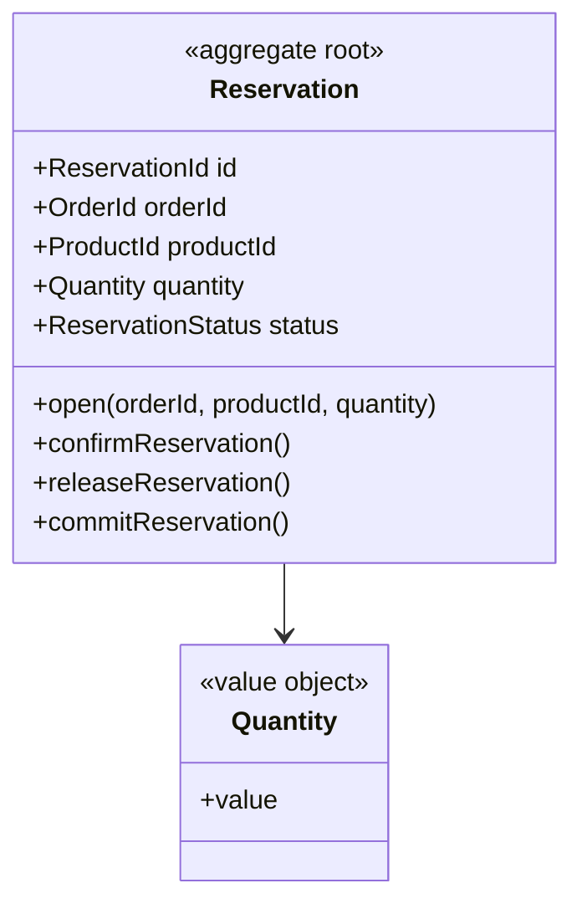

## Scope

Inventory コンテキスト（CTX-002）の集約で、「この注文のこの商品に対する引当」を 1 行として表す。存在理由は **冪等性** である。`OrderPlaced` は at-least-once で配信されるため、同じ注文の引当要求は二度届きうる。現行の `inventoryService.reserve(productId, quantity)` は数量しか受け取らず、再配信で二重に引き当てる（技術負債）。引当を「注文 × 商品」で識別できる行にすれば、二度目の要求は既存行に当たって止まる（ADR-002）。

StockItem（AGG-002）と分けた理由と、それでも同一トランザクションで書く理由:

| 選択肢 | 判断 |
|--------|------|
| StockItem の内部エンティティ | 却下。1 商品の全引当が 1 集約に載り、人気商品で集約が肥大化して OCC 競合が集中する |
| Ordering 側に置く | 却下。StockItem の INV-2（reserved = 引当合計）をコンテキスト跨ぎでしか検証できなくなる |
| 引当行を持たず注文 ID の冪等テーブルだけ置く | 却下。解放時に数量をもう一度伝える必要があり、再配信で二重解放する |
| **別集約、`also_writes` で同一トランザクション**（採用） | 集約は小さく保ちつつ、カウンタと行の整合は ACID で守る（@rules/aggregate-design.md §4 第 1 ケース） |

## Boundary

| Member | Kind | Identity / Validation | Notes |
|--------|------|-----------------------|-------|
| Reservation | root | `ReservationId`（= `orderId + productId`） | 自然キー。サロゲート ID を発行しないことが冪等性の根拠 |
| Quantity | value object | 整数 `>= 1` | 開設時に固定。0 の引当は存在しない |
| orderId | reference → Order | | Ordering の集約 ID。`byOrder` ルックアップのキー |
| productId | reference → StockItem | | 同じ Inventory 内の集約 ID。同一トランザクションで書く相手 |

ルートは `status`（Pending / Confirmed / Released / Committed）を持つ。StockItem の INV-2 が合計対象にするのは Pending と Confirmed のみ。

## Invariants

| ID | Invariant | Violated by | Enforced |
|----|-----------|-------------|----------|
| INV-1 | `(orderId, productId)` ごとに引当は高々 1 件 — `OrderPlaced` の再配信が 2 件目を作ることはない | open | `open` のガード「未存在」。identity が自然キーなので、ScalarDB の同一キー put は条件付き（`putIfNotExists`）で衝突し、トランザクションが失敗する |
| INV-2 | 数量は開設時に固定される。release / commit は数量引数を持たない | open | `open` が `Quantity >= 1` を検証する。以後のコマンドは数量を受け取らないため、変更経路が存在しない |

### Examples

| Invariant | Kind | Given | When | Then |
|-----------|------|-------|------|------|
| INV-1 | positive | (order 9, product 3) の引当なし | open(order 9, product 3, qty 2) | 引当 Pending |
| INV-1 | negative | (order 9, product 3) の Pending 引当あり | open(order 9, product 3, qty 2) が再配信 | 無視 — 既存の引当が返り、2 行目は作られない |
| INV-2 | positive | 数量 2 の Pending 引当 | commitReservation | 数量 2 のまま Committed |
| INV-2 | negative | 数量 0 の open 要求 | open | rejected: invalid-quantity |

## Commands and Events

| Command | Creation | Actor | Guard | Preserves | Emits | Consistency | also_writes |
|---------|----------|-------|-------|-----------|-------|-------------|-------------|
| open | yes | StockItem.reserve（同一トランザクション） | `(orderId, productId)` の引当が未存在 | INV-1, INV-2 | none | local | — |
| releaseReservation | | StockItem.release（同一トランザクション） | status is Pending または Confirmed | — | none | local | — |
| commitReservation | | StockItem.commit（同一トランザクション） | status is Confirmed | INV-2 | none | local | — |
| confirmReservation | | Ordering context（OrderConfirmed への反応） | status is Pending | — | none | local | — |

**イベントは発行しない（`emits: none`）。** `open` / `releaseReservation` / `commitReservation` は StockItem のコマンドの一部として同じトランザクションで実行され、そのトランザクションのイベント（`StockReserved` / `StockReleased` / `StockCommitted`）は所有者である StockItem が発行する。「一イベント・一発行集約」の規則により、Reservation が同じ事実を二重に発行することはない。`confirmReservation` だけは StockItem を経由しない（カウンタが変わらないため）が、これは Ordering の `OrderConfirmed` への内部反応であり、外へ知らせる事実を生まないので同じく `none`。

**冪等性の仕組みを整理すると:**

| 再配信されるイベント | 到達するコマンド | 止まる場所 |
|----------------------|------------------|------------|
| OrderPlaced | StockItem.reserve → open | `open` のガード（既存行）。StockItem のカウンタは加算されない |
| OrderConfirmed | confirmReservation | ガード `status is Pending`。2 回目は Confirmed なので無視 |
| OrderCancelled | StockItem.release → releaseReservation | ガード `Pending or Confirmed`。2 回目は Released なので無視、カウンタは二度減らない |
| OrderShipped | StockItem.commit → commitReservation | ガード `status is Confirmed`。2 回目は Committed なので無視 |

数量を開設時に固定し release / commit が数量を受け取らないのは、この表の 3・4 行目を成立させるためである。数量を再度受け取る設計では、再配信時に「既に減らした分をもう一度減らす」余地が残る。

**所有者の側の記述。** `also_writes` はコマンドの所有者である StockItem のマニフェストに記録されており、本集約側のコマンドは `also_writes` を持たない。トランザクションの所有権・照合ルール・TX-002 への記録は `aggregate-stock-item.md` §Commands and Events に集約してある。

## Specifications

なし。Reservation の述語は各コマンドが 1 回だけ評価するガードであり、複数の呼び出し元が共有する規則はない。Order の `CanBeShipped` は「全行の引当が Confirmed か」を問うが、それは Ordering 側が `StockReserved` / `OrderConfirmed` から自分の明細に記録したマークで判定し、本集約を読まない。

## Repository

- ルックアップ: `byOrderAndProduct`（identity そのもの）、`byOrder`（キャンセル・出荷時に注文の全引当を扱う）
- 常に集約全体をロードする（ルート 1 行）
- OCC スコープは Reservation 1 行。ScalarDB では `orderId` をパーティションキー、`productId` をクラスタリングキーとし、`byOrder` を 1 パーティションのスキャンで済ませる（`design-scalardb` が決める）
- `open` は `putIfNotExists` 相当の条件付き書き込みで INV-1 をストレージ層でも二重に守る

## Diagram

`orderId` / `productId` は他集約の ID を型とする属性であり、Order・StockItem のクラスへの関連線は引かない。

## Lifecycle

Pending → Confirmed → Committed、および Pending / Confirmed → Released という遷移を持ち、4 コマンド全てがルートの `status` に対するガードを持つ。よって状態機械に値する（@rules/state-modeling.md §1）。ただし本サンプルの `design-state-machine` は現時点で STM-001（Order）のみを書いており、Reservation の `STM-` は未割当（Open Items 参照）。

## Open Items

- Reservation の状態機械が未作成。次回の `/architect:design-state-machine --aggregate=Reservation` で STM- を割り当て、マニフェストの `state_machine` に書き戻す。所有者: architect。
- 引当に有効期限（Pending のまま一定時間経過で自動 Released）を設けるかは要件未確定。設ければ `expire` コマンドと Released への遷移が増える。`TBD (OQ-005)`、所有者: 業務側。

## Traceability

| ID | Type | Upstream |
|----|------|----------|
| AGG-003 | aggregate | CTX-002 (Inventory) |

関連: AGG-002（StockItem、トランザクション所有者）、ADR-002（別集約・同一トランザクションの決定）、NFR-002（過剰引当ゼロ）。
