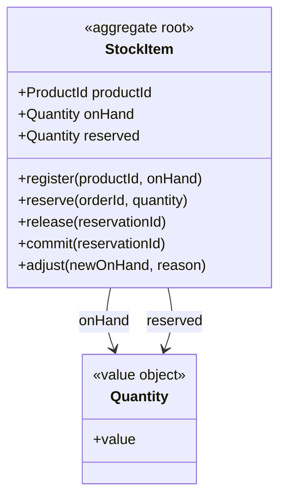

## Scope

Inventory コンテキスト（CTX-002）の集約で、商品 1 点の在庫カウンタ `onHand` / `reserved` を守る。NFR-002（在庫の過剰引当ゼロ）を保証する唯一の場所であり、注文フロー（`OrderPlaced` への反応）でも倉庫の手動調整（`adjust`）でも同じ不変条件が同じルートで検査される（ADR-001）。

集約候補として検討し、採用しなかったもの:

| 候補 | 扱い | 理由 |
|------|------|------|
| Product（商品マスタ） | 参照（`productId`） | Catalog コンテキストの集約。在庫は変更頻度が高く書き中心、商品マスタは低頻度で読み中心と一貫性クラスが異なる |
| Reservation を StockItem の内部エンティティにする | 別集約 AGG-003 として切り出し、`also_writes` で同一トランザクションに書く | 1 商品の全引当を 1 集約に載せると、人気商品で集約が肥大化し OCC 競合が集中する（ADR-002） |
| Warehouse（倉庫・ロケーション） | スコープ外 | 現行システムは単一倉庫。複数倉庫化の要件が出た時点で `StockItem` の identity を `(productId, warehouseId)` に拡張する |

## Boundary

| Member | Kind | Identity / Validation | Notes |
|--------|------|-----------------------|-------|
| StockItem | root | `ProductId` | 商品 1 点につき 1 行。Ordering は在庫数量を保持せず、`StockReserved` を受け取るだけ |
| Quantity | value object | 整数 `>= 0` | `onHand` と `reserved` の型 |
| productId | reference → Product | | Catalog の集約 ID。identity を兼ねる |

`onHand`（現物数）と `reserved`（引当済み数）は共に `Quantity`。利用可能数 `available = onHand - reserved` は属性として持たず、仕様 `HasAvailable` が都度計算する。

## Invariants

| ID | Invariant | Violated by | Enforced |
|----|-----------|-------------|----------|
| INV-1 | `reserved` は `onHand` を超えない | reserve, adjust | `reserve` のガード `onHand - reserved >= quantity`、`adjust` のガード `new onHand >= reserved`。両方ともルートのコマンド内、同一トランザクションで検査 |
| INV-2 | `reserved` はこの商品の Pending / Confirmed な Reservation の数量合計に等しい | reserve, release, commit | カウンタと Reservation 行を同一ローカルトランザクションで書く（下記 `also_writes`）。Reservation 側の状態ガードが二重加算・二重減算を防ぐ |

### Examples

| Invariant | Kind | Given | When | Then |
|-----------|------|-------|------|------|
| INV-1 | positive | onHand 50, reserved 48 | reserve(2) | reserved 50、StockReserved |
| INV-1 | negative | onHand 50, reserved 49 | reserve(2) | rejected: insufficient-stock、reserved 49 のまま |
| INV-2 | positive | reserved 5、引当は 3 と 2 の 2 件 | release(2 の引当) | reserved 3、1 件が Released |
| INV-2 | negative | reserved 5、引当は 3 と 2 の 2 件 | release(既に Released の引当) | 無視 — reserved 5 のまま、二度目の減算なし |

## Commands and Events

| Command | Creation | Actor | Guard | Preserves | Emits | Consistency | also_writes |
|---------|----------|-------|-------|-----------|-------|-------------|-------------|
| register | yes | Catalog context（ProductRegistered への反応） | productId の StockItem が未存在 | INV-1 | StockItemRegistered | saga | — |
| reserve | | Ordering context（OrderPlaced への反応） | `onHand - reserved >= quantity` | INV-1, INV-2 | StockReserved | local | Reservation |
| release | | Ordering context（OrderCancelled への反応） | 引当が Pending または Confirmed | INV-2 | StockReleased | local | Reservation |
| commit | | Ordering context（OrderShipped への反応） | 引当が Confirmed | INV-1, INV-2 | StockCommitted | local | Reservation |
| adjust | | Warehouse operator | `new onHand >= reserved` | INV-1 | StockAdjusted | local | — |

### 二集約・一トランザクション: StockItem + Reservation（ADR-002）

`reserve` / `release` / `commit` は `local` でありながら Reservation（AGG-003）を `also_writes` に持つ。これは @rules/aggregate-design.md §4 の **第 1 ケース** — 不変条件（INV-2）が両集約を跨ぎ、両者が同一サービス・同一データストア（Inventory サービスの ScalarDB 名前空間）に存在する — に該当し、本設計で唯一の「一コマンド・一集約」の例外である。

| 項目 | 決定 |
|------|------|
| 所有者 | **StockItem**。ガードを判定し、不変条件（INV-1, INV-2）の検査を持つ側 |
| 書き込み順 | 1 トランザクション内で StockItem のカウンタ更新と Reservation の行の作成／状態変更を行い、まとめてコミットする |
| イベント発行 | StockItem のみ。Reservation の `open` / `releaseReservation` / `commitReservation` は `emits: none`（「一イベント・一発行集約」の規則） |
| 冪等性 | Reservation の identity が `orderId + productId` なので、`OrderPlaced` の再配信は `open` のガード「未存在」で止まり、カウンタは二度加算されない |
| 照合（reconciliation） | 夜間バッチが商品ごとに `sum(quantity of Pending/Confirmed reservations)` と `reserved` を突合し、差分があれば `StockAdjusted`（reason = reconciliation）でカウンタ側を引当合計に合わせ、運用アラートを出す。カウンタでなく Reservation 行を正とするのは、行に注文 ID が付いていて出所を追えるため |
| 記録先 | `scalardb-transaction.md` TX-002 |

**なぜカウンタが StockItem 側にあるのか。** `reserve` のガードは「この商品の利用可能数が要求量以上か」であり、商品単位の値が要る。Reservation 行を全件集計して判定すると、集計が読んだ行と別の引当が同時にコミットされうる（ファントム）ため、ScalarDB の OCC はそれを検出できない。カウンタを 1 行に持てば、競合する 2 つの `reserve` は同じ `StockItem` レコードを更新し、後からコミットする側が `CommitConflictException` で失敗してリトライされる。**在庫行こそが競合の検出点**であり、INV-1 はそこに置かれてはじめて保証される。

**OCC 競合の見積もり。** 競合は商品単位で起きる。人気商品 1 点に同時注文が集中すると `StockItem` 行での競合率が上がるが、それは業務上の直列化点そのものであり回避すべきものではない。競合したトランザクションはリトライ可能（`CommitConflictException` → 再読込・再判定）であり、`design-scalardb` はリトライ上限と、セール等でのホットスポットを緩和する分割（`onHand` を複数バケットに分ける等）を検討事項として引き継ぐ。Reservation を別集約にしたことで、引当行の増加はこの行の競合率に影響しない。

**Saga コマンド。** `register` は Catalog の `ProductRegistered` への反応で、Catalog 側に補償は不要（登録失敗は再配信で回復する）。`reserve` の失敗（insufficient-stock）は Inventory では補償せず、Ordering が `StockReserved` を受け取れないまま Payment が失敗するか、タイムアウトで `cancel` する（ADR-003）。

**イベントとペイロード。**

| Event | Payload | Scope |
|-------|---------|-------|
| StockItemRegistered | productId, onHand | internal |
| StockReserved | productId, orderId, reservationId, quantity | published |
| StockReleased | productId, orderId, reservationId, quantity | internal |
| StockCommitted | productId, orderId, reservationId, quantity | internal |
| StockAdjusted | productId, onHand, reason | published |

## Specifications

| Specification | Predicate | Used by |
|---------------|-----------|---------|
| HasAvailable | `onHand - reserved >= requested quantity` | reserve, product availability query |

商品ページの「在庫あり」表示（Catalog の読みモデル、`StockAdjusted` で更新）と `reserve` のガードが同じ述語を共有する。

## Repository

- ルックアップ: `byProductId`
- 常に集約全体をロードする（ルート 1 行のみなので自明）
- OCC スコープは StockItem 1 行。ScalarDB では `productId` をパーティションキーとする。`reserve` 等のトランザクションは同じ名前空間の Reservation テーブルも書くが、パーティションは別（`design-scalardb` が TX-002 として設計）
- 読み取り: コマンド内は必ずトランザクション読み。availability クエリはスナップショットで良い

## Diagram

Reservation（AGG-003）は `reservationId` / `orderId` の ID 参照で結ばれ、関連線は引かない。

## Lifecycle

StockItem は状態列を持たない。`onHand` / `reserved` は数量であって状態ではなく、いずれのコマンドもルートの「状態」に対するガードを持たない（ガードは全て数量比較）。よって状態機械には値しない（@rules/state-modeling.md §1）。ライフサイクルを持つのは Reservation 側（AGG-003）である。

## Open Items

- なし。整形式チェックは全て通過。
- 複数倉庫化（identity を `(productId, warehouseId)` へ拡張）とホットスポット緩和の分割は要件化されるまで着手しない（Scope, Repository 参照）。

## Traceability

| ID | Type | Upstream |
|----|------|----------|
| AGG-002 | aggregate | CTX-002 (Inventory) |

関連: AGG-003（Reservation、`also_writes`）、ADR-001（Inventory の分離）、ADR-002（Reservation を別集約にして同一トランザクションで書く）、NFR-002（過剰引当ゼロ）。
