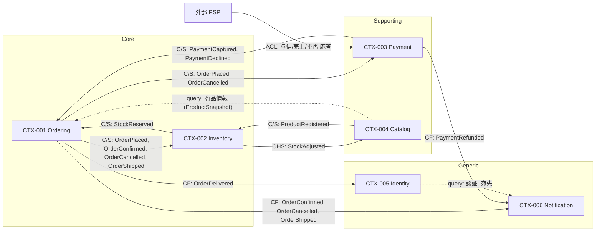
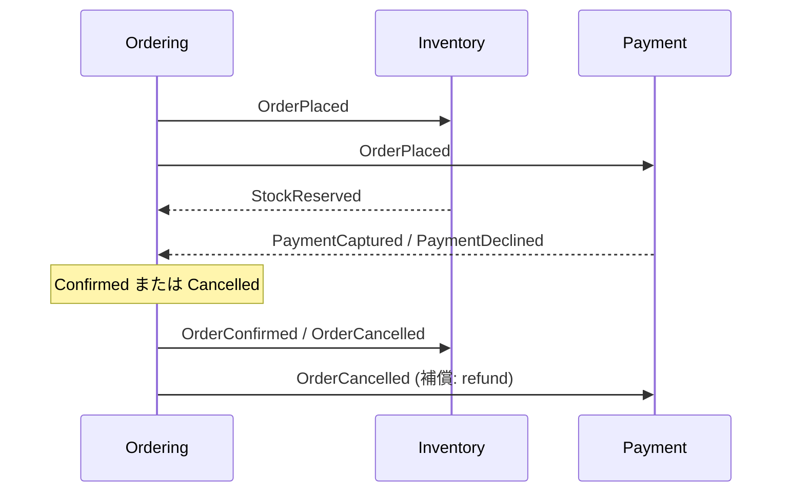

## 概要

6 つのコンテキストの関係を、`domain-event-catalog.json` の `relationship` 値（customer-supplier / conformist / open-host-service）と一致させて描く。矢印は上流（supplier / host）から下流へ向かい、ラベルは流れるイベントまたはコマンド。同期呼び出しは Ordering → Catalog の商品照会と Payment → PSP の 2 本だけで、それ以外はすべて非同期のドメインイベントである（ADR-003）。

## コンテキストマップ

凡例: C/S = Customer/Supplier、CF = Conformist、OHS = Open Host Service、ACL = Anticorruption Layer。実線はドメインイベント（at-least-once）、点線は同期クエリ。

## 関係一覧

| Upstream | Downstream | Pattern | Messages / Events | ADR |
|----------|------------|---------|-------------------|-----|
| CTX-001 Ordering | CTX-002 Inventory | Customer/Supplier（Inventory が supplier、Ordering が customer として契約に参加） | `OrderPlaced`（reserve）, `OrderConfirmed`（confirmReservation）, `OrderCancelled`（release）, `OrderShipped`（commit） | ADR-001 |
| CTX-002 Inventory | CTX-001 Ordering | Customer/Supplier | `StockReserved` — 明細を引当済みにマーク、CanBeShipped の入力 | ADR-001 |
| CTX-001 Ordering | CTX-003 Payment | Customer/Supplier | `OrderPlaced`（authorize）, `OrderCancelled`（refund） | ADR-003 |
| CTX-003 Payment | CTX-001 Ordering | Customer/Supplier | `PaymentCaptured`（confirm）, `PaymentDeclined`（cancel） | ADR-003 |
| CTX-002 Inventory | CTX-004 Catalog | Open Host Service | `StockAdjusted` — 商品ページの在庫表示読み取りモデルを更新 | — |
| CTX-004 Catalog | CTX-002 Inventory | Customer/Supplier | `ProductRegistered`（StockItem の register） | — |
| CTX-004 Catalog | CTX-001 Ordering | 同期クエリ（Ordering が ProductSnapshot として写す） | 商品 ID・名前・単価の照会 | — |
| CTX-001 Ordering | CTX-006 Notification | Conformist | `OrderConfirmed`, `OrderCancelled`, `OrderShipped` | ADR-004 |
| CTX-003 Payment | CTX-006 Notification | Conformist | `PaymentRefunded` | ADR-004 |
| CTX-001 Ordering | CTX-005 Identity | Conformist | `OrderDelivered` — 100 円ごとに 1 ポイント付与 | ADR-004 |
| CTX-005 Identity | CTX-006 Notification | 同期クエリ | 宛先メールアドレスの照会 | — |
| 外部 PSP | CTX-003 Payment | Anticorruption Layer | 与信・売上・拒否の応答を `capture` / `decline` に変換 | — |

## パターン選択の理由

- **Customer/Supplier（Ordering ⇄ Inventory / Payment）**: 双方向にイベントが流れ、どちらも相手の契約に意見を持つ。Ordering が `OrderPlaced` のペイロードを決め、Inventory / Payment が `StockReserved` / `PaymentCaptured` のペイロードを決める。ペイロードは additive-only で進化させる（イベントカタログ `evolution`）。
- **Conformist（Notification / Identity）**: 購読者が Ordering の言語にそのまま従う。Ordering は両者の存在を知らない。購読者が増えて契約を切る価値が出た時点で OHS/PL に昇格させる（ADR-004 の却下案）。
- **Open Host Service（Inventory → Catalog）**: `StockAdjusted` は Catalog 以外（将来の分析基盤・外部モール連携）にも同じ形式で公開する前提の契約なので、Conformist ではなく OHS とする。
- **Anticorruption Layer（PSP → Payment）**: PSP の応答形式（ベンダー固有のコード・ステータス）を Payment のコマンドに翻訳し、PSP を差し替えても Ordering に影響しないようにする。

## Saga の経路

注文確定フロー（ADR-003）はこのマップの Customer/Supplier 辺 4 本で閉じる。

