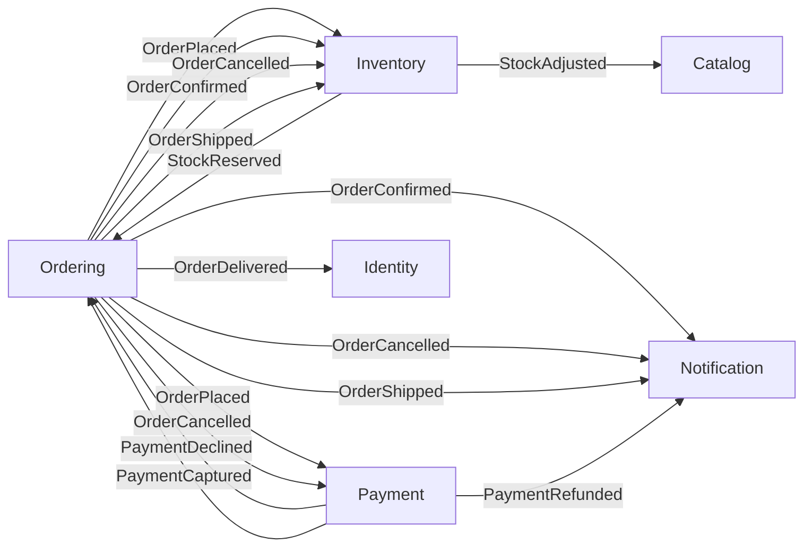

# Domain Event Catalog

本書は `reports/03_design/domain-event-catalog.json` から再生成される **ビュー** であり、ソースとして編集しない。イベント名・ペイロード・購読者・配信契約の正は `.json` にあり、`tools/lib/domain_event_catalog.py` がその整形式（一イベント・一発行集約、published は購読者 1 件以上、at-least-once には冪等キー必須、マニフェストの全イベントに項目あり）を検証する。

集約が発行するイベントは、コンテキストマップの **公開言語（Published Language）** である。各集約のマニフェストは「誰が発行するか」を、`context-map.md` は「コンテキスト間の関係」を述べるが、「どのコンテキストが、どのイベントを、どの配信保証で消費するか」は本カタログだけが述べる。消費側は `design-microservices` がサービス分割の確定後に補完し、`design-api` は `published` の項目から `api-specifications/asyncapi/` を生成する。

対象コンテキスト: Ordering, Inventory, Payment（発行側）、Catalog, Identity, Notification（消費のみ）。

## 配信契約の共通事項

| 項目 | 本設計での値 | 根拠 |
|------|--------------|------|
| delivery | 全 published イベントが `at-least-once` | Outbox からの再送を許し、消費側の冪等化で重複を吸収する（ADR-003）。exactly-once は基盤に求めない |
| idempotency_key | 発行集約の ID（`orderId` / `reservationId` / `productId` / `paymentId`） | 消費側は集約の状態ガードで再配信を無視する（各 `aggregate-*.md` §Commands and Events） |
| version | 全て `1` | 初版 |
| evolution | 全て `additive-only` | フィールドの追加のみ許し、削除・型変更・意味変更は新イベント名で行う。Conformist の購読者（Notification / Identity）は発行側の都合で進化するペイロードに追従する（ADR-004） |

## Ordering（発行集約: Order, AGG-001）

| Event | Scope | Consumers（context / relationship / purpose） | Payload | Delivery | Idempotency key | Version | Evolution |
|-------|-------|-----------------------------------------------|---------|----------|-----------------|---------|-----------|
| OrderPlaced | published | Inventory / customer-supplier / 全明細の在庫を引き当てる Payment / customer-supplier / 注文合計をオーソリする | orderId, customerId, lines[].productId, lines[].quantity, totalAmount | at-least-once | orderId | 1 | additive-only |
| OrderConfirmed | published | Inventory / customer-supplier / 注文の引当を Confirmed にする Notification / conformist / 注文確定メールを送る | orderId, paymentId | at-least-once | orderId | 1 | additive-only |
| OrderCancelled | published | Inventory / customer-supplier / 注文の引当を解放する Payment / customer-supplier / 捕捉済み決済を返金する Notification / conformist / キャンセルメールを送る | orderId, reason | at-least-once | orderId | 1 | additive-only |
| OrderShipped | published | Inventory / customer-supplier / 引当を確定する — 在庫が倉庫を出る Notification / conformist / 出荷通知を送る | orderId, shippedAt | at-least-once | orderId | 1 | additive-only |
| OrderDelivered | published | Identity / conformist / ポイントを付与する（100 JPY につき 1）| orderId, deliveredAt, totalAmount | at-least-once | orderId | 1 | additive-only |

`OrderPlaced` が注文確定 Saga の起点であり、Inventory と Payment が並行して反応する。`OrderCancelled` は同じ Saga の補償を誘発するイベントで、Inventory の `release` と Payment の `refund` の両方がこれを契機にする（ADR-003）。ポイント付与を `OrderConfirmed` でなく `OrderDelivered` にしたのは、配達前キャンセルでの付与取消を不要にするためである（ADR-004）。

## Inventory（発行集約: StockItem, AGG-002）

| Event | Scope | Consumers（context / relationship / purpose） | Payload | Delivery | Idempotency key | Version | Evolution |
|-------|-------|-----------------------------------------------|---------|----------|-----------------|---------|-----------|
| StockReserved | published | Ordering / customer-supplier / 明細を引当済みにする。CanBeShipped の入力 | productId, orderId, reservationId, quantity | at-least-once | reservationId | 1 | additive-only |
| StockAdjusted | published | Catalog / open-host-service / 商品ページの在庫表示（読みモデル）を更新する | productId, onHand, reason | at-least-once | productId | 1 | additive-only |

Reservation（AGG-003）はイベントを発行しない。`StockItem.reserve` / `release` / `commit` が Reservation を同一トランザクションで書き（`also_writes`）、イベントは所有者である StockItem のみが発行する（ADR-002）。`StockAdjusted` の冪等キーが `productId` なのは、消費側（Catalog の読みモデル）が最新の `onHand` で上書きするだけで、順序・重複に影響されないためである。

## Payment（発行集約: Payment, AGG-004）

| Event | Scope | Consumers（context / relationship / purpose） | Payload | Delivery | Idempotency key | Version | Evolution |
|-------|-------|-----------------------------------------------|---------|----------|-----------------|---------|-----------|
| PaymentDeclined | published | Ordering / customer-supplier / 注文をキャンセルする（payment_declined 遷移） | paymentId, orderId, reason | at-least-once | paymentId | 1 | additive-only |
| PaymentCaptured | published | Ordering / customer-supplier / 注文を確定する（payment_captured 遷移） | paymentId, orderId, amount | at-least-once | paymentId | 1 | additive-only |
| PaymentRefunded | published | Notification / conformist / 返金通知を送る | paymentId, orderId, amount | at-least-once | paymentId | 1 | additive-only |

`PaymentCaptured` / `PaymentDeclined` は STM-001（Order）の `payment_captured` / `payment_declined` 遷移の入力である。どのイベントにも `CardReference` は載らない。

## 内部イベント（コンテキスト外へ公開しない）

| Event | Publisher | Payload | 用途 |
|-------|-----------|---------|------|
| OrderLineAdded | Order (Ordering) | orderId, lineNo, productId, quantity | Draft 注文の編集履歴。監査ログと同一コンテキスト内の読みモデル |
| OrderLineRemoved | Order (Ordering) | orderId, lineNo | 同上 |
| StockItemRegistered | StockItem (Inventory) | productId, onHand | 在庫行の作成。Catalog の `ProductRegistered` への反応であり、外へ返す事実ではない |
| StockReleased | StockItem (Inventory) | productId, orderId, reservationId, quantity | 引当解放。Ordering は OrderCancelled の発行側なので知らせる必要がない |
| StockCommitted | StockItem (Inventory) | productId, orderId, reservationId, quantity | 出荷による在庫確定。同上 |
| PaymentAuthorized | Payment (Payment) | paymentId, orderId, amount | 本設計はオーソリ直後に自動捕捉するため、Ordering は PaymentCaptured だけを待つ |

内部イベントは `consumers` が空であることで scope が決まる。将来、他コンテキストが購読する必要が生じたら `published` に昇格させ、配信契約（delivery / idempotency_key / version / evolution）を付ける。

## コンテキスト間イベントフロー

published イベントのみ。辺は発行コンテキスト → 消費コンテキストで、ラベルはイベント名。

Ordering ↔ Inventory と Ordering ↔ Payment が双方向（Customer/Supplier の往復）で、Saga の要求と応答を成す。Catalog・Identity・Notification は受信のみで、Ordering / Inventory / Payment はこれらの存在を知らない（ADR-004）。

## 集計

| 区分 | 件数 |
|------|------|
| イベント総数 | 16 |
| published | 10（Ordering 5, Inventory 2, Payment 3） |
| internal | 6 |
| 発行コンテキスト | 3 |
| 消費のみのコンテキスト | 3（Catalog, Identity, Notification） |

## Traceability

| Event 発行集約 | AGG- | CTX- |
|----------------|------|------|
| Order | AGG-001 | CTX-001 (Ordering) |
| StockItem | AGG-002 | CTX-002 (Inventory) |
| Payment | AGG-004 | CTX-003 (Payment) |

関連 ADR: ADR-002（Reservation はイベントを発行しない）、ADR-003（Saga と補償）、ADR-004（Notification / Identity の Conformist 購読）。
