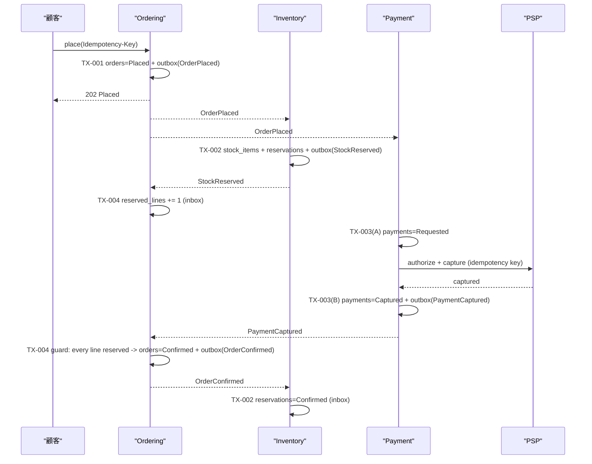
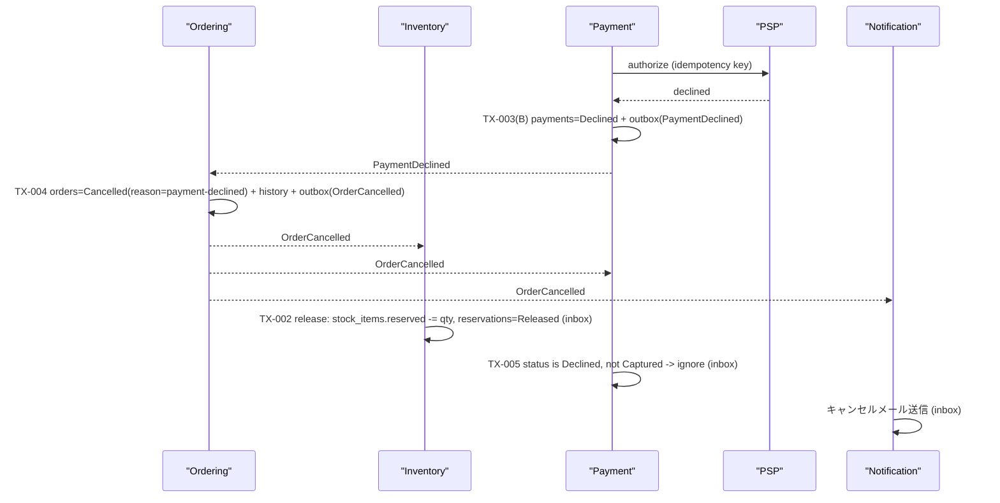

## 前提

- ScalarDB Cluster **3.19**（Enterprise Standard）、Consensus Commit、楽観的並行性制御（OCC）。設計はバンドル `products/scalardb/3.19/` の `design.md` / `consensus-commit.md` / `scalardb-cluster/deployment-patterns-for-microservices.md` に基づく。設定キーは本書では扱わない（`generate-scalardb-code` が pinned バンドルから取る）。
- 集約 = OCC スコープ = パーティションキーの単位（AGG-001〜004）。1 コマンド・1 集約・1 トランザクションが原則で、例外は ADR-002 の 1 件のみ。
- ドメインイベントは **outbox テーブルへ同一トランザクションで書き**、リレーが at-least-once で配信する（`domain-event-catalog.json` の delivery 契約）。

## 1. メカニズム決定

| 決定 | 内容 |
|------|------|
| クラスタ構成 | Ordering / Inventory / Payment / Catalog / Identity は **1 つの ScalarDB Cluster を共有**（shared-cluster pattern、@rules/scalardb-2pc-patterns.md 選択肢 1）。名前空間はコンテキストごとに分ける |
| 集約内トランザクション | **one-phase commit**。すべての `consistency: local` コマンド |
| 注文確定フロー | **Saga**（ADR-003）。`OrderPlaced` → (`StockReserved`, `PaymentCaptured` / `PaymentDeclined`) → `OrderConfirmed` / `OrderCancelled`。各ステップは 1 集約への 1 ローカルトランザクション |
| Saga の実行方式 | アプリケーション実装のコレオグラフィ（outbox + 冪等 consumer + reaper）。ScalarDB Saga サーバは 3.19.0-alpha.1 のため不採用 — GA 後に載せ替え可能な同型設計にしておく（ADR-003） |

却下した代替案（ADR-003 の要約）:

| 代替案 | 却下理由 |
|--------|----------|
| 共有クラスタで Order + StockItem + Payment を 1 トランザクション | PSP 呼び出し（秒単位）をトランザクション内に置けない。置かなければ決済と確定の原子性が崩れ、置けば在庫行のロック保持時間が PSP 遅延に引きずられ NFR-001（p95 < 500 ms）を割る |
| Global Transaction API + Transaction Coordinator（3.19） | 外部 I/O の問題は 2PC でも解決しない。参加サービスがすべて同一クラスタ上にあり、分離クラスタの動機がない |
| ScalarDB Saga サーバ（3.19.0-alpha.1） | alpha で API・設定キーが動く。設計は同型なので GA 後に判断する |
| 全ステップを 1 サービスに戻す（現行モノリス維持） | ADR-001 の在庫分離と矛盾。NFR-003（PSP 障害時も受付継続）を満たせない |

## 2. トランザクション境界

集約マニフェストの全コマンドを以下 6 境界に割り当てる。「再試行」列は `CommitConflictException`（CC）と `UnknownTransactionStatusException`（UTS）を区別する。UTS は **コミット済みかもしれない** ので、再試行前に必ず状態を読み直す（@rules/scalardb-exception-handling.md）。

| TX | 対象コマンド | 書く集約 / テーブル | Consistency | OCC スコープ（パーティションキー） | 冪等キー | CC 時 | UTS 時 |
|----|-------------|---------------------|-------------|-----------------------------------|----------|-------|--------|
| TX-001 | Order: `place`, `addLine`, `removeLine`, `ship`, `deliver` | Order（`orders`, `order_lines`, `order_status_history`, `outbox`） | local | `order_id` | `place`: クライアント発行の `Idempotency-Key`。`ship` / `deliver`: `order_id` + 遷移先状態 | 状態を読み直しガード再評価、最大 3 回（指数バックオフ）。マトリクスが `ignore` なら成功応答 | `orders.status` と `order_status_history` の末尾 `correlation_id` を読み、記録済みならその結果を返す。未記録なら再実行 |
| TX-002 | StockItem: `reserve`, `release`, `commit`（+ Reservation `open` / `releaseReservation` / `commitReservation`）、`register`, `adjust` | **StockItem + Reservation を同一トランザクション**（`stock_items`, `reservations`, `outbox`） | local（`also_writes`） | `product_id`（両テーブル同一キー、ADR-002） | `reservation_id` = `order_id` + `product_id`。既存行があれば `ignore` | 人気商品では想定 3〜5%。再読込して `HasAvailable` を再評価、最大 5 回 | `reservations` を `reservation_id` で読み、存在すればコミット済みとして `StockReserved` を再発行しない（outbox 行の有無で判定） |
| TX-003 | Payment: `authorize`, `decline`, `capture` | Payment（`payments`, `payment_attempts`, `outbox`） | saga | `payment_id`（副次索引 `order_id`, `idempotency_key`） | `IdempotencyKey` = `order_id` + `attempt`。PSP へも同じキーを渡す | ほぼ発生しない（1 決済 1 writer）。1 回再読込 | `payments` を `idempotency_key` で読み直す。**PSP 呼び出しはトランザクション外**（§3.2）なので、行がなければ PSP に照会してから再記録 |
| TX-004 | Order: `confirm`（payment_captured）, `cancel`（cancel / payment_declined / payment_timeout） | Order（`orders`, `order_status_history`, `outbox`, `inbox_ordering`） | saga | `order_id` | consumer の inbox キー = `paymentId` または `order_id` + event | STM-001 の競合表に従い再読込・ガード再評価。`defer` は消費を延期（ack しない） | inbox 行の有無で判定。あればコミット済み、なければ再実行 |
| TX-005 | Payment: `refund` | Payment（`payments`, `outbox`, `inbox_payment`） | saga（補償） | `payment_id` | `order_id`（`OrderCancelled` の冪等キー）。`Refunded` 済みなら `ignore` | 1 回再読込 | `payments.status` を読み直す。`Refunded` なら PSP を再度呼ばない |
| TX-006 | Identity: ポイント付与（`OrderDelivered` 消費） | LoyaltyAccount（`loyalty_accounts`, `loyalty_ledger`, `inbox_identity`） | saga（後続・補償なし） | `customer_id` | `order_id`（台帳行の主キーに含める） | 同一顧客の複数配達で発生しうる。再読込して加算、最大 5 回 | `loyalty_ledger` に `order_id` 行があれば付与済み |

備考:

- TX-002 は **二集約・一トランザクションの唯一の例外**（ADR-002、@rules/aggregate-design.md §4 第 3 ケース）。StockItem と Reservation を同じ `product_id` パーティションに置くことで、1 トランザクションが 1 パーティション内に閉じ、INV-2（reserved = 引当合計）をトランザクション境界で守る。`confirmReservation`（`OrderConfirmed` 消費）は Reservation 単独の書込みで TX-002 の変種として扱う。
- TX-001 の `ship` は `CanBeShipped` を **トランザクション内で** `orders` の引当済み明細数から評価する。Reservation（Inventory 名前空間）を読みに行かない — 跨コンテキストの読み取りを持ち込まないため、`StockReserved` 消費時に `orders.reserved_lines` を加算しておく。
- OCC 競合率目標 5% 未満（@skills/design-scalardb）。唯一超えうるのが TX-002 の人気商品で、`adjust`（倉庫）と `reserve`（注文）が同じ行を奪い合う。セール時は商品ごとの引当をキュー化して直列化する余地を残す（OQ-014）。

## 3. Saga: 注文確定

### 3.1 ステップと補償

| Step | Consumer（TX） | 起点イベント | 成功時の発行 | 失敗時 | 補償（起点: `OrderCancelled`） |
|------|----------------|-------------|--------------|--------|-------------------------------|
| S1 | Ordering `place`（TX-001） | 顧客リクエスト | `OrderPlaced` | Saga 開始せず | — |
| S2 | Inventory `reserve`（TX-002） | `OrderPlaced` | `StockReserved`（明細ごと） | 在庫不足 → Inventory は `StockReserved` を出さない。Order は `payment_captured` を `defer` し続け、最終的に **S5 reaper** が回収 | `release`（TX-002） |
| S3 | Payment `authorize` → `capture`（TX-003） | `OrderPlaced` | `PaymentCaptured` | `PaymentDeclined` → S4b | `refund`（TX-005）— Captured の場合のみ |
| S4a | Ordering `confirm`（TX-004） | `PaymentCaptured` | `OrderConfirmed` | guard 偽なら defer | — |
| S4b | Ordering `cancel`（TX-004） | `PaymentDeclined` / `cancel` / `payment_timeout` | `OrderCancelled(reason)` | — | 補償のトリガそのもの |
| S5 | Scheduler reaper（TX-004） | 時間経過 | `OrderCancelled(reason=payment-timeout)` | — | — |
| S6 | Inventory `confirmReservation` / `commit`（TX-002） | `OrderConfirmed` / `OrderShipped` | `StockCommitted` | — | — |

**Pivot** は S4a（`OrderConfirmed` のコミット）。それ以前はどのステップからでも `Cancelled` へ倒せる。S4a 以降はロールフォワードのみ（出荷・配達）で、顧客キャンセル（Confirmed → Cancelled）は新たな Saga（refund + release）として扱う。

### 3.2 PSP 呼び出しとトランザクションの分離（TX-003）

1. トランザクション A: `payments` に `Requested` 行を `idempotency_key` 付きで書く（既存なら中断し、その状態を返す）。コミット。
2. トランザクション外で PSP を呼ぶ（同じ idempotency key）。
3. トランザクション B: PSP の応答で `Authorized` / `Declined` に更新し、outbox に `PaymentDeclined` または `capture` へ進む。
4. 2 と 3 の間でクラッシュした場合、再起動時に `Requested` 行を列挙し、PSP に idempotency key で照会して 3 を再実行する。PSP は同一キーの重複請求を返さない前提（PSP 契約の確認、OQ-015）。

### 3.3 `payment_timeout` reaper

@skills/design-scalardb の TCC / expiring-state チェックリストに従う。

| 項目 | 設計 |
|------|------|
| 列挙 | `orders_by_status` 索引テーブル（パーティション `status` + `placed_at` の日時バケット）から `Placed` かつ `placed_at < now - 30 分` を読む。全パーティションスキャンをしない |
| 排他 | `reaper_lease` 行に `owner_id` / `lease_until` を CAS で書き、取得した 1 インスタンスだけが走る。リース 90 秒、スイープ 60 秒間隔 |
| チェックポイント | 最後に処理したバケットを `reaper_lease` に保持し、停止後はそこから再開する（"now" から始めない） |
| クロック | 猶予 60 秒を閾値に加える。NTP 同期を前提とし、`placed_at` はサーバ時刻 |
| 競合 | 各注文について **TX-004 内で `status = Placed` を再確認**してから書く。`payment_captured` に負けた場合は CC となり次回スイープで対象外。reaper が勝った後の capture は `reject capture-after-cancel` → TX-005 refund |

### 3.4 冪等テーブル（inbox）

consumer ごとに 1 テーブル。行の挿入は **業務書込みと同一トランザクション**（durable start / idempotency guard）。行があれば消費済みとして ack のみ行う。`FAILED` を記録して再試行を止めることはしない — 失敗は ack せず再配信に任せ、消費済みの行だけが再実行を抑止する（@skills/design-scalardb Saga チェックリスト 5）。

| Inbox | Consumer | Key | 受けるイベント | 保持期間 |
|-------|----------|-----|----------------|----------|
| `inbox_ordering` | Ordering | `event_name` + `idempotency_key`（`paymentId` / `reservationId` / `order_id`） | `PaymentCaptured`, `PaymentDeclined`, `StockReserved` | 30 日 |
| `inbox_inventory` | Inventory | `event_name` + `order_id`（+ `product_id`） | `OrderPlaced`, `OrderConfirmed`, `OrderCancelled`, `OrderShipped`, `ProductRegistered` | 30 日 |
| `inbox_payment` | Payment | `event_name` + `order_id` | `OrderPlaced`, `OrderCancelled` | 30 日 |
| `inbox_identity` | Identity | `order_id` | `OrderDelivered` | 永続（`loyalty_ledger` 自体が inbox を兼ねる） |
| `inbox_catalog` | Catalog | `product_id` + `event_version` | `StockAdjusted` | 7 日 |
| `inbox_notification` | Notification | `event_name` + `order_id` / `paymentId` | `OrderConfirmed`, `OrderCancelled`, `OrderShipped`, `PaymentRefunded` | 7 日 |

Saga の列挙（非終端 Saga の一覧）は独立した Saga 状態テーブルを持たず、`orders_by_status` の `Placed` 行がそれに相当する — Order の状態が Saga の状態そのものであり、二重管理を避ける。回復の所有権は reaper のリースが担う。

### 3.5 ハッピーパス

### 3.6 決済拒否時の補償

決済拒否では Captured な決済がないため refund は `ignore` で終わる。`Confirmed` 後の顧客キャンセルでは同じ `OrderCancelled` を受けて TX-005 が PSP に refund を発行し、`PaymentRefunded` を Notification が受ける。

## 4. Read Model, CQRS and Event Sourcing Decisions

| Aggregate | Read model | CQRS | Event sourcing | Reason | Cost stated |
|-----------|-----------|------|----------------|--------|-------------|
| AGG-001 Order | none（`orders_by_status` は reaper 用の索引であり読みモデルではない） | no | **no** | 「なぜこの状態か」は `order_status_history`（append-only、遷移と同一 TX）で答える。イベント再生で集約を再構築する要件はない | 履歴行は注文あたり最大 5 行、削除しない |
| AGG-002 StockItem | **separate table: Catalog `product_availability`**（`StockAdjusted` / `StockReserved` を Catalog が投影） | yes（読みは Catalog、書きは Inventory） | no | 商品ページの閲覧は注文の 100 倍以上。人気商品の `stock_items` 行は TX-002 の writer が奪い合う hot partition で、そこに閲覧を載せると OCC 競合率が閲覧数に比例する。Catalog は open-host-service として独自の読み専用テーブルを持つ | 投影遅延: outbox リレー周期 + 消費で通常 1〜3 秒。在庫切れ直後の数秒間は「在庫あり」表示がありうるため、`reserve` の在庫不足を注文 API が正しく返すことで整合させる。再構築: `stock_items` の全件スキャンで数分 |
| AGG-003 Reservation | none | no | no | default。`byOrder` は `reservations` の副次索引で足りる | — |
| AGG-004 Payment | none | no | no | 決済の変遷は `payment_attempts` に試行単位で残し、監査要件を満たす。PSP 側の台帳が真実の源で、再生の必要はない | 試行行は決済あたり平均 1.2 行 |

イベントソーシングは **全集約で不採用**。金と物を動かす遷移の説明責任は `order_status_history` と `payment_attempts` の append-only 履歴で果たし、集約の現在状態は 1 行の状態カラムから読む（@rules/state-modeling.md §6）。将来レポーティング（売上・在庫回転）の要件が出た場合は ScalarDB Analytics を読みモデルにし、書きモデルには手を入れない（`design-scalardb-analytics`）。

## Open Items

| ID | Item | Status | Owner |
|----|------|--------|-------|
| OQ-004 | `payment_timeout` の閾値（仮 30 分）。STM-001 と共有 | unasked | Product owner |
| OQ-014 | セール時の人気商品で TX-002 の競合率が 5% を超えた場合、商品単位の引当直列化（キュー）を入れるか | unasked | Architect |
| OQ-015 | PSP の idempotency key 契約（同一キー再送で二重請求しない保証、キーの有効期間） | external | Payment lead |
| OQ-016 | `product_availability` の投影遅延（1〜3 秒）を商品ページの表示要件として受容するか | unasked | Product owner |
| — | outbox リレーの実装方式（ポーリング vs CDC）は `design-infrastructure` で決める | deferred | Architect |

## Traceability

| ID | Upstream | Downstream |
|----|----------|------------|
| TX-001 | AGG-001, STM-001（遷移 1, 7, 8） | `scalardb-schema.md` `orders` / `order_lines` / `order_status_history`, `generate-scalardb-code` |
| TX-002 | AGG-002, AGG-003, ADR-002 | `scalardb-schema.md` `stock_items` / `reservations`（同一パーティション） |
| TX-003 | AGG-004, ADR-003 | `payments` / `payment_attempts`, `design-api`（PSP Webhook） |
| TX-004 | AGG-001, STM-001（遷移 2〜6）, ADR-003 | `inbox_ordering`, `orders_by_status`, reaper |
| TX-005 | AGG-004, STM-001（Confirmed → Cancelled） | `inbox_payment`, Notification |
| TX-006 | ADR-004, `OrderDelivered` 契約 | `loyalty_accounts` / `loyalty_ledger` |
| 読みモデル決定 | AGG-002, `StockAdjusted` 契約（open-host-service） | Catalog `product_availability`, `inbox_catalog` |

レビュー観点: `review-scalardb` は本書 §2 の OCC スコープと `scalardb-schema.md` のパーティションキーの一致、§3.4 の inbox が全 published イベントの consumer を網羅すること（`domain-event-catalog.json` の 6 コンテキスト）、§4 が全集約について決定済みであることを検査する。
