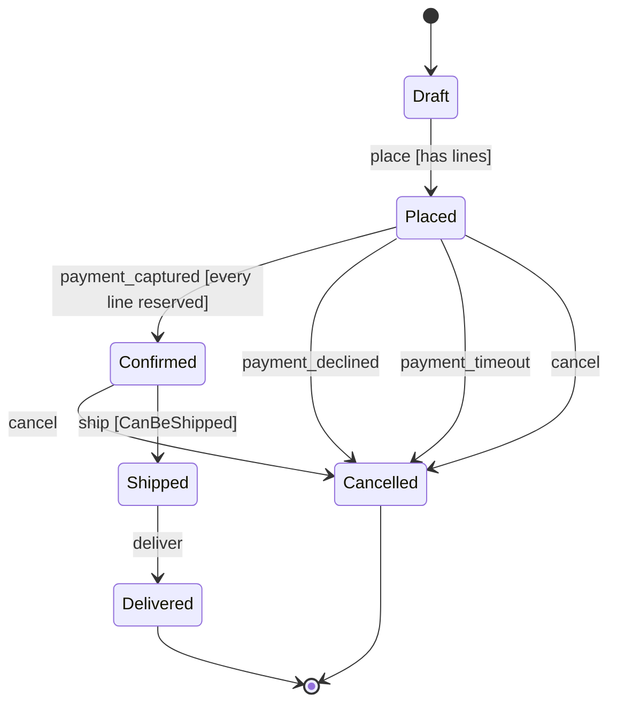

## Scope

本書は Ordering コンテキスト（CTX-001）の集約 `Order`（AGG-001）のライフサイクル **STM-001** を定義する。状態カラムは `orders.status`、履歴は `order_status_history` に追記する。

ライフサイクルを持つ候補として `Payment`（Requested → Authorized → Captured / Declined → Refunded）と `Reservation`（Pending → Confirmed → Committed / Released）も検討したが、いずれも遷移が 3〜4 本で分岐・タイムアウト・競合がなく、状態はコマンドのガードとして集約文書（AGG-003 / AGG-004）に書けば足りるため、本フェーズでは明示的な状態機械にしない。Order だけが「Placed 行に 4 種類のイベントが競合する」構造を持つ。

## States

| State | Kind | Invariant | Permits | Forbids |
|-------|------|-----------|---------|---------|
| `Draft` | initial | 決済要求なし・在庫引当なし・明細は編集可能 | addLine / removeLine / place | 出荷・決済イベントの適用 |
| `Placed` | normal | 明細は凍結。在庫引当と決済オーソリが進行中 | payment_captured / payment_declined / payment_timeout / cancel | 明細の変更、出荷 |
| `Confirmed` | normal | Captured な決済がちょうど 1 件あり、全明細に引当がある | ship / cancel（返金を伴う） | 明細の変更、決済の再適用 |
| `Shipped` | normal | 在庫は commit 済み。荷物は配送業者が保持 | deliver | cancel（返品フローへ誘導） |
| `Delivered` | terminal | 以後何も変化しない | — | すべて |
| `Cancelled` | terminal | 引当は解放済み、Captured な決済は返金済み | — | すべて |

## Events

| Event | Source | Triggered by |
|-------|--------|--------------|
| `place` | command | 顧客がカートを注文として確定する |
| `payment_captured` | event | Payment コンテキストの `PaymentCaptured`（決済キー `paymentId`） |
| `payment_declined` | event | Payment コンテキストの `PaymentDeclined` |
| `cancel` | command | 顧客のキャンセル操作（Placed / Confirmed のみ有効） |
| `ship` | command | 倉庫オペレータの出荷登録 |
| `deliver` | event | 配送業者の配達完了 Webhook |
| `payment_timeout` | timeout | Scheduler の reaper。Placed のまま決済結果が届かない注文を回収する |

## Transitions

| # | From | Event | Guard | Else | To | Effect | Actor | Consistency | Idempotency |
|---|------|-------|-------|------|----|--------|-------|-------------|-------------|
| — | `[*]` | place（creation） | カートに 1 明細以上、全明細 quantity ≥ 1 | creation rejected: `invalid-quantity` | Draft | Order 行を作成 | Customer | local | ignore |
| 1 | Draft | `place` | 明細が 1 件以上ある | reject: `order-empty` | Placed | 明細を凍結し `OrderPlaced` を発行 | Customer | local | ignore |
| 2 | Placed | `payment_captured` | 全明細に引当がある | defer: `awaiting-reservation`（`StockReserved` 到着後に再適用） | Confirmed | `paymentId` を記録し `OrderConfirmed` を発行 | Payment context | saga | ignore |
| 3 | Placed | `payment_declined` | — | — | Cancelled | `OrderCancelled(reason=payment-declined)` を発行 | Payment context | saga | ignore |
| 4 | Placed | `payment_timeout` | — | — | Cancelled | `OrderCancelled(reason=payment-timeout)` を発行 | Scheduler | saga | ignore |
| 5 | Placed | `cancel` | — | — | Cancelled | `OrderCancelled(reason=customer)` を発行 | Customer | saga | ignore |
| 6 | Confirmed | `cancel` | — | — | Cancelled | `OrderCancelled(reason=customer)` を発行。返金は Payment が後続で行う | Customer | saga | ignore |
| 7 | Confirmed | `ship` | `CanBeShipped`（全明細の引当が Confirmed） | reject: `not-shippable` | Shipped | `OrderShipped` を発行 | Warehouse operator | local | ignore |
| 8 | Shipped | `deliver` | — | — | Delivered | `OrderDelivered` を発行 | Carrier webhook | local | ignore |

Idempotency 列は **同一リクエストの再配信**（同じ `paymentId`、同じ Webhook、同じ冪等キー）に対する判定であり、すべて `ignore`（元の結果を返し、効果は再実行しない）。遷移コミット後の **新規の** 同名イベントは次節のマトリクスが判定する（@rules/state-modeling.md §4）。

## State x Event Matrix

行 = 状態、列 = イベント。`→ State` は allow、それ以外は verdict と応答（問題型は @rules/api-error-standard.md の登録名）。

| State \ Event | place | payment_captured | payment_declined | cancel | ship | deliver | payment_timeout |
|---------------|-------|------------------|------------------|--------|------|---------|-----------------|
| Draft | → Placed | reject `payment-for-unplaced-order` | reject `payment-for-unplaced-order` | ignore（Draft は破棄であってキャンセルではない） | reject `order-not-confirmed` | reject `order-not-shipped` | ignore（Draft では決済要求がない） |
| Placed | ignore（発注済み・冪等） | → Confirmed（guard 偽なら defer） | → Cancelled | → Cancelled | reject `order-not-confirmed` | reject `order-not-shipped` | → Cancelled |
| Confirmed | ignore（発注済み・冪等） | ignore（capture の再配信。決済は 1 件記録済み） | reject `decline-after-capture`（オペレータへエスカレーション） | → Cancelled | → Shipped | reject `order-not-shipped` | ignore（決済済み） |
| Shipped | ignore（発注済み・冪等） | ignore（capture の再配信） | reject `decline-after-capture`（オペレータへエスカレーション） | reject `order-already-shipped`（返品フローへ） | ignore（出荷済み・冪等） | → Delivered | ignore（決済済み） |
| Delivered | ignore（terminal） | ignore（terminal） | reject `decline-after-capture`（オペレータへエスカレーション） | reject `order-already-delivered`（返品フローへ） | ignore（terminal） | ignore（配達 Webhook の再配信） | ignore（terminal） |
| Cancelled | ignore（terminal） | reject `capture-after-cancel`（返金フローへ） | ignore（キャンセル済み） | ignore（キャンセル済み・冪等） | reject `order-cancelled` | reject `order-cancelled` | ignore（terminal） |

Legend: `→ State` allow · `reject` illegal · `ignore` idempotent no-op · `defer` queued

42 セルすべてが決定済み（allow 8 / reject 16 / ignore 18）。`Cancelled × payment_captured` を `ignore` にしない理由は、キャンセル後に届いた capture は顧客から金が取られた状態であり、黙って捨てると返金が起動しないため。`reject` として Payment に返し、`OrderCancelled` を契機とする refund（TX-005）へ回す。

## Diagram

## Concurrency and Consistency

`orders` の 1 行を複数のアクタが同時に更新する組み合わせ。ScalarDB Cluster 3.19 の Consensus Commit（OCC）では同一行への同時書込みは一方だけがコミットし、他方は `CommitConflictException` で失敗する。敗者は **状態を読み直してガードを再評価**してから再試行し、再評価の結果がマトリクス上 `ignore` / `reject` になればその応答を返す（再試行で遷移を二重適用しない）。

| Contention | Who vs. who | Expected rate | Winner | What the loser does |
|------------|-------------|---------------|--------|---------------------|
| Placed: `payment_captured` vs `payment_declined` | Payment consumer 同士 | ほぼ 0（PSP は 1 決済に 1 結果） | first commit | 再読込。Confirmed なら decline は `reject decline-after-capture`、Cancelled なら capture は `reject capture-after-cancel` |
| Placed: `payment_captured` vs `payment_timeout` | Payment consumer vs Scheduler reaper | 低（reaper の閾値 30 分に対し PSP 応答は秒単位）。閾値付近では発生する | first commit | reaper が負けたら次回スイープで `ignore`（決済済み）。consumer が負けたら Cancelled を読み `reject capture-after-cancel` → 返金 |
| Placed: `cancel` vs `payment_captured` | Customer vs Payment consumer | 低〜中（決済待ちの数秒間に顧客が取消を押すケース） | first commit | 顧客が負けたら Confirmed を読み直し、遷移 6（Confirmed → Cancelled、返金あり）として再適用。consumer が負けたら Cancelled を読み `reject capture-after-cancel` |
| Placed: `cancel` vs `payment_declined` / `payment_timeout` | Customer vs Payment / Scheduler | 低 | first commit | 敗者は Cancelled を読み `ignore`（結果は同じ、`reason` は勝者のもの） |
| Placed: `payment_captured` vs `StockReserved` の適用 | Payment consumer vs Inventory consumer | 中（注文直後に両方が同一行へ書く） | first commit | 引当側が負けたら再試行（引当済みフラグは列の加算のみ）。capture 側は guard 偽なら `defer` し、`StockReserved` 適用後に再配信で Confirmed へ |
| Confirmed: `ship` vs `cancel` | Warehouse operator vs Customer | 低 | first commit | 出荷が負けたら Cancelled を読み `reject order-cancelled`。顧客が負けたら Shipped を読み `reject order-already-shipped` |
| Shipped: `deliver` の重複 Webhook | Carrier webhook 同士 | 低 | first commit | Delivered を読み `ignore` |

### 遷移ごとのトランザクション分類

- **local**（1, 7, 8）: Ordering サービス内の 1 トランザクション。`orders` 行と `order_status_history` 行を同時に書き、イベントは同一トランザクションの outbox に書く（TX-001）。
- **saga**（2〜6）: ADR-003 の注文確定 Saga のステップ。Order 側の書込みは常に 1 ローカルトランザクション（TX-004）だが、その前後に他コンテキストの補償が続く。補償は「前の状態に戻す」のではなく実在の状態 `Cancelled` へ遷移し、Inventory の release と Payment の refund はそれを **契機として** 各自のローカルトランザクションで行う。`Cancelled` の不変条件「引当解放済み・返金済み」は結果整合であり、Saga 完了時点で成立する。
- **`UnknownTransactionStatusException`** はどの遷移でも「失敗」と解釈しない。呼び出し側は `orders.status` と `order_status_history` の末尾（`correlation_id` = 元のリクエストの冪等キー）を読み直し、遷移が記録済みならその結果を返し、未記録なら再実行する。

## Time-Driven Transitions

| Expiring state | Deadline | Fires | Target | Who | Race |
|----------------|----------|-------|--------|-----|------|
| Placed | `placed_at + 30 分` に決済結果が未着 | `payment_timeout` | Cancelled | Scheduler reaper（1 分間隔、リースを取得した 1 インスタンスのみ） | reaper は `status = Placed` を **トランザクション内で再確認**してから書く。`payment_captured` に負けた場合は次回スイープで `ignore`。逆に reaper が勝った後に届いた capture は `reject capture-after-cancel` となり返金へ回る（TX-005） |

閾値 30 分は PSP のオーソリ有効期間より十分短い値として置いた仮値（OQ-004）。reaper の列挙・リース・チェックポイントは `scalardb-transaction.md` § Saga の reaper 設計に従う。

## Persistence

- **現在状態**: `orders.status` に状態名を文字列で保持する（序数にしない）。`orders` は `order_id` をパーティションキーとする 1 行で、状態カラム・`payment_id`・引当済み明細数が同一 OCC スコープに入る。明細 `order_lines` は同じパーティションキーに置き、Placed 以降は書かない。
- **履歴（Lifecycle of history）**: `order_status_history` を **必ず記録する**。理由は 3 つ — 遷移が金（決済・返金）と物（在庫）を動かす、CS が「なぜこの注文は Cancelled なのか」（`reason` = customer / payment-declined / payment-timeout）を問う、監査で決済と注文状態の突合が要る。行は append-only で `(order_id, seq)` をキーに `from_status`, `to_status`, `event`, `actor`, `occurred_at`, `correlation_id` を持ち、状態遷移と **同一トランザクション** で書く。Draft 期間の addLine / removeLine は状態遷移ではないため記録しない（明細の変更履歴は不要と判断、OQ-012）。

## Open Items

| ID | Item | Status | Owner |
|----|------|--------|-------|
| OQ-004 | `payment_timeout` の閾値（仮: 30 分）。PSP のオーソリ有効期間と CS の許容待ち時間から確定する | unasked（`--auto` 実行） | Product owner |
| OQ-012 | Draft 期間の明細変更履歴を `order_status_history` とは別に残すか | unasked | Product owner |
| OQ-013 | `decline-after-capture` / `capture-after-cancel` のエスカレーション先（オペレータキュー or 自動返金） | unasked | Operations |
| — | 出荷後・配達後のキャンセルは返品フロー（別集約 `Return`）へ誘導する。本フェーズでは未設計 | deferred | Architect |

`tools/lib/state_machine_manifest.py` の 7 規則（初期状態 1 つ、全状態到達可能、未宣言の袋小路なし、決定性、ガードの else、遷移ごとの actor と consistency、マトリクス欠落なし）はすべて通過。ユビキタス言語との照合: `Placed` / `Confirmed` は現行コードの `PENDING` / `PAID` に対応し、名称変更を `ubiquitous-language.md` に提案する。

## Traceability

| ID | Type | Upstream | Downstream |
|----|------|----------|------------|
| STM-001 | state-machine | AGG-001（Order）, CTX-001（Ordering）, ADR-003（Saga による注文確定） | `scalardb-transaction.md` TX-001 / TX-004 / TX-005、`design-api`（問題型の登録）、`generate-test-specs`（マトリクス 42 セルをシナリオ化） |

`work/traceability.json` には `{ "id": "STM-001", "type": "state-machine", "skill": "design-state-machine", "source_file": "reports/03_design/state-machines/state-machine-order.md", "upstream": ["AGG-001", "CTX-001", "ADR-003"] }` を追記し、`aggregate-manifest.json` の AGG-001 `state_machine` に `STM-001` を書き戻している。
