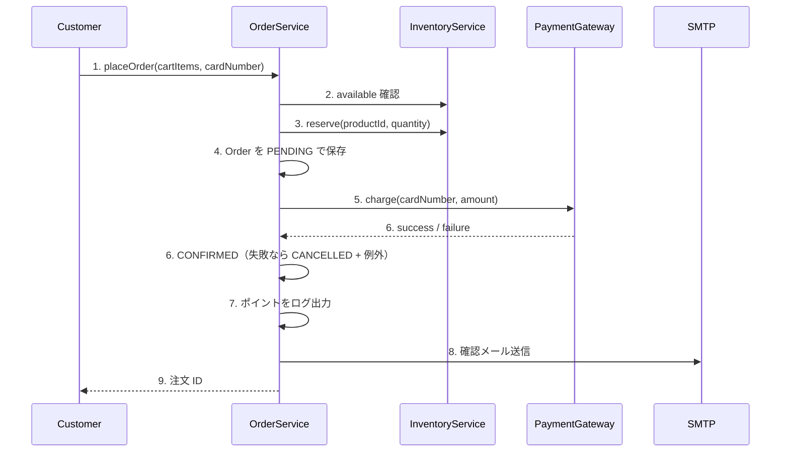
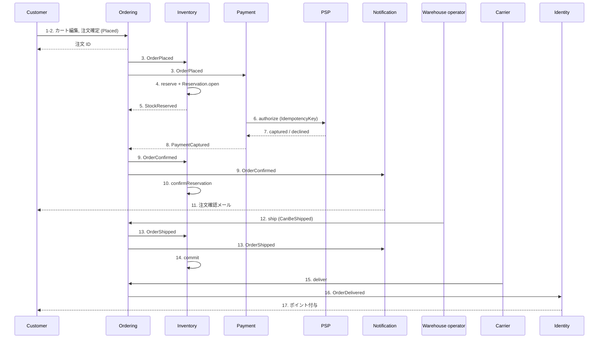

## ストーリー概要

顧客がカートの商品を注文し、在庫が引き当てられ、決済が完了し、倉庫が出荷し、配送業者が配達して、顧客がポイントを受け取るまでを描く。現行モノリス（as-is）では `OrderService.placeOrder()` が 1 トランザクションの中で全てを同期実行し、出荷・配達の遷移は実装されていない。目標（to-be）では Ordering が `OrderPlaced` を発行した後、Inventory と Payment が各自のペースで応答し、Ordering はその結果を受けて状態を決める（ADR-003）。

## アクター

| Actor | 種別 | このストーリーでの役割 |
|-------|------|------------------------|
| Customer（顧客） | 人 | 商品を選び、注文を確定し、配達を受け取る |
| Warehouse operator（倉庫担当者） | 人 | 引当済みの注文を梱包し出荷する |
| Carrier（配送業者） | 外部システム（webhook） | 配達完了を通知する |
| PSP | 外部システム | カードの与信と売上確定を行う |
| Ordering | システム（CTX-001） | Order のライフサイクルを管理する |
| Inventory | システム（CTX-002） | StockItem の引当・確定・解放を行う |
| Payment | システム（CTX-003） | Payment を与信・売上確定・返金する |
| Notification | システム（CTX-006） | 顧客にメールを送る |
| Identity | システム（CTX-005） | ポイントを付与する |

## ワークオブジェクト

| Work Object | ドメイン用語 | 説明 |
|-------------|--------------|------|
| カート | Draft（Order） | 確定前の注文。明細を編集できる |
| 注文 | Order / OrderLine | 確定した購入意思。ProductSnapshot を持つ明細の集合 |
| 引当 | Reservation | 「この注文のこの商品」に確保した数量の記録 |
| 決済 | Payment | 注文金額に対する与信・売上確定の記録 |
| 確認メール | Notification | 注文確定・出荷を知らせるメール |
| ポイント | LoyaltyPoint | 配達完了金額 100 円ごとに 1 ポイント |

## 現行フロー（as-is）

`POST /api/orders` の 1 リクエストで、`@Transactional` な `placeOrder()` が以下を順に行う。どこかで例外が出ると全体がロールバックされるが、`PaymentGateway.charge()` は外部呼び出しなので課金だけが残ることがある。

| # | Actor | Activity | Work Object | 宛先 |
|---|-------|----------|-------------|------|
| 1 | Customer | カートと カード番号を送る | cartItems, cardNumber | OrderService |
| 2 | OrderService | 各商品の `available` を確認し、不足なら例外 | Inventory | InventoryRepository |
| 3 | OrderService | `reserve(productId, quantity)` で reserved を加算 | Inventory | InventoryService |
| 4 | OrderService | 注文を PENDING で保存 | Order | OrderRepository |
| 5 | OrderService | `charge(cardNumber, amount)` を同期実行 | Payment | PaymentGateway |
| 6 | OrderService | 失敗なら CANCELLED にして例外、成功なら SUCCESS の Payment を保存し CONFIRMED | Order, Payment | OrderRepository |
| 7 | OrderService | `totalAmount / 100` をポイントとしてログ出力（永続化なし） | ポイント | ログ |
| 8 | OrderService | 確認メールを送信（SMTP 障害は注文失敗） | 確認メール | SMTP |
| 9 | Customer | 注文 ID を受け取る | Order | — |

出荷（SHIPPED）と配達（DELIVERED）へ遷移させる処理はない。

## 目標フロー（to-be）

Ordering は注文を Placed で受け付けて即座に応答し（NFR-001）、以降はイベントで進む。

| # | Actor | Activity | Work Object | 宛先 |
|---|-------|----------|-------------|------|
| 1 | Customer | カートに商品を入れる・外す | Draft | Ordering |
| 2 | Customer | 注文を確定する | Order（Placed） | Ordering |
| 3 | Ordering | `OrderPlaced` を発行する | Order | Inventory, Payment |
| 4 | Inventory | 各明細の在庫を引き当て、Reservation を開く | StockItem, Reservation | — |
| 5 | Inventory | `StockReserved` を返す | Reservation | Ordering |
| 6 | Payment | 冪等キー付きで PSP に与信を依頼する | Payment | PSP |
| 7 | PSP | 与信・売上の結果を返す | Payment | Payment |
| 8 | Payment | `PaymentCaptured`（または `PaymentDeclined`）を発行する | Payment | Ordering |
| 9 | Ordering | 注文を Confirmed にし `OrderConfirmed` を発行する | Order | Inventory, Notification |
| 10 | Inventory | 引当を Confirmed にする | Reservation | — |
| 11 | Notification | 注文確認メールを送る | 確認メール | Customer |
| 12 | Warehouse operator | 引当済みの注文を出荷する（CanBeShipped） | Order（Shipped） | Ordering |
| 13 | Ordering | `OrderShipped` を発行する | Order | Inventory, Notification |
| 14 | Inventory | 引当を確定し onHand を減らす（commit） | StockItem, Reservation | — |
| 15 | Carrier | 配達完了を通知する | Order（Delivered） | Ordering |
| 16 | Ordering | `OrderDelivered` を発行する | Order | Identity |
| 17 | Identity | 100 円ごとに 1 ポイントを付与する | ポイント | Customer |

## 例外シナリオ

### 在庫不足
活動 4 で `HasAvailable` が偽なら Inventory は引当を拒否し（`insufficient-stock`）、`StockReserved` は発行されない。注文は Placed のまま `payment_timeout` を待つか、顧客がキャンセルする。OQ-017（引当不能を即時に Ordering へ通知するイベントを追加するか）は未決。

### 決済拒否
活動 7 で PSP が拒否すると Payment は `PaymentDeclined` を発行し、Ordering は注文を Cancelled にして `OrderCancelled` を発行する。Inventory は活動 4 で開いた引当を解放する（補償、ADR-003）。

### 確定後のキャンセル
Confirmed の注文を出荷前にキャンセルすると `OrderCancelled` を契機に Inventory が release、Payment が refund し、Notification がキャンセルメールを送る。

### 再配信
`OrderPlaced` が二度届いても、Reservation は (orderId, productId) で、Payment は IdempotencyKey で既存を返す。二重引当・二重課金は起きない（AGG-003 INV-1、AGG-004 INV-1）。

## 活動と集約コマンドの対応

| 活動 # | Aggregate | Command | consistency | 発行イベント |
|--------|-----------|---------|-------------|--------------|
| 1 | AGG-001 Order | addLine / removeLine | local | OrderLineAdded / OrderLineRemoved |
| 2 | AGG-001 Order | place | local | OrderPlaced |
| 4 | AGG-002 StockItem | reserve（also_writes: Reservation.open） | local | StockReserved |
| 6 | AGG-004 Payment | authorize | saga | PaymentAuthorized |
| 7 | AGG-004 Payment | capture / decline | saga | PaymentCaptured / PaymentDeclined |
| 9 | AGG-001 Order | confirm | saga | OrderConfirmed |
| 10 | AGG-003 Reservation | confirmReservation | local | none |
| 12 | AGG-001 Order | ship | local | OrderShipped |
| 14 | AGG-002 StockItem | commit（also_writes: Reservation.commitReservation） | local | StockCommitted |
| 15 | AGG-001 Order | deliver | local | OrderDelivered |
| 例外 | AGG-001 Order | cancel | saga | OrderCancelled |
| 例外 | AGG-002 StockItem | release（also_writes: Reservation.releaseReservation） | local | StockReleased |
| 例外 | AGG-004 Payment | refund | saga | PaymentRefunded |

活動 3・5・8・13・16 はイベント発行そのものであり、コマンドは持たない。活動 11・17 は Notification / Identity 側の処理で、集約マニフェストの対象外（Conformist、ADR-004）。

## 技術ノート

- 活動 2 の応答は Placed で返す。在庫引当・決済を同期で待たない（NFR-001 p95 < 500 ms）。
- 活動 4 と 14 は StockItem と Reservation を同一ローカルトランザクションで書く唯一の例外（ADR-002）。
- 活動 6〜8 は外部 I/O を含むため ScalarDB のトランザクション外。Payment の状態遷移は PSP 応答ごとに独立したトランザクションで記録する。
- 全イベントは at-least-once で配信され、消費側は集約 ID を冪等キーとする（`domain-event-catalog.json`）。
