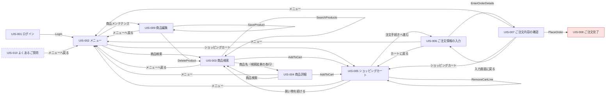

## 概要（Summary）

| 指標 | 件数 |
|---|---|
| 画面数 | 10 |
| 入口画面 | UIS-001 |
| 部品数 | 12 |
| 機能数 | 9 |
| タスク数 | 7 |
| 画面層ロジック | 9 |
| 未解決事項 | 0 |
| 行き止まり | UIS-008 |
| 孤立画面 | UIS-010 |
| 最大の深さ | 5 |

## 画面遷移図（Screen Transition Diagram）

破線: 孤立画面（どこからもリンクされない）。赤: 行き止まり。共通ヘッダ・フッタの操作（ログアウトなど）は省略。

## 画面一覧（Screen List）

| ID | 名前 | ルート | ロール | 入力 | 出力 | 操作 | 深さ | 出典 |
|---|---|---|---|---|---|---|---|---|
| UIS-001 | ログイン | `/login` | anonymous | 2 | 0 | 1 | 0 | `src/main/webapp/WEB-INF/jsp/login.jsp` |
| UIS-002 | メニュー | `/menu` | customer, admin | 0 | 1 | 4 | 1 | `src/main/webapp/WEB-INF/jsp/menu.jsp` |
| UIS-003 | 商品検索 | `/products` | customer, admin | 2 | 2 | 6 | 2 | `src/main/webapp/WEB-INF/jsp/product/search.jsp` |
| UIS-004 | 商品詳細 | `/products/detail` | customer, admin | 1 | 1 | 4 | 3 | `src/main/webapp/WEB-INF/jsp/product/detail.jsp` |
| UIS-005 | ショッピングカート | `/cart` | customer, admin | 0 | 2 | 6 | 2 | `src/main/webapp/WEB-INF/jsp/cart.jsp` |
| UIS-006 | ご注文情報の入力 | `/order/entry` | customer, admin | 7 | 1 | 5 | 3 | `src/main/webapp/WEB-INF/jsp/order/entry.jsp` |
| UIS-007 | ご注文内容の確認 | `/order/confirm` | customer, admin | 0 | 3 | 5 | 4 | `src/main/webapp/WEB-INF/jsp/order/confirm.jsp` |
| UIS-008 | ご注文完了 | `/order/complete` | customer, admin | 0 | 1 | 0 | 5 | `src/main/webapp/WEB-INF/jsp/order/complete.jsp` |
| UIS-009 | 商品編集 | `/admin/products/edit` | admin | 4 | 1 | 6 | 2 | `src/main/webapp/WEB-INF/jsp/admin/product-edit.jsp` |
| UIS-010 | よくあるご質問 | `/help.jsp` | customer, admin | 0 | 1 | 2 | - | `src/main/webapp/help.jsp` |

## 画面詳細（Screen Details）

### UIS-001 ログイン

**INPUT（入力）**

| ラベル | 名前 | コントロール | 型 | 必須 | 検証 | 備考 |
|---|---|---|---|---|---|---|
| ユーザーID | `userId` | text | string | あり | required=True @server | - |
| パスワード | `password` | password | string | あり | required=True @server | - |

**OUTPUT（出力）**

なし。

**操作**

| ラベル | コマンド | 遷移先 / エンドポイント | 送信する入力 | 破壊的 | 確認 | ガード |
|---|---|---|---|---|---|---|
| ログイン | `LogIn` | UIS-002 (POST /login) | userId, password | なし | なし | - |

**メッセージ**

- [error] ユーザーIDとパスワードを入力してください。 (`src/main/java/com/example/shop/web/LoginServlet.java:33`)
- [error] ユーザーIDまたはパスワードが正しくありません。 (`src/main/java/com/example/shop/web/LoginServlet.java:39`)

**アクセス制御**: none — anonymous

### UIS-002 メニュー

**INPUT（入力）**

なし。

**OUTPUT（出力）**

| ラベル | 種別 | 項目 |
|---|---|---|
| アカウント情報 | field | 氏名, メールアドレス |

**操作**

| ラベル | コマンド | 遷移先 / エンドポイント | 送信する入力 | 破壊的 | 確認 | ガード |
|---|---|---|---|---|---|---|
| 商品検索 | - | UIS-003 (GET /products) | - | なし | なし | - |
| ショッピングカート | - | UIS-005 (GET /cart) | - | なし | なし | - |
| 商品メンテナンス | - | UIS-009 (GET /admin/products/edit) | - | なし | なし | view admin |
| ログアウト | `LogOut` | UIS-001 (GET /logout) | - | あり | なし | - |

**アクセス制御**: required — customer, admin; filter @ `src/main/java/com/example/shop/filter/LoginFilter.java:19-44`

### UIS-003 商品検索

**INPUT（入力）**

| ラベル | 名前 | コントロール | 型 | 必須 | 検証 | 備考 |
|---|---|---|---|---|---|---|
| キーワードを入力 | `keyword` | text | string | なし | - | - |
| カテゴリ | `category` | select | enum | なし | - | - |
| - | `productId` | hidden | string | あり | - | - |
| - | `quantity` | hidden | integer | あり | - | prefill: 固定値 1（hidden、search.jsp:47） |

**OUTPUT（出力）**

| ラベル | 種別 | 項目 |
|---|---|---|
| {0}件の商品が見つかりました | field | hitCount |
| 検索結果 | table | image, name, price, stock |

**操作**

| ラベル | コマンド | 遷移先 / エンドポイント | 送信する入力 | 破壊的 | 確認 | ガード |
|---|---|---|---|---|---|---|
| 検索 | `SearchProducts` | UIS-003 (GET /products) | keyword, category | なし | なし | - |
| カートに追加 | `AddToCart` | UIS-005 (POST /cart) | productId, quantity | なし | なし | - |
| 前へ / ページ番号 / 次へ | - | UIS-003 (GET /products) | - | なし | なし | - |
| ログアウト | `LogOut` | UIS-001 (GET /logout) | - | あり | なし | - |
| メニューへ戻る | - | UIS-002 (GET /menu) | - | なし | なし | - |
| 商品名（検索結果の各行） | - | UIS-004 (GET /products/detail) | - | なし | なし | - |

**メッセージ**

- [info] 該当する商品はありません。 (`src/main/resources/messages_ja.properties:8`)
- [info] 在庫切れ (`src/main/resources/messages_ja.properties:14`)
- [info] {0}件の商品が見つかりました (`src/main/resources/messages_ja.properties:7`)

**アクセス制御**: required — customer, admin; filter @ `src/main/java/com/example/shop/filter/LoginFilter.java:19-44`

### UIS-004 商品詳細

**INPUT（入力）**

| ラベル | 名前 | コントロール | 型 | 必須 | 検証 | 備考 |
|---|---|---|---|---|---|---|
| 数量 | `quantity` | number | integer | なし | min=1 @both (clamp), max=99 @both (clamp) | prefill: 既定値 1（detail.jsp:25） |
| - | `productId` | hidden | string | あり | - | - |

**OUTPUT（出力）**

| ラベル | 種別 | 項目 |
|---|---|---|
| 商品詳細 | field | 商品コード, 商品名, カテゴリ, 価格, 在庫 |

**操作**

| ラベル | コマンド | 遷移先 / エンドポイント | 送信する入力 | 破壊的 | 確認 | ガード |
|---|---|---|---|---|---|---|
| カートに入れる | `AddToCart` | UIS-005 (POST /cart) | productId, quantity | なし | なし | - |
| メニュー | - | UIS-002 (GET /menu) | - | なし | なし | - |
| 商品検索 | - | UIS-003 (GET /products) | - | なし | なし | - |
| ログアウト | `LogOut` | UIS-001 (GET /logout) | - | あり | なし | - |

**メッセージ**

- [error] この商品は現在在庫切れのため、ご注文いただけません。 (`src/main/webapp/WEB-INF/jsp/product/detail.jsp:30`)
- [error] 指定された商品は見つかりません。 (`src/main/java/com/example/shop/web/ProductDetailServlet.java:24`)

**アクセス制御**: required — customer, admin; filter @ `src/main/java/com/example/shop/filter/LoginFilter.java:19-44`

### UIS-005 ショッピングカート

**INPUT（入力）**

| ラベル | 名前 | コントロール | 型 | 必須 | 検証 | 備考 |
|---|---|---|---|---|---|---|
| - | `productId` | hidden | string | あり | - | - |

**OUTPUT（出力）**

| ラベル | 種別 | 項目 |
|---|---|---|
| ショッピングカート内容 | table | 商品名, 単価, 数量, 金額 |
| 合計（税抜） | field | subtotal |

**操作**

| ラベル | コマンド | 遷移先 / エンドポイント | 送信する入力 | 破壊的 | 確認 | ガード |
|---|---|---|---|---|---|---|
| 削除 | `RemoveCartLine` | UIS-005 (POST /cart) | productId | あり | なし | - |
| 買い物を続ける | - | UIS-003 (GET /products) | - | なし | なし | - |
| 注文手続きへ進む | - | UIS-006 (GET /order/entry) | - | なし | なし | - |
| 商品を探す | - | UIS-003 (GET /products) | - | なし | なし | - |
| メニュー | - | UIS-002 (GET /menu) | - | なし | なし | - |
| ログアウト | `LogOut` | UIS-001 (GET /logout) | - | あり | なし | - |

**メッセージ**

- [info] カートに商品が入っていません。 (`src/main/webapp/WEB-INF/jsp/cart.jsp:11`)
- [info] ※表示価格はすべて税抜です。消費税および会員割引はご注文手続きの画面で計算されます。在庫状況によりお届けまでお時間をいただく場合があります。 (`src/main/webapp/WEB-INF/jsp/cart.jsp:40`)

**アクセス制御**: required — customer, admin; filter @ `src/main/java/com/example/shop/filter/LoginFilter.java:19-44`

### UIS-006 ご注文情報の入力

**INPUT（入力）**

| ラベル | 名前 | コントロール | 型 | 必須 | 検証 | 備考 |
|---|---|---|---|---|---|---|
| お届け先氏名 | `shippingName` | text | string | あり | required @server | prefill: ログインユーザーの氏名（OrderEntryServlet.java:34-36、注文フォーム未作成時） |
| 郵便番号 | `postalCode` | text | string | あり | required @server, pattern=^\d{3}-\d{4}$ @client, maxLength=8 @client | - |
| 住所 | `address` | text | string | あり | required @server | - |
| 電話番号 | `phone` | text | string | あり | required @server | - |
| メールアドレス | `email` | text | string | あり | required @server, format=contains '@' @server | redundant: ログインユーザーのメールアドレス（User.email、メニュー画面に表示）— 入力画面では初期表示されない |
| お支払い方法 | `paymentMethod` | radio | enum | あり | required @server, enum=['CARD', 'BANK', 'COD'] @server | prefill: 既定値 CARD（OrderEntryServlet.java:37、注文フォーム未作成時） |
| 備考 | `notes` | textarea | string | なし | - | - |

**OUTPUT（出力）**

| ラベル | 種別 | 項目 |
|---|---|---|
| 商品小計（税抜）／会員割引 | field | subtotal, discount |

**操作**

| ラベル | コマンド | 遷移先 / エンドポイント | 送信する入力 | 破壊的 | 確認 | ガード |
|---|---|---|---|---|---|---|
| 確認画面へ進む | `EnterOrderDetails` | UIS-007 (POST /order/entry) | shippingName, postalCode, address, phone, email, paymentMethod, notes | なし | なし | - |
| カートに戻る | - | UIS-005 (GET /cart) | - | なし | なし | - |
| メニュー | - | UIS-002 (GET /menu) | - | なし | なし | - |
| ショッピングカート | - | UIS-005 (GET /cart) | - | なし | なし | - |
| ログアウト | `LogOut` | UIS-001 (GET /logout) | - | あり | なし | - |

**メッセージ**

- [error] 入力内容に誤りがあります。以下の項目をご確認ください。 (`src/main/webapp/WEB-INF/jsp/order/entry.jsp:40`)
- [error] お届け先氏名を入力してください。 (`src/main/java/com/example/shop/web/OrderEntryServlet.java:62`)
- [error] 郵便番号を入力してください。 (`src/main/java/com/example/shop/web/OrderEntryServlet.java:63`)
- [error] 住所を入力してください。 (`src/main/java/com/example/shop/web/OrderEntryServlet.java:64`)
- [error] 電話番号を入力してください。 (`src/main/java/com/example/shop/web/OrderEntryServlet.java:65`)
- [error] メールアドレスを入力してください。 (`src/main/java/com/example/shop/web/OrderEntryServlet.java:66`)
- [error] メールアドレスの形式が正しくありません。 (`src/main/java/com/example/shop/web/OrderEntryServlet.java:68`)
- [error] お支払い方法を選択してください。 (`src/main/java/com/example/shop/web/OrderEntryServlet.java:71`)
- [error] 郵便番号は「123-4567」の形式で入力してください。 (`src/main/webapp/js/validation.js:17`)

**アクセス制御**: required — customer, admin; filter @ `src/main/java/com/example/shop/filter/LoginFilter.java:19-44`

### UIS-007 ご注文内容の確認

**INPUT（入力）**

なし。

**OUTPUT（出力）**

| ラベル | 種別 | 項目 |
|---|---|---|
| ご注文商品 | table | product.name, product.price, quantity, lineTotal |
| 金額（小計／割引／消費税／合計） | field | subtotal, discount, tax, total |
| お届け先・お支払い方法 | field | shippingName, postalCode, address, phone, email, paymentMethodLabel, notes |

**操作**

| ラベル | コマンド | 遷移先 / エンドポイント | 送信する入力 | 破壊的 | 確認 | ガード |
|---|---|---|---|---|---|---|
| 注文を確定する | `PlaceOrder` | UIS-008 (POST /order/confirm) | - | なし | あり | - |
| 入力画面に戻る | - | UIS-006 (GET /order/entry) | - | なし | なし | - |
| メニュー | - | UIS-002 (GET /menu) | - | なし | なし | - |
| ショッピングカート | - | UIS-005 (GET /cart) | - | なし | なし | - |
| ログアウト | `LogOut` | UIS-001 (GET /logout) | - | あり | なし | - |

**アクセス制御**: required — customer, admin; filter @ `src/main/java/com/example/shop/filter/LoginFilter.java:19-44`

### UIS-008 ご注文完了

**INPUT（入力）**

なし。

**OUTPUT（出力）**

| ラベル | 種別 | 項目 |
|---|---|---|
| ご注文番号 | field | orderNo |

**操作**

なし。

**メッセージ**

- [success] ご注文ありがとうございました。 (`src/main/webapp/WEB-INF/jsp/order/complete.jsp:22`)
- [info] ご入力いただいたメールアドレスに注文確認メールをお送りしました。 (`src/main/webapp/WEB-INF/jsp/order/complete.jsp:24`)

**アクセス制御**: required — customer, admin; filter @ `src/main/java/com/example/shop/filter/LoginFilter.java:19-44`

### UIS-009 商品編集

**INPUT（入力）**

| ラベル | 名前 | コントロール | 型 | 必須 | 検証 | 備考 |
|---|---|---|---|---|---|---|
| - | `id` | hidden | string | なし | - | prefill: 編集中の商品の商品コード（新規登録時は空） |
| 商品名 | `name` | text | string | あり | required @server | prefill: 編集中の商品（ShopData#findProduct） |
| 価格（税抜） | `price` | text | integer | あり | format=integer @server, min=0 @server | prefill: 編集中の商品（ShopData#findProduct） |
| 在庫数 | `stock` | text | integer | あり | format=integer @server, min=0 @server | prefill: 編集中の商品（ShopData#findProduct） |
| カテゴリ | `category` | select | enum | あり | enum=['文房具', '事務用品', 'オフィス家具'] @server | prefill: 編集中の商品のカテゴリ、新規登録時はカテゴリ一覧の先頭（AdminProductEditServlet.java:29） |

**OUTPUT（出力）**

| ラベル | 種別 | 項目 |
|---|---|---|
| 商品コード | field | id |

**操作**

| ラベル | コマンド | 遷移先 / エンドポイント | 送信する入力 | 破壊的 | 確認 | ガード |
|---|---|---|---|---|---|---|
| 保存 | `SaveProduct` | UIS-009 (POST /admin/products/edit) | id, name, price, stock, category | なし | なし | - |
| 削除 | `DeleteProduct` | UIS-003 (POST /admin/products/edit) | id | あり | なし | - |
| 商品一覧へ | - | UIS-003 (GET /products) | - | なし | なし | - |
| メニューへ戻る | - | UIS-002 (GET /menu) | - | なし | なし | - |
| メニュー | - | UIS-002 (GET /menu) | - | なし | なし | - |
| ログアウト | `LogOut` | UIS-001 (GET /logout) | - | あり | なし | - |

**メッセージ**

- [error] この画面を表示する権限がありません。 (`src/main/webapp/WEB-INF/jsp/admin/product-edit.jsp:13`)
- [info] 保存しました。 (`src/main/webapp/WEB-INF/jsp/admin/product-edit.jsp:22`)
- [error] エラーが発生しました (`src/main/webapp/WEB-INF/jsp/admin/product-edit.jsp:25`)

**アクセス制御**: required — admin; filter @ `src/main/java/com/example/shop/filter/LoginFilter.java:19-44`, view @ `src/main/webapp/WEB-INF/jsp/admin/product-edit.jsp:9-17`

### UIS-010 よくあるご質問

**INPUT（入力）**

なし。

**OUTPUT（出力）**

| ラベル | 種別 | 項目 |
|---|---|---|
| よくあるご質問 | list | question, answer |

**操作**

| ラベル | コマンド | 遷移先 / エンドポイント | 送信する入力 | 破壊的 | 確認 | ガード |
|---|---|---|---|---|---|---|
| メニューへ戻る | - | UIS-002 (GET /menu) | - | なし | なし | - |
| ログアウト | `LogOut` | UIS-001 (GET /logout) | - | あり | なし | - |

**アクセス制御**: required — customer, admin; filter @ `src/main/java/com/example/shop/filter/LoginFilter.java:19-44`

## 画面とコードの対応（Screen-to-Code Map）

| ID | ハンドラ | サービス | エンティティ |
|---|---|---|---|
| UIS-001 | `LoginServlet#doGet` | - | - |
| UIS-001 | `LoginServlet#doPost` | ShopData#authenticate | User |
| UIS-002 | `MenuServlet#doGet` | - | - |
| UIS-003 | `ProductSearchServlet#doGet` | ShopData#categories, ShopData#searchProducts | Product |
| UIS-004 | `ProductDetailServlet#doGet` | ShopData#findProduct | Product |
| UIS-005 | `CartServlet#doGet` | - | Cart |
| UIS-005 | `CartServlet#doPost` | ShopData#findProduct | Cart, Product, CartLine |
| UIS-006 | `OrderEntryServlet#doGet` | - | Cart, OrderForm, User |
| UIS-006 | `OrderEntryServlet#doPost` | - | OrderForm, Cart |
| UIS-007 | `OrderConfirmServlet#doGet` | - | Cart, OrderForm |
| UIS-007 | `OrderConfirmServlet#doPost` | ShopData#placeOrder | Cart, OrderForm, Order, User |
| UIS-008 | `OrderCompleteServlet#doGet` | - | - |
| UIS-009 | `AdminProductEditServlet#doGet` | ShopData#categories, ShopData#findProduct | Product |
| UIS-009 | `AdminProductEditServlet#doPost` | ShopData#categories, ShopData#deleteProduct, ShopData#saveProduct | Product |

## 画面層の業務ロジック（Business Logic in the View Layer）

| ID | 種別 | 説明 | 本来の置き場所 | 出典 |
|---|---|---|---|---|
| UIS-002 | authorization | 「商品メンテナンス」メニュー項目の表示可否を、スクリプトレットがセッションの loginUser の getRole() を文字列 "admin" と比較して決めている。共通のアクセス制御ではなくビュー内の判定。 | application | `src/main/webapp/WEB-INF/jsp/menu.jsp:16-25` |
| UIS-003 | other | 注文可否（在庫数 > 0）をテンプレートの EL（p.stock > 0 / p.stock <= 0）で判定し、「カートに追加」フォームと「在庫切れ」表示を切り替えている。サーバーも CartServlet.java:37 で在庫を確認するが、ルールはドメインのメソッド（例: Product#isOrderable）にない。 | domain | `src/main/webapp/WEB-INF/jsp/product/search.jsp:43-51` |
| UIS-004 | other | 注文可否（在庫数 > 0）をテンプレートの EL で判定し、「在庫あり／在庫切れ」の表示（detail.jsp:16）とカート投入フォーム／在庫切れメッセージ（detail.jsp:19-31）を切り替えている。 | domain | `src/main/webapp/WEB-INF/jsp/product/detail.jsp:16-31` |
| UIS-005 | calculation | カート各行の金額（単価 × 数量）をサーバーは空欄で返し、cart.js が data-price / data-quantity から計算・書式化している。ドメインの CartLine#getLineTotal() と重複し、JavaScript が動かなければ金額は表示されない。 | domain | `src/main/webapp/js/cart.js:5-16` |
| UIS-006 | calculation | 会員割引（会員かつ商品小計が 10,000 円以上なら小計の 10%、切り捨て）をスクリプトレットで計算し、セッション属性 discount に書き込んでいる。注文確定（OrderConfirmServlet.java:39, 48-49）はこの値をそのまま使う。 | domain | `src/main/webapp/WEB-INF/jsp/order/entry.jsp:10-19` |
| UIS-006 | validation | 郵便番号の形式（^\d{3}-\d{4}$）はクライアントの JavaScript だけで検査している。サーバー（OrderEntryServlet.java:63）は必須チェックのみのため、直接 POST すれば形式ルールを回避できる。 | domain | `src/main/webapp/js/validation.js:5-19` |
| UIS-007 | calculation | 消費税（(小計 − 割引) × 10% の切り捨て）と支払合計をスクリプトレットで計算している。税率 10% はハードコード。 | domain | `src/main/webapp/WEB-INF/jsp/order/confirm.jsp:8-15` |
| UIS-007 | workflow | 計算した消費税・合計をビューがセッション属性 orderTax / orderTotal に書き込み、OrderConfirmServlet#doPost（OrderConfirmServlet.java:40-41, 48-49）がそれを読んで注文を登録する。確認画面を経由しないと注文できず、金額の正はビューにある。 | application | `src/main/webapp/WEB-INF/jsp/order/confirm.jsp:16-17` |
| UIS-009 | authorization | 管理者のみの制限をスクリプトレット（loginUser.role == "admin"）だけで行っている。AdminProductEditServlet の doGet / doPost にロールチェックはなく、ログイン済みの一般会員が /admin/products/edit に直接 POST すれば商品を保存・削除できる。 | application | `src/main/webapp/WEB-INF/jsp/admin/product-edit.jsp:9-17` |

## 未解決事項と未決事項（Unresolved Items and Open Questions）

なし。

| 未決事項 | 質問 | 状態 |
|---|---|---|
| OQ-001 | ご注文完了画面は「ご入力いただいたメールアドレスに注文確認メールをお送りしました。」と表示する（src/main/webapp/WEB-INF/jsp/order/complete.jsp:24）が、注文確定処理（OrderConfirmServlet.java:35-58、ShopData.java:114-123）にメール送信のコードはない。注文確認メールは送られているのか、どのシステムが送るのか？ | unasked |
| OQ-002 | 既存商品の編集画面（/admin/products/edit?id=…）へはどの画面からも遷移できない（メニューは新規登録 menu.jsp:21 のみ、商品検索・商品詳細は編集へリンクしない）。管理者は既存商品の価格・在庫をどうやって変更しているのか？ | unasked |
| OQ-003 | よくあるご質問（/help.jsp, src/main/webapp/help.jsp）はどの画面からもリンクされていない（孤立画面）。この画面は利用者に提供する想定か？ | unasked |
