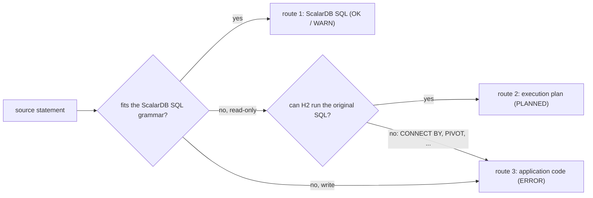

# How the SQL migration tooling works

The mechanism behind `/architect:design-sql-migration`, `implement-sql-migration` and
`verify-sql-migration`: the converter, execution plans, the Java runtime and the verification harness.
Grammar details and finding codes are in references/scalardb-grammar.md.

## Design principles

| Principle | Why | Implementation |
|---|---|---|
| Convert through a syntax tree | string replacement mishandles comments, literals and nesting | SQLGlot parses in the source dialect and the tree is rewritten |
| Never emit syntax ScalarDB lacks | a missed rewrite must surface as an error, not as SQL that silently passes | the ScalarDB dialect generator (`dialect.py`) raises on anything outside the grammar |
| List every reason a statement cannot convert | an estimate needs the whole workload, not the first obstacle | `appside.inventory()` inspects the whole statement, CTEs and subqueries included |
| Reads run the original SQL | rewriting semantics (NULL handling, rounding, ordering) easily changes results | fetched rows go into H2 in the source dialect's compatibility mode, which runs the original SQL |
| Never connect to ScalarDB's backend | bypassing ScalarDB skips its transactions and metadata | every fetch and load goes through ScalarDB SQL or the Core API; only the verification harness connects to the source database |
| Prove it on data | the converter's verdict misses type, literal and collation differences | the same statement runs on the source database and on ScalarDB, and result sets are compared |

## Three routes for one statement

The design skill maps these three onto the manifest's routes (`scalardb_sql` or `core_api` for route 1,
`plan` for route 2, `app_side` or `redesign` for route 3) — see @rules/sql-migration.md.

## Converting one statement

1. Split the script into statements and parse each in the source dialect. A parse failure is `ERROR PARSE`.
2. Pre-process: Oracle `(+)` becomes `LEFT JOIN`, identifiers are normalized, `REPLACE INTO` becomes `UPSERT`.
3. By statement kind:
   - `CREATE TABLE` / `CREATE INDEX` — map types, split the primary key into partition and clustering
     keys, drop constraints with a finding.
   - `SELECT` — normalize `WHERE` to DNF / CNF, expand `IN`, push `NOT` down, `ROWNUM` → `LIMIT`,
     implicit joins → `JOIN`.
   - `INSERT` / `UPDATE` / `DELETE` / `MERGE` — accept literals and binds only, reject column-referencing
     expressions, rewrite upserts.
4. Generate with the ScalarDB dialect. Anything outside the grammar becomes an ERROR with a code.
5. Analyse the access path against the known schema.
6. Decide: OK (only INFO findings), WARN (a WARN finding), or — when generation failed — PLANNED if the
   statement is read-only and decomposes into fetch + H2, otherwise ERROR with the application-side
   analysis attached.

## Access paths

With a table definition (DDL in the input, or `--schema`), every `SELECT` / `UPDATE` / `DELETE` is
classified.

| Equality predicates cover… | Access path | Note |
|---|---|---|
| the whole primary key | GET | one row by key |
| the partition key | partition SCAN | narrowed further by clustering-key ranges |
| a secondary-index column | index SCAN | |
| none of the above | cross-partition SCAN | WARN: cost grows with the table |

A cross-partition scan runs on a JDBC (RDBMS) backend with the conditions pushed down. On Cassandra it is
not used: the statement is ERROR (`NO_CROSS_PARTITION`), a plan reads by key instead where one exists, and
`FULL_SCAN` suggests which joined table to read first. A join is also checked for whether its `ON`
condition covers the joined table's primary key or a secondary index.

## Execution plans (fetch + H2)

A read statement ScalarDB SQL cannot run is split into the part ScalarDB narrows as far as it can
(**fetch**) and the part that runs the original SQL on the fetched rows (**residual**).

- A fetch reads, per table, only the columns the statement uses and only the predicates ScalarDB can
  evaluate (`column op literal` with AND / OR). Date literals inside `WITH` are pushed down too.
- The residual runs in H2 in the source dialect's compatibility mode (`MODE=Oracle|PostgreSQL|MySQL`).
  Oracle functions H2 lacks are added by `OracleFunctions`.
- A statement containing what H2 cannot run (`CONNECT BY`, `ROLLUP` / `CUBE` / `GROUPING SETS`,
  `PIVOT` / `UNPIVOT`, `KEEP`) is not planned (`RESIDUAL_H2`).

Plan JSON:

| Field | Content |
|---|---|
| `pattern` | why ScalarDB SQL could not run it (table below) |
| `source_dialect`, `source_sql` | the input |
| `fetch[]` | `table`, `namespace`, `alias`, `columns`, `column_types`, `predicates`, `scalardb_sql`, `access_path`, `max_rows`, `index_columns` |
| `residual` | per engine (`java`: H2 with `mode`, `sql`, `build_indexes`; `python`: sqlite3 for offline tests) |
| `guardrails` | `requires_cross_partition_scan`, `row_limit` |
| `unresolved` | what the decomposer could not place |
| `transaction` | `{"read_only": true}` |
| `recommended_config` | e.g. `scalar.db.scan_fetch_size` |

| Pattern | Reason | Pattern | Reason |
|---|---|---|---|
| P1 | expressions or functions in the select list | P7 | aggregation |
| P2 | expressions or column comparisons in `WHERE` | P8 | joins (`ON` not covering a key, outer joins) |
| P3 | `DISTINCT` | P13 | an `ORDER BY` the storage cannot execute |
| P4 | `OFFSET` | P14 | `OR` / `IN` over keys |
| P5 | subqueries | P15 | a cross-partition scan is unavailable |
| P6 | CTEs and set operations | | |

## Runtime (`runtime-java`)

| Component | Role |
|---|---|
| `Runner` | CLI: `run` a plan, `validate` a plan offline (compile the residual SQL against empty H2 tables), `load` rows through ScalarDB Core, run one ScalarDB SQL statement (`sql`) |
| `Fetcher` → `CoreFetcher` | ScalarDB Core API scans in a read-only transaction; no license |
| `Fetcher` → `JdbcFetcher` | ScalarDB SQL over JDBC; needs ScalarDB Cluster and a license |
| `Residual` | loads fetched rows into a per-request H2 database, optionally indexes them, runs the SQL |
| `OracleFunctions` | Oracle functions H2 lacks |
| `appside.*` | `Hierarchy`, `Windows`, `OracleNumbers`, `OracleOrdering`, `OracleDates`, `AppSideQuery` — see references/app-side-notes.md |
| `appside.golden.GoldenCheck` | runs an `AppSideQuery` against captured source results |

Running a plan: create H2 in the compatibility mode → begin one read-only ScalarDB transaction → fetch
each table and load it into H2 → commit → build indexes if asked → run the residual SQL → discard H2.

- All fetches of one plan share **one** transaction, so the tables are read at the same point in time.
- H2 is created per request and thrown away; it is never a data store.
- A fetch exceeding `max_rows` stops with `RowLimitExceededException`.

| H2 indexes | Off (default) | On |
|---|---|---|
| Suits | small online requests; one-table aggregation or sorting | batch jobs joining tables of tens of thousands of rows or more |
| 3-table join (20k orders, 50k lines) | 26–28 s | 1.7–1.9 s |
| 1-table aggregation (~1M rows) | baseline | +19–50 % for the build |
| H2 memory | baseline | about 1.6× |

## Write statements

| Cause | Result | Application-side pattern |
|---|---|---|
| literals and binds only, conditions ScalarDB can express | OK / WARN (e.g. update by primary key, `UPSERT`) | — |
| column-referencing expression (`qty = qty - 5`) | ERROR `RMW` | read → compute → write the literal, one transaction |
| subquery or join (`INSERT ... SELECT`) | ERROR `SUBQUERY` / `UPDATE_JOIN` | read the target keys, then write by key |
| sequence, current time, `DEFAULT` | ERROR `SEQUENCE` / `NOW` / `EXPR` | generate the value in the application and bind it |
| `DO NOTHING` / `IGNORE` / `RETURNING` | ERROR | existence check and write in one transaction |

The application-side patterns follow upstream's plan: P9 read-modify-write, P10 conditional write, P11 ID
generation, P12 application clock.

## Transactions and consistency

| Topic | Handling |
|---|---|
| Isolation | verified with `SERIALIZABLE`; cost estimates switch with `--isolation` (`SERIALIZABLE` re-reads scans at commit, about 2×) |
| Plan transactions | read-only (ScalarDB 3.16 and later skip the Coordinator write) |
| Parallel fetches | not done: a `SqlSession` / transaction is not thread-safe, so parallel fetches would split the snapshot |
| Backend access | never; fetch and load go through ScalarDB SQL or the Core API |
| Recreated tables | after changing a column type, restart ScalarDB Cluster (the backend's prepared-statement cache) |

## Performance

Measured upstream on a single laptop (Apple M3 Pro, Docker, one ScalarDB Cluster node, one client) —
an order of magnitude, not a production promise.

| Path | ScalarDB response | Driven by |
|---|---|---|
| converted writes | 3–6 ms including commit (7–20× the source) | round trips and commit |
| key reads | 4–6 ms (6–13×) | round trips |
| plan reads | median ~0.6 s | rows read (~25 µs per scanned row) |
| 3-table join (~67k rows fetched) | 26–28 s without H2 indexes, 1.7–1.9 s with | nested loops without indexes; the fetch with them |

`scan_fetch_size` 10 → 1000 speeds fetches 1.5–2.4×; parallel table fetches only 1.2–1.3×. The structural
fix is reading fewer rows: summary tables, key design, ScalarDB Analytics.
