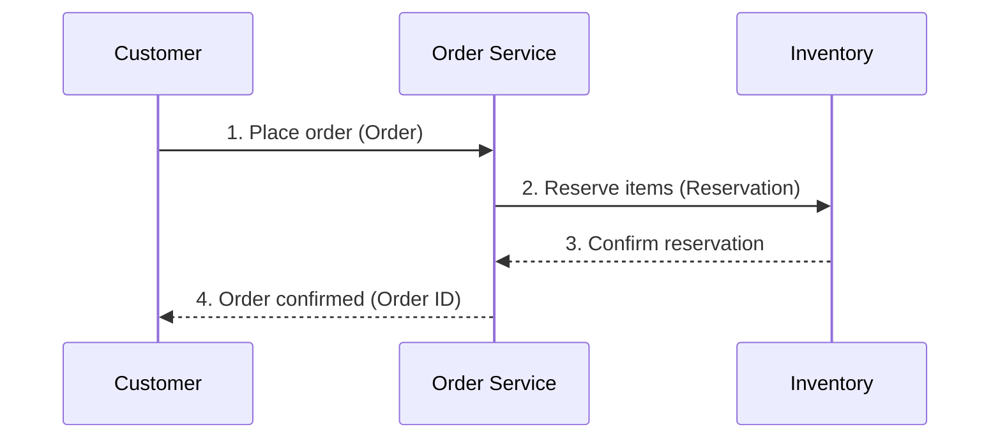

# Domain Story Creation

## Desired Outcome

Visualize the business process of a specific domain as a narrative using the Domain Storytelling technique. The story is expressed in three elements:

- **Actors** — People, roles, and systems that appear in the story
- **Work Items** — Objects and information handled by actors
- **Activities** — Actions performed by actors (numbered sequence arrows)

Generate one domain story per domain, with a Mermaid sequence diagram and narrative prose.

## Invocation

```
/architect:create-domain-story [--domain=<DomainName>] [--auto]
```

- `--domain` — Target domain name (e.g., `Order`, `Inventory`, `Payment`). Prompted interactively if omitted.
- `--auto` — Skip facilitation and generate automatically from existing analysis files.

## Execution Modes

### Interactive Mode (Default)

Facilitate a 7-stage process through dialogue with the user to elicit the domain story:

**Stage 1 — Setting the Scene**
Ask the user:
- Which domain to focus on (if `--domain` was not specified)?
- What is the scope of this story (a single use case, the main business flow, an exception scenario)?
- Which granularity level: coarse-grained (service level) or fine-grained (user task level)?

**Stage 2 — Actors**
Identify actors from `actors-roles-permissions.md` and present them for confirmation:
- Primary actors (people, user roles)
- Supporting actors (external systems, automated processes)
- Ask: "Are there any actors missing or incorrect?"

**Stage 3 — Work Items**
Identify work items (data, documents, domain objects) relevant to the domain:
- Reference `ubiquitous-language.md` for domain term alignment
- Ask: "What information or objects does each actor handle?"

**Stage 4 — Main Flow**
Walk through the main (happy path) flow step by step:
- Ask: "What does [Actor] do first?"
- For each step: who does what with which work item, and to whom?
- Assign sequential numbers to activities

**Stage 5 — Exception Scenarios**
Identify alternative and error flows:
- Ask: "What happens when [activity] fails or is not possible?"
- Note up to 3 significant exception paths

**Stage 6 — Technical Context**
Capture system constraints and technical elements:
- Which systems are involved behind the scenes?
- Are there asynchronous operations, batch jobs, or external integrations?
- Are there transaction boundaries relevant to this story?

**Stage 7 — Review and Document**
Summarize the elicited story and confirm with the user:
- Present the draft story for review
- Ask: "Does this accurately reflect how the business works?"
- Incorporate any corrections, then write the output file

### Auto-Generation Mode (`--auto`)

Generate the story automatically from existing analysis files without facilitation. Lower fidelity than interactive mode but suitable for bulk processing of multiple domains.

Steps:
1. Read `reports/03_design/bounded-contexts-redesign.md` — identify BC boundary and contained aggregates
2. Read `reports/01_analysis/actors-roles-permissions.md` — extract actors
3. Read `reports/01_analysis/ubiquitous-language.md` — build a term lookup table from the "Domain Term" column (this header is localized when output_language is not "en"; match the localized equivalent for the configured language)
4. Infer the most plausible main flow from the aggregate lifecycle
5. When naming actors and work items, look up each concept in the term table from step 3 and use the exact term verbatim. Do not invent synonyms or paraphrases.
6. Generate the story document directly

## Prerequisites

| File | Required/Recommended | Source |
|------|---------------------|--------|
| reports/03_design/bounded-contexts-redesign.md | Recommended | /architect:redesign |
| reports/01_analysis/ubiquitous-language.md | Recommended | /architect:analyze |
| reports/01_analysis/actors-roles-permissions.md | Recommended | /architect:analyze |

If none of these files exist, ask the user to provide domain context directly.

## Output

| File | Content |
|------|---------|
| `reports/04_stories/domain-story-{domain}.md` | Domain story — actors, work items, activity flow, Mermaid diagram, exception notes |

`{domain}` is the kebab-case domain name (e.g., `order`, `inventory`, `payment`).

Write all story content in the language configured in `work/pipeline-progress.json` (`options.output_language`). The YAML frontmatter keys remain in English regardless of the output language.

## Output Document Structure

```markdown
---
title: "Domain Story: {Domain}"
schema_version: 1
phase: "Phase 4: Domain Stories"
skill: create-domain-story
generated_at: "ISO8601"
domain: "{domain}"
mode: "interactive|auto"
input_files:
  - reports/03_design/bounded-contexts-redesign.md
  - reports/01_analysis/actors-roles-permissions.md
  - reports/01_analysis/ubiquitous-language.md
---

# Domain Story: {Domain}

## Story Overview

[2–3 sentence summary of what this story describes]

## Actors

| Actor | Type | Role in This Story |
|-------|------|--------------------|
| ...   | Person / System / Role | ... |

## Work Items

| Work Item | Domain Term | Description |
|-----------|-------------|-------------|
| ...       | ...         | ... |

## Main Flow

[Narrative prose: numbered activity sequence describing the business process]

1. [Actor] [activity verb] [work item] → [recipient Actor/System]
2. ...

## Mermaid Diagram

```mermaid
sequenceDiagram
    ...
```

## Exception Scenarios

### [Exception Name]
[Brief description of the exception path]

## Technical Notes

[Relevant system constraints, async boundaries, transaction considerations]
```

## Mermaid Diagram Guidelines

- Use `sequenceDiagram` for all domain stories
- Actor names: use the configured output language for display labels, English IDs for node identifiers
- Number each activity message to match the Main Flow numbering
- Keep to the main flow in the primary diagram; use a separate diagram block for major exceptions if needed
- Apply rules from @rules/mermaid-best-practices.md

Example structure:



## Completion Criteria

1. Output file written to `reports/04_stories/domain-story-{domain}.md`
2. Document contains: actors table, work items table, numbered main flow, Mermaid sequence diagram
3. All domain terms align with `ubiquitous-language.md` (if available)
4. Update `work/pipeline-progress.json` if running as part of the pipeline

## Related Skills

| Skill | Relationship |
|-------|-------------|
| /architect:analyze | Upstream — provides actors and ubiquitous language |
| /architect:redesign | Upstream — provides bounded context definitions |
| /architect:map-domains | Related — domain classification context |
| /product:create-domain-story | Counterpart — product-path, persona-anchored variant (actors=personas, activities=job stories) |
| /architect:report | Downstream — stories can be included in the final HTML report |
