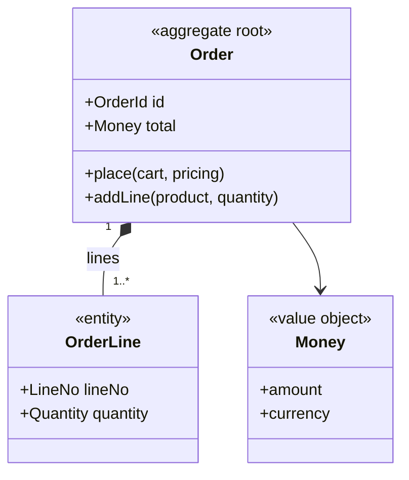

# Aggregate Design

## Desired Outcome

For every cluster of objects that changes together under an invariant, a model that answers
precisely: **which objects form one unit, what must be true of that unit at the end of every
transaction, which commands may change it, and what the rest of the system may hold of it.**

Per aggregate:

- **The root** — the entity that owns the identity and guards every change
- **Interior entities and value objects** — what lives inside the boundary, and what is a value
- **Invariants** — predicates that hold at the end of every transaction, each with the commands
  that can violate it and a concrete example
- **Commands and domain events** — every way the aggregate changes, with its actor, guard,
  consistency class and the event it emits
- **Factory, specifications, repository interface** — the creation rule, the reusable predicates,
  the one collection abstraction per root
- **A Mermaid `classDiagram`** and a machine-readable manifest downstream skills consume
- **The Domain Event Catalog** — every event the aggregates declare, with its publisher, the
  contexts that consume it across which context-map relationship, and the delivery contract a
  consumer may rely on (see § Domain Event Catalog)

The modeling method, the seven well-formedness rules and the transaction-boundary contract are
@rules/aggregate-design.md. Read it before Stage 1; this skill facilitates it, it does not restate it.

## Invocation

```
/architect:design-aggregate [--aggregate=<name>] [--context=<name>] [--auto] [--lang=en|ja]
```

- `--aggregate` — Model this aggregate only (e.g. `Order`, `Reservation`). Selected interactively
  when omitted.
- `--context` — Restrict the candidate list to one bounded context (e.g. `Ordering`).
- `--auto` — Skip facilitation and derive the models from existing reports. Lower fidelity; this is
  the mode `/architect:pipeline` uses.
- `--lang` — Output language for the generated documents. Defaults to
  `options.output_language` in `work/pipeline-progress.json`.

## Decision Criteria

- **Model what earns an aggregate** (@rules/aggregate-design.md §1). An invariant that spans more
  than one attribute, a root whose ID outsiders hold, and a unit one transaction writes — all
  three, or it is an entity inside someone else's aggregate, a value object, or reference data.
- **Value objects before entities.** Every attribute group with its own validation rule is a value
  object until identity is proven; `define-data-model`'s `ENT-` list is where to look for the
  values it promoted by mistake.
- **One command, one aggregate, one transaction.** A command that must write two aggregates says
  which case of @rules/aggregate-design.md §4 it is: `local` with `also_writes` when both live in
  one service on one datastore (a counter and its detail rows), `distributed` across services, or
  `saga` as a reaction — and which aggregate owns it. An undeclared second write is the defect.
- **Other aggregates by ID only.** A member typed as another aggregate's root is a boundary defect
  to resolve in Stage 3, not a modeling convenience to record.
- **Every invariant has an example.** An instance with real values, a command, and the outcome —
  what `generate-test-specs` turns into tests and what a domain expert can check at a glance.
- **Resolve, then ask, then record.** Anything the input reports already answer is not a question
  (@rules/open-questions.md §1). What the user owns — whether a rule is an invariant or a
  preference, which aggregate owns a two-aggregate write, whether a collection is bounded — is
  asked with `AskUserQuestion`; what stays open becomes an `OQ-` entry in `work/context.md`, and
  the placeholder in the document carries its ID.

## Prerequisites

| File | Required/Recommended | Source |
|------|---------------------|--------|
| reports/03_design/bounded-contexts-redesign.md | Recommended | /architect:redesign — the contexts whose interiors this skill models |
| reports/01_analysis/ubiquitous-language.md | Recommended | /architect:analyze — every name must come from here |
| reports/02_spec/data-model.md | Optional | /product:define-data-model — the `ENT-` list is the candidate set for roots, interior entities and mis-promoted value objects |
| reports/03_domain/bounded-contexts.md | Optional | /product:map-domains — the `CTX-` ownership of each entity |
| reports/01_analysis/data-model-analysis.md | Optional | /architect:analyze-data-model — existing tables and their foreign keys are the evidence of implicit boundaries |
| reports/04_stories/domain-story-{domain}.md | Optional | /architect:create-domain-story — work items are aggregate candidates, activities are commands |
| reports/02_spec/feature-list.md | Optional | /product:define-features — `FEAT-` commands map to aggregate commands |
| reports/02_spec/examples/example-map-{feat}.md | Optional | /product:example-map — `RULE-` entries are invariant candidates, `EX-` entries their first concrete examples |
| reports/03_design/scalardb-transaction.md | Optional | /architect:design-scalardb — when it already exists, its TX- entries fix each command's consistency class |

With none of these present, ask the user to name the aggregates and describe what must always be
true of each; do not derive an aggregate from a table name.

## Execution Modes

### Interactive Mode (default)

Six stages. Batch questions (1–4 per `AskUserQuestion` call), always offer candidates derived from
the inputs rather than blank prompts, and keep the whole interview inside two rounds per stage.

**Stage 1 — Select the aggregates**
Build a candidate list with its evidence: entities that other entities point at, entities with a
status column, work items a domain story creates or changes, features whose names are commands on
one object ("approve order", "cancel reservation"). Group the candidates by bounded context;
with `--context`, keep only that context's candidates, and with `--aggregate` skip the selection.
Present it with `multiSelect: true`, each option carrying its evidence, and let the user add one
through the appended free-text option. Record the entities deliberately **not** made an aggregate
and what they are instead (interior entity of which root, value object, reference data) — that
list is an answer, not an omission.

**Stage 2 — Root, interior, values**
Per aggregate, propose the root and everything inside the boundary. For each member ask whether it
has identity of its own (interior entity) or is defined by its attributes (value object), and for
each value object what makes an instance legal. Push back on: a value object with a surrogate key,
an interior entity another aggregate references directly, and a collection with no upper bound.

**Stage 3 — Invariants**
Ask what must be true of the aggregate at the end of every change. Per invariant capture: the
predicate, the commands that can violate it, and one concrete example on each branch — an
instance that satisfies it after a command, and one the command must reject. Distinguish
invariants (always true, transactional) from preferences (usually true, a warning) and from rules
between aggregates (eventually consistent, enforced by a reaction to an event) — the last two are
recorded, but not as invariants. When `RULE-` entries exist for the mapped features, present them
as the candidates.

**Stage 4 — Commands and events**
Start with creation: what must already hold at birth and where its inputs come from — that is the
factory, and the same creation event `design-state-machine` models. Then, per command: actor or
role, guard, the invariants it must preserve, the event it emits (payload: IDs and values, not the
aggregate), and its consistency class — `local` when it writes this aggregate only, `distributed` or
`saga` when it must write another, taking the class from `scalardb-transaction.md` when it exists
and feeding it when it does not. A guard that more than one caller evaluates is a specification;
name it. A command that writes a second aggregate in the same transaction declares it in
`also_writes`; only the owner emits the event — the other aggregate's command emits `none`.
`also_writes` is for the `local` case only: a `distributed` or `saga` command does **not** list the
aggregates other services write in reaction — those writes belong to their own commands, and the
catalog's consumers say who reacts.

**Stage 5 — References and repository**
Walk every member typed as another aggregate's root and resolve it: an ID reference, a value
object copied at the time of the command (a price snapshot), or evidence the boundary is wrong.
Then the repository interface: the lookup keys, whether it loads the whole aggregate, the
consistency it reads with. One repository per root; a repository for an interior entity is a
rule-5 violation and is challenged, not recorded.

**Stage 6 — Validate, review, write**
Run the well-formedness checks below **before** presenting anything. Show the user the class
diagram, the invariant table with its examples and any check that failed, correct together, then
write the documents and the manifest.

### Auto Mode (`--auto`)

Derive the models without facilitation:

1. Read `bounded-contexts-redesign.md` for contexts and the entities each owns, `data-model.md` /
   `data-model-analysis.md` for entities and their relationships, `ubiquitous-language.md` for the
   exact terms.
2. Take as roots the entities that other entities reference and that a feature or domain story
   commands; take as interior the entities referenced by exactly one root and by nothing else;
   take as value objects the entities with no identity of their own in any operation.
3. Derive commands from the operations the feature list and the domain stories name, using their
   verbs verbatim; derive invariants from the constraints the data model states and from `RULE-`
   entries where an example map exists.
4. When `state-machine-manifest.json` already holds a machine for the root, record its `STM-` in
   `state_machine` (the write-back otherwise belongs to `design-state-machine`, which normally runs
   later). Take each command's consistency class from `scalardb-transaction.md` (its `TX-` entries)
   when that report exists — an upstream report that fixes the class wins over any default. Only
   when no report fixes it, default the class to `local` and every unresolved cross-aggregate
   member to an ID reference, and **mark each default** in the document as assumed, with an `OQ-`
   entry per aggregate recording that the ownership of two-aggregate writes was never asked
   (@rules/open-questions.md §5).
5. Run the same well-formedness checks. A model that fails them is written with the failures listed
   under Open Items — never silently repaired by inventing an invariant.

Auto mode never invents an invariant that appears in no input. An aggregate candidate with no
stated invariant is reported as not modeled — an entity, not an aggregate.

## Well-formedness Checks (run before writing)

The seven rules of @rules/aggregate-design.md §3, in the order it is cheapest to fix them:

1. Exactly one root
2. At least one invariant, stated as a predicate
3. Every invariant names at least one command that can violate it
4. Every command names an actor, a consistency class and its emitted event (or `none`)
5. Interior entities and value objects are reachable only through the root — no repository for
   an interior entity
6. Other aggregates are referenced by identity only
7. Every name exists in the ubiquitous language, or its addition is proposed explicitly

These are also machine-checked: `python3 "${CLAUDE_PLUGIN_ROOT}/tools/lib/aggregate_manifest.py" <project_dir>` validates
the emitted manifest and exits non-zero with one line per violation. Run it after writing, and treat
a failure as a defect in the model rather than in the checker.

## Output

| File | Content |
|------|---------|
| `reports/03_design/aggregates/aggregate-{aggregate}.md` | One document per aggregate — root, interior, value objects, invariants with examples, commands, events, factory, specifications, repository, diagram |
| `reports/03_design/aggregates/aggregate-manifest.json` | **Canonical machine-readable model.** Downstream skills and the validator read this; the Markdown is its human-readable projection and is never authored separately |
| `reports/03_design/domain-event-catalog.json` | **Canonical Domain Event Catalog** — derived from the manifests' events and the context map, no new dialogue (§ Domain Event Catalog) |
| `reports/03_design/domain-event-catalog.md` | Its human-readable projection: one table per publishing context, plus a Mermaid diagram of publisher → consumer edges |

`{aggregate}` is the kebab-case aggregate name (`order`, `payment-request`). Write document content
in the configured output language; YAML frontmatter keys and every identifier (aggregate, member,
command, event, invariant) stay English.

### Manifest shape

```json
{
  "schema_version": 1,
  "generated_at": "ISO8601",
  "mode": "interactive",
  "aggregates": [
    {
      "id": "AGG-001",
      "name": "Order",
      "bounded_context": "Ordering",
      "document": "reports/03_design/aggregates/aggregate-order.md",
      "root": "Order",
      "members": [
        { "name": "Order", "kind": "root", "identity": "OrderId" },
        { "name": "OrderLine", "kind": "entity", "identity": "LineNo (local to Order)" },
        { "name": "Money", "kind": "value", "validation": "amount >= 0, ISO 4217 currency" },
        { "name": "customerId", "kind": "reference", "references": "Customer" }
      ],
      "invariants": [
        {
          "id": "INV-1",
          "statement": "total equals the sum of line totals",
          "violated_by": ["addLine", "removeLine"],
          "examples": [
            { "kind": "positive", "given": "two lines of 10 EUR", "when": "addLine(5 EUR)", "then": "total 25 EUR, OrderLineAdded" },
            { "kind": "negative", "given": "submitted order", "when": "addLine(5 EUR)", "then": "rejected: order-not-editable" }
          ]
        }
      ],
      "commands": [
        {
          "name": "place",
          "creation": true,
          "actor": "Customer",
          "guard": "cart has at least one line",
          "preserves": ["INV-1"],
          "emits": "OrderPlaced",
          "consistency": "local"
        },
        {
          "name": "addLine",
          "actor": "Customer",
          "guard": "status is Draft",
          "preserves": ["INV-1"],
          "emits": "OrderLineAdded",
          "consistency": "local",
          "also_writes": []
        }
      ],
      "events": [
        { "name": "OrderPlaced", "payload": ["orderId", "customerId", "total"] },
        { "name": "OrderLineAdded", "payload": ["orderId", "lineNo", "productId", "quantity"] }
      ],
      "specifications": [
        { "name": "CanBeShipped", "predicate": "status is Approved and every line is allocated",
          "used_by": ["ship", "shippable-orders query"] }
      ],
      "repository": {
        "root": "Order",
        "lookups": ["byId", "byCustomerAndStatus"],
        "loads_whole_aggregate": true
      },
      "state_machine": "STM-001"
    }
  ]
}
```

Field contracts the validator enforces (`tools/lib/aggregate_manifest.py`; every one is also a
case in its contract test):

- **Manifest** — `schema_version: 1`; `aggregates` non-empty; `id`, `name`, `document` and `root`
  each unique across aggregates (two aggregates claiming one root is one aggregate drawn twice).
- **Aggregate** — `id` matches `AGG-###`; `name` and `root` present; `document` a non-empty file
  inside the project; `members`, `invariants`, `commands` non-empty arrays; `events` an array;
  `state_machine`, when present, matches `STM-###` **and** names a machine the state-machine
  manifest declares when that manifest exists (it is written by `design-state-machine`, see below).
- **Members** — names present and unique; exactly one `kind: root` whose `name` equals `root`;
  `kind` ∈ `root` | `entity` | `value` | `reference`; a `reference` names the aggregate it
  `references`; a member named after another aggregate's root without `kind: reference` is the
  rule-6 defect; a `value` carries no `identity` (a value object with identity is an entity).
- **Events** — every entry an object with a unique `name`.
- **Commands** — names unique; each has an `actor`, a `consistency` ∈ `local` | `distributed` |
  `saga`, an `emits` naming a declared event or the literal `none`, and a `preserves` list of
  declared invariant IDs; at most one carries `creation: true`; `also_writes`, when present, lists
  other aggregates in this manifest the command writes in the same transaction (never itself).
- **Events** — an event name is published by one aggregate: two aggregates declaring the same
  event name is a violation, the non-owner's command emits `none`.
- **Invariants** — `id` unique within the aggregate; `statement` present; `violated_by` non-empty
  and naming declared commands; `examples` non-empty, every example with `given` / `when` /
  `then` and a `kind` ∈ `positive` | `negative`, and **both kinds present** — an invariant with
  one side untried has not located its boundary.
- **Repository** — an object whose `root` equals the aggregate `root` (no repository for an
  interior entity). **Specifications**, when present, each state a `predicate`.

A malformed manifest (a list where a string belongs, a string where an object belongs) is reported
as a violation, never as a traceback.

## Domain Event Catalog

The aggregates' events are the context map's **Published Language**: what one context lets
another know. Each aggregate declares its events (one publisher per event, enforced above), and
`context-map.md` names the relationship between contexts, but neither says which context consumes
which event under which delivery guarantee. The catalog does, and it is **derived** — from the
manifest's `events`, the aggregate's `bounded_context`, and the relationship the context map
draws between publisher and consumer — so it costs no dialogue.

Ownership follows the "whichever runs second" rule the `STM-` link uses: this skill writes every
event with its publisher, payload and scope, and fills `consumers` for the contexts it can see in
`context-map.md`; `/architect:design-microservices` completes the consumer side when the service
split settles which context reacts to what, and `/architect:design-api` reads the `published`
entries to emit `api-specifications/asyncapi/`.

```json
{
  "schema_version": 1,
  "generated_at": "ISO8601",
  "contexts": ["Ordering", "Inventory", "Payment"],
  "events": [
    {
      "name": "OrderPlaced",
      "scope": "published",
      "publisher": { "aggregate": "Order", "bounded_context": "Ordering" },
      "consumers": [
        { "bounded_context": "Inventory", "relationship": "customer-supplier",
          "purpose": "reserve stock for every line" },
        { "bounded_context": "Payment", "relationship": "customer-supplier",
          "purpose": "authorize the order total" }
      ],
      "payload": ["orderId", "customerId", "lines[].productId", "lines[].quantity", "total"],
      "delivery": "at-least-once",
      "idempotency_key": "orderId",
      "version": 1,
      "evolution": "additive-only"
    },
    {
      "name": "OrderLineAdded",
      "scope": "internal",
      "publisher": { "aggregate": "Order", "bounded_context": "Ordering" },
      "consumers": [],
      "payload": ["orderId", "lineNo", "productId", "quantity"]
    }
  ],
  "orphan_events": [
    { "name": "PointsEarned", "named_in": "reports/03_design/bounded-contexts-redesign.md",
      "reason": "LoyaltyAccount was not modeled — CTX-006 is a candidate context (OQ-008)" }
  ]
}
```

Field contracts the validator enforces (`tools/lib/domain_event_catalog.py`; every one is a case
in its contract test):

- **Catalog** — `schema_version: 1`; `events` non-empty; names unique (one event, one entry);
  `contexts`, when present, lists the bounded contexts the design knows.
- **Event** — `name` PascalCase; `publisher` names an aggregate and its `bounded_context`, and
  when the aggregate manifest exists the aggregate **declares** that event and lives in that
  context; `scope` ∈ `internal` | `published`; `payload` a non-empty list of field names —
  identities and values, never another aggregate's interior.
- **Consumers** — each names a declared `bounded_context` other than the publisher's (a reaction
  inside one context is not published), a `relationship` from the context map's vocabulary
  (`partnership` | `shared-kernel` | `customer-supplier` | `conformist` | `anticorruption-layer` |
  `open-host-service` | `published-language` | `separate-ways`) and its `purpose`; no context
  twice. A `published` event has at least one; an `internal` event has none — the scope is what
  the consumers say. A consumer is an **asynchronous subscriber**: a context that receives the
  event as the reply to a command it issued (the calling service reading `PaymentDeclined` as
  the response to `charge`) is not a consumer, and that event stays `internal` — when
  `api-style-decisions.json` / `asyncapi/` already classify the exchange, they win over prose in
  the design documents. A consumer that is still a **candidate** context (its `CTX-` carries an
  open `OQ-`) is listed, added to `contexts`, and flagged `"candidate": true`; the event's
  scope is what it would be if the candidate is confirmed.
- **Orphans** — an event the design documents name that no aggregate in the manifest declares
  (an entity that was never modeled) is not silently dropped: list it under the catalog's
  `orphan_events` with the document that names it, and in the `.md` Open Items. An event named
  only in another spelling (a state-machine transition `reservation_expired`) is listed in
  PascalCase with the source spelling in `named_in`. The validator accepts the list; a re-run
  that models the aggregate moves the event into `events`.
- **Delivery contract** (`published` only) — `delivery` ∈ `at-least-once` | `at-most-once` |
  `exactly-once`, an `idempotency_key` whenever delivery is at-least-once, an integer
  `version` ≥ 1 and an `evolution` rule ∈ `additive-only` | `versioned` | `frozen`. The key
  must be unique **per event type**: two events of one aggregate sharing `orderId` as their key
  (`OrderCancelled` and `PaymentDeclined` for the same order) collide in a consumer's inbox —
  scope it (`orderId` + event type, or a dedicated `eventId`), and check `review-risk` /
  `review-consistency` findings before copying a key from the context map. When a published
  contract (`asyncapi/`) already fixes a colliding key, keep the contract's key — a contract is
  never changed silently from here — and record the collision as an Open Item naming
  `design-api` as the owner.
- **Completeness** — every event an aggregate declares has a catalog entry. An event the
  manifest emits and the catalog omits is a contract nobody wrote down.

The `.md` projection carries, per publishing context, a table of its events with consumers and
delivery, a separate table of the `internal` events (the flowchart cannot show them — an
internal event has no edge), the `orphan_events` under Open Items, and one Mermaid `flowchart`
whose edges are publisher context → consumer context labelled by event name. It is regenerated
from the `.json`, never edited as a source. Its frontmatter:

```yaml
---
title: "Domain Event Catalog"
schema_version: 1
phase: "Phase 3: Design"
skill: design-aggregate
completed_by: design-microservices   # only when that skill completed the consumer side
generated_at: "ISO8601"
mode: "interactive|auto"
input_files:
  - reports/03_design/aggregates/aggregate-manifest.json
  - reports/03_design/context-map.md
---
```

`skill` stays `design-aggregate` whichever skill regenerated the projection last; the skill that
completed the consumer side names itself in `completed_by`.

## Output Document Structure

```markdown
---
title: "Aggregate: {Aggregate}"
schema_version: 1
phase: "Phase 3: Design"
skill: design-aggregate
generated_at: "ISO8601"
aggregate: "{Aggregate}"
mode: "interactive|auto"
input_files:
  - reports/03_design/bounded-contexts-redesign.md
  - reports/01_analysis/ubiquitous-language.md
---

# Aggregate: {Aggregate}

## Scope

[Which bounded context, what this aggregate is the unit of, and the candidates considered and
deliberately not made aggregates — with what they are instead.]

## Boundary

| Member | Kind | Identity / Validation | Notes |
|--------|------|-----------------------|-------|
| Order | root | OrderId | held by Shipment, Invoice |
| OrderLine | entity | LineNo, local to Order | never referenced from outside |
| Money | value object | amount >= 0, ISO 4217 currency | |
| customerId | reference → Customer | | ID only; name snapshot copied at `place` |

## Invariants

| ID | Invariant | Violated by | Enforced |
|----|-----------|-------------|----------|
| INV-1 | total equals the sum of line totals | addLine, removeLine | in the root, inside the command's transaction |

### Examples

| Invariant | Kind | Given | When | Then |
|-----------|------|-------|------|------|
| INV-1 | positive | two lines of 10 EUR | addLine(5 EUR) | total 25 EUR; OrderLineAdded |
| INV-1 | negative | submitted order | addLine(5 EUR) | rejected: order-not-editable |

## Commands and Events

| Command | Creation | Actor | Guard | Preserves | Emits | Consistency |
|---------|----------|-------|-------|-----------|-------|-------------|
| place | yes (factory: cart, pricing, customer) | Customer | cart has a line | INV-1 | OrderPlaced | local |
| addLine | | Customer | status is Draft | INV-1 | OrderLineAdded | local |

[A command that writes a second aggregate in the same transaction: its `also_writes`, the owner,
which §4 case it is, and the reconciliation for when the two disagree.]

[Then: every `distributed` / `saga` command with the aggregate that owns the transaction and the
compensation, and the events' payloads.]

## Specifications

| Specification | Predicate | Used by |
|---------------|-----------|---------|
| CanBeShipped | status is Approved and every line is allocated | ship, shippable-orders query |

## Repository

[Lookups, whether the whole aggregate is loaded, the read consistency, the OCC scope.]

## Diagram



## Lifecycle

[Whether the root has a lifecycle worth a machine and why (@rules/state-modeling.md §1). The
`STM-` itself is written back here and into the manifest's `state_machine` by
`design-state-machine`, which runs after this skill.]

## Open Items

[Failed well-formedness checks, defaulted consistency classes, and TBDs carrying their `OQ-` IDs.]
```

## Traceability

Append one node per aggregate to `work/traceability.json` (create it as
`{ "schema_version": 1, "nodes": [] }` if absent — never start a second graph, @docs/design.md §1.5):

```json
{ "id": "AGG-001", "type": "aggregate", "title": "Order",
  "skill": "design-aggregate",
  "source_file": "reports/03_design/aggregates/aggregate-order.md",
  "upstream": ["CTX-002", "ENT-004", "RULE-003"] }
```

`upstream` points at the bounded context and the entities the aggregate is built from when those
nodes exist, at the `FEAT-` entries whose commands became its commands, and at the `RULE-` entries
that became its invariants. Allocate each `AGG-` as `max + 1` over the whole graph, per prefix —
on a re-run, an aggregate whose node already exists (same `name`, `skill: design-aggregate`) keeps
its id and has the node **updated in place**, never appended twice. An
aggregate with no product-side origin carries an empty `upstream` — it is architect-originated, and
the graph should say so.

## Completion Criteria

1. One document per modeled aggregate under `reports/03_design/aggregates/`, plus the manifest
2. `python3 "${CLAUDE_PLUGIN_ROOT}/tools/lib/aggregate_manifest.py" <project_dir>` exits 0, or every violation it
   reports is listed under Open Items with an owner
3. Every invariant has a `positive` and a `negative` example (the validator enforces both)
4. Every name matches `ubiquitous-language.md`, or its addition is proposed
5. `AGG-` nodes appended to (or updated in) `work/traceability.json`
6. `reports/03_design/domain-event-catalog.json` written with every manifest event, and
   `python3 "${CLAUDE_PLUGIN_ROOT}/tools/lib/domain_event_catalog.py" <project_dir>` exits 0
7. `work/pipeline-progress.json` stamped — `in_progress` with `plugin: "architect"` before the work,
   `completed` with `outputs` and `summary` after (@skills/common/progress-registry.md)

## Related Skills

| Skill | Relationship |
|-------|-------------|
| /architect:redesign | Upstream — the bounded contexts whose interiors are modeled |
| /architect:analyze-data-model | Upstream — existing tables and foreign keys are the evidence of implicit boundaries |
| /product:define-data-model | Upstream — the `ENT-` candidates, including the value objects it promoted |
| /product:example-map | Upstream — `RULE-` entries are invariant candidates, `EX-` entries their examples |
| /architect:create-domain-story | Upstream — work items are candidates, activities are commands |
| /architect:design-state-machine | Downstream — the root's commands with a guard on its condition are its transitions; this skill's aggregate list is its Stage 1 candidate list |
| /architect:design-microservices | Downstream — completes the Domain Event Catalog's consumer side once the service split settles which context reacts to what |
| /architect:design-scalardb | Downstream — the aggregate as OCC scope and partition-key unit; one repository per root |
| /architect:design-data-layer | Downstream — the same, for non-ScalarDB projects |
| /architect:design-api | Downstream — commands become operations on the root's resource; invariant violations become problem types |
| /architect:design-implementation | Downstream — the domain layer skeleton and the repository interfaces |
| /architect:generate-test-specs | Downstream — unit and property tests per invariant, seeded by the examples |
| /architect:review-consistency | Downstream — checks the model against the schema and transaction design |
