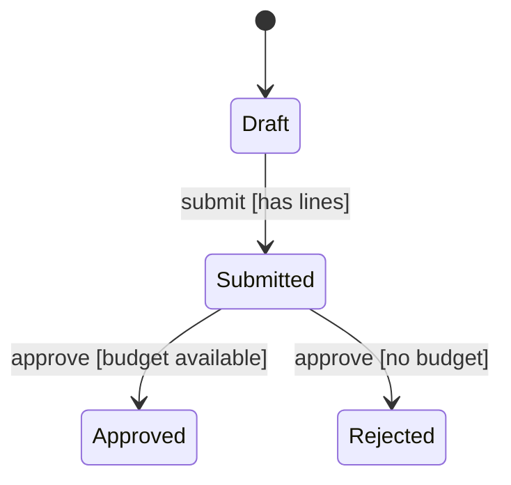

# State Transition Model Design

## Desired Outcome

For every aggregate whose behaviour depends on its condition, a model that answers precisely:
**given what this object is now, which changes are legal, who may make them, and what happens to the
attempts that are not.**

Per aggregate:

- **States** — named conditions with the invariant that holds in each
- **Events** — commands, integration events and timers that trigger change
- **Transitions** — `(from, event) [guard] → to`, each with an actor, an effect, a consistency class
  and an idempotency verdict for a redelivery of the same request
- **The state × event matrix** — every remaining combination decided as `reject`, `ignore` or
  `defer`, never left blank
- **A Mermaid `stateDiagram-v2`** and a machine-readable manifest downstream skills consume

The modeling method, the seven well-formedness rules and the concurrency contract are
@rules/state-modeling.md. Read it before Stage 1; this skill facilitates it, it does not restate it.

## Invocation

```
/architect:design-state-machine [--aggregate=<name>] [--auto] [--lang=en|ja]
```

- `--aggregate` — Model this aggregate only (e.g. `Order`, `Reservation`). Selected interactively
  when omitted.
- `--auto` — Skip facilitation and derive the models from existing reports. Lower fidelity; this is
  the mode `/architect:pipeline` uses.
- `--lang` — Output language for the generated documents. Defaults to
  `options.output_language` in `work/pipeline-progress.json`.

## Decision Criteria

- **Model what earns a machine** (@rules/state-modeling.md §1). A boolean nobody guards is not a
  lifecycle; a machine per attribute is a smell. Three to eight aggregates is typical for a system —
  proposing one for every entity in the data model means the filter was not applied.
- **One aggregate, one machine.** Two independent lifecycles inside one aggregate is evidence the
  boundary is wrong; say so rather than modeling orthogonal regions.
- **A transition is a transaction.** Its guard is evaluated inside the transaction that writes the
  new state. Classify each transition `local` / `distributed` / `saga`, taking the classification
  from `reports/03_design/scalardb-transaction.md` when it exists and feeding it when it does not.
- **Never leave the matrix incomplete.** An undecided cell becomes a runtime surprise; the whole
  point of the model is that it has no blanks.
- **Resolve, then ask, then record.** Anything the input reports already answer is not a question
  (@rules/open-questions.md §1). What the user owns — whether a duplicate event is an error or a
  no-op, what a payment timeout does — is asked with `AskUserQuestion`; what stays open becomes an
  `OQ-` entry in `work/context.md`, and the placeholder in the document carries its ID.

## Prerequisites

| File | Required/Recommended | Source |
|------|---------------------|--------|
| reports/03_design/bounded-contexts-redesign.md | Recommended | /architect:redesign — the aggregates and their boundaries |
| reports/03_design/aggregates/aggregate-manifest.json | Recommended | /architect:design-aggregate — the aggregate list is Stage 1's candidate list, a command with a guard on the root's condition is a transition, and each machine links back through `state_machine` |
| reports/01_analysis/ubiquitous-language.md | Recommended | /architect:analyze — state and event names must come from here |
| reports/01_analysis/data-model-analysis.md | Optional | /architect:analyze-data-model — existing status columns are the strongest evidence of an implicit machine |
| reports/04_stories/domain-story-{domain}.md | Optional | /architect:create-domain-story — the activity sequence is a transition sequence |
| reports/02_spec/feature-list.md | Optional | /product:define-features — `FEAT-` commands map to events |
| reports/03_design/scalardb-transaction.md | Optional | /architect:design-scalardb — when it already exists, its TX- entries fix the consistency class. The aggregate manifest's `consistency` is the **same** concept seen per command; when the two disagree (a `local` command that the transaction design places inside a distributed transaction), the transaction design wins for the transition, and the disagreement is written under Open Items for `review-consistency` — never silently reconciled in either direction |

With none of these present, ask the user to name the aggregates and describe their lifecycle
directly; do not invent one from the aggregate's name.

## Execution Modes

### Interactive Mode (default)

Seven stages. Batch questions (1–4 per `AskUserQuestion` call), always offer candidates derived from
the inputs rather than blank prompts, and keep the whole interview inside two rounds per stage.

**Stage 1 — Select the aggregates**
When `aggregate-manifest.json` exists, its aggregates are the candidate list — one whose root has
a command guarded on its own condition is the evidence. Otherwise build a candidate list with its evidence: status/state columns in the data model, terms in the
ubiquitous language that read as conditions, aggregates whose domain story has a rejected path,
features whose names are transitions ("approve", "cancel", "ship"). Present it with
`multiSelect: true`, each option carrying its evidence, and let the user add one through the
appended free-text option. Record the ones deliberately **not** modeled and why — that list is an
answer, not an omission.

**Stage 2 — States**
Per aggregate, propose the state set from the evidence and ask for confirmation. For each state
establish:
- the invariant that holds while in it ("payment authorized, stock not yet reserved")
- what it permits and forbids
- whether it is the initial state or a terminal one

Push back on states that are really two states wearing one name (`Processing` that means both
"awaiting payment" and "awaiting stock") and on flags masquerading as states.

**Stage 3 — Events and transitions**
Start with the creation command (@rules/state-modeling.md §2): it is an event with a guard and an
actor but no `from` state — a failed guard means no aggregate, not a cancelled one — and its column
in the matrix is decided by its idempotency contract (look it up in the API design before asking;
an `Idempotency-Key` on the operation answers the whole column as `ignore`).
For each state, ask what can happen next and who makes it happen. Per transition capture: event and
its source (`command` / `event` / `timeout` / `schedule`), guard, effect, actor or role, and target
state. Where the guard can be false, ask what the false branch does — that answer is a matrix cell,
not a footnote.

**Stage 4 — The state × event matrix**
Compose the full grid and walk the undecided cells. For each, ask which of `reject` / `ignore` /
`defer` applies, with the consequence stated in each option: `reject` becomes a registered problem
type in the API, `ignore` becomes the idempotency contract, `defer` becomes a queue. Do not accept
"cannot happen" — an event that reaches the aggregate has already happened.

**Stage 5 — Concurrency and consistency**
Per transition: `local`, `distributed` or `saga`. Then build the **contention table** — one row per
pair of transitions different actors can fire against one aggregate (orchestrator vs. recovery
worker, request path vs. sweeper, two clients on one key), with who wins and what the loser does.
Resolve each row from the transaction design first (a lease, an OCC rule, an idempotency key already
decided there is not a question); ask only about the pairs it does not cover — retry with the guard
re-evaluated, or surface a conflict. For
saga transitions, name the compensating transition and its target state; a compensation that
"returns to the previous state" is challenged, not recorded. Confirm how an indeterminate commit
(`UnknownTransactionStatusException`) is resolved before a retry.

**Stage 6 — Time and history**
Which states expire, into what, after how long, fired by whom, and how that write races a
legitimate concurrent transition. Then the persistence decisions: the state column and its OCC
scope, and whether the transition history is recorded (@rules/state-modeling.md §6).

**Stage 7 — Validate, review, write**
Run the well-formedness checks below **before** presenting anything. Show the user the diagram, the
matrix and any check that failed, correct together, then write the documents and the manifest.
When `reports/03_design/aggregates/aggregate-manifest.json` exists, **write each machine's `STM-`
back** into its aggregate's `state_machine` field (and the aggregate document's Lifecycle
section): the aggregate skill runs first and cannot know the id, and the aggregate validator
checks the link against this manifest.

### Auto Mode (`--auto`)

Derive the models without facilitation:

1. Read `bounded-contexts-redesign.md` for aggregates, `data-model-analysis.md` for status columns
   and their observed values, `ubiquitous-language.md` for the exact terms.
2. Take the state set from the status column's values where one exists; otherwise infer the
   lifecycle from the domain story's activity sequence.
3. Derive events from the operations the domain story and feature list name, using their verbs
   verbatim.
4. Default every undecided matrix cell to `reject` and **mark each defaulted cell** in the document
   as assumed, with an `OQ-` entry per aggregate **that has at least one defaulted cell** recording
   that the idempotency verdicts were never asked (@rules/open-questions.md §5). An aggregate whose
   every cell an input document decided (an OpenAPI replay contract, the aggregate's examples) gets
   no `OQ-` — that would re-ask what the inputs answer (@rules/open-questions.md §1).
5. Run the same well-formedness checks. A model that fails them is written with the failures listed
   under Open Items — never silently repaired by inventing a transition.
6. Write each `STM-` back into `aggregate-manifest.json` as in Stage 7.

Auto mode never invents a state that appears in no input. An aggregate with no evidence of a
lifecycle is reported as not modeled.

## Well-formedness Checks (run before writing)

The seven rules of @rules/state-modeling.md §3, in the order it is cheapest to fix them:

1. Exactly one initial state, entered by creation only
2. Every state reachable from the initial state
3. Every non-terminal state has an outgoing transition; every dead end is a declared terminal state
4. No two transitions share `(from, event)` unless their guards are stated and mutually exclusive
5. Every guarded transition declares its `else` branch on the transition itself — the matrix cell is `allow` there, so it cannot carry it
6. Every transition names an actor and a consistency class
7. Every state and event name exists in the ubiquitous language, or its addition is proposed
   explicitly

These are also machine-checked: `python3 "${CLAUDE_PLUGIN_ROOT}/tools/lib/state_machine_manifest.py" <project_dir>` validates
the emitted manifest and exits non-zero with one line per violation. Run it after writing, and treat
a failure as a defect in the model rather than in the checker.

## Output

| File | Content |
|------|---------|
| `reports/03_design/state-machines/state-machine-{aggregate}.md` | One document per aggregate — states, events, transitions, matrix, diagram, concurrency notes |
| `reports/03_design/state-machines/state-machine-manifest.json` | **Canonical machine-readable model.** Downstream skills and the validator read this; the Markdown is its human-readable projection and is never authored separately |

`{aggregate}` is the kebab-case aggregate name (`order`, `payment-request`). Write document content
in the configured output language; YAML frontmatter keys, state identifiers and event identifiers
stay English.

### Manifest shape

```json
{
  "schema_version": 1,
  "generated_at": "ISO8601",
  "mode": "interactive",   // the mode of the last run that wrote the manifest; each machine
                           // also carries its own `mode`, since STM-001 may be interactive
                           // and STM-002 added later by --auto
  "machines": [
    {
      "id": "STM-001",
      "aggregate": "Order",
      "bounded_context": "Ordering",
      "document": "reports/03_design/state-machines/state-machine-order.md",
      "state_column": "status",
      "history": { "recorded": true, "store": "order_status_history" },
      "initial_state": "Draft",
      "terminal_states": ["Delivered", "Cancelled"],
      "states": [
        { "name": "Draft", "kind": "initial", "invariant": "no payment held, no stock reserved" },
        { "name": "Submitted", "kind": "normal", "invariant": "lines frozen, awaiting approval" }
      ],
      "events": [
        { "name": "submit", "source": "command" },
        { "name": "payment_timeout", "source": "timeout" }
      ],
      "transitions": [
        {
          "from": "Draft", "to": "Submitted", "event": "submit",
          "guard": "order has at least one line",
          "else": "reject:order-empty",
          "effect": "freeze line items",
          "actor": "Customer",
          "consistency": "local",
          "idempotency": "ignore"
        }
      ],
      "matrix": [
        { "state": "Draft", "event": "submit", "verdict": "allow" },
        { "state": "Draft", "event": "payment_timeout", "verdict": "ignore",
          "response": "no payment held in Draft" }
      ]
    }
  ]
}
```

Field contracts the validator enforces: `id` matches `STM-###` and is unique; `document` resolves to
a non-empty file inside the project; `initial_state` and every `terminal_states` entry is a declared
state, and at most one state carries `kind: initial` (it must be `initial_state`; `kind` is otherwise
`normal` | `terminal` and informational); every transition's `from`/`to` is a declared state and its
`event` a declared event, and no transition leaves a terminal state; `consistency` ∈ `local` |
`distributed` | `saga`; `idempotency` ∈ `ignore` | `reject` — the verdict for a **redelivery of the
same request** (same key / retried message), not for a fresh occurrence of the event, which the
`(to, event)` matrix cell decides (@rules/state-modeling.md §4); a transition with a `guard` carries
an `else` stating the guard-false outcome; `matrix` covers **every** state × event pair exactly once
with a `verdict` ∈ `allow` | `reject` | `ignore` | `defer`, every `allow` cell backed by a
transition and no other verdict on a pair that has one. `response` on a cell is free text naming
the outcome — the problem type for `reject`, the reason for `ignore`, the queue for `defer` — and
is what `design-api` reads.

## Output Document Structure

```markdown
---
title: "State Transition Model: {Aggregate}"
schema_version: 1
phase: "Phase 3: Design"
skill: design-state-machine
generated_at: "ISO8601"
aggregate: "{Aggregate}"
mode: "interactive|auto"
input_files:
  - reports/03_design/bounded-contexts-redesign.md
  - reports/01_analysis/ubiquitous-language.md
---

## Scope

[Which aggregate, which bounded context, and what this lifecycle governs. Note the aggregates
considered and deliberately not modeled.]

## States

| State | Invariant | Permits | Forbids | Kind |
|-------|-----------|---------|---------|------|
| ...   | ...       | ...     | ...     | initial / normal / terminal |

## Events

| Event | Source | Triggered by |
|-------|--------|--------------|
| ...   | command / event / timeout / schedule | ... |

## Transitions

| # | From | Event | Guard | To | Actor | Effect | Consistency | Idempotency |
|---|------|-------|-------|----|-------|--------|-------------|-------------|
| — | `[*]` | creation command | ... **else: creation rejected** (no aggregate) | initial state | ... | ... | local / distributed / saga | ignore (same key replays the original outcome) |
| 1 | ...  | ...   | ...   | ...| ...   | ...    | local / distributed / saga | ignore / reject (on redelivery) |

## State x Event Matrix

| State \ Event | submit | approve | cancel |
|---------------|--------|---------|--------|
| Draft         | → Submitted | reject | → Cancelled |
| Submitted     | ignore | → Approved | → Cancelled |

Legend: `→ State` allow · `reject` illegal · `ignore` idempotent no-op · `defer` queued

## Diagram



## Concurrency and Consistency

| Contention | Who vs. who | Winner | What the loser does |
|------------|-------------|--------|---------------------|
| ... | ... | first commit / lease holder / first arrival | re-read and re-evaluate the guard / retreat until the next sweep / 409 |

[Then: the transaction classification of each transition and the mechanism it rests on; saga
transitions with their compensating transition and its real target state; how an indeterminate
commit is resolved before a retry.]

## Time-Driven Transitions

[Expiring states: deadline, target state, who fires it, how it races a concurrent transition.]

## Persistence

[State column and its OCC scope; transition history — recorded or explicitly not, and why.]

## Open Items

[Failed well-formedness checks, defaulted matrix cells, and TBDs carrying their `OQ-` IDs.]
```

## Traceability

Append one node per state machine to `work/traceability.json` (create it as
`{ "schema_version": 1, "nodes": [] }` if absent — never start a second graph, @docs/design.md §1.5):

```json
{ "id": "STM-001", "type": "state-machine", "title": "Order lifecycle",
  "skill": "design-state-machine",
  "source_file": "reports/03_design/state-machines/state-machine-order.md",
  "upstream": ["CTX-002", "ENT-004"] }
```

`upstream` points at the **`AGG-` node of the aggregate the machine belongs to** (always, once
`design-aggregate` has run — the STM → AGG edge belongs in the graph, not only in the manifest's
`state_machine` field), at the bounded context and the entity when those nodes exist, and at the
`FEAT-` entries whose commands became events. Allocate each `STM-` as `max + 1` over the whole
graph, per prefix; on a re-run, update an existing machine's node in place. A machine with no
`AGG-` and no product-side origin carries an empty `upstream` — it is architect-originated, and
the graph should say so.

## Completion Criteria

1. One document per modeled aggregate under `reports/03_design/state-machines/`, plus the manifest
2. `python3 "${CLAUDE_PLUGIN_ROOT}/tools/lib/state_machine_manifest.py" <project_dir>` exits 0, or every violation it
   reports is listed under Open Items with an owner
3. The matrix has no blank cell in any document
4. Every state and event name matches `ubiquitous-language.md`, or its addition is proposed
5. `STM-` nodes appended to `work/traceability.json`, and — when `aggregate-manifest.json` exists —
   each machine's `STM-` written into its aggregate's `state_machine` field so that
   `python3 "${CLAUDE_PLUGIN_ROOT}/tools/lib/aggregate_manifest.py" <project_dir>` still exits 0
6. `work/pipeline-progress.json` stamped — `in_progress` with `plugin: "architect"` before the work,
   `completed` with `outputs` and `summary` after (@skills/common/progress-registry.md)

## Related Skills

| Skill | Relationship |
|-------|-------------|
| /architect:redesign | Upstream — aggregates and bounded context boundaries |
| /architect:design-aggregate | Upstream — the aggregate roots and their guarded commands. This skill writes each machine's `STM-` back into the aggregate's `state_machine` field (Stage 7 / auto step 6), refreshes the aggregate document's Lifecycle section, and removes an Open Item there that said the machine was not yet allocated — nothing else in the aggregate document is touched |
| /architect:analyze-data-model | Upstream — status columns are the evidence of an implicit machine |
| /architect:create-domain-story | Upstream — the activity sequence is a transition sequence |
| /architect:design-scalardb | Downstream — state column, OCC scope, history table, per-transition consistency class |
| /architect:design-data-layer | Downstream — the same, for non-ScalarDB projects |
| /architect:design-api | Downstream — transitions become operations, `reject` cells become problem types, `ignore` cells the idempotency contract |
| /architect:generate-test-specs | Downstream — transition, rejection and idempotency coverage |
| /architect:review-consistency | Downstream — checks the model against the design documents |
