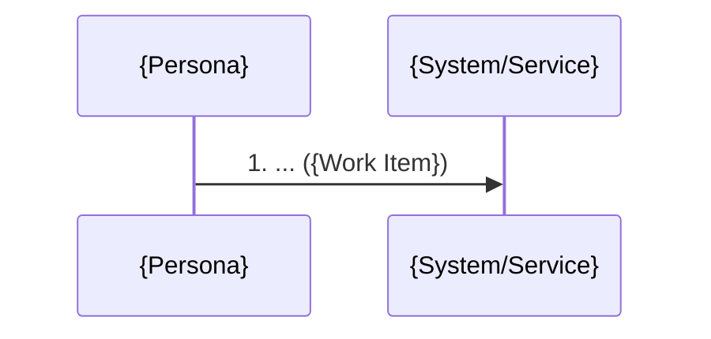

# Persona-Anchored Domain Story

## Desired Outcome

Produce one deliverable per persona × key job:

1. **Domain story** — `reports/01_ux/domain-stories/domain-story-{slug}.md` (`STORY-` IDs): a Domain
   Storytelling narrative showing how a specific **persona** accomplishes a **key job**, step by
   step, ordered by the **journey**. It is the concrete, single-threaded happy-path scenario that
   downstream `generate-ui-mock` renders into screens (each activity → a screen interaction). Each
   story expresses the three Domain Storytelling elements, sourced from existing UX artifacts:

   - **Actors** — the persona(s) (`PER-`) plus the supporting people/systems they interact with
   - **Work Items** — the objects/information handled along the way (named from the journey and job
     vocabulary; enriched with entities `ENT-` when a data model already exists)
   - **Activities** — numbered actions, derived from the persona's job story (`JOB-`) and the
     journey actions/stages (`JNY-`), ordered into a coherent happy-path flow

`{slug}` is the kebab-case persona+job scenario (e.g. `shopper-checkout`), or the context name when
`--domain` is used.

This is the product-pipeline, persona-first counterpart of `/architect:create-domain-story` (which
anchors actors to the legacy `actors-roles-permissions.md`). Use this one inside the product
workflow; use the architect one on the legacy-refactoring path.

## Invocation

```
/product:create-domain-story [--persona=<PER>] [--job=<JOB>] [--domain=<CTX>] [--auto] [--lang=ja|en]
```

| Argument/Flag | Required | Description |
|---------------|----------|-------------|
| `--persona=<PER>` | Optional | Anchor to one persona (`PER-` id). Defaults to the primary persona; loops over personas if omitted in `--auto`. |
| `--job=<JOB>` | Optional | Anchor to one job story (`JOB-` id). Defaults to the persona's highest-priority jobs. |
| `--domain=<CTX>` | Optional | Scope the story to a bounded context (`CTX-`) instead of a persona×job. Only valid after `/product:map-domains` (a later-pipeline / rerun use). |
| `--auto` | Optional | Skip facilitation; derive stories from existing artifacts. Suitable for bulk generation across personas/jobs. |
| `--lang` | Optional | Override output language. |

## Decision Criteria

- **Anchor every story to a persona and a job.** A story without a `PER-` actor and at least one
  `JOB-`-derived activity is not a domain story — it is a generic flow.
- **One story = one persona × one key job (one scenario).** Keep it single-threaded (happy path);
  capture alternatives as Exception Scenarios, not as branches in the main diagram.
- **The story is the mock axis.** Write activities at user-task granularity (coarse enough to map
  one activity ≈ one screen interaction) so `generate-ui-mock` can render them directly. Avoid
  system-internal steps that have no UI.
- **Reuse existing vocabulary verbatim.** Actor and work-item names match the personas, journey, and
  (if present) ubiquitous language. Do not invent synonyms.
- **Do not fabricate steps.** If the journey/job story does not cover a step, mark it `TBD` and add
  an Open Question rather than inventing business behavior.
- **Stop condition**: for each targeted persona×job, the file exists with an actors table (≥1 `PER-`),
  a work-items table, a numbered main flow whose activities trace to `JOB-`/`JNY-`, and a Mermaid
  sequence diagram.

## Prerequisites

| Input | Required/Recommended | Source | If missing/empty |
|-------|---------------------|--------|------------------|
| `reports/01_ux/personas.md` | Required | `/product:generate-persona` | block — actors are personas; without them this is the architect skill |
| `reports/01_ux/journey-maps.md` | Required | `/product:map-journey` | block — activities are ordered by the journey |
| `reports/03_domain/bounded-contexts.md` | Optional (enrichment) | `/product:map-domains` | skip `CTX-` scoping; persona×job scoping only |
| `reports/03_domain/ubiquitous-language.md` | Optional (enrichment) | `/product:map-domains` | name work items from journey/job vocabulary |
| `reports/02_spec/data-model.md` | Optional (enrichment) | `/product:define-data-model` | work items stay informal (no `ENT-` links) |

If personas are absent, do not silently degrade to a generic flow — tell the user and suggest
`/product:generate-persona` first, or `/architect:create-domain-story` for the legacy path.

## Process

1. **Read context** — personas (`PER-`/`JOB-`), journey maps (`JNY-`), and `work/traceability.json`;
   optionally bounded contexts, ubiquitous language, and data model when they already exist.
2. **Select the (persona, job) pair** — for `--persona`/`--job` (or each priority job in `--auto`),
   pick the persona (default: primary) and the key job. With `--domain`, scope to that `CTX-` and
   pick the persona whose JTBD it serves.
3. **Map actors** — the chosen persona(s) as primary actor(s); supporting actors are the people /
   systems they interact with along the journey (and other `CTX-` contexts when known).
4. **Map work items** — the objects/information handled, named from the journey/job vocabulary;
   link to `ENT-` entities when a data model exists.
5. **Order activities** — turn the `JOB-` story ("When … I want to … so I can …") and the matching
   journey actions/stages into a numbered happy-path sequence at user-task granularity: who does
   what, with which work item, to whom. Uncovered steps → `TBD` + Open Question.
6. **Capture exceptions** — up to 3 significant alternative/error paths (from journey pains or
   Moments of Truth).
7. **Interactive mode only** — present the draft for confirmation before writing; in `--auto`, write
   directly.
8. **Append traceability** — add `STORY-` nodes to `work/traceability.json` with Upstream references
   to the `PER-`, `JOB-`, and `JNY-` (and `CTX-` when scoped) it derives from.
9. **Record** — write the file(s); append decisions to `work/context.md`; log every `TBD`.

## Output

`reports/01_ux/domain-stories/domain-story-{slug}.md` (one per persona×job, or per context with
`--domain`). Frontmatter keys stay English; body uses `options.output_language`.

### Output Document Structure

```markdown
---
title: "Domain Story: {Persona} — {Job}"
schema_version: 1
phase: "Phase 2: UX Foundation"
skill: create-domain-story
generated_at: "ISO8601"
persona: "{PER-id}"
job: "{JOB-id}"
context: "{CTX-id or TBD}"
mode: "interactive|auto"
input_files:
  - reports/01_ux/personas.md
  - reports/01_ux/journey-maps.md
---

# Domain Story: {Persona} — {Job}

## Story Overview

[2–3 sentences: which persona (PER-id), pursuing which job (JOB-id), across which journey (JNY-id)]

## Actors

| Actor | Type | Source | Role in This Story |
|-------|------|--------|--------------------|
| ...   | Persona / Person / System | PER-xx / ... | ... |

## Work Items

| Work Item | Term | Source | Description |
|-----------|------|--------|-------------|
| ...       | ...  | JNY-xx / ENT-xx | ... |

## Main Flow

[Numbered narrative; each step traces to a JOB-/JNY- and maps to a screen interaction]

1. [Persona] [activity verb] [work item] → [recipient Actor/System]   _(JOB-xx / JNY-xx)_
2. ...

## Mermaid Diagram



## Exception Scenarios

### [Exception Name]
[Brief description; link the journey pain / Moment of Truth it comes from]

## Screen Hints (for UI mocks)

[Optional: which activities cluster into which screen, to seed generate-ui-mock]

## Traceability

| STORY-id | Persona (PER-) | Job (JOB-) | Journey (JNY-) | Context (CTX-) |
|----------|----------------|------------|----------------|----------------|
| STORY-xx | PER-xx | JOB-xx | JNY-xx | CTX-xx / TBD |

## Open Questions

[TBD items where the journey/job story did not cover a step]
```

## Mermaid Diagram Guidelines

- Use `sequenceDiagram`. Node IDs in English; display labels in the configured output language.
- Number each message to match the Main Flow numbering.
- Primary diagram = happy path only; put major exceptions in a separate diagram block.
- Apply `@rules/mermaid-best-practices.md` (quote non-ASCII labels).

## Reference Materials

| Resource | Purpose |
|----------|---------|
| `@rules/product/persona-jtbd.md` | Personas, JTBD job stories — actor & activity sources |
| `@rules/mermaid-best-practices.md` | Sequence-diagram syntax and label rules |

## Related Skills

| Skill | Relationship |
|-------|-------------|
| `/product:generate-persona` | Upstream — provides `PER-` actors and `JOB-` activities |
| `/product:map-journey` | Upstream — provides `JNY-` actions ordering the main flow |
| `/product:generate-ui-mock` | Downstream — renders each story's activities into screens |
| `/product:map-domains` | Downstream/enrichment — stories inform contexts; `--domain` rescopes per `CTX-` |
| `/architect:create-domain-story` | Counterpart — legacy-path, analysis-anchored variant |
| `/product:adapt-change` | Re-runs this skill when persona or journey changes |
