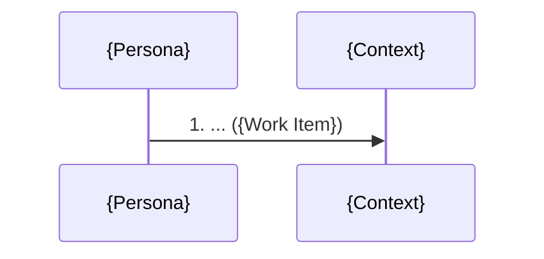

# Persona-Anchored Domain Story

## Desired Outcome

Produce one deliverable per targeted bounded context:

1. **Domain story** — `reports/03_domain/domain-stories/domain-story-{domain}.md`: a Domain
   Storytelling narrative (`STORY-` IDs) that shows how a specific **persona** accomplishes a
   **job** within a bounded context. Each story expresses the three Domain Storytelling elements,
   sourced from product artifacts rather than reinvented:

   - **Actors** — the persona(s) (`PER-`) plus the supporting systems/contexts they interact with
   - **Work Items** — the objects/information handled, drawn from entities (`ENT-`) and the
     ubiquitous language of the context
   - **Activities** — numbered actions, seeded from the persona's job stories (`JOB-`) and the
     journey-map actions, ordered into a coherent happy-path flow

This is the product-pipeline, persona-first counterpart of `/architect:create-domain-story` (which
anchors actors to the legacy `actors-roles-permissions.md`). Use this one inside the product
workflow; use the architect one on the legacy-refactoring path.

## Invocation

```
/product:create-domain-story [--domain=<CTX>] [--persona=<PER>] [--auto] [--lang=ja|en]
```

| Argument/Flag | Required | Description |
|---------------|----------|-------------|
| `--domain=<CTX>` | Optional | Target bounded context (`CTX-` id or name). Prompted/looped over all if omitted. |
| `--persona=<PER>` | Optional | Anchor the story to one persona (`PER-` id). Defaults to the primary persona for the context. |
| `--auto` | Optional | Skip facilitation; derive the story from existing artifacts. Lower fidelity, suitable for bulk generation across all contexts. |
| `--lang` | Optional | Override output language. |

## Decision Criteria

- **Anchor every story to a persona and a job.** A story without a `PER-` actor and at least one
  `JOB-`-derived activity is not a domain story — it is a generic flow. Pick the persona whose JTBD
  the context most directly serves.
- **One story = one persona × one job × one context.** Keep stories single-threaded (happy path);
  capture alternatives as Exception Scenarios, not as branches in the main diagram.
- **Reuse the ubiquitous language verbatim.** Actor, work-item, and activity names must match the
  terms in `reports/03_domain/ubiquitous-language.md`. Do not invent synonyms.
- **Do not fabricate steps.** If the journey/job stories do not cover a step, mark it `TBD` and add
  an Open Question rather than inventing business behavior.
- **Stop condition**: for each targeted context, the file exists with an actors table (≥1 `PER-`),
  a work-items table, a numbered main flow whose activities trace to `JOB-`/journey actions, and a
  Mermaid sequence diagram.

## Prerequisites

| Input | Required/Recommended | Source | If missing/empty |
|-------|---------------------|--------|------------------|
| `reports/03_domain/bounded-contexts.md` | Required | `/product:map-domains` | block with a message — stories are scoped per `CTX-` |
| `reports/03_domain/ubiquitous-language.md` | Required | `/product:map-domains` | block — terms anchor actors/work items |
| `reports/01_ux/personas.md` | Required | `/product:generate-persona` | block — actors are personas; without them this is the architect skill |
| `reports/01_ux/journey-maps.md` | Recommended | `/product:map-journey` | proceed; derive activities from `JOB-` only, flag thinner coverage |
| `reports/02_spec/data-model.md` | Recommended | `/product:define-data-model` | proceed; take work items from ubiquitous language only |

If personas are absent, do not silently degrade to a generic flow — tell the user and suggest
`/product:generate-persona` first, or `/architect:create-domain-story` for the legacy path.

## Process

1. **Read context** — bounded contexts (`CTX-`), ubiquitous language, personas (`PER-`/`JOB-`),
   journey maps, data model, and `work/traceability.json`.
2. **Select the (context, persona, job) triple** — for `--domain` (or each context in `--auto`),
   pick the persona whose JTBD the context serves (default: primary persona) and the job story the
   context most directly fulfills.
3. **Map actors** — the chosen persona(s) as primary actor(s); supporting actors are the systems /
   other `CTX-` contexts it collaborates with (from the context map).
4. **Map work items** — the `ENT-` entities and terms the context owns, named verbatim from the
   ubiquitous language.
5. **Order activities** — turn the `JOB-` story ("When … I want to … so I can …") and the matching
   journey-map actions into a numbered happy-path sequence: who does what, with which work item, to
   whom. Uncovered steps → `TBD` + Open Question.
6. **Capture exceptions** — up to 3 significant alternative/error paths (from journey pains or
   Moments of Truth).
7. **Interactive mode only** — present the draft for confirmation before writing; in `--auto`, write
   directly.
8. **Append traceability** — add `STORY-` nodes to `work/traceability.json` with Upstream references
   to the `PER-`, `JOB-`, and `CTX-` it derives from.
9. **Record** — write the file(s); append decisions to `work/context.md`; log every `TBD`.

## Output

`reports/03_domain/domain-stories/domain-story-{domain}.md` (one per targeted context). `{domain}`
is the kebab-case context name. Frontmatter keys stay English; body uses `options.output_language`.

### Output Document Structure

```markdown
---
title: "Domain Story: {Context} — {Persona}"
schema_version: 1
phase: "Phase 4: Domain & API"
skill: create-domain-story
generated_at: "ISO8601"
context: "{CTX-id}"
persona: "{PER-id}"
mode: "interactive|auto"
input_files:
  - reports/03_domain/bounded-contexts.md
  - reports/03_domain/ubiquitous-language.md
  - reports/01_ux/personas.md
  - reports/01_ux/journey-maps.md
---

# Domain Story: {Context} — {Persona}

## Story Overview

[2–3 sentences: which persona, pursuing which job (JOB-id), within which context (CTX-id)]

## Actors

| Actor | Type | Source | Role in This Story |
|-------|------|--------|--------------------|
| ...   | Persona / System / Context | PER-xx / CTX-xx | ... |

## Work Items

| Work Item | Domain Term | Source | Description |
|-----------|-------------|--------|-------------|
| ...       | ...         | ENT-xx | ... |

## Main Flow

[Numbered narrative; each step traces to a JOB- or journey action]

1. [Persona] [activity verb] [work item] → [recipient Actor/System]   _(JOB-xx)_
2. ...

## Mermaid Diagram



## Exception Scenarios

### [Exception Name]
[Brief description; link the journey pain / Moment of Truth it comes from]

## Traceability

| STORY-id | Persona (PER-) | Job (JOB-) | Context (CTX-) |
|----------|----------------|------------|----------------|
| STORY-xx | PER-xx | JOB-xx | CTX-xx |

## Open Questions

[TBD items where the journey/job stories did not cover a step]
```

## Mermaid Diagram Guidelines

- Use `sequenceDiagram`. Node IDs in English; display labels in the configured output language.
- Number each message to match the Main Flow numbering.
- Primary diagram = happy path only; put major exceptions in a separate diagram block.
- Apply `@rules/mermaid-best-practices.md` (quote non-ASCII labels).

## Reference Materials

| Resource | Purpose |
|----------|---------|
| `@rules/product/persona-jtbd.md` | Personas, JTBD job stories — actor & activity sources |
| `@rules/product/ddd-strategic.md` | Bounded contexts & ubiquitous language — scope & terms |
| `@rules/mermaid-best-practices.md` | Sequence-diagram syntax and label rules |

## Related Skills

| Skill | Relationship |
|-------|-------------|
| `/product:map-domains` | Upstream — provides `CTX-` contexts and ubiquitous language |
| `/product:generate-persona` | Upstream — provides `PER-` actors and `JOB-` activities |
| `/product:map-journey` | Upstream — provides journey actions ordering the main flow |
| `/product:design-api` | Sibling — APIs realize the activities in the stories |
| `/product:report` | Downstream — stories are auto-included (Mermaid rendered inline) |
| `/architect:create-domain-story` | Counterpart — legacy-path, analysis-anchored variant |
| `/product:adapt-change` | Re-runs this skill when persona or domain changes |
