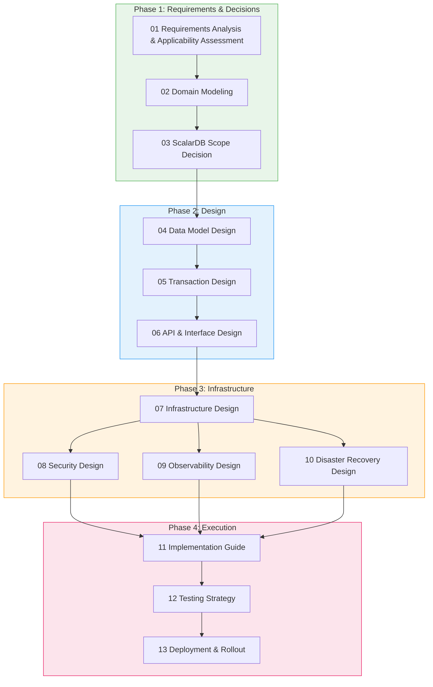
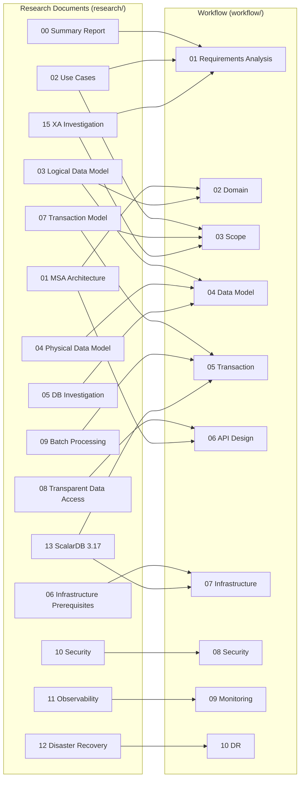

# ScalarDB x Microservices Implementation Planning Workflow

## Overview

This workflow is a guide for systematically developing an implementation plan for a microservices architecture using ScalarDB Cluster, proceeding phase by phase. It takes the deliverables from the investigation phase (`research/` directory) as input and produces an actionable implementation plan as output.

## Overall Flow

## Phase List

| Phase | Step | File | Input (Research Materials) | Deliverables |
|---------|---------|---------|----------------|--------|
| **Phase 1** | 01 Requirements Analysis & Applicability Assessment | [01_requirements_analysis.md](./01_requirements_analysis.md) | `00_summary`, `02_usecases`, `15_xa` | Requirements list, ScalarDB applicability assessment results |
| | 02 Domain Modeling | [02_domain_modeling.md](./02_domain_modeling.md) | `01_microservice`, `03_logical_data_model` | Bounded context diagram, aggregate design |
| | 03 ScalarDB Scope Decision | [03_scalardb_scope_decision.md](./03_scalardb_scope_decision.md) | `02_usecases`, `07_transaction`, `15_xa` | List of ScalarDB-managed tables |
| **Phase 2** | 04 Data Model Design | [04_data_model_design.md](./04_data_model_design.md) | `03_logical_data_model`, `04_physical_data_model`, `05_db_investigation` | Schema definitions, DB selection results |
| | 05 Transaction Design | [05_transaction_design.md](./05_transaction_design.md) | `07_transaction_model`, `09_batch`, `13_317_deep_dive` | Transaction boundary definitions |
| | 06 API & Interface Design | [06_api_interface_design.md](./06_api_interface_design.md) | `08_transparent_data_access`, `01_microservice` | API specifications, inter-service communication design |
| **Phase 3** | 07 Infrastructure Design | [07_infrastructure_design.md](./07_infrastructure_design.md) | `06_infrastructure`, `13_317_deep_dive` | K8s manifests, Helm values |
| | 08 Security Design | [08_security_design.md](./08_security_design.md) | `10_security` | Security policies, RBAC design |
| | 09 Observability Design | [09_observability_design.md](./09_observability_design.md) | `11_observability` | Dashboard definitions, alert rules |
| | 10 Disaster Recovery Design | [10_disaster_recovery_design.md](./10_disaster_recovery_design.md) | `12_disaster_recovery` | DR plan, backup design |
| **Phase 4** | 11 Implementation Guide | [11_implementation_guide.md](./11_implementation_guide.md) | All design deliverables | Implementation task list, priorities |
| | 12 Testing Strategy | [12_testing_strategy.md](./12_testing_strategy.md) | All design deliverables | Test plan, quality criteria |
| | 13 Deployment & Rollout | [13_deployment_rollout.md](./13_deployment_rollout.md) | `06_infrastructure`, `12_disaster_recovery` | Deployment procedures, canary plan |

## Templates

| Template | File | Purpose |
|------------|---------|------|
| Service Design Document | [templates/service_design_template.md](./templates/service_design_template.md) | Design document template for each microservice |
| Data Model Definition Document | [templates/data_model_template.md](./templates/data_model_template.md) | Table design and schema definition template |
| Review Checklist | [templates/review_checklist.md](./templates/review_checklist.md) | Review items for each phase completion |

## Research Document Mapping

## How to Use

1. **Proceed from Phase 1 in order**: Open each step's workflow file and follow the documented procedures.
2. **Make decisions at decision points**: Use the decision trees and checklists within each step to make and record your decisions.
3. **Use templates**: Copy the templates from `templates/` to create design documents for each service and table.
4. **Review checklists**: Verify quality using the review checklist at the end of each phase.
5. **Check references**: Review the relevant sections of the research materials (`research/` directory) referenced within each step.
