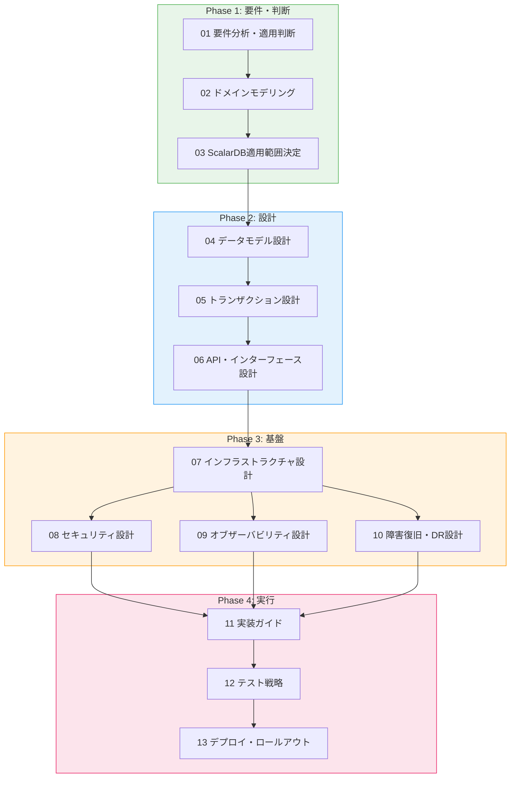
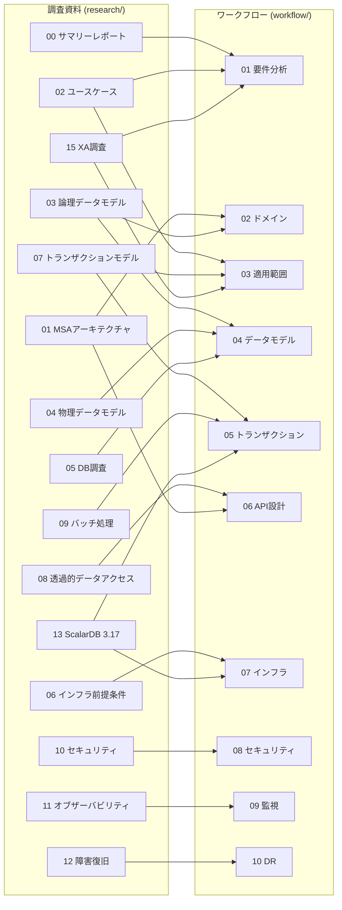

# ScalarDB x Microservices Implementation Planning Workflow

## Overview

This workflow is a guide for systematically developing an implementation plan for a microservices architecture using ScalarDB Cluster, proceeding phase by phase. It takes the deliverables from the investigation phase (`research/` directory) as input and produces an actionable implementation plan as output.

## Overall Flow

## Phase List

| フェーズ | ステップ | ファイル | 入力（調査資料） | 成果物 |
|---------|---------|---------|----------------|--------|
| **Phase 1** | 01 要件分析・適用判断 | [01_requirements_analysis.md](./01_requirements_analysis.md) | `00_summary`, `02_usecases`, `15_xa` | 要件一覧、ScalarDB適用判定結果 |
| | 02 ドメインモデリング | [02_domain_modeling.md](./02_domain_modeling.md) | `01_microservice`, `03_logical_data_model` | 境界コンテキスト図、集約設計 |
| | 03 ScalarDB適用範囲決定 | [03_scalardb_scope_decision.md](./03_scalardb_scope_decision.md) | `02_usecases`, `07_transaction`, `15_xa` | ScalarDB管理対象テーブル一覧 |
| **Phase 2** | 04 データモデル設計 | [04_data_model_design.md](./04_data_model_design.md) | `03_logical_data_model`, `04_physical_data_model`, `05_db_investigation` | スキーマ定義、DB選定結果 |
| | 05 トランザクション設計 | [05_transaction_design.md](./05_transaction_design.md) | `07_transaction_model`, `09_batch`, `13_317_deep_dive` | トランザクション境界定義 |
| | 06 API・インターフェース設計 | [06_api_interface_design.md](./06_api_interface_design.md) | `08_transparent_data_access`, `01_microservice` | API仕様、サービス間通信設計 |
| **Phase 3** | 07 インフラ設計 | [07_infrastructure_design.md](./07_infrastructure_design.md) | `06_infrastructure`, `13_317_deep_dive` | K8sマニフェスト、Helm values |
| | 08 セキュリティ設計 | [08_security_design.md](./08_security_design.md) | `10_security` | セキュリティポリシー、RBAC設計 |
| | 09 オブザーバビリティ設計 | [09_observability_design.md](./09_observability_design.md) | `11_observability` | ダッシュボード定義、アラートルール |
| | 10 障害復旧設計 | [10_disaster_recovery_design.md](./10_disaster_recovery_design.md) | `12_disaster_recovery` | DR計画、バックアップ設計 |
| **Phase 4** | 11 実装ガイド | [11_implementation_guide.md](./11_implementation_guide.md) | 全設計成果物 | 実装タスク一覧、優先順位 |
| | 12 テスト戦略 | [12_testing_strategy.md](./12_testing_strategy.md) | 全設計成果物 | テスト計画、品質基準 |
| | 13 デプロイ・ロールアウト | [13_deployment_rollout.md](./13_deployment_rollout.md) | `06_infrastructure`, `12_disaster_recovery` | デプロイ手順、カナリア計画 |

## Templates

| テンプレート | ファイル | 用途 |
|------------|---------|------|
| サービス設計書 | [templates/service_design_template.md](./templates/service_design_template.md) | 各マイクロサービスの設計書テンプレート |
| データモデル定義書 | [templates/data_model_template.md](./templates/data_model_template.md) | テーブル設計・スキーマ定義テンプレート |
| レビューチェックリスト | [templates/review_checklist.md](./templates/review_checklist.md) | 各フェーズ完了時のレビュー項目 |

## Research Document Mapping

## How to Use

1. **Proceed from Phase 1 in order**: Open each step's workflow file and follow the documented procedures.
2. **Make decisions at decision points**: Use the decision trees and checklists within each step to make and record your decisions.
3. **Use templates**: Copy the templates from `templates/` to create design documents for each service and table.
4. **Review checklists**: Verify quality using the review checklist at the end of each phase.
5. **Check references**: Review the relevant sections of the research materials (`research/` directory) referenced within each step.
