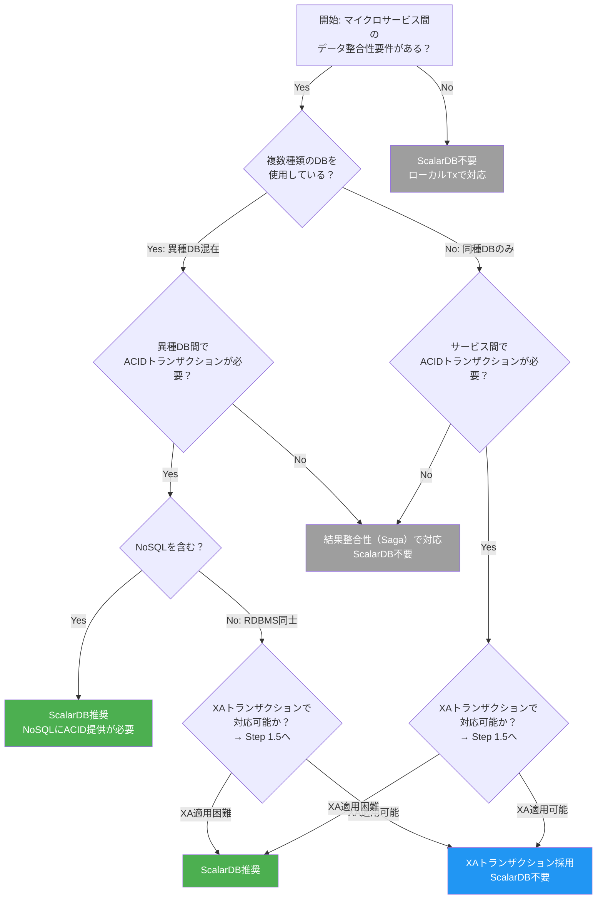
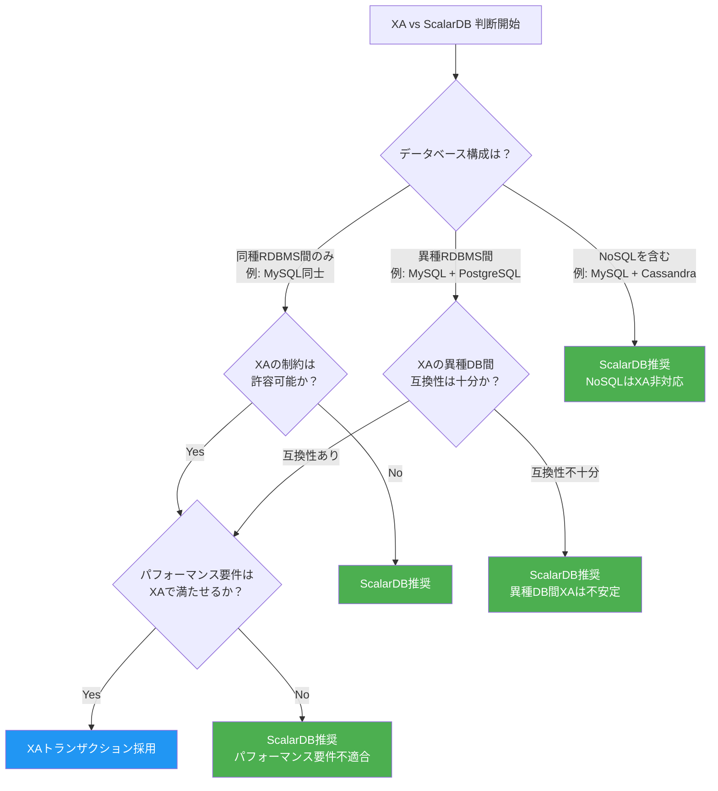

# Phase 1-1: 要件分析・ScalarDB適用判断

## 目的

システム要件を分析し、ScalarDBの適用が適切かを判断する。ビジネス要件と技術要件を体系的に整理し、複数データベースにまたがるトランザクション管理の必要性を評価した上で、ScalarDB導入の是非を決定する。

---

## 入力

| 入力物 | 説明 | 提供元 |
|--------|------|--------|
| ビジネス要件書 | 機能要件・非機能要件を含むビジネス要件 | プロダクトオーナー / ビジネスアナリスト |
| 既存システム構成図 | 現行システムのアーキテクチャ、DB構成、ネットワーク構成 | インフラチーム / アーキテクト |

---

## 参照資料

| 資料 | 参照箇所 | 用途 |
|------|----------|------|
| [`../research/00_summary_report.md`](../research/00_summary_report.md) | Section 2 | ScalarDBの全体像とユースケースの概要把握 |
| [`../research/02_scalardb_usecases.md`](../research/02_scalardb_usecases.md) | デシジョンツリー全体 | ScalarDB適用判断のデシジョンツリー |
| [`../research/15_xa_heterogeneous_investigation.md`](../research/15_xa_heterogeneous_investigation.md) | 全体 | XAトランザクションとScalarDBの比較判断基準 |

---

## ステップ

### Step 1.1: ビジネス要件の整理

機能要件と非機能要件を分類・整理する。

#### 要件分類表テンプレート

| 要件ID | カテゴリ | 要件名 | 説明 | 優先度 | 関連サービス | データ整合性要求 |
|--------|----------|--------|------|--------|-------------|-----------------|
| FR-001 | 機能要件 | （例: 注文処理） | | High/Mid/Low | | |
| FR-002 | 機能要件 | | | | | |
| NFR-001 | 非機能要件（性能） | | | | | |
| NFR-002 | 非機能要件（可用性） | | | | | |
| NFR-003 | 非機能要件（整合性） | | | | | |

**確認ポイント:**
- [ ] トランザクションの一貫性が求められるビジネスプロセスが明確か
- [ ] レイテンシ・スループットの数値目標が定義されているか
- [ ] データ損失許容度（RPO/RTO）が定義されているか

---

### Step 1.2: データベース要件の分析

現行DB構成を棚卸しし、データベースの種類と特性を特定する。

#### 現行DB棚卸しテンプレート

| DB名 | DB種類 | バージョン | 用途 | データ量 | 関連サービス | 備考 |
|------|--------|-----------|------|---------|-------------|------|
| | RDBMS (MySQL/PostgreSQL等) | | | | | |
| | NoSQL (Cassandra/DynamoDB等) | | | | | |
| | NewSQL (CockroachDB等) | | | | | |

**確認ポイント:**
- [ ] 使用中のDB種類を全て列挙したか
- [ ] 同種DBのみか、異種DBが混在しているかを判定したか
- [ ] 各DBの接続方式（直接接続 / ORM / DB Proxy等）を確認したか

---

### Step 1.3: トランザクション要件の分析

どのサービス間でACIDトランザクションが必要か、結果整合性で十分かを分析する。

#### トランザクション要件マトリクス

| ビジネスプロセス | 関連サービス | 整合性要求レベル | 理由 | 頻度 |
|-----------------|-------------|-----------------|------|------|
| （例: 注文確定） | 注文、在庫、決済 | 強整合性（ACID） | 在庫と決済の不整合が許容不可 | 高 |
| （例: ポイント付与） | 注文、ポイント | 結果整合性（Saga） | 遅延は許容可能 | 中 |

**整合性要求レベルの判定基準:**

| レベル | 説明 | 適用条件 |
|--------|------|---------|
| 強整合性（ACID） | 即時の一貫性が必要 | 金銭取引、在庫管理等 |
| 結果整合性（Saga） | 最終的に一貫すればよい | 通知、ポイント付与等 |
| ローカルTx | 単一サービス内で完結 | サービス内部のCRUD |

---

### Step 1.4: ScalarDB適用判断

以下のデシジョンツリーに従い、ScalarDBの適用可否を判断する。`02_scalardb_usecases.md` のデシジョンツリーを参照のこと。



#### 判定基準チェック

| # | 判定基準 | Yes/No | 備考 |
|---|---------|--------|------|
| 1 | 複数種類のDBを使用しているか？ | | |
| 2 | 異種DB間でACIDトランザクションが必要か？ | | |
| 3 | NoSQL（Cassandra, DynamoDB等）を含むか？ | | |
| 4 | XAトランザクションで対応可能か？（Step 1.5で詳細判断） | | |
| 5 | サービス間の強整合性が必須のビジネスプロセスがあるか？ | | |

---

### Step 1.5: XA vs ScalarDB判断

`15_xa_heterogeneous_investigation.md` の調査結果に基づき、XAトランザクションとScalarDBのどちらが適切かを判断する。



#### XA vs ScalarDB 比較判定表

| 判定項目 | XAトランザクション | ScalarDB | 自システムの状況 |
|---------|-------------------|----------|-----------------|
| 同種RDBMS間のみ | 対応可 | 対応可 | |
| 異種RDBMS間 | 限定的（互換性問題あり） | 対応可 | |
| NoSQL含む | 非対応 | 対応可 | |
| パフォーマンス | 2PC overhead大 | OCC方式によるロック競合の軽減。Group Commit最適化で高スループット（ただし2PC Interface利用時は調整コストあり） | |
| 運用複雑度 | TMの管理が必要 | ScalarDB Clusterで管理 | |
| 障害復旧 | Heuristic例外のリスク | 自動リカバリ | |
| ベンダーロックイン | 標準仕様（JTA/XA） | ScalarDB依存 | |

**判定結果:**

```
[ ] XAトランザクションを採用
[ ] ScalarDBを採用
判定理由: _______________________________________________
```

---

## 成果物

| 成果物 | 説明 | テンプレート |
|--------|------|-------------|
| 要件分析書 | 機能要件・非機能要件の分類、トランザクション要件の整理 | 上記テンプレートを使用 |
| ScalarDB適用判定結果 | デシジョンツリーに基づく判定結果と根拠 | 判定基準チェック表 + 判定理由 |
| XA vs ScalarDB判断結果 | XAとScalarDBの比較検討結果 | 比較判定表 |

---

## 完了基準チェックリスト

- [ ] 全てのビジネス要件が機能要件・非機能要件に分類されている
- [ ] 現行DB構成の棚卸しが完了し、DB種類が全て特定されている
- [ ] トランザクション要件が「強整合性」「結果整合性」「ローカルTx」に分類されている
- [ ] デシジョンツリーに従いScalarDB適用判断が下されている
- [ ] XA vs ScalarDBの比較判断が根拠とともに記録されている
- [ ] 判定結果について関係者（アーキテクト、テックリード）の合意が得られている
- [ ] 要件分析書が作成され、レビューが完了している

---

## 次のステップへの引き継ぎ事項

### Phase 1-2: ドメインモデリング（`02_domain_modeling.md`）への引き継ぎ

| 引き継ぎ項目 | 内容 |
|-------------|------|
| トランザクション要件マトリクス | どのサービス間で強整合性が必要かの情報 |
| DB構成情報 | 使用するDB種類とその特性 |
| ScalarDB適用判定結果 | ScalarDB導入する場合の前提条件 |
| 非機能要件 | レイテンシ、スループット、可用性の目標値 |

**注意事項:**
- ScalarDB適用判定が「不要」となった場合、以降のScalarDB関連ステップはスキップし、通常のマイクロサービス設計フローに移行する
- ScalarDB適用判定が「推奨」となった場合、Phase 1-2ではサービス間トランザクション境界を特に意識したドメインモデリングが必要になる
