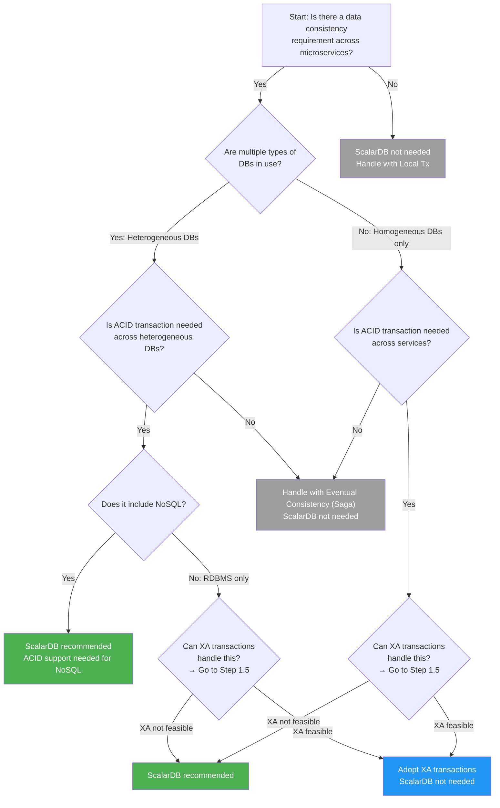
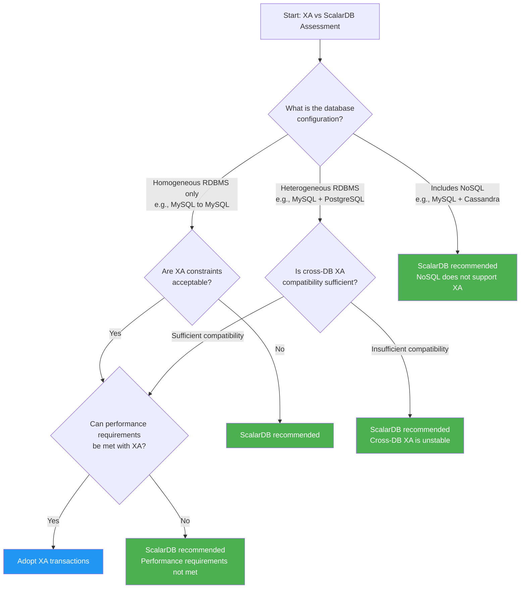

# Phase 1-1: Requirements Analysis and ScalarDB Applicability Assessment

## Purpose

Analyze system requirements and determine whether applying ScalarDB is appropriate. Systematically organize business and technical requirements, evaluate the need for transaction management across multiple databases, and decide whether to adopt ScalarDB.

---

## Inputs

| Input | Description | Source |
|-------|-------------|--------|
| Business Requirements Document | Business requirements including functional and non-functional requirements | Product Owner / Business Analyst |
| Existing System Architecture Diagram | Current system architecture, DB configuration, network topology | Infrastructure Team / Architect |

---

## Reference Materials

| Document | Section | Purpose |
|----------|---------|---------|
| [`../research/00_summary_report.md`](../research/00_summary_report.md) | Section 2 | Overview of ScalarDB and its use cases |
| [`../research/02_scalardb_usecases.md`](../research/02_scalardb_usecases.md) | Full decision tree | Decision tree for ScalarDB applicability assessment |
| [`../research/15_xa_heterogeneous_investigation.md`](../research/15_xa_heterogeneous_investigation.md) | Full document | Criteria for comparing XA transactions and ScalarDB |

---

## Steps

### Step 1.1: Organizing Business Requirements

Classify and organize functional and non-functional requirements.

#### Requirements Classification Table Template

| Requirement ID | Category | Requirement Name | Description | Priority | Related Services | Data Consistency Requirement |
|----------------|----------|------------------|-------------|----------|-----------------|------------------------------|
| FR-001 | Functional Requirement | (e.g., Order Processing) | | High/Mid/Low | | |
| FR-002 | Functional Requirement | | | | | |
| NFR-001 | Non-Functional Requirement (Performance) | | | | | |
| NFR-002 | Non-Functional Requirement (Availability) | | | | | |
| NFR-003 | Non-Functional Requirement (Consistency) | | | | | |

**Checkpoints:**
- [ ] Are the business processes requiring transactional consistency clearly identified?
- [ ] Are numerical targets for latency and throughput defined?
- [ ] Are data loss tolerances (RPO/RTO) defined?

---

### Step 1.2: Database Requirements Analysis

Inventory the current DB configuration and identify database types and characteristics.

#### Current DB Inventory Template

| DB Name | DB Type | Version | Purpose | Data Volume | Related Services | Notes |
|---------|---------|---------|---------|-------------|-----------------|-------|
| | RDBMS (MySQL/PostgreSQL, etc.) | | | | | |
| | NoSQL (Cassandra/DynamoDB, etc.) | | | | | |
| | NewSQL (CockroachDB, etc.) | | | | | |

**Checkpoints:**
- [ ] Have all DB types in use been enumerated?
- [ ] Has it been determined whether only homogeneous DBs or heterogeneous DBs are present?
- [ ] Has the connection method for each DB been confirmed (direct connection / ORM / DB Proxy, etc.)?

---

### Step 1.3: Transaction Requirements Analysis

Analyze which services require ACID transactions and which can tolerate eventual consistency.

#### Transaction Requirements Matrix

| Business Process | Related Services | Consistency Requirement Level | Reason | Frequency |
|-----------------|-----------------|-------------------------------|--------|-----------|
| (e.g., Order Confirmation) | Order, Inventory, Payment | Strong Consistency (ACID) | Inconsistency between inventory and payment is unacceptable | High |
| (e.g., Points Allocation) | Order, Points | Eventual Consistency (Saga) | Delay is acceptable | Medium |

**Criteria for Consistency Requirement Levels:**

| Level | Description | Applicable Conditions |
|-------|-------------|----------------------|
| Strong Consistency (ACID) | Immediate consistency required | Financial transactions, inventory management, etc. |
| Eventual Consistency (Saga) | Eventually consistent is sufficient | Notifications, points allocation, etc. |
| Local Tx | Completed within a single service | CRUD within a service |

---

### Step 1.4: ScalarDB Applicability Assessment

Follow the decision tree below to assess ScalarDB applicability. Refer to the decision tree in `02_scalardb_usecases.md`.



#### Assessment Criteria Checklist

| # | Criterion | Yes/No | Notes |
|---|-----------|--------|-------|
| 1 | Are multiple types of DBs in use? | | |
| 2 | Is ACID transaction needed across heterogeneous DBs? | | |
| 3 | Does it include NoSQL (Cassandra, DynamoDB, etc.)? | | |
| 4 | Can XA transactions handle this? (Detailed assessment in Step 1.5) | | |
| 5 | Are there business processes requiring strong consistency across services? | | |

---

### Step 1.5: XA vs ScalarDB Assessment

Based on the findings in `15_xa_heterogeneous_investigation.md`, determine whether XA transactions or ScalarDB is more appropriate.



#### XA vs ScalarDB Comparison Table

| Criterion | XA Transactions | ScalarDB | Your System's Situation |
|-----------|----------------|----------|------------------------|
| Homogeneous RDBMS only | Supported | Supported | |
| Heterogeneous RDBMS | Limited (compatibility issues) | Supported | |
| Includes NoSQL | Not supported | Supported | |
| Performance | Large 2PC overhead | Reduced lock contention via OCC. High throughput with Group Commit optimization (though adjustment costs apply when using the 2PC Interface) | |
| Operational complexity | TM management required | Managed by ScalarDB Cluster | |
| Failure recovery | Risk of heuristic exceptions | Automatic recovery | |
| Vendor lock-in | Standard specification (JTA/XA) | ScalarDB dependency | |

**Assessment Result:**

```
[ ] Adopt XA transactions
[ ] Adopt ScalarDB
Rationale: _______________________________________________
```

---

## Deliverables

| Deliverable | Description | Template |
|-------------|-------------|----------|
| Requirements Analysis Document | Classification of functional/non-functional requirements, organization of transaction requirements | Use the templates above |
| ScalarDB Applicability Assessment Result | Assessment result and rationale based on the decision tree | Assessment criteria checklist + rationale |
| XA vs ScalarDB Assessment Result | Comparative evaluation result of XA and ScalarDB | Comparison table |

---

## Completion Criteria Checklist

- [ ] All business requirements have been classified into functional and non-functional requirements
- [ ] Current DB configuration inventory is complete and all DB types have been identified
- [ ] Transaction requirements have been classified into "Strong Consistency," "Eventual Consistency," and "Local Tx"
- [ ] ScalarDB applicability assessment has been made following the decision tree
- [ ] XA vs ScalarDB comparison assessment has been documented with rationale
- [ ] Assessment results have been agreed upon by stakeholders (architects, tech leads)
- [ ] Requirements analysis document has been created and reviewed

---

## Handoff Items for the Next Step

### Handoff to Phase 1-2: Domain Modeling (`02_domain_modeling.md`)

| Handoff Item | Content |
|--------------|---------|
| Transaction Requirements Matrix | Information on which services require strong consistency |
| DB Configuration Information | DB types in use and their characteristics |
| ScalarDB Applicability Assessment Result | Prerequisites for ScalarDB adoption |
| Non-Functional Requirements | Target values for latency, throughput, and availability |

**Notes:**
- If the ScalarDB applicability assessment concludes "not needed," skip all subsequent ScalarDB-related steps and proceed with the standard microservice design flow
- If the ScalarDB applicability assessment concludes "recommended," Phase 1-2 will require domain modeling with particular attention to inter-service transaction boundaries
